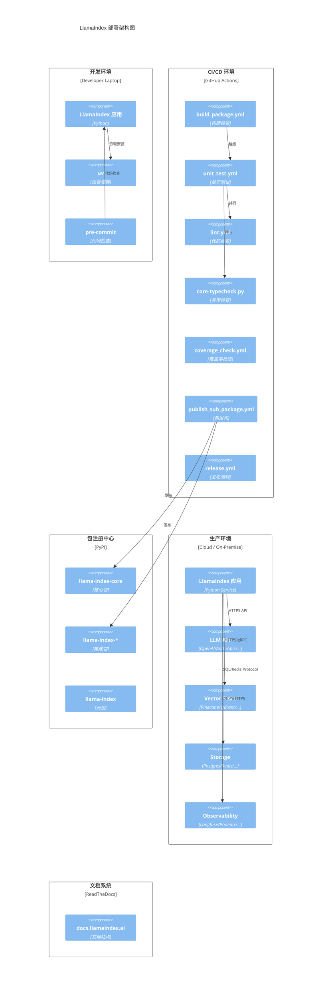

# 第 9 章：部署、运维与基础设施

> 本章描述 LlamaIndex 的部署架构、CI/CD 配置、监控、日志、告警和备份方案。

---

## 9.1 部署架构图

### 9.1.1 Mermaid 部署架构图



### 9.1.2 开发环境

| 组件 | 工具 | 说明 |
|------|------|------|
| **包管理** | uv | 现代 Python 包管理器，替代 pip/poetry |
| **构建** | hatchling | PEP 517 构建后端 |
| **代码检查** | pre-commit | Git 提交前钩子 |
| **测试** | pytest + pytest-asyncio | 测试框架 |
| **类型检查** | mypy | 静态类型检查 |
| **文档** | sphinx + ReadTheDocs | 文档构建 |

### 9.1.3 生产环境部署模式

#### 模式 1: 嵌入式部署（最常见）

LlamaIndex 作为库嵌入应用：

```python
# FastAPI 示例
from fastapi import FastAPI
from llama_index.core import VectorStoreIndex, SimpleDirectoryReader

app = FastAPI()
index = VectorStoreIndex.from_documents(documents)

@app.post("/query")
async def query(q: str):
    response = await index.as_query_engine().aquery(q)
    return {"answer": response.response}
```

#### 模式 2: Docker 容器化

```dockerfile
FROM python:3.11-slim
WORKDIR /app
COPY pyproject.toml uv.lock ./
RUN uv sync --frozen
COPY . .
EXPOSE 8000
CMD ["uv", "run", "uvicorn", "main:app", "--host", "0.0.0.0"]
```

#### 模式 3: Kubernetes 部署

```yaml
apiVersion: apps/v1
kind: Deployment
metadata:
  name: llamaindex-app
spec:
  replicas: 3
  template:
    spec:
      containers:
      - name: app
        image: llamaindex-app:latest
        env:
        - name: OPENAI_API_KEY
          valueFrom:
            secretKeyRef:
              name: api-keys
              key: openai
        resources:
          requests:
            memory: "512Mi"
            cpu: "500m"
          limits:
            memory: "2Gi"
            cpu: "2000m"
```

---

## 9.2 CI/CD 配置

### 9.2.1 GitHub Actions 工作流

| 工作流文件 | 触发条件 | 说明 |
|------------|----------|------|
| `build_package.yml` | PR / Push | 构建包检查 |
| `unit_test.yml` | PR / Push | 单元测试 |
| `lint.yml` | PR / Push | 代码风格检查 |
| `core-typecheck.yml` | PR / Push | 核心包类型检查 |
| `coverage_check.yml` | PR / Push | 覆盖率检查 |
| `publish_sub_package.yml` | Release | 子包发布 |
| `release.yml` | Tag | 正式发布 |
| `pre_release.yml` | 手动触发 | 预发布 |
| `sync-docs.yml` | 定时 | 文档同步 |
| `codeql.yml` | PR / Push | 代码安全扫描 |
| `stale_bot.yml` | 定时 | 过期 Issue/PR 管理 |
| `issue_classifier.yml` | Issue 创建 | Issue 自动分类 |
| `close_new_integration_prs.yml` | PR 创建 | 关闭不符合规范的集成 PR |
| `llama_dev_tests.yml` | PR / Push | llama-dev CLI 测试 |

### 9.2.2 pre-commit 配置

`.pre-commit-config.yaml` 包含以下钩子：

1. **pre-commit-hooks**:
   - `check-byte-order-marker`: BOM 检查
   - `check-merge-conflict`: 合并冲突检查
   - `check-symlinks`: 符号链接检查
   - `check-toml` / `check-yaml`: 格式检查
   - `detect-private-key`: 私钥检测
   - `end-of-file-fixer`: 文件末尾修复
   - `trailing-whitespace`: 尾随空格

2. **ruff**: Lint + Format（替代 black/flake8/isort）

3. **mypy**: 静态类型检查（带类型 stubs）

4. **black-jupyter**: Jupyter notebook 格式化（docs/examples）

5. **blacken-docs**: 文档中的代码块格式化

6. **prettier**: Markdown/YAML 格式化

7. **codespell**: 拼写检查

8. **nb-clean**: Notebook 清洗

9. **toml-sort**: TOML 格式化

### 9.2.3 发布流程

**`scripts/publish_packages.sh`**:
```bash
# 迭代发布，失败重试 3 次
for package in "${packages[@]}"; do
    cd "$package"
    poetry lock
    poetry publish --build
    cd -
done
```

**发布步骤**:
1. 更新版本号（`bulk-version-bump.py`）
2. 生成 Changelog
3. 运行完整测试
4. 构建包（`hatchling build`）
5. 发布到 PyPI（`poetry publish`）
6. 创建 GitHub Release
7. 同步文档

---

## 9.3 监控、日志、告警

### 9.3.1 Instrumentation 系统

LlamaIndex 的 Instrumentation 系统是生产监控的核心：

```python
import llama_index.core.instrumentation as instrument

# 获取 dispatcher
dispatcher = instrument.get_dispatcher(__name__)

# 自定义事件处理器
class MyEventHandler(instrument.BaseEventHandler):
    def handle(self, event):
        # 发送到监控系统
        send_to_datadog(event)

# 注册处理器
dispatcher.add_event_handler(MyEventHandler())
```

### 9.3.2 可观测性集成

LlamaIndex 支持 12+ 可观测性平台：

| 平台 | 集成包 | 说明 |
|------|--------|------|
| **Langfuse** | `llama-index-callbacks-langfuse` | LLM 可观测平台 |
| **Phoenix (Arize)** | `llama-index-callbacks-arize-phoenix` | LLM 追踪 |
| **Weights & Biases** | `llama-index-callbacks-wandb` | 实验追踪 |
| **OpenInference** | `llama-index-callbacks-openinference` | 开源可观测 |
| **Opik** | `llama-index-callbacks-opik` | LLM 评估 |
| **Literal AI** | `llama-index-callbacks-literalai` | LLM 日志 |
| **AgentOps** | `llama-index-callbacks-agentops` | Agent 可观测 |
| **Aim** | `llama-index-callbacks-aim` | 实验追踪 |
| **PromptLayer** | `llama-index-callbacks-promptlayer` | Prompt 管理 |
| **Honey Hive** | `llama-index-callbacks-honeyhive` | AI 可观测 |
| **UpTrain** | `llama-index-callbacks-uptrain` | LLM 评估 |
| **Argilla** | `llama-index-callbacks-argilla` | 数据标注 |

### 9.3.3 事件类型

```python
# LLM 事件
LLMPredictStartEvent / LLMPredictEndEvent
LLMStructuredPredictStartEvent / LLMStructuredPredictEndEvent

# Embedding 事件
EmbeddingStartEvent / EmbeddingEndEvent

# 检索事件
RetrievalStartEvent / RetrievalEndEvent

# 查询事件
QueryStartEvent / QueryEndEvent

# 合成事件
SynthesisStartEvent / SynthesisEndEvent

# Agent 事件
AgentStartEvent / AgentEndEvent

# 重排事件
RerankStartEvent / RerankEndEvent

# 异常事件
ExceptionEvent

# Span 事件
SpanDropEvent
```

### 9.3.4 日志策略

```python
import logging

# LlamaIndex 使用标准 logging 模块
logger = logging.getLogger(__name__)

# 推荐配置
logging.basicConfig(
    level=logging.INFO,
    format="%(asctime)s - %(name)s - %(levelname)s - %(message)s"
)

# 关键日志点
logger.info("Index built with %d nodes", len(nodes))
logger.warning("Retry %d for API call", retry_count)
logger.error("Failed to call LLM: %s", error)
```

### 9.3.5 告警方案

推荐的告警配置：

| 指标 | 告警阈值 | 说明 |
|------|----------|------|
| **LLM 错误率** | > 5% | API 调用失败率过高 |
| **LLM 延迟** | > 10s | API 响应时间过长 |
| **Embedding 错误率** | > 1% | Embedding 计算失败 |
| **检索延迟** | > 2s | 向量检索过慢 |
| **Agent 迭代次数** | > max_iterations * 0.8 | Agent 接近迭代上限 |
| **Token 消耗** | > 预算阈值 | 成本告警 |

---

## 9.4 备份方案

### 9.4.1 存储持久化

```python
# StorageContext 持久化
storage_context = StorageContext.from_defaults(persist_dir="./storage")

# 加载
storage_context = StorageContext.from_defaults(persist_dir="./storage")

# 备份
import shutil
shutil.copytree("./storage", "./storage_backup")
```

### 9.4.2 持久化目录结构

```
storage/
├── docstore.json          # 文档备份
├── index_store.json       # 索引备份
├── vector_store.json      # 向量备份（SimpleVectorStore）
├── graph_store.json       # 图备份
└── property_graph.json    # 属性图备份
```

### 9.4.3 增量备份策略

- **DocStore**: 全量 JSON 备份
- **VectorStore**: 依赖底层存储的备份机制（如 Pinecone 自动备份）
- **IndexStore**: 全量 JSON 备份
- **IngestionCache**: 可选备份（可重建）

---

## 9.5 集成健康检查

### 9.5.1 `scripts/integration_health_check.py`

该脚本计算集成包的**相对健康分数**（0-1）：

**评估维度**:
| 指标 | 权重 | 说明 |
|------|------|------|
| **download_ratio** | 40% | PyPI 下载量比值 |
| **test_score** | 50% | 测试覆盖率/质量 |
| **commit_ratio** | 10% | 提交活跃度 |

**使用示例**:
```bash
python integration_health_check.py llama-index-integrations/llms/llama-index-llms-openai
# 输出: 0.38 (相对于 llama-index-core)
```

---

## 9.6 开发工具链

### 9.6.1 llama-dev CLI

`llama-dev` 是官方 Monorepo 开发 CLI：

```bash
# 包管理
llama-dev pkg info <package>
llama-dev pkg exec --all "pytest"
llama-dev pkg bump <package> --version 0.2.0

# 测试编排
llama-dev test --base-ref origin/main --workers 8
llama-dev test --cov --cov-fail-under 80

# 发布
llama-dev release check
llama-dev release changelog
llama-dev release prepare
```

### 9.6.2 Makefile 命令

```bash
make format    # 运行 black 格式化
make lint      # 运行 pre-commit + mypy
make test      # 运行测试（pants）
make test-core # 仅测试核心包
make watch-docs # 文档实时预览
```

---

## 9.7 小结

本章描述了 LlamaIndex 的部署运维体系：

1. **部署架构**: 开发环境 → CI/CD → PyPI → 生产环境
2. **CI/CD**: GitHub Actions 14 个工作流 + pre-commit 9 种钩子
3. **监控**: Instrumentation 系统 + 12+ 可观测性平台集成
4. **日志**: 标准 logging + 结构化事件
5. **备份**: StorageContext 持久化 + 增量备份
6. **工具链**: llama-dev CLI + Makefile

在下一章中，我们将分析改进建议、风险点与未来规划。

---

☕️ 制作不易，请我喝咖啡☕️关注我➕

