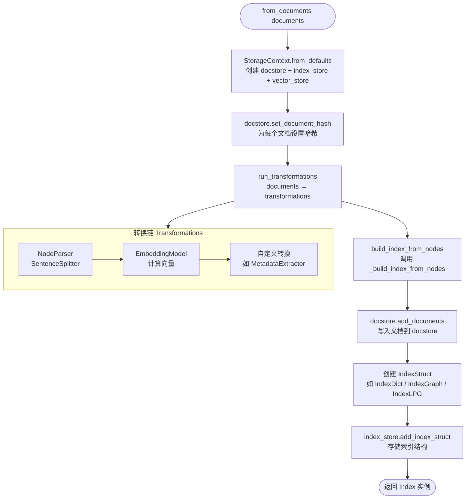
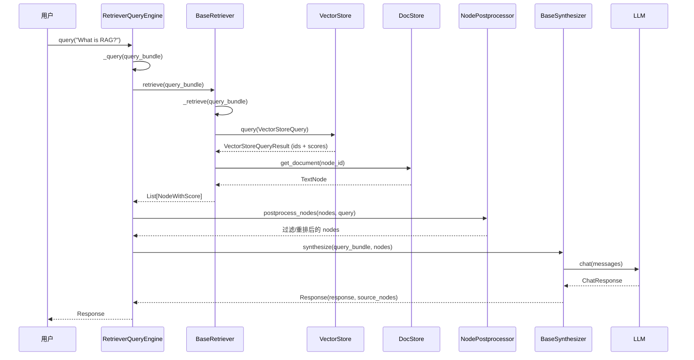
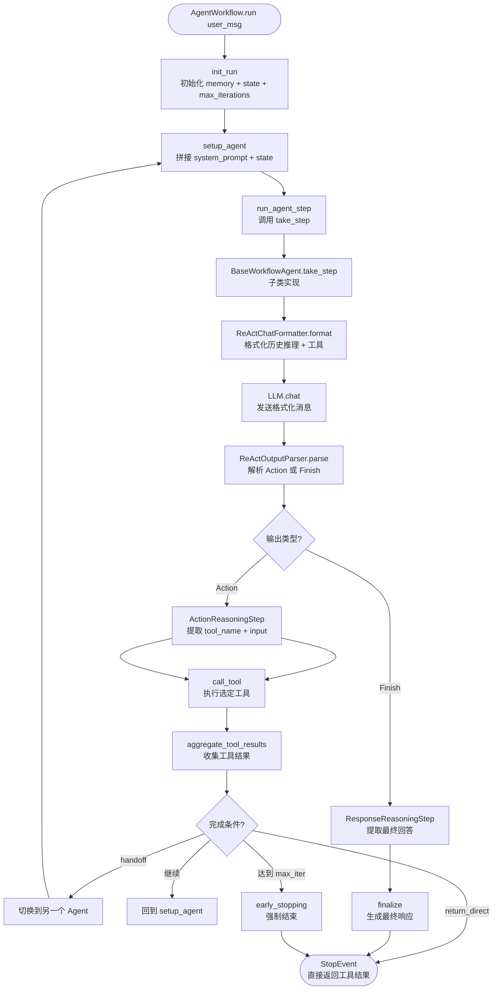
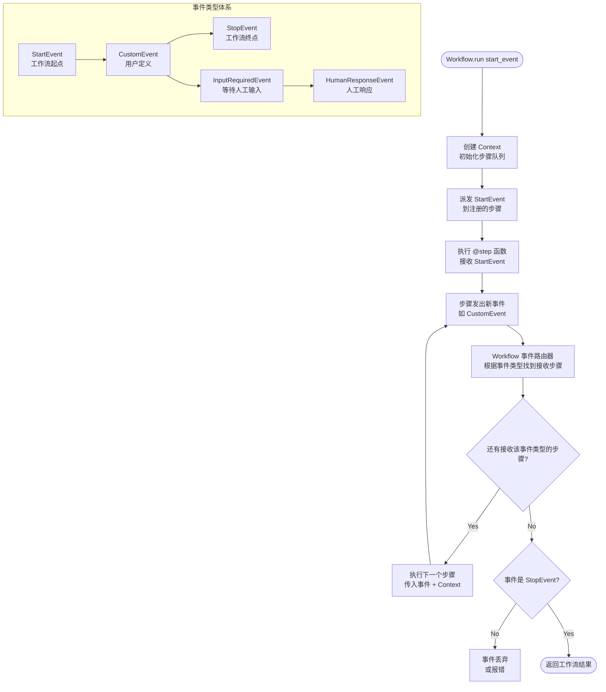
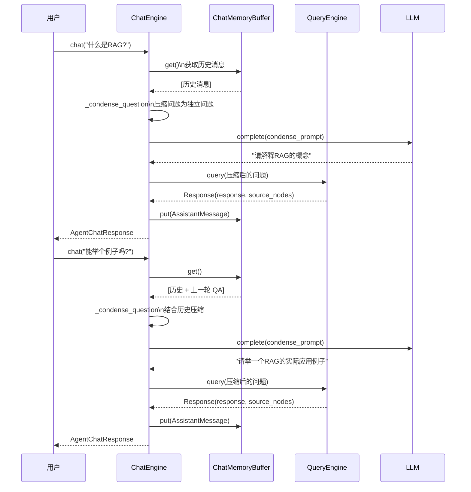
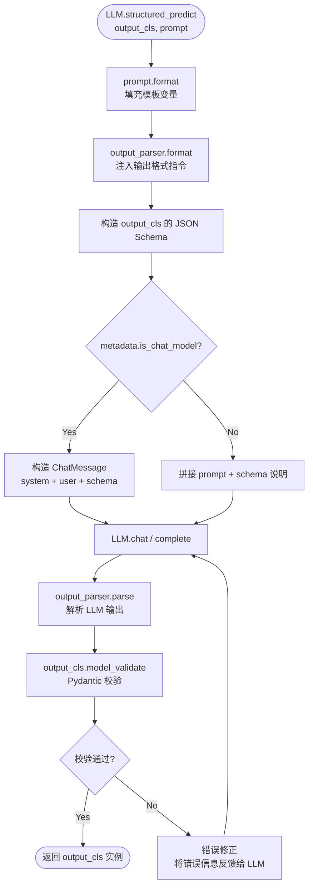
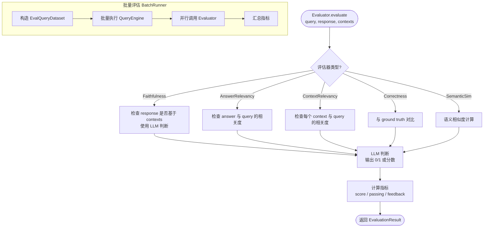
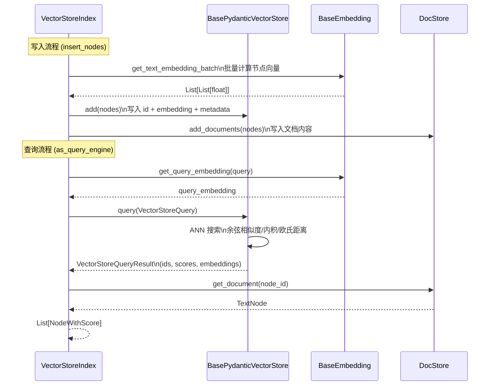
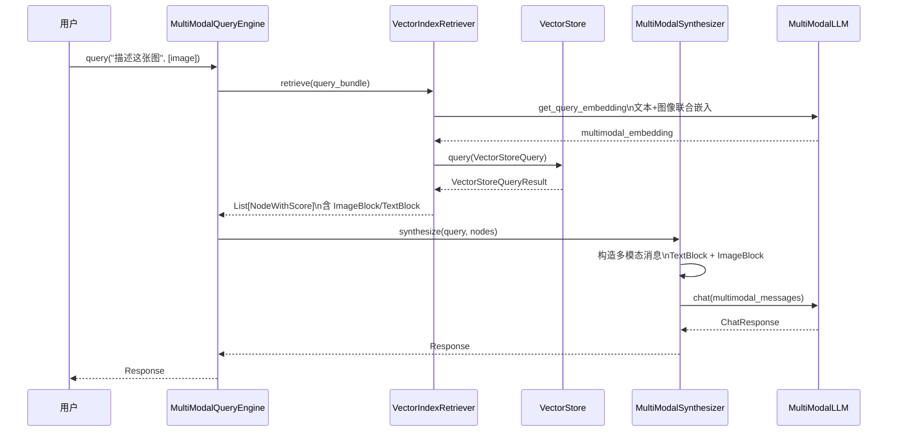

# 第 3 章：系统流程与时序图

> 本章通过 Mermaid 流程图（flowchart）和时序图（sequence diagram）详细描述 LlamaIndex 的 10 个核心业务流程。每个图表均附详细文字说明。

---

## 3.1 文档摄入流程（Ingestion Pipeline）

### 3.1.1 Mermaid 流程图

```mermaid
flowchart TD                                                                                                                                                               
      Start([用户调用 IngestionPipeline.run]) --> Prepare[_prepare_inputs\n合并 documents + nodes + readers 的输出]                                                          
      Prepare --> HasDocstore{docstore 存在?}                                                                                                                                
      HasDocstore -->|Yes, UPSERT| Upserts[_handle_upserts\n按 ref_doc_id 检查哈希\n新增/更新/跳过]                                                                          
      HasDocstore -->|Yes, DUPLICATES| Dedup[_handle_duplicates\n仅按哈希去重]                                                                                               
      HasDocstore -->|No| RunTrans[直接运行转换链]                                                                                                                           
      Upserts --> NumWorkers{num_workers > 1?}                                                                                                                               
      Dedup --> NumWorkers                                                                                                                                                   
      NumWorkers -->|Yes| Parallel[ProcessPoolExecutor\n分批次并行执行]                                                                                                      
      NumWorkers -->|No| Sequential[串行执行转换链]                                                                                                                          
      Parallel --> MergeCache[合并各进程缓存结果]                                                                                                                            
      Sequential --> Transform[遍历每个 TransformComponent]                                                                                                                  
      MergeCache --> Transform                                                                                                                                               
      Transform --> CacheCheck{启用缓存?}                                                                                                                                    
      CacheCheck -->|Yes| HashCheck[计算 transformation_hash\n命中则跳过\n未命中则执行并写入缓存]                                                                            
      CacheCheck -->|No| ExecTrans[直接执行 transform]                                                                                                                       
      HashCheck --> ExecTrans                                                                                                                                                
      ExecTrans --> MoreTransforms{还有更多转换?}                                                                                                                            
      MoreTransforms -->|Yes| Transform                                                                                                                                      
      MoreTransforms -->|No| VectorStoreAdd{vector_store 存在?}                                                                                                              
      VectorStoreAdd -->|Yes| VSAdd[vector_store.add\n写入带嵌入的节点]                                                                                                      
      VectorStoreAdd -->|No| DocstoreUpdate                                                                                                                                  
      VSAdd --> DocstoreUpdate[_update_docstore\n写入 docstore]                                                                                                              
      DocstoreUpdate --> Return(["返回 Sequence[BaseNode]"])
```



### 3.1.2 详细解释

**流程入口**: `IngestionPipeline.run(documents=..., nodes=..., num_workers=N)`

**核心文件**: `llama-index-core/llama_index/core/ingestion/pipeline.py`

**步骤分解**:

1. **`_prepare_inputs(documents, nodes)`** (行 429-449): 合并多种输入源——直接传入的 `documents`、`nodes`、构造函数中的 `self.documents`、以及 `self.readers` 的读取结果。Reader 通过 `reader.read()` 返回 `List[Document]`。

2. **去重策略选择** (行 451-507):
   - `DocstoreStrategy.UPSERTS`: 按 `ref_doc_id` 检查哈希。不存在 → 新增；哈希变化 → 删除旧版 + 新增；相同 → 跳过。
   - `DocstoreStrategy.DUPLICATES_ONLY`: 仅按哈希去重，不处理更新。
   - `DocstoreStrategy.UPSERTS_AND_DELETE`: 在 UPSERTS 基础上，删除本次未出现的旧文档。

3. **并行/串行执行** (行 509-646):
   - `num_workers > 1`: 使用 `ProcessPoolExecutor`（spawn 模式）分批次并行。每个 worker 执行 `_run_transformations_worker`，返回 `(nodes, cache_entries)` 元组，主进程合并缓存。
   - `num_workers = None`: 串行执行 `run_transformations()`。

4. **转换链执行** (`run_transformations`, 行 72-112): 遍历 `TransformComponent` 列表。每个转换接收 `nodes` 返回转换后的 `nodes`。支持缓存——通过 `get_transformation_hash(nodes, transform)` 计算 SHA256 哈希，命中缓存则跳过执行。

5. **向量存储写入** (行 650-653): 过滤出带 `embedding` 的节点，调用 `vector_store.add()` 写入。

6. **文档存储更新** (`_update_docstore`, 行 518-536): 根据策略写入文档哈希和文档内容。

**异常处理**:
- `num_workers > CPU 数`: 自动降级到 CPU 数并发出警告
- `docstore_strategy=UPSERTS` 但无 `vector_store`: 降级为 `DUPLICATES_ONLY`
- 进程池异常: 传播到调用方

---

## 3.2 索引构建流程（Index Construction）

### 3.2.1 Mermaid 流程图



### 3.2.2 详细解释

**流程入口**: `VectorStoreIndex.from_documents(documents, storage_context, transformations)`

**核心文件**:
- `llama-index-core/llama_index/core/indices/base.py` (行 88-120)
- `llama-index-core/llama_index/core/indices/vector_store/base.py`

**步骤分解**:

1. **StorageContext 创建**: 默认创建 `SimpleDocumentStore` + `SimpleIndexStore` + 默认 `VectorStore`。用户可传入自定义 context。

2. **文档哈希设置**: 在 `from_documents` 中，遍历文档并为每个文档设置 `docstore.set_document_hash(doc.id_, doc.hash)`，用于后续去重。

3. **转换链执行** (`run_transformations`): 默认转换链为 `[SentenceSplitter(), Settings.embed_model]`：
   - `SentenceSplitter`: 将 Document 切分为 TextNode（默认 chunk_size=512）
   - `EmbedModel`: 为每个 Node 计算 embedding

4. **索引结构构建** (`_build_index_from_nodes`): 不同索引类型有不同实现：
   - `VectorStoreIndex`: 创建 `IndexDict`，将节点存入 vector_store
   - `TreeIndex`: 自底向上聚类构建摘要树
   - `PropertyGraphIndex`: 抽取实体关系构建属性图

5. **持久化注册**: `index_store.add_index_struct(index_struct)` 将索引结构注册到存储中。

**设计 Rationale**:
- `from_documents` 是类方法，返回具体 Index 实例
- `build_index_from_nodes` 是实例方法，支持增量添加
- 转换链与索引构建解耦，便于复用

---

## 3.3 RAG 查询流程（Retrieve → Postprocess → Synthesize）

### 3.3.1 Mermaid 时序图



### 3.3.2 详细解释

**流程入口**: `query_engine.query("What is RAG?")`

**核心文件**:
- `llama-index-core/llama_index/core/query_engine/retriever_query_engine.py`
- `llama-index-core/llama_index/core/base/base_retriever.py`
- `llama-index-core/llama_index/core/response_synthesizers/`

**步骤分解**:

1. **`QueryEngine.query(str_or_query_bundle)`** (BaseQueryEngine, 行 ~50):
   - 将字符串包装为 `QueryBundle`
   - 触发 `CBEventType.QUERY` 回调事件
   - 调用 `_query(query_bundle)`（子类实现）

2. **`RetrieverQueryEngine.retrieve(query_bundle)`** (行 160-162):
   - 调用 `self._retriever.retrieve(query_bundle)`
   - 应用所有 `node_postprocessors`（Rerank、MetadataReplacement 等）

3. **`VectorIndexRetriever._retrieve(query_bundle)`**:
   - 将 query 文本通过 Embedding 模型转为向量
   - 构造 `VectorStoreQuery`（query_embedding + similarity_top_k + filters）
   - 调用 `vector_store.query()` 返回 top-k 相似节点
   - 从 docstore 获取完整 TextNode 内容
   - 包装为 `List[NodeWithScore]`

4. **后处理** (`_apply_node_postprocessors`): 依次执行所有 postprocessor：
   - `LLMRerank`: 用 LLM 重新排序
   - `CohereRerank`: 用 Cohere rerank API
   - `MetadataReplacementPostProcessor`: 替换节点内容

5. **响应合成** (`BaseSynthesizer.synthesize`):
   - 构造 Prompt：将 query + 检索到的 node 内容填入模板
   - 调用 `LLM.chat(messages)` 获取回答
   - 返回 `Response(response_str, source_nodes, metadata)`

**关键设计点**:
- `retrieve()` 和 `synthesize()` 暴露为公共方法，支持单独调用
- 流式版本：`aquery()` 使用 `astream_chat()` 逐 token 返回
- 多模态版本：`multimodal=True` 时传递 ImageBlock/AudioBlock

---

## 3.4 Agent ReAct 循环流程

### 3.4.1 Mermaid 流程图



### 3.4.2 详细解释

**流程入口**: `agent.run(user_msg)` 或 `agent.arun(user_msg)`

**核心文件**:
- `llama-index-core/llama_index/core/agent/workflow/base_agent.py`
- `llama-index-core/llama_index/core/agent/workflow/react_agent.py`
- `llama-index-core/llama_index/core/agent/workflow/workflow_events.py`

**步骤分解**:

1. **`init_run` (StartEvent → AgentInput)**: 初始化 `ChatMemoryBuffer`（对话记忆），设置 `max_iterations`（默认 20），创建 `current_reasoning` 列表。

2. **`setup_agent` (AgentInput → AgentSetup)**: 拼接 `system_prompt` + `state_prompt`（Agent 状态），格式化工具列表。

3. **`run_agent_step` (AgentSetup → AgentOutput)**: 调用抽象方法 `take_step(ctx, llm_input, tools, memory)`。

4. **ReActAgent.take_step** (react_agent.py):
   - 使用 `ReActChatFormatter` 将历史推理步骤格式化为消息
   - 调用 `LLM.chat(messages)` 获取 LLM 响应
   - 使用 `ReActOutputParser` 解析输出：
     - `ActionReasoningStep`: 包含 `tool_name` + `tool_input`
     - `ResponseReasoningStep`: 包含最终 `response`

5. **`parse_agent_output` (AgentOutput → StopEvent | AgentInput | ToolCall)**:
   - 如果是 `ResponseReasoningStep` → 调用 `finalize` → `StopEvent`
   - 如果是 `ActionReasoningStep` → 发出 `ToolCall` 事件
   - 达到 `max_iterations` → 触发 early stopping

6. **`call_tool` (ToolCall → ToolCallResult)**: 执行选定的工具函数，捕获异常。

7. **`aggregate_tool_results` (ToolCallResult → AgentInput | StopEvent)**:
   - `return_direct=True` → 直接返回工具结果
   - `handoff` → 切换到目标 Agent
   - 否则 → 回到 `setup_agent` 继续循环

**关键事件类型** (workflow_events.py):
- `AgentInput`: Agent 输入状态
- `AgentSetup`: Agent 配置完成
- `AgentOutput`: Agent 单步输出
- `AgentStream`: 流式输出事件
- `ToolCall`: 工具调用请求
- `ToolCallResult`: 工具调用结果

---

## 3.5 Workflow 事件驱动流程

### 3.5.1 Mermaid 流程图



### 3.5.2 详细解释

**流程入口**: `workflow.run(**kwargs)` / `workflow.arun(**kwargs)`

**核心文件**:
- `llama-index-core/llama_index/core/workflow/` (导出层)
- 实际引擎: `llama-index-workflows` 外部包

**核心概念**:

1. **Event (事件)**: 所有步骤间通信的数据载体。
   - `StartEvent`: 工作流起点
   - `StopEvent`: 工作流终点
   - 自定义事件: 用户定义的任意 Pydantic 模型

2. **Step (步骤)**: 用 `@step` 装饰的异步函数。
   - 输入: 特定事件类型 + 可选 Context
   - 输出: 发出新事件
   - 类型提示决定路由

3. **Context (上下文)**: 步骤间共享的状态。
   - `ctx.store`: 键值存储
   - `ctx.write_event_to_stream()`: 向外部发出事件
   - `ctx.collect_events()`: 等待多个事件

4. **Workflow (工作流)**: 注册所有步骤，管理事件路由。

**执行流程**:
1. `run()` 创建 `Context` 并发出 `StartEvent`
2. Workflow 查找所有接收 `StartEvent` 类型的 `@step`，并发执行
3. 每个步骤执行完毕后发出新事件
4. 事件路由器根据事件类型找到下一个步骤
5. 直到发出 `StopEvent`，返回结果

**流式执行**:
```python
handler = workflow.run()
async for event in handler.stream_events():
    print(event)  # 实时获取中间事件
result = await handler
```

---

## 3.6 Chat Engine 多轮对话流程

### 3.6.1 Mermaid 时序图



### 3.6.2 详细解释

**核心文件**:
- `llama-index-core/llama_index/core/chat_engine/condense_question.py`
- `llama-index-core/llama_index/core/chat_engine/context.py`
- `llama-index-core/llama_index/core/chat_engine/simple.py`

**三种 ChatEngine 模式**:

| 模式 | 类 | 特点 |
|------|-----|------|
| **SIMPLE** | `SimpleChatEngine` | 无历史，每次独立查询 |
| **CONDENSE_QUESTION** | `CondenseQuestionChatEngine` | 将多轮问题压缩为独立问题 |
| **CONTEXT** | `ContextChatEngine` | 直接传入完整历史给 QueryEngine |

**CondenseQuestionChatEngine 流程**:

1. **历史获取**: `memory.get()` 返回历史消息列表
2. **问题压缩**: 使用 LLM + `DEFAULT_CONDENSE_PROMPT_TEMPLATE` 将 "能举个例子吗？" + 历史 → "请举一个RAG的实际应用例子"
3. **查询执行**: 用压缩后的独立问题调用 `QueryEngine.query()`
4. **记忆更新**: 将用户问题和助手回答写入 `ChatMemoryBuffer`

**关键设计**:
- `ChatMemoryBuffer` 支持 `token_limit`，超出时自动裁剪
- `ChatMemoryBuffer` 可替换为 Redis/Postgres 持久化存储
- 多模态版本: `MultiModalContextChatEngine`

---

## 3.7 结构化预测流程（Structured Predict）

### 3.7.1 Mermaid 流程图



### 3.7.2 详细解释

**核心文件**: `llama-index-core/llama_index/core/llms/llm.py` (行 306+)

**`structured_predict` 方法**:

1. **Prompt 格式化**: `prompt.format(llm=self, **prompt_args)` 将变量填入模板
2. **输出格式注入**: `output_parser.format(formatted_prompt)` 在 prompt 中注入 JSON Schema 或格式说明
3. **LLM 调用**: 根据 `is_chat_model` 选择 `chat()` 或 `complete()`
4. **输出解析**: `output_parser.parse(output)` 从 LLM 文本中提取结构化数据
5. **Pydantic 校验**: `output_cls.model_validate(parsed)` 使用 Pydantic v2 校验
6. **错误重试**: 校验失败时，将错误信息反馈给 LLM 重新生成

**`as_structured_llm(output_cls)`**: 将任意 LLM 包装为 `StructuredLLM`，后续所有 `complete()/chat()` 自动返回 `output_cls` 实例。

---

## 3.8 评估（Evaluation）流程

### 3.8.1 Mermaid 流程图



### 3.8.2 详细解释

**核心文件**:
- `llama-index-core/llama_index/core/evaluation/base.py`
- `llama-index-core/llama_index/core/evaluation/faithfulness.py`
- `llama-index-core/llama_index/core/evaluation/answer_relevancy.py`
- `llama-index-core/llama_index/core/evaluation/batch_runner.py`

**评估器基类** (`BaseEvaluator`):
```python
class BaseEvaluator:
    def evaluate(self, query, response, contexts, ...) -> EvaluationResult
    async def aevaluate(self, query, response, contexts, ...) -> EvaluationResult
    def evaluate_response(self, query, ...) -> EvaluationResult  # 自动合成回答
```

**EvaluationResult** 结构:
- `score: float` — 分数（0-1 或 0-10）
- `passing: bool` — 是否通过
- `feedback: str` — 反馈文本

**BatchRunner**: 批量运行评估：
1. 从 `EvalQueryDataset` 加载查询
2. 批量执行 `QueryEngine.query()` 获取回答
3. 并行调用多个 `Evaluator`
4. 汇总所有指标

---

## 3.9 向量存储写入/查询流程

### 3.9.1 Mermaid 时序图



### 3.9.2 详细解释

**核心文件**:
- `llama-index-core/llama_index/core/vector_stores/types.py`
- 集成包: `llama-index-integrations/vector_stores/llama-index-vector-stores-{provider}/`

**VectorStoreQuery 结构**:
```python
class VectorStoreQuery:
    query_embedding: List[float]
    similarity_top_k: int = 1
    node_ids: Optional[List[str]] = None
    doc_ids: Optional[List[str]] = None
    query_str: Optional[str] = None
    mode: VectorStoreQueryMode = VectorStoreQueryMode.DEFAULT
    alpha: Optional[float] = None  # 混合检索权重
    filters: Optional[MetadataFilters] = None
```

**写入流程**:
1. `BaseEmbedding.get_text_embedding_batch(texts)` 批量计算嵌入
2. `vector_store.add(nodes)` 将节点（含 id, embedding, metadata）写入存储
3. `docstore.add_documents(nodes)` 将文档内容写入（当 vector_store 不存储文本时）

**查询流程**:
1. `BaseEmbedding.get_query_embedding(query)` 计算查询向量
2. `vector_store.query(vsq)` 执行 ANN（近似最近邻）搜索
3. 返回 `VectorStoreQueryResult(ids, scores, embeddings)`
4. `docstore.get_document(node_id)` 获取完整节点内容

**查询模式** (`VectorStoreQueryMode`):
- `DEFAULT`: 向量相似度
- `SPARSE`: 稀疏向量（BM25）
- `HYBRID`: 向量 + 稀疏混合
- `TEXT_SEARCH`: 全文搜索
- `EMBEDDING`: 仅向量

---

## 3.10 多模态 RAG 流程

### 3.10.1 Mermaid 时序图



### 3.10.2 详细解释

**核心文件**:
- `llama-index-core/llama_index/core/query_engine/multi_modal.py`
- `llama-index-core/llama_index/core/multi_modal_llms/`
- `llama-index-core/llama_index/core/base/llms/types.py` (ContentBlock 体系)

**ContentBlock 体系**:
```python
class BaseContentBlock(ABC):
    pass

class TextBlock(BaseContentBlock):
    text: str

class ImageBlock(BaseContentBlock):
    url: Optional[AnyUrl] = None
    image: Optional[bytes] = None  # base64

class AudioBlock(BaseContentBlock):
    url: Optional[AnyUrl] = None
    audio: Optional[bytes] = None

class VideoBlock(BaseContentBlock):
    url: Optional[AnyUrl] = None
    video: Optional[bytes] = None

class DocumentBlock(BaseContentBlock):
    data: Optional[bytes] = None
    url: Optional[AnyUrl] = None

class ThinkingBlock(BaseContentBlock):
    content: str
    thinking: str

class CachePoint(BaseContentBlock):
    """缓存断点，用于 Prompt Caching"""
    pass
```

**多模态索引**:
- `MultiModalVectorStoreIndex`: 支持文本 + 图像节点
- 使用多模态 Embedding 模型（如 CLIP）生成联合嵌入
- 节点可包含 `image_path` / `image_url` 元数据

**多模态查询**:
- 用户输入可包含文本 + 图像
- `MultiModalLLM.chat()` 接收 `blocks: List[ContentBlock]`
- 检索到的节点内容（含 ImageBlock）直接传递给 LLM

---

## 3.11 流程总结

| 流程 | 入口方法 | 核心步骤数 | 关键抽象 |
|------|----------|-----------|----------|
| **文档摄入** | `IngestionPipeline.run()` | 6 | TransformComponent, IngestionCache |
| **索引构建** | `Index.from_documents()` | 5 | BaseIndex, IndexStruct |
| **RAG 查询** | `QueryEngine.query()` | 5 | Retriever, Synthesizer, Postprocessor |
| **Agent 循环** | `Agent.run()` | 7 | Workflow, Event, Tool |
| **Workflow** | `Workflow.run()` | 4 | Event, Step, Context |
| **Chat 对话** | `ChatEngine.chat()` | 4 | ChatMemoryBuffer, CondensePrompt |
| **结构化预测** | `LLM.structured_predict()` | 6 | OutputParser, Pydantic |
| **评估** | `Evaluator.evaluate()` | 4 | BaseEvaluator, EvaluationResult |
| **向量存储** | `VectorStore.add/query()` | 4 | BasePydanticVectorStore |
| **多模态 RAG** | `MultiModalQueryEngine.query()` | 5 | ContentBlock, MultiModalLLM |

---

## 3.12 小结

本章通过 10 个核心业务流程的时序图和流程图，完整展示了 LlamaIndex 的动态行为。关键发现：

1. **统一模式**: 所有流程都遵循 "输入 → 转换 → 输出" 的管道模式
2. **异步优先**: 每个同步方法都有对应的 async 版本
3. **事件驱动**: Agent 和 Workflow 完全基于事件驱动
4. **可组合**: 每个步骤都可以被替换或扩展
5. **回调贯穿**: 所有关键节点都有 Callback/Instrumentation 事件

在下一章中，我们将深入模块结构和依赖分析。

---

# ❤️ 制作不易，请我喝咖啡☕️关注我➕


