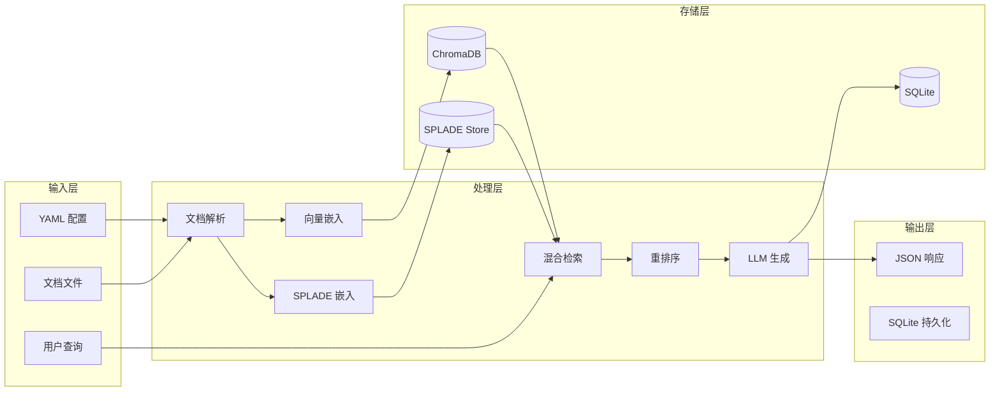

# 4. 模块/包结构与依赖分析

> **文档编号**：04/14
> **预估字数**：~12,000 字
> **图表数量**：3+ 个 Mermaid 图表

---

## 4.1 完整项目目录结构树

```
llm-search/
├── .github/
│   └── workflows/
│       └── release.yml              # GitHub Actions 发布工作流
├── dev/                             # 开发辅助文件
│   ├── example_report.pdf
│   ├── gmft.ipynb                    # GMFT 表格解析实验
│   ├── img2table.ipynb              # 图片表格实验
│   └── unstructured.ipynb           # Unstructured 解析实验
├── docs/                            # Sphinx 文档
│   ├── conf.py
│   ├── index.rst
│   ├── installation.rst
│   ├── usage.rst
│   ├── configure_model.rst
│   ├── configure_doc.rst
│   ├── requirements.txt
│   └── Makefile
├── media/                           # 媒体资源
│   └── llmsearch-demo-v2.gif
├── notebooks/                       # Jupyter 笔记本
│   ├── llmsearch_google_colab_demo.ipynb
│   └── dev/
│       ├── dev_config.yaml
│       └── splade.ipynb
├── sample_templates/                # 配置模板
│   ├── generic/
│   │   └── config_template.yaml
│   ├── llm/
│   │   ├── openai.yaml
│   │   ├── openai_gp4omini.yaml
│   │   ├── huggingface.yaml
│   │   └── litellm.yaml
│   ├── obsidian_conf.yaml
│   ├── pdf_library.yaml
│   ├── msft-docs.yaml
│   └── test-templates/
│       └── pdf_library.yaml
├── src/
│   └── llmsearch/                   # 核心源码
│       ├── __init__.py
│       ├── _version.py              # 自动生成版本
│       ├── config.py                # 配置模型
│       ├── cli.py                   # CLI 入口
│       ├── api.py                   # FastAPI + MCP
│       ├── webapp.py                # Streamlit Web UI
│       ├── interact.py              # 交互式 CLI
│       ├── chroma.py                # ChromaDB 封装
│       ├── embeddings.py            # 嵌入管理
│       ├── process.py               # RAG 编排
│       ├── ranking.py               # 混合检索
│       ├── splade.py                # SPLADE 稀疏嵌入
│       ├── utils.py                 # 工具函数
│       ├── database/
│       │   ├── __init__.py
│       │   ├── config.py            # SQLAlchemy 配置
│       │   ├── models.py            # ORM 模型
│       │   └── crud.py              # 数据库操作
│       ├── models/
│       │   ├── __init__.py
│       │   ├── abstract.py          # 抽象基类
│       │   ├── config.py            # 模型配置
│       │   ├── openai.py            # OpenAI 适配
│       │   ├── hf.py                # HuggingFace 适配
│       │   ├── azureopenai.py       # Azure 适配
│       │   ├── llama.py             # LlamaCPP 适配
│       │   ├── autogptq.py          # AutoGPTQ（未使用）
│       │   └── utils.py             # 模型工厂
│       ├── parsers/
│       │   ├── __init__.py
│       │   ├── splitter.py          # 分片调度器
│       │   ├── markdown.py          # Markdown 解析
│       │   ├── pdf.py               # PDF 解析
│       │   ├── doc.py               # DOCX 解析
│       │   ├── unstructured.py      # 通用解析
│       │   ├── experimental.py      # 实验性解析
│       │   ├── tables/
│       │   │   ├── __ini__.py
│       │   │   ├── generic.py       # 表格解析抽象
│       │   │   ├── gmft_parser.py   # GMFT 实现
│       │   │   └── azuredocint_parser.py  # Azure 实现
│       │   └── images/
│       │       ├── __init__.py
│       │       ├── generic.py       # 图片解析抽象
│       │       └── gemini_parser.py # Gemini 实现
│       └── obsolete/                # 废弃代码
│           ├── prompts.py
│           ├── cli.bck
│           └── main.py
├── tests/                           # 测试
│   ├── test_config.py
│   ├── test_table_splitting.py
│   ├── test_conversation_history.py
│   └── test_embeddings_update.py
├── .env_template                    # 环境变量模板
├── .flake8                          # Flake8 配置
├── .gitignore
├── .readthedocs.yaml                # ReadTheDocs 配置
├── .vscode/settings.json
├── CHANGELOG.md
├── LICENSE                          # MIT License
├── README.md
├── install_linux.sh                 # Linux 安装脚本
├── pyproject.toml                   # 项目配置
├── run_docker.sh                    # Docker 运行脚本
├── setvars.sh                       # 环境变量设置
└── uv.lock                          # 依赖锁定文件
```

---

## 4.2 每个主要目录/模块的功能职责

### 4.2.1 核心模块（src/llmsearch/）

| 文件 | 职责 | 输入 | 输出 |
|------|------|------|------|
| `config.py` | 配置模型定义与加载 | YAML 文件路径 | `Config` 实例 |
| `cli.py` | CLI 命令定义 | 命令行参数 | 执行结果 |
| `api.py` | FastAPI 路由 + MCP | HTTP 请求 | JSON 响应 |
| `webapp.py` | Streamlit Web UI | 用户交互 | Web 页面 |
| `interact.py` | 交互式 CLI Q&A | 用户输入 | 终端输出 |
| `chroma.py` | ChromaDB 操作封装 | 文档列表 | 向量存储 |
| `embeddings.py` | 嵌入生成与更新 | 配置 + 向量存储 | 嵌入结果 |
| `process.py` | RAG 流程编排 | 查询 + 依赖 | 响应模型 |
| `ranking.py` | 混合检索与重排序 | 查询 + 依赖 | 文档列表 |
| `splade.py` | SPLADE 稀疏嵌入 | 文档/查询 | 稀疏向量 |
| `utils.py` | 依赖组装与工具 | 配置 | LLMBundle |

### 4.2.2 数据库模块（src/llmsearch/database/）

| 文件 | 职责 | 输入 | 输出 |
|------|------|------|------|
| `config.py` | SQLAlchemy 引擎与会话 | 数据库路径 | DBSettings |
| `models.py` | ORM 模型定义 | — | 表结构 |
| `crud.py` | 数据库 CRUD 操作 | 会话 + 数据 | 持久化结果 |

### 4.2.3 模型模块（src/llmsearch/models/）

| 文件 | 职责 | 输入 | 输出 |
|------|------|------|------|
| `abstract.py` | 抽象基类 | — | — |
| `config.py` | 模型配置模型 | YAML 片段 | 配置实例 |
| `openai.py` | OpenAI 模型适配 | OpenAIModelConfig | ChatOpenAI |
| `hf.py` | HuggingFace 模型适配 | HuggingFaceModelConfig | HuggingFacePipeline |
| `azureopenai.py` | Azure 模型适配 | AzureOpenAIModelConfig | AzureChatOpenAI |
| `llama.py` | LlamaCPP 模型适配 | LlamaModelConfig | CustomLlamaModel |
| `utils.py` | 模型工厂 | 配置实例 | 模型实例 |

### 4.2.4 解析器模块（src/llmsearch/parsers/）

| 文件 | 职责 | 输入 | 输出 |
|------|------|------|------|
| `splitter.py` | 分片调度器 | 文档路径 + 配置 | Document 列表 |
| `markdown.py` | Markdown 逻辑分片 | MD 文件路径 | 分片列表 |
| `pdf.py` | PDF 文本分片 | PDF 文件路径 | 分片列表 |
| `doc.py` | DOCX 递归分片 | DOCX 文件路径 | 分片列表 |
| `unstructured.py` | 通用文档分片 | 任意文件路径 | 分片列表 |
| `tables/generic.py` | 表格解析抽象 | PDF 路径 + 解析器 | 表格 chunks |
| `tables/gmft_parser.py` | GMFT 表格解析 | PDF 路径 | GMFTParsedTable |
| `images/generic.py` | 图片解析抽象 | PDF 路径 + 分析器 | 图片 chunks |

---

## 4.3 模块间依赖关系图

### 4.3.1 Mermaid 依赖图

```mermaid
graph TD
    subgraph EntryPoints[入口层]
        CLI[cli.py]
        API[api.py]
        WEB[webapp.py]
        INT[interact.py]
    end

    subgraph Core[核心层]
        CONFIG[config.py]
        PROCESS[process.py]
        EMBED[embeddings.py]
        RANKING[ranking.py]
        UTILS[utils.py]
        CHROMA[chroma.py]
        SPLADE[splade.py]
    end

    subgraph Parsers[解析层]
        SPLITTER[parsers/splitter.py]
        MD[parsers/markdown.py]
        PDF[parsers/pdf.py]
        DOC[parsers/doc.py]
        UNSTRUCT[parsers/unstructured.py]
        TABLES[parsers/tables/generic.py]
        IMAGES[parsers/images/generic.py]
    end

    subgraph Models[模型层]
        ABS[models/abstract.py]
        OPENAI[models/openai.py]
        HF[models/hf.py]
        AZURE[models/azureopenai.py]
        LLAMA[models/llama.py]
        MODEL_CFG[models/config.py]
        MODEL_UTIL[models/utils.py]
    end

    subgraph Storage[存储层]
        DB_CFG[database/config.py]
        DB_MOD[database/models.py]
        DB_CRUD[database/crud.py]
    end

    CLI --> CONFIG
    CLI --> EMBED
    CLI --> PROCESS
    API --> CONFIG
    API --> PROCESS
    WEB --> CONFIG
    WEB --> PROCESS
    INT --> CONFIG
    INT --> PROCESS

    PROCESS --> RANKING
    PROCESS --> UTILS
    PROCESS --> DB_CRUD
    RANKING --> SPLADE
    RANKING --> CHROMA
    EMBED --> SPLITTER
    EMBED --> CHROMA
    EMBED --> SPLADE
    UTILS --> CHROMA
    UTILS --> SPLADE
    UTILS --> MODEL_UTIL

    SPLITTER --> MD
    SPLITTER --> PDF
    SPLITTER --> DOC
    SPLITTER --> UNSTRUCT
    SPLITTER --> TABLES
    SPLITTER --> IMAGES

    MODEL_UTIL --> ABS
    MODEL_UTIL --> OPENAI
    MODEL_UTIL --> HF
    MODEL_UTIL --> AZURE
    MODEL_UTIL --> LLAMA

    DB_CRUD --> DB_MOD
    DB_CRUD --> DB_CFG
```



### 4.3.2 详细文字说明（400+ 字）

#### 依赖方向分析

**自上而下的调用链**：
- 入口层（CLI/API/Web）→ 核心层（Process）→ 存储层（ChromaDB/SQLite）
- 核心层（Process）→ 解析层（Parsers）→ 具体解析器

**依赖倒置体现**：
- `process.py` 依赖 `LLMBundle` 抽象，不直接依赖具体存储实现
- `LLMBundle.store` 是 `VectorStore` 抽象基类
- `VectorStoreChroma` 是具体实现

#### 关键依赖关系

1. **config.py 是全局依赖**：几乎所有模块都依赖配置模型
2. **process.py 是编排中心**：协调检索、生成、持久化
3. **utils.py 是依赖工厂**：组装 LLMBundle，连接所有组件
4. **splitter.py 是解析入口**：路由到具体解析器

#### 循环依赖检查

系统不存在循环依赖，依赖图是 **有向无环图（DAG）**：
- 入口 → 核心 → 解析/存储 → 外部服务
- 模型层独立于解析层

---

## 4.4 数据流全景图

### 4.4.1 Mermaid 数据流图



### 4.4.2 详细文字说明（300+ 字）

#### 数据流路径

1. **配置数据流**：
   - YAML 文件 → `get_config()` → `Config` 对象 → 各模块

2. **文档数据流**：
   - 文档文件 → 解析器 → `Document` 列表 → 嵌入模型 → 向量存储

3. **查询数据流**：
   - 用户查询 → 查询增强 → 检索引擎 → 文档列表 → LLM → 响应

4. **持久化数据流**：
   - 响应模型 → SQLite ORM → 数据库记录

#### 数据格式转换

| 阶段 | 输入格式 | 输出格式 |
|------|----------|----------|
| 配置加载 | YAML 字符串 | Pydantic 模型 |
| 文档解析 | 文件二进制 | Document 列表 |
| 嵌入生成 | 文本字符串 | 浮点向量 |
| 检索 | 查询字符串 | 文档 ID 列表 |
| 生成 | 文档 + 问题 | 答案文本 |
| 响应 | ResponseModel | JSON 字典 |

---

## 4.5 配置驱动设计分析

### 4.5.1 配置如何驱动系统

```
YAML 文件
    ↓ get_config()
Config 对象
    ↓ 传递到各模块
    ├── DocumentSplitter → 按 document_settings 扫描
    ├── EmbeddingsConfig → 选择嵌入模型
    ├── SemanticSearchConfig → 配置检索参数
    └── LLMConfig → 加载 LLM 模型
```

### 4.5.2 配置验证链

```
YAML 文件
    ↓ yaml.safe_load()
Python 字典
    ↓ Config(**dict)
Pydantic 验证
    ├── field_validator: doc_path 存在性
    ├── field_validator: additional_parser_settings 扩展名
    ├── field_validator: LLMConfig.params 动态验证
    └── 类型检查（DirectoryPath, List[int] 等）
```

### 4.5.3 配置分离设计

系统支持 **文档配置** 和 **模型配置** 分离：
- 文档配置：`doc_path`、`embeddings`、`semantic_search`
- 模型配置：`llm` 部分

通过 `get_doc_with_model_config()` 合并两份配置，实现同一文档集搭配不同 LLM 的灵活性。

---

## 4.6 本章小结

本章全面分析了 pyLLMSearch 的模块结构：

1. **目录结构树**：展示了完整的项目文件组织
2. **模块职责表**：每个文件的功能、输入、输出
3. **依赖关系图**：模块间的调用方向和依赖关系
4. **数据流图**：数据在系统中的流动路径
5. **配置驱动**：YAML 配置如何驱动整个系统

下一章将深入每个核心文件，进行逐函数级别的代码走读。

---

# ❤️ 制作不易，请我喝咖啡☕️关注我➕

