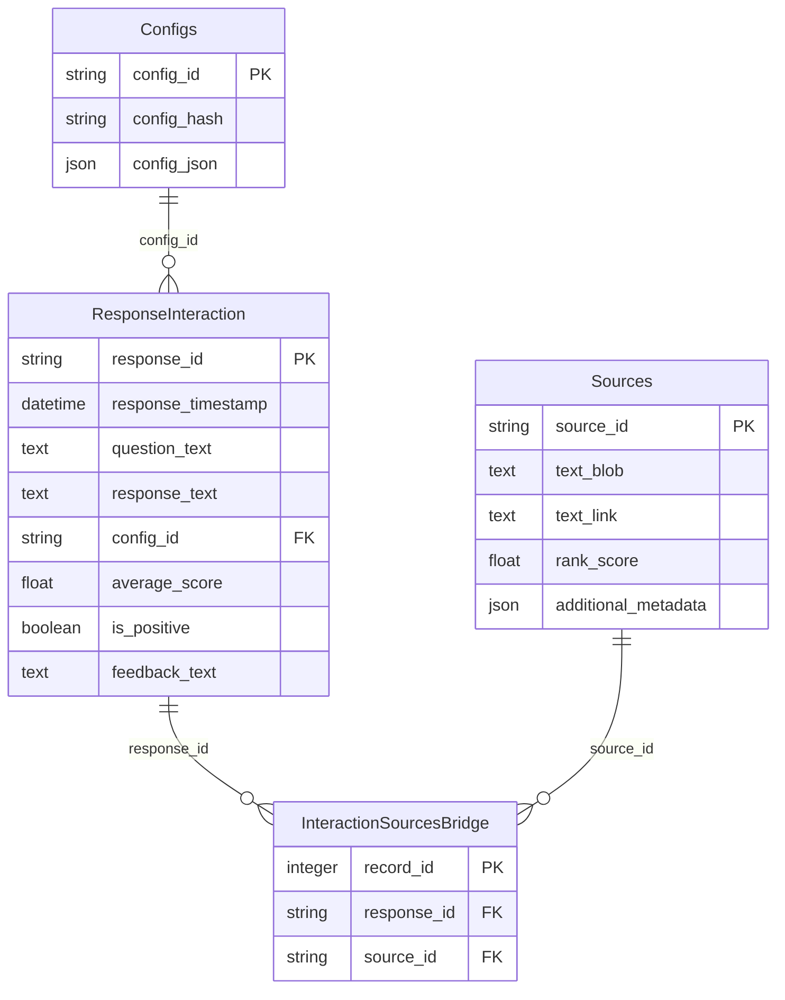

# 6. 数据模型与数据库设计

> **文档编号**：06/14
> **预估字数**：~10,000 字
> **图表数量**：2+ 个 Mermaid 图表

---

## 6.1 数据模型概览

pyLLMSearch 使用三种数据存储：

| 存储 | 技术 | 用途 |
|------|------|------|
| **向量数据库** | ChromaDB | 密集向量 + 元数据存储 |
| **稀疏索引** | 文件系统（NPZ + Pickle） | SPLADE 稀疏向量 |
| **关系数据库** | SQLite | 问答记录持久化 |

---

## 6.2 SQLite 数据库设计

### 6.2.1 ER 图



### 6.2.2 表结构详解

#### Configs 表

| 字段 | 类型 | 约束 | 说明 |
|------|------|------|------|
| `config_id` | String | PK, Index | 配置唯一标识（UUID） |
| `config_hash` | String | NOT NULL | 配置的 MD5 哈希（去重用） |
| `config_json` | JSON | NOT NULL | 完整配置的 JSON 表示 |

**设计 Rationale**：
- 使用 `config_hash` 去重，相同配置不重复存储
- 保存完整配置便于追溯每次问答的配置快照

#### ResponseInteraction 表

| 字段 | 类型 | 约束 | 说明 |
|------|------|------|------|
| `response_id` | String | PK, Index | 响应唯一标识（UUID） |
| `response_timestamp` | DateTime | DEFAULT utcnow | 响应时间戳 |
| `question_text` | Text | NOT NULL | 用户问题 |
| `response_text` | Text | NOT NULL | LLM 生成的回答 |
| `config_id` | String | FK → Configs | 关联的配置 ID |
| `average_score` | Float | NOT NULL | 检索质量分数 |
| `is_positive` | Boolean | NULLABLE | 用户反馈（好评/差评） |
| `feedback_text` | Text | DEFAULT "" | 用户反馈文本 |

**设计 Rationale**：
- `is_positive` 允许 NULL，表示尚未收到反馈
- `average_score` 用于分析检索质量趋势

#### Sources 表

| 字段 | 类型 | 约束 | 说明 |
|------|------|------|------|
| `source_id` | String | PK, Index | 来源唯一标识（UUID） |
| `text_blob` | Text | NOT NULL | 文档片段文本 |
| `text_link` | Text | NOT NULL | 文档链接（Deep Link） |
| `rank_score` | Float | NOT NULL | 重排序分数 |
| `additional_metadata` | JSON | — | 额外元数据（页码、标题等） |

#### InteractionSourcesBridge 表

| 字段 | 类型 | 约束 | 说明 |
|------|------|------|------|
| `record_id` | Integer | PK, AutoIncrement | 自增主键 |
| `response_id` | String | FK → ResponseInteraction, Index | 关联的响应 ID |
| `source_id` | String | FK → Sources, Index | 关联的来源 ID |

**设计 Rationale**：
- 多对多关系桥接表
- 一个响应可有多个来源，一个来源可出现在多个响应中

---

## 6.3 ChromaDB 向量存储设计

### 6.3.1 Collection 结构

ChromaDB 使用默认 collection，结构如下：

| 字段 | 类型 | 说明 |
|------|------|------|
| `ids` | List[str] | 文档唯一 ID（UUID1） |
| `embeddings` | List[List[float]] | 密集向量 |
| `documents` | List[str] | 文档文本内容 |
| `metadatas` | List[dict] | 元数据字典 |

### 6.3.2 元数据结构

```python
{
    "source": "/path/to/document.md",      # 文档路径
    "chunk_size": 1024,                     # 分片大小
    "source_chunk_type": "text",            # 来源类型（text/table/image）
    "document_id": "uuid-xxx",              # 文档 ID
    "label": "obsidian",                    # 文档集标签
    "page": 5,                              # 页码（PDF）
    "heading": "section-title",             # 标题（Markdown）
    "score": 0.85                           # 重排序分数（检索时添加）
}
```

### 6.3.3 过滤器支持

ChromaDB 支持基于元数据的过滤：

```python
# 按 chunk_size 过滤
filter = {"chunk_size": 1024}

# 按 label 过滤
filter = {"label": "obsidian"}

# 组合过滤（AND）
filter = {"$and": [{"chunk_size": {"$eq": 1024}}, {"label": {"$eq": "obsidian"}}]}
```

---

## 6.4 SPLADE 稀疏索引设计

### 6.4.1 存储格式

| 文件 | 格式 | 内容 |
|------|------|------|
| `splade_embeddings.npz` | scipy.sparse CSR | 稀疏嵌入矩阵 |
| `splade_ids.pickle` | Pickle | 文档 ID 数组 |
| `splade_metadatas.pickle` | Pickle | 元数据数组 |

### 6.4.2 索引结构

```python
class SparseEmbeddingsSplade:
    _embeddings: scipy.sparse.csr_matrix  # 形状: (n_docs, vocab_size)
    _ids: np.ndarray                      # 形状: (n_docs,)
    _metadatas: np.ndarray                # 形状: (n_docs,)
    _l2_norm_matrix: np.ndarray           # 形状: (n_docs,) 预计算 L2 范数
    _labels_to_ind: defaultdict(list)     # 标签 → 索引列表
    _chunk_size_to_ind: defaultdict(list) # chunk_size → 索引列表
```

### 6.4.3 检索优化

1. **预计算 L2 范数**：避免每次查询重复计算
2. **标签索引**：按标签预建索引，加速过滤
3. **chunk_size 索引**：按 chunk_size 预建索引

---

## 6.5 Hash 映射文件设计

### 6.5.1 文件结构

| 文件 | 格式 | 内容 |
|------|------|------|
| `file_hash_mappings.snappy.parquet` | Parquet | 文件名 → Hash 映射 |
| `docid_hash_mappings.snappy.parquet` | Parquet | 文档 ID → Hash 映射 |
| `labels.txt` | 文本 | 标签列表（每行一个） |

### 6.5.2 file_hash_mappings 结构

| 字段 | 类型 | 说明 |
|------|------|------|
| `filename` | str | 文件绝对路径 |
| `filehash` | str | MD5 哈希值 |

### 6.5.3 docid_hash_mappings 结构

| 字段 | 类型 | 说明 |
|------|------|------|
| `docid` | str | 文档 chunk ID（UUID1） |
| `filehash` | str | 所属文件的 MD5 哈希 |

**设计 Rationale**：
- 通过 `filehash` 可快速找到文件对应的所有 chunk
- 增量更新时用于识别需要删除的旧 chunk

---

## 6.6 缓存策略

### 6.6.1 LLM 缓存

```python
from langchain_core.caches import InMemoryCache

llm_cache = InMemoryCache()
set_llm_cache(llm_cache)
```

**功能**：缓存 LLM 调用结果，相同输入直接返回缓存值。

**使用场景**：Web UI 中重复查询时避免重复调用 LLM。

### 6.6.2 Streamlit 缓存

```python
@st.cache_data
def load_config(doc_config, model_config) -> Config:
    ...

@st.cache_data
def generate_response(question, use_hyde, use_multiquery, _config, _bundle):
    ...
```

**功能**：缓存配置加载和响应生成结果。

**注意**：`_config` 和 `_bundle` 前缀下划线表示不参与哈希。

### 6.6.3 FastAPI 缓存

```python
@lru_cache()
def get_config() -> Config:
    return read_config()

@lru_cache()
def get_cached_llm_bundle() -> LLMBundle:
    return get_llm_bundle(get_config())
```

**功能**：缓存配置和 LLM 依赖，避免重复加载。

---

## 6.7 事务设计

### 6.7.1 SQLite 事务

```python
def create_response(config, session, response):
    config_id = get_or_store_config(config, session)
    sources = []
    for ss_source in response.semantic_search:
        sources.append(models.Sources(...))
    db_response_interaction = models.ResponseInteraction(...)
    session.add(db_response_interaction)
    session.commit()  # 提交事务
```

**事务边界**：
- 单个 `create_response()` 调用是一个事务
- 包含：配置存储、来源存储、响应存储、桥接表存储

### 6.7.2 ChromaDB 事务

ChromaDB 的写入是原子性的，但不支持跨操作事务。

---

## 6.8 数据流向

### 6.8.1 索引阶段数据流

```
文档文件 → 解析器 → Document 列表
    ↓
    ├── 嵌入模型 → 密集向量 → ChromaDB
    ├── SPLADE 模型 → 稀疏向量 → NPZ 文件
    └── Hash 计算 → Hash 映射 → Parquet 文件
```

### 6.8.2 检索阶段数据流

```
用户查询 → 查询增强 → 多个查询
    ↓
    ├── SPLADE 检索 → 文档 ID
    └── ChromaDB 检索 → 文档 ID
    ↓
    结果并集 → 重排序 → 文档列表
    ↓
    LLM 生成 → 响应
    ↓
    SQLite 持久化
```

---

## 6.9 本章小结

本章详细分析了 pyLLMSearch 的数据模型设计：

1. **SQLite 数据库**：4 张表（Configs、ResponseInteraction、Sources、InteractionSourcesBridge）
2. **ChromaDB 向量存储**：密集向量 + 元数据
3. **SPLADE 稀疏索引**：NPZ + Pickle 格式
4. **Hash 映射文件**：Parquet 格式，支持增量更新
5. **缓存策略**：LLM 缓存、Streamlit 缓存、FastAPI 缓存
6. **事务设计**：SQLite 事务保证数据一致性

下一章将分析 API 与接口设计。

---

☕️ 制作不易，请我喝咖啡☕️关注我➕

