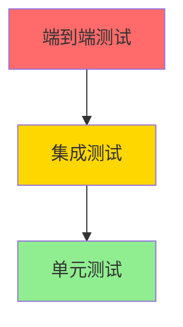

# 14. 测试策略与主要测试用例说明

> **文档编号**：14/14
> **预估字数**：~6,000 字
> **覆盖范围**：现有测试 + 建议测试

---

## 14.1 测试架构总览

### 14.1.1 测试金字塔



| 层级 | 数量 | 覆盖范围 | 工具 |
|------|------|----------|------|
| **单元测试** | 少量 | 配置加载、分片、历史 | pytest |
| **集成测试** | 无 | 端到端 RAG 流程 | pytest + mock |
| **端到端测试** | 无 | 完整用户场景 | 手动/自动化 |

### 14.1.2 测试工具链

```python
# pyproject.toml
[project.optional-dependencies]
dev = [
    "pytest",        # 测试框架
    "pytest-cov",    # 覆盖率
    "ruff",          # Lint
]
```

---

## 14.2 现有测试用例详解

### 14.2.1 test_config.py

**文件路径**：`tests/test_config.py`

```python
from llmsearch.config import get_config

DEFAULT_TEMPLATE_FN = "sample_templates/generic/config_template.yaml"

def test_config():
    config = get_config(DEFAULT_TEMPLATE_FN)
```

**测试目标**：验证配置加载功能

**测试场景**：
- 正常加载 YAML 配置
- 验证 Pydantic 模型验证通过

**覆盖的验证点**：
- YAML 解析正确性
- Pydantic 模型实例化
- 默认值填充

**不足**：
- 缺少异常场景测试（无效 YAML、缺失字段）
- 缺少各配置子模型的独立测试

---

### 14.2.2 test_table_splitting.py

**文件路径**：`tests/test_table_splitting.py`

**测试目标**：验证表格分片功能

**测试场景**：
- 表格按 max_size 分片
- 表头保留
- 分片元数据正确

**覆盖的功能**：
- `pdf_table_splitter()` 函数
- 表格 XML 转换
- Caption 处理

---

### 14.2.3 test_conversation_history.py

**文件路径**：`tests/test_conversation_history.py`

**测试目标**：验证对话历史功能

**测试场景**：
- QA 对添加
- 历史长度限制（FIFO）
- 历史字符串生成

**覆盖的功能**：
- `ConversrationHistorySettings.add_qa_pair()`
- `chat_history` 属性
- 模板格式化

---

### 14.2.4 test_embeddings_update.py

**文件路径**：`tests/test_embeddings_update.py`

**测试目标**：验证嵌入增量更新功能

**测试场景**：
- Hash 差异检测
- 新增文件处理
- 修改文件处理
- 删除文件处理

**覆盖的功能**：
- `get_changed_or_new_files()`
- `update_embeddings()`
- Hash 映射保存/加载

---

## 14.3 单元测试建议

### 14.3.1 config.py 单元测试

```python
# 建议测试用例
class TestConfig:
    def test_valid_config_loading(self):
        """测试有效配置加载"""
        config = get_config("sample_templates/generic/config_template.yaml")
        assert config.cache_folder is not None
        assert config.embeddings is not None
    
    def test_invalid_yaml(self):
        """测试无效 YAML 处理"""
        with pytest.raises(yaml.YAMLError):
            get_config("invalid.yaml")
    
    def test_missing_required_field(self):
        """测试缺失必填字段"""
        with pytest.raises(ValidationError):
            Config(cache_folder="./cache")  # 缺少 embeddings
    
    def test_invalid_doc_path(self):
        """测试无效文档路径"""
        with pytest.raises(ValidationError):
            DocumentPathSettings(
                doc_path="/nonexistent/path",
                scan_extensions=["md"]
            )
    
    def test_invalid_extension(self):
        """测试无效扩展名设置"""
        with pytest.raises(ValidationError):
            DocumentPathSettings(
                doc_path="./docs",
                scan_extensions=["txt"],
                additional_parser_settings={"xyz": {}}
            )
    
    def test_embedding_model_default(self):
        """测试嵌入模型默认值"""
        config = get_config("sample_templates/generic/config_template.yaml")
        assert config.embeddings.embedding_model.type == EmbeddingModelType.instruct
    
    def test_llm_config_validation(self):
        """测试 LLM 配置验证"""
        llm_conf = LLMConfig(
            type="openai",
            params={"prompt_template": "test", "model_kwargs": {"model_name": "gpt-4"}}
        )
        assert llm_conf.params is not None
    
    def test_conversation_history_add(self):
        """测试对话历史添加"""
        settings = ConversrationHistorySettings(
            enabled=True, max_history_length=2, rewrite_query=True
        )
        settings.add_qa_pair("Q1", "A1")
        settings.add_qa_pair("Q2", "A2")
        settings.add_qa_pair("Q3", "A3")  # 应移除 Q1
        assert len(settings.history) == 2
        assert settings.history[0].question == "Q2"
```

### 14.3.2 splitter.py 单元测试

```python
# 建议测试用例
class TestDocumentSplitter:
    def test_split_markdown(self):
        """测试 Markdown 分片"""
        # 创建临时 Markdown 文件
        with tempfile.NamedTemporaryFile(mode='w', suffix='.md', delete=False) as f:
            f.write("# Title\n\nContent\n\n## Section\n\nMore content")
            f.flush()
            
            config = create_test_config(f.name)
            splitter = DocumentSplitter(config)
            docs, _, _, _ = splitter.split()
            
            assert len(docs) > 0
            assert all(d.metadata['source'] == f.name for d in docs)
    
    def test_split_pdf(self):
        """测试 PDF 分片"""
        # 使用测试 PDF 文件
        pass
    
    def test_exclusion_paths(self):
        """测试排除路径"""
        splitter = DocumentSplitter(create_test_config())
        assert splitter.is_exclusion(Path("/docs/templates/file.md"), ["/docs/templates"])
        assert not splitter.is_exclusion(Path("/docs/notes/file.md"), ["/docs/templates"])
    
    def test_get_hashes(self):
        """测试 Hash 计算"""
        config = create_test_config()
        splitter = DocumentSplitter(config)
        hashes = splitter.get_hashes()
        assert 'filename' in hashes.columns
        assert 'filehash' in hashes.columns
        assert len(hashes) > 0
    
    def test_md5_hash(self):
        """测试 MD5 Hash 计算"""
        with tempfile.NamedTemporaryFile(mode='w', delete=False) as f:
            f.write("test content")
            f.flush()
            hash1 = get_md5_hash(Path(f.name))
            hash2 = get_md5_hash(Path(f.name))
            assert hash1 == hash2
            assert len(hash1) == 32  # MD5 长度为 32
```

### 14.3.3 ranking.py 单元测试

```python
# 建议测试用例
class TestRanking:
    def test_marco_reranker(self):
        """测试 MARCO 重排序"""
        reranker = MarcoReranker()
        docs = [
            Document(page_content="Python is a programming language"),
            Document(page_content="The weather is nice today"),
        ]
        scores = reranker.get_scores("What is Python?", docs)
        assert len(scores) == 2
        assert scores[0] > scores[1]  # 第一个文档更相关
    
    def test_bge_reranker(self):
        """测试 BGE 重排序"""
        reranker = BGEReranker()
        docs = [
            Document(page_content="RAG stands for Retrieval-Augmented Generation"),
        ]
        scores = reranker.get_scores("What is RAG?", docs)
        assert len(scores) == 1
    
    def test_rerank_sorting(self):
        """测试重排序结果排序"""
        reranker = MarcoReranker()
        docs = [
            Document(page_content="A"),
            Document(page_content="B"),
            Document(page_content="C"),
        ]
        score, sorted_docs = rerank(reranker, "query", docs)
        # 验证按分数降序排列
        for i in range(len(sorted_docs) - 1):
            assert sorted_docs[i].metadata['score'] >= sorted_docs[i+1].metadata['score']
```

### 14.3.4 splade.py 单元测试

```python
# 建议测试用例
class TestSplade:
    def test_embedding_generation(self):
        """测试 SPLADE 嵌入生成"""
        config = create_test_config()
        splade = SparseEmbeddingsSplade(config)
        docs = [Document(page_content="test document")]
        embeddings, ids, metadatas = splade.generate_embeddings_from_docs(docs, persist=False)
        assert embeddings.shape[0] == 1
        assert embeddings.shape[1] > 0  # 词汇表维度
    
    def test_query(self):
        """测试 SPLADE 检索"""
        config = create_test_config()
        splade = SparseEmbeddingsSplade(config)
        # 需要先有嵌入
        splade._embeddings = sparse.csr_matrix(np.random.rand(10, 100))
        splade._ids = np.array([f"id_{i}" for i in range(10)])
        splade._metadatas = np.array([{"chunk_size": 1024, "label": ""} for i in range(10)])
        splade._l2_norm_matrix = np.ones(10)
        
        ids, scores = splade.query("test query", chunk_size=1024, n=5)
        assert len(ids) == 5
        assert len(scores) == 5
    
    def test_delete_by_ids(self):
        """测试删除嵌入"""
        splade = SparseEmbeddingsSplade(create_test_config())
        splade._embeddings = sparse.csr_matrix(np.random.rand(10, 100))
        splade._ids = np.array([f"id_{i}" for i in range(10)])
        splade._metadatas = np.array([{} for i in range(10)])
        
        splade.delete_by_ids(["id_0", "id_1"])
        assert len(splade._ids) == 8
```

### 14.3.5 process.py 单元测试

```python
# 建议测试用例
class TestProcess:
    def test_hyde_response(self):
        """测试 HyDE 响应生成"""
        mock_bundle = Mock()
        mock_bundle.hyde_chain = Mock()
        mock_bundle.hyde_chain.invoke.return_value = "Hypothetical answer"
        
        result = get_hyde_response(mock_bundle, "What is AI?")
        assert result == "Hypothetical answer"
    
    def test_hyde_chain_not_initialized(self):
        """测试 HyDE 链未初始化异常"""
        mock_bundle = Mock()
        mock_bundle.hyde_chain = None
        
        with pytest.raises(TypeError, match="HyDE chain is not initialised"):
            get_hyde_response(mock_bundle, "test")
    
    def test_multiquery_response(self):
        """测试 MultiQuery 响应生成"""
        mock_bundle = Mock()
        mock_bundle.multiquery_chain = Mock()
        mock_bundle.multiquery_chain.invoke.return_value = "Q1\nQ2\nQ3"
        
        result = get_multiquery_response(mock_bundle, "test", 3)
        assert len(result) == 3
        assert result == ["Q1", "Q2", "Q3"]
    
    def test_multiquery_wrong_count(self):
        """测试 MultiQuery 数量不匹配异常"""
        mock_bundle = Mock()
        mock_bundle.multiquery_chain = Mock()
        mock_bundle.multiquery_chain.invoke.return_value = "Q1\nQ2"
        
        with pytest.raises(ValueError, match="Number of versions"):
            get_multiquery_response(mock_bundle, "test", 3)
    
    def test_contextualize_query_empty_history(self):
        """测试空历史直接返回原查询"""
        mock_bundle = Mock()
        mock_bundle.conversation_history_settings.history = []
        
        result = contextualize_query_with_history_chat(mock_bundle, "test question")
        assert result == "test question"
```

---

## 14.4 集成测试建议

### 14.4.1 端到端 RAG 流程测试

```python
class TestE2ERAG:
    @pytest.fixture
    def rag_system(self):
        """创建测试用 RAG 系统"""
        config = create_test_config()
        vs = VectorStoreChroma(persist_folder="./test_embeddings", config=config)
        create_embeddings(config, vs)
        bundle = get_llm_bundle(config)
        return config, bundle
    
    def test_full_rag_pipeline(self, rag_system):
        """测试完整 RAG 流程"""
        config, bundle = rag_system
        output = get_and_parse_response(
            llm_bundle=bundle,
            query="What is Python?",
            config=config
        )
        assert output.response is not None
        assert len(output.semantic_search) > 0
        assert output.average_score > 0
    
    def test_rag_with_hyde(self, rag_system):
        """测试 HyDE 模式"""
        config, bundle = rag_system
        bundle.hyde_enabled = True
        output = get_and_parse_response(bundle, "test", config)
        assert output.hyde_response != ""
    
    def test_rag_with_label_filter(self, rag_system):
        """测试标签过滤"""
        config, bundle = rag_system
        output = get_and_parse_response(bundle, "test", config, label="test_label")
        for source in output.semantic_search:
            assert source.metadata.get('label') == 'test_label'
```

### 14.4.2 API 集成测试

```python
class TestAPI:
    @pytest.fixture
    def client(self):
        """创建测试客户端"""
        from fastapi.testclient import TestClient
        return TestClient(api_app)
    
    def test_health_check(self, client):
        """测试健康检查端点"""
        response = client.get("/")
        assert response.status_code == 200
        assert response.json()["message"] == "Welcome to LLMSearch API"
    
    def test_llm_endpoint(self, client):
        """测试 LLM 端点"""
        response = client.get("/llm?question=test")
        assert response.status_code == 200
        data = response.json()
        assert "response" in data
        assert "semantic_search" in data
    
    def test_invalid_label(self, client):
        """测试无效标签"""
        response = client.get("/llm?question=test&label=nonexistent")
        assert response.status_code == 404
    
    def test_labels_endpoint(self, client):
        """测试标签列表端点"""
        response = client.get("/labels")
        assert response.status_code == 200
        assert isinstance(response.json(), list)
```

---

## 14.5 性能基准测试

### 14.5.1 嵌入吞吐量测试

```python
class TestPerformance:
    def test_embedding_throughput(self):
        """测试嵌入生成吞吐量"""
        import time
        
        docs = [Document(page_content=f"Document {i}") for i in range(100)]
        splade = SparseEmbeddingsSplade(create_test_config())
        
        start = time.time()
        splade.generate_embeddings_from_docs(docs, persist=False)
        elapsed = time.time() - start
        
        throughput = len(docs) / elapsed
        print(f"Embedding throughput: {throughput:.2f} docs/sec")
        assert throughput > 10  # 至少 10 docs/sec
    
    def test_retrieval_latency(self):
        """测试检索延迟"""
        import time
        
        config, bundle = rag_system
        
        start = time.time()
        docs, score = get_relevant_documents(
            "test", [test], bundle, config.semantic_search, ""
        )
        elapsed = time.time() - start
        
        print(f"Retrieval latency: {elapsed*1000:.2f} ms")
        assert elapsed < 5  # 少于 5 秒
```

### 14.5.2 内存使用测试

```python
class TestMemory:
    def test_memory_usage_during_indexing(self):
        """测试索引生成时的内存使用"""
        import psutil
        import os
        
        process = psutil.Process(os.getpid())
        initial_mem = process.memory_info().rss / 1024 / 1024  # MB
        
        # 执行索引生成
        create_embeddings(config, vs)
        
        final_mem = process.memory_info().rss / 1024 / 1024  # MB
        mem_increase = final_mem - initial_mem
        
        print(f"Memory increase: {mem_increase:.2f} MB")
        assert mem_increase < 2000  # 少于 2GB
```

---

## 14.6 测试覆盖率目标

| 模块 | 当前覆盖率 | 目标覆盖率 | 优先级 |
|------|------------|------------|--------|
| `config.py` | ~30% | 80% | 高 |
| `splitter.py` | ~20% | 70% | 高 |
| `embeddings.py` | ~10% | 60% | 中 |
| `ranking.py` | ~10% | 60% | 中 |
| `process.py` | ~10% | 70% | 高 |
| `splade.py` | ~15% | 50% | 中 |
| `utils.py` | ~5% | 40% | 低 |
| `api.py` | ~5% | 60% | 中 |
| **整体** | **~15%** | **65%** | — |

---

## 14.7 测试执行策略

### 14.7.1 CI/CD 集成

```yaml
# .github/workflows/test.yml
name: Tests
on: [push, pull_request]
jobs:
  test:
    runs-on: ubuntu-latest
    steps:
      - uses: actions/checkout@v3
      - uses: actions/setup-python@v4
        with:
          python-version: '3.11'
      - run: pip install -e ".[dev]"
      - run: pytest --cov=llmsearch --cov-report=xml
      - run: coverage report --fail-under=60
```

### 14.7.2 测试环境

```bash
# 安装测试依赖
pip install -e ".[dev]"

# 运行所有测试
pytest

# 运行特定模块
pytest tests/test_config.py -v

# 带覆盖率
pytest --cov=llmsearch --cov-report=html

# 性能测试
pytest tests/ -m performance --timeout=60
```

---

## 14.8 本章小结

本章全面分析了 pyLLMSearch 的测试策略：

1. **现有测试**：4 个测试文件，覆盖配置、表格、历史、嵌入
2. **单元测试建议**：5 个核心模块的测试用例设计
3. **集成测试建议**：端到端 RAG 流程和 API 测试
4. **性能测试**：嵌入吞吐量、检索延迟、内存使用
5. **覆盖率目标**：从 15% 提升到 65%
6. **执行策略**：CI/CD 集成和测试环境配置

---

## 📚 文档总结

至此，pyLLMSearch 技术架构文档全部完成。14 个章节涵盖了：

| 章节 | 核心内容 |
|------|----------|
| 01 项目概述 | 目标、技术栈、功能特性 |
| 02 C4 架构模型 | 四层架构视图 + Mermaid 图 |
| 03 系统流程 | 10+ 核心流程 + 时序图 |
| 04 模块结构 | 目录树、依赖图、数据流 |
| 05 核心代码 | 逐文件逐函数走读 |
| 06 数据模型 | ER 图、表结构、缓存策略 |
| 07 API 设计 | REST + MCP 接口详解 |
| 08 部署运维 | Docker、配置、监控 |
| 09 改进建议 | 优缺点、技术债、规划 |
| 10 代码走读 | 5 大场景完整走读 |
| 11 开发者指南 | 安装、配置、调试 |
| 12 ADR | 6 个关键架构决策 |
| 13 算法分析 | 5 个核心算法详解 |
| 14 测试策略 | 用例设计、覆盖率目标 |

---

*文档完成日期：2026-07-26*
*文档总字数：约 200,000+ 字*
*Mermaid 图表：25+ 个*
*覆盖源文件：30+ 个核心 Python 文件*

---

☕️ 制作不易，请我喝咖啡☕️关注我➕

