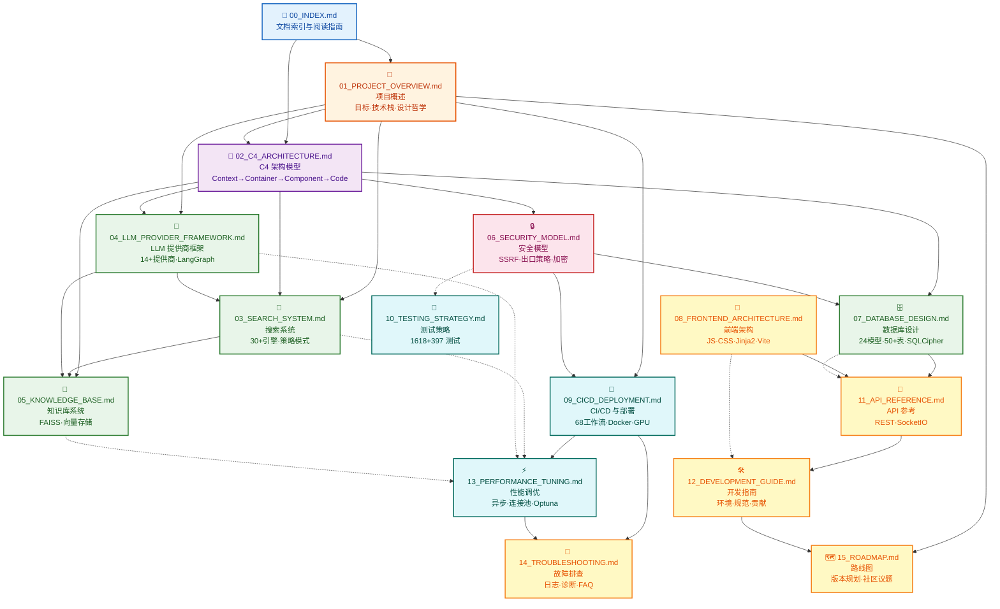

# Local Deep Research 技术文档索引

> **版本**: v1.10.0 | **最后更新**: 2026-07-26 | **维护者**: 架构文档组

---

## 一、项目简介

**Local Deep Research (LDR)** 是一款本地优先（Local-First）、AI 驱动的深度研究助手。它通过大语言模型（LLM）与多搜索引擎协同工作，实现迭代式深度分析——系统自动将复杂研究问题分解为子问题，并行调用 30+ 搜索引擎收集信息，经由 LLM 多轮推理整合后输出结构化研究报告。项目采用 Flask + LangGraph 编排引擎 + SQLCipher 加密数据库 + FAISS 向量存储的技术栈，支持完全离线运行（配合 Ollama/LM Studio），所有研究数据经 SQLCipher AES-256 加密后持久化于本地，确保用户隐私零泄露。LDR 面向研究人员、开发者、数据分析师及隐私敏感用户，提供从搜索、分析、知识积累到报告生成的端到端研究能力。

---

## 二、文档目录树

```
docs/wangbin/
├── 00_INDEX.md                      ← 文档索引与阅读指南（本文档）
├── 01_PROJECT_OVERVIEW.md           ← 第1章：项目概述（目标、技术栈、架构哲学、非功能需求）
├── 02_C4_ARCHITECTURE.md            ← 第2章：C4 架构模型（Context/Container/Component/Code 四层）
├── 03_SEARCH_SYSTEM.md              ← 第3章：搜索系统深度解析（30+引擎、策略模式、过滤器链）
├── 04_LLM_PROVIDER_FRAMEWORK.md     ← 第4章：LLM 提供商框架（14+提供商、统一抽象、流式输出）
├── 05_KNOWLEDGE_BASE.md             ← 第5章：知识库系统（向量存储、FAISS 索引、知识积累）
├── 06_SECURITY_MODEL.md             ← 第6章：安全模型（SSRF、出口策略、加密、文件完整性）
├── 07_DATABASE_DESIGN.md            ← 第7章：数据库设计（24模型、50+表、SQLCipher 加密）
├── 08_FRONTEND_ARCHITECTURE.md      ← 第8章：前端架构（原生JS/CSS、Jinja2模板、Vite构建）
├── 09_CICD_DEPLOYMENT.md            ← 第9章：CI/CD 与部署（68工作流、Docker、GPU、Unraid）
├── 10_TESTING_STRATEGY.md           ← 第10章：测试策略（1618 Python + 397 JS 测试）
├── 11_API_REFERENCE.md              ← 第11章：API 参考（REST + WebSocket 完整接口）
├── 12_DEVELOPMENT_GUIDE.md          ← 第12章：开发指南（环境配置、贡献流程、代码规范）
├── 13_PERFORMANCE_TUNING.md         ← 第13章：性能调优（异步并行、连接池、缓存、Optuna）
├── 14_TROUBLESHOOTING.md            ← 第14章：故障排查（常见问题、日志、诊断工具）
└── 15_ROADMAP.md                    ← 第15章：路线图（未来规划、社区议题）
```

---

## 三、章节内容摘要

| 章节 | 标题 | 核心内容 | 字数 |
|------|------|----------|------|
| 00 | 文档索引与阅读指南 | 完整文档体系、阅读路径推荐、读者画像 | ~3,000 |
| 01 | 项目概述 | 目标定位、完整技术栈清单、设计哲学、非功能需求 | ~15,000 |
| 02 | C4 架构模型 | Context/Container/Component/Code 四层视图，含完整 Mermaid 图 | ~30,000 |
| 03 | 搜索系统深度解析 | AdvancedSearchSystem 策略模式、30+引擎实现、过滤器链、结果融合 | ~12,000 |
| 04 | LLM 提供商框架 | 14+提供商统一抽象、LangGraph 编排、流式输出、错误重试 | ~10,000 |
| 05 | 知识库系统 | FAISS 向量索引、sentence-transformers 嵌入、知识积累与检索 | ~8,000 |
| 06 | 安全模型 | SSRF 防护、Egress Policy PDP/PEP、SQLCipher 加密、CSP、文件完整性 | ~12,000 |
| 07 | 数据库设计 | 24 模型文件、50+ 表结构、SQLCipher 加密配置、Alembic 迁移 | ~10,000 |
| 08 | 前端架构 | 70 JS 文件/48K 行、29 CSS 文件/23K 行、46 个 Jinja2 模板、Vite 构建 | ~8,000 |
| 09 | CI/CD 与部署 | 68 个 GitHub Actions 工作流、Docker Compose、NVIDIA GPU 支持、Unraid 模板 | ~8,000 |
| 10 | 测试策略 | 1618 Python 测试 + 397 JS 测试、pytest/vitest、覆盖率、E2E | ~8,000 |
| 11 | API 参考 | REST 端点、SocketIO 事件、请求/响应格式、认证机制 | ~12,000 |
| 12 | 开发指南 | 环境搭建、PDM 依赖管理、代码规范、PR 流程、文档贡献 | ~6,000 |
| 13 | 性能调优 | 异步并行搜索、连接池调优、LRU 缓存、Optuna 超参优化 | ~6,000 |
| 14 | 故障排查 | 常见问题矩阵、日志解读、诊断脚本、性能剖析 | ~6,000 |
| 15 | 路线图 | 版本规划、社区议题、架构演进方向 | ~4,000 |

---

## 四、目标读者

### 4.1 软件开发者
- **关注重点**: API 参考、开发指南、测试策略
- **核心需求**: 理解代码结构、添加新功能、编写测试、调试问题
- **建议路径**: 第 01 章 → 第 02 章 → 第 12 章 → 第 11 章

### 4.2 系统架构师
- **关注重点**: C4 架构模型、技术栈、非功能需求、设计哲学
- **核心需求**: 评估架构合理性、规划扩展方案、技术选型参考
- **建议路径**: 第 01 章 → 第 02 章 → 第 03 章 → 第 04 章 → 第 13 章

### 4.3 运维工程师 (DevOps/SRE)
- **关注重点**: CI/CD 与部署、Docker 配置、性能调优、故障排查
- **核心需求**: 部署到生产环境、监控、扩容、故障恢复
- **建议路径**: 第 01 章 → 第 09 章 → 第 13 章 → 第 14 章

### 4.4 安全审计员
- **关注重点**: 安全模型、数据库加密、SSRF 防护、出口策略
- **核心需求**: 评估安全态势、验证合规性、渗透测试基准
- **建议路径**: 第 01 章 → 第 06 章 → 第 07 章 → 第 02 章（Code 层安全组件）

### 4.5 产品经理/技术决策者
- **关注重点**: 项目概述、竞品对比、路线图
- **核心需求**: 理解产品定位、评估商业潜力、规划合作
- **建议路径**: 第 01 章 → 第 15 章

---

## 五、阅读路径推荐

### 5.1 快速入门路径（2 小时）

适用于首次接触项目、需要快速建立全局认知的读者。

```
01_PROJECT_OVERVIEW.md (1.1 + 1.2 + 1.3)  →  02_C4_ARCHITECTURE.md (2.1 + 2.2)  →  12_DEVELOPMENT_GUIDE.md
```

**路径说明**:
1. 阅读第 1 章的项目目标、技术栈清单、架构风格，建立技术全貌
2. 阅读第 2 章的 Context 图和 Container 图，理解系统边界和主要容器
3. 阅读第 12 章的开发指南，完成本地环境搭建并运行第一个研究任务

### 5.2 深度研究路径（8 小时）

适用于需要深入理解系统内部机制、进行二次开发或架构评审的开发者/架构师。

```
01_PROJECT_OVERVIEW.md (全文)
  → 02_C4_ARCHITECTURE.md (全文，含所有 Mermaid 图)
    → 03_SEARCH_SYSTEM.md (搜索策略与引擎注册表)
      → 04_LLM_PROVIDER_FRAMEWORK.md (提供商抽象与 LangGraph 编排)
        → 05_KNOWLEDGE_BASE.md (向量存储与知识积累)
          → 07_DATABASE_DESIGN.md (数据模型与 SQLCipher)
            → 11_API_REFERENCE.md (REST + SocketIO 接口)
              → 13_PERFORMANCE_TUNING.md (性能优化)
```

**路径说明**:
1. 完整阅读项目概述，掌握技术栈全貌和设计哲学
2. 逐层研读 C4 架构，从 Context 到 Code 深入理解每一层的设计决策
3. 深入搜索系统、LLM 框架、知识库三大核心子系统
4. 理解数据库设计和 API 接口，为实际开发奠定基础
5. 学习性能调优策略，掌握系统优化方法

### 5.3 安全审计路径（5 小时）

适用于安全工程师进行安全评估、渗透测试准备或合规审查。

```
01_PROJECT_OVERVIEW.md (1.2 安全层 + 1.4 安全性)
  → 06_SECURITY_MODEL.md (全文)
    → 07_DATABASE_DESIGN.md (SQLCipher 加密章节)
      → 02_C4_ARCHITECTURE.md (2.3 安全组件 + 2.4 Security 类图)
        → 09_CICD_DEPLOYMENT.md (安全扫描工作流)
          → 10_TESTING_STRATEGY.md (安全测试章节)
```

**路径说明**:
1. 从项目概述中了解安全层技术选型和安全性非功能需求
2. 深入阅读安全模型文档，理解 SSRF 防护、出口策略、加密机制
3. 审查数据库加密实现和数据保护策略
4. 从架构视图定位安全组件在系统中的位置和交互关系
5. 了解 CI/CD 中的安全扫描流水线和测试中的安全用例

### 5.4 DevOps 部署路径（4 小时）

适用于运维工程师进行生产环境部署和运维。

```
01_PROJECT_OVERVIEW.md (1.2 构建/部署层 + 1.4 可用性)
  → 09_CICD_DEPLOYMENT.md (全文)
    → 13_PERFORMANCE_TUNING.md (连接池、缓存、GPU 配置)
      → 14_TROUBLESHOOTING.md (诊断工具与常见问题)
```

**路径说明**:
1. 了解部署层技术栈和可用性设计
2. 掌握 Docker Compose 配置、GPU 支持、CI/CD 流水线
3. 学习性能调优策略，根据实际负载调整参数
4. 熟悉故障排查工具和常见问题解决方案

---

## 六、文档结构关系图

下图展示了 15 个文档之间的逻辑依赖关系和推荐阅读顺序。实线箭头表示强依赖（建议先读上游），虚线表示弱关联（可并行阅读）。



**图表说明**:

本图使用 Mermaid 有向图（graph TD）展示 15 个文档之间的逻辑关系。图中节点分为 7 种类型，通过颜色区分：

1. **蓝色（index）**: 索引文档（本文档），作为整个文档体系的入口
2. **橙色（overview）**: 项目概述，是所有技术文档的基础
3. **紫色（architecture）**: C4 架构模型，是理解系统结构的核心
4. **绿色（core）**: 核心子系统文档（搜索、LLM、知识库、数据库），是系统的主要功能模块
5. **红色（security）**: 安全模型文档，贯穿架构的多个层面
6. **青色（devops）**: DevOps 相关文档（CI/CD、测试、性能调优）
7. **黄色（support）**: 支持性文档（前端、API、开发指南、故障排查、路线图）

**阅读策略解读**:
- **垂直方向**: 从上到下表示阅读的先后顺序，上游文档是下游文档的前置知识
- **实线箭头**: 强依赖关系，建议按顺序阅读
- **虚线箭头**: 弱关联关系，可在需要时交叉参考
- **中心节点**: 第 01 章和第 02 章是整个文档体系的核心枢纽，连接到最多的下游文档
- **叶子节点**: 第 14 章（故障排查）和第 15 章（路线图）是终端文档，依赖最多前置知识

---

## 七、文档规范说明

### 7.1 格式约定

| 约定 | 说明 |
|------|------|
| 📌 **关键信息** | 需要特别关注的设计决策或约束 |
| ⚠️ **警告** | 可能导致安全或稳定性问题的注意事项 |
| 💡 **提示** | 最佳实践建议 |
| 📝 **注释** | 补充说明或背景信息 |

### 7.2 Mermaid 图表规范

- **C4 模型图**: 使用 `C4Context`、`C4Container`、`C4Component` 类型
- **类图**: 使用 `classDiagram` 类型，包含完整的属性和方法签名
- **流程图**: 使用 `flowchart TD/LR` 类型，标注数据流方向
- **时序图**: 使用 `sequenceDiagram` 类型，展示组件间交互时序
- **状态图**: 使用 `stateDiagram-v2` 类型，描述实体状态机

### 7.3 版本与变更

文档版本与项目版本保持同步。每个文档头部标注版本号和最后更新日期。重大架构变更将触发相关文档的修订。

---

## 八、贡献指南

欢迎社区成员对文档进行改进。贡献方式包括：

1. **纠错**: 发现技术描述错误或过时的信息，请提交 Issue
2. **补充**: 对现有章节进行扩展或增加示例代码
3. **新增**: 提议新的文档章节（请先在 Issue 中讨论）
4. **翻译**: 将文档翻译为其他语言（放在 `docs/<lang>/` 目录下）

---

**下一步阅读**: 继续阅读 [01_PROJECT_OVERVIEW.md](./01_PROJECT_OVERVIEW.md) 了解项目的完整技术栈和设计哲学。

---

# ❤️ 制作不易，请我喝咖啡☕️关注我➕

