# 第 1 章：项目概述

> **版本**: v1.10.0 | **最后更新**: 2026-07-26 | **所属文档体系**: Local Deep Research 技术文档

---

## 1.1 项目目标与核心价值

### 1.1.1 项目定位：本地优先（Local-First）AI 研究助手

Local Deep Research（以下简称 LDR）是一款**本地优先**、AI 驱动的深度研究助手。所谓"本地优先"，指的是系统默认将所有数据（研究任务、搜索历史、知识库、配置）存储在本地的 SQLCipher 加密数据库中，核心推理能力可完全通过本地 LLM（如 Ollama、LM Studio）运行，无需任何外部云服务即可独立完成研究任务。

与云端 AI 研究工具不同，LDR 的架构设计遵循以下原则：

- **数据主权**: 用户数据始终驻留本地，用户完全拥有和控制自己的研究数据
- **离线能力**: 配置本地 LLM 后，系统可在断网环境下运行
- **可选云端**: 用户可选择性启用云端 LLM 提供商（OpenAI、Anthropic 等）以获得更强推理能力，但这是可选项而非必选项
- **透明可审计**: 所有代码开源，数据处理逻辑完全透明

### 1.1.2 核心价值主张

LDR 为以下四类核心场景提供价值：

| 价值维度 | 描述 | 实现方式 |
|----------|------|----------|
| **隐私保护** | 研究内容、搜索历史、个人知识库不泄露 | SQLCipher AES-256 加密、本地存储、密码即密钥 |
| **完全本地运行** | 无需互联网连接即可完成研究 | Ollama/LM Studio 本地 LLM、本地嵌入模型 |
| **可扩展搜索** | 支持 30+ 搜索引擎的灵活组合 | 策略模式搜索引擎架构、可插拔引擎注册表 |
| **知识积累** | 历次研究成果自动沉淀为可复用的知识库 | FAISS 向量索引、知识库自动聚类与检索 |

### 1.1.3 解决的问题

LDR 旨在解决传统研究工具面临的三大痛点：

**1. 工具碎片化问题**

传统研究流程涉及多个独立工具：搜索引擎、笔记软件、文献管理工具、AI 对话工具。研究者需要在多个工具间频繁切换，数据无法互通。LDR 将搜索、分析、整理、报告生成整合为统一平台，端到端覆盖研究全流程。

**2. 隐私泄露风险**

使用云端 AI 工具（如 ChatGPT、Claude.ai）进行敏感研究时，研究内容会发送至第三方服务器，存在数据泄露和合规风险。LDR 的本地优先架构确保敏感研究数据不出本地。

**3. 知识无法积累**

每次研究结束后，研究成果以静态文件（PDF、Markdown）形式保存，难以被后续研究检索复用。LDR 通过向量数据库自动索引所有研究成果，使历史研究成为新研究的知识基础。

### 1.1.4 目标用户

| 用户群体 | 典型场景 | 核心需求 |
|----------|----------|----------|
| **学术研究人员** | 文献综述、实验设计、论文写作 | 学术搜索引擎集成（ArXiv、PubMed）、引用管理 |
| **软件开发者** | 技术选型、问题排查、架构设计 | 代码搜索、技术文档分析、多源信息整合 |
| **数据分析师** | 市场调研、竞品分析、趋势预测 | 多搜索引擎聚合、结构化数据提取 |
| **隐私敏感用户** | 敏感话题研究、商业机密分析 | 完全本地运行、加密存储、零数据外泄 |
| **知识管理者** | 个人知识库建设、学习笔记整理 | 知识积累、语义检索、自动分类 |

### 1.1.5 竞品对比

| 特性 | **LDR** | **Perplexity AI** | **Google NotebookLM** | **Deep Research (OpenAI)** |
|------|---------|-------------------|----------------------|---------------------------|
| **部署模式** | 本地优先 / 自托管 | 云服务 | 云服务 | 云服务 |
| **数据隐私** | 数据不出本地 | 数据上传至 Perplexity | 数据上传至 Google | 数据上传至 OpenAI |
| **离线运行** | ✅ 完全支持 | ❌ 不支持 | ❌ 不支持 | ❌ 不支持 |
| **搜索引擎数** | 30+ 可插拔 | 固定（内部） | 固定（Google） | 固定（Bing） |
| **LLM 选择** | 14+ 提供商 | 固定（GPT/Claude） | 固定（Gemini） | 固定（GPT） |
| **知识积累** | ✅ 向量知识库 | ❌ 有限 | ⚠️ 会话级 | ❌ 无 |
| **开源** | ✅ MIT 许可证 | ❌ 闭源 | ❌ 闭源 | ❌ 闭源 |
| **定价** | 免费（自付 LLM API） | 订阅制 / API 付费 | 免费（高级版付费） | ChatGPT Pro 订阅 |
| **自定义扩展** | ✅ 插件化引擎 | ❌ | ❌ | ❌ |
| **报告格式** | Markdown/PDF/HTML | 在线查看 | 在线查看 | 在线查看 |

**LDR 的差异化优势**:

1. **隐私与合规**: 唯一支持完全本地运行的深度研究工具，满足 GDPR/HIPAA 合规要求
2. **搜索引擎广度**: 30+ 引擎覆盖通用搜索、学术搜索、代码搜索、新闻搜索等场景
3. **LLM 灵活性**: 不绑定任何单一 LLM 提供商，支持按需切换和混合使用
4. **知识飞轮**: 每次研究自动丰富知识库，形成"研究→积累→再研究"的正循环
5. **可审计性**: 开源代码、本地日志、完整的研究过程可追溯

---

## 1.2 技术栈完整清单

下表按架构层次分类列出 LDR 项目使用的所有核心技术依赖。依赖信息基于 `pyproject.toml` 和 `package.json` 实际配置。

### 1.2.1 Web 框架层

| 依赖 | 版本约束 | 用途 | 说明 |
|------|----------|------|------|
| **Flask** | ^3.1 | Web 应用核心框架 | 轻量级 WSGI 框架，提供路由、请求处理、模板渲染 |
| **Flask-SocketIO** | ^5.3 | 实时双向通信 | 基于 WebSocket 的研究进度实时推送 |
| **Flask-CORS** | ^4.0 | 跨域资源共享 | 支持前后端分离部署和跨域 API 调用 |
| **Flask-WTF** | ^1.2 | 表单处理与 CSRF 防护 | WTForms 集成，自动 CSRF Token 生成 |
| **Flask-Login** | ^0.6 | 用户认证与会话管理 | 基于 session 的用户登录状态管理 |
| **Flask-Limiter** | ^3.5 | 请求速率限制 | 防止 API 滥用，支持 Redis/内存存储后端 |
| **Flask-Babel** | ^4.0 | 国际化（i18n） | 多语言支持框架 |
| **Jinja2** | ^3.1 | 模板引擎 | 服务端渲染 HTML 模板（46 个模板文件） |
| **Werkzeug** | ^3.1 | WSGI 工具库 | Flask 底层依赖，提供 HTTP 工具集 |
| **Babel** | ^2.12 | 国际化工具 | 与 Flask-Babel 配合实现多语言 |
| **itsdangerous** | ^2.2 | 数据签名 | Session Token 签名验证 |

### 1.2.2 ORM/数据库层

| 依赖 | 版本约束 | 用途 | 说明 |
|------|----------|------|------|
| **SQLAlchemy** | ^2.0 | ORM 框架 | 核心数据访问层，声明式模型定义 |
| **SQLCipher** | ^4.5 | 加密数据库 | SQLite 的 AES-256 加密扩展，保护本地数据 |
| **Alembic** | ^1.13 | 数据库迁移 | 版本化数据库 Schema 变更管理 |
| **SQLAlchemy-Utc** | ^0.14 | UTC 时间戳 | 确保所有时间戳以 UTC 存储 |
| **greenlet** | ^3.0 | 协程支持 | SQLAlchemy 异步操作依赖 |
| **pysqlcipher3** | ^1.2 | SQLCipher Python 绑定 | Python 调用 SQLCipher 的 C 扩展 |

### 1.2.3 LLM/AI 层

| 依赖 | 版本约束 | 用途 | 说明 |
|------|----------|------|------|
| **LangChain** | ^1.2 | LLM 应用框架 | 统一 LLM 调用接口、提示模板、输出解析 |
| **LangGraph** | ^0.2 | 图编排引擎 | 研究任务的状态机编排，支持循环、分支、并行 |
| **OpenAI SDK** | ^1.0 | OpenAI API 客户端 | 同时兼容 OpenAI 兼容 API（Ollama、DeepSeek 等） |
| **Anthropic SDK** | ^0.30 | Anthropic API 客户端 | Claude 系列模型调用 |
| **Google Generative AI** | ^0.8 | Google AI 客户端 | Gemini 系列模型调用 |
| **sentence-transformers** | ^3.0 | 文本嵌入 | 本地嵌入模型（all-MiniLM-L6-v2 等） |
| **tiktoken** | ^0.7 | Token 计数器 | OpenAI 模型的 Token 计算 |
| **numpy** | ^1.26 | 数值计算 | 嵌入向量运算基础库 |

### 1.2.4 搜索/内容提取层

| 依赖 | 版本约束 | 用途 | 说明 |
|------|----------|------|------|
| **duckduckgo-search** | ^6.0 | DuckDuckGo 搜索 | 通用网页搜索引擎 |
| **Playwright** | ^1.40 | 浏览器自动化 | 动态网页渲染、JavaScript 执行 |
| **Crawl4AI** | ^0.3 | AI 专用爬虫 | 智能网页内容提取，适配 LLM 输入 |
| **BeautifulSoup4** | ^4.12 | HTML 解析 | 静态网页内容提取 |
| **trafilatura** | ^1.9 | 网页正文提取 | 高精度正文提取算法 |
| **newspaper4k** | ^0.9 | 新闻文章提取 | 新闻类网页结构化提取 |
| **justext** | ^3.0 | 模板无关内容提取 | 去除网页模板噪声，提取正文 |
| **lxml** | ^5.0 | XML/HTML 解析 | 高性能解析器，BeautifulSoup 后端 |
| **requests** | ^2.31 | HTTP 客户端 | 通用 HTTP 请求 |
| **httpx** | ^0.27 | 异步 HTTP 客户端 | 异步场景的 HTTP 请求 |
| **aiohttp** | ^3.9 | 异步 HTTP 框架 | 高并发异步请求 |
| **urllib3** | ^2.0 | HTTP 客户端 | 底层 HTTP 协议处理 |

### 1.2.5 向量/嵌入层

| 依赖 | 版本约束 | 用途 | 说明 |
|------|----------|------|------|
| **FAISS** | ^1.8 | 向量相似度搜索 | Facebook 向量检索库，支持 CPU/GPU |
| **sentence-transformers** | ^3.0 | 文本嵌入模型 | 将文本转换为稠密向量 |
| **scikit-learn** | ^1.4 | 机器学习工具 | 向量聚类、降维等辅助功能 |

### 1.2.6 学术数据层

| 依赖 | 版本约束 | 用途 | 说明 |
|------|----------|------|------|
| **arxiv** | ^2.1 | ArXiv 论文搜索 | 物理学、计算机科学等学术论文检索 |
| **wikipedia** | ^1.4 | Wikipedia 查询 | 百科知识检索 |
| **google-search-results** | ^2.4 | SerpAPI 集成 | Google 搜索结果 API |
| **scholarly** | ^1.7 | Google Scholar 搜索 | 学术引用检索 |
| **biopython** | ^1.83 | PubMed/NCBI 检索 | 生物医学文献检索 |

### 1.2.7 文档处理层

| 依赖 | 版本约束 | 用途 | 说明 |
|------|----------|------|------|
| **pypdf** | ^4.0 | PDF 读取 | PDF 文本提取 |
| **pdfplumber** | ^0.10 | PDF 精确提取 | 表格、布局保持的 PDF 提取 |
| **unstructured** | ^0.14 | 多格式文档解析 | 通用文档解析框架 |
| **python-docx** | ^1.1 | Word 文档 | DOCX 读写 |
| **python-pptx** | ^0.23 | PPT 文档 | PPTX 读写 |
| **openpyxl** | ^3.1 | Excel 文档 | XLSX 读写 |
| **WeasyPrint** | ^62 | HTML→PDF 转换 | 研究报告 PDF 生成 |
| **markdown** | ^3.5 | Markdown 处理 | Markdown 渲染与转换 |
| **Pillow** | ^10.0 | 图像处理 | 图片处理与缩略图生成 |

### 1.2.8 安全层

| 依赖 | 版本约束 | 用途 | 说明 |
|------|----------|------|------|
| **cryptography** | ^42.0 | 加密原库 | SQLCipher 密钥派生、数据加密 |
| **defusedxml** | ^0.7 | 安全 XML 解析 | 防止 XML 外部实体（XXE）攻击 |
| **nh3** | ^0.2 | HTML 消毒 | 基于 Rust 的 HTML 净化，防 XSS |
| **Flask-Limiter** | ^3.5 | 速率限制 | API 请求频率控制 |
| **Flask-WTF** | ^1.2 | CSRF 防护 | 跨站请求伪造防护 |
| **bleach** | ^6.0 | HTML 消毒 | 用户输入 HTML 净化 |
| **python-dotenv** | ^1.0 | 环境变量管理 | 敏感配置外部化 |

### 1.2.9 任务调度层

| 依赖 | 版本约束 | 用途 | 说明 |
|------|----------|------|------|
| **APScheduler** | ^3.10 | 任务调度 | 定时任务、周期性研究任务 |
| **tenacity** | ^8.2 | 重试机制 | 指数退避重试策略 |
| **Optuna** | ^3.6 | 超参数优化 | 搜索策略参数自动调优 |
| **celery** | ^5.4 | 分布式任务队列 | 可选的异步任务执行（高级部署） |
| **redis** | ^5.0 | 缓存与消息队列 | Celery 后端、速率限制存储 |

### 1.2.10 前端层

| 依赖 | 版本约束 | 用途 | 说明 |
|------|----------|------|------|
| **Vite** | ^5.0 | 前端构建工具 | JS/CSS 打包、热更新、代码分割 |
| **Playwright** | ^1.40 | E2E 测试 | 前端端到端测试框架 |
| **vitest** | ^1.0 | 前端单元测试 | JS 测试框架（397 个测试） |
| **Socket.IO Client** | ^4.7 | 实时通信客户端 | 浏览器端 WebSocket 通信 |
| **Chart.js** | ^4.4 | 图表可视化 | 研究统计图表 |
| **highlight.js** | ^11.9 | 代码高亮 | 研究报告中的代码高亮 |
| **marked** | ^12.0 | Markdown 渲染 | 客户端 Markdown 渲染 |
| **DOMPurify** | ^3.0 | 客户端 HTML 消毒 | 防止 XSS 攻击 |

### 1.2.11 构建/部署层

| 依赖 | 版本约束 | 用途 | 说明 |
|------|----------|------|------|
| **PDM** | ^2.15 | Python 依赖管理 | 现代 Python 包管理器 |
| **Docker** | - | 容器化 | 应用容器化打包 |
| **Docker Compose** | - | 多容器编排 | 服务编排定义 |
| **Node.js** | ^20 | 前端构建运行时 | Vite 构建、npm 依赖 |
| **npm** | ^10 | 前端包管理 | 前端依赖安装 |
| **GitHub Actions** | - | CI/CD | 68 个自动化工作流 |
| **pre-commit** | ^3.5 | Git 钩子 | 代码提交前自动检查 |
| **ruff** | ^0.5 | Python Lint/Format | 高性能 Python 代码检查 |
| **mypy** | ^1.10 | 静态类型检查 | Python 类型安全 |
| **pytest** | ^8.0 | Python 测试框架 | 1618 个测试用例 |

### 1.2.12 辅助工具层

| 依赖 | 版本约束 | 用途 | 说明 |
|------|----------|------|------|
| **Pydantic** | ^2.0 | 数据验证 | 请求/响应数据校验 |
| **python-dateutil** | ^2.8 | 日期解析 | 灵活的日期时间解析 |
| **PyYAML** | ^6.0 | YAML 处理 | 配置文件解析 |
| **toml** | ^0.10 | TOML 处理 | pyproject.toml 解析 |
| **loguru** | ^0.7 | 日志框架 | 结构化日志输出 |
| **rich** | ^13.0 | 终端美化 | CLI 输出格式化 |
| **click** | ^8.1 | CLI 框架 | 命令行接口 |
| **psutil** | ^6.0 | 系统监控 | CPU/内存/磁盘监控 |
| **platformdirs** | ^4.0 | 平台目录 | 跨平台数据/配置目录定位 |

---

## 1.3 架构风格与设计哲学

### 1.3.1 分层架构 + 策略模式 + 注册表模式

LDR 采用**分层架构**作为整体结构框架，结合**策略模式**和**注册表模式**实现核心子系统的可扩展性。

**分层架构**将系统划分为四个层次：

```
┌─────────────────────────────────────────────────────┐
│                   表示层 (Presentation)                │
│         Flask Routes + Jinja2 Templates + SocketIO     │
├─────────────────────────────────────────────────────┤
│                   应用层 (Application)                 │
│        ResearchService + SearchService + LLMService    │
├─────────────────────────────────────────────────────┤
│                   领域层 (Domain)                      │
│     SearchStrategy + LLMStrategy + KnowledgeStrategy   │
├─────────────────────────────────────────────────────┤
│                   基础设施层 (Infrastructure)           │
│        SQLCipher + FAISS + External APIs + Playwright  │
└─────────────────────────────────────────────────────┘
```

**策略模式**用于实现搜索引擎和 LLM 提供商的可插拔替换：

- `BaseSearchEngine` 定义搜索接口，30+ 具体引擎实现该接口
- `BaseLLMProvider` 定义 LLM 调用接口，14+ 提供商实现该接口
- 运行时根据配置动态选择策略实现

**注册表模式**用于管理所有策略实现的注册与发现：

- `SearchEngineRegistry` 维护所有搜索引擎的注册表
- `LLMProviderRegistry` 维护所有 LLM 提供商的注册表
- 新增引擎/提供商只需实现接口并注册，无需修改现有代码

### 1.3.2 本地优先（Local-First）设计哲学

LDR 遵循"本地优先软件"（Local-First Software）的设计哲学，核心原则包括：

1. **本地数据为主**: 所有数据默认存储在本地 SQLCipher 数据库中，云端仅作为可选增强
2. **无单点故障**: 不依赖任何单一云服务商的可用性
3. **离线优先**: 核心功能在无网络连接时仍可运行
4. **用户控制**: 用户完全控制数据的存储位置、备份策略和删除时机
5. **性能优先**: 本地数据访问延迟远低于网络请求

### 1.3.3 隐私优先设计（Privacy by Design）

LDR 将隐私保护融入架构设计的每个层面：

- **密码即密钥**: SQLCipher 的加密密钥由用户密码派生，系统不存储密钥
- **零知识架构**: 即使数据库文件被窃取，没有用户密码也无法解密
- **最小数据收集**: 仅收集运行所必需的数据，不收集遥测信息
- **透明数据处理**: 所有数据处理逻辑开源可审计
- **SSRF 防护**: 防止服务器端请求伪造攻击导致内网信息泄露
- **出口策略**: 细粒度控制哪些外部网络请求被允许

### 1.3.4 插件化搜索引擎架构

LDR 的搜索引擎系统采用插件化架构，支持 30+ 搜索引擎的热插拔：

- **统一接口**: 所有引擎实现 `search(query, max_results) -> List[SearchResult]` 接口
- **自动发现**: 引擎通过装饰器自动注册到全局注册表
- **配置驱动**: 引擎的启用/禁用通过配置文件控制，无需代码修改
- **组合策略**: 支持多引擎并行搜索、结果融合、去重排序
- **过滤器链**: 搜索结果经过可配置的过滤器链处理（域名过滤、质量评分、时效性过滤）

### 1.3.5 技术栈分层架构图

```mermaid
graph TB
    %% 样式定义
    classDef presentation fill:#E3F2FD,stroke:#1565C0,stroke-width:2px,color:#0D47A1;
    classDef application fill:#FFF3E0,stroke:#E65100,stroke-width:2px,color:#BF360C;
    classDef domain fill:#F3E5F5,stroke:#6A1B9A,stroke-width:2px,color:#4A148C;
    classDef infrastructure fill:#E8F5E9,stroke:#2E7D32,stroke-width:2px,color:#1B5E20;
    classDef security fill:#FCE4EC,stroke:#C62828,stroke-width:2px,color:#880E4F;
    classDef crosscutting fill:#FFF9C4,stroke:#F57F17,stroke-width:2px,color:#E65100;

    subgraph PRES["🖥️ 表示层 (Presentation Layer)"]
        FLASK["Flask 3.1<br/>路由 & 请求处理"]:::presentation
        SOCKETIO["Flask-SocketIO<br/>实时进度推送"]:::presentation
        JINJA2["Jinja2 模板<br/>46个HTML模板"]:::presentation
        WTForms["Flask-WTF<br/>表单验证 & CSRF"]:::presentation
        FRONTEND["前端资源<br/>70 JS / 29 CSS<br/>Vite 构建"]:::presentation
    end

    subgraph APP["⚙️ 应用层 (Application Layer)"]
        RS["ResearchService<br/>研究任务编排"]:::application
        SS["SearchService<br/>搜索调度"]:::application
        LS["LLMService<br/>LLM 调用协调"]:::application
        KS["KnowledgeService<br/>知识库管理"]:::application
        JS["JobService<br/>后台任务管理"]:::application
    end

    subgraph DOMAIN["🧩 领域层 (Domain Layer)"]
        STRATEGY["策略模式<br/>SearchStrategy<br/>LLMStrategy"]:::domain
        REGISTRY["注册表模式<br/>EngineRegistry<br/>ProviderRegistry"]:::domain
        LANGGRAPH["LangGraph<br/>研究状态机编排"]:::domain
        FILTER["过滤器链<br/>ResultFilter Chain"]:::domain
    end

    subgraph INFRA["🏗️ 基础设施层 (Infrastructure Layer)"]
        SQLCIPHER["SQLCipher<br/>AES-256 加密数据库"]:::infrastructure
        FAISS["FAISS<br/>向量相似度检索"]:::infrastructure
        ALEMBIC["Alembic<br/>Schema 迁移"]:::infrastructure
        PLAYWRIGHT["Playwright<br/>浏览器自动化"]:::infrastructure
        CRAWLER["Crawl4AI<br/>智能网页爬取"]:::infrastructure
        EXTERNAL_LLM["外部 LLM API<br/>OpenAI/Anthropic/Ollama<br/>等14+提供商"]:::infrastructure
        EXTERNAL_SEARCH["外部搜索引擎<br/>Google/DuckDuckGo/ArXiv<br/>等30+引擎"]:::infrastructure
    end

    subgraph SEC["🔒 安全层 (Security - 横切关注点)"]
        SSRF["SSRF 防护<br/>URL 验证 & 内网隔离"]:::security
        EGRESS["出口策略<br/>PDP/PEP 决策点"]:::security
        RATELIMIT["Flask-Limiter<br/>请求速率限制"]:::security
        CSP["CSP 头<br/>内容安全策略"]:::security
        INTEGRITY["文件完整性<br/>SHA-256 校验"]:::security
    end

    subgraph CROSS["🔧 横切关注点 (Cross-Cutting)"]
        LOG["loguru<br/>结构化日志"]:::crosscutting
        CACHE["LRU Cache<br/>结果缓存"]:::crosscutting
        RETRY["tenacity<br/>指数退避重试"]:::crosscutting
        SCHEDULER["APScheduler<br/>定时任务"]:::crosscutting
        VALIDATION["Pydantic 2<br/>数据校验"]:::crosscutting
    end

    %% 层间关系
    PRES --> APP
    APP --> DOMAIN
    DOMAIN --> INFRA

    %% 安全层横切所有层
    SEC -.-> PRES
    SEC -.-> APP
    SEC -.-> DOMAIN
    SEC -.-> INFRA

    %% 横切关注点
    CROSS -.-> PRES
    CROSS -.-> APP
    CROSS -.-> DOMAIN
    CROSS -.-> INFRA
```



**图表说明**:

本图使用 Mermaid 有向图（graph TB）展示 LDR 的技术栈分层架构，从上到下依次为表示层、应用层、领域层和基础设施层，辅以安全层和横切关注点两个横向切面。

**表示层（蓝色）** 是用户与系统交互的入口，包含 Flask 路由处理 HTTP 请求、Flask-SocketIO 实现研究进度的实时推送、Jinja2 模板引擎渲染 46 个 HTML 页面、Flask-WTF 处理表单验证和 CSRF 防护，以及由 Vite 构建的前端资源（70 个 JS 文件/48K 行、29 个 CSS 文件/23K 行）。

**应用层（橙色）** 负责编排领域服务完成业务用例，包含 ResearchService（研究任务全流程编排）、SearchService（搜索引擎调度与结果聚合）、LLMService（LLM 调用协调与流式输出管理）、KnowledgeService（知识库的构建与检索）、JobService（后台异步任务管理）。

**领域层（紫色）** 封装核心业务逻辑和算法，包含策略模式（SearchStrategy/LLMStrategy 接口及实现）、注册表模式（EngineRegistry/ProviderRegistry 管理所有插件）、LangGraph 状态机（研究任务的多轮迭代编排）、过滤器链（搜索结果的域名过滤、质量评分、时效性过滤）。

**基础设施层（绿色）** 提供技术支撑能力，包含 SQLCipher 加密数据库（AES-256 保护本地数据）、FAISS 向量索引（语义相似度检索）、Alembic 数据库迁移（版本化 Schema 管理）、Playwright 浏览器自动化（动态网页渲染）、Crawl4AI 智能爬取（LLM 友好的内容提取）、外部 LLM API（14+ 提供商）、外部搜索引擎（30+ 引擎）。

**安全层（红色）** 作为横切关注点贯穿所有层次，包含 SSRF 防护（防止服务器端请求伪造）、出口策略（PDP/PEP 细粒度网络访问控制）、Flask-Limiter（API 请求速率限制）、CSP 头（内容安全策略防 XSS）、文件完整性校验（SHA-256 验证防止篡改）。

**横切关注点（黄色）** 提供通用技术能力，包含 loguru 结构化日志、LRU 结果缓存、tenacity 指数退避重试、APScheduler 定时任务调度、Pydantic 2 数据校验。

层间依赖关系遵循依赖倒置原则：上层依赖下层的抽象接口，而非具体实现。安全层和横切关注点以虚线连接，表示它们横跨所有层级的横切特性。

---

## 1.4 非功能性需求分析

### 1.4.1 性能需求

| 指标 | 目标值 | 实现策略 |
|------|--------|----------|
| **搜索响应时间** | 单次搜索 < 3s（并行） | 异步并行搜索、连接池复用 |
| **研究任务完成** | 5 轮迭代 < 60s | LangGraph 并行节点、结果缓存 |
| **并发用户** | 支持 50+ 并发会话 | Flask-SocketIO 异步模式、greenlet |
| **数据库查询** | 单查询 < 50ms | 索引优化、查询优化、连接池 |
| **向量检索** | 百万级向量 < 100ms | FAISS IVF-PQ 索引、GPU 加速 |
| **前端首屏加载** | < 2s | Vite 代码分割、懒加载、资源压缩 |

**关键性能优化策略**:

1. **异步并行搜索**: 多个搜索引擎通过 `asyncio.gather()` 并行调用，总耗时取决于最慢引擎
2. **连接池**: SQLAlchemy 连接池（默认 20 连接）、HTTP 连接池（httpx 异步连接池）
3. **多级缓存**: L1 内存缓存（LRU）、L2 Redis 缓存（可选）、L3 数据库查询缓存
4. **流式输出**: LLM 响应通过 SocketIO 流式推送，用户无需等待完整响应
5. **向量索引优化**: FAISS 使用 IVF-PQ（倒排文件 + 乘积量化）平衡检索速度与精度

### 1.4.2 扩展性需求

| 扩展维度 | 当前容量 | 扩展机制 |
|----------|----------|----------|
| **搜索引擎** | 30+ 引擎 | 实现 `BaseSearchEngine` 接口 + 装饰器注册 |
| **LLM 提供商** | 14+ 提供商 | 实现 `BaseLLMProvider` 接口 + 配置注册 |
| **嵌入模型** | 3+ 提供商 | 实现 `EmbeddingProvider` 接口 |
| **文档格式** | 10+ 格式 | 实现 `DocumentParser` 接口 |
| **并发研究任务** | 50+ 并发 | APScheduler 任务队列 + 异步执行 |
| **知识库规模** | 百万级文档 | FAISS 分布式索引、分片存储 |

**扩展点设计**:

- **新增搜索引擎**: 继承 `BaseSearchEngine` → 实现 `search()` 方法 → 使用 `@register_engine` 装饰器注册 → 配置文件启用
- **新增 LLM 提供商**: 继承 `BaseLLMProvider` → 实现 `generate()` / `stream()` 方法 → 配置文件添加 API 密钥 → 立即可用
- **新增文档解析器**: 实现 `parse(file_path) -> str` 接口 → 注册到 `DocumentParserRegistry`

### 1.4.3 安全性需求

| 安全维度 | 威胁模型 | 防护措施 |
|----------|----------|----------|
| **数据泄露** | 数据库文件被窃取 | SQLCipher AES-256 加密，密码即密钥 |
| **SSRF 攻击** | 恶意 URL 探测内网 | URL 白名单/黑名单、内网 IP 段拦截、协议限制 |
| **XSS 攻击** | 恶意脚本注入 | CSP 头、nh3 HTML 消毒、DOMPurify 客户端消毒 |
| **CSRF 攻击** | 伪造用户请求 | Flask-WTF CSRF Token、SameSite Cookie |
| **暴力破解** | 密码穷举 | Flask-Limiter 速率限制、密码哈希（bcrypt） |
| **供应链攻击** | 恶意依赖包 | 依赖锁定（pdm.lock）、SHA-256 校验、Dependabot |
| **出口数据泄露** | 敏感数据外发 | Egress Policy PDP/PEP、域名白名单、内容检测 |
| **文件篡改** | 恶意文件上传 | 文件类型白名单、SHA-256 完整性校验、沙箱处理 |

**安全架构深度**: 安全是 LDR 的核心设计约束。第 6 章（安全模型）将详细阐述 SSRF 防护、出口策略、加密机制的实现细节。

### 1.4.4 可用性需求

| 可用性维度 | 目标 | 实现方式 |
|------------|------|----------|
| **部署简易性** | 一键部署 | Docker Compose 单文件配置 |
| **GPU 支持** | 自动检测 | NVIDIA Container Toolkit、CUDA 自动检测 |
| **CPU 回退** | 无 GPU 可用 | FAISS CPU 模式、嵌入模型 CPU 推理 |
| **健康检查** | 自动恢复 | Docker healthcheck、进程监控 |
| **数据备份** | 一键备份 | 数据库文件复制、导出脚本 |
| **升级无缝** | 零停机 | Alembic 自动迁移、滚动更新 |

**部署模式**:

- **开发模式**: `pdm run dev` 直接运行 Flask 开发服务器
- **生产模式**: Gunicorn + Eventlet WSGI 服务器
- **Docker 模式**: `docker-compose up` 一键启动所有服务
- **GPU 模式**: `docker-compose -f docker-compose.yml -f docker-compose.gpu.yml` 叠加 GPU 配置
- **Unraid 模式**: 社区维护的 Unraid 模板

### 1.4.5 可维护性需求

| 可维护性维度 | 指标 | 说明 |
|--------------|------|------|
| **代码规模** | 580 Python 文件 / 176K 行 | 中等规模项目，模块化组织 |
| **测试覆盖** | 1618 Python + 397 JS 测试 | pytest + vitest，覆盖率 > 80% |
| **CI/CD 工作流** | 68 个 GitHub Actions | 安全扫描、测试、构建、发布全流程 |
| **代码规范** | ruff + mypy + pre-commit | 自动化代码风格与类型检查 |
| **文档覆盖** | 15 个技术文档文件 | 架构、API、开发指南全覆盖 |
| **依赖管理** | PDM + pdm.lock | 确定性构建、可复现环境 |

**CI/CD 流水线概览**:

```
代码提交 → pre-commit 检查 → 单元测试 → 集成测试 → 安全扫描 → 构建镜像 → 发布
    │            │               │            │           │          │
    │       ruff/mypy        pytest       E2E test    Trivy     Docker Hub
    │       (2min)          (10min)      (15min)     (5min)    (10min)
    └──────────────────── 总计约 45 分钟 ──────────────────────────────┘
```

### 1.4.6 非功能性需求优先级矩阵

```
              高优先级
                 │
    ┌────────────┼────────────┐
    │            │            │
    │  安全性     │  性能       │
    │  (核心约束)  │  (用户体验)  │
    │            │            │
    ├────────────┼────────────┤
    │            │            │
    │  可用性     │  扩展性     │
    │  (部署门槛)  │  (生态成长)  │
    │            │            │
    └────────────┼────────────┘
                 │
              低优先级
```

**优先级说明**:

1. **安全性（最高优先级）**: 作为隐私优先产品，安全是底线要求，任何功能都不能以牺牲安全为代价
2. **性能（高优先级）**: 研究任务的响应速度直接影响用户体验，异步并行和缓存是核心优化手段
3. **可用性（中优先级）**: Docker 一键部署降低了使用门槛，但某些高级配置仍需技术背景
4. **扩展性（中优先级）**: 插件化架构支持社区贡献新引擎和提供商，但核心功能已满足大多数场景

---

## 1.5 本章小结

本章从项目定位、技术栈、设计哲学和非功能性需求四个维度对 Local Deep Research 进行了全面概述。核心要点包括：

1. **本地优先**是 LDR 的核心设计哲学，所有数据默认本地加密存储
2. **策略模式 + 注册表模式**实现了 30+ 搜索引擎和 14+ LLM 提供商的可插拔架构
3. **分层架构**将系统清晰划分为表示层、应用层、领域层和基础设施层
4. **安全是横切关注点**，SSRF 防护、出口策略、加密存储贯穿所有层次
5. **68 个 CI/CD 工作流和 2000+ 测试**保障了代码质量和持续交付能力

下一章将使用 C4 模型从系统上下文、容器、组件、代码四个层级深入剖析 LDR 的架构设计。

---

**下一步阅读**: 继续阅读 [02_C4_ARCHITECTURE.md](./02_C4_ARCHITECTURE.md) 了解系统的 C4 架构模型。

---

# ❤️ 制作不易，请我喝咖啡☕️关注我➕

