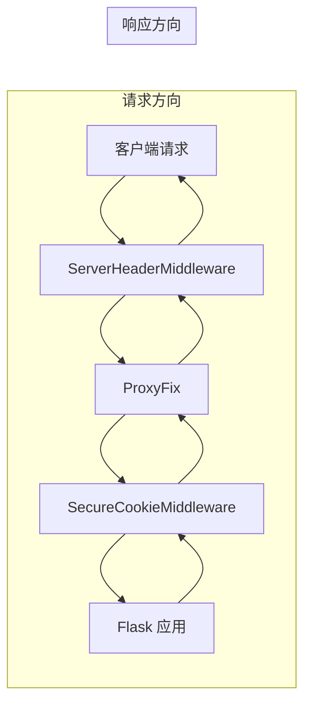
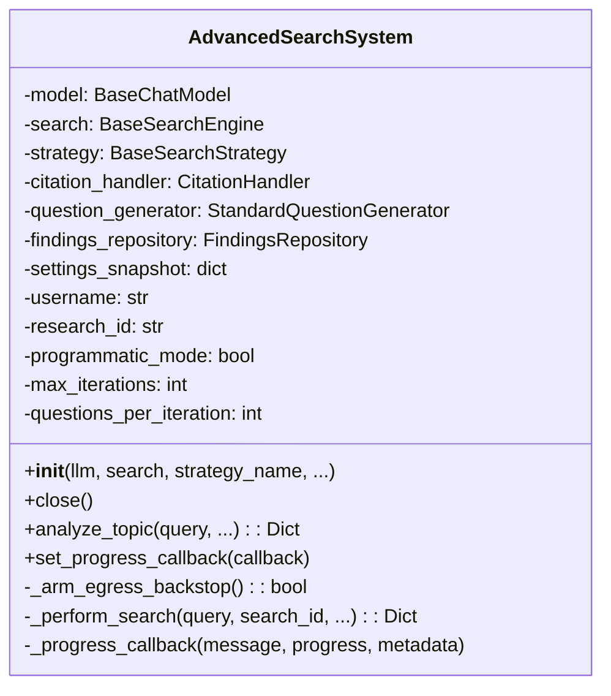
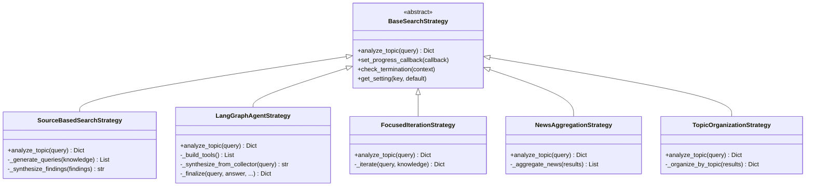
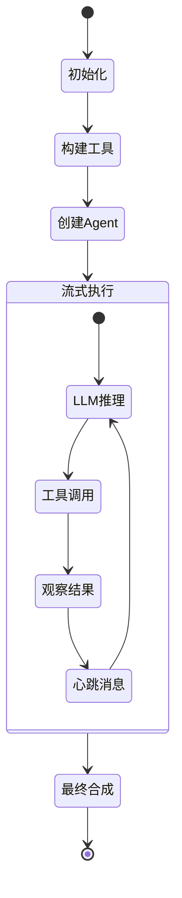
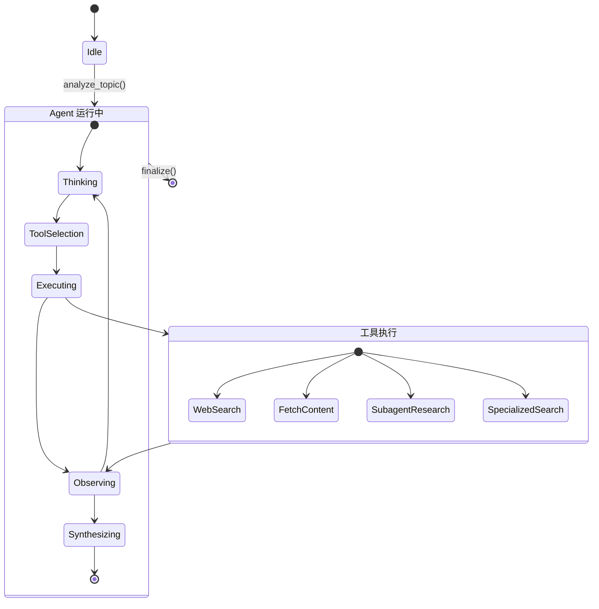
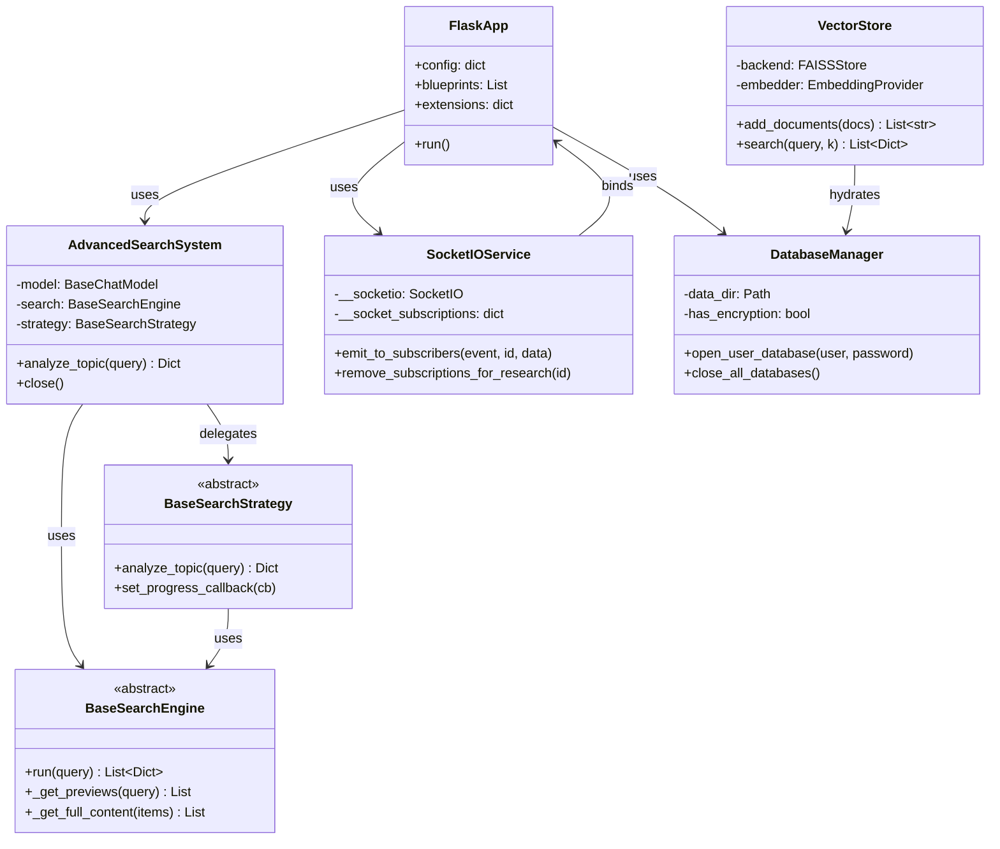
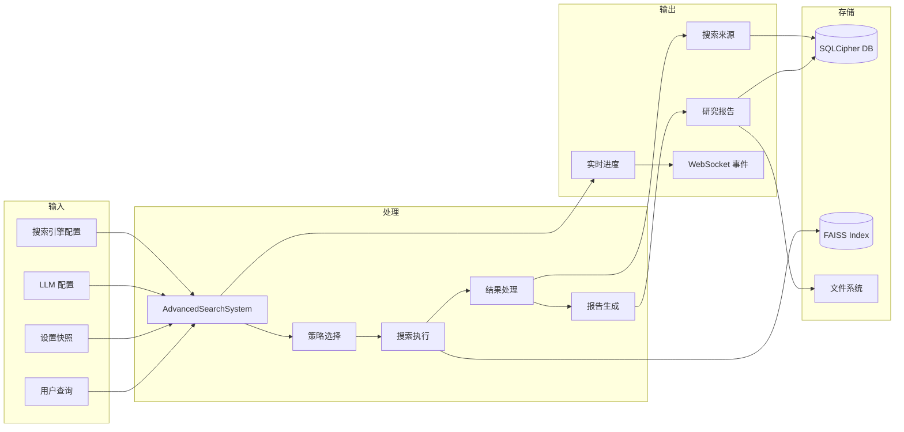

# 第 5 章（上）：核心代码讲解

> 本文档深入讲解 Local Deep Research 的核心代码实现，包含应用入口、搜索系统、策略工厂、LangGraph Agent 等关键模块的详细分析。

---

## 5.1 应用入口与工厂

### 5.1.1 main() 函数完整分析

**文件路径**：`src/local_deep_research/web/app.py`
**行数**：205 行

```python
@logger.catch
def main():
    """应用入口点"""
    # 1. 安装全局线程异常钩子
    _install_thread_excepthook()

    # 2. 加载服务器配置
    config = load_server_config()
    config_logger("ldr_web", debug=config["debug"])

    # 3. 清理旧版 RAG 文档存储
    try:
        from ..vector_stores.legacy_cleanup import migrate_legacy_docstores
        migrate_legacy_docstores()
    except Exception:
        logger.exception("Legacy RAG docstore migration failed at startup")

    # 4. 创建 Flask 应用和 SocketIO 实例
    app, socket_service = create_app()

    # 5. 检查 SQLCipher KDF 配置
    try:
        from ..database.sqlcipher_utils import warn_if_weak_kdf_with_existing_databases
        if db_manager.has_encryption:
            warn_if_weak_kdf_with_existing_databases(db_manager.data_dir)
    except Exception:
        logger.exception("Weak-KDF startup configuration check failed")

    # 6. 启动后台日志队列处理器
    daemon_started = False
    try:
        start_log_queue_processor(app)
        daemon_started = True
    except Exception:
        logger.exception("Failed to start log queue processor")

    # 7. 启动连接清理调度器
    if not debug or os.environ.get("WERKZEUG_RUN_MAIN") == "true":
        cleanup_scheduler = start_connection_cleanup_scheduler(...)

    # 8. 注册 atexit 清理函数（LIFO 顺序）
    atexit.register(shutdown_databases)
    atexit.register(shutdown_scheduler)
    atexit.register(flush_logs_on_exit)
    atexit.register(stop_log_queue_processor)

    # 9. 启动 SocketIO 服务器
    socket_service.run(host=host, port=port, debug=debug)
```

**设计要点**：
- 使用 `@logger.catch` 装饰器捕获所有未处理异常
- 线程异常钩子确保守护线程异常不会静默失败
- atexit 注册顺序为 LIFO，确保资源正确释放顺序
- 所有启动步骤都有异常处理，避免单点故障阻止启动

### 5.1.2 create_app() 初始化序列（12 步）

**文件路径**：`src/local_deep_research/web/app_factory.py`
**行数**：1044 行

```mermaid
flowchart TD
    A[create_app 入口] B[配置日志拦截]
    A --> B
    B --> C[初始化 Flask 应用]
    C --> D[设置自定义 Request 类]
    D --> E[应用中间件栈]
    E --> F[配置 SECRET_KEY]
    F --> G[初始化 CSRF 保护]
    G --> H[初始化安全头和速率限制]
    H --> I[初始化 SocketIOService]
    I --> J[初始化新闻调度器]
    J --> K[注册 Blueprint]
    K --> L[启动队列处理器]
    L --> M[返回 app, socket_service]
```

**详细步骤**：

**步骤 1：日志配置**
```python
# 拦截 stdlib logging 到 loguru
werkzeug_logger = logging.getLogger("werkzeug")
werkzeug_logger.setLevel(logging.WARNING)
if not any(isinstance(h, InterceptHandler) for h in werkzeug_logger.handlers):
    werkzeug_logger.addHandler(InterceptHandler())
```

**步骤 2：Flask 应用初始化**
```python
# 使用包内路径定位静态文件和模板
PACKAGE_DIR = importlib_resources.files("local_deep_research") / "web"
STATIC_DIR = (package_dir / "static").as_posix()
TEMPLATE_DIR = (package_dir / "templates").as_posix()
app = Flask(__name__, static_folder=None, template_folder=TEMPLATE_DIR)
```

**步骤 3：自定义 Request 类**
```python
# 大文件上传到磁盘而非内存
class DiskSpoolingRequest(Request):
    max_form_memory_size = 5 * 1024 * 1024  # 5MB 阈值
app.request_class = DiskSpoolingRequest
```

**步骤 4：中间件栈**
```python
# 从内到外包裹（请求时反向执行）
app.wsgi_app = SecureCookieMiddleware(app.wsgi_app, app)
app.wsgi_app = ProxyFix(app.wsgi_app, x_for=1, x_proto=1, x_host=0, x_port=0, x_prefix=0)
app.wsgi_app = ServerHeaderMiddleware(app.wsgi_app)
```

**步骤 5：SECRET_KEY 管理**
```python
# 生成或加载唯一密钥
secret_key_file = Path(get_data_directory()) / ".secret_key"
try:
    fd = os.open(str(secret_key_file), os.O_WRONLY | os.O_CREAT | os.O_EXCL, 0o600)
    os.write(fd, new_key.encode())
except FileExistsError:
    # 读取已有密钥
    app.config["SECRET_KEY"] = open(secret_key_file).read().strip()
```

**步骤 6：CSRF 保护**
```python
app.config["WTF_CSRF_ENABLED"] = True
CSRFProtect(app)
```

**步骤 7：安全头和速率限制**
```python
SecurityHeaders(app)
limiter.init_app(app)
```

**步骤 8：SocketIO 服务**
```python
socket_service = SocketIOService(app=app)
```

**步骤 9：新闻调度器**
```python
if scheduler_enabled:
    scheduler = get_background_job_scheduler()
    scheduler.initialize_with_settings(settings_manager)
    scheduler.set_app(app)
    scheduler.start()
    app.background_job_scheduler = scheduler
```

**步骤 10：Blueprint 注册**
```python
# 注册顺序很重要
app.register_blueprint(auth_bp)           # /auth
app.register_blueprint(research_bp)       # /
app.register_blueprint(history_bp)        # /history
app.register_blueprint(metrics_bp)        # /metrics
app.register_blueprint(settings_bp)       # /settings
app.register_blueprint(api_bp, url_prefix="/research/api")
app.register_blueprint(benchmark_bp)
app.register_blueprint(news_routes.bp)
app.register_blueprint(chat_bp)
app.register_blueprint(followup_bp)
app.register_blueprint(news_bp, url_prefix="/news")
app.register_blueprint(api_blueprint)     # /api/v1
app.register_blueprint(library_bp)        # /library
app.register_blueprint(rag_bp)            # /library
app.register_blueprint(zotero_bp)         # /library
app.register_blueprint(delete_bp)         # /library/api
app.register_blueprint(search_bp)         # /library
app.register_blueprint(scheduler_bp)
app.register_blueprint(notes_bp)
app.register_blueprint(unified_search_bp)
```

**步骤 11：队列处理器**
```python
if queue_processor_enabled:
    queue_processor.start()
```

### 5.1.3 中间件栈详解



| 中间件 | 功能 | 位置 |
|--------|------|------|
| `ServerHeaderMiddleware` | 移除 Server 头，防止版本泄露 | 最外层 |
| `ProxyFix` | 处理 X-Forwarded-* 头 | 中间层 |
| `SecureCookieMiddleware` | 动态添加 Secure Cookie 标志 | 最内层 |

### 5.1.4 Blueprint 注册顺序

| 顺序 | Blueprint | URL 前缀 | 职责 |
|------|-----------|----------|------|
| 1 | `auth_bp` | `/auth` | 认证路由 |
| 2 | `research_bp` | `/` | 研究页面 |
| 3 | `history_bp` | `/history` | 历史记录 |
| 4 | `metrics_bp` | `/metrics` | 指标 |
| 5 | `settings_bp` | `/settings` | 设置 |
| 6 | `api_bp` | `/research/api` | 研究 API |
| 7 | `benchmark_bp` | - | 基准测试 |
| 8 | `news_routes.bp` | - | 新闻 API |
| 9 | `chat_bp` | - | 聊天 |
| 10 | `followup_bp` | - | 后续研究 |
| 11 | `news_bp` | `/news` | 新闻页面 |
| 12 | `api_blueprint` | `/api/v1` | API v1 |
| 13 | `library_bp` | `/library` | 研究库 |
| 14 | `rag_bp` | `/library` | RAG 管理 |
| 15 | `zotero_bp` | `/library` | Zotero 集成 |
| 16 | `delete_bp` | `/library/api` | 删除管理 |
| 17 | `search_bp` | `/library` | 语义搜索 |
| 18 | `scheduler_bp` | - | 调度器 |
| 19 | `notes_bp` | - | 笔记 |
| 20 | `unified_search_bp` | - | 统一搜索 |

### 5.1.5 服务启动

```python
# SocketIOService.run() 方法
def run(self, host: str, port: int, debug: bool = False) -> None:
    # 抑制 Server 头
    WSGIRequestHandler.version_string = lambda self: ""
    # 启动服务器
    self.__socketio.run(
        self.__app,
        debug=debug,
        host=host,
        port=port,
        allow_unsafe_werkzeug=True,
        use_reloader=False,
    )
```

---

## 5.2 搜索系统核心

### 5.2.1 AdvancedSearchSystem 类完整分析

**文件路径**：`src/local_deep_research/search_system.py`
**行数**：501 行



### 5.2.2 __init__ 方法详解

```python
def __init__(
    self,
    llm: BaseChatModel,
    search: BaseSearchEngine,
    strategy_name: str = "source-based",
    include_text_content: bool = True,
    use_cross_engine_filter: bool = True,
    max_iterations: int | None = None,
    questions_per_iteration: int | None = None,
    use_atomic_facts: bool = False,
    username: str | None = None,
    settings_snapshot: dict | None = None,
    research_id: str | None = None,
    research_context: dict | None = None,
    programmatic_mode: bool = False,
    search_original_query: bool = True,
):
```

**初始化逻辑**：

1. **存储基本组件**：
```python
self.model = llm
self.search = search
self.research_id = research_id
self.research_context = research_context
self.username = username
```

2. **注入用户名到设置快照**：
```python
# 确保快照包含 _username，供 LangGraph Agent 使用
self.settings_snapshot = _ensure_snapshot_username(
    settings_snapshot or {}, username
)
```

3. **读取迭代配置**：
```python
self.max_iterations = max_iterations
if self.max_iterations is None:
    if "search.iterations" in self.settings_snapshot:
        self.max_iterations = unwrap_setting(
            self.settings_snapshot["search.iterations"]
        )
    else:
        self.max_iterations = 1  # 默认值
```

4. **初始化核心组件**：
```python
self.citation_handler = CitationHandler(self.model, settings_snapshot=self.settings_snapshot)
self.question_generator = StandardQuestionGenerator(self.model)
self.findings_repository = FindingsRepository(self.model)
```

5. **创建策略实例**：
```python
# 特殊处理 follow-up 策略
if strategy_name.lower() in ["enhanced-contextual-followup", ...]:
    delegate = create_strategy(...)
    self.strategy = EnhancedContextualFollowUpStrategy(
        model=self.model,
        search=self.search,
        delegate_strategy=delegate,
        ...
    )
else:
    # 使用工厂创建其他策略
    self.strategy = create_strategy(
        strategy_name=strategy_name,
        model=self.model,
        search=self.search,
        ...
    )
```

### 5.2.3 analyze_topic 方法详解

```python
def analyze_topic(
    self,
    query: str,
    is_user_search: bool = True,
    is_news_search: bool = False,
    user_id: str = "anonymous",
    search_id: str | None = None,
    **kwargs,
) -> Dict:
```

**执行流程**：

1. **生成搜索 ID**：
```python
if search_id is None:
    search_id = str(uuid.uuid4())
```

2. **武装出口策略审计钩子**：
```python
_armed_egress = self._arm_egress_backstop()
```

3. **执行搜索**：
```python
try:
    return self._perform_search(query, search_id, is_user_search, is_news_search, user_id)
finally:
    if _armed_egress:
        clear_active_context()
```

### 5.2.4 策略选择与注入

```mermaid
flowchart TD
    A[strategy_name] B{特殊策略?}
    A --> B
    B -->|follow-up| C[创建 delegate 策略]
    C --> D[EnhancedContextualFollowUpStrategy]
    B -->|其他| E[create_strategy 工厂]
    E --> F{策略类型}
    F -->|source-based| G[SourceBasedSearchStrategy]
    F -->|langgraph-agent| H[LangGraphAgentStrategy]
    F -->|focused-iteration| I[FocusedIterationStrategy]
    F -->|news| J[NewsAggregationStrategy]
    F -->|topic-organization| K[TopicOrganizationStrategy]
    F -->|未知| L[默认 SourceBasedSearchStrategy]
```

### 5.2.5 出口策略审计钩子

```python
def _arm_egress_backstop(self) -> bool:
    """为本次运行武装出口策略审计上下文"""
    # 检查是否已武装
    if get_active_context() is not None:
        return False  # 已由调用者武装

    # 构建上下文
    primary = unwrap_setting(
        self.settings_snapshot.get("search.tool", DEFAULT_SEARCH_TOOL)
    )
    ctx = context_from_snapshot(
        self.settings_snapshot,
        primary or DEFAULT_SEARCH_TOOL,
        username=self.username,
    )
    set_active_context(ctx)
    return True
```

### 5.2.6 close 方法

```python
def close(self):
    """关闭资源，级联关闭策略"""
    from .utilities.resource_utils import safe_close
    if hasattr(self, "strategy"):
        safe_close(self.strategy, "search strategy")
```

**注意**：不关闭 `self.search`，因为搜索引擎可能由调用者共享或重用。

---

## 5.3 搜索引擎工厂与注册表

### 5.3.1 create_strategy() 策略映射表

**文件路径**：`src/local_deep_research/search_system_factory.py`
**行数**：402 行

| 策略名称 | 类名 | 说明 |
|----------|------|------|
| `source-based` | `SourceBasedSearchStrategy` | 默认综合研究策略 |
| `focused-iteration` | `FocusedIterationStrategy` | 聚焦迭代策略 |
| `focused-iteration-standard` | `FocusedIterationStrategy` + 标准引用 | 带标准引用的聚焦迭代 |
| `news` | `NewsAggregationStrategy` | 新闻聚合策略 |
| `topic-organization` | `TopicOrganizationStrategy` | 主题组织策略 |
| `langgraph-agent` | `LangGraphAgentStrategy` | LangGraph Agent 策略 |
| `mcp` / `agentic` | `LangGraphAgentStrategy`（已弃用别名） | 重定向到 langgraph-agent |

### 5.3.2 ENGINE_REGISTRY 注册表结构

**文件路径**：`src/local_deep_research/web_search_engines/engine_registry.py`

```python
@dataclass(frozen=True)
class EngineEntry:
    """不可变记录，映射引擎名称到实现"""
    module_path: str           # 模块路径
    class_name: str            # 类名
    full_search_module: Optional[str] = None  # 完整搜索模块
    full_search_class: Optional[str] = None   # 完整搜索类

ENGINE_REGISTRY: Dict[str, EngineEntry] = {
    "arxiv": EngineEntry(
        module_path=".engines.search_engine_arxiv",
        class_name="ArXivSearchEngine",
    ),
    "brave": EngineEntry(
        module_path=".engines.search_engine_brave",
        class_name="BraveSearchEngine",
        full_search_module=".engines.full_search",
        full_search_class="FullSearchResults",
    ),
    # ... 共 30+ 条目
}
```

### 5.3.3 create_search_engine() 完整流程

**文件路径**：`src/local_deep_research/web_search_engines/search_engine_factory.py`
**行数**：744 行

```mermaid
flowchart TD
    A[create_search_engine 入口] B{是已注册检索器?}
    A --> B
    B -->|是| C[评估出口策略]
    C --> D[创建 RetrieverSearchEngine]
    B -->|否| E[从配置提取引擎列表]
    E --> F{引擎名为 none?}
    F -->|是| G[抛出 ValueError]
    F -->|否| H{引擎在配置中?}
    H -->|否| I[尝试显示标签回退]
    I --> J{找到匹配?}
    J -->|否| K[抛出 ValueError]
    J -->|是| L[评估出口策略 PEP]
    H -->|是| L
    L --> M{策略允许?}
    M -->|否| N[抛出 PolicyDeniedError]
    M -->|是| O[获取引擎配置]
    O --> P{需要 API key?}
    P -->|是| Q[从快照获取 API key]
    P -->|否| R[检查 LLM 需求]
    Q --> R
    R --> S[加载引擎类]
    S --> T[过滤初始化参数]
    T --> U[创建引擎实例]
    U --> V[设置 _engine_name]
    V --> W[配置 programmatic_mode]
    W --> X{启用 LLM 相关性过滤?}
    X -->|是| Y[设置 enable_llm_relevance_filter]
    X -->|否| Z[返回引擎]
    Y --> Z
    D --> Z
```

**关键代码段**：

```python
def create_search_engine(
    engine_name: str,
    llm=None,
    username: str | None = None,
    settings_snapshot: Dict[str, Any] | None = None,
    programmatic_mode: bool = False,
    **kwargs,
) -> Optional[BaseSearchEngine]:
    # 1. 检查是否是已注册检索器
    retriever = retriever_registry.get(engine_name)
    if retriever:
        # 评估出口策略
        _decision = evaluate_retriever(engine_name, _ctx, metadata=_meta)
        if not _decision.allowed:
            raise PolicyDeniedError(_decision, target=engine_name)
        return RetrieverSearchEngine(retriever=retriever, ...)

    # 2. 从配置获取引擎列表
    config = search_config(username=username, settings_snapshot=settings_snapshot)

    # 3. 评估出口策略
    primary_engine = resolve_run_primary_engine(settings_snapshot, default=engine_name)
    ctx = context_from_snapshot(settings_snapshot, primary_engine, username=username)
    decision = evaluate_engine(engine_name, ctx, settings_snapshot=settings_snapshot, metadata=config.get(engine_name))
    if not decision.allowed:
        raise PolicyDeniedError(decision, target=engine_name)

    # 4. 加载引擎类
    engine_class = get_safe_module_class(module_path, class_name)

    # 5. 过滤参数并创建实例
    filtered_params = {k: v for k, v in all_params.items() if k in engine_init_params[1:]}
    engine = engine_class(**filtered_params)

    # 6. 配置 LLM 相关性过滤
    if should_filter and hasattr(engine, "llm") and engine.llm:
        engine.enable_llm_relevance_filter = True

    return engine
```

---

## 5.4 高级搜索系统总览

### 5.4.1 策略模式架构



### 5.4.2 双阶段检索管道

```mermaid
flowchart TD
    A[查询] B[_get_previews 获取预览]
    A --> B
    B --> C[预览过滤]
    C --> D{LLM 相关性过滤启用?}
    D -->|是| E[_filter_for_relevance]
    D -->|否| F[跳过]
    E --> G{仅摘要模式?}
    F --> G
    G -->|是| H[返回 snippet 结果]
    G -->|否| I[_get_full_content 获取完整内容]
    I --> J[内容过滤]
    J --> K[返回结果]
```

**伪代码**：

```python
def run(self, query, research_context=None):
    # 阶段 1：获取预览
    previews = self._get_previews(query)
    
    # 预览过滤
    for preview_filter in self._preview_filters:
        previews = preview_filter.filter_results(previews, query)
    
    # LLM 相关性过滤
    if self.enable_llm_relevance_filter and self.llm:
        filtered_items = self._filter_for_relevance(previews, query)
    else:
        filtered_items = previews
    
    # 阶段 2：获取完整内容
    if not self.search_snippets_only:
        results = self._get_full_content(filtered_items)
    else:
        results = filtered_items
    
    # 内容过滤
    for content_filter in self._content_filters:
        results = content_filter.filter_results(results, query)
    
    return results
```

### 5.4.3 并行搜索执行

**文件路径**：`src/local_deep_research/advanced_search_system/parallel_search.py`

```python
def run_parallel_searches(
    queries: List[str],
    search_engine: BaseSearchEngine,
    max_workers: int = 5,
) -> List[List[Dict]]:
    """并行执行多个搜索查询"""
    results = []
    with ThreadPoolExecutor(max_workers=max_workers) as executor:
        futures = {
            executor.submit(search_engine.run, query): query
            for query in queries
        }
        for future in as_completed(futures):
            query = futures[future]
            try:
                result = future.result()
                results.append(result)
            except Exception as e:
                logger.error(f"Search failed for query '{query}': {e}")
    return results
```

---

## 5.5 LangGraph Agent 策略

### 5.5.1 自主决策循环

**文件路径**：`src/local_deep_research/advanced_search_system/strategies/langgraph_agent_strategy.py`
**行数**：1700+ 行



### 5.5.2 动态引擎选择

```python
def _load_specialized_engine_tools(
    skip_engine: str | None,
    model: BaseChatModel,
    settings_snapshot: dict,
    collector: SearchResultsCollector,
    programmatic_mode: bool = False,
    egress_context=None,
) -> list:
    """加载所有可用的专用搜索引擎工具，经过出口策略过滤"""
    tools = []
    
    # 获取候选引擎池
    eligible = list_eligible_engine_configs(settings_snapshot=settings_snapshot)
    
    for name, config in eligible.items():
        # 跳过主引擎（已有 web_search 工具）
        if name == skip_engine:
            continue
        
        # 检查引擎是否对 Agent 启用
        if not config.get("agent_enabled", True):
            continue
        
        # STRICT 模式下不注册专用引擎
        if egress_context and egress_context.scope == EgressScope.STRICT:
            continue
        
        # 评估出口策略
        if egress_context:
            decision = evaluate_engine(name, egress_context, metadata=config)
            if not decision.allowed:
                continue
        
        # 创建工具
        tools.append(_make_specialized_search_tool(name, description, ...))
    
    return tools
```

### 5.5.3 并行子代理研究

```python
def _make_research_subtopic_tool(
    search_engine_name: str,
    model: BaseChatModel,
    settings_snapshot: dict,
    collector: SearchResultsCollector,
    max_sub_iterations: int,
    ...
):
    @tool
    def research_subtopic(subtopics: List[str]) -> str:
        """研究多个子主题，并行执行"""
        # 限制子主题数量
        if len(subtopics) > MAX_SUBTOPICS:
            dropped = subtopics[MAX_SUBTOPICS:]
            subtopics = subtopics[:MAX_SUBTOPICS]
        
        # 创建线程池
        effective_workers = max(1, min(max_subagent_workers, len(subtopics)))
        executor = ThreadPoolExecutor(max_workers=effective_workers)
        
        # 提交任务
        futures = {
            executor.submit(_run_subagent_with_egress, (task_id, topic)): (task_id, topic)
            for task_id, topic in enumerate(subtopics)
        }
        
        # 等待结果（带超时）
        while pending:
            # 检查完成、超时、整体超时
            ...
        
        # 按原始顺序返回结果
        return "\n\n---\n\n".join(parts)
    
    return research_subtopic
```

### 5.5.4 Mermaid 状态图



---

## 5.6 候选探索与证据收集

### 5.6.1 AdaptiveExplorer

**文件路径**：`src/local_deep_research/advanced_search_system/candidate_exploration/adaptive_explorer.py`

```python
class AdaptiveExplorer(BaseExplorer):
    """自适应探索器，根据查询复杂度动态调整探索策略"""
    
    def explore(self, query: str, knowledge: Dict) -> List[Candidate]:
        # 评估查询复杂度
        complexity = self._assess_complexity(query)
        
        if complexity < 0.3:
            # 简单查询：直接搜索
            return self._simple_search(query)
        elif complexity < 0.7:
            # 中等查询：分解后搜索
            sub_queries = self._decompose(query)
            return self._parallel_search(sub_queries)
        else:
            # 复杂查询：多轮迭代
            return self._iterative_exploration(query, knowledge)
```

### 5.6.2 ParallelExplorer

**文件路径**：`src/local_deep_research/advanced_search_system/candidate_exploration/parallel_explorer.py`

```python
class ParallelExplorer(BaseExplorer):
    """并行探索器，同时从多个来源收集候选"""
    
    def explore(self, query: str, knowledge: Dict) -> List[Candidate]:
        # 生成多个搜索角度
        angles = self._generate_angles(query)
        
        # 并行搜索
        with ThreadPoolExecutor(max_workers=self.max_workers) as executor:
            futures = [
                executor.submit(self._search_angle, angle)
                for angle in angles
            ]
            results = [f.result() for f in as_completed(futures)]
        
        # 合并和去重
        return self._merge_results(results)
```

### 5.6.3 ProgressiveExplorer

**文件路径**：`src/local_deep_research/advanced_search_system/candidate_exploration/progressive_explorer.py`

```python
class ProgressiveExplorer(BaseExplorer):
    """渐进探索器，逐步缩小候选范围"""
    
    def explore(self, query: str, knowledge: Dict) -> List[Candidate]:
        # 初始广泛搜索
        candidates = self._broad_search(query)
        
        # 逐步过滤
        for iteration in range(self.max_iterations):
            # 评估候选
            scored = self._score_candidates(candidates, query)
            
            # 保留高分候选
            candidates = [c for c, s in scored if s > self.threshold]
            
            # 如果候选足够，提前终止
            if len(candidates) >= self.target_count:
                break
            
            # 扩展搜索
            new_candidates = self._expand_search(candidates, query)
            candidates.extend(new_candidates)
        
        return candidates
```

### 5.6.4 EvidenceEvaluator 证据评估

**文件路径**：`src/local_deep_research/advanced_search_system/evidence/evaluator.py`

```python
class EvidenceEvaluator:
    """评估证据的相关性和可靠性"""
    
    def evaluate(self, evidence: Dict, query: str) -> float:
        # 相关性评分
        relevance = self._score_relevance(evidence, query)
        
        # 可靠性评分
        reliability = self._score_reliability(evidence)
        
        # 时效性评分
        timeliness = self._score_timeliness(evidence)
        
        # 综合评分
        return (
            relevance * self.relevance_weight +
            reliability * self.reliability_weight +
            timeliness * self.timeliness_weight
        )
```

### 5.6.5 候选排序算法

```python
def rank_candidates(
    candidates: List[Candidate],
    query: str,
    knowledge: Dict,
) -> List[Candidate]:
    """多因素候选排序"""
    scored = []
    for candidate in candidates:
        # 相关性分数
        relevance = compute_relevance(candidate, query)
        
        # 新颖性分数（与已有知识的重叠度）
        novelty = compute_novelty(candidate, knowledge)
        
        # 权威性分数
        authority = compute_authority(candidate.source)
        
        # 综合分数
        score = (
            relevance * 0.5 +
            novelty * 0.3 +
            authority * 0.2
        )
        scored.append((candidate, score))
    
    # 按分数排序
    scored.sort(key=lambda x: x[1], reverse=True)
    return [c for c, _ in scored]
```

---

## 5.7 知识库与发现管理

### 5.7.1 FindingsRepository 积累模式

**文件路径**：`src/local_deep_research/advanced_search_system/findings/repository.py`

```python
class FindingsRepository:
    """发现仓库，管理研究过程中的发现积累"""
    
    def __init__(self, model: BaseChatModel):
        self.model = model
        self.findings: List[Finding] = []
        self._knowledge_embedding: Optional[np.ndarray] = None
    
    def add_finding(self, finding: Finding):
        """添加新发现，自动去重和排序"""
        # 检查重复
        if self._is_duplicate(finding):
            return
        
        # 添加到列表
        self.findings.append(finding)
        
        # 更新知识嵌入
        self._update_knowledge_embedding(finding)
    
    def get_accumulated_knowledge(self) -> str:
        """获取累积的知识摘要"""
        if not self.findings:
            return ""
        
        # 按时间排序
        sorted_findings = sorted(self.findings, key=lambda f: f.timestamp)
        
        # 生成摘要
        summary = self._synthesize_findings(sorted_findings)
        return summary
    
    def _is_duplicate(self, finding: Finding) -> bool:
        """基于嵌入向量的重复检测"""
        if self._knowledge_embedding is None:
            return False
        
        finding_embedding = embed(finding.content)
        similarity = cosine_similarity(finding_embedding, self._knowledge_embedding)
        return similarity > self.duplicate_threshold
```

### 5.7.2 FollowUpContextHandler 上下文管理

**文件路径**：`src/local_deep_research/advanced_search_system/knowledge/followup_context_manager.py`

```python
class FollowUpContextHandler:
    """管理后续研究的上下文"""
    
    def __init__(self, settings_snapshot: dict):
        self.settings = settings_snapshot
        self.context_window = self._get_context_window()
        self.accumulated_context: Dict = {}
    
    def extract_context_updates(self, new_content: str) -> Dict:
        """从新内容中提取上下文更新"""
        updates = {}
        
        # 提取实体
        entities = self._extract_entities(new_content)
        if entities:
            updates["entities"] = entities
        
        # 提取主题
        topics = self._extract_topics(new_content)
        if topics:
            updates["topics"] = topics
        
        # 提取来源计数
        source_count = self._count_sources(new_content)
        if source_count:
            updates["source_count"] = source_count
        
        return updates
    
    def build_followup_context(self, chat_history: List[Dict]) -> str:
        """构建后续研究的上下文提示"""
        # 从聊天历史中提取关键信息
        key_points = self._extract_key_points(chat_history)
        
        # 构建上下文
        context = "Previous research context:\n"
        for point in key_points[-self.context_window:]:
            context += f"- {point}\n"
        
        return context
```

---

## 5.8 设计模式识别

### 5.8.1 策略模式（Strategy Pattern）

**应用位置**：`advanced_search_system/strategies/`

```python
# 抽象策略
class BaseSearchStrategy(ABC):
    @abstractmethod
    def analyze_topic(self, query: str) -> Dict:
        pass

# 具体策略
class SourceBasedSearchStrategy(BaseSearchStrategy):
    def analyze_topic(self, query: str) -> Dict:
        # 实现源基础搜索
        ...

class LangGraphAgentStrategy(BaseSearchStrategy):
    def analyze_topic(self, query: str) -> Dict:
        # 实现 Agent 搜索
        ...

# 上下文
class AdvancedSearchSystem:
    def __init__(self, strategy_name: str, ...):
        self.strategy = create_strategy(strategy_name, ...)
    
    def analyze_topic(self, query: str) -> Dict:
        return self.strategy.analyze_topic(query)
```

### 5.8.2 工厂模式（Factory Pattern）

**应用位置**：`search_system_factory.py`, `search_engine_factory.py`

```python
# 策略工厂
def create_strategy(strategy_name: str, ...) -> BaseSearchStrategy:
    if strategy_name == "source-based":
        return SourceBasedSearchStrategy(...)
    elif strategy_name == "langgraph-agent":
        return LangGraphAgentStrategy(...)
    # ...

# 引擎工厂
def create_search_engine(engine_name: str, ...) -> BaseSearchEngine:
    # 加载配置、评估策略、创建实例
    ...
```

### 5.8.3 观察者模式（Observer Pattern）

**应用位置**：`socket_service.py`, `research_service.py`

```python
# 主题
class SocketIOService:
    def emit_to_subscribers(self, event_base, research_id, data):
        full_event = f"{event_base}_{research_id}"
        for sid in self.__socket_subscriptions.get(research_id, []):
            self.__socketio.emit(full_event, data, room=sid)

# 观察者（前端）
# socket.on('progress_' + research_id, function(data) { ... })
```

### 5.8.4 门面模式（Facade Pattern）

**应用位置**：`vector_stores/facade.py`

```python
class VectorStore:
    """向量存储门面，简化底层 FAISS 操作"""
    
    def __init__(self, config: dict):
        self._backend = FAISSStore(config)
        self._embedder = get_embedding_provider(config)
    
    def add_documents(self, documents: List[Dict]) -> List[str]:
        """添加文档到向量存储"""
        # 生成嵌入
        embeddings = self._embedder.embed([doc["text"] for doc in documents])
        # 添加到后端
        ids = self._backend.add(embeddings, documents)
        return ids
    
    def search(self, query: str, k: int = 10) -> List[Dict]:
        """搜索相似文档"""
        # 生成查询嵌入
        query_embedding = self._embedder.embed_query(query)
        # 搜索后端
        results = self._backend.search(query_embedding, k)
        return results
```

---

## 5.9 潜在问题与改进点

### 5.9.1 代码复杂度

| 模块 | 问题 | 建议 |
|------|------|------|
| `research_service.py` | 3091 行，函数过长 | 拆分为多个子模块 |
| `langgraph_agent_strategy.py` | 1700+ 行，工具构建逻辑复杂 | 提取工具构建器类 |
| `app_factory.py` | 1044 行，初始化逻辑集中 | 拆分为多个配置函数 |

### 5.9.2 错误处理

| 位置 | 问题 | 建议 |
|------|------|------|
| `BaseSearchEngine.run()` | 异常后返回空结果，调用者无法区分 | 使用自定义异常类型 |
| `create_search_engine()` | 失败返回 None，调用者需检查 | 使用 Result 模式或异常 |

### 5.9.3 性能优化

| 位置 | 问题 | 建议 |
|------|------|------|
| 搜索预览过滤 | 串行执行过滤器 | 支持并行过滤 |
| 嵌入生成 | 逐文档生成 | 批量生成 |
| FAISS 搜索 | 每次搜索都加载索引 | 缓存索引 |

### 5.9.4 安全加固

| 位置 | 问题 | 建议 |
|------|------|------|
| 会话密码 | 内存存储，重启丢失 | 可选持久化加密存储 |
| 日志脱敏 | 依赖正则表达式 | 使用结构化日志 |

---

## 5.10 关键函数签名索引

| 函数 | 文件 | 行数 | 签名 |
|------|------|------|------|
| `main()` | `web/app.py` | 57 | `def main()` |
| `create_app()` | `web/app_factory.py` | 51 | `def create_app() -> tuple[Flask, SocketIOService]` |
| `AdvancedSearchSystem.__init__()` | `search_system.py` | 58 | `def __init__(self, llm, search, strategy_name, ...)` |
| `AdvancedSearchSystem.analyze_topic()` | `search_system.py` | 305 | `def analyze_topic(self, query, ...) -> Dict` |
| `create_strategy()` | `search_system_factory.py` | 30 | `def create_strategy(strategy_name, ...)` |
| `create_search_engine()` | `search_engine_factory.py` | 13 | `def create_search_engine(engine_name, ...)` |
| `BaseSearchEngine.run()` | `search_engine_base.py` | 575 | `def run(self, query, research_context) -> List[Dict]` |
| `LangGraphAgentStrategy.analyze_topic()` | `langgraph_agent_strategy.py` | 1337 | `def analyze_topic(self, query) -> Dict` |
| `start_research_process()` | `research_service.py` | 344 | `def start_research_process(research_id, query, mode, ...)` |
| `run_research_process()` | `research_service.py` | 824 | `def run_research_process(research_id, query, mode, **kwargs)` |
| `SocketIOService.emit_to_subscribers()` | `socket_service.py` | 235 | `def emit_to_subscribers(self, event_base, research_id, data)` |

---

## 5.11 核心类图



---

## 5.12 数据流图



---

> 本章（上）涵盖了应用入口、搜索系统核心、策略工厂、LangGraph Agent、候选探索、知识管理等核心模块的代码讲解。每个模块均包含文件路径、行数、类/函数签名、核心逻辑分析、设计模式识别和潜在问题分析。

---

☕️ 制作不易，请我喝咖啡☕️关注我➕

