# 第 6 章：数据模型与数据库设计

> 本章深入分析 Local Deep Research 的完整数据库设计。项目采用 SQLCipher 加密数据库，每个用户拥有独立的加密数据库，涵盖研究任务、搜索查询、文档存储、RAG 索引、聊天、笔记、新闻、指标等 24 个模型文件、50+ 张数据表。

---

## 目录

- [6.1 ER 关系图](#61-er-关系图)
- [6.2 核心表结构详解](#62-核心表结构详解)
- [6.3 索引与约束策略](#63-索引与约束策略)
- [6.4 SQLCipher 加密设计](#64-sqlcipher-加密设计)
- [6.5 Alembic 迁移系统](#5-alembic-迁移系统)
- [6.6 缓存策略](#66-缓存策略)
- [6.7 事务设计](#67-事务设计)

---

## 6.1 ER 关系图

```mermaid
erDiagram
    %% ========== 研究核心 ==========
    research_tasks ||--o{ search_queries : has
    research_tasks ||--o{ search_results : has
    research_tasks ||--o{ reports : generates
    search_queries ||--o{ search_results : produces

    %% ========== 研究历史 ==========
    research_history ||--o{ research_resources : has
    research_history ||--o{ research_strategies : uses
    research_history ||--o{ chat_sessions : spawns
    research_history ||--o{ chat_messages : contains
    research_history ||--o{ chat_progress_steps : tracks
    research_history ||--o{ documents : downloads

    %% ========== 文档存储 ==========
    documents ||--o| document_blobs : has
    documents }o--o{ document_collections : organized_as
    collections ||--o{ document_collections : contains
    collections ||--o{ collection_folders : links
    collection_folders ||--o{ collection_folder_files : contains
    source_types ||--o{ documents : categorizes

    %% ========== RAG 分块 ==========
    documents ||--o{ document_chunks : splits_into
    collections ||--o{ rag_indices : indexes
    rag_indices ||--o{ rag_document_status : tracks
    documents ||--o{ rag_document_status : indexed_as
    collections ||--o{ rag_document_status : indexes

    %% ========== 聊天 ==========
    chat_sessions ||--o{ chat_messages : contains
    chat_sessions ||--o{ chat_progress_steps : has
    chat_sessions ||--o{ research_history : spawns
    chat_messages ||--o{ reports : generates

    %% ========== 笔记 ==========
    documents ||--o{ note_versions : versions
    documents ||--o{ note_links : links
    documents ||--o{ note_research : pins
    documents ||--o{ note_references : references
    documents ||--o{ note_syntheses : synthesizes

    %% ========== 新闻 ==========
    news_subscriptions ||--o{ subscription_folders : organized_in
    news_subscriptions ||--o{ news_cards : generates
    news_cards ||--o{ news_user_ratings : rated_by
    news_user_preferences ||--o{ news_subscriptions : configures

    %% ========== 引用/期刊 ==========
    papers ||--o{ paper_appearances : appears_as
    research_resources ||--o| paper_appearances : recorded_as
    journals ||--o{ papers : publishes

    %% ========== 指标 ==========
    research_history ||--o{ token_usage : consumes
    research_history ||--o{ model_usage : tracks
    research_history ||--o{ research_ratings : rated_by
    research_history ||--o{ search_calls : makes

    %% ========== 队列 ==========
    research_resources ||--o| download_queue : queued_as
    collections ||--o{ download_queue : targets
    queue_status ||--o{ queued_researches : manages

    %% ========== 设置 ==========
    users ||--o{ user_settings : configures
    users ||--o{ api_keys : holds

    %% ========== 文件完整性 ==========
    file_integrity_records ||--o{ file_verification_failures : has

    %% ========== Zotero ==========
    zotero_sync_state ||--o{ zotero_item_map : tracks

    %% ========== 基准测试 ==========
    benchmark_run ||--o{ benchmark_result : produces
    benchmark_run ||--o{ benchmark_config : uses
    benchmark_run ||--o{ benchmark_progress : tracks

    research_tasks {
        integer id PK
        string title
        string status
        integer priority
        json tags
        json research_metadata
        utc_datetime created_at
        utc_datetime updated_at
    }

    search_queries {
        integer id PK
        integer research_task_id FK
        text query
        string search_engine
        string status
        json parameters
    }

    search_results {
        integer id PK
        integer research_task_id FK
        integer search_query_id FK
        string title
        text url
        text content
        float relevance_score
        string domain
    }

    research_history {
        string id PK "UUID"
        text query
        text mode
        text status
        text created_at
        integer duration_seconds
        text report_path
        text report_content
        json research_meta
        json progress_log
        integer progress
        string chat_session_id FK
    }

    documents {
        string id PK "UUID"
        string source_type_id FK
        string document_hash "UNIQUE"
        text text_content
        integer file_size
        string file_type
        string doi
        string arxiv_id
        string pmid
        string status
    }

    document_blobs {
        string document_id PK,FK
        blob pdf_binary
        string blob_hash
    }

    collections {
        string id PK "UUID"
        string name
        string collection_type
        boolean is_default
        string embedding_model
        string chunk_size
    }

    document_chunks {
        integer id PK "AUTOINCREMENT"
        string chunk_hash
        string source_type
        string source_id FK
        string collection_name
        text chunk_text
        integer chunk_index
        string embedding_id "UNIQUE"
        string embedding_model
    }

    rag_indices {
        integer id PK
        string collection_name
        string embedding_model
        text index_path
        string index_hash "UNIQUE"
        integer chunk_count
        string status
    }

    chat_sessions {
        string id PK "UUID"
        text title
        string model
        integer message_count
        string status
    }

    chat_messages {
        string id PK "UUID"
        string session_id FK
        string role
        text content
        json metadata
    }

    news_subscriptions {
        string id PK
        string name
        string subscription_type
        text query_or_topic
        integer refresh_interval_minutes
        string status
    }

    token_usage {
        integer id PK
        string research_id FK
        integer prompt_tokens
        integer completion_tokens
        integer total_tokens
        string model
    }

    users {
        integer id PK
        string username "UNIQUE"
        string password_hash
        boolean is_active
    }
```



**ER 关系图说明**：该图展示了 Local Deep Research 数据库的核心实体关系。分为 12 个功能域：研究核心（蓝色区域，research_tasks → search_queries/search_results/reports）、研究历史（research_history 为中心连接 resources/strategies/chat）、文档存储（documents 与 collections 多对多，独立 BLOB 表）、RAG 分块（document_chunks 由 documents 分块得到，rag_indices 跟踪 FAISS 索引）、聊天（chat_sessions → chat_messages）、笔记（documents 的 version/link/research/reference/synthesis 子表）、新闻（subscriptions → cards → ratings）、引用/期刊（papers ↔ journals）、指标（token_usage/model_usage/ratings/search_calls）、队列（download_queue/queue_status）、设置（users → settings/api_keys）、文件完整性、Zotero 同步、基准测试。关键设计包括：research_history 使用 UUID 主键（String(36)），DocumentChunk 使用 AUTOINCREMENT int 主键（防止 id 复用导致向量指向错误文档），document_hash 唯一约束用于去重。

---

## 6.2 核心表结构详解

### 6.2.1 研究核心模型

**文件**：`database/models/research.py`

#### research_tasks 表

研究任务的顶层对象，包含所有研究活动。

| 字段 | 类型 | 约束 | 说明 |
|------|------|------|------|
| id | Integer | PK | 自增主键 |
| title | String(500) | NOT NULL | 研究标题 |
| description | Text | nullable | 研究描述 |
| status | String(50) | default "pending" | pending/in_progress/completed/failed |
| priority | Integer | default 0 | 优先级（高数=高优先） |
| tags | JSON | nullable | 分类标签列表 |
| research_metadata | JSON | nullable | 灵活扩展字段 |
| created_at | UtcDateTime | default utcnow() | 创建时间 |
| updated_at | UtcDateTime | onupdate utcnow() | 更新时间 |
| started_at | UtcDateTime | nullable | 开始时间 |
| completed_at | UtcDateTime | nullable | 完成时间 |

**关系**：
- `searches` → `SearchQuery`（cascade all, delete-orphan）
- `results` → `SearchResult`（cascade all, delete-orphan）
- `reports` → `Report`（cascade all, delete-orphan）

#### search_queries 表

作为研究任务一部分执行的单个搜索查询。

| 字段 | 类型 | 约束 | 说明 |
|------|------|------|------|
| id | Integer | PK | 自增主键 |
| research_task_id | Integer | FK → research_tasks.id, CASCADE | 所属任务 |
| query | Text | NOT NULL | 搜索查询文本 |
| search_engine | String(50) | nullable | 搜索引擎名 |
| search_type | String(50) | nullable | web/academic/news 等 |
| parameters | JSON | nullable | 额外搜索参数 |
| status | String(50) | default "pending" | 执行状态 |
| error_message | Text | nullable | 错误消息 |
| retry_count | Integer | default 0 | 重试次数 |

**索引**：
- `idx_research_task_status`：(research_task_id, status) 复合索引
- `idx_search_engine`：(search_engine, status) 复合索引

#### search_results 表

搜索查询的单个结果。

| 字段 | 类型 | 约束 | 说明 |
|------|------|------|------|
| id | Integer | PK | 自增主键 |
| research_task_id | Integer | FK → research_tasks.id, CASCADE | 所属任务 |
| search_query_id | Integer | FK → search_queries.id, CASCADE | 来源查询 |
| title | String(500) | nullable | 结果标题 |
| url | Text, index | nullable | 结果 URL |
| snippet | Text | nullable | 搜索结果摘要 |
| content | Text | nullable | 抓取的完整内容 |
| content_type | String(50) | nullable | html/pdf/text 等 |
| content_hash | String(64) | nullable | SHA256 去重 |
| relevance_score | Float | nullable | 相关性评分 |
| position | Integer | nullable | 在搜索结果中的位置 |
| domain | String(255), index | nullable | 域名 |
| language | String(10) | nullable | 语言代码 |
| published_date | UtcDateTime | nullable | 发布日期 |
| author | String(255) | nullable | 作者 |
| fetch_status | String(50) | nullable | pending/fetched/failed/skipped |

**索引**：
- `idx_task_relevance`：(research_task_id, relevance_score)
- `idx_content_hash`：(content_hash)
- `idx_domain_task`：(domain, research_task_id)

### 6.2.2 研究历史模型

**文件**：`database/models/research.py`

#### research_history 表

研究会话及其进度的跟踪记录。使用 UUID 作为主键（非自增整数）。

| 字段 | 类型 | 约束 | 说明 |
|------|------|------|------|
| id | String(36) | PK | UUID 主键 |
| query | Text | NOT NULL | 搜索查询 |
| mode | Text | NOT NULL | quick_summary/detailed_report 等 |
| status | Text | NOT NULL | 当前状态 |
| created_at | Text | NOT NULL | 开始时间（ISO 字符串） |
| completed_at | Text | nullable | 完成时间 |
| duration_seconds | Integer | nullable | 持续时间（秒） |
| report_path | Text | nullable | 报告文件路径 |
| report_content | Text | nullable | 报告内容（DB 存储） |
| research_meta | JSON | nullable | 额外元数据 |
| progress_log | JSON | nullable | 进度日志 |
| progress | Integer | nullable | 进度百分比 |
| title | Text | nullable | 报告标题 |
| chat_session_id | String(36) | FK → chat_sessions.id, SET NULL, nullable | 关联聊天会话 |
| step_count | Integer | default 0 | 进度步骤原子计数器 |

**唯一约束**：
- `ux_research_history_chat_session_in_progress`：部分唯一索引
  - 条件：`status = 'in_progress' AND chat_session_id IS NOT NULL`
  - 保证每个聊天会话最多只有一个进行中的研究

#### research_strategies 表

跟踪每个研究使用的搜索策略。

| 字段 | 类型 | 约束 | 说明 |
|------|------|------|------|
| id | Integer | PK | 自增主键 |
| research_id | String(36) | FK → research_history.id, CASCADE, UNIQUE, index | 关联研究 |
| strategy_name | String(100) | NOT NULL, index | 策略名称 |
| created_at | UtcDateTime | server_default utcnow() | 创建时间 |

#### research_resources 表

研究关联的资源（URL、文档等）。

| 字段 | 类型 | 约束 | 说明 |
|------|------|------|------|
| id | Integer | PK | 自增主键 |
| research_id | String(36) | FK → research_history.id, CASCADE, index | 所属研究 |
| title | Text | nullable | 资源标题 |
| url | Text | nullable | 资源 URL |
| content_preview | Text | nullable | 内容预览 |
| source_type | Text | nullable | 来源类型 |
| resource_metadata | JSON | nullable | 额外元数据 |
| document_id | String(36) | FK → documents.id, SET NULL, nullable | 关联文档 |

### 6.2.3 认证模型

**文件**：`database/models/auth.py`

#### users 表

系统用户认证表。**密码即密钥**设计——用户密码同时是数据库加密密钥。

| 字段 | 类型 | 约束 | 说明 |
|------|------|------|------|
| id | Integer | PK | 自增主键 |
| username | String(100) | UNIQUE, NOT NULL | 用户名 |
| password_hash | String(255) | NOT NULL | bcrypt 哈希（用于认证） |
| is_active | Boolean | default True | 是否激活 |
| created_at | UtcDateTime | default utcnow() | 创建时间 |
| last_login | UtcDateTime | nullable | 最后登录时间 |

**安全设计**：
- `password_hash` 仅用于认证（bcrypt 哈希），不用于加密
- 数据库加密密钥由原始密码通过 PBKDF2 派生（不存储）
- 密码更改需要重新加密整个数据库

### 6.2.4 文档存储模型

**文件**：`database/models/library.py`

#### documents 表

统一文档表（研究下载 + 用户上传）。

| 字段 | 类型 | 约束 | 说明 |
|------|------|------|------|
| id | String(36) | PK | UUID 主键 |
| source_type_id | String(36) | FK → source_types.id, NOT NULL, index | 来源类型 |
| resource_id | Integer | FK → research_resources.id, SET NULL, nullable | 关联资源 |
| research_id | String(36) | FK → research_history.id, CASCADE, nullable | 关联研究 |
| upload_batch_id | String(36) | FK → upload_batches.id, SET NULL, nullable | 上传批次 |
| document_hash | String(64) | UNIQUE, NOT NULL, index | SHA256 去重 |
| original_url | Text | nullable | 来源 URL |
| filename | String(500) | nullable | 显示文件名 |
| file_path | Text | nullable | 上传文件路径 |
| file_size | Integer | NOT NULL | 文件大小（字节） |
| file_type | String(50) | NOT NULL | pdf/txt/md/html 等 |
| mime_type | String(100) | nullable | MIME 类型 |
| text_content | Text | nullable | 提取/上传的文本 |
| storage_mode | String(20) | default "database" | PDF 存储模式 |
| title | Text | nullable | 文档标题 |
| authors | JSON | nullable | 作者列表 |
| published_date | Date | nullable | 发布日期 |
| doi | String(255), index |nullable | DOI 标识符 |
| arxiv_id | String(100), index | nullable | arXiv ID |
| pmid | String(50), index | nullable | PubMed ID |
| pmcid | String(50), index | nullable | PMC ID |
| status | Enum(DocumentStatus) | NOT NULL, default COMPLETED | 处理状态 |
| extraction_method | String(50) | nullable | 提取方法 |
| extraction_quality | String(20) | nullable | 提取质量 |
| word_count | Integer | nullable | 字数 |
| tags | JSON | nullable | 用户标签 |
| favorite | Boolean | default False | 收藏标记 |

**索引**：
- `idx_source_type`：(source_type_id, status)
- `idx_research_documents`：(research_id, status)
- `idx_document_type`：(file_type, status)
- `idx_document_hash`：(document_hash)

#### document_blobs 表

PDF 二进制内容独立存储表。

| 字段 | 类型 | 约束 | 说明 |
|------|------|------|------|
| document_id | String(36) | PK, FK → documents.id, CASCADE | 文档 ID |
| pdf_binary | LargeBinary | NOT NULL | PDF 二进制内容 |
| blob_hash | String(64), index | nullable | SHA256 完整性校验 |
| stored_at | UtcDateTime | default utcnow() | 存储时间 |
| last_accessed | UtcDateTime | nullable | 最后访问时间 |

**设计理由**：SQLite 最佳实践——BLOB 独立存储提升查询性能。加密存储在 SQLCipher 数据库中。

#### source_types 表

文档来源类型规范化表。

| 字段 | 类型 | 约束 | 说明 |
|------|------|------|------|
| id | String(36) | PK | UUID |
| name | String(50) | UNIQUE, NOT NULL, index | 类型名 |
| display_name | String(100) | NOT NULL | 显示名 |
| description | Text | nullable | 描述 |
| icon | String(50) | nullable | UI 图标名 |

### 6.2.5 文档组织模型

#### collections 表

文档集合，用于组织文档。"Library" 是默认集合。

| 字段 | 类型 | 约束 | 说明 |
|------|------|------|------|
| id | String(36) | PK | UUID |
| name | String(255) | NOT NULL | 集合名称 |
| description | Text | nullable | 描述 |
| collection_type | String(50) | default "user_collection" | 集合类型 |
| is_default | Boolean | default False | 是否默认库 |
| is_public | Boolean | default False | 出口分类（公开/私有） |
| agent_enabled | Boolean | default True | 是否提供给研究 agent |
| embedding_model | String(100) | nullable | 嵌入模型名 |
| embedding_model_type | Enum(EmbeddingProvider) | nullable | 嵌入提供商类型 |
| embedding_dimension | Integer | nullable | 向量维度 |
| chunk_size | Integer | nullable | 分块大小 |
| chunk_overlap | Integer | nullable | 分块重叠 |
| splitter_type | String(50) | nullable | 分块器类型 |
| text_separators | JSON | nullable | 分隔符配置 |
| distance_metric | String(50) | nullable | 距离度量 |
| normalize_vectors | Boolean | nullable | 是否归一化 |
| index_type | String(50) | nullable | FAISS 索引类型 |

#### document_collections 表

文档与集合的多对多关系。

| 字段 | 类型 | 约束 | 说明 |
|------|------|------|------|
| id | Integer | PK, autoincrement | 自增主键 |
| document_id | String(36) | FK → documents.id, CASCADE, NOT NULL, index | 文档 ID |
| collection_id | String(36) | FK → collections.id, CASCADE, NOT NULL, index | 集合 ID |
| indexed | Boolean | default False | 是否已索引 |
| chunk_count | Integer | default 0 | 分块数量 |
| last_indexed_at | UtcDateTime | nullable | 最后索引时间 |

**约束**：
- `uix_document_collection`：(document_id, collection_id) 唯一约束
- `idx_collection_indexed`：(collection_id, indexed) 复合索引

### 6.2.6 RAG 分块模型

#### document_chunks 表

RAG 分块的通用存储。**文本在加密 DB 中权威存储，向量存储仅持有 id**。

| 字段 | 类型 | 约束 | 说明 |
|------|------|------|------|
| id | Integer | PK, AUTOINCREMENT | 自增主键（永不复用） |
| chunk_hash | String(64), index | NOT NULL | SHA256 去重 |
| source_type | String(20), index | NOT NULL | document/folder_file |
| source_id | String(36), index | nullable | Document.id |
| source_path | Text | nullable | 本地文件路径 |
| collection_name | String(100), index | NOT NULL | collection_<uuid> |
| chunk_text | Text | NOT NULL | 分块文本（加密） |
| chunk_index | Integer | NOT NULL | 在源文档中的位置 |
| start_char | Integer | NOT NULL | 起始字符位置 |
| end_char | Integer | NOT NULL | 结束字符位置 |
| word_count | Integer | NOT NULL | 字数 |
| embedding_id | String(36), UNIQUE, index | NOT NULL | 旧 UUID 兼容列 |
| embedding_model | String(100) | NOT NULL | 嵌入模型名 |
| embedding_model_type | Enum(EmbeddingProvider) | NOT NULL | 嵌入提供商 |
| embedding_dimension | Integer | nullable | 向量维度 |
| document_title | Text | nullable | 源文档标题 |
| document_metadata | JSON | nullable | 额外元数据 |

**索引**：
- `idx_chunk_source`：(source_type, source_id)
- `idx_chunk_collection`：(collection_name, created_at)
- `idx_chunk_embedding`：(embedding_id)

**关键设计**：
- `sqlite_autoincrement: True` — 防止 id 复用
- 旧 UniqueConstraint 已删除（migration 0023），因为 RAG 存储现在是 one-row-per-chunk

#### rag_indices 表

跟踪 RAG 集合的 FAISS 索引。

| 字段 | 类型 | 约束 | 说明 |
|------|------|------|------|
| id | Integer | PK, autoincrement | 自增主键 |
| collection_name | String(100), index | NOT NULL | 集合名 |
| embedding_model | String(100) | NOT NULL | 嵌入模型 |
| embedding_model_type | Enum(EmbeddingProvider) | NOT NULL | 提供商类型 |
| embedding_dimension | Integer | NOT NULL | 向量维度 |
| index_path | Text | NOT NULL | .faiss 文件路径 |
| index_hash | String(64), UNIQUE, index | NOT NULL | SHA256 唯一性 |
| chunk_size | Integer | NOT NULL | 分块大小 |
| chunk_overlap | Integer | NOT NULL | 分块重叠 |
| splitter_type | String(50) | nullable | 分块器类型 |
| distance_metric | String(50) | nullable | 距离度量 |
| chunk_count | Integer | default 0 | 分块总数 |
| total_documents | Integer | default 0 | 源文档数 |
| status | Enum(RAGIndexStatus) | NOT NULL, default ACTIVE | 索引状态 |
| is_current | Boolean | default True | 是否当前索引 |

**约束**：
- `uix_collection_model`：(collection_name, embedding_model, embedding_model_type) 唯一

### 6.2.7 聊天模型

**文件**：`database/models/chat.py`

#### chat_sessions 表

聊天会话。

| 字段 | 类型 | 约束 | 说明 |
|------|------|------|------|
| id | String(36) | PK | UUID |
| title | Text | nullable | 会话标题 |
| model | String(100) | nullable | 使用的模型 |
| message_count | Integer | default 0 | 消息计数 |
| status | String(50) | default "active" | 会话状态 |
| created_at | UtcDateTime | default utcnow() | 创建时间 |
| updated_at | UtcDateTime | onupdate utcnow() | 更新时间 |

#### chat_messages 表

聊天消息。

| 字段 | 类型 | 约束 | 说明 |
|------|------|------|------|
| id | String(36) | PK | UUID |
| session_id | String(36) | FK → chat_sessions.id, CASCADE, index | 所属会话 |
| role | String(20) | NOT NULL | user/assistant/system |
| content | Text | NOT NULL | 消息内容 |
| metadata | JSON | nullable | 额外元数据（引用、工具调用等） |
| created_at | UtcDateTime | default utcnow() | 创建时间 |

#### chat_progress_steps 表

聊天进度步骤跟踪。

| 字段 | 类型 | 约束 | 说明 |
|------|------|------|------|
| id | Integer | PK | 自增主键 |
| session_id | String(36) | FK → chat_sessions.id, CASCADE | 所属会话 |
| research_id | String(36) | FK → research_history.id, CASCADE, nullable | 关联研究 |
| step_name | String(100) | NOT NULL | 步骤名称 |
| status | String(50) | NOT NULL | 步骤状态 |
| progress_percent | Integer | nullable | 进度百分比 |

### 6.2.8 笔记模型

**文件**：`database/models/note.py`

笔记作为 `source_type='note'` 的 Document 存储，附加专用子表。

#### note_versions 表

笔记版本历史。

| 字段 | 类型 | 约束 | 说明 |
|------|------|------|------|
| id | String(36) | PK | UUID（URL 可分享） |
| document_id | String(36) | FK → documents.id, CASCADE | 所属笔记 |
| title | String(500) | NOT NULL | 版本标题 |
| content | Text | NOT NULL | 版本内容 |
| tags | JSON | NOT NULL, default [] | 标签 |
| change_type | Enum(NoteChangeType) | NOT NULL | 变更类型 |
| change_summary | Text | nullable | 变更摘要 |
| created_at | UtcDateTime | default utcnow() | 创建时间 |

#### note_links 表

Wiki 风格链接。

| 字段 | 类型 | 约束 | 说明 |
|------|------|------|------|
| id | Integer | PK | 自增主键 |
| source_note_id | String(36) | FK → documents.id, CASCADE | 源笔记 |
| target_note_id | String(36) | FK → documents.id, CASCADE | 目标笔记 |
| link_text | String(255) | nullable | 链接显示文本 |

#### note_research 表

笔记-研究关联。

| 字段 | 类型 | 约束 | 说明 |
|------|------|------|------|
| id | Integer | PK | 自增主键 |
| note_id | String(36) | FK → documents.id, CASCADE | 笔记 |
| research_id | String(36) | FK → research_history.id, CASCADE | 研究 |
| relationship_type | String(50) | NOT NULL | 关联类型 |

### 6.2.9 新闻模型

**文件**：`database/models/news.py`

#### news_subscriptions 表

用户新闻订阅。

| 字段 | 类型 | 约束 | 说明 |
|------|------|------|------|
| id | String(50) | PK | 主键 |
| name | String(255) | nullable | 友好名称 |
| subscription_type | String(20) | NOT NULL | search/topic |
| query_or_topic | Text | NOT NULL | 查询或主题 |
| refresh_interval_minutes | Integer | default 1440 | 刷新间隔（默认 24h） |
| frequency | String(50) | default "daily" | 频率 |
| status | Enum(SubscriptionStatus) | default ACTIVE | 状态 |
| created_at | UtcDateTime | default utcnow() | 创建时间 |

#### news_cards 表

生成的新闻卡片。

| 字段 | 类型 | 约束 | 说明 |
|------|------|------|------|
| id | String(50) | PK | 主键 |
| subscription_id | String(50) | FK → news_subscriptions.id | 来源订阅 |
| card_type | Enum(CardType) | NOT NULL | news/research/update/overview |
| title | Text | NOT NULL | 卡片标题 |
| content | Text | NOT NULL | 卡片内容 |
| relevance_score | Float | nullable | 相关性评分 |
| published_at | UtcDateTime | nullable | 发布时间 |

#### news_user_ratings 表

用户对新闻卡片的评分。

| 字段 | 类型 | 约束 | 说明 |
|------|------|------|------|
| id | Integer | PK | 自增主键 |
| user_id | Integer | FK → users.id | 用户 |
| card_id | String(50) | FK → news_cards.id | 卡片 |
| rating_type | Enum(RatingType) | NOT NULL | relevance/quality |
| rating_value | Integer | NOT NULL | 评分值 |

### 6.2.10 引用/期刊模型

**文件**：`database/models/citation.py`、`database/models/journal.py`

#### papers 表

学术论文引用信息。

| 字段 | 类型 | 约束 | 说明 |
|------|------|------|------|
| id | Integer | PK | 自增主键 |
| doi | String(255), UNIQUE, index | nullable | DOI |
| title | Text | NOT NULL | 论文标题 |
| authors | JSON | nullable | 作者列表 |
| journal_id | Integer | FK → journals.id | 期刊 |
| publication_year | Integer | nullable | 出版年份 |
| citation_count | Integer | default 0 | 引用次数 |

#### paper_appearances 表

论文在研究中出现的记录。

| 字段 | 类型 | 约束 | 说明 |
|------|------|------|------|
| id | Integer | PK | 自增主键 |
| paper_id | Integer | FK → papers.id | 论文 |
| resource_id | Integer | FK → research_resources.id, UNIQUE | 资源 |
| context | Text | nullable | 出现上下文 |

#### journals 表

学术期刊信息。

| 字段 | 类型 | 约束 | 说明 |
|------|------|------|------|
| id | Integer | PK | 自增主键 |
| name | String(500), UNIQUE | NOT NULL | 期刊名称 |
| issn | String(20), UNIQUE | nullable | ISSN |
| impact_factor | Float | nullable | 影响因子 |
| quality_rating | Enum(JournalQuality) | nullable | 质量评级 |

### 6.2.11 指标模型

**文件**：`database/models/metrics.py`

#### token_usage 表

Token 使用跟踪。

| 字段 | 类型 | 约束 | 说明 |
|------|------|------|------|
| id | Integer | PK | 自增主键 |
| research_id | String(36) | FK → research_history.id, index | 关联研究 |
| prompt_tokens | Integer | NOT NULL | 提示 token 数 |
| completion_tokens | Integer | NOT NULL | 完成 token 数 |
| total_tokens | Integer | NOT NULL | 总 token 数 |
| model | String(100) | NOT NULL | 使用的模型 |
| created_at | UtcDateTime | default utcnow() | 记录时间 |

#### model_usage 表

模型使用统计。

| 字段 | 类型 | 约束 | 说明 |
|------|------|------|------|
| id | Integer | PK | 自增主键 |
| research_id | String(36) | FK → research_history.id | 关联研究 |
| model_name | String(100) | NOT NULL | 模型名称 |
| provider | String(50) | NOT NULL | 提供商 |
| request_count | Integer | default 1 | 请求次数 |
| total_latency_ms | Integer | nullable | 总延迟（毫秒） |

#### research_ratings 表

研究评分。

| 字段 | 类型 | 约束 | 说明 |
|------|------|------|------|
| id | Integer | PK | 自增主键 |
| research_id | String(36) | FK → research_history.id, UNIQUE | 关联研究 |
| rating | Integer | NOT NULL | 评分（1-5） |
| feedback | Text | nullable | 反馈文本 |
| created_at | UtcDateTime | default utcnow() | 创建时间 |

### 6.2.12 队列模型

**文件**：`database/models/queue.py`、`database/models/queued_research.py`

#### queue_status 表

队列状态跟踪。

| 字段 | 类型 | 约束 | 说明 |
|------|------|------|------|
| id | Integer | PK | 自增主键 |
| queue_name | String(100), UNIQUE | NOT NULL | 队列名称 |
| active_count | Integer | default 0 | 活跃任务数 |
| max_concurrent | Integer | NOT NULL | 最大并发数 |
| status | String(50) | default "running" | 队列状态 |

#### queued_researches 表

排队的研究任务。

| 字段 | 类型 | 约束 | 说明 |
|------|------|------|------|
| id | Integer | PK | 自增主键 |
| research_id | String(36) | FK → research_history.id, UNIQUE | 研究 ID |
| queue_status_id | Integer | FK → queue_status.id | 队列状态 |
| priority | Integer | default 0 | 优先级 |
| position | Integer | nullable | 队列位置 |
| queued_at | UtcDateTime | default utcnow() | 入队时间 |

#### download_queue 表

待下载文档队列。

| 字段 | 类型 | 约束 | 说明 |
|------|------|------|------|
| id | Integer | PK | 自增主键 |
| resource_id | Integer | FK → research_resources.id, UNIQUE, NOT NULL | 资源 |
| research_id | String(36), index | NOT NULL | 研究 |
| collection_id | String(36) | FK → collections.id, SET NULL, nullable | 目标集合 |
| priority | Integer | default 0 | 优先级 |
| status | Enum(DocumentStatus) | NOT NULL, default PENDING | 状态 |
| attempts | Integer | default 0 | 尝试次数 |
| max_attempts | Integer | default 3 | 最大尝试次数 |
| last_error | Text | nullable | 最后错误 |

### 6.2.13 设置模型

**文件**：`database/models/settings.py`

#### user_settings 表

用户设置键值存储。

| 字段 | 类型 | 约束 | 说明 |
|------|------|------|------|
| id | Integer | PK | 自增主键 |
| user_id | Integer | FK → users.id, index | 用户 |
| key | String(255) | NOT NULL | 设置键 |
| value | Text | nullable | 设置值（JSON 字符串） |
| updated_at | UtcDateTime | onupdate utcnow() | 更新时间 |

**约束**：(user_id, key) 唯一

#### api_keys 表

API 密钥存储（加密）。

| 字段 | 类型 | 约束 | 说明 |
|------|------|------|------|
| id | Integer | PK | 自增主键 |
| user_id | Integer | FK → users.id, index | 用户 |
| provider | String(50) | NOT NULL | 提供商 |
| encrypted_key | Text | NOT NULL | 加密后的密钥 |
| created_at | UtcDateTime | default utcnow() | 创建时间 |

### 6.2.14 文件完整性模型

**文件**：`database/models/file_integrity.py`

#### file_integrity_records 表

文件完整性记录。

| 字段 | 类型 | 约束 | 说明 |
|------|------|------|------|
| id | Integer | PK | 自增主键 |
| file_path | Text, UNIQUE | NOT NULL | 文件路径 |
| file_hash | String(64) | NOT NULL | SHA256 哈希 |
| file_size | Integer | NOT NULL | 文件大小 |
| algorithm | String(20) | default "sha256" | 哈希算法 |
| created_at | UtcDateTime | default utcnow() | 记录时间 |
| last_verified_at | UtcDateTime | nullable | 最后验证时间 |

#### file_verification_failures 表

文件验证失败记录。

| 字段 | 类型 | 约束 | 说明 |
|------|------|------|------|
| id | Integer | PK | 自增主键 |
| record_id | Integer | FK → file_integrity_records.id | 完整性记录 |
| expected_hash | String(64) | NOT NULL | 预期哈希 |
| actual_hash | String(64) | nullable | 实际哈希 |
| failure_reason | Text | nullable | 失败原因 |
| detected_at | UtcDateTime | default utcnow() | 检测时间 |

### 6.2.15 Zotero 模型

**文件**：`database/models/zotero.py`

#### zotero_sync_state 表

Zotero 同步状态。

| 字段 | 类型 | 约束 | 说明 |
|------|------|------|------|
| id | Integer | PK | 自增主键 |
| library_id | String(50), UNIQUE | NOT NULL | Zotero 库 ID |
| last_sync_version | Integer | default 0 | 最后同步版本 |
| last_sync_at | UtcDateTime | nullable | 最后同步时间 |
| sync_status | String(50) | default "idle" | 同步状态 |

#### zotero_item_map 表

Zotero 项目映射。

| 字段 | 类型 | 约束 | 说明 |
|------|------|------|------|
| id | Integer | PK | 自增主键 |
| sync_state_id | Integer | FK → zotero_sync_state.id | 同步状态 |
| zotero_key | String(50), UNIQUE | NOT NULL | Zotero 项目键 |
| document_id | String(36) | FK → documents.id, nullable | 映射文档 |
| item_type | String(50) | nullable | 项目类型 |

### 6.2.16 基准测试模型

**文件**：`database/models/benchmark.py`

#### benchmark_run 表

基准测试运行。

| 字段 | 类型 | 约束 | 说明 |
|------|------|------|------|
| id | Integer | PK | 自增主键 |
| run_name | String(255) | NOT NULL | 运行名称 |
| started_at | UtcDateTime | default utcnow() | 开始时间 |
| completed_at | UtcDateTime | nullable | 完成时间 |
| status | String(50) | default "pending" | 运行状态 |
| config_snapshot | JSON | nullable | 配置快照 |

#### benchmark_result 表

基准测试结果。

| 字段 | 类型 | 约束 | 说明 |
|------|------|------|------|
| id | Integer | PK | 自增主键 |
| run_id | Integer | FK → benchmark_run.id | 所属运行 |
| query | Text | NOT NULL | 测试查询 |
| score | Float | nullable | 得分 |
| duration_seconds | Integer | nullable | 持续时间 |
| details | JSON | nullable | 详细结果 |

### 6.2.17 其他模型

#### user_active_research 表

**文件**：`database/models/active_research.py`

跟踪用户当前活跃的研究（心跳检测）。

| 字段 | 类型 | 约束 | 说明 |
|------|------|------|------|
| id | Integer | PK | 自增主键 |
| user_id | Integer | FK → users.id, index | 用户 |
| research_id | String(36) | FK → research_history.id, UNIQUE | 研究 |
| started_at | UtcDateTime | default utcnow() | 开始时间 |
| last_heartbeat | UtcDateTime | default utcnow() | 最后心跳 |

#### reports 表

**文件**：`database/models/reports.py`

生成的报告。

| 字段 | 类型 | 约束 | 说明 |
|------|------|------|------|
| id | Integer | PK | 自增主键 |
| research_task_id | Integer | FK → research_tasks.id | 所属任务 |
| title | String(500) | NOT NULL | 报告标题 |
| content | Text | NOT NULL | 报告内容 |
| format | String(20) | default "markdown" | 报告格式 |
| created_at | UtcDateTime | default utcnow() | 创建时间 |

---

## 6.3 索引与约束策略

### 6.3.1 部分唯一索引（Partial Unique Index）

Local Deep Research 大量使用 SQLite/PostgreSQL 的部分唯一索引，仅在满足条件的行上施加唯一约束。

#### 典型用法：research_history 的研究会话约束

```sql
-- 仅对 in_progress 状态的行施加唯一约束
CREATE UNIQUE INDEX ux_research_history_chat_session_in_progress
ON research_history (chat_session_id)
WHERE status = 'in_progress' AND chat_session_id IS NOT NULL;
```

**设计意图**：保证每个聊天会话最多只有一个"进行中"的研究，但允许同一会话有多个已完成的研究。NULL chat_session_id 的行不受约束。

#### 测试中的部分索引

```python
# migration 0010 测试验证部分索引行为
def test_partial_unique_index():
    # 同一会话可以有多已完成研究
    db.add_all([
        ResearchHistory(id="1", chat_session_id="s1", status="completed"),
        ResearchHistory(id="2", chat_session_id="s1", status="completed"),
    ])
    db.commit()  # 成功

    # 但不能有两个进行中
    db.add(ResearchHistory(id="3", chat_session_id="s1", status="in_progress"))
    db.commit()  # IntegrityError
```

### 6.3.2 复合索引策略

项目中的复合索引遵循"最左前缀"原则：

| 索引名 | 列顺序 | 典型查询模式 |
|--------|--------|--------------|
| idx_research_task_status | (research_task_id, status) | 按任务查状态 |
| idx_search_engine | (search_engine, status) | 按引擎查状态 |
| idx_task_relevance | (research_task_id, relevance_score) | 按任务排序相关性 |
| idx_chunk_source | (source_type, source_id) | 按来源类型+ID 查分块 |
| idx_chunk_collection | (collection_name, created_at) | 按集合查时间 |
| idx_download_queue_research_status | (research_id, status) | 按研究查下载状态 |

### 6.3.3 外键约束与级联删除

项目使用三种级联策略：

| 策略 | 使用场景 | 示例 |
|------|----------|------|
| CASCADE | 父删除时子必须删除 | research_tasks → search_queries |
| SET NULL | 父删除时子可保留（设为 NULL） | research_resources → document_id |
| 无约束（应用层处理） | 跨库引用或性能考虑 | 某些历史遗留关系 |

---

## 6.4 SQLCipher 加密设计

**文件**：`database/encrypted_db.py`、`database/sqlcipher_utils.py`

### 6.4.1 加密架构

Local Deep Research 采用**每用户独立加密数据库**架构：

```
data/
├── users/
│   ├── alice/
│   │   ├── alice.db          # SQLCipher 加密数据库
│   │   ├── alice.db.salt     # 每库独立盐值
│   │   └── ...faiss          # FAISS 索引文件
│   ├── bob/
│   │   ├── bob.db
│   │   ├── bob.db.salt
│   │   └── ...faiss
```

### 6.4.2 密码即密钥设计

**核心安全原则**：用户密码不存储，数据库加密密钥从密码派生。

```python
def get_key_from_password(password: str, salt: bytes) -> bytes:
    """从密码和盐派生加密密钥。
    
    使用 PBKDF2-HMAC-SHA512，256 位密钥。
    密码不存储——仅保存 bcrypt 哈希用于认证。
    """
    import hashlib
    return hashlib.pbkdf2_hmac(
        "sha512",
        password.encode("utf-8"),
        salt,
        iterations=256000,  # OWASP 推荐
        dklen=32,
    )
```

**认证 vs 加密分离**：
- **认证**：使用 `bcrypt` 哈希存储在 auth 数据库中
- **加密**：使用 PBKDF2 从原始密码派生，不存储

**密码更改流程**：
1. 用户请求更改密码
2. 系统解密旧数据库（用旧密码派生的密钥）
3. 重新加密数据库（用新密码派生的密钥）
4. 更新 bcrypt 哈希

### 6.4.3 加密密钥派生

```python
def set_sqlcipher_key(engine, password, salt):
    """设置 SQLCipher 加密密钥。"""
    key = get_key_from_password(password, salt)
    # 使用 hex 字符串作为 PRAGMA key
    engine.execute(f"PRAGMA key = \"x'{key.hex()}'\";")

def create_database_salt() -> bytes:
    """生成每数据库独立的随机盐值。"""
    return os.urandom(16)  # 128 位盐
```

### 6.4.4 目录权限加固

```python
def _best_effort_chmod(path, mode: int, *, warn: bool = False):
    """收紧路径权限，永不抛异常。"""
    try:
        os.chmod(str(path), mode)  # 0o700 — 仅所有者可访问
    except OSError:
        # Docker bind mount 等文件系统可能不支持 chmod
        logger.warning(f"Could not set permissions {oct(mode)} on {path}")
```

**纵深防御**：
- 数据库文件所在目录设为 0o700（仅所有者可访问）
- 盐值文件独立存储
- 失败时降级（记录警告但不中断）

---

## 6.5 Alembic 迁移系统

**目录**：`database/migrations/`

### 6.5.1 迁移版本管理

```
database/migrations/
├── env.py                     # Alembic 环境配置
├── script.py.mako             # 迁移脚本模板
└── versions/
    ├── 0001_initial_schema.py
    ├── 0005_add_resource_document_id.py
    ├── 0006_research_resources_index.py
    ├── 0010_chat_session_indexes.py
    ├── 0014_benchmark_run_version_and_snapshot.py
    ├── 0015_drop_document_notes.py
    └── 0019_retire_both_egress_scope.py
```

### 6.5.2 迁移脚本结构

```python
"""migration description

Revision ID: xxxx
Revises: yyyy
Create Date: 2024-xx-xx
"""
from alembic import op
import sqlalchemy as sa

revision = "xxxx"
down_revision = "yyyy"
branch_labels = None
depends_on = None

def upgrade():
    # 升级操作
    op.add_column("table", sa.Column("new_col", sa.String))
    op.create_index("idx_name", "table", ["col"])

def downgrade():
    # 降级操作
    op.drop_index("idx_name", "table")
    op.drop_column("table", "new_col")
```

### 6.5.3 升级/降级流程

```python
def run_migrations(db_path, password):
    """运行待处理的迁移。"""
    from alembic.config import Config
    from alembic import command

    alembic_cfg = Config("alembic.ini")
    alembic_cfg.set_main_option("sqlalchemy.url", f"sqlite:///{db_path}")

    # 设置加密密钥
    engine = create_engine(url)
    set_sqlcipher_key(engine, password, salt)

    # 运行迁移
    command.upgrade(alembic_cfg, "head")
```

**测试保障**：
- `test_migrations_produce_schema_matching_models`：验证迁移后 DB 与 ORM 一致
- `test_stairway_up_down_up_per_revision`：验证升级-降级-升级往返一致性
- `test_downgrade_leaves_no_residual_tables`：验证降级不留残余表

---

## 6.6 缓存策略

### 6.6.1 thread_settings 快照模式

**文件**：`config/thread_settings.py`

```python
# 线程本地存储中的设置快照
_thread_local = threading.local()

def get_setting_from_snapshot(key: str, default=None, settings_snapshot=None):
    """从线程本地快照获取设置值。
    
    优先从 settings_snapshot 获取（调用者传入），
    其次从线程本地上下文获取。
    """
    if settings_snapshot is not None:
        return settings_snapshot.get(key, default)
    return getattr(_thread_local, "settings_snapshot", {}).get(key, default)
```

**设计意图**：
- 每个请求线程拥有独立的设置快照
- 避免全局锁竞争
- 快照在请求开始时加载，整个请求期间一致

### 6.6.2 cachetools 使用

```python
from cachetools import TTLCache, LRUCache

# 搜索结果缓存（5 分钟 TTL）
_search_cache = TTLCache(maxsize=1000, ttl=300)

# 模型列表缓存（LRU，最多 100 个 provider）
_models_cache = LRUCache(maxsize=100)

def get_cached_models(provider_key: str):
    if provider_key in _models_cache:
        return _models_cache[provider_key]
    models = _fetch_models_from_provider(provider_key)
    _models_cache[provider_key] = models
    return models
```

### 6.6.3 设置缓存失效

```python
def invalidate_settings_cache(username: str):
    """当用户更新设置时失效缓存。"""
    key = f"settings:{username}"
    _settings_cache.pop(key, None)

def invalidate_models_cache(provider_key: str):
    """当提供商配置变更时失效模型缓存。"""
    _models_cache.pop(provider_key, None)
```

---

## 6.7 事务设计

### 6.7.1 SQLAlchemy session 管理

**文件**：`database/session_context.py`

```python
@contextmanager
def get_user_db_session(username: str, password: str):
    """获取用户数据库会话的上下文管理器。
    
    提供线程本地、可重用的会话。
    自动处理 commit/rollback。
    """
    session = _get_thread_local_session(username)
    if session is not None:
        yield session  # 复用已有会话
        return

    engine = _get_user_engine(username, password)
    session_factory = sessionmaker(bind=engine)
    session = session_factory()
    _set_thread_local_session(username, session)
    try:
        yield session
        session.commit()
    except Exception:
        session.rollback()
        raise
    finally:
        session.close()
        _clear_thread_local_session(username)
```

### 6.7.2 原子操作（向量存储 apply）

**文件**：`vector_stores/facade.py`

`VectorIndex.index()` 中的事务顺序：

```python
def index(self, *, source_type, source_id, chunks, replace=True, session=None):
    with self._db(session) as (sess, owns):
        # 1. 写入 chunk 行 + flush 获取 int PK
        sess.add_all(rows)
        sess.flush()

        # 2. store.apply() — 持久化向量（在锁内，先于 DB commit）
        stats = self._store.apply(add_ids=new_ids, add_vectors=vectors, remove_ids=prior_ids)

        # 3. 删除旧行 + commit（仅当 owns=True）
        self._finalize_db(sess, owns, prior_ids, ...)
```

**关键不变量**：`store.apply()` 在 DB commit 之前持久化向量（temp + os.replace）。如果 commit 失败，向量成为孤儿（可被重新索引清理），但不会指向错误数据。

### 6.7.3 并发控制（UserActiveResearch 心跳检测）

**文件**：`database/models/active_research.py`

```python
class UserActiveResearch(Base):
    """跟踪用户当前活跃的研究。"""
    user_id = Column(Integer, ForeignKey("users.id"))
    research_id = Column(String(36), ForeignKey("research_history.id"))
    last_heartbeat = Column(UtcDateTime, default=utcnow())

    __table_args__ = (
        Index("idx_user_research", "user_id", "research_id"),
    )

def update_heartbeat(username: str, research_id: str):
    """更新研究心跳。"""
    with get_user_db_session(username) as session:
        active = session.query(UserActiveResearch).filter_by(
            username=username, research_id=research_id
        ).first()
        if active:
            active.last_heartbeat = utcnow()

def get_stale_researches(timeout_seconds: int = 300) -> List[str]:
    """获取超过 timeout 未心跳的研究（可能已崩溃）。"""
    cutoff = utcnow() - timedelta(seconds=timeout_seconds)
    with get_g_db_session() as session:
        return [
            r.research_id for r in session.query(UserActiveResearch).filter(
                UserActiveResearch.last_heartbeat < cutoff
            ).all()
        ]
```

**心跳检测用途**：
- 检测崩溃的研究进程
- 自动释放队列槽位
- 提供"恢复"功能入口

---

## 本章小结

本章全面分析了 Local Deep Research 的数据库设计：

1. **50+ 张表**分为 12 个功能域，核心表包括 research_history、documents、document_chunks、rag_indices
2. **索引策略**：大量使用部分唯一索引和复合索引优化查询性能
3. **SQLCipher 加密**：每用户独立加密数据库，密码即密钥（不存储密码）
4. **Alembic 迁移**：版本化 schema 变更，测试保障往返一致性
5. **缓存策略**：thread_settings 快照模式 + cachetools TTL/LRU 缓存
6. **事务设计**：向量存储 apply 先于 DB commit，心跳检测处理崩溃恢复

关键安全设计包括：DocumentChunk 的 AUTOINCREMENT 防止 id 复用、SQLCipher 加密所有用户数据、文件完整性校验和、密码与加密密钥分离。

---

# ❤️ 制作不易，请我喝咖啡☕️关注我➕

