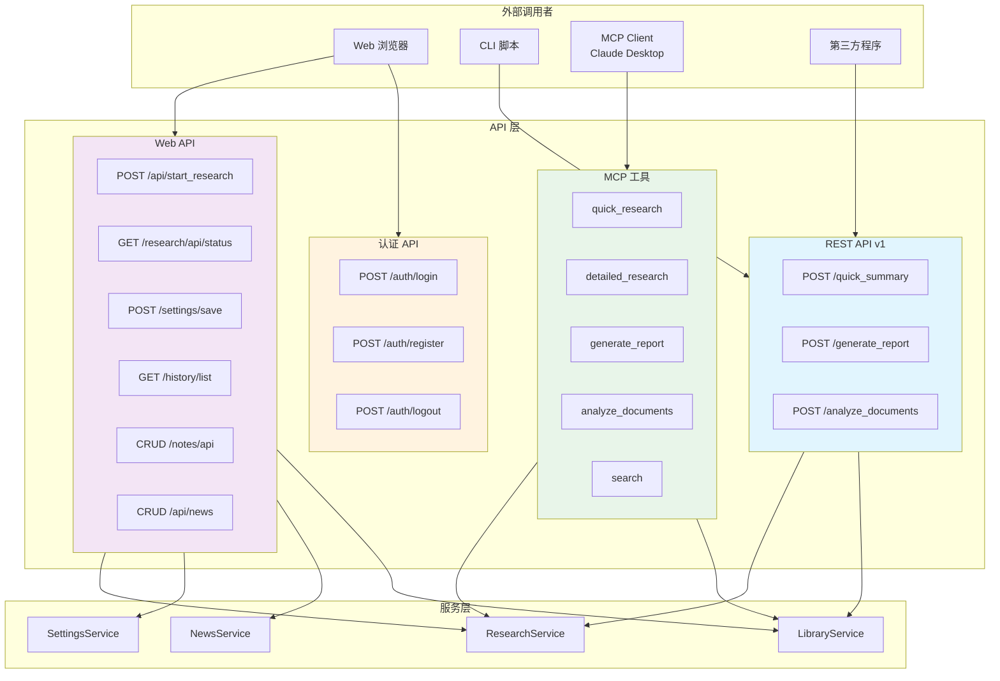
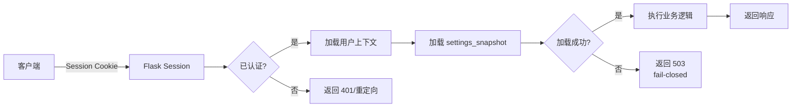

# 第 7 章：API 与接口设计

> 本章深入分析 Local Deep Research 的 API 与接口设计。项目提供 REST API v1（`/api/v1/`）、研究 API（`/api/*`, `/research/api/*`）、历史 API（`/history/*`）、设置 API（`/settings/*`）、指标 API（`/metrics/*`）、新闻 API（`/feed`, `/subscriptions`）、库管理 API（`/library/*`）、笔记 API（40+ 端点）、认证 API（`/auth/*`）以及 MCP 工具接口。

---

## 目录

- [7.1 API 总览与分类](#71-api-总览与分类)
- [7.2 研究 API 详解](#72-研究-api-详解)
- [7.3 搜索 API](#73-搜索-api)
- [7.4 库管理 API](#74-库管理-api)
- [7.5 认证与安全 API](#75-认证与安全-api)
- [7.6 设置与配置 API](#76-设置与配置-api)
- [7.7 MCP 服务器接口](#77-mcp-服务器接口)
- [7.8 请求/响应示例全集](#78-请求响应示例全集)

---

## 7.1 API 总览与分类

Local Deep Research 提供多种 API 接口，服务于不同场景：Web UI 交互、程序化访问、AI Agent 集成。

### 7.1.1 API 分类表

| API 类别 | URL 前缀 | 主要用途 | 认证方式 |
|----------|----------|----------|----------|
| REST API v1 | `/api/v1/` | 程序化访问 | Session + API Key |
| 研究 API | `/api/*`, `/research/api/*` | 研究任务管理 | Session |
| 历史 API | `/history/*` | 研究历史查询 | Session |
| 设置 API | `/settings/*` | 配置管理 | Session |
| 指标 API | `/metrics/*` | 使用统计 | Session |
| 新闻 API | `/api/news/*` | 新闻订阅与反馈 | Session |
| 库管理 API | `/library/*` | 文档与集合管理 | Session |
| 笔记 API | `/notes/api/*` | 笔记 CRUD | Session |
| 认证 API | `/auth/*` | 登录/登出/注册 | 公开 |
| MCP 工具 | STDIO | AI Agent 集成 | 本地权限 |

### 7.1.2 Mermaid API 分类图



**API 分类图说明**：该图展示了 Local Deep Research 的完整 API 架构。外部调用者分为四类：Web 浏览器（使用 Web API 和认证 API）、CLI 脚本（使用 REST API v1）、MCP Client 如 Claude Desktop（使用 MCP 工具）、第三方程序（使用 REST API）。API 层分为四个子域：REST API v1（`/api/v1/`）提供 quick_summary、generate_report、analyze_documents 三个核心端点；Web API 涵盖研究管理、设置、新闻、笔记等 40+ 端点；认证 API 处理登录/登出/注册；MCP 工具暴露 5 个 AI Agent 可调用函数。所有 API 最终通过服务层（ResearchService、SettingsService 等）操作数据库和外部服务。不同 API 使用不同认证方式：Web API 和 REST API 使用 Session + API Key，MCP 工具依赖本地操作系统权限（STDIO 传输）。

### 7.1.3 请求处理流程

```mermaid
flowchart TD
    A[HTTP 请求] --> B{路由匹配}
    B -->|/api/v1/*| C[api_access_control]
    B -->|/research/*| D[@login_required]
    B -->|/settings/*| D
    B -->|/auth/public| E[公开端点]

    C --> F{认证检查}
    F -->|无 session| G[返回 401]
    F -->|API 禁用| H[返回 403]
    F -->|通过| I[api_rate_limit]

    D --> J{登录检查}
    J -->|未登录| K[重定向到登录页]
    J -->|已登录| L[加载 settings_snapshot]

    I --> L
    L --> M[_load_user_context_into_params]
    M --> N{settings 加载成功?}
    N -->|失败| O[返回 503<br/>settings_unavailable]
    N -->|成功| P[执行业务逻辑]

    P --> Q[调用 ResearchService]
    Q --> R[返回 JSON 响应]

    E --> R

    style G fill:#ffebee
    style H fill:#ffebee
    style K fill:#fff3e0
    style O fill:#fff3e0
```

**流程图说明**：该图展示了请求从进入到响应的完整流程。HTTP 请求首先经过路由匹配，`/api/v1/*` 端点需要 `api_access_control` 装饰器（检查认证、API 启用状态、速率限制），`/research/*` 和 `/settings/*` 端点需要 `@login_required` 装饰器（检查登录状态）。通过认证后，所有端点共享 `_load_user_context_into_params` 流程：从加密 DB 加载用户的 settings_snapshot（包含 API key、模型偏好、出口策略等），如果加载失败则返回 503（fail-closed，避免在无用户策略的情况下运行）。成功后执行业务逻辑并返回 JSON 响应。

---

## 7.2 研究 API 详解

研究 API 是 Local Deep Research 最核心的接口，负责启动、监控和管理研究任务。

### 7.2.1 POST /api/start_research

启动新的研究任务。这是系统中最复杂的端点之一，处理参数提取、策略覆盖、队列逻辑。

**请求**

```http
POST /api/start_research HTTP/1.1
Content-Type: application/json

{
    "query": "Advances in fusion energy research",
    "mode": "detailed_report",
    "search_tool": "searxng",
    "model_name": "gpt-4o-mini",
    "temperature": 0.7,
    "iterations": 8,
    "questions_per_iteration": 5,
    "search_strategy": "focused_iteration",
    "settings": {
        "scope": "PUBLIC_ONLY"
    }
}
```

**响应**

```json
{
    "success": true,
    "research_id": "550e8400-e29b-41d4-a716-446655440000",
    "status": "queued",
    "queue_position": 2,
    "estimated_wait_seconds": 120,
    "message": "Research queued successfully"
}
```

**核心流程**

```python
@research_bp.route("/api/start_research", methods=["POST"])
@login_required
def start_research():
    # 1. 提取研究参数
    params = _extract_research_params(data, settings_manager)

    # 2. 预检查引擎策略
    _precheck_engine_policy(settings_manager, params, search_engine, username)

    # 3. 应用策略覆盖
    _apply_policy_overrides(settings_snapshot, params)

    # 4. 队列或立即执行
    if _is_system_at_capacity(username):
        return _queue_research(username, params)
    else:
        return _start_research_immediately(username, params)
```

**队列逻辑**：

```python
def _queue_research(username, params):
    """将研究加入队列。"""
    research_id = str(uuid.uuid4())

    with get_user_db_session(username) as session:
        queued = QueuedResearch(
            id=research_id,
            username=username,
            query=params["query"],
            mode=params["mode"],
            params=params,
            priority=params.get("priority", 0),
        )
        session.add(queued)
        session.commit()

    return jsonify({
        "success": True,
        "research_id": research_id,
        "status": "queued",
        "queue_position": _get_queue_position(research_id),
    })
```

### 7.2.2 POST /api/terminate/<id>

终止正在运行的研究。

**请求**

```http
POST /api/terminate/550e8400-e29b-41d4-a716-446655440000 HTTP/1.1
```

**响应**

```json
{
    "success": true,
    "message": "Research terminated"
}
```

**流程**

```python
@research_bp.route("/api/terminate/<string:research_id>", methods=["POST"])
@login_required
def terminate_research(research_id):
    # 1. 设置终止标志
    set_termination_flag(research_id)

    # 2. 从队列中移除（如果在排队）
    cancel_research(research_id)

    # 3. 更新数据库状态
    with get_user_db_session(username) as session:
        research = session.query(ResearchHistory).get(research_id)
        if research:
            research.status = ResearchStatus.TERMINATED
            research.completed_at = utcnow()
            session.commit()

    return jsonify({"success": True})
```

### 7.2.3 GET /research/api/status/<id>

获取研究状态和进度。

**请求**

```http
GET /research/api/status/550e8400-e29b-41d4-a716-446655440000 HTTP/1.1
```

**响应**

```json
{
    "success": true,
    "research_id": "550e8400-e29b-41d4-a716-446655440000",
    "status": "in_progress",
    "progress": 65,
    "query": "Advances in fusion energy research",
    "mode": "detailed_report",
    "current_phase": "Analyzing sources",
    "sources_found": 23,
    "iterations_completed": 5,
    "iterations_total": 8,
    "started_at": "2024-01-15T10:30:00Z",
    "estimated_remaining_seconds": 180,
    "recent_logs": [
        {"timestamp": "...", "message": "Searching for 'fusion reactor designs'"},
        {"timestamp": "...", "message": "Found 8 new sources"}
    ]
}
```

### 7.2.4 POST /api/v1/quick_summary

REST API：快速研究摘要。

**请求**

```http
POST /api/v1/quick_summary HTTP/1.1
Content-Type: application/json

{
    "query": "Advances in fusion energy research",
    "search_tool": "searxng",
    "iterations": 2,
    "temperature": 0.7,
    "allow_default_settings": false
}
```

**响应**

```json
{
    "status": "success",
    "query": "Advances in fusion energy research",
    "summary": "Recent advances in fusion energy include...",
    "findings": [
        {
            "content": "ITER project progress...",
            "sources": ["https://example.com/iter"],
            "confidence": 0.85
        }
    ],
    "sources": [
        {"url": "https://example.com/iter", "title": "ITER Progress Report"}
    ],
    "iterations": 2,
    "metadata": {
        "duration_seconds": 45,
        "token_count": 1500
    }
}
```

### 7.2.5 POST /api/v1/generate_report

REST API：生成完整研究报告。

**请求**

```http
POST /api/v1/generate_report HTTP/1.1
Content-Type: application/json

{
    "query": "Advances in fusion energy research",
    "output_file": "/tmp/report.md",
    "searches_per_section": 2,
    "model_name": "gpt-4o-mini",
    "temperature": 0.7
}
```

**响应**

```json
{
    "status": "success",
    "query": "Advances in fusion energy research",
    "report_id": "550e8400-e29b-41d4-a716-446655440000",
    "content": "# Fusion Energy Research Report\n\n## Table of Contents...",
    "metadata": {
        "generated_at": "2024-01-15T11:00:00Z",
        "initial_sources": 15,
        "sections_researched": 5,
        "searches_per_section": 2,
        "duration_seconds": 600
    }
}
```

### 7.2.6 WebSocket 进度推送

Local Deep Research 通过 WebSocket（Socket.IO）向 Web UI 推送实时进度更新。

```javascript
// 客户端连接
const socket = io();

// 订阅研究进度
socket.emit('subscribe_progress', { research_id: '550e8400-...' });

// 接收进度更新
socket.on('progress_update', (data) => {
    console.log(`Progress: ${data.progress}%`);
    console.log(`Phase: ${data.phase}`);
    console.log(`Message: ${data.message}`);
});
```

**服务端推送**

```python
def emit_progress(research_id, message, progress, metadata=None):
    """向订阅者推送进度更新."""
    socketio.emit('progress_update', {
        'research_id': research_id,
        'message': message,
        'progress': progress,
        'metadata': metadata or {},
        'timestamp': datetime.now(UTC).isoformat(),
    }, room=f'research_{research_id}')
```

---

## 7.3 搜索 API

### 7.3.1 搜索引擎列表端点

**GET /api/engines** 或前端通过 settings 获取。

**响应**

```json
{
    "success": true,
    "engines": [
        {"value": "searxng", "label": "SearXNG (self-hosted)", "is_default": true},
        {"value": "wikipedia", "label": "Wikipedia"},
        {"value": "arxiv", "label": "arXiv"},
        {"value": "pubmed", "label": "PubMed"},
        {"value": "semantic_scholar", "label": "Semantic Scholar"},
        {"value": "duckduckgo", "label": "DuckDuckGo"},
        {"value": "google", "label": "Google (PSE)"},
        {"value": "bing", "label": "Bing"}
    ]
```

### 7.3.2 搜索执行端点

搜索通过研究 API（`/api/start_research`）间接触发，无独立搜索端点。搜索参数在研究请求中传递：

```json
{
    "query": "fusion energy",
    "search_tool": "searxng",
    "iterations": 3,
    "questions_per_iteration": 5
}
```

### 7.3.3 搜索查询生成

系统使用 LLM 自动生成搜索查询：

```python
def generate_search_queries(query, iteration, previous_questions, llm):
    """基于迭代深度生成搜索查询。"""
    prompt = f"""
    研究主题: {query}
    当前迭代: {iteration + 1}
    已搜索过的问题: {', '.join(previous_questions)}

    生成 {questions_per_iteration} 个新的、不同的搜索查询。
    每次迭代应该深入不同的子主题。

    以 JSON 数组格式返回:
    ["query1", "query2", ...]
    """
    response = llm.invoke(prompt)
    return parse_json_response(response)
```

---

## 7.4 库管理 API

库管理 API 负责文档上传、集合管理和 RAG 索引。

### 7.4.1 文档上传

**POST /api/upload/pdf**

```http
POST /api/upload/pdf HTTP/1.1
Content-Type: multipart/form-data

file: <PDF 文件>
collection_id: <可选，目标集合>
```

**响应**

```json
{
    "success": true,
    "document_id": "550e8400-e29b-41d4-a716-446655440000",
    "filename": "paper.pdf",
    "file_size": 2048000,
    "text_extracted": true,
    "word_count": 5000,
    "message": "Document uploaded and indexed successfully"
}
```

### 7.4.2 集合管理

**GET /api/collections** — 列出所有集合

```json
{
    "success": true,
    "collections": [
        {
            "id": "550e8400-...",
            "name": "Library",
            "type": "default_library",
            "is_default": true,
            "document_count": 42,
            "chunk_count": 1250,
            "embedding_model": "all-MiniLM-L6-v2"
        }
    ]
}
```

**POST /api/collections** — 创建集合

```json
{
    "name": "My Research",
    "description": "Personal research collection",
    "embedding_model": "nomic-embed-text",
    "chunk_size": 1000,
    "chunk_overlap": 200
}
```

### 7.4.3 RAG 索引管理

**POST /api/collections/<id>/reindex** — 触发重新索引

```json
{
    "force": true,
    "embedding_model": "all-MiniLM-L6-v2"
}
```

**GET /api/collections/<id>/index-status** — 索引状态

```json
{
    "success": true,
    "status": "active",
    "chunk_count": 1250,
    "total_documents": 42,
    "last_updated": "2024-01-15T10:00:00Z",
    "index_size_bytes": 15728640
}
```

### 7.4.4 Zotero 同步

**POST /api/zotero/sync** — 触发 Zotero 同步

```json
{
    "library_id": "12345",
    "api_key": "zotero_api_key"
}
```

**GET /api/zotero/status** — 同步状态

```json
{
    "success": true,
    "last_sync": "2024-01-15T09:00:00Z",
    "item_count": 150,
    "status": "idle"
}
```

---

## 7.5 认证与安全 API

### 7.5.1 登录/登出/注册

**POST /auth/login**

```http
POST /auth/login HTTP/1.1
Content-Type: application/json
X-CSRF-Token: <token>

{
    "username": "alice",
    "password": "secure_password",
    "remember": true
}
```

**响应**

```json
{
    "success": true,
    "username": "alice",
    "redirect": "/research"
}
```

**POST /auth/register**

```json
{
    "username": "newuser",
    "password": "secure_password",
    "confirm_password": "secure_password"
}
```

**POST /auth/logout**

```http
POST /auth/logout HTTP/1.1
X-CSRF-Token: <token>
```

### 7.5.2 CSRF 保护

所有状态修改请求需要 CSRF token：

```http
# 获取 CSRF token
GET /auth/csrf-token

# 在请求中使用
POST /api/start_research
X-CSRF-Token: <token>
```

### 7.5.3 限流策略（Flask-Limiter）

```python
# 全局限位
limiter = Limiter(
    app,
    key_func=get_remote_address,
    default_limits=["200 per minute", "50 per second"],
)

# 端点特定限流
@api_rate_limit  # 从用户设置读取
def api_quick_summary():
    ...

# 共享作用域限位
_news_create_limit = limiter.shared_limit("10 per minute", scope="news_create")
```

| 端点类别 | 默认限流 |
|----------|----------|
| 研究启动 | 5/分钟 |
| 快速摘要 | 10/分钟 |
| 设置保存 | 30/分钟 |
| 新闻创建 | 10/分钟 |
| 新闻反馈 | 30/分钟 |
| 文件上传 | 5/分钟（IP） |

---

## 7.6 设置与配置 API

### 7.6.1 设置 CRUD

**GET /settings/get** — 获取当前设置

```json
{
    "success": true,
    "settings": {
        "llm.provider": "openai",
        "llm.model": "gpt-4o-mini",
        "llm.api_key": "sk-***",
        "search.tool": "searxng",
        "search.iterations": 8,
        "search.questions_per_iteration": 5,
        "web.enable_javascript_rendering": false
    }
}
```

**POST /settings/save_all_settings** — 批量保存（AJAX 模式）

```json
{
    "llm.provider": "anthropic",
    "llm.model": "claude-3-5-sonnet",
    "search.iterations": 10,
    "web.enable_javascript_rendering": true
}
```

### 7.6.2 环境变量覆盖机制

设置值的优先级（高到低）：

1. 请求体中的 `settings` 对象（临时覆盖）
2. 环境变量（`LDR_LLM_MODEL`、`LDR_SEARCH_TOOL` 等）
3. 数据库中的用户设置
4. 系统默认值

```python
def get_setting_with_fallback(key, env_prefix="LDR_"):
    """获取设置值，支持环境变量覆盖。"""
    # 1. 检查环境变量
    env_key = f"{env_prefix}{key.upper().replace('.', '_')}"
    env_value = os.environ.get(env_key)
    if env_value is not None:
        return env_value

    # 2. 从数据库获取
    return settings_manager.get_setting(key)
```

---

## 7.7 MCP 服务器接口

**文件**：`src/local_deep_research/mcp/server.py`

MCP（Model Context Protocol）服务器暴露 LDR 的研究能力给 AI Agent（如 Claude Desktop）。

### 7.7.1 工具列表

| 工具名 | 功能 | 耗时 |
|--------|------|------|
| `quick_research` | 快速研究摘要 | 1-5 分钟 |
| `detailed_research` | 详细分析报告 | 5-15 分钟 |
| `generate_report` | 完整 Markdown 报告 | 10-30 分钟 |
| `analyze_documents` | 搜索本地文档集合 | 30s-2 分钟 |
| `search` | 原始搜索结果（无 LLM 处理） | 5-30s |
| `list_search_engines` | 列出可用搜索引擎 | <1s |
| `list_strategies` | 列出可用研究策略 | <1s |
| `get_configuration` | 获取当前配置 | <1s |

### 7.7.2 quick_research 工具

```python
@mcp.tool()
def quick_research(
    query: str,
    search_engine: Optional[str] = None,
    strategy: Optional[str] = None,
    iterations: Optional[int] = None,
    questions_per_iteration: Optional[int] = None,
) -> Dict[str, Any]:
    """
    对主题执行快速研究。

    该工具对给定查询执行快速研究摘要。它搜索网络、分析来源，
    并生成包含发现的简洁摘要。

    重要：这是同步操作，通常需要 1-5 分钟完成，具体取决于复杂性和配置。

    Args:
        query: 研究问题或调查主题。
        search_engine: 搜索引擎（如 "wikipedia"、"arxiv"、"searxng"）。
                      使用 list_search_engines() 查看可用选项。
        strategy: 研究策略（如 "source-based"、"rapid"、"iterative"）。
                 使用 list_strategies() 查看可用选项。
        iterations: 搜索迭代次数（1-10）。更多迭代 = 更深入的研究。
        questions_per_iteration: 每迭代生成的问题数（1-5）。

    Returns:
        字典包含：
        - status: "success" 或 "error"
        - summary: 研究摘要文本
        - findings: 每次搜索的详细发现列表
        - sources: 发现的来源 URL 列表
        - iterations: 执行的迭代次数
        - error: 错误消息（仅 status 为 error 时）
        - error_type: 错误分类（仅 status 为 error 时）
    """
```

### 7.7.3 参数验证

```python
def _validate_query(query: str) -> str:
    """验证并清理查询参数。"""
    if not query or not query.strip():
        raise ValidationError("Query cannot be empty")
    query = query.strip()
    if len(query) > 10000:
        raise ValidationError("Query exceeds maximum length of 10000 characters")
    return query

def _validate_iterations(iterations: Optional[int], max_val: int = 20):
    """验证 iterations 参数。"""
    if iterations is None:
        return None
    if not isinstance(iterations, int) or iterations < 1:
        raise ValidationError("Iterations must be a positive integer")
    if iterations > max_val:
        raise ValidationError(f"Iterations cannot exceed {max_val}")
    return iterations

def _validate_search_engine(engine: Optional[str]) -> Optional[str]:
    """验证搜索引擎名称。"""
    if engine is None:
        return None
    available = search_config(settings_snapshot=create_settings_snapshot())
    if engine not in available:
        raise ValidationError(f"Unknown search engine '{engine}'")
    return engine
```

### 7.7.4 错误分类

```python
def _classify_error(error_msg: str) -> str:
    """为客户端处理分类错误。"""
    error_lower = error_msg.lower()
    if "503" in error_msg or "unavailable" in error_lower:
        return "service_unavailable"
    if "404" in error_msg or "not found" in error_lower:
        return "model_not_found"
    if "api key" in error_lower or "authentication" in error_lower:
        return "auth_error"
    if "timeout" in error_lower:
        return "timeout"
    if "rate limit" in error_lower or "429" in error_msg:
        return "rate_limit"
    if "connection" in error_lower:
        return "connection_error"
    return "unknown"
```

### 7.7.5 MCP 安全注意事项

```python
"""
安全通知：
    该服务器设计为仅本地使用，通过 STDIO 传输
    （如 Claude Desktop）。它没有内置认证或限流。
    不要将此服务器暴露在网络中，除非实现适当的安全控制
    （OAuth、限流、输入验证）。

    当通过 STDIO 本地运行时，安全性由操作系统的用户权限提供。
"""
```

---

## 7.8 请求/响应示例全集

### 7.8.1 研究 API 示例

#### 启动研究

```bash
curl -X POST http://localhost:5000/api/start_research \
  -H "Content-Type: application/json" \
  -H "X-CSRF-Token: <token>" \
  -b "session=<session_cookie>" \
  -d '{
    "query": "Advances in fusion energy research",
    "mode": "detailed_report",
    "search_tool": "searxng",
    "iterations": 5
  }'
```

```json
{
    "success": true,
    "research_id": "550e8400-e29b-41d4-a716-446655440000",
    "status": "started",
    "message": "Research started successfully"
}
```

#### 获取研究状态

```bash
curl http://localhost:5000/research/api/status/550e8400-e29b-41d4-a716-446655440000 \
  -b "session=<session_cookie>"
```

#### 终止研究

```bash
curl -X POST http://localhost:5000/api/terminate/550e8400-e29b-41d4-a716-446655440000 \
  -H "X-CSRF-Token: <token>" \
  -b "session=<session_cookie>"
```

### 7.8.2 REST API v1 示例

#### Health Check

```bash
curl http://localhost:5000/api/v1/health
```

```json
{
    "status": "ok",
    "message": "API is running",
    "timestamp": 1705312200.123
}
```

#### Quick Summary

```bash
curl -X POST http://localhost:5000/api/v1/quick_summary \
  -H "Content-Type: application/json" \
  -d '{
    "query": "Quantum computing applications",
    "search_tool": "wikipedia",
    "iterations": 2
  }'
```

#### Generate Report

```bash
curl -X POST http://localhost:5000/api/v1/generate_report \
  -H "Content-Type: application/json" \
  -d '{
    "query": "CRISPR gene editing advances",
    "searches_per_section": 2,
    "temperature": 0.5
  }'
```

#### Analyze Documents

```bash
curl -X POST http://localhost:5000/api/v1/analyze_documents \
  -H "Content-Type: application/json" \
  -d '{
    "query": "What are the main findings?",
    "collection_name": "MyLibrary",
    "max_results": 10
  }'
```

### 7.8.3 新闻 API 示例

#### 获取新闻源

```bash
curl "http://localhost:5000/api/news/feed?limit=20&use_cache=true" \
  -b "session=<session_cookie>"
```

#### 创建订阅

```bash
curl -X POST http://localhost:5000/api/news/subscriptions \
  -H "Content-Type: application/json" \
  -H "X-CSRF-Token: <token>" \
  -b "session=<session_cookie>" \
  -d '{
    "query": "AI safety research",
    "type": "search",
    "refresh_minutes": 1440,
    "name": "AI Safety Daily"
  }'
```

#### 提交反馈

```bash
curl -X POST http://localhost:5000/api/news/feedback \
  -H "Content-Type: application/json" \
  -H "X-CSRF-Token: <token>" \
  -b "session=<session_cookie>" \
  -d '{
    "card_id": "card-uuid",
    "vote": "up"
  }'
```

### 7.8.4 认证 API 示例

#### 登录

```bash
curl -X POST http://localhost:5000/auth/login \
  -H "Content-Type: application/json" \
  -H "X-CSRF-Token: <token>" \
  -d '{
    "username": "alice",
    "password": "secure_password"
  }'
```

#### 注册

```bash
curl -X POST http://localhost:5000/auth/register \
  -H "Content-Type: application/json" \
  -d '{
    "username": "newuser",
    "password": "secure_password",
    "confirm_password": "secure_password"
  }'
```

#### 登出

```bash
curl -X POST http://localhost:5000/auth/logout \
  -H "X-CSRF-Token: <token>" \
  -b "session=<session_cookie>"
```

### 7.8.5 错误响应格式

所有 API 错误遵循统一格式：

```json
{
    "success": false,
    "error": "Human-readable error message",
    "error_code": "RESEARCH_NOT_FOUND",
    "details": {
        "research_id": "550e8400-..."
    }
}
```

#### 常见错误码

| HTTP 状态码 | error_code | 说明 |
|-------------|------------|------|
| 400 | BAD_REQUEST | 请求参数无效 |
| 401 | AUTH_REQUIRED | 未认证 |
| 403 | FORBIDDEN | 权限不足 |
| 404 | NOT_FOUND | 资源不存在 |
| 429 | RATE_LIMITED | 超过速率限制 |
| 500 | INTERNAL_ERROR | 服务器内部错误 |
| 503 | SETTINGS_UNAVAILABLE | 设置加载失败 |

### 7.8.6 MCP 工具调用示例

#### quick_research

```json
{
    "jsonrpc": "2.0",
    "id": 1,
    "method": "tools/call",
    "params": {
        "name": "quick_research",
        "arguments": {
            "query": "Fusion energy breakthroughs 2024",
            "search_engine": "wikipedia",
            "iterations": 3
        }
    }
}
```

**响应**

```json
{
    "jsonrpc": "2.0",
    "id": 1,
    "result": {
        "content": [{
            "type": "text",
            "text": "{\"status\": \"success\", \"summary\": \"...\", ...}"
        }]
    }
}
```

#### list_search_engines

```json
{
    "jsonrpc": "2.0",
    "id": 2,
    "method": "tools/call",
    "params": {
        "name": "list_search_engines",
        "arguments": {}
    }
}
```

---

## 7.9 API 安全设计总结

### 7.9.1 认证架构



### 7.9.2 多层安全防护

| 防护层 | 实现 | 说明 |
|--------|------|------|
| 传输层 | HTTPS（部署时） | 加密传输 |
| 认证层 | Session + bcrypt | 用户身份验证 |
| API 访问控制 | `api_access_control` 装饰器 | 检查 API 启用状态 |
| 速率限制 | Flask-Limiter | 防止滥用 |
| CSRF 保护 | Flask-WTF | 防止跨站请求伪造 |
| SSRF 防护 | `assert_base_url_safe` | 防止服务端请求伪造 |
| 出口策略 | `evaluate_url` + `EgressScope` | 控制数据流出范围 |
| 输入验证 | 参数校验函数 | 防止注入攻击 |
| 设置隔离 | per-user settings_snapshot | 用户配置隔离 |

### 7.9.3 API 版本控制策略

- **v1**（当前）：`/api/v1/` 前缀
- 未来 v2：通过 URL 前缀或 Accept 头区分
- 向后兼容：v1 端点在 v2 引入后仍保留

---

## 本章小结

本章全面分析了 Local Deep Research 的 API 与接口设计：

1. **REST API v1**：3 个核心端点（quick_summary、generate_report、analyze_documents），面向程序化访问
2. **研究 API**：启动/终止/监控研究任务，支持队列和立即执行两种模式
3. **搜索 API**：通过研究参数间接触发，无独立端点
4. **库管理 API**：文档上传、集合管理、RAG 索引、Zotero 同步
5. **认证与安全 API**：登录/登出/注册、CSRF 保护、Flask-Limiter 限流
6. **设置 API**：CRUD 操作，环境变量覆盖机制
7. **MCP 工具**：8 个工具暴露给 AI Agent，参数验证和错误分类
8. **安全设计**：多层防护（认证、限流、CSRF、SSRF、出口策略）

关键设计原则包括：fail-closed（设置加载失败时拒绝执行）、纵深防御（每层独立校验）、最小权限（per-user settings_snapshot）、渐进增强（JS 和非 JS 两种提交模式）。

---

☕️ 制作不易，请我喝咖啡☕️关注我➕

