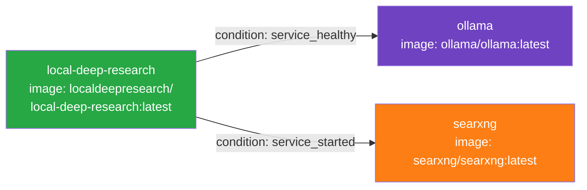
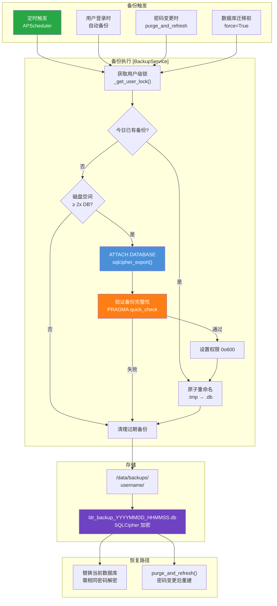

# 第 8 章：部署、运维与基础设施

> 本章全面解析 Local Deep Research 项目的部署架构、容器化方案、CI/CD 流水线、监控日志体系、备份恢复机制以及 GPU 加速部署策略。作为生产级 AI 应用，LDR 在部署层面采用了纵深防御的安全理念与高度自动化的 DevOps 实践。

---

## 目录

- [8.1 部署架构图](#81-部署架构图)
- [8.2 Docker 容器化详解](#82-docker-容器化详解)
- [8.3 Docker Compose 多服务编排](#83-docker-compose-多服务编排)
- [8.4 CI/CD 流水线](#84-cicd-流水线-68-个工作流详解)
- [8.5 监控、日志与告警](#85-监控日志与告警)
- [8.6 备份与恢复方案](#86-备份与恢复方案)
- [8.7 GPU 加速部署](#87-gpu-加速部署)

---

## 8.1 部署架构图

Local Deep Research 采用面向容器的微服务架构，通过 Docker Compose 编排三个核心服务容器，配合持久化数据卷与隔离网络实现生产级部署。

```mermaid
graph TB
    subgraph "外部访问层"
        USER[("用户浏览器<br/>localhost:5000")]
        HOST_LLM["宿主机 LLM 服务<br/>LM Studio / llama.cpp<br/>host.docker.internal:1234"]
    end

    subgraph "Docker 部署栈 [ldr-network]"
        direction TB
        
        subgraph "LDR 应用容器 [local-deep-research]"
            FLASK["Flask + Socket.IO<br/>app_factory.create_app()<br/>端口 5000"]
            ENTRY["ldr_entrypoint.sh<br/>root → ldruser 降权"]
            VENV["Python 虚拟环境<br/>PDM 管理<br/>60+ 依赖"]
            STATIC["前端静态资源<br/>Vite 构建产物<br/>dist/"]
        end

        subgraph "LLM 推理容器 [ollama]"
            OLLAMA_SVC["Ollama Serve<br/>端口 11434<br/>仅内部网络"]
            GPU_RES["NVIDIA GPU 预留<br/>docker-compose.gpu.override.yml"]
        end

        subgraph "搜索引擎容器 [searxng"]
            SEARX["SearXNG<br/>端口 8080<br/>仅内部网络"]
        end
    end

    subgraph "持久化数据卷"
        VOL_LDR["ldr_data:/data<br/>加密数据库 + 日志 + 缓存"]
        VOL_SCRIPTS["ldr_scripts:/scripts<br/>入口脚本"]
        VOL_OLLAMA["ollama_data:/root/.ollama<br/>模型权重"]
        VOL_SEARX["searxng_data:/etc/searxng<br/>搜索配置"]
    end

    USER -->|"HTTP/Socket.IO 5000"| FLASK
    USER -->|"可选直连"| HOST_LLM
    FLASK -->|"内部 HTTP 11434"| OLLAMA_SVC
    FLASK -->|"内部 HTTP 8080"| SEARX
    FLASK -->|"host.docker.internal"| HOST_LLM
    
    ENTRY --> FLASK
    FLASK --> VENV
    FLASK --> STATIC
    
    VOL_LDR --- FLASK
    VOL_SCRIPTS --- ENTRY
    VOL_OLLAMA --- OLLAMA_SVC
    VOL_SEARX --- SEARX
    
    GPU_RES -.->|"可选"| OLLAMA_SVC

    style USER fill:#4A90D9,color:#fff
    style FLASK fill:#28A745,color:#fff
    style OLLAMA_SVC fill:#6F42C1,color:#fff
    style SEARX fill:#FD7E14,color:#fff
    style VOL_LDR fill:#DC3545,color:#fff
```

**架构图说明：**

该图展示了 LDR 的完整部署拓扑。从网络层面看，系统通过 `ldr-network` 桥接网络实现服务间隔离——仅 LDR 容器的 5000 端口对外暴露，Ollama（11434）和 SearXNG（8080）仅在内网可达，有效缩小攻击面。

从数据流角度看，用户请求经 Flask 应用处理后，通过内部网络调用 Ollama 进行 LLM 推理、调用 SearXNG 执行网络搜索。`host.docker.internal` 网关机制允许容器安全访问宿主机上运行的第三方 LLM 服务（如 LM Studio），兼顾了灵活性与隔离性。

从安全角度看，LDR 容器采用两阶段权限模型：`ldr_entrypoint.sh` 以 root 身份完成目录权限修复后，通过 `setpriv` 不可逆地降权至 `ldruser`（UID 1000）运行应用。数据卷层面，四个独立命名卷分别承载应用数据、脚本、模型权重和搜索配置，确保容器重建时数据不丢失。

---

## 8.2 Docker 容器化详解

LDR 的 Dockerfile 采用**多阶段构建（Multi-stage Build）**策略，通过精心设计的阶段划分实现构建缓存优化、镜像层最小化与安全加固。

### 8.2.1 多阶段构建架构

Dockerfile 定义了四个构建阶段：

| 阶段名称 | 基础镜像 | 用途 | 输出 |
|---------|---------|------|------|
| `builder-base` | python:3.14.6-slim | 共享基础：系统依赖、Node.js、Python 工具链 | 中间层 |
| `builder` | builder-base | 前端构建（Vite）+ Python 依赖安装（PDM） | 构建产物 |
| `ldr-test` | builder-base | 测试环境：Playwright、Puppeteer、测试依赖 | 测试镜像 |
| `ldr` | python:3.14.6-slim | 生产镜像：仅运行时依赖 + 构建产物 | 最终镜像 |

**设计要点：**

- `builder-base` 作为共享基础层，避免系统依赖在 `builder` 和 `ldr-test` 中重复安装
- `ldr` 阶段**不继承** `builder`，而是从 `python:3.14.6-slim` 重新开始，仅 COPY 必要的虚拟环境和脚本，确保生产镜像不含编译工具链
- 构建产物通过 `COPY --from=builder` 跨阶段传递，实现构建环境与运行环境的彻底分离

### 8.2.2 系统依赖安装

`builder-base` 阶段安装的关键系统依赖：

```dockerfile
# SQLCipher 加密数据库支持
libsqlcipher-dev sqlcipher libsqlcipher1
# 编译工具链（用于构建 Python 原生扩展）
build-essential pkg-config curl ca-certificates gnupg
# Node.js 24.x LTS（通过 NodeSource 官方源）
nodejs
```

**NodeSource GPG 密钥验证机制：**

Dockerfile 实现了严格的供应链安全验证——在添加 NodeSource 仓库前，先下载 GPG 公钥，通过 `gpg --with-fingerprint` 提取实际指纹，与硬编码的预期指纹 `6F71F525282841EEDAF851B42F59B5F99B1BE0B4` 进行比对。若指纹不匹配（密钥轮换或中间人攻击），构建将立即失败。这有效防止了供应链投毒攻击。

### 8.2.3 Python 依赖安装

```dockerfile
# 固定版本安装核心工具链
RUN pip3 install --no-cache-dir pip==26.1.2 \
    && pip install --no-cache-dir pdm==2.26.2 "hishel<1.0.0" \
       playwright==1.58.0 "wheel>=0.46.2"
```

**版本固定策略：**

- `pip==26.1.2`：修复 CVE-2026-8643（路径遍历）、CVE-2026-1703、GHSA-jp4c-xjxw-mgf9
- `pdm==2.26.2`：项目使用的 Python 包管理器
- `wheel>=0.46.2`：修复 CVE-2026-24049（路径遍历）
- `PDM_REQUEST_TIMEOUT=120`：增大超时以应对大型包（numpy, torch）的网络延迟

**PDM 安装命令：**

```dockerfile
RUN for i in 1 2 3; do \
      if pdm install --prod --no-editable; then \
        break; \
      else \
        echo "PDM install attempt $i failed, retrying in 15s..."; \
        sleep 15; \
      fi; \
    done
```

采用 3 次重试机制应对 CI 环境中的瞬态网络故障，`--prod` 标志确保不安装开发依赖，`--no-editable` 生成可移植的虚拟环境。

### 8.2.4 前端构建

```dockerfile
# 安装 npm 依赖（使用 lockfile 确保可复现）
RUN npm ci
# 执行 Vite 生产构建
RUN npm run build
```

前端构建使用 `npm ci`（而非 `npm install`），严格依据 `package-lock.json` 安装，确保构建的可复现性。Vite 构建产物输出至 `src/local_deep_research/web/static/dist/`，最终通过 `COPY --from=builder` 复制到生产镜像。

### 8.2.5 安全加固措施

**非 root 用户运行：**

```dockerfile
RUN groupadd -r ldruser && useradd -r -g ldruser -u 1000 -m -d /home/ldruser ldruser
```

生产镜像（`ldr` 阶段）创建专用的 `ldruser` 系统用户（UID 1000），所有应用进程以此身份运行。

**能力最小化（Capability Drop）：**

```yaml
# docker-compose.yml
security_opt:
  - "no-new-privileges:true"
cap_drop:
  - ALL
cap_add:
  - CHOWN        # 入口脚本 chown 所需
  - FOWNER       # 入口脚本 chmod 所需
  - DAC_OVERRIDE # 创建目录所需
  - SETUID       # setpriv 降权所需
  - SETGID       # setpriv 降权所需
```

容器丢弃所有 Linux 能力后，仅添加入口脚本权限修复阶段必需的 5 项能力。`no-new-privileges` 确保降权后无法重新获取特权。

**入口脚本降权流程：**

```
root 启动 → 修复 /data 权限 → setpriv 降权至 ldruser → exec 应用进程
```

### 8.2.6 镜像层优化

Dockerfile 通过以下策略优化镜像层缓存：

1. **依赖文件优先 COPY**：`pyproject.toml`、`pdm.lock`、`package.json` 等变更频率低的文件先于源码复制，确保依赖安装层在源码变更时命中缓存
2. **RUN 命令合理拆分**：`npm ci`、`npm run build`、`pdm install` 分为独立 RUN 步骤，各自享有独立缓存层
3. **生产镜像最小化**：`ldr` 阶段仅安装运行时依赖（sqlcipher、WeasyPrint 及其字体依赖），不含 Node.js、编译工具等构建时依赖
4. **lxml 安全验证**：构建阶段断言 lxml 链接的 libxml2 版本 ≥ 2.11.0，防止 CVE-2026-6653 漏洞

---

## 8.3 Docker Compose 多服务编排

LDR 采用 Docker Compose 的**文件叠加（File Override）**模式，通过基础配置与覆盖配置的灵活组合支持多种部署场景。

### 8.3.1 基础配置（docker-compose.yml）

基础配置文件定义了三个核心服务：

**服务依赖关系：**



**依赖启动顺序：**
- `ollama` 必须通过健康检查（`ollama list` 命令成功）后，LDR 才启动
- `searxng` 启动完成（不要求健康检查通过）后，LDR 即启动

### 8.3.2 GPU 覆盖配置

```yaml
# docker-compose.gpu.override.yml
services:
  ollama:
    deploy:
      resources:
        reservations:
          devices:
            - driver: nvidia
              count: 1
              capabilities: [ gpu ]
```

使用方式：

```bash
docker compose -f docker-compose.yml -f docker-compose.gpu.override.yml up -d
```

该覆盖文件为 Ollama 服务添加 NVIDIA GPU 设备预留，启用 GPU 加速推理。`count: 1` 表示使用 1 个 GPU，可根据需要调整为 `all`。

### 8.3.3 网络配置

```yaml
networks:
  ldr-network:
```

所有服务连接到 `ldr-network` 桥接网络，实现：
- 服务间通过服务名（`ollama`、`searxng`）进行 DNS 解析
- 网络隔离：外部无法直接访问内部服务端口
- `extra_hosts: "host.docker.internal:host-gateway"` 允许容器访问宿主机服务

### 8.3.4 数据卷配置

```yaml
volumes:
  ldr_data:          # LDR 应用数据（加密数据库、日志、缓存）
  ldr_scripts:       # 入口脚本
  ollama_data:       # Ollama 模型权重
  searxng_data:      # SearXNG 搜索配置
```

**数据卷挂载映射：**

| 卷名 | 容器内路径 | 用途 |
|------|-----------|------|
| `ldr_data` | `/data` | 加密数据库、日志、缓存、研究输出 |
| `ldr_scripts` | `/scripts` | Ollama 入口脚本 |
| `ollama_data` | `/root/.ollama` | 下载的 LLM 模型权重 |
| `searxng_data` | `/etc/searxng` | SearXNG 搜索引擎配置 |

### 8.3.5 环境变量体系

LDR 采用 `LDR_` 前缀的环境变量命名规范，通过 Docker Compose 的 `environment` 配置节注入：

**Docker 强制环境变量（不可通过 UI 修改）：**

| 变量 | 值 | 说明 |
|------|---|------|
| `LDR_WEB_HOST` | `0.0.0.0` | 必须绑定所有接口以支持容器网络 |
| `LDR_WEB_PORT` | `5000` | 内部端口 |
| `LDR_DATA_DIR` | `/data` | 数据目录，必须匹配卷挂载点 |
| `LDR_LLM_OLLAMA_URL` | `http://ollama:11434` | Ollama 内部端点 |
| `LDR_SEARCH_ENGINE_WEB_SEARXNG_DEFAULT_PARAMS_INSTANCE_URL` | `http://searxng:8080` | SearXNG 内部端点 |

**环境变量的"强制锁定"语义：**

文档明确指出，环境变量**不是默认值**，而是**永久覆盖**——一旦设置，Web UI 中的对应设置将被禁用。这确保了 Docker 部署的配置一致性，防止用户通过 UI 意外修改关键基础设施配置。

### 8.3.6 Unraid 模板

项目提供 `docker-compose.unraid.yml` 和 `unraid-templates/` 目录，支持通过 Unraid 的 Docker Compose Manager 插件进行部署。Unraid 模板将 Docker Compose 配置适配为 Unraid 社区应用的标准格式，简化 NAS 用户的部署流程。

---

## 8.4 CI/CD 流水线（68 个工作流详解）

LDR 拥有业界领先规模的 CI/CD 体系——**68 个 GitHub Actions 工作流，总计 14,575 行 YAML 配置**。这些工作流覆盖了从代码提交到生产部署的完整软件供应链。

### 8.4.1 CI/CD 流水线总览

```mermaid
flowchart TB
    subgraph "触发事件"
        PR["Pull Request"]
        PUSH["Push to Main"]
        SCHED["定时调度"]
        DISPATCH["手动触发"]
        RELEASE["Release 事件"]
    end

    subgraph "第一道门：代码质量与合规"
        PRE_COMMIT["pre-commit<br/>代码格式化/静态分析"]
        LABELS["labels-sync<br/>标签同步"]
        WELCOME["welcome-first-time<br/>新人欢迎"]
        PR_TRIAGE["pr-triage<br/>PR 分类"]
    end

    subgraph "第二道门：安全扫描（20+ 工作流）"
        direction TB
        CODEQL["CodeQL<br/>语义代码分析"]
        SEMGREP["Semgrep<br/>静态应用安全测试"]
        BEARER["Bearer<br/>应用安全扫描"]
        TRIVY["Trivy<br/>容器镜像扫描"]
        GRYPE["Grype<br/>漏洞扫描"]
        OSV["OSV-Scanner<br/>生态漏洞数据库"]
        CHECKOV["Checkov<br/>IaC 扫描"]
        DEVSKIM["DevSkim<br/>安全最佳实践"]
        NUCLEI["Nuclei<br/>模板化漏洞扫描"]
        ZAP["OWASP ZAP<br/>动态应用安全测试"]
        GITLEAKS["Gitleaks<br/>密钥泄漏检测"]
        ZIZMOR["Zizmor<br/>GitHub Actions 安全"]
        SAFETY["safety<br/>Python 依赖审计"]
        NPM_AUDIT["npm-audit<br/>Node 依赖审计"]
        RETIREJS["retirejs<br/>JS 库版本检查"]
        SBOM["SBOM<br/>软件物料清单"]
        SCORECARD["OSSF Scorecard<br/>供应链安全"]
    end

    subgraph "第三道门：测试（15+ 工作流）"
        direction TB
        CI_GATE["ci-gate<br/>综合测试门控"]
        DOCKER_TEST["docker-tests<br/>Docker 构建测试 1399行"]
        COMPOSE_TEST["compose-integration-test<br/>Compose 集成"]
        E2E_RESEARCH["e2e-research-test<br/>端到端研究测试"]
        PLAYWRIGHT["playwright-tests<br/>浏览器自动化"]
        PUPPETEER["puppeteer-e2e-tests<br/>Puppeteer E2E"]
        SECURITY_TEST["security-tests<br/>安全测试"]
        MCP_TEST["mcp-tests<br/>MCP 协议测试"]
        FUZZ["fuzz<br/>模糊测试"]
        MYPY["mypy-type-check<br/>类型检查"]
    end

    subgraph "第四道门：构建与发布"
        DOCKER_BUILD["docker-publish<br/>多架构 Docker 镜像"]
        PYPI["publish<br/>PyPI 包发布"]
        RELEASE_GATE["release-gate<br/>发布门控 1165行"]
        RELEASE["release<br/>发布流程 1919行"]
        PRERELEASE["prerelease-docker<br/>预发布镜像"]
    end

    subgraph "运维自动化"
        UPD_DEPS["update-dependencies<br/>依赖更新"]
        UPD_NPM["update-npm-dependencies<br/>NPM 更新"]
        UPD_HOOKS["update-precommit-hooks<br/>钩子更新"]
        VULTURE["vulture-dead-code<br/>死代码检测"]
        AI_REVIEW["ai-code-reviewer<br/>AI 代码审查"]
        CLAUDE_REVIEW["claude-code-review<br/>Claude 审查"]
        ISSUE_R["issue-research<br/>Issue 研究"]
    end

    PR --> PRE_COMMIT & CODEQL & SEMGREP & CI_GATE
    PUSH --> GITLEAKS & TRIVY & DOCKER_TEST
    SCHED --> OSV & SAFETY & NPM_AUDIT
    DISPATCH --> E2E_RESEARCH & MCP_TEST
    RELEASE --> RELEASE_GATE & RELEASE & DOCKER_BUILD & PYPI
    
    PRE_COMMIT -.-> CI_GATE
    CODEQL & SEMGREP & BEARER -.-> CI_GATE
    CI_GATE -.-> DOCKER_BUILD
    
    style PR fill:#4A90D9,color:#fff
    style PUSH fill:#28A745,color:#fff
    style SCHED fill:#FD7E14,color:#fff
    style RELEASE fill:#DC3545,color:#fff
```



**流水线总览说明：**

该图展示了 LDR 的四阶段门控 CI/CD 模型。每个代码变更必须依次通过代码质量检查、安全扫描、测试验证三个阶段，才能进入构建发布阶段。这种纵深防御策略确保任何单一环节的遗漏不会导致缺陷流入生产环境。

安全扫描层尤为突出——20+ 个独立工作流从静态分析、依赖审计、容器扫描、密钥检测等多个维度构建安全网。测试层则通过单元测试、集成测试、E2E 测试的三级覆盖保障功能正确性。运维自动化层通过定时任务持续维护依赖新鲜度与代码健康度。

### 8.4.2 安全扫描类工作流（20+）

#### 静态应用安全测试（SAST）

| 工作流 | 工具 | 行数 | 说明 |
|--------|------|------|------|
| `codeql.yml` | CodeQL | — | GitHub 官方语义代码分析引擎，检测代码注入、路径遍历等漏洞 |
| `semgrep.yml` | Semgrep | 251 | 轻量级静态分析，支持自定义规则，快速检测常见安全缺陷 |
| `bearer.yml` | Bearer | — | 应用安全扫描，专注于数据流分析与隐私风险 |
| `devskim.yml` | DevSkim | — | Microsoft 安全最佳实践检查器，检测弱加密、不安全配置 |
| `claude-code-review.yml` | Claude AI | — | 利用 Claude 进行智能代码安全审查 |
| `ai-code-reviewer.yml` | AI Reviewer | 291 | AI 驱动的代码质量与安全审查 |

#### 软件成分分析（SCA）

| 工作流 | 工具 | 说明 |
|--------|------|------|
| `grype.yml` | Grype | Anchore 漏洞扫描器，对比 NVD 数据库检测依赖漏洞 |
| `osv-scanner.yml` | OSV-Scanner | Google 开源漏洞数据库扫描 |
| `osv-scanner-scheduled.yml` | OSV-Scanner | 定时全量漏洞扫描 |
| `safety.yml` | safety | Python 依赖 CVE 检测 |
| `npm-audit.yml` | npm-audit | Node.js 依赖安全审计 |
| `retirejs.yml` | retirejs | 检测已知漏洞的 JavaScript 库版本 |
| `sbom.yml` | Syft/Grype | 生成软件物料清单（SBOM），实现依赖可追溯 |
| `ossf-scorecard.yml` | OSSF Scorecard | OpenSSF 供应链安全评分 |

#### 密钥与配置安全

| 工作流 | 工具 | 说明 |
|--------|------|------|
| `gitleaks.yml` | Gitleaks | 检测代码中的硬编码密钥、令牌、密码 |
| `gitleaks-main.yml` | Gitleaks | 主分支专用密钥扫描（更严格规则） |
| `zizmor-security.yml` | Zizmor | GitHub Actions 工作流安全分析 |
| `checkov.yml` | Checkov | 基础设施即代码（IaC）安全扫描 |
| `validate-image-pinning.yml` | 自定义 | 验证 Docker 镜像摘要固定 |

#### 动态应用安全测试（DAST）

| 工作流 | 工具 | 说明 |
|--------|------|------|
| `nuclei.yml` | Nuclei | 250 行配置，模板化漏洞扫描 |
| `owasp-zap-scan.yml` | OWASP ZAP | 动态应用安全测试，检测运行时漏洞 |
| `security-headers-validation.yml` | 自定义 | HTTP 安全响应头验证 |
| `security-file-write-check.yml` | 自定义 | 文件系统写入安全检查 |

### 8.4.3 测试类工作流（15+）

#### 核心测试工作流

| 工作流 | 行数 | 说明 |
|--------|------|------|
| `docker-tests.yml` | 1399 | 最庞大的测试工作流，覆盖 Docker 构建、运行、集成全链路 |
| `ci-gate.yml` | 259 | 综合测试门控，聚合多维度测试结果 |
| `release-gate.yml` | 1165 | 发布前门控，执行完整的发布就绪检查 |
| `release.yml` | 1919 | 发布流程，包含版本构建、镜像推送、PyPI 发布 |

#### 端到端测试

| 工作流 | 工具 | 说明 |
|--------|------|------|
| `e2e-research-test.yml` | 自定义 | 端到端研究流程测试 |
| `playwright-tests.yml` | Playwright | Chromium 浏览器自动化测试 |
| `playwright-webkit-tests.yml` | Playwright | WebKit 引擎测试（351 行） |
| `playwright-notes-tests.yml` | Playwright | 笔记功能专项测试 |
| `puppeteer-e2e-tests.yml` | Puppeteer | Puppeteer E2E 测试（495 行） |
| `responsive-ui-tests-enhanced.yml` | 自定义 | 响应式 UI 测试（375 行） |
| `ui-full-shards.yml` | 自定义 | UI 测试分片执行 |

#### 专项测试

| 工作流 | 说明 |
|--------|------|
| `compose-integration-test.yml` | Docker Compose 多服务集成测试 |
| `compose-published-smoke.yml` | 发布镜像冒烟测试 |
| `security-tests.yml` | 安全子系统专项测试 |
| `mcp-tests.yml` | MCP（Model Context Protocol）协议测试 |
| `fuzz.yml` | 模糊测试 |
| `mypy-type-check.yml` | 静态类型检查 |
| `backwards-compatibility.yml` | 向后兼容性测试（266 行） |

### 8.4.4 构建/发布类工作流

#### docker-publish.yml（334 行）

多架构 Docker 镜像构建与发布工作流：
- 支持 `linux/amd64` 和 `linux/arm64` 多架构构建
- 使用 Docker Buildx 构建引擎
- 推送到 Docker Hub（`localdeepresearch/local-deep-research`）
- 支持语义化版本标签（`:1.6.9`、`:1.6`、`:latest`）

#### publish.yml（625 行）

PyPI 包发布工作流：
- 使用 PDM 构建 Python 包
- 发布到 PyPI（`local-deep-research`）
- 验证包安装与入口点可用性

#### release-gate.yml（1165 行）

发布前综合门控检查：
- 验证所有测试通过
- 检查 CHANGELOG 完整性
- 验证版本号一致性
- 执行入口点冒烟测试
- 检查安全扫描无高危发现

#### release.yml（1919 行）

完整发布流程：
- 版本号自动递增
- 生成发布说明（towncrier + AI 摘要）
- 构建并推送 Docker 镜像
- 发布 PyPI 包
- 创建 GitHub Release
- 触发下游工作流

#### prerelease-docker.yml（512 行）

预发布镜像构建：
- 构建候选镜像（`:rc` 标签）
- 执行冒烟测试
- 验证通过后标记为正式版本

### 8.4.5 代码质量类工作流

| 工作流 | 说明 |
|--------|------|
| `pre-commit.yml` | 执行 pre-commit 钩子（ruff、eslint、hadolint 等） |
| `vulture-dead-code.yml` | 死代码检测 |
| `claude-code-review.yml` | Claude AI 代码审查 |
| `ai-code-reviewer.yml` | AI 自动代码审查（291 行配置） |
| `hadolint.yml` | Dockerfile 最佳实践检查 |
| `dockle.yml` | 容器镜像最佳实践检查 |

### 8.4.6 依赖更新类工作流

| 工作流 | 说明 |
|--------|------|
| `update-dependencies.yml` | Python 依赖自动更新 |
| `update-npm-dependencies.yml` | NPM 依赖自动更新（235 行） |
| `update-precommit-hooks.yml` | pre-commit 钩子版本更新 |
| `dependency-review.yml` | PR 依赖变更审查 |

### 8.4.7 仓库管理类工作流

| 工作流 | 说明 |
|--------|------|
| `labels-sync.yml` | 标签同步 |
| `pr-triage.yml` | PR 自动分类（234 行） |
| `welcome-first-time.yml` | 首次贡献者欢迎 |
| `issue-research.yml` | Issue 自动研究 |
| `check-config-docs.yml` | 配置文档一致性检查 |
| `check-env-vars.yml` | 环境变量文档检查 |
| `check-workflow-status.yml` | 工作流状态检查 |
| `danger-zone-alert.yml` | 危险操作告警 |
| `file-whitelist-check.yml` | 文件白名单检查 |
| `version_check.yml` | 版本一致性检查 |
| `journal-data-integration.yml` | 期刊数据集成 |
| `responsive-ui-tests-enhanced.yml` | 响应式 UI 测试 |

---

## 8.5 监控、日志与告警

LDR 内置了完整的可观测性体系，涵盖指标采集、日志管理、健康检查、通知告警四个维度。

### 8.5.1 指标仪表板（/metrics/）

指标系统通过 `metrics_routes.py` 暴露，提供多维度的使用统计：

**Token 使用追踪：**

```python
# metrics/token_counter.py
class TokenCountingCallback(BaseCallbackHandler):
    """LangChain 回调处理器，精确统计每次 LLM 调用的 token 消耗"""
```

- 按模型、提供商、研究会话聚合 token 用量
- 追踪输入/输出 token 比例
- 记录每次 LLM 调用的响应时间与成功率
- 支持按时间周期（7d/30d/90d）筛选

**搜索统计：**

```python
# metrics/search_tracker.py
class SearchTracker:
    """记录搜索引擎调用指标"""
```

- 各引擎调用次数与成功率
- 平均响应时间
- 结果数量分布
- 错误类型分类

**策略性能：**

- 不同研究策略（source-based、iterative 等）的执行时长对比
- 各策略的研究质量评分分布
- 策略选择频率统计

**速率限制：**

- API 端点调用频率
- 用户级与 IP 级限流触发次数
- 限流配额使用率

### 8.5.2 日志系统

LDR 使用 `loguru` 作为统一日志框架，并实现了多层日志处理：

**日志拦截机制：**

```python
# app_factory.py
class InterceptHandler(logging.Handler):
    """将 stdlib logging 重定向到 loguru"""
```

Python 标准库 `logging` 模块的所有输出（包括 Flask、APScheduler、Werkzeug 等第三方库）通过 `InterceptHandler` 统一重定向至 loguru，确保日志格式一致。

**安全日志（secure_logging）：**

```python
# security/secure_logger.py
# security/log_sanitizer.py
```

- 自动脱敏：从日志中移除 API 密钥、密码等敏感信息
- URL 脱敏：`redact_url_for_log()` 仅保留 `scheme://host:port`，移除路径、查询参数
- 错误消息清洗：`_scrub_error()` 从异常链中提取并移除敏感信息

**日志队列：**

- 内存中的日志缓冲区，支持实时推送至前端 UI
- 日志级别动态调整（`log_settings()`）

### 8.5.3 上下文溢出检测

```python
# web/routes/context_overflow_api.py
# metrics/query_utils.py → get_context_overflow_truncation_summary()
```

当 LLM 上下文窗口溢出时，系统自动检测并记录：
- 溢出发生的研究会话
- 被截断的 token 数量
- 截断发生的阶段（搜索、报告生成等）

### 8.5.4 健康检查端点

```python
# Dockerfile
HEALTHCHECK --interval=30s --timeout=10s --start-period=60s --retries=3 \
    CMD python -c "import urllib.request; urllib.request.urlopen('http://localhost:5000/api/v1/health', timeout=8)" || exit 1
```

**健康检查参数：**

| 参数 | 值 | 说明 |
|------|---|------|
| interval | 30s | 检查间隔 |
| timeout | 10s | 单次检查超时 |
| start-period | 60s | 启动宽限期（应用初始化时间） |
| retries | 3 | 连续失败次数阈值 |

**安全细节：** `urlopen` 设置 `timeout=8`（小于 Docker 的 10s 超时），确保 Python 子进程在 Docker 强制 SIGKILL 前正常退出，避免僵尸进程持有 TCP 套接字。

### 8.5.5 通知系统

LDR 集成了 `apprise` 通知库，支持多渠道告警：

- **邮件通知**：SMTP 配置
- **即时通讯**：Slack、Discord、Telegram 等 80+ 种通知服务
- **Webhook**：自定义 HTTP 回调
- **通知验证**：`notification_validator.py` 验证通知 URL 安全性

---

## 8.6 备份与恢复方案

LDR 实现了完善的数据库备份系统，确保用户研究数据的安全性与可恢复性。

### 8.6.1 数据库备份系统架构



**备份系统架构说明：**

该图展示了 LDR 数据库备份的完整生命周期。备份触发有四种场景：定时任务自动执行、用户登录时检查、密码变更后重建、数据库迁移前保护。核心执行流程采用 SQLCipher 原生的 `sqlcipher_export()` 机制，通过 ATTACH 数据库实现原子导出，确保备份过程中源数据库的完整性。

安全设计体现在三个层面：首先，用户级锁防止同一用户的并发备份操作；其次，备份文件使用源数据库相同的密钥加密，权限设置为 `0o600`（仅属主可读写）；最后，备份路径经过严格验证，防止路径遍历攻击。恢复路径支持直接替换（密码不变）和 purge-and-refresh（密码变更后重建）两种模式。

### 8.6.2 SQLCipher 加密数据库备份策略

**备份核心实现（`backup_service.py`）：**

```python
# 使用 sqlcipher_export() 创建加密备份
cursor.execute(
    f"ATTACH DATABASE '{attach_path}' AS backup KEY \"x'{hex_key}'\""
)
settings = get_sqlcipher_settings()
cursor.execute(f"PRAGMA backup.cipher_page_size = {page_size}")
cursor.execute(f"PRAGMA backup.cipher_hmac_algorithm = {hmac_alg}")
cursor.execute(f"PRAGMA backup.kdf_iter = {kdf_iter}")
cursor.execute("SELECT sqlcipher_export('backup')")
```

**备份策略参数：**

| 参数 | 默认值 | 说明 |
|------|--------|------|
| `max_backups` | 1 | 最大保留备份数 |
| `max_age_days` | 7 | 备份最大保留天数 |
| 每日限制 | 1 次 | 防止损坏数据库覆盖所有备份 |
| 磁盘空间检查 | 2x DB 大小 | 预留足够空间 |
| 文件权限 | 0o600 | 仅属主可读写 |

**安全特性：**

1. **路径遍历防护**：`_UNSAFE_BACKUP_PATH_CHARS` 拒绝包含 `"` `\` `\0` 等危险字符的路径
2. **符号链接检查**：`is_safe_glob_result()` 验证 glob 结果不是符号链接
3. **密钥验证**：`hex_key` 必须为严格十六进制字符串
4. **原子写入**：先写入 `.tmp` 文件，验证通过后原子重命名为 `.db`
5. **密码变更处理**：`purge_and_refresh()` 删除旧密钥加密的备份，创建新密钥备份

### 8.6.3 FAISS 索引备份

FAISS 向量索引存储在用户数据目录下，备份策略：

- **索引文件**：与数据库备份同步进行
- **重建机制**：索引可从文档集合重新生成，非关键备份目标
- **存储位置**：`/data/cache/` 或用户配置目录

### 8.6.4 用户数据目录结构

```
/data/
├── encrypted_databases/
│   └── {username}.db          # SQLCipher 加密数据库
├── backups/
│   └── {username}/
│       └── ldr_backup_*.db    # 加密备份文件
├── cache/                      # FAISS 索引、搜索结果缓存
├── logs/                       # 应用日志
└── research_outputs/           # 研究报告输出
```

---

## 8.7 GPU 加速部署

LDR 通过 Docker Compose 的覆盖文件机制支持 NVIDIA GPU 加速，实现 CPU/GPU 部署的无缝切换。

### 8.7.1 NVIDIA 容器工具包配置

**前置条件：**

1. NVIDIA GPU（Linux 平台）
2. 安装 NVIDIA 驱动
3. 安装 `nvidia-container-toolkit`

```bash
# 安装 NVIDIA 容器工具包
distribution=$(. /etc/os-release;echo $ID$VERSION_ID)
curl -s -L https://nvidia.github.io/nvidia-docker/gpgkey | sudo apt-key add -
curl -s -L https://nvidia.github.io/nvidia-docker/$distribution/nvidia-docker.list | \
    sudo tee /etc/apt/sources.list.d/nvidia-docker.list
sudo apt-get update && sudo apt-get install -y nvidia-container-toolkit
sudo systemctl restart docker
```

### 8.7.2 Ollama GPU 模式

```bash
# 基础 CPU 部署
docker compose up -d

# GPU 加速部署
docker compose -f docker-compose.yml -f docker-compose.gpu.override.yml up -d
```

GPU 覆盖配置仅修改 Ollama 服务的 `deploy.resources.reservations.devices`，为容器分配 NVIDIA GPU 设备。Ollama 自动检测 GPU 并启用 CUDA 加速推理。

### 8.7.3 CUDA 版本兼容性

| 组件 | 版本要求 |
|------|---------|
| NVIDIA 驱动 | ≥ 470.xx |
| CUDA Toolkit | 11.8+（Ollama 内置） |
| nvidia-container-toolkit | ≥ 1.10.0 |
| Docker | ≥ 20.10 |

### 8.7.4 CPU 回退策略

当 GPU 不可用时，系统自动回退至 CPU 模式：

**FAISS CPU 要求：**

```python
# pyproject.toml
"faiss-cpu~=1.13.0"  # 1.14.x wheels SIGILL on CPUs without AVX2
```

- FAISS 1.13.0 版本确保兼容不支持 AVX2 的旧 CPU
- 1.14.x 版本在缺少 AVX2 指令集的 CPU 上会触发 SIGILL 信号

**Ollama CPU 模式：**

- 无 GPU 时 Ollama 自动使用 CPU 推理
- 推理速度显著降低（约 10-50x），但功能完整
- 建议至少 16GB RAM 用于运行 7B 参数模型

**性能对比：**

| 模式 | 推理速度（tokens/s） | 内存要求 | 适用场景 |
|------|---------------------|---------|---------|
| GPU（NVIDIA RTX 3090） | 50-100 | 24GB VRAM | 生产环境 |
| GPU（NVIDIA RTX 4060） | 30-60 | 8GB VRAM | 个人使用 |
| CPU（AVX2） | 2-10 | 32GB RAM | 开发/测试 |
| CPU（无 AVX2） | 1-5 | 64GB RAM | 最低配置 |

---

## 本章小结

本章全面解析了 LDR 的部署与基础设施体系。关键要点包括：

1. **多阶段 Docker 构建**：通过 builder-base → builder → ldr 的阶段分离，实现构建环境与运行环境的安全隔离
2. **纵深防御安全模型**：从 GPG 密钥验证、非 root 运行、能力最小化到 no-new-privileges，多层防护确保容器安全
3. **68 个工作流的 CI/CD 体系**：覆盖安全扫描（20+）、测试（15+）、构建发布、代码质量、依赖更新、仓库管理六大类别
4. **SQLCipher 加密备份**：原子导出、路径遍历防护、密码变更重建，确保数据安全
5. **灵活的 GPU 部署**：通过 Docker Compose 覆盖文件实现 CPU/GPU 一键切换

---

☕️ 制作不易，请我喝咖啡☕️关注我➕

