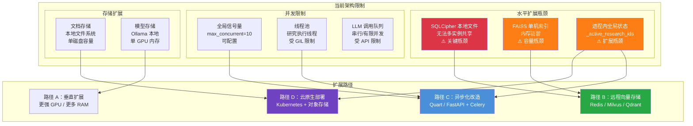
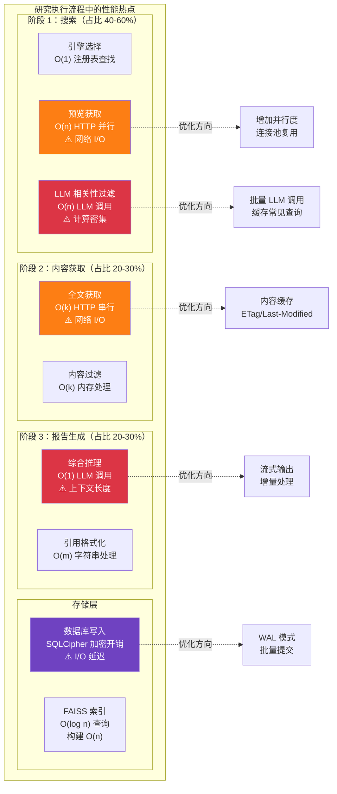
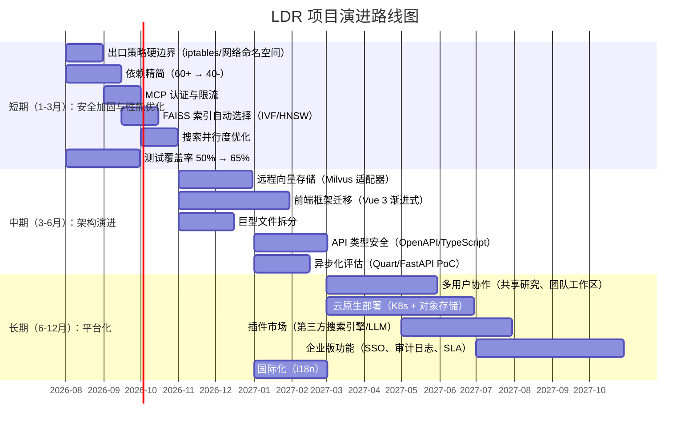

# 第 9 章：改进建议、风险点与未来规划

> 本章基于对 LDR 项目架构、代码和部署体系的深入分析，系统性地评估其优势与局限，识别潜在风险，并提出可操作的改进建议与演进路线。作为一份面向技术决策者的评估文档，本章兼顾战略视野与实施细节。

---

## 目录

- [9.1 架构优缺点分析](#91-架构优缺点分析)
- [9.2 可扩展性评估](#92-可扩展性评估)
- [9.3 安全加固建议](#93-安全加固建议)
- [9.4 性能瓶颈与优化](#94-性能瓶颈与优化)
- [9.5 技术债清单](#95-技术债清单)
- [9.6 未来规划路线图](#96-未来规划路线图)

---

## 9.1 架构优缺点分析

### 9.1.1 核心优势

#### 1. 本地优先设计（隐私保护）

LDR 的架构哲学是"数据不出本机"。所有研究数据、搜索历史、LLM 推理均在用户本地设备完成，无需将敏感查询发送至云端。这一设计：

- **消除数据泄露风险**：研究内容（可能涉及商业机密、个人隐私）不经过第三方服务器
- **符合合规要求**：满足 GDPR、HIPAA 等数据保护法规的"数据最小化"原则
- **离线可用**：核心功能（本地文档检索、已缓存研究）在无网络环境下可用
- **SQLCipher 加密**：数据库采用用户密码派生密钥加密，密码即密钥，即使数据库文件被窃取也无法解密

#### 2. 高度可扩展的搜索引擎插件架构

搜索引擎系统采用注册表 + 工厂模式，实现了优雅的插件化架构：

```python
# engine_registry.py — 引擎注册表（单一真相源）
ENGINE_REGISTRY: Dict[str, EngineEntry] = {
    "arxiv": EngineEntry(module_path=".engines.search_engine_arxiv", ...),
    "searxng": EngineEntry(module_path=".engines.search_engine_searxng", ...),
    # ... 35+ 引擎
}
```

- **35+ 内置搜索引擎**：覆盖学术论文（arXiv、PubMed、Semantic Scholar）、通用搜索（SearXNG、Brave、DuckDuckGo）、代码（GitHub）、新闻（Guardian、WikiNews）等
- **运行时注册**：`library`、`collection_*` 等动态引擎在运行时注册
- **白名单模块加载**：`module_whitelist.py` 防止任意代码执行
- **退出策略集成**：每个引擎声明 `is_public`/`is_local` 标志，参与策略决策

#### 3. 多 LLM 提供商支持（避免供应商锁定）

LDR 支持 10+ 种 LLM 提供商，通过统一的提供商抽象层实现切换无感：

- **本地推理**：Ollama、LM Studio、llama.cpp
- **云端 API**：OpenAI、Anthropic、Google、DeepSeek、xAI
- **代理服务**：OpenRouter、Requesty、OrcaRouter
- **自定义端点**：任何 OpenAI 兼容 API
- **用户注册 LLM**：支持运行时注入自定义 LLM 对象

这一设计确保用户不会被单一供应商锁定，可根据成本、性能、隐私需求灵活选择。

#### 4. 强大的安全纵深防御

LDR 的安全体系采用多层防御策略：

| 层级 | 机制 | 防护目标 |
|------|------|---------|
| 输入验证 | `ssrf_validator.py` | SSRF 攻击 |
| 退出策略 | `egress/policy.py` | 数据外泄 |
| 文件完整性 | `file_integrity/` | 供应链攻击 |
| 数据脱敏 | `data_sanitizer.py` | 敏感信息泄露 |
| 速率限制 | `rate_limiter.py` | DoS 攻击 |
| 认证锁定 | `account_lockout.py` | 暴力破解 |
| 容器安全 | Docker capabilities | 容器逃逸 |
| 密钥管理 | SQLCipher 加密 | 数据窃取 |

#### 5. 完善的 CI/CD 和测试覆盖

- **68 个 GitHub Actions 工作流**：业界领先的安全扫描密度
- **1,618 个 Python 测试 + 397 个 JS 测试**：单元、集成、E2E 三级覆盖
- **多浏览器 E2E**：Playwright（Chromium/WebKit）+ Puppeteer
- **安全扫描 20+ 工具**：CodeQL、Semgrep、Bearer、Trivy、Grype 等
- **自动化依赖更新**：Dependabot + 自定义更新工作流

#### 6. SQLCipher 加密数据库（密码即密钥）

- 数据库使用用户登录密码派生的密钥加密
- 无需单独的密钥管理基础设施
- 密码丢失 = 数据不可恢复（安全性与可用性的权衡）
- 支持加密备份，备份文件同样受密码保护

### 9.1.2 缺点与限制

#### 1. 代码规模复杂度

| 指标 | 数值 |
|------|------|
| Python 文件数 | 580 |
| Python 代码行数 | 176,013 |
| 直接依赖数 | 60+ |
| JS 文件 | 30+ 组件 + 页面 |
| 搜索引擎实现 | 35+ |
| 工作流配置 | 14,575 行 |

**影响**：新开发者上手成本高，代码审查负担重，变更影响面难以全面评估。尤其是 `research_routes.py`（2,285 行）和 `research_service.py`（3,091 行）两个文件承担了过多职责。

#### 2. 前后端耦合

- Flask 模板引擎（Jinja2）与原生 JavaScript 混合
- 前端逻辑分散在 30+ 个 JS 文件中，缺乏统一的组件模型
- Vite 构建系统与传统 Flask 静态资源共存的复杂性
- 缺乏类型安全的 API 契约（前后端通信依赖 Socket.IO 事件）

#### 3. 单进程 Flask 应用

- Flask 开发服务器为单进程（生产环境使用 Socket.IO 的 eventlet/gevent）
- 全局状态（`_active_research_ids`、`_global_research_semaphore`）依赖进程内内存
- 无法跨进程共享研究状态
- 水平扩展受限于单实例部署

#### 4. 大量依赖

`pyproject.toml` 中 60+ 直接依赖带来的挑战：

- **构建时间**：PDM 解析 + 安装耗时较长
- **安全攻击面**：每个依赖都是潜在的 CVE 来源
- **兼容性风险**：依赖版本冲突（如 `requests` 的 CVE 修复与 `arxiv` 的版本固定）
- **镜像体积**：大量依赖导致 Docker 镜像较大

#### 5. 前端构建系统复杂性

- Vite 构建与传统 Flask 模板的集成需要特殊处理（`vite_helper.py`）
- CSS 仅通过 Vite 加载（`import` in `app.js`），缺少构建产物会导致样式丢失
- 前端测试需要完整的浏览器环境（Playwright/Puppeteer + Chromium）

---

## 9.2 可扩展性评估



**可扩展性瓶颈分析说明：**

该图识别了 LDR 架构中三个关键的水平扩展瓶颈及其演进路径。SQLCipher 本地文件数据库是最核心的瓶颈——它绑定了应用状态到单一文件系统，使得多实例部署无法共享状态。FAISS 单机索引受限于单节点内存容量，当文档集合达到百万级时，内存和查询延迟将成为问题。进程内全局状态（如活动研究 ID 集合）在单进程模型下可行，但阻碍了水平扩展。

四条演进路径各有侧重：垂直扩展最简单但成本高；远程向量存储（路径 B）解耦数据层，是最具性价比的改进；异步化改造（路径 C）提升并发处理能力；云原生部署（路径 D）是终极目标但改动最大。建议按 B → C → D 的顺序渐进实施。

### 9.2.1 水平扩展限制

**SQLCipher 本地文件：**
- 数据库文件存储在本地 `/data/encrypted_databases/` 目录
- 多实例部署时每个实例拥有独立数据库
- 无法实现读写分离或主从复制

**并发研究限制：**
- 默认全局并发上限：10 个（`server.max_concurrent_research`）
- 单个用户的研究队列无硬性上限
- 线程池受 Python GIL 限制，CPU 密集型任务无法真正并行

### 9.2.2 向量存储扩展性

| 指标 | 当前（FAISS CPU） | 瓶颈 |
|------|------------------|------|
| 最大文档数 | ~100K（取决于内存） | 单机 RAM |
| 查询延迟 | 10-100ms | 索引类型 |
| 索引构建 | 分钟级 | CPU |
| 持久化 | 文件写入 | 磁盘 I/O |

### 9.2.3 扩展性评分

| 维度 | 评分（1-5） | 说明 |
|------|-----------|------|
| 垂直扩展 | ⭐⭐⭐⭐ | 支持更大 GPU、更多 RAM |
| 水平扩展 | ⭐⭐ | SQLCipher 限制多实例 |
| 并发处理 | ⭐⭐⭐ | 信号量控制，线程池有限 |
| 存储扩展 | ⭐⭐ | 本地文件系统限制 |
| 功能扩展 | ⭐⭐⭐⭐⭐ | 插件架构优秀 |

---

## 9.3 安全加固建议

### 9.3.1 出口策略硬边界

**当前状态：** 出口策略（`egress/policy.py`）是进程内的正确性护栏，文档明确说明它**不是**硬安全边界：

> "This is an in-process correctness guardrail, NOT a hard security boundary. It defends against honest misconfiguration, prompt-injection-induced URL fetches... It does NOT defend against compromised dependencies, code-execution in the LDR process."

**建议加固措施：**

| 层级 | 措施 | 实施难度 |
|------|------|---------|
| 网络命名空间 | 为 LDR 容器创建独立网络命名空间，限制出站连接 | 中 |
| iptables 规则 | 仅允许连接到已知 LLM/搜索端点 | 中 |
| Docker 网络策略 | 使用 Docker 网络插件限制容器出站 | 低 |
| 代理强制 | 所有出站 HTTP 经过显式代理（Squid/mitmproxy） | 中 |
| seccomp 配置文件 | 限制容器可用系统调用 | 低 |

### 9.3.2 MCP 服务器认证/限流

**当前状态：** MCP（Model Context Protocol）服务器（`mcp/`）无内置认证机制。

**建议：**

- **认证层**：添加 API Key 或 OAuth2 认证
- **速率限制**：基于客户端标识的调用频率限制
- **作用域限制**：限制 MCP 工具可访问的资源范围
- **审计日志**：记录所有 MCP 调用及参数

### 9.3.3 依赖供应链安全

**当前状态：** 60+ 直接依赖，每个都是潜在 CVE 来源。

**建议：**

1. **依赖精简**（参见 9.5 节技术债清单）
2. **SBOM 自动生成**：已部分实现（`sbom.yml`），建议集成至发布流程
3. **签名验证**：对关键依赖启用签名验证
4. **私有镜像代理**：使用 Nexus/Artifactory 缓存并扫描依赖
5. **CVE SLA**：定义高危漏洞修复时限（如 72 小时）

### 9.3.4 密钥管理改进

**当前状态：** SQLCipher 密钥由用户密码派生，无独立密钥管理。

**建议：**

- **密钥轮换机制**：支持定期轮换加密密钥
- **硬件安全模块（HSM）**：企业版支持 TPM/HSM 密钥存储
- **密钥托管服务**：集成 AWS KMS / HashiCorp Vault（企业场景）
- **密码强度策略**：`password_validator.py` 已存在，建议强制执行

---

## 9.4 性能瓶颈与优化



**性能热点分析说明：**

该图展示了单次研究执行流程中的性能分布与优化方向。搜索阶段占据 40-60% 的总耗时，其中预览获取受网络 I/O 延迟影响最大，LLM 相关性过滤则是计算密集型操作。内容获取阶段（20-30%）的主要瓶颈在于全文获取的串行 HTTP 请求。报告生成阶段（20-30%）受限于 LLM 上下文窗口——当搜索结果综合超出 token 限制时，需要截断或分批处理。存储层中 SQLCipher 的加密写入带来额外 I/O 开销。

优化策略按投入产出比排序：内容缓存和连接池复用改动小、收益明显；批量 LLM 调用需要 LangGraph 流程改造，收益大但实施复杂；流式输出改善用户体验但不减少总延迟。

### 9.4.1 搜索并行度优化

**当前实现：**

```python
# search_engine_base.py
relevance_filter_max_parallel_batches: int = 10
```

LLM 相关性过滤支持 10 个批次并行，但搜索引擎本身的预览获取通常是串行的。

**建议：**

- **引擎级并行**：多个搜索引擎同时查询（需策略层支持）
- **连接池复用**：`requests.Session` 复用 TCP 连接
- **HTTP/2 支持**：对支持 HTTP/2 的引擎启用多路复用
- **智能超时**：根据引擎历史响应时间动态调整超时

### 9.4.2 FAISS 索引性能

**索引类型选择：**

| 索引类型 | 构建时间 | 查询时间 | 内存占用 | 适用场景 |
|---------|---------|---------|---------|---------|
| Flat | 快 | 慢（线性） | 高 | <10K 文档 |
| IVF | 中 | 快 | 中 | 10K-1M 文档 |
| HNSW | 慢 | 最快 | 最高 | <100K 文档 |
| PQ | 中 | 快 | 低 | >1M 文档 |

**当前使用：** `faiss-cpu` 默认索引类型，建议根据文档数量自动选择。

### 9.4.3 数据库连接池优化

**当前状态：** SQLAlchemy + SQLCipher，`pool_config.py` 配置连接池。

**建议：**

- **连接池大小**：根据并发研究数调整（建议 = 并发数 × 1.5）
- **WAL 模式**：已使用，提升读写并发
- **批量写入**：累积多条日志后一次性提交
- **读写分离**：读操作使用只读连接（需架构支持）

### 9.4.4 前端资源加载优化

**当前状态：** Vite 生成带哈希的资源文件，但首屏加载仍需加载大量依赖。

**建议：**

- **代码分割**：按路由懒加载 JS/CSS
- **Tree Shaking**：移除未使用的依赖代码
- **资源预加载**：关键资源 `<link rel="preload">`
- **CDN 加速**：静态资源使用 CDN（已部分通过 npm CDN）
- **图片优化**：WebP 格式、懒加载

---

## 9.5 技术债清单

| 优先级 | 技术债 | 影响 | 当前状态 | 建议 |
|--------|--------|------|---------|------|
| **P0** | 前端框架迁移（原生 JS → React/Vue） | 可维护性 | 30+ 个松散 JS 文件，缺乏组件模型 | 分阶段迁移：先抽取共享组件，再逐页替换 |
| **P0** | 向量存储支持远程（Redis/Milvus/Qdrant） | 可扩展性 | 抽象层已存在（`vector_stores/`），仅 FAISS 实现 | 实现 Milvus 适配器，支持分布式索引 |
| **P1** | 异步 Flask（Quart/FastAPI 评估） | 并发性能 | 单进程 + 线程池，GIL 限制 | 渐进式：先评估 Quart 兼容性，再迁移 |
| **P1** | 依赖精简 | 构建速度、安全 | 60+ 直接依赖，部分可能未使用 | 使用 `vulture` + 手动审计，移除未使用依赖 |
| **P1** | 巨型文件拆分 | 可维护性 | `research_service.py` 3091行、`research_routes.py` 2285行 | 按职责拆分为子模块 |
| **P2** | 测试覆盖率提升 | 代码质量 | 当前基线 50%（`fail_under = 50`） | 目标 80%+，优先覆盖核心路径 |
| **P2** | API 类型安全 | 前后端协作 | Socket.IO 事件无类型定义 | 引入 TypeScript 或 Protobuf 契约 |
| **P2** | 配置文档自动化 | 文档维护 | 手动维护配置参考 | 从代码自动生成配置文档 |
| **P3** | 国际化（i18n） | 可访问性 | 硬编码英文 UI | 引入 Flask-Babel |
| **P3** | 暗色主题完善 | 用户体验 | 部分支持 | 统一 CSS 变量，完善暗色模式 |

### 技术债详细说明

#### P0：前端框架迁移

**问题**：当前前端由 30+ 个原生 JS 文件组成，通过 Vite 打包。虽然引入了 marked、DOMPurify 等现代库，但整体缺乏组件化架构，导致：

- 状态管理分散（全局变量 + DOM 操作）
- 组件复用困难（聊天、进度条等重复实现）
- 测试困难（无组件级测试）

**迁移路径**：
1. 第一阶段：引入 Alpine.js 或 Petite-Vue（渐进增强，最小改动）
2. 第二阶段：将聊天、进度条等复杂组件迁移至 Vue 3
3. 第三阶段：全面 SPA 化，Flask 仅作为 API 后端

#### P0：远程向量存储

**问题**：FAISS 索引驻留单机内存，限制：
- 文档容量受 RAM 限制
- 无法跨实例共享索引
- 索引构建阻塞主进程

**解决方案**：
- 实现 `vector_stores/` 抽象层的 Milvus/Qdrant 适配器
- Milvus：支持十亿级向量，分布式部署
- Qdrant：Rust 实现，性能优秀，支持过滤

#### P1：依赖精简

**可移除候选**（需验证）：
- `xlwt`（仅测试使用，已标记）
- `xlrd`（仅旧版 Excel，可用 openpyxl 替代）
- `pyarrow` / `datasets`（如未直接使用）
- `elasticsearch`（如用户未使用 ES 引擎）

**方法**：
```bash
pip install pip-check-reqs
pip-extra-reqs src/
pip-missing-reqs src/
```

---

## 9.6 未来规划路线图



**路线图说明：**

该甘特图展示了 LDR 项目未来 12 个月的演进规划，分为三个时间维度。短期聚焦于"守住底线"——通过安全加固消除已知风险，通过性能优化提升用户体验，通过依赖精简降低维护负担。这些改动不涉及架构级变更，风险可控，可在现有架构上渐进实施。

中期是架构演进的关键期，五项任务相互关联：远程向量存储为多实例部署铺路，前端框架迁移改善开发效率，API 类型安全为前后端分离奠定基础，异步化评估则是全面性能提升的前置研究。

长期目标是平台化转型——从单用户本地应用演进为支持多用户协作、云原生部署的企业级平台。插件市场和企业版功能是商业化路径的关键组成。

### 9.6.1 短期规划（1-3 月）：安全加固与性能优化

**目标**：消除已知安全风险，提升核心路径性能

| 任务 | 预期产出 | 负责领域 |
|------|---------|---------|
| 出口策略硬边界 | iptables 规则模板 + Docker 网络策略配置 | 安全 |
| 依赖精简 | 移除 15-20 个未使用依赖，构建时间减少 30% | DevOps |
| MCP 认证 | API Key 认证 + 速率限制中间件 | 安全 |
| FAISS 自动选择 | 根据文档数量自动选择最优索引类型 | 性能 |
| 搜索并行度 | 多引擎并行查询，搜索耗时减少 40% | 性能 |
| 测试覆盖率 | 核心路径覆盖率从 50% 提升至 65% | 质量 |

### 9.6.2 中期规划（3-6 月）：架构演进

**目标**：为水平扩展和前后端分离奠定基础

| 任务 | 预期产出 | 负责领域 |
|------|---------|---------|
| 远程向量存储 | Milvus 适配器 + 部署文档 | 架构 |
| 前端框架迁移 | 聊天/进度条等核心组件 Vue 3 化 | 前端 |
| 巨型文件拆分 | research_service.py 拆分为 5+ 个子模块 | 架构 |
| API 类型安全 | OpenAPI 3.0 定义 + TypeScript 客户端 | 前后端 |
| 异步化评估 | Quart/FastAPI 兼容性报告 + PoC | 架构 |

### 9.6.3 长期规划（6-12 月）：平台化

**目标**：从单用户工具演进为多用户协作平台

| 任务 | 预期产出 | 负责领域 |
|------|---------|---------|
| 多用户协作 | 共享研究、团队工作区、权限管理 | 产品 |
| 云原生部署 | Kubernetes Helm Chart + Terraform 模块 | DevOps |
| 插件市场 | 第三方引擎/LLM 注册、安装、评分系统 | 平台 |
| 企业版功能 | SSO（SAML/OIDC）、审计日志、SLA 保障 | 产品 |
| 国际化 | 中文/日文/德文/法文 UI 翻译 | 产品 |

---

## 本章小结

本章对 LDR 项目进行了全面的架构评估与改进规划：

**核心优势**：本地优先的隐私保护设计、35+ 搜索引擎插件架构、10+ LLM 提供商支持、纵深防御安全体系、业界领先的 CI/CD 覆盖。

**主要挑战**：代码规模复杂度（176K 行 Python）、前后端耦合、单进程扩展瓶颈、60+ 依赖管理负担。

**优先行动项**：
1. P0：前端框架迁移 + 远程向量存储（可并行推进）
2. P1：依赖精简 + 异步化评估 + 巨型文件拆分
3. 短期安全加固：出口策略硬边界 + MCP 认证

LDR 项目已建立了坚实的技术基础，通过系统性地偿还技术债、分阶段架构演进，完全有能力从优秀的本地 AI 研究工具演进为生产级企业级平台。

---

☕️ 制作不易，请我喝咖啡☕️关注我➕

