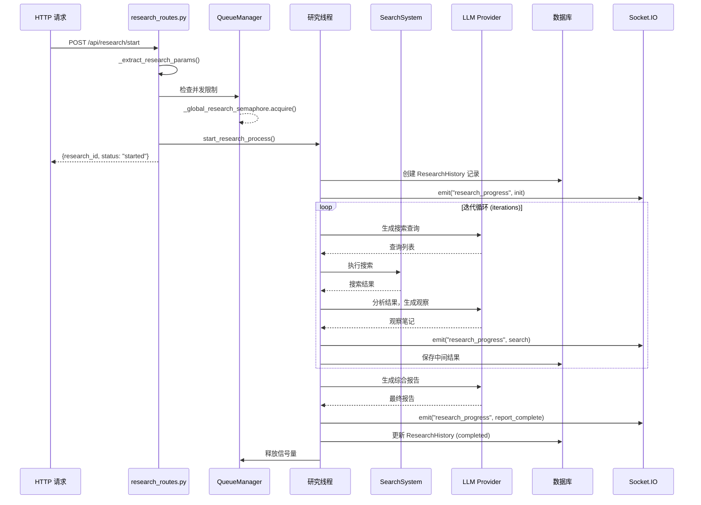
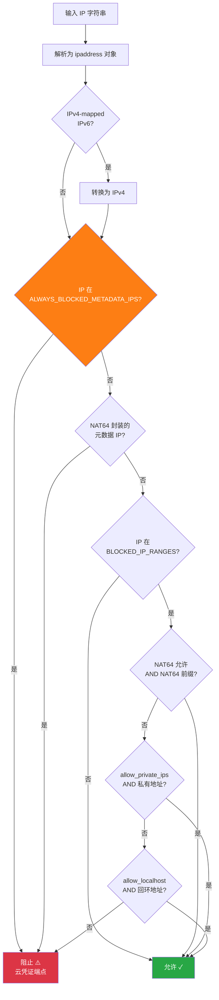

# 第 10 章：组件代码走读文档

> 本章对 Local Deep Research 的五大核心组件进行深入的代码走读分析。每个走读包含文件定位、函数签名、逐步逻辑分析（含伪代码）、设计模式识别、复杂度分析和改进建议。通过本章，读者将对 LDR 的内部实现有精确到函数级别的理解。

---

## 目录

- [10.1 搜索引擎引擎代码走读](#101-搜索引擎引擎代码走读)
- [10.2 Web 路由层代码走读](#102-web-路由层代码走读)
- [10.3 前端 JS 组件代码走读](#103-前端-js-组件代码走读)
- [10.4 数据库服务层代码走读](#104-数据库服务层代码走读)
- [10.5 安全子系统代码走读](#105-安全子系统代码走读)

---

## 10.1 搜索引擎引擎代码走读（web_search_engines/）

搜索引擎是 LDR 的核心能力层，负责将用户查询转化为结构化的搜索结果。系统采用抽象基类 + 注册表 + 工厂模式实现高度可扩展的插件架构。

### 10.1.1 BaseSearchEngine.run() 完整代码走读

**文件路径：** `src/local_deep_research/web_search_engines/search_engine_base.py`
**总行数：** 1,326 行
**核心函数：** `run()`（第 575-796 行）

**函数签名：**

```python
def run(
    self, query: str, research_context: Dict[str, Any] | None = None
) -> List[Dict[str, Any]]:
```

**参数说明：**
- `query`：搜索查询字符串
- `research_context`：研究上下文（来自前序搜索结果，用于策略传递）
- 返回值：搜索结果列表，每个结果为包含 `title`、`url`、`snippet`、`content` 等字段的字典

**逐步逻辑分析（伪代码）：**

```
FUNCTION run(query, research_context):
    # === 阶段 0：出口策略验证 ===
    CALL _verify_egress_scope()  # 运行时策略护栏
        IF snapshot存在 AND engine_name已设置:
            IF 未验证过 OR policy_key变化:
                CALL _check_egress_policy()
                    IF PolicyDeniedError: RAISE
    
    # === 阶段 1：指标追踪初始化 ===
    should_record_metrics = NOT programmatic_mode
    IF research_context存在:
        set_search_context(research_context)
    
    start_time = NOW()
    
    # === 阶段 2：带重试的执行 ===
    IF rate_tracker.enabled:
        WRAP _execute_search WITH @retry(
            stop=3 attempts,
            wait=AdaptiveWait(adaptive算法),
            retry_on=RateLimitError
        )
    ELSE:
        _execute_search  # 无重试
    
    # === 阶段 3：核心搜索逻辑（_execute_search 内部） ===
    FUNCTION _execute_search():
        # Step 3.1：获取预览
        previews = self._get_previews(query)  # 抽象方法，子类实现
        IF previews为空: RETURN []
        
        # Step 3.2：科学引擎 DOI 丰富化
        IF self.is_scientific:
            previews = enrich_results_with_source_ids(previews)
        
        # Step 3.3：预览过滤
        FOR each preview_filter IN self._preview_filters:
            previews = preview_filter.filter_results(previews, query)
        
        # Step 3.4：LLM 相关性过滤
        IF enable_llm_relevance_filter AND self.llm存在:
            filtered = self._filter_for_relevance(previews, query)
            # 内部调用 relevance_filter 模块
            # 分批（batch_size=5）并行（max_parallel=10）发送给 LLM
            # LLM 返回相关结果的索引列表
        ELSE:
            filtered = previews
        
        # Step 3.5：全文获取或片段返回
        IF search_snippets_only:
            results = filtered
        ELSE:
            results = self._get_full_content(filtered)  # 仅获取相关结果全文
        
        # Step 3.6：内容过滤
        FOR each content_filter IN self._content_filters:
            results = content_filter.filter_results(results, query)
        
        RETURN results
    
    # === 阶段 4：清理与指标记录 ===
    FINALLY:
        IF should_record_metrics:
            SearchTracker.record_search(engine_name, query, ...)
        cleanup temp attributes
        clear search context
```

**设计模式识别：**

| 模式 | 应用位置 | 说明 |
|------|---------|------|
| 模板方法模式 | `run()` + `_get_previews()` + `_get_full_content()` | 基类定义算法骨架，子类实现具体步骤 |
| 策略模式 | `preview_filters`、`content_filters` | 可插拔的过滤器链 |
| 装饰器模式 | `@retry` | 透明地添加重试能力 |
| 观察者模式 | `SearchTracker.record_search()` | 搜索事件触发指标记录 |
| 工厂方法模式 | `search_engine_factory.py` | 根据配置创建具体引擎实例 |

**时间复杂度分析：**

| 步骤 | 复杂度 | 说明 |
|------|--------|------|
| `_get_previews()` | O(n) | n = max_results，HTTP 请求 |
| DOI 丰富化 | O(n) | 每个结果一次 API 调用 |
| 预览过滤 | O(n × f) | f = 过滤器数量 |
| LLM 相关性过滤 | O(n/b × L) | b = batch_size, L = LLM 延迟 |
| `_get_full_content()` | O(k) | k = 相关结果数，k ≤ n |
| **总计** | **O(n × L)** | 主导项：LLM 调用 |

**空间复杂度：** O(n)，存储预览和结果列表。

### 10.1.2 代表性引擎详细分析

#### SearXNG 引擎（search_engine_searxng.py）

**特点：** 自托管元搜索引擎，聚合多个上游搜索引擎结果

**核心流程：**
1. 构建请求 URL：`http://searxng:8080/search?q={query}&format=json`
2. 发送 HTTP GET 请求
3. 解析 JSON 响应，提取 `results` 数组
4. 映射为标准结果格式：`{title, url, snippet, source}`

**配置项：**
- `instance_url`：SearXNG 实例地址（Docker 内网：`http://searxng:8080`）
- `categories`：搜索类别（general、news、science 等）
- `language`：搜索结果语言

#### ArXiv 引擎（search_engine_arxiv.py）

**特点：** 学术搜索引擎，搜索物理学、数学、计算机科学等领域论文

**核心流程：**
1. 使用 `arxiv` Python 客户端发送查询
2. 支持高级查询语法（`ti:`、`au:`、`abs:` 等字段）
3. 自动附加 `JournalReputationFilter`（期刊声誉过滤）
4. 结果包含 DOI、作者、摘要、PDF 链接

**特殊处理：**
- `is_scientific = True`：触发 DOI → OpenAlex 丰富化
- `is_lexical = True`：启用 LLM 相关性过滤
- 自动创建 `JournalReputationFilter` 作为预览过滤器

#### DuckDuckGo 引擎（search_engine_ddg.py）

**特点：** 隐私搜索引擎，无需 API 密钥

**核心流程：**
1. 使用 `duckduckgo-search` Python 库
2. 调用 `DDG().text()` 或 `DDG().news()` 方法
3. 解析返回的结果列表
4.  DuckDuckGo 速率限制较严格，`AdaptiveRateLimitTracker` 自动适配

### 10.1.3 引擎注册表初始化流程

**文件路径：** `engine_registry.py`（约 120 行）

```mermaid
flowchart TB
    START["应用启动"] --> LOAD["加载 engine_registry.py<br/>ENGINE_REGISTRY 字典"]
    LOAD --> DISCOVER["search_engines_config.py<br/>注册动态引擎"]
    DISCOVER -->|"注册 library"| LIB["LibraryRAGSearchEngine<br/>本地文档检索"]
    DISCOVER -->|"注册 collection_"| COLL["CollectionSearchEngine<br/>集合检索"]
    DISCOVER -->|"注册 retrievers"| RET["LangChain Retrievers<br/>向量检索"]
    
    FACTORY["search_engine_factory.py<br/>create_search_engine()"]
    LOAD --> FACTORY
    LIB & COLL & RET --> FACTORY
    
    FACTORY -->|"1. 查找注册表"| LOOKUP{"引擎在<br/>ENGINE_REGISTRY?"}
    LOOKUP -->|"是"| IMPORT["安全导入模块<br/>get_safe_module_class()"]
    LOOKUP -->|"否"| CHECK{"是 collection<br/>或 library?"}
    CHECK -->|"是"| DYNAMIC["使用动态类"]
    CHECK -->|"否"| ERROR["抛出未知引擎错误"]
    
    IMPORT --> INSTANTIATE["实例化引擎类"]
    DYNAMIC --> INSTANTIATE
    INSTANTIATE --> CONFIGURE["配置 LLM、过滤器、速率追踪器"]
    CONFIGURE --> VERIFY["evaluate_engine()<br/>出口策略验证"]
    VERIFY -->|"通过"| RETURN["返回配置好的引擎实例"]
    VERIFY -->|"拒绝"| DENY["PolicyDeniedError"]

    style START fill:#4A90D9,color:#fff
    FACTORY fill:#28A745,color:#fff
    VERIFY fill:#FD7E14,color:#fff
    RETURN fill:#6F42C1,color:#fff
```

**注册表初始化流程说明：**

该图展示了搜索引擎从注册表到可用实例的完整生命周期。应用静态引擎通过 `ENGINE_REGISTRY` 字典硬编码映射（35+ 引擎），动态引擎（library、collection_*、retrievers）在运行时注册。工厂方法 `create_search_engine()` 统一处理两类引擎的创建：先查找注册表，通过白名单验证的模块导入机制加载类，再实例化并配置 LLM、过滤器等依赖，最后通过出口策略验证。这种设计确保了引擎创建的安全性（防止任意代码加载）和一致性（统一配置流程）。

### 10.1.4 速率限制器（AdaptiveRateLimitTracker）

**文件路径：** `rate_limiting/tracker.py`

**核心机制：**

```python
class AdaptiveRateLimitTracker:
    """自适应速率限制追踪器"""
    
    def get_wait_time(self, engine_type: str) -> float:
        """根据历史成功率动态计算等待时间"""
        # 指数退避 + 抖动
        # 成功率低 → 增加等待时间
        # 成功率高 → 减少等待时间
    
    def record_outcome(self, engine_type, wait_time, success, ...):
        """记录搜索结果，更新内部状态"""
```

**自适应算法：**
- 维护每个引擎类型的成功率指数移动平均
- 速率限制错误触发指数退避（2^n × base_wait）
- 成功响应逐步减少等待时间
- 添加随机抖动防止"惊群效应"

---

## 10.2 Web 路由层代码走读（web/routes/）

Web 路由层是 LDR 的 HTTP 入口，基于 Flask Blueprint 组织，处理研究管理、认证、设置、指标等请求。

### 10.2.1 研究路由完整走读（start_research 端点）

**文件路径：** `src/local_deep_research/web/routes/research_routes.py`
**总行数：** 2,285 行

```mermaid
flowchart TB
    subgraph "HTTP 请求处理"
        REQ["POST /api/research/start<br/>JSON body with research params"]
        
        subgraph "1. 认证与限流"
            AUTH["@login_required<br/>验证用户会话"]
            RATE["api_rate_limit<br/>API 速率限制"]
        end
        
        subgraph "2. 请求验证"
            VALID["@require_json_body<br/>验证 JSON 格式"]
            EXTRACT["_extract_research_params()<br/>提取并解析参数"]
            SAFE_LLM["is_safe_custom_llm_endpoint()<br/>验证自定义 LLM URL"]
        end
        
        subgraph "3. 队列检查"
            QUEUE_CHECK{"活跃研究数<br/>≥ 并发上限?"}
            DUP_CHECK{"重复研究<br/>检查?"}
        end
        
        subgraph "4. 研究启动"
            FORK["start_research_process()<br/>启动后台线程"]
            DB_CREATE["创建 ResearchHistory<br/>数据库记录"]
            SOCKET_EMIT["Socket.IO 通知<br/>研究已开始"]
        end
        
        RESP["返回 JSON<br/>{research_id, status: 'started'}"]
    end

    REQ --> AUTH --> RATE --> VALID --> EXTRACT --> SAFE_LLM
    SAFE_LLM --> QUEUE_CHECK
    QUEUE_CHECK -->|"否"| DUP_CHECK
    QUEUE_CHECK -->|"是"| REJECT["返回 429<br/>SystemAtCapacityError"]
    DUP_CHECK -->|"否"| FORK
    DUP_CHECK -->|"是"| DUP_REJECT["返回 409<br/>DuplicateResearchError"]
    FORK --> DB_CREATE --> SOCKET_EMIT --> RESP

    style REQ fill:#4A90D9,color:#fff
    AUTH fill:#FD7E14,color:#fff
    FORK fill:#28A745,color:#fff
    RESP fill:#6F42C1,color:#fff
    REJECT fill:#DC3545,color:#fff
    DUP_REJECT fill:#DC3545,color:#fff
```

**start_research 端点流程图说明：**

该图展示了研究启动端点的完整请求处理管道。请求首先经过认证（确保用户已登录）和速率限制（防止 API 滥用），然后通过 JSON 格式验证和参数提取（`_extract_research_params` 从请求体或数据库设置中解析模型、搜索引擎、迭代次数等参数）。自定义 LLM 端点需通过 SSRF 安全检查。

队列检查阶段验证系统是否达到并发研究上限（默认 10 个）以及是否存在重复研究（相同查询+参数组合）。通过所有检查后，研究以后台线程方式启动，创建数据库记录记录研究元数据，并通过 Socket.IO 实时通知前端。

这种异步启动设计确保了 HTTP 请求快速返回（< 100ms），实际研究执行在后台进行，用户通过实时推送获取进度更新。

### 10.2.2 认证路由走读

**文件路径：** `web/auth/` 目录

**认证流程：**

1. **注册**：`POST /auth/register` → 密码哈希（bcrypt）→ 创建用户 → 生成 SQLCipher 密钥
2. **登录**：`POST /auth/login` → 验证密码 → 创建会话 → 触发数据库备份检查
3. **登出**：`POST /auth/logout` → 清除会话 → 清理用户资源

**安全特性：**
- `account_lockout.py`：连续失败登录锁定（防暴力破解）
- `password_validator.py`：密码强度验证
- `SecureCookieMiddleware`：安全 Cookie 配置（HttpOnly、Secure、SameSite）

### 10.2.3 设置路由走读

**文件路径：** `web/routes/settings_routes.py`

设置路由处理所有运行时配置的读写：

- **GET /settings/**：渲染设置仪表板
- **POST /settings/update**：更新单个设置项
- **GET /settings/export**：导出设置（JSON 格式）
- **POST /settings/import**：导入设置

设置通过 `settings_service.py` 持久化至 SQLCipher 加密数据库，支持按用户隔离。

---

## 10.3 前端 JS 组件代码走读（web/static/js/）

LDR 前端采用原生 JavaScript + Vite 构建，通过模块化组织实现复杂交互逻辑。

### 10.3.1 研究页面 JS 逻辑

**核心文件：**

| 文件 | 行数（估） | 职责 |
|------|-----------|------|
| `app.js` | ~200 | 入口点、库初始化、全局配置 |
| `components/research.js` | ~400 | 研究表单提交、状态管理 |
| `components/progress.js` | ~300 | 研究进度实时更新 |
| `components/chat.js` | ~500 | 聊天模式交互 |
| `components/results.js` | ~300 | 研究结果展示 |
| `components/details.js` | ~250 | 研究详情页 |

### 10.3.2 Socket.IO 客户端处理

```javascript
// app.js — Socket.IO 初始化
import io from 'socket.io-client';
window.io = io;

// components/progress.js — 进度事件处理
const socket = io();

socket.on('research_progress', (data) => {
    const { research_id, progress, phase, message } = data;
    
    updateProgressBar(research_id, progress);
    updatePhaseIndicator(phase);
    
    if (phase === 'complete') {
        showCompletionMessage(message);
        loadResults(research_id);
    } else if (phase === 'error') {
        showErrorMessage(message);
    }
});

socket.on('research_log', (data) => {
    appendLogEntry(data.research_id, data.level, data.message);
});
```

**Socket.IO 事件体系：**

| 事件名 | 方向 | 数据 | 用途 |
|--------|------|------|------|
| `research_progress` | 服务器→客户端 | `{id, progress, phase}` | 实时进度更新 |
| `research_log` | 服务器→客户端 | `{id, level, message}` | 日志流 |
| `chat_message` | 双向 | `{id, content, delta}` | 聊天消息流 |
| `research_complete` | 服务器→客户端 | `{id, report}` | 研究完成通知 |
| `termination_signal` | 客户端→服务器 | `{id}` | 终止研究请求 |

### 10.3.3 进度条更新逻辑

```mermaid
flowchart TB
    subgraph "进度计算 [research_service.py]"
        SEARCH_CAP["搜索阶段<br/>进度 0-80%<br/>_DETAILED_SEARCH_PROGRESS_CAP=8"]
        REPORT_START["报告开始<br/>进度 10%<br/>_DETAILED_REPORT_PROGRESS_START"]
        REPORT_END["报告结束<br/>进度 100%<br/>_DETAILED_REPORT_PROGRESS_END"]
    end

    subgraph "Socket.IO 发射"
        THROTTLE["发射节流<br/>_EMIT_THROTTLE=200ms<br/>防止 UI 过载"]
        TTL["TTL 清理<br/>_EMIT_TTL=3600s<br/>孤儿研究清理"]
    end

    subgraph "前端处理 [progress.js"]
        RECEIVE["接收 progress 事件"]
        DEDUP{"重复相位<br/>去重?"}
        UPDATE["更新 DOM 进度条"]
        RENDER["渲染步骤消息"]
        COMPLETE{"phase = complete?"}
    end

    SEARCH_CAP -->|"搜索进度 0-80%"| THROTTLE
    REPORT_START -->|"报告进度 10-100%"| THROTTLE
    REPORT_END --> THROTTLE
    THROTTLE -->|"emit research_progress"| RECEIVE
    TTL -.->|"定期清理"| _last_emit_times
    RECEIVE --> DEDUP
    DEDUP -->|"新相位"| UPDATE
    DEDUP -->|"重复相位"| RENDER
    UPDATE --> COMPLETE
    RENDER --> COMPLETE
    COMPLETE -->|"是"| LOAD_RESULTS["加载完整结果"]
    COMPLETE -->|"否"| CONTINUE["继续监听"]

    style SEARCH_CAP fill:#4A90D9,color:#fff
    REPORT_START fill:#28A745,color:#fff
    REPORT_END fill:#6F42C1,color:#fff
    THROTTLE fill:#FD7E14,color:#fff
```

**进度条更新逻辑说明：**

该图展示了研究进度从计算到展示的完整流程。后端将研究分为两个阶段：搜索阶段（进度 0-80%，由 `_DETAILED_SEARCH_PROGRESS_CAP` 控制）和报告阶段（进度 10-100%）。这种非线性的进度分配反映了报告生成通常比搜索更耗时的实际情况。

发射节流机制（200ms 间隔）防止高频更新导致 UI 卡顿。TTL 清理机制自动清除超过 1 小时的孤儿研究进度记录，防止内存泄漏。前端的重复相位去重确保同一相位不会在 UI 中重复显示，同时保证最终状态（complete/error）始终被发射和显示。

### 10.3.4 设置页面交互

**文件路径：** `components/settings.js`、`components/settings_sync.js`

设置页面的核心交互模式：

1. **即时保存**：字段变更后自动 debounce 保存（500ms）
2. **设置同步**：多标签页间设置变更同步（BroadcastChannel API）
3. **强制锁定指示**：被环境变量锁定的设置显示锁定图标，禁止编辑
4. **验证反馈**：输入验证失败时即时显示错误信息

### 10.3.5 前端安全组件

**文件路径：** `security/` 子目录

| 文件 | 功能 |
|------|------|
| `xss-protection.js` | 输出编码、CSP 兼容 |
| `safe-fetch.js` | 安全 HTTP 请求封装（CSRF 令牌、超时） |
| `auth-validation.js` | 客户端认证状态验证 |
| `url-validator.js` | URL 客户端预验证 |
| `safe-logger.js` | 安全日志输出（脱敏） |

---

## 10.4 数据库服务层代码走读（database/, web/services/）

数据库服务层是 LDR 的数据持久化核心，管理研究历史、用户数据、设置和队列。

### 10.4.1 SQLAlchemy Session 管理

**文件路径：** `database/session_context.py`、`database/thread_local_session.py`

```python
# 上下文管理器模式管理数据库会话
@contextmanager
def get_user_db_session(username: str):
    """获取用户专属的数据库会话"""
    session = SessionLocal()
    try:
        # 设置 SQLCipher 密钥
        set_key(session, username)
        yield session
        session.commit()
    except Exception:
        session.rollback()
        raise
    finally:
        session.close()
```

**Session 管理策略：**
- 每个用户独立的加密数据库文件
- 上下文管理器确保会话正确关闭
- 自动提交/回滚事务
- 线程本地存储（`thread_local_session.py`）避免跨线程污染

### 10.4.2 研究服务走读（research_service.py 核心函数）

**文件路径：** `src/local_deep_research/web/services/research_service.py`
**总行数：** 3,091 行

**核心函数：`run_research_process()`**



**研究服务时序图说明：**

该图展示了单次研究的完整执行时序。HTTP 请求快速返回研究 ID，实际执行在后台线程中进行。研究线程首先获取全局信号量（控制并发数），然后进入迭代循环——每个迭代中，LLM 生成搜索查询，搜索引擎执行搜索，LLM 分析结果生成观察笔记。每个阶段通过 Socket.IO 实时推送进度至前端。

迭代完成后，LLM 综合所有观察生成最终报告，更新数据库状态为 completed，释放信号量。整个流程中，任何阶段的异常都会被捕获并通过 `error` 相位通知前端，确保用户始终了解研究状态。

**关键全局变量：**

```python
# 全局并发控制
_MAX_GLOBAL_CONCURRENT = get_env_setting("server.max_concurrent_research", 10)
_global_research_semaphore = threading.Semaphore(_MAX_GLOBAL_CONCURRENT)

# Socket.IO 发射节流
_EMIT_THROTTLE_SECONDS = 0.2  # 200ms
_EMIT_TTL_SECONDS = 3600  # 1 hour

# 进度分配
_DETAILED_SEARCH_PROGRESS_CAP = 8
_DETAILED_REPORT_PROGRESS_START = 10
_DETAILED_REPORT_PROGRESS_END = 100
```

### 10.4.3 设置服务

**文件路径：** `web/services/settings_service.py`

设置服务管理所有运行时配置：

- **读取优先级**：环境变量 > 数据库设置 > 默认值
- **设置验证**：类型检查、范围验证、安全验证
- **变更通知**：设置变更触发相关组件重新初始化
- **导入/导出**：JSON 格式的设置备份与恢复

### 10.4.4 队列处理器

**文件路径：** `web/queue/manager.py`、`web/queue/processor_v2.py`

```python
class QueueManager:
    """研究队列管理器"""
    
    def enqueue(self, research_params: dict) -> str:
        """将研究请求加入队列"""
        research_id = generate_uuid()
        queued = QueuedResearch(id=research_id, **research_params)
        db.session.add(queued)
        db.session.commit()
        return research_id
    
    def process_next(self):
        """处理队列中的下一个研究"""
        if self._global_research_semaphore._value > 0:
            next_item = QueuedResearch.query.order_by(
                QueuedResearch.created_at
            ).first()
            if next_item:
                start_research_process(next_item.params)
```

---

## 10.5 安全子系统代码走读（security/）

安全子系统是 LDR 的纵深防御核心，涵盖 SSRF 防护、出口策略、文件完整性、数据脱敏等多个维度。

### 10.5.1 SSRF 验证器完整走读（validate_url 函数）

**文件路径：** `src/local_deep_research/security/ssrf_validator.py`
**总行数：** 417 行
**核心函数：** `validate_url()`（第 192-338 行）

**函数签名：**

```python
def validate_url(
    url: str,
    allow_localhost: bool = False,
    allow_private_ips: bool = False,
) -> bool:
```

**参数说明：**
- `url`：待验证的 URL 字符串
- `allow_localhost`：是否允许本地回环地址（用于信任的内部服务）
- `allow_private_ips`：是否允许所有私有 IP（用于容器内服务）
- 返回值：`True` 表示安全，`False` 表示被阻止

**逐步逻辑分析（伪代码）：**

```
FUNCTION validate_url(url, allow_localhost, allow_private_ips):
    # === 第 0 层：类型检查 ===
    IF url 不是字符串: RETURN False
    
    url = url.strip()
    
    # === 第 1 层：RFC 非法字符检测 ===
    # 检测反斜杠、空白字符、控制字节
    # 防止解析器差异攻击（urlparse vs urllib3）
    IF RFC_FORBIDDEN_URL_CHARS_RE.search(url):
        LOG warning
        RETURN False
    
    # === 第 2 层：Scheme 验证 ===
    parsed = urlparse(url)
    IF parsed.scheme NOT IN {"http", "https"}:
        RETURN False
    
    # === 第 3 层：主机名提取（使用 urllib3 解析器）===
    # 关键：使用与 requests 相同的解析器，防止解析差异攻击
    u3 = parse_url(url)
    hostname = u3.host
    
    # 非 ASCII 字符检查
    IF hostname 包含非 ASCII 字符:
        RETURN False
    
    # IPv6 括号剥离
    IF hostname 以 "[" 开头: hostname = hostname[1:-1]
    
    # 尾随点剥离（匹配 getaddrinfo 行为）
    hostname = hostname.rstrip(".")
    
    IF hostname 为空: RETURN False
    
    # === 第 4 层：IP 地址直接检查 ===
    TRY:
        ip = ipaddress.ip_address(hostname)
        IF is_ip_blocked(ip, allow_localhost, allow_private_ips):
            RETURN False
    CATCH ValueError:
        # 不是 IP 地址，是域名 → 继续 DNS 解析
        PASS
    
    # === 第 5 层：DNS 解析 + IP 检查 ===
    TRY:
        addr_info = socket.getaddrinfo(hostname, None)
        FOR each resolved_ip IN addr_info:
            IF is_ip_blocked(resolved_ip, allow_localhost, allow_private_ips):
                RETURN False
    CATCH socket.gaierror:
        RETURN False  # 无法解析 → 阻止
    
    # === 通过所有检查 ===
    RETURN True
```

**`is_ip_blocked()` 决策流程：**



**SSRF 验证器决策流程说明：**

该图展示了 `is_ip_blocked()` 函数的完整决策树。IP 地址经过 IPv4-mapped IPv6 解包后，依次通过四层检查：

1. **云元数据端点检查**（最高优先级）：无论 `allow_localhost`/`allow_private_ips` 如何设置，AWS/Azure/阿里云等云凭证端点始终被阻止
2. **NAT64 封装检测**：检测通过 IPv6 NAT64 前缀封装的元数据 IPv4 地址，防止绕过
3. **阻止范围匹配**：检查 IP 是否在配置的阻止范围内，支持 NAT64 前缀例外（当 `allow_nat64=true`）
4. **允许标志检查**：`allow_private_ips` 允许 RFC1918/CGNAT/链路本地地址，`allow_localhost` 仅允许回环地址

这种纵深防御设计确保即使攻击者使用 IPv6 封装、NAT64 转换或解析器差异等技术，也无法绕过 SSRF 防护访问云元数据端点。

**复杂度分析：**

| 指标 | 值 | 说明 |
|------|---|------|
| 时间复杂度 | O(k) | k = DNS 解析返回的 IP 数量 |
| 空间复杂度 | O(1) | 固定大小的 IP 范围集合 |
| DNS 解析 | 阻塞 | 潜在性能瓶颈 |
| 安全覆盖 | 多层 | 字符过滤、解析差异、DNS 重绑定（部分） |

### 10.5.2 出口策略评估器（evaluate_url 决策流程）

**文件路径：** `src/local_deep_research/security/egress/policy.py`
**总行数：** 1,463 行
**核心函数：** `evaluate_url()`（第 935-1061 行）

**函数签名：**

```python
def evaluate_url(url: str, ctx: EgressContext) -> Decision:
```

**决策流程：**

```
FUNCTION evaluate_url(url, ctx):
    # === 配额检查 ===
    IF denial_count >= MAX_DENIED_FETCHES_PER_RUN (50):
        RETURN Decision(False, "denial_quota_exceeded")
    
    # === 解析 URL ===
    parsed = urlsplit(url)
    
    # === 危险 scheme 检查 ===
    IF scheme IN {javascript, data, file, vbscript, about}:
        RETURN Decision(False, "dangerous_scheme")
    
    IF scheme NOT IN {http, https}:
        RETURN Decision(False, "unsupported_scheme")
    
    # === 主机名规范化 ===
    host = unquote(parsed.hostname)  # URL 解码
    host = host.rstrip(".")  # 尾随点剥离
    
    # === 云元数据端点阻止（始终生效）===
    IF is_ip_blocked(host, allow_private_ips=True):
        RETURN Decision(False, "blocked_metadata_ip")
    
    # 替代编码检查（八进制/十六进制/整数）
    alt = _normalize_alt_ipv4(host)
    IF alt != host AND is_ip_blocked(alt):
        RETURN Decision(False, "blocked_metadata_ip")
    
    # 主机名检查（GCP metadata.google.internal）
    IF host.lower() IN _METADATA_HOSTNAMES:
        RETURN Decision(False, "blocked_metadata_ip")
    
    # === UNPROTECTED 模式 ===
    IF ctx.scope == UNPROTECTED:
        RETURN Decision(True, "egress_unprotected")
    
    # === 主机分类 ===
    classification = _classify_host(host, ctx)
    # True = 本地, False = 公网, None = 未知
    
    # === 按 scope 决策 ===
    SWITCH ctx.scope:
        CASE STRICT:
            RETURN classification == True ? Allow : Deny
        
        CASE PUBLIC_ONLY:
            RETURN classification == False ? Allow : Deny
        
        CASE PRIVATE_ONLY:
            RETURN classification == True ? Allow : Deny
        
        CASE BOTH:
            RETURN classification != None ? Allow : Deny
```

**出口策略范围说明：**

| Scope | 行为 | 使用场景 |
|-------|------|---------|
| STRICT | 仅主引擎 | 最高安全，无扩展 |
| PUBLIC_ONLY | 仅公网引擎 | 公共研究，禁止本地数据 |
| PRIVATE_ONLY | 仅本地引擎 | 私有文档研究 |
| ADAPTIVE | 跟随主引擎 | 默认，自动适配 |
| UNPROTECTED | 全部允许 | 调试/信任环境 |

### 10.5.3 文件完整性验证器

**文件路径：** `security/file_integrity/`

```python
# integrity_manager.py
class FileIntegrityManager:
    """验证关键文件的完整性，防止供应链攻击"""
    
    def compute_hash(self, filepath: Path) -> str:
        """计算文件 SHA-256 哈希"""
        sha256 = hashlib.sha256()
        with open(filepath, "rb") as f:
            for chunk in iter(lambda: f.read(8192), b""):
                sha256.update(chunk)
        return sha256.hexdigest()
    
    def verify_integrity(self, filepath: Path, expected_hash: str) -> bool:
        """验证文件哈希是否匹配"""
        return self.compute_hash(filepath) == expected_hash
```

### 10.5.4 数据脱敏器

**文件路径：** `security/data_sanitizer.py`、`security/log_sanitizer.py`

**脱敏规则：**

| 数据类型 | 脱敏方式 | 示例 |
|---------|---------|------|
| API 密钥 | 掩码显示前 4 位 | `sk-a***XYZ` |
| 密码 | 完全移除 | `[REDACTED]` |
| URL 凭证 | 移除 userinfo | `http://host/path` |
| 邮箱 | 部分掩码 | `u***@example.com` |
| IP 地址 | 末段掩码 | `192.168.x.x` |

---

## 代码走读总结

本章对 LDR 的五大核心组件进行了函数级的代码走读，关键发现如下：

### 设计亮点

1. **搜索引擎的两阶段检索**：先获取预览 → LLM 过滤 → 仅获取相关结果全文，显著减少网络 I/O 和 token 消耗
2. **纵深防御安全模型**：SSRF 验证（5 层检查）+ 出口策略（6 种 scope）+ 数据脱敏，每层独立生效
3. **自适应速率限制**：基于成功率动态调整的退避算法，平衡吞吐量与稳定性
4. **异步研究执行**：HTTP 请求快速返回 + 后台线程执行 + Socket.IO 实时推送

### 潜在问题与改进

| 组件 | 问题 | 建议 |
|------|------|------|
| 搜索引擎 | DNS 解析为阻塞调用 | 使用 async DNS resolver |
| 路由层 | 巨型文件（2285 行） | 拆分为子 Blueprint |
| 前端 | 缺乏组件化框架 | 渐进引入 Vue 3 |
| 数据库 | 连接池配置未优化 | 根据并发调优 |
| 安全 | 出口策略为进程内护栏 | 添加 iptables 硬边界 |

### 复杂度热点排行

| 排名 | 组件 | 文件 | 行数 | 认知复杂度 |
|------|------|------|------|-----------|
| 1 | 出口策略 | `egress/policy.py` | 1,463 | 极高 |
| 2 | 研究服务 | `research_service.py` | 3,091 | 高 |
| 3 | 研究路由 | `research_routes.py` | 2,285 | 高 |
| 4 | 搜索引擎基类 | `search_engine_base.py` | 1,326 | 中高 |
| 5 | SSRF 验证器 | `ssrf_validator.py` | 417 | 中 |

---

> **文档版本：** v1.0  
> **覆盖版本：** Local Deep Research 1.10.0  
> **代码统计基准：** 580 Python 文件 / 176,013 行 / 68 CI 工作流 / 14,575 行配置

---

☕️ 制作不易，请我喝咖啡☕️关注我➕

