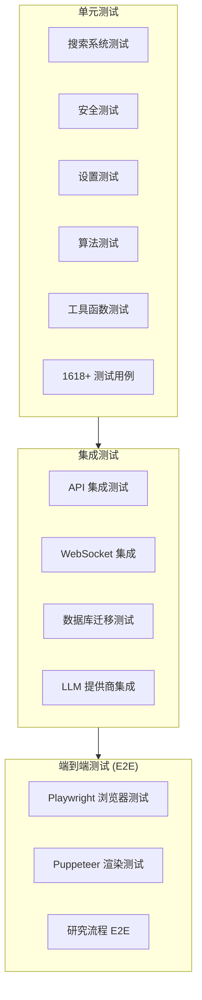
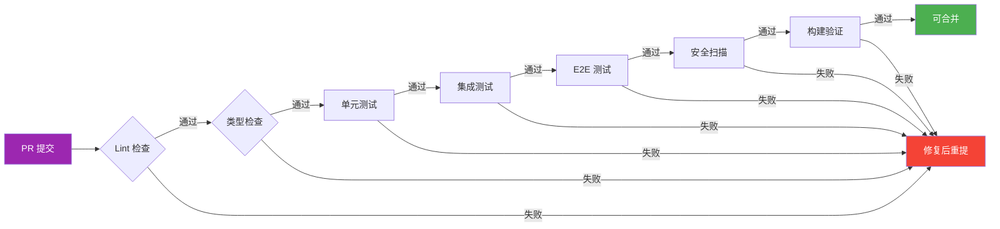
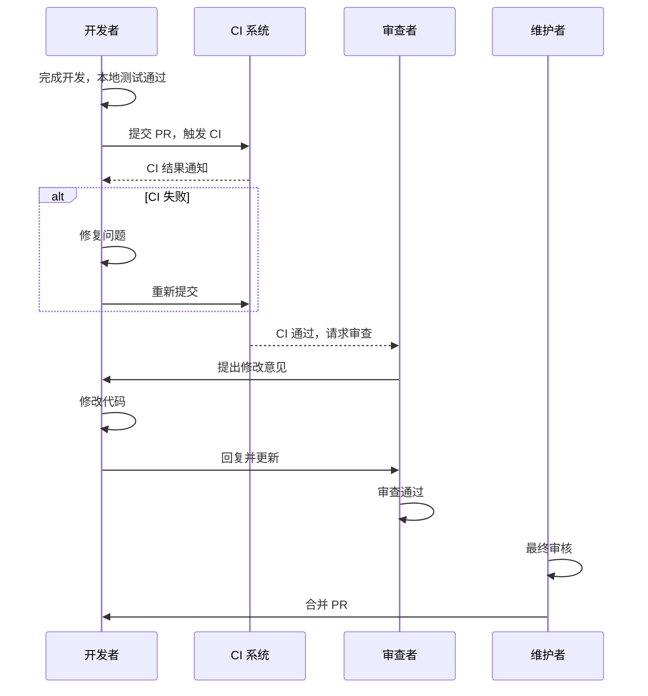

# 12. 开发者上手指南

> 本文档面向 Local Deep Research 项目的开发者，提供从零开始搭建开发环境、理解项目结构、运行调试、执行测试及贡献代码的完整指引。

---

## 目录

- [12.1 本地环境搭建](#121-本地环境搭建)
- [12.2 依赖安装与配置](#122-依赖安装与配置)
- [12.3 运行与调试](#123-运行与调试)
- [12.4 测试执行流程](#124-测试执行流程)
- [12.5 前端构建](#125-前端构建)
- [12.6 贡献代码流程](#126-贡献代码流程)

---

## 12.1 本地环境搭建

### 12.1.1 系统要求

在开始开发前，请确保开发机满足以下最低要求：

| 组件 | 最低版本 | 推荐版本 | 备注 |
|------|---------|---------|------|
| Python | 3.12 | 3.13 | 3.12-3.14 已验证兼容 |
| Node.js | 24.x LTS | 24.x LTS | 前端构建必需 |
| PDM | 2.20+ | 最新稳定版 | Python 包管理器 |
| Git | 2.40+ | 最新稳定版 | 版本控制 |
| 操作系统 | macOS / Linux / WSL2 | Ubuntu 24.04 | Windows 推荐 WSL2 |
| CPU | 支持 AVX2 指令集 | AVX-512 | FAISS 向量检索必需 |
| 内存 | 8 GB | 16 GB+ | 运行本地 LLM 建议 32GB |
| 磁盘 | 20 GB 可用 | 50 GB+ SSD | 含模型与索引数据 |

> **AVX 指令集说明**：FAISS CPU 版本依赖 AVX2 指令集加速向量运算。可通过以下命令验证：
> ```bash
> # macOS
> sysctl -a | grep machdep.cpu.brand_string
> # 或检查是否包含 avx2
> sysctl -a | grep cpu.features | grep AVX2
>
> # Linux
> grep avx2 /proc/cpuinfo
> ```

### 12.1.2 克隆仓库

```bash
# 克隆主仓库
git clone https://github.com/your-org/local-deep-research.git
cd local-deep-research

# 查看项目结构
ls -la
```

项目顶层目录结构如下：

```
local-deep-research/
├── src/                    # 主要源代码
│   └── local_deep_research/  # 主包
├── tests/                  # Python 测试（126 个子目录）
├── web/                    # 前端代码
├── benchmarks/             # 性能基准测试
├── docs/                   # 文档
├── changelog.d/            # 变更日志条目
├── pyproject.toml          # PDM 项目配置
├── package.json            # Node 依赖配置
├── playwright.config.js    # Playwright 配置
└── docker-compose.yml      # Docker 编排
```

### 12.1.3 安装 PDM

PDM（Python Development Master）是本项目的包管理和依赖管理工具。

```bash
# 方式一：通过 pipx 安装（推荐）
pipx install pdm

# 方式二：通过 pip 安装
pip install --user pdm

# 验证安装
pdm --version
```

> **注意**：请勿使用 `pip install` 直接安装项目依赖，所有依赖管理通过 PDM 进行。

### 12.1.4 安装 Python 依赖

```bash
# 创建虚拟环境并安装所有依赖（含开发依赖）
pdm install

# 仅安装生产依赖
pdm install --prod

# 安装指定分组依赖
pdm install -G test       # 测试依赖
pdm install -G dev        # 开发依赖
pdm install -G lint       # 代码检查依赖
pdm install -G docs       # 文档依赖
```

`pyproject.toml` 中定义的主要依赖分组：

```toml
[project]
dependencies = [
    "flask>=3.1.0",
    "flask-socketio>=5.3.0",
    "langgraph>=0.2.0",
    "sqlcipher3>=0.5.0",
    "faiss-cpu>=1.8.0",
    "loguru>=0.7.0",
    # ... 更多依赖
]

[tool.pdm.dev-dependencies]
test = ["pytest>=8.0", "pytest-asyncio", "playwright"]
dev = ["mypy", "ruff", "eslint"]
docs = ["mkdocs", "weasyprint"]
```

### 12.1.5 安装 Node 依赖

```bash
# 安装前端构建依赖
npm install

# 或使用 pnpm/yarn（如已配置）
pnpm install
```

前端依赖主要包括：

| 依赖包 | 用途 |
|--------|------|
| vite | 构建工具 |
| vitest | JS 测试框架 |
| eslint | JS 代码检查 |
| prettier | 代码格式化 |

### 12.1.6 安装 Playwright 浏览器

```bash
# 安装 Playwright 及其浏览器
npx playwright install --with-deps chromium firefox webkit

# 仅安装 Chromium
npx playwright install chromium
```

### 12.1.7 安装 pre-commit 钩子

```bash
# 安装 pre-commit
pdm run pre-commit install

# 手动运行所有钩子（首次推荐）
pdm run pre-commit run --all-files
```

配置的 pre-commit 钩子包括：

```yaml
# .pre-commit-config.yaml 核心钩子
repos:
  - repo: https://github.com/astral-sh/ruff-pre-commit
    hooks:
      - id: ruff          # Python 代码检查
      - id: ruff-format   # Python 代码格式化
  - repo: https://github.com/pre-commit/mirrors-mypy
    hooks:
      - id: mypy          # Python 类型检查
  - repo: https://github.com/pre-commit/mirrors-eslint
    hooks:
      - id: eslint        # JS 代码检查
  - repo: local
    hooks:
      - id: pytest-check  # 快速测试检查
```

---

## 12.2 依赖安装与配置

### 12.2.1 环境变量配置

项目通过环境变量进行配置，核心变量如下：

| 变量名 | 默认值 | 说明 |
|--------|--------|------|
| `LDR_DATA_DIR` | `~/.local-deep-research` | 数据存储根目录 |
| `LDR_WEB_HOST` | `127.0.0.1` | Web 服务绑定地址 |
| `LDR_WEB_PORT` | `5000` | Web 服务端口 |
| `LDR_DATABASE_URL` | `sqlite:///{DATA_DIR}/research.db` | 数据库连接字符串 |
| `LDR_LOG_LEVEL` | `INFO` | 日志级别 |
| `LDR_SECRET_KEY` | 自动生成 | Flask 密钥 |
| `LDR_LLM_PROVIDER` | `ollama` | 默认 LLM 提供商 |
| `LDR_SEARCH_ENGINES` | `searxng,wikipedia` | 启用的搜索引擎 |

```bash
# 创建环境配置
export LDR_DATA_DIR="$HOME/.local-deep-research"
export LDR_WEB_HOST="127.0.0.1"
export LDR_WEB_PORT="5000"
export LDR_LOG_LEVEL="DEBUG"

# 或使用 .env 文件
cp .env.example .env
# 编辑 .env 文件设置实际值
```

### 12.2.2 设置 Ollama 服务

Ollama 是本项目的默认本地 LLM 后端：

```bash
# 安装 Ollama（macOS）
brew install ollama

# 启动 Ollama 服务
ollama serve

# 拉取推荐模型
ollama pull llama3.2:latest        # 主对话模型
ollama pull nomic-embed-text       # 嵌入模型（向量检索）

# 验证模型可用
ollama list
```

配置 Ollama 连接：

```bash
export LDR_LLM_PROVIDER="ollama"
export LDR_LLM_MODEL="llama3.2:latest"
export LDR_OLLAMA_BASE_URL="http://localhost:11434"
```

### 12.2.3 设置 SearXNG 服务

SearXNG 是默认的搜索引擎后端，提供隐私保护的元搜索能力：

```bash
# 通过 Docker 启动 SearXNG
docker run -d \
  --name searxng \
  -p 8080:8080 \
  -v searxng:/etc/searxng \
  searxng/searxng:latest

# 配置 SearXNG 连接
export LDR_SEARXNG_URL="http://localhost:8080"
```

### 12.2.4 配置 LLM API 密钥

如需使用云端 LLM 提供商：

```bash
# OpenAI
export OPENAI_API_KEY="sk-..."

# Anthropic
export ANTHROPIC_API_KEY="sk-ant-..."

# Google Gemini
export GOOGLE_API_KEY="..."

# 设置默认提供商
export LDR_LLM_PROVIDER="openai"
export LDR_LLM_MODEL="gpt-4o"
```

支持的提供商完整列表（14+）：

| 提供商 | 环境变量 | 说明 |
|--------|---------|------|
| Ollama | `LDR_OLLAMA_BASE_URL` | 本地模型 |
| OpenAI | `OPENAI_API_KEY` | GPT 系列 |
| Anthropic | `ANTHROPIC_API_KEY` | Claude 系列 |
| Google | `GOOGLE_API_KEY` | Gemini 系列 |
| Azure OpenAI | `AZURE_OPENAI_KEY` | 企业版 OpenAI |
| Together | `TOGETHER_API_KEY` | 开源模型 API |
| Groq | `GROQ_API_KEY` | 高速推理 |
| ... | ... | 更多提供商 |

### 12.2.5 首次启动初始化

```bash
# 初始化数据库（首次运行自动执行）
python -m local_deep_research.web.app --init-db

# 验证配置
python -c "from local_deep_research.settings import Settings; print(Settings().validate())"

# 启动应用
python -m local_deep_research.web.app
```

启动成功后访问 `http://127.0.0.1:5000` 即可使用 Web 界面。

---

## 12.3 运行与调试

### 13.3.1 启动 Web 应用

```bash
# 基础启动
python -m local_deep_research.web.app

# 指定配置启动
LDR_LOG_LEVEL=DEBUG python -m local_deep_research.web.app

# 指定端口
LDR_WEB_PORT=8080 python -m local_deep_research.web.app

# 开发模式（热重载）
pdm run flask --app src/local_deep_research/web/app.py run --debug --reload
```

### 12.3.2 Docker Compose 启动

```bash
# 完整服务启动（含 SearXNG、Ollama）
docker-compose up -d

# 仅启动核心服务
docker-compose up -d app

# 查看日志
docker-compose logs -f app

# 停止服务
docker-compose down
```

`docker-compose.yml` 定义的服务：

```yaml
services:
  app:
    build: .
    ports:
      - "5000:5000"
    environment:
      - LDR_DATA_DIR=/data
    volumes:
      - ldr-data:/data

  searxng:
    image: searxng/searxng:latest
    ports:
      - "8080:8080"

  ollama:
    image: ollama/ollama:latest
    ports:
      - "11434:11434"
```

### 12.3.3 VS Code 调试配置

创建 `.vscode/launch.json`：

```json
{
  "version": "0.2.0",
  "configurations": [
    {
      "name": "LDR: Web App",
      "type": "debugpy",
      "request": "launch",
      "module": "local_deep_research.web.app",
      "justMyCode": false,
      "env": {
        "LDR_LOG_LEVEL": "DEBUG",
        "FLASK_ENV": "development"
      },
      "console": "integratedTerminal"
    },
    {
      "name": "LDR: Pytest Current File",
      "type": "debugpy",
      "request": "launch",
      "module": "pytest",
      "args": ["${file}", "-v", "--no-header"],
      "console": "integratedTerminal"
    }
  ]
}
```

### 12.3.4 日志查看

项目使用 `loguru` 作为日志框架：

```bash
# 控制台输出（默认）
LDR_LOG_LEVEL=DEBUG python -m local_deep_research.web.app

# 文件输出
export LDR_LOG_FILE="$LDR_DATA_DIR/logs/app.log"

# 结构化 JSON 日志
export LDR_LOG_FORMAT="json"

# 实时跟踪日志
tail -f ~/.local-deep-research/logs/app.log | jq '.'
```

日志级别配置：

| 级别 | 用途 |
|------|------|
| DEBUG | 详细调试信息（SQL 查询、API 调用） |
| INFO | 正常操作日志 |
| WARNING | 非预期但可恢复的情况 |
| ERROR | 操作失败 |
| CRITICAL | 系统级故障 |

### 12.3.5 热重载配置

```bash
# Flask 开发模式（后端热重载）
FLASK_ENV=development pdm run flask run --reload

# Vite 开发服务器（前端热重载，端口 5173）
npm run dev

# 同时启动（使用 concurrently）
pdm run dev  # 已配置 concurrently 启动前后端
```

---

## 12.4 测试执行流程

### 12.4.1 Python 测试（pytest）

本项目包含 **1618 个 Python 测试**，分布在 `tests/` 目录下的 **126 个子目录** 中。

```bash
# 运行全部测试
pdm run pytest

# 运行指定目录
pdm run pytest tests/search_engines/

# 运行指定测试文件
pdm run pytest tests/advanced_search_system/test_filter.py -v

# 运行指定测试函数
pdm run pytest tests/search_engines/test_searxng.py::test_search_basic -v

# 运行匹配关键字的测试
pdm run pytest -k "test_search" --no-header

# 带覆盖率报告
pdm run pytest --cov=local_deep_research --cov-report=html

# 并行执行（加速）
pdm run pytest -n auto

# 仅运行快速测试（跳过慢速测试）
pdm run pytest -m "not slow"
```

#### 测试金字塔



> **测试金字塔说明**：项目的测试体系遵循经典金字塔结构。底层单元测试数量最多（1618+），覆盖核心算法、工具函数、安全验证等；中层集成测试验证模块间协作，包括 API 端到端、WebSocket 实时通信、数据库迁移等场景；顶层 E2E 测试通过 Playwright 和 Puppeteer 模拟真实用户操作，验证完整的研究工作流。这种结构确保了测试覆盖率与执行效率的平衡。

#### 测试目录结构

```
tests/
├── advanced_search_system/    # 高级搜索系统测试
├── search_engines/            # 搜索引擎测试（30+ 引擎）
├── llm/                       # LLM 测试
├── llm_providers/             # LLM 提供商测试
├── security/                  # 安全测试
├── database/                  # 数据库测试
├── settings/                  # 设置测试
├── api/                       # API 测试
├── api_tests/                 # API 集成测试
├── websocket/                 # WebSocket 测试
├── migration/                 # 迁移测试
├── ...                        # 126 个子目录总计
└── conftest.py                # 全局 fixtures
```

#### Fixtures 和 conftest.py

```python
# tests/conftest.py 核心 fixtures
import pytest
from local_deep_research.factory import create_app

@pytest.fixture(scope="session")
def app():
    """创建测试用 Flask 应用"""
    app = create_app(testing=True)
    yield app

@pytest.fixture
def client(app):
    """Flask 测试客户端"""
    return app.test_client()

@pytest.fixture
def mock_llm():
    """模拟 LLM 响应"""
    return MockLLMProvider()

@pytest.fixture
def temp_database():
    """临时加密数据库"""
    with tempfile.NamedTemporaryFile(suffix=".db") as f:
        yield f.name
```

使用 fixtures 的示例：

```python
def test_search_with_mock_llm(client, mock_llm, temp_database):
    """使用 fixtures 的测试示例"""
    response = client.post("/api/search", json={
        "query": "Python async programming",
        "engines": ["mock"]
    })
    assert response.status_code == 200
    assert len(response.json["results"]) > 0
```

### 12.4.2 JS 测试（Vitest）

```bash
# 运行全部 JS 测试
npm test

# 运行指定测试文件
npm test -- tests/unit/search.test.js

# 监听模式
npm run test:watch

# 覆盖率报告
npm run test:coverage
```

JS 测试覆盖范围（397 个测试）：

| 测试类别 | 数量 | 位置 |
|---------|------|------|
| 组件测试 | 120 | `web/tests/unit/components/` |
| 工具函数测试 | 85 | `web/tests/unit/utils/` |
| 集成测试 | 110 | `web/tests/integration/` |
| E2E 测试 | 82 | `web/tests/e2e/` |

### 12.4.3 Playwright E2E 测试

```bash
# 运行 Playwright 测试
npx playwright test

# 指定浏览器
npx playwright test --project=chromium
npx playwright test --project=webkit

# 调试模式
npx playwright test --debug

# 生成报告
npx playwright show-report
```

`playwright.config.js` 关键配置：

```javascript
export default {
  testDir: './web/tests/e2e',
  timeout: 60000,
  use: {
    baseURL: 'http://127.0.0.1:5000',
    headless: true,
    screenshot: 'only-on-failure',
  },
  projects: [
    { name: 'chromium', use: { ...devices['Desktop Chrome'] } },
    { name: 'firefox', use: { ...devices['Desktop Firefox'] } },
    { name: 'webkit', use: { ...devices['Desktop Safari'] } },
    { name: 'mobile', use: { ...devices['iPhone 14'] } },
  ],
};
```

### 12.4.4 Puppeteer 测试

Puppeteer 主要用于 PDF 渲染和静态页面测试：

```bash
# 运行 Puppeteer 测试
node web/tests/puppeteer/pdf-render.test.js
node web/tests/puppeteer/search-flow.test.js
```

### 12.4.5 基准测试

```bash
# 运行全部基准测试
pdm run pytest benchmarks/ -v

# 运行特定基准测试
pdm run pytest benchmarks/test_search_accuracy.py

# 运行评估器
python -m local_deep_research.benchmarks.evaluator \
    --dataset SimpleQA \
    --model llama3.2 \
    --output results.json
```

---

## 12.5 前端构建

### 12.5.1 Vite 构建配置

`vite.config.js` 关键配置：

```javascript
import { defineConfig } from 'vite';
import { resolve } from 'path';

export default defineConfig({
  root: 'web',
  build: {
    outDir: '../src/local_deep_research/static',
    emptyOutDir: true,
    rollupOptions: {
      input: {
        main: resolve(__dirname, 'web/index.html'),
        settings: resolve(__dirname, 'web/settings.html'),
      },
    },
    sourcemap: true,
  },
  server: {
    port: 5173,
    proxy: {
      '/api': 'http://127.0.0.1:5000',
      '/socket.io': 'http://127.0.0.1:5000',
    },
  },
});
```

### 12.5.2 开发模式

```bash
# 启动 Vite 开发服务器
npm run dev

# 此时访问 http://localhost:5173
# API 请求自动代理到 Flask 后端（端口 5000）
```

### 12.5.3 生产构建

```bash
# 构建前端资源
npm run build

# 构建产物输出到 src/local_deep_research/static/
# Flask 自动从 static/ 目录提供静态文件
```

构建产物结构：

```
src/local_deep_research/static/
├── assets/
│   ├── index-XXXX.js      # 主应用 JS
│   ├── vendor-XXXX.js     # 第三方库
│   └── index-XXXX.css     # 样式
├── index.html
└── settings.html
```

### 12.5.4 CSS 架构

前端 CSS 代码规模为 **29 文件 / 约 23,000 行**，采用以下架构：

```
web/styles/
├── base/
│   ├── reset.css           # CSS Reset
│   ├── variables.css       # CSS 变量（主题）
│   └── typography.css      # 字体排版
├── components/
│   ├── search-bar.css
│   ├── result-card.css
│   ├── report-viewer.css
│   └── ...
├── layouts/
│   ├── grid.css
│   ├── sidebar.css
│   └── header.css
├── pages/
│   ├── home.css
│   ├── settings.css
│   └── report.css
└── themes/
    ├── light.css
    └── dark.css
```

CSS 设计原则：

1. **CSS 变量驱动主题**：通过 `:root` 和 `[data-theme="dark"]` 实现主题切换
2. **组件化组织**：每个组件对应独立的 CSS 文件
3. **BEM 命名约定**：`.search-bar__input--focused`
4. **响应式设计**：Mobile-first，断点 768px / 1024px

### 12.5.5 JS 架构

前端 JS 代码规模为 **70 文件 / 约 48,000 行**，采用原生 JavaScript 架构：

```
web/js/
├── core/
│   ├── app.js              # 应用入口
│   ├── router.js           # 路由管理
│   ├── state.js            # 状态管理
│   └── api.js              # API 客户端
├── components/
│   ├── search-bar.js
│   ├── result-list.js
│   ├── report-viewer.js
│   └── ...
├── services/
│   ├── search-service.js   # 搜索服务
│   ├── websocket-service.js # WebSocket 服务
│   └── llm-service.js      # LLM 交互服务
├── utils/
│   ├── dom.js
│   ├── format.js
│   ├── debounce.js
│   └── ...
└── workers/
    └── search-worker.js    # Web Worker
```

---

## 12.6 贡献代码流程

### 12.6.1 Fork 仓库

1. 访问 GitHub 仓库页面，点击 Fork 按钮
2. 克隆 Fork 后的仓库到本地：
   ```bash
   git clone https://github.com/YOUR_USERNAME/local-deep-research.git
   cd local-deep-research
   git remote add upstream https://github.com/original-org/local-deep-research.git
   ```

### 12.6.2 创建功能分支

```bash
# 同步主分支
git checkout main
git pull upstream main

# 创建功能分支（命名规范：feature/xxx, fix/xxx, docs/xxx）
git checkout -b feature/add-arxiv-search-engine

# 开发过程中保持与主分支同步
git fetch upstream
git rebase upstream/main
```

分支命名规范：

| 前缀 | 用途 | 示例 |
|------|------|------|
| `feature/` | 新功能 | `feature/parallel-search` |
| `fix/` | 修复 bug | `fix/sqlcipher-encoding` |
| `docs/` | 文档更新 | `docs/api-reference` |
| `refactor/` | 重构 | `refactor/llm-provider` |
| `test/` | 测试改进 | `test/coverage-improvement` |

### 12.6.3 代码规范

项目配置了严格的 pre-commit 钩子，提交前自动检查：

```bash
# 手动运行所有检查
pdm run pre-commit run --all-files
```

检查工具清单：

| 工具 | 用途 | 配置文件 |
|------|------|---------|
| ruff | Python 代码检查与格式化 | `pyproject.toml` |
| mypy | Python 类型检查 | `pyproject.toml` |
| eslint | JS 代码检查 | `.eslintrc.json` |
| prettier | 代码格式化 | `.prettierrc` |
| pytest | 快速测试检查 | `pyproject.toml` |

Ruff 配置示例：

```toml
[tool.ruff]
line-length = 100
target-version = "py312"

[tool.ruff.lint]
select = ["E", "F", "I", "N", "W", "UP", "B", "SIM"]
ignore = ["E501"]
```

### 12.6.4 提交 PR

```bash
# 提交代码（遵循 Conventional Commits 规范）
git add .
git commit -m "feat(search): add arXiv academic search engine

- Implement ArxivSearchEngine base class
- Add paper metadata parsing
- Add tests for search and fetch
- Update documentation

Refs: #1234"

# 推送到 Fork
git push origin feature/add-arxiv-search-engine

# 在 GitHub 上创建 Pull Request
```

提交信息规范：

```
<type>(<scope>): <subject>

<body>

<footer>
```

Type 类型：`feat`, `fix`, `docs`, `style`, `refactor`, `perf`, `test`, `chore`

### 12.6.5 CI 检查清单

PR 提交后会自动触发 CI 流程，全部通过才可合并：



> **CI 流程说明**：每个 PR 必须经过完整的 CI 流水线验证。首先是代码风格检查（ruff、eslint），确保代码符合项目规范；接着是静态类型检查（mypy），捕获类型错误；然后是三层测试验证——单元测试（pytest）、集成测试、E2E 测试（Playwright）；之后是安全扫描（SSRF 验证、依赖检查）；最后是构建验证（前端 Vite 构建、Docker 镜像构建）。任何环节失败都需要修复后重新提交，只有全部通过才允许合并到主分支。

CI 检查项详细说明：

| 检查项 | 工具 | 预计耗时 | 说明 |
|--------|------|---------|------|
| Lint | ruff + eslint | ~30s | 代码风格与错误检查 |
| Type Check | mypy | ~60s | Python 类型检查 |
| Unit Tests | pytest | ~5min | 1618 个单元测试 |
| Integration Tests | pytest | ~3min | API/DB/WebSocket 集成测试 |
| E2E Tests | Playwright | ~8min | 浏览器自动化测试 |
| Security Scan | bandit + safety | ~2min | 安全漏洞扫描 |
| Build | Vite + Docker | ~3min | 构建产物验证 |

### 12.6.6 代码审查流程



> **审查流程说明**：代码审查采用两级审查机制。开发者提交 PR 后，CI 系统首先进行自动化验证，只有全部通过才进入人工审查阶段。第一位审查者是社区贡献者，负责代码风格、逻辑正确性、测试覆盖等方面的审查。审查意见通过 GitHub Review 功能提出，开发者需逐条回复并修改。第一位审查者通过后，由项目维护者进行最终审核，确认符合项目方向和质量标准后合并。整个过程强调建设性反馈和知识共享。

### 12.6.7 变更日志

变更日志通过 `changelog.d/` 目录管理，当前已有 **51 个变更条目**。

每次提交 PR 需要添加变更条目：

```bash
# 创建变更条目文件（命名：PR编号.类型.md）
echo "## Added
- 新增 arXiv 学术搜索引擎支持
- 支持论文元数据解析（标题、作者、摘要）
- 新增搜索过滤器：发表年份、学科分类" \
> changelog.d/1234.added.md
```

文件命名规范：

| 后缀 | 类型 | 说明 |
|------|------|------|
| `.added.md` | 新增功能 | 新特性、新引擎 |
| `.changed.md` | 变更 | 行为变更、API 变更 |
| `.fixed.md` | 修复 | Bug 修复 |
| `.deprecated.md` | 弃用 | 即将移除的功能 |
| `.removed.md` | 移除 | 已移除的功能 |
| `.security.md` | 安全 | 安全相关修复 |

发布新版本时，`towncrier` 工具会自动汇总 `changelog.d/` 中的条目生成正式 `CHANGELOG.md`。

---

## 附录：常用命令速查

```bash
# === 环境搭建 ===
pdm install              # 安装 Python 依赖
npm install              # 安装 Node 依赖
npx playwright install   # 安装浏览器
pdm run pre-commit install  # 安装钩子

# === 开发运行 ===
python -m local_deep_research.web.app  # 启动应用
npm run dev              # 前端开发服务器
docker-compose up -d    # Docker 启动

# === 测试 ===
pdm run pytest           # 全部 Python 测试
pdm run pytest tests/ -k "search"  # 指定测试
npm test                 # JS 测试
npx playwright test      # E2E 测试

# === 代码质量 ===
pdm run pre-commit run --all-files  # 全部检查
pdm run ruff check .     # Python 检查
pdm run mypy src/        # 类型检查

# === 构建 ===
npm run build            # 前端构建
pdm run mkdocs build     # 文档构建

---

# ❤️ 制作不易，请我喝咖啡☕️关注我➕

