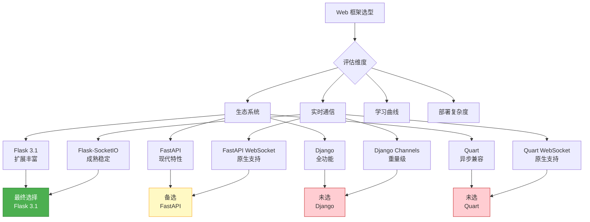
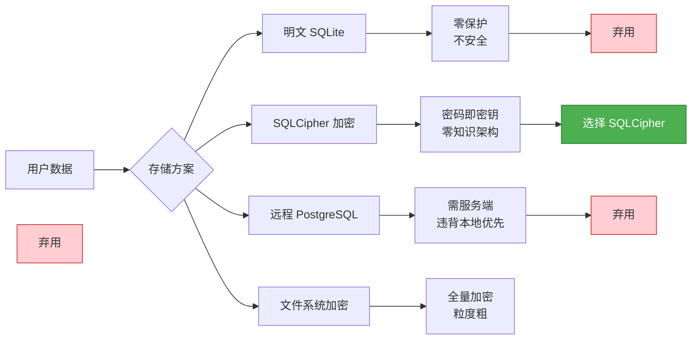
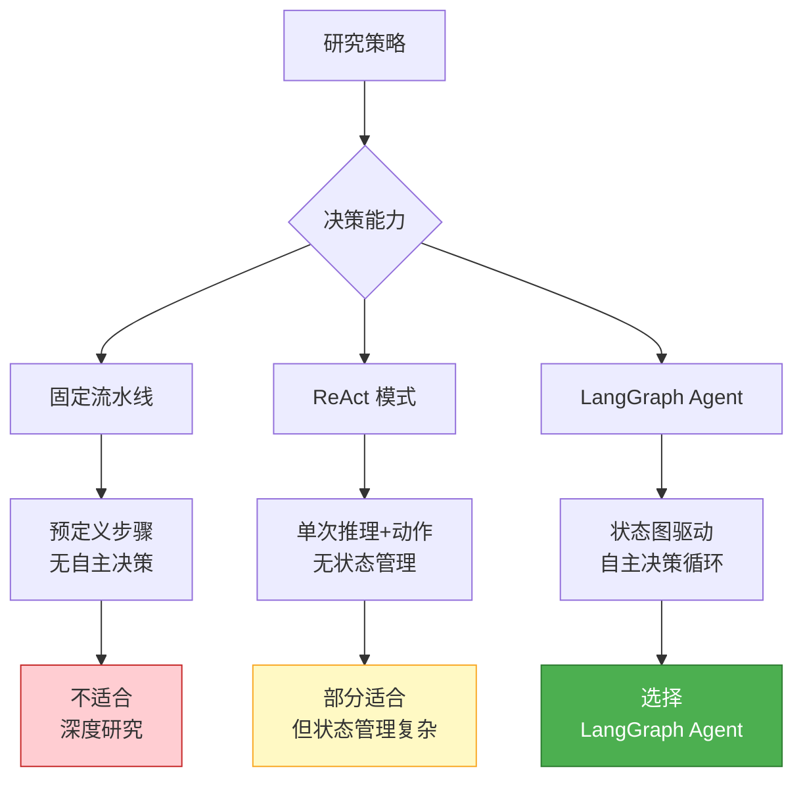
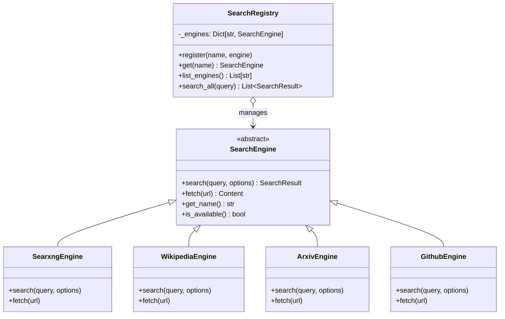
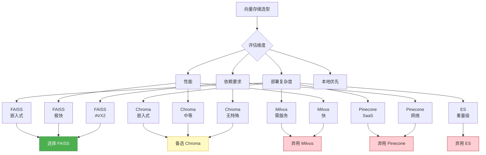
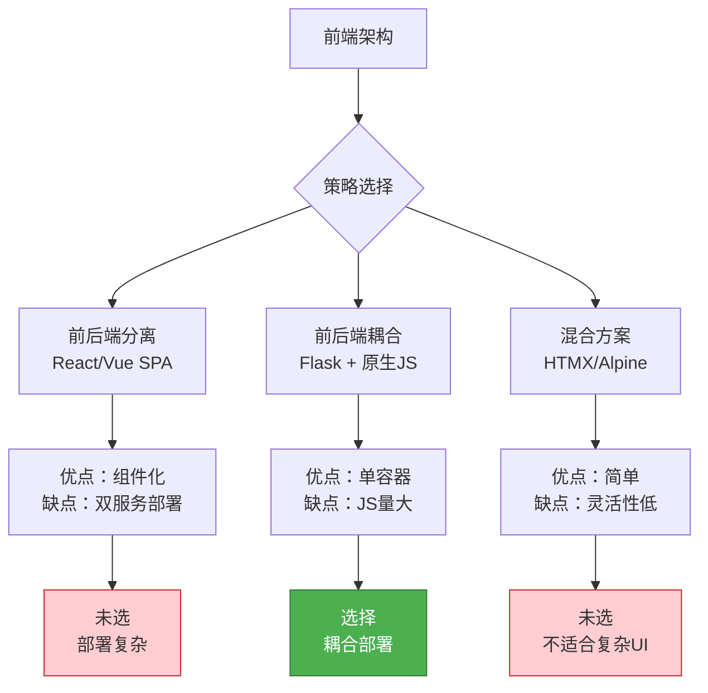
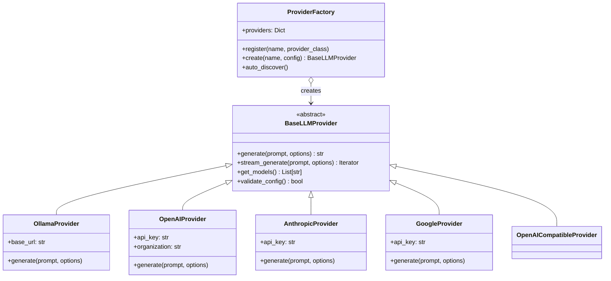
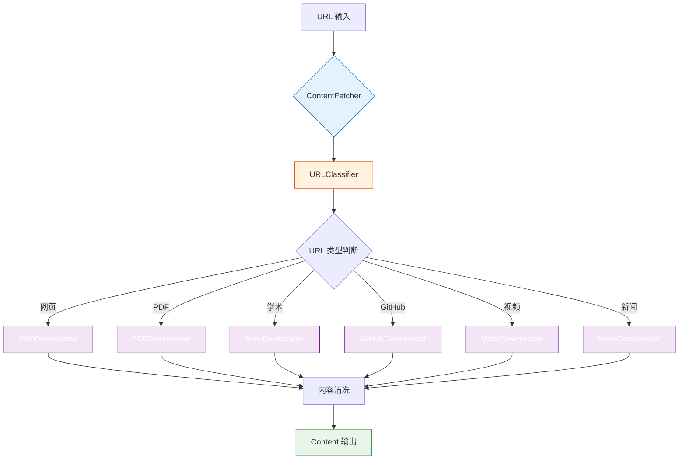

# 13. 架构决策记录（ADR）

> 本文档记录了 Local Deep Research 项目中的关键架构决策。每个 ADR 描述了决策背景、最终选择、权衡取舍以及替代方案评估。

---

## 目录

- [ADR-001: 选择 Flask 而非 FastAPI](#adr-001-选择-flask-而非-fastapi)
- [ADR-002: 使用 SQLCipher 加密数据库](#adr-002-使用-sqlcipher-加密数据库)
- [ADR-003: 采用 LangGraph Agent 策略](#adr-003-采用-langgraph-agent-策略)
- [ADR-004: 多搜索引擎插件架构](#adr-004-多搜索引擎插件架构)
- [ADR-005: 选择 FAISS 向量存储](#adr-005-选择-faiss-向量存储)
- [ADR-006: 前后端耦合部署](#adr-006-前后端耦合部署)
- [ADR-007: 多 LLM 提供商抽象](#adr-007-多-llm-提供商抽象)
- [ADR-008: 内容提取链设计](#adr-008-内容提取链设计)

---

## ADR-001: 选择 Flask 而非 FastAPI

### 状态

**已接受** — 2024-01

### 背景

项目初期需要选择一个 Python Web 框架作为后端基础。候选方案包括 Flask 3.1、FastAPI 0.110+、Django 5.x 和 Quart 0.19+。



> **框架选型说明**：选型过程从四个维度评估各框架。在生态系统方面，Flask 拥有最成熟的扩展生态（Flask-Login、Flask-SocketIO、Flask-SQLAlchemy 等），能显著加速开发；在实时通信方面，Flask-SocketIO 经过多年生产验证，支持自动降级（WebSocket → 长轮询），这对研究进度推送至关重要；在学习曲线方面，Flask 简洁直观，社区贡献者上手快；在部署复杂度方面，Flask 单文件应用即可启动，无需 ASGI 服务器。FastAPI 作为备选方案，在自动文档生成和类型验证方面有优势，但其异步模型与部分同步依赖（如 SQLCipher）集成存在摩擦。

### 决策

选择 **Flask 3.1** 作为 Web 框架，配合 **Flask-SocketIO 5.3+** 提供实时通信能力。

### 理由

1. **生态系统成熟度**：Flask 拥有超过 500 个官方扩展，覆盖认证、数据库、缓存等常见需求
2. **实时通信支持**：Flask-SocketIO 提供成熟的 WebSocket 支持，自动降级机制确保在不支持 WebSocket 的环境下也能工作
3. **团队熟悉度**：核心团队有丰富的 Flask 开发经验，可快速迭代
4. **扩展丰富**：Flask-Login（认证）、Flask-Migrate（数据库迁移）、Flask-Limiter（限流）等开箱即用
5. **模板引擎**：Jinja2 模板引擎与 Flask 深度集成，适合服务端渲染的耦合架构

### 后果

| 影响面 | 正面 | 负面 |
|--------|------|------|
| 并发处理 | — | 同步框架，高并发需配合 Gunicorn + gevent |
| 实时通信 | Flask-SocketIO 成熟稳定 | 额外依赖，增加部署复杂度 |
| API 文档 | — | 无自动 OpenAPI 文档，需手动维护 |
| 类型安全 | — | 无 Pydantic 集成，需手动验证 |
| 开发速度 | 简洁直观，快速原型 | — |

### 替代方案

| 方案 | 优势 | 劣势 | 未选原因 |
|------|------|------|---------|
| FastAPI | 自动文档、类型验证、异步原生 | 同步依赖集成摩擦、WebSocket 降级支持有限 | 与 SQLCipher 等同步库集成复杂 |
| Django | 全功能、ORM、Admin | 重量级、灵活性低 | 项目不需要 Django 的全功能集 |
| Quart | Flask API + 异步支持 | 生态系统较小、社区贡献者少 | 扩展兼容性问题 |

### 相关代码

```python
# src/local_deep_research/web/app.py
from flask import Flask
from flask_socketio import SocketIO

def create_app():
    app = Flask(__name__)
    socketio = SocketIO(app, cors_allowed_origins="*")

    # 注册蓝图
    from .views import main_bp
    app.register_blueprint(main_bp)

    # 注册 WebSocket 事件
    from .events import register_socket_events
    register_socket_events(socketio)

    return app
```

---

## ADR-002: 使用 SQLCipher 加密数据库

### 状态

**已接受** — 2024-01

### 背景

Local Deep Research 是本地优先（Local-First）应用，所有研究数据（搜索历史、研究报告、用户偏好）存储在用户本地。为保护数据隐私，需要对本地数据库进行加密。



> **加密方案说明**：本地数据存储的隐私保护是项目的核心需求。评估了四种方案：明文 SQLite 完全无保护，不符合隐私要求；远程 PostgreSQL 违背了本地优先的设计原则，且需要维护服务端基础设施；文件系统加密（如 LUKS/FileVault）是全量加密粒度太粗，无法实现按用户隔离。SQLCipher 提供了最佳平衡——基于页面的 AES-256 加密，密码即密钥（系统不存储密码），实现零知识架构。每个用户拥有独立的加密数据库文件，即使攻击者获取了数据库文件，没有用户密码也无法解密。

### 决策

选择 **SQLCipher** 作为数据库加密方案，每个用户拥有独立的加密数据库文件。

### 理由

1. **密码即密钥**：用户密码直接派生为加密密钥，系统不存储任何密钥信息（零知识架构）
2. **本地优先**：完全本地存储，无服务端依赖，符合项目定位
3. **粒度合适**：数据库级别加密，可灵活实现多用户隔离
4. **成熟稳定**：SQLCipher 是成熟的加密 SQLite 实现，被 Signal、WhatsApp 等应用使用
5. **SQL 兼容**：完全兼容 SQLite SQL 语法，无需修改查询代码

### 后果

| 影响面 | 说明 |
|--------|------|
| 认证即解密 | 用户登录验证本质是尝试解密数据库，密码错误即解密失败 |
| 性能开销 | 加密/解密增加约 5-15% 的 I/O 开销 |
| 备份复杂性 | 备份文件也是加密的，恢复时需原始密码 |
| 密钥轮换 | 修改密码需要重新加密整个数据库 |
| 全文搜索 | FTS5 索引也加密，搜索性能略有下降 |

### 替代方案

| 方案 | 优势 | 劣势 | 未选原因 |
|------|------|------|---------|
| 标准 SQLite | 零开销、最简单 | 无加密，数据完全暴露 | 不满足隐私需求 |
| PostgreSQL | 功能强大、并发好 | 需服务端、重量级 | 违背本地优先原则 |
| 文件系统加密 | 透明、应用层无感 | 粒度粗、单用户场景过度 | 无法实现多用户隔离 |
| SQLCipher + 密钥文件 | 密钥管理灵活 | 密钥文件存储问题 | 增加攻击面 |

### 相关代码

```python
# src/local_deep_research/database/encrypted_db.py
from sqlcipher3 import dbapi2 as sqlcipher

class EncryptedDatabase:
    """SQLCipher 加密数据库连接管理"""

    def __init__(self, db_path: str, password: str):
        self.db_path = db_path
        self.password = password
        self.conn = None

    def connect(self):
        """建立加密连接（密码错误则抛出异常）"""
        self.conn = sqlcipher.connect(self.db_path)
        self.conn.execute(f"PRAGMA key = '{self.password}'")
        # 验证密钥正确性
        self.conn.execute("SELECT count(*) FROM sqlite_master")
        return self.conn

    def verify_password(self, password: str) -> bool:
        """验证密码（本质是尝试解密）"""
        try:
            test_conn = sqlcipher.connect(self.db_path)
            test_conn.execute(f"PRAGMA key = '{password}'")
            test_conn.execute("SELECT count(*) FROM sqlite_master")
            test_conn.close()
            return True
        except sqlcipher.DatabaseError:
            return False
```

---

## ADR-003: 采用 LangGraph Agent 策略

### 状态

**已接受** — 2024-03

### 背景

深度研究功能需要 AI 自主决策搜索策略——根据研究问题动态选择搜索引擎、调整搜索关键词、判断信息充分性并决定是否继续搜索。这要求研究系统具备自主决策能力，而非固定流水线。



> **策略选型说明**：深度研究场景对 AI 的自主决策能力有较高要求。固定流水线（预定义搜索→过滤→总结步骤）实现简单但缺乏灵活性，无法根据中间结果调整策略。ReAct 模式（推理+动作交替）提供了基本的决策能力，但状态管理需要自行实现，复杂研究流程中容易出错。LangGraph 提供了基于状态图的 Agent 框架，天然支持条件分支、循环、并行等控制流，且状态管理由框架负责。其核心优势在于：LLM 可以自主决定下一步动作（搜索/总结/询问），支持动态引擎选择，以及并行子代理执行多个搜索任务。这些特性完美匹配深度研究的需求。

### 决策

选择 **LangGraph** 作为 Agent 框架，实现自主决策的深度研究策略（AgentStrategy）作为默认模式。

### 理由

1. **自主决策**：LLM 根据中间研究状态自主决定下一步动作（搜索、总结、深入挖掘）
2. **状态管理**：LangGraph 自动管理 Agent 状态，无需手动实现状态机
3. **条件分支**：支持基于条件的研究路径分支（如信息不足时继续搜索，充分时生成报告）
4. **并行执行**：支持子代理并行搜索多个来源
5. **可观测性**：LangSmith 集成提供完整的 Agent 执行追踪

### 后果

| 影响面 | 说明 |
|--------|------|
| 复杂度 | Agent 循环和状态图显著增加代码复杂度 |
| 调试困难 | LLM 决策路径非确定性，问题复现困难 |
| Token 消耗 | 多轮决策消耗大量 API token |
| 延迟 | 多轮推理增加端到端延迟 |
| 灵活性 | 可适应各种研究主题，无需预定义流程 |

### 替代方案

| 方案 | 优势 | 劣势 | 未选原因 |
|------|------|------|---------|
| 固定流水线 | 简单、可预测、低 token | 无自主决策、适应性差 | 无法处理复杂研究主题 |
| ReAct 模式 | 简单 Agent 模式 | 状态管理需自行实现 | 状态管理复杂度高 |
| AutoGPT 风格 | 完全自主 | 不可控、token 消耗大 | 缺乏可控性 |
| 手动编排 | 完全可控 | 开发量大、扩展性差 | 维护成本高 |

### 相关代码

```python
# src/local_deep_research/strategies/agent_strategy.py
from langgraph.graph import StateGraph

class ResearchState(TypedDict):
    query: str
    search_results: list
    findings: list
    report: str
    iteration: int
    sufficient: bool

class AgentStrategy:
    """LangGraph Agent 研究策略"""

    def build_graph(self) -> StateGraph:
        graph = StateGraph(ResearchState)

        # 添加节点
        graph.add_node("search", self.search_node)
        graph.add_node("analyze", self.analyze_node)
        graph.add_node("summarize", self.summarize_node)

        # 添加条件边
        graph.add_conditional_edges(
            "analyze",
            self.should_continue,
            {
                "search": "search",      # 信息不足，继续搜索
                "summarize": "summarize", # 信息充分，生成报告
            }
        )

        graph.set_entry_point("search")
        return graph.compile()
```

---

## ADR-004: 多搜索引擎插件架构

### 状态

**已接受** — 2024-02

### 背景

项目需要支持多种搜索源（通用搜索、学术搜索、新闻搜索、代码搜索等），目前已有 30+ 搜索引擎。需要设计一个可扩展的架构，使新增搜索引擎无需修改核心代码。

### 决策

采用 **注册表模式 + 基类抽象** 的插件架构。



> **插件架构说明**：搜索引擎插件架构的核心是 SearchEngine 抽象基类和 SearchRegistry 注册表。所有搜索引擎继承 SearchEngine 基类，实现 search() 和 fetch() 两个核心方法。SearchRegistry 负责引擎的注册、发现和管理。运行时，系统通过注册表获取可用引擎列表，用户选择或系统自动匹配合适的引擎执行搜索。这种设计的优势在于：新增引擎只需实现基类并注册，无需修改现有代码；引擎间完全隔离，一个引擎的故障不影响其他引擎；支持运行时动态启用/禁用引擎。目前已支持 30+ 搜索引擎，涵盖通用搜索、学术搜索、新闻、代码、专利等多个领域。

### 理由

1. **可插拔**：30+ 搜索引擎可独立启用/禁用
2. **统一接口**：所有引擎对外暴露一致的 search/fetch 接口
3. **运行时注册**：支持动态发现和注册引擎，无需重启服务
4. **隔离性**：引擎间互不依赖，单点故障不影响全局
5. **可测试**：每个引擎可独立测试

### 后果

| 影响面 | 说明 |
|--------|------|
| 维护成本 | 注册表需管理引擎生命周期和依赖关系 |
| 结果差异 | 不同引擎返回的结果格式和质量差异大 |
| 配置复杂度 | 每个引擎可能有独立的配置需求 |
| 测试矩阵 | 引擎数量多导致测试矩阵膨胀 |

### 替代方案

| 方案 | 优势 | 劣势 | 未选原因 |
|------|------|------|---------|
| 硬编码 | 最简单 | 每加一个引擎改核心代码 | 不可扩展 |
| 配置文件驱动 | 配置灵活 | 复杂逻辑无法仅靠配置表达 | 表达能力不足 |
| 微服务架构 | 完全隔离 | 运维复杂 | 本地应用过度设计 |

### 相关代码

```python
# src/local_deep_research/search_engines/base.py
from abc import ABC, abstractmethod

class SearchEngine(ABC):
    """搜索引擎基类"""

    @abstractmethod
    def search(self, query: str, options: dict) -> SearchResult:
        """执行搜索"""
        ...

    @abstractmethod
    def fetch(self, url: str) -> Content:
        """获取完整内容"""
        ...

    @property
    @abstractmethod
    def name(self) -> str:
        """引擎名称标识"""
        ...

    def is_available(self) -> bool:
        """检查引擎是否可用（网络、配置等）"""
        return True


# src/local_deep_research/search_engines/registry.py
class SearchRegistry:
    """搜索引擎注册表"""

    _engines: dict[str, SearchEngine] = {}

    @classmethod
    def register(cls, name: str, engine: SearchEngine):
        cls._engines[name] = engine

    @classmethod
    def get(cls, name: str) -> SearchEngine:
        if name not in cls._engines:
            raise EngineNotFoundError(f"引擎 {name} 未注册")
        return cls._engines[name]

    @classmethod
    def search_all(cls, query: str) -> list[SearchResult]:
        """并行搜索所有可用引擎"""
        results = []
        for engine in cls._engines.values():
            if engine.is_available():
                results.append(engine.search(query))
        return results


# 注册示例
SearchRegistry.register("searxng", SearxngEngine())
SearchRegistry.register("wikipedia", WikipediaEngine())
SearchRegistry.register("arxiv", ArxivEngine())
```

---

## ADR-005: 选择 FAISS 向量存储

### 状态

**已接受** — 2024-01

### 背景

RAG（检索增强生成）功能需要对本地文档进行向量相似度搜索。候选方案包括 FAISS、Chroma、Milvus、Pinecone、Elasticsearch 等。



> **向量存储选型说明**：向量存储的选型需综合考虑部署复杂度、性能、硬件依赖和本地优先原则。FAISS 是 Meta 开源的向量相似度搜索库，以嵌入式库的形式运行（无需额外服务），支持 CPU 和 GPU 加速，在百万级向量规模下仍保持毫秒级查询延迟。Chroma 也是嵌入式方案，但性能略逊于 FAISS。Milvus 是分布式向量数据库，适合大规模生产部署，但需要独立的服务进程，对于本地应用来说过于重量级。Pinecone 是 SaaS 服务，违背本地优先原则。Elasticsearch 虽然支持向量搜索，但其主要设计目的是全文搜索，向量搜索是附加功能，且部署和维护成本高昂。FAISS 的 AVX2 依赖在 2024 年的 CPU 上已基本普及，不构成实际限制。

### 决策

选择 **FAISS-CPU** 作为向量存储后端，通过 `faiss-cpu` Python 包集成。

### 理由

1. **零服务依赖**：嵌入式库，无需启动额外服务
2. **极致性能**：Meta 优化的 C++ 实现，支持 SIMD 加速
3. **本地优先**：数据完全本地存储，无网络依赖
4. **成熟稳定**：被 Meta、Pinterest 等大规模生产使用
5. **丰富索引**：支持 Flat、IVF、HNSW、PQ 等多种索引类型

### 后果

| 影响面 | 说明 |
|--------|------|
| 单机限制 | 不支持分布式，向量数量受单机内存限制 |
| AVX2 依赖 | 需要 CPU 支持 AVX2 指令集 |
| 持久化 | 需自行实现索引的磁盘持久化 |
| 无过滤 | 纯向量搜索，无元数据过滤能力（需自行实现） |

### 替代方案

| 方案 | 优势 | 劣势 | 未选原因 |
|------|------|------|---------|
| Chroma | 内置持久化、元数据过滤 | 性能略低、额外依赖 | 功能超出需求 |
| Milvus | 分布式、大规模 | 需独立服务、运维复杂 | 本地应用过度设计 |
| Pinecone | 全托管、零运维 | SaaS、违背本地优先 | 违背本地优先 |
| Elasticsearch | 全文+向量混合 | 重量级、资源消耗大 | 资源开销大 |
| pgvector | PostgreSQL 扩展 | 依赖 PostgreSQL | 项目使用 SQLite |

### 相关代码

```python
# src/local_deep_research/vector_store/faiss_index.py
import faiss
import numpy as np

class VectorIndex:
    """FAISS 向量索引封装"""

    def __init__(self, dimension: int, index_type: str = "flat"):
        self.dimension = dimension
        if index_type == "flat":
            # 精确搜索，适合 <100K 向量
            self.index = faiss.IndexFlatIP(dimension)  # 内积相似度
        elif index_type == "ivf":
            # 倒排索引，适合 >100K 向量
            quantizer = faiss.IndexFlatIP(dimension)
            self.index = faiss.IndexIVFFlat(quantizer, dimension, 100)
        elif index_type == "hnsw":
            # HNSW 图索引，高速近似搜索
            self.index = faiss.IndexHNSWFlat(dimension, 32)

    def add_vectors(self, vectors: np.ndarray, ids: list[int]):
        """添加向量到索引"""
        if not self.index.is_trained:
            self.index.train(vectors)
        self.index.add_with_ids(vectors, np.array(ids))

    def search(self, query: np.ndarray, k: int = 10):
        """搜索最相似的 k 个向量"""
        scores, indices = self.index.search(query.reshape(1, -1), k)
        return scores[0], indices[0]

    def save(self, path: str):
        """持久化索引到磁盘"""
        faiss.write_index(self.index, path)

    def load(self, path: str):
        """从磁盘加载索引"""
        self.index = faiss.read_index(path)
```

---

## ADR-006: 前后端耦合部署

### 状态

**已接受** — 2024-01（持续评估中）

### 背景

项目需要决定前端架构策略：是采用前后端分离（React/Vue SPA + REST API）还是前后端耦合（Flask 模板 + 原生 JS）。



> **前端架构说明**：前后端架构的选择需权衡部署复杂度、开发效率和用户体验。前后端分离方案（React/Vue SPA）提供最好的开发体验和组件化能力，但需要独立的前端构建和部署流程，以及处理 CORS、认证共享等问题。对于 Local Deep Research 这类本地优先应用，用户期望一键启动即可使用，分离部署会增加用户的部署负担。前后端耦合方案（Flask 模板 + 原生 JS）虽然前端代码量较大（48K 行 JS），但部署简单——只需运行一个 Python 进程，前端资源由 Flask 直接提供。混合方案（HTMX/Alpine）适合简单 UI，但本项目的研究报告渲染、实时进度展示等交互较为复杂，纯服务器渲染方案不够灵活。

### 决策

采用 **Flask 模板 + 原生 JavaScript** 的耦合部署方案。

### 理由

1. **单容器部署**：一个 Python 进程即可运行全部服务
2. **无 CORS**：前后端同源，无需处理跨域问题
3. **共享会话**：Flask Session 直接用于前端状态
4. **构建简单**：Vite 构建后输出静态文件，Flask 直接托管
5. **离线可用**：所有资源本地加载，无 CDN 依赖

### 后果

| 影响面 | 说明 |
|--------|------|
| 前端升级困难 | 迁移到 React/Vue 需要大规模重写 |
| JS 代码量大 | 48K 行原生 JS，维护成本较高 |
| 组件复用困难 | 无组件系统，UI 复用依赖模板包含 |
| 部署简单 | 单进程启动，Docker 镜像体积小 |
| 首屏加载 | 模板渲染首屏快，后续交互由 JS 处理 |

### 替代方案

| 方案 | 优势 | 劣势 | 未选原因 |
|------|------|------|---------|
| React SPA | 组件化、生态丰富 | 双服务、CORS、构建复杂 | 部署复杂度高 |
| Vue SPA | 轻量、渐进式 | 双服务、CORS | 同上 |
| HTMX | 服务器渲染、简单 | 交互复杂时受限 | 交互复杂度超出能力 |
| Streamlit | 极简 | 定制化差 | 无法满足定制 UI 需求 |

### 相关代码

项目结构体现耦合架构：

```
src/local_deep_research/
├── web/
│   ├── app.py              # Flask 应用
│   ├── templates/          # Jinja2 模板
│   │   ├── base.html       # 基础布局
│   │   ├── index.html      # 主页
│   │   └── report.html     # 报告页
│   └── static/             # Vite 构建产物
│       ├── assets/         # JS/CSS 资源
│       └── index.html      # SPA 入口
```

---

## ADR-007: 多 LLM 提供商抽象

### 状态

**已接受** — 2024-02

### 背景

为避免供应商锁定并给用户最大灵活性，项目需要支持多种 LLM 提供商（Ollama、OpenAI、Anthropic、Google 等 14+ 提供商）。

### 决策

设计 **BaseLLMProvider 抽象基类** + 自动发现机制，统一所有 LLM 提供商的调用接口。



> **提供商抽象说明**：多 LLM 提供商支持的核心挑战在于统一不同 API 的差异。BaseLLMProvider 定义了所有提供商必须实现的接口：generate() 用于同步生成，stream_generate() 用于流式输出，get_models() 获取可用模型列表，validate_config() 验证配置有效性。对于兼容 OpenAI API 的提供商（如 Together、Groq、Perplexity 等），通过 OpenAICompatibleProvider 基类复用大部分实现。ProviderFactory 负责提供商的注册和创建，auto_discover() 方法扫描已安装的包自动发现可用的提供商。这种设计使得添加新提供商只需实现一个类并注册，无需修改调用方代码。

### 理由

1. **避免锁定**：用户可随时切换 LLM 提供商，无需修改代码
2. **统一接口**：所有提供商对外暴露一致的调用方式
3. **OpenAI 兼容**：兼容 OpenAI API 的提供商可快速接入
4. **本地/云端**：同时支持本地模型（Ollama）和云端 API
5. **自动发现**：新提供商安装后自动注册

### 后果

| 影响面 | 说明 |
|--------|------|
| 行为差异 | 不同提供商的输出格式、token 计算方式有差异 |
| 错误处理 | 各提供商错误码和重试策略不同 |
| 测试复杂 | 每个提供商需要独立测试 |
| 配置管理 | 多提供商的配置管理复杂度增加 |

### 替代方案

| 方案 | 优势 | 劣势 | 未选原因 |
|------|------|------|---------|
| 仅支持 OpenAI | 最简单 | 供应商锁定 | 违背灵活性目标 |
| 硬编码提供商 | 控制力强 | 扩展需改代码 | 不可扩展 |
| LangChain 抽象 | 现成方案 | 过度抽象、版本耦合 | 控制权不足 |

### 相关代码

```python
# src/local_deep_research/llm/base.py
from abc import ABC, abstractmethod

class BaseLLMProvider(ABC):
    """LLM 提供商抽象基类"""

    @abstractmethod
    def generate(self, prompt: str, options: dict) -> str:
        """同步生成响应"""
        ...

    @abstractmethod
    def stream_generate(self, prompt: str, options: dict) -> Iterator[str]:
        """流式生成响应"""
        ...

    @abstractmethod
    def get_models(self) -> list[str]:
        """获取可用模型列表"""
        ...

    @abstractmethod
    def validate_config(self) -> bool:
        """验证配置是否有效"""
        ...


# src/local_deep_research/llm/providers/openai_compatible.py
class OpenAICompatibleProvider(BaseLLMProvider):
    """OpenAI API 兼容提供商基类"""

    def __init__(self, api_key: str, base_url: str, model: str):
        self.client = OpenAI(api_key=api_key, base_url=base_url)
        self.model = model

    def generate(self, prompt: str, options: dict) -> str:
        response = self.client.chat.completions.create(
            model=self.model,
            messages=[{"role": "user", "content": prompt}],
            **options
        )
        return response.choices[0].message.content

    def stream_generate(self, prompt: str, options: dict) -> Iterator[str]:
        response = self.client.chat.completions.create(
            model=self.model,
            messages=[{"role": "user", "content": prompt}],
            stream=True,
            **options
        )
        for chunk in response:
            if chunk.choices[0].delta.content:
                yield chunk.choices[0].delta.content
```

---

## ADR-008: 内容提取链设计

### 状态

**已接受** — 2024-03

### 背景

深度研究需要从多种来源获取内容（网页、PDF、学术论文、GitHub 仓库、新闻等），每种来源的提取方式不同。需要设计一个统一的内容获取架构。

### 决策

采用 **ContentFetcher 统一入口 + URLClassifier 智能路由 + 专用下载器** 的链式架构。



> **内容提取链说明**：内容获取是深度研究的关键环节，不同来源的内容差异巨大。ContentFetcher 作为统一入口，封装了获取流程的通用逻辑（重试、超时、缓存）。URLClassifier 负责分析 URL 特征，判断内容类型——通过正则表达式匹配域名（arxiv.org、github.com、youtube.com 等）和路径特征。确定类型后，请求被路由到对应的专用下载器：WebDownloader 处理普通网页（使用 BeautifulSoup 解析），PDFDownloader 处理 PDF 文档（使用 PyPDF2 或 pdfplumber），ArxivDownloader 处理学术论文（调用 arXiv API），GitHubDownloader 处理代码仓库（调用 GitHub API 或 git clone），VideoDownloader 处理视频内容（提取字幕/元数据），NewsDownloader 处理新闻网站（使用 Newspaper3k）。所有下载器输出统一的 Content 对象，包含标题、正文、元数据等标准化字段，供后续处理使用。

### 理由

1. **统一入口**：调用方无需关心内容来源类型
2. **智能路由**：自动识别 URL 类型并选择最佳提取策略
3. **学术源特殊处理**：学术论文有专门的元数据提取和 PDF 解析逻辑
4. **可扩展**：新增内容类型只需添加下载器并注册
5. **容错性**：单个下载器失败不影响其他类型

### 后果

| 影响面 | 说明 |
|--------|------|
| 维护成本 | 每个下载器需要独立维护（网站结构变化等） |
| 新源添加 | 添加新内容类型需要编码实现 |
| 优先级 | 多个下载器可能匹配同一 URL，需要优先级规则 |
| 反爬处理 | 不同网站的反爬策略差异大，需分别处理 |

### 替代方案

| 方案 | 优势 | 劣势 | 未选原因 |
|------|------|------|---------|
| 通用爬虫 | 统一处理 | 特殊源效果差 | 学术源等需要专门处理 |
| 第三方 API | 稳定可靠 | 成本高、依赖外部 | 违背本地优先 |
| 浏览器渲染 | 兼容性好 | 资源消耗大 | 性能开销过大 |

### 相关代码

```python
# src/local_deep_research/content_fetcher/fetcher.py
class ContentFetcher:
    """内容获取统一入口"""

    def __init__(self):
        self.classifier = URLClassifier()
        self.downloaders: dict[str, BaseDownloader] = {}
        self.cache = ContentCache()

    def register_downloader(self, content_type: str, downloader: BaseDownloader):
        """注册内容下载器"""
        self.downloaders[content_type] = downloader

    def fetch(self, url: str) -> Content:
        """获取 URL 内容"""
        # 1. 检查缓存
        cached = self.cache.get(url)
        if cached:
            return cached

        # 2. 分类 URL
        content_type = self.classifier.classify(url)

        # 3. 路由到对应下载器
        downloader = self.downloaders.get(content_type)
        if not downloader:
            downloader = self.downloaders["web"]  # 默认使用网页下载器

        # 4. 下载并清洗
        content = downloader.download(url)
        content = self.clean(content)

        # 5. 缓存结果
        self.cache.set(url, content)
        return content


class URLClassifier:
    """URL 类型分类器"""

    PATTERNS = {
        "arxiv": r"arxiv\.org\/(abs|pdf)/\d+\.\d+",
        "github": r"github\.com/[\w-]+/[\w-]+",
        "pdf": r"\.pdf(\?|$)",
        "youtube": r"(youtube\.com|youtu\.be)",
        "news": r"(news|bbc|cnn|nytimes)\.",
    }

    def classify(self, url: str) -> str:
        for content_type, pattern in self.PATTERNS.items():
            if re.search(pattern, url, re.IGNORECASE):
                return content_type
        return "web"
```

---

## ADR 编号规范

| 编号范围 | 类别 | 说明 |
|---------|------|------|
| ADR-001 ~ 010 | 基础设施 | Web 框架、数据库、部署 |
| ADR-011 ~ 020 | AI/LLM | Agent、提供商、向量存储 |
| ADR-021 ~ 030 | 搜索 | 搜索引擎、内容提取 |
| ADR-031 ~ 040 | 前端 | UI 架构、构建工具 |
| ADR-041 ~ 050 | 安全 | 加密、认证、出口策略 |

---

☕️ 制作不易，请我喝咖啡☕️关注我➕

