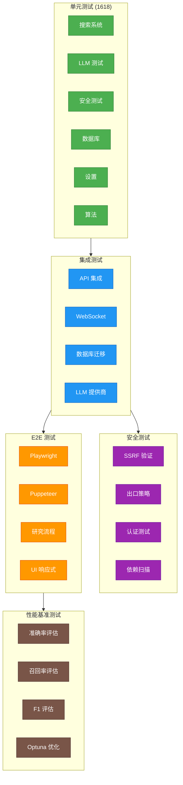
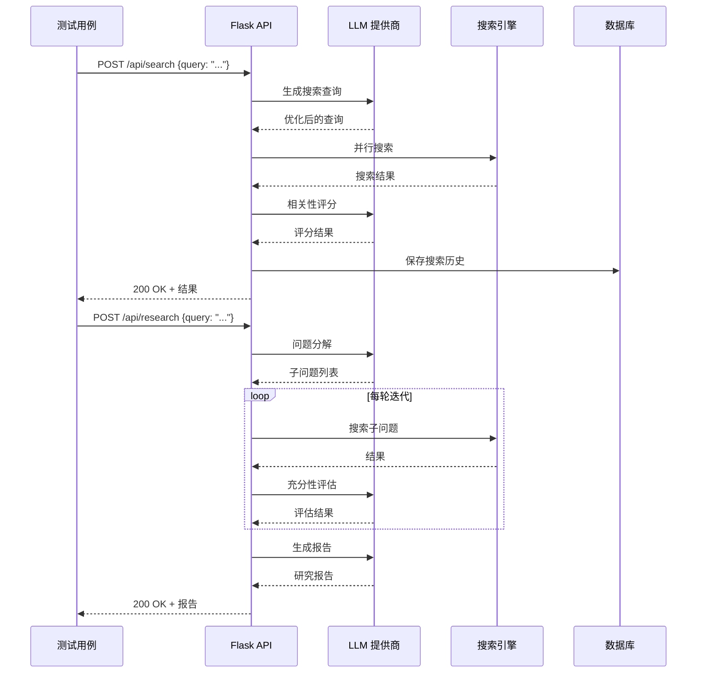
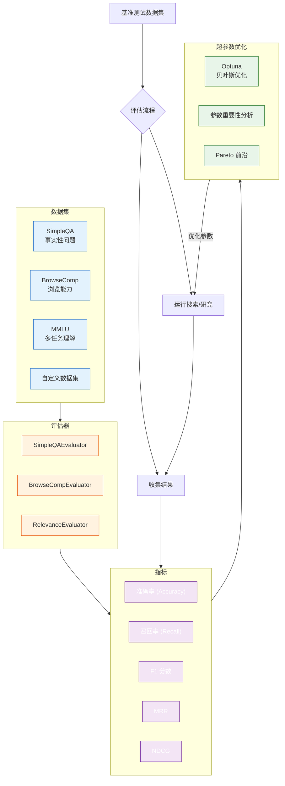

# 15. 测试策略与主要测试用例说明

> 本文档详细阐述 Local Deep Research 项目的测试策略体系，涵盖测试金字塔结构、核心测试用例设计、集成测试方案、E2E 测试配置、安全测试以及性能基准测试。

---

## 目录

- [15.1 测试金字塔与策略](#151-测试金字塔与策略)
- [15.2 核心单元测试用例](#152-核心单元测试用例)
- [15.3 集成测试设计](#153-集成测试设计)
- [15.4 E2E 测试](#154-e2e-测试)
- [15.5 安全测试](#155-安全测试)
- [15.6 性能基准测试](#156-性能基准测试)

---

## 15.1 测试金字塔与策略

### 15.1.1 测试金字塔



> **测试金字塔说明**：Local Deep Research 的测试体系遵循经典金字塔结构，从底到顶依次为单元测试、集成测试、E2E 测试、安全测试和性能基准测试。底层单元测试数量最多（1618 个 Python 测试 + 397 个 JS 测试），执行速度快、反馈即时，覆盖核心算法、工具函数、安全验证等原子功能。集成测试验证模块间协作，包括 API 端到端、WebSocket 实时通信、数据库迁移、多 LLM 提供商适配等。E2E 测试通过 Playwright 和 Puppeteer 模拟真实用户操作，验证完整的研究工作流。安全测试贯穿所有层级，包括 SSRF 验证、出口策略、认证机制等。性能基准测试评估搜索准确率、召回率等指标，使用 Optuna 进行超参数优化。这种分层策略确保了测试覆盖率与执行效率的最佳平衡。

### 15.1.2 测试规模概览

| 测试类型 | 数量 | 执行时间 | 运行频率 |
|---------|------|---------|---------|
| Python 单元测试 | 1618 | ~5 min | 每次提交 |
| JS 单元测试 | 397 | ~2 min | 每次提交 |
| 集成测试 | ~200 | ~3 min | PR 提交 |
| E2E 测试 | ~82 | ~8 min | PR 提交 |
| 安全测试 | ~50 | ~2 min | 每日 + PR |
| 基准测试 | ~10 | ~30 min | 每周 |

### 15.1.3 测试策略原则

1. **测试先行**：新功能开发前先编写测试用例
2. **独立性**：每个测试用例独立运行，无执行顺序依赖
3. **确定性**：测试结果可重现，避免 flaky tests
4. **隔离性**：使用 fixtures 和 mock 隔离外部依赖
5. **可读性**：测试代码即文档，命名清晰表达意图

---

## 15.2 核心单元测试用例

### 15.2.1 搜索系统测试

搜索系统测试覆盖所有 30+ 搜索引擎和高级搜索功能。

```
tests/
├── advanced_search_system/        # 高级搜索系统
│   ├── test_filter.py             # 交叉引擎过滤测试
│   ├── test_ranker.py             # 排序算法测试
│   ├── test_diversity.py          # 多样性重排序测试
│   └── test_strategy.py           # 搜索策略测试
├── search_engines/                # 搜索引擎测试
│   ├── test_searxng.py            # SearXNG 测试
│   ├── test_wikipedia.py          # Wikipedia 测试
│   ├── test_arxiv.py              # arXiv 测试
│   ├── test_github.py             # GitHub 测试
│   └── ...                        # 30+ 引擎测试
└── vector_store/                  # 向量存储测试
    ├── test_faiss_index.py        # FAISS 索引测试
    ├── test_chunking.py           # 分块算法测试
    └── test_reranker.py           # 重排序测试
```

示例测试用例：

```python
# tests/search_engines/test_searxng.py
import pytest
from unittest.mock import patch, AsyncMock

class TestSearxngEngine:
    """SearXNG 搜索引擎测试"""

    @pytest.fixture
    def engine(self):
        return SearxngEngine(base_url="http://localhost:8080")

    @pytest.mark.asyncio
    async def test_search_basic(self, engine):
        """测试基本搜索功能"""
        with patch("aiohttp.ClientSession.get") as mock_get:
            mock_get.return_value.__aenter__.return_value.json = AsyncMock(
                return_value={
                    "results": [
                        {
                            "title": "Test Result",
                            "url": "https://example.com",
                            "content": "Test content"
                        }
                    ]
                }
            )

            results = await engine.search("Python async")
            assert len(results) > 0
            assert results[0].title == "Test Result"

    @pytest.mark.asyncio
    async def test_search_with_options(self, engine):
        """测试带选项的搜索"""
        results = await engine.search(
            "Python async",
            options={"language": "en", "time_range": "month"}
        )
        # 验证选项被正确传递
        assert results is not None

    @pytest.mark.asyncio
    async def test_search_empty_results(self, engine):
        """测试空结果处理"""
        with patch("aiohttp.ClientSession.get") as mock_get:
            mock_get.return_value.__aenter__.return_value.json = AsyncMock(
                return_value={"results": []}
            )

            results = await engine.search("xyznonexistentquery123")
            assert len(results) == 0

    @pytest.mark.asyncio
    async def test_search_network_error(self, engine):
        """测试网络错误处理"""
        with patch("aiohttp.ClientSession.get") as mock_get:
            mock_get.side_effect = aiohttp.ClientError("Connection refused")

            with pytest.raises(SearchEngineError):
                await engine.search("test")
```

### 15.2.2 LLM 提供商测试

```
tests/llm/
├── test_base_provider.py          # 基类测试
├── test_streaming.py              # 流式生成测试
├── test_rate_limiter.py           # 限流测试
└── test_fallback.py              # 故障转移测试

tests/llm_providers/
├── test_ollama.py                 # Ollama 测试
├── test_openai.py                 # OpenAI 测试
├── test_anthropic.py              # Anthropic 测试
├── test_google.py                 # Google 测试
└── ...                            # 14+ 提供商测试
```

```python
# tests/llm_providers/test_ollama.py
class TestOllamaProvider:
    """Ollama 提供商测试"""

    @pytest.fixture
    def provider(self):
        return OllamaProvider(
            base_url="http://localhost:11434",
            model="llama3.2"
        )

    @pytest.mark.asyncio
    async def test_generate_basic(self, provider):
        """测试基本生成"""
        with patch("ollama.AsyncClient.chat") as mock_chat:
            mock_chat.return_value = {
                "message": {"content": "Test response"}
            }

            response = await provider.generate("Hello")
            assert response == "Test response"

    @pytest.mark.asyncio
    async def test_stream_generate(self, provider):
        """测试流式生成"""
        chunks = [
            {"message": {"content": "Hello "}, "done": False},
            {"message": {"content": "World"}, "done": True}
        ]
        with patch("ollama.AsyncClient.chat") as mock_chat:
            mock_chat.return_value = iter(chunks)

            result = []
            async for chunk in provider.stream_generate("Hello"):
                result.append(chunk)

            assert "".join(result) == "Hello World"

    def test_validate_config_valid(self, provider):
        """测试有效配置验证"""
        assert provider.validate_config() is True

    def test_validate_config_invalid_url(self):
        """测试无效 URL 配置"""
        provider = OllamaProvider(base_url="", model="llama3.2")
        assert provider.validate_config() is False
```

### 15.2.3 安全测试

```
tests/security/
├── test_ssrf_protection.py        # SSRF 防护测试
├── test_egress_policy.py          # 出口策略测试
├── test_input_validation.py       # 输入验证测试
├── test_authentication.py         # 认证测试
└── test_sqlcipher.py             # SQLCipher 加密测试
```

```python
# tests/security/test_ssrf_protection.py
class TestSSRFProtection:
    """SSRF 防护测试"""

    @pytest.fixture
    def protector(self):
        return SSRFProtector()

    @pytest.mark.parametrize("url,expected_allowed", [
        ("https://www.google.com", True),
        ("https://en.wikipedia.org/wiki/Python", True),
        ("http://127.0.0.1:5000/api", False),
        ("http://169.254.169.254/latest/meta-data", False),
        ("http://localhost:8080", False),
        ("http://10.0.0.1", False),
        ("http://192.168.1.1", False),
        ("http://[::1]", False),
        ("http://[fe80::1]", False),
        ("file:///etc/passwd", False),
        ("ftp://internal.server/file", False),
    ])
    def test_url_validation(self, protector, url, expected_allowed):
        """测试 URL 验证（参数化测试）"""
        result = protector.is_url_allowed(url)
        assert result == expected_allowed

    def test_dns_rebinding_protection(self, protector):
        """测试 DNS 重绑定防护"""
        # 模拟 DNS 重绑定攻击：域名解析为私有 IP
        with patch("socket.getaddrinfo") as mock_dns:
            mock_dns.return_value = [(2, 1, 6, '', ('127.0.0.1', 80))]

            # 第一次解析为公网 IP（通过检查）
            # 第二次解析为私有 IP（攻击）
            assert not protector.validate_dns_consistency(
                "evil.com",
                expected_public=True
            )
```

### 15.2.4 数据库测试

```
tests/database/
├── test_encrypted_db.py           # 加密数据库测试
├── test_migrations.py             # 迁移测试
├── test_vector_store.py           # 向量存储测试
└── test_repositories.py           # 数据仓库测试
```

### 15.2.5 测试 Fixtures 和 conftest.py

```python
# tests/conftest.py
import pytest
import tempfile
from unittest.mock import MagicMock

@pytest.fixture(scope="session")
def test_data_dir():
    """测试数据目录"""
    with tempfile.TemporaryDirectory() as tmpdir:
        yield Path(tmpdir)

@pytest.fixture
def mock_llm_provider():
    """模拟 LLM 提供商"""
    provider = MagicMock()
    provider.generate.return_value = "Mock LLM response"
    provider.stream_generate.return_value = iter(["Mock ", "streaming ", "response"])
    provider.validate_config.return_value = True
    return provider

@pytest.fixture
def mock_search_results():
    """模拟搜索结果"""
    return [
        SearchResult(
            title=f"Result {i}",
            url=f"https://example.com/{i}",
            snippet=f"Snippet for result {i}",
            engine="mock"
        )
        for i in range(10)
    ]

@pytest.fixture
def encrypted_db_path(test_data_dir):
    """临时加密数据库路径"""
    db_path = test_data_dir / "test.db"
    yield str(db_path)
    # 清理
    if db_path.exists():
        db_path.unlink()

@pytest.fixture
def app():
    """测试用 Flask 应用"""
    from local_deep_research.factory import create_app
    app = create_app(testing=True)
    app.config["TESTING"] = True
    app.config["WTF_CSRF_ENABLED"] = False
    return app

@pytest.fixture
def client(app):
    """Flask 测试客户端"""
    return app.test_client()
```

---

## 15.3 集成测试设计

### 15.3.1 API 集成测试



> **API 集成测试说明**：API 集成测试验证完整的请求处理链路。测试从 Flask 测试客户端发起 HTTP 请求，经过路由分发、中间件处理、业务逻辑执行，最终返回响应。与单元测试不同，集成测试使用真实的数据库（测试数据库）和模拟的外部服务（LLM、搜索引擎）。上图的序列图展示了研究和搜索两个核心 API 的完整调用链路。测试覆盖正常流程、边界条件、错误处理、并发场景等，确保各模块协同工作正确。

```python
# tests/api/test_research_api.py
class TestResearchAPI:
    """研究 API 集成测试"""

    @pytest.fixture(autouse=True)
    def setup(self, client, mock_llm_provider):
        self.client = client
        self.mock_llm = mock_llm_provider
        # 注入模拟依赖
        from local_deep_research import dependencies
        dependencies.llm_provider = self.mock_llm

    def test_start_research(self):
        """测试启动研究"""
        response = self.client.post("/api/research", json={
            "query": "Python async programming patterns",
            "mode": "deep",
            "max_iterations": 3
        })

        assert response.status_code == 202
        data = response.json
        assert "task_id" in data
        assert data["status"] == "started"

    def test_get_research_status(self):
        """测试获取研究状态"""
        # 先启动研究
        start_resp = self.client.post("/api/research", json={
            "query": "Test query",
            "mode": "quick"
        })
        task_id = start_resp.json["task_id"]

        # 查询状态
        status_resp = self.client.get(f"/api/research/{task_id}/status")
        assert status_resp.status_code == 200
        assert status_resp.json["task_id"] == task_id

    def test_search_endpoint(self):
        """测试搜索端点"""
        response = self.client.post("/api/search", json={
            "query": "Python testing best practices",
            "engines": ["mock"],
            "limit": 10
        })

        assert response.status_code == 200
        data = response.json
        assert "results" in data
        assert isinstance(data["results"], list)

    def test_invalid_query_returns_400(self):
        """测试无效查询返回 400"""
        response = self.client.post("/api/search", json={
            "query": "",  # 空查询
        })
        assert response.status_code == 400

    def test_unauthorized_access_returns_401(self):
        """测试未授权访问返回 401"""
        # 清除认证
        with self.client.session_transaction() as sess:
            sess.clear()

        response = self.client.get("/api/research/history")
        assert response.status_code == 401
```

### 15.3.2 WebSocket 集成测试

```python
# tests/websocket/test_progress.py
class TestWebSocketProgress:
    """WebSocket 进度推送集成测试"""

    def test_research_progress_events(self, app):
        """测试研究进度事件推送"""
        from flask_socketio import SocketIOTestClient

        socketio = app.extensions["socketio"]
        client = SocketIOTestClient(app, socketio)

        # 触发研究事件
        socketio.emit("research_progress", {
            "task_id": "test-123",
            "phase": "searching",
            "progress": 0.5
        })

        # 验证客户端收到事件
        received = client.get_received()
        assert len(received) > 0
        assert received[0]["name"] == "research_progress"
        assert received[0]["args"][0]["progress"] == 0.5
```

### 15.3.3 数据库迁移测试

```python
# tests/migration/test_migrations.py
class TestDatabaseMigrations:
    """数据库迁移测试"""

    def test_upgrade_and_downgrade(self, encrypted_db_path):
        """测试升级和回滚"""
        from alembic import command
        from alembic.config import Config

        alembic_cfg = Config("alembic.ini")
        alembic_cfg.set_main_option("sqlalchemy.url", f"sqlite:///{encrypted_db_path}")

        # 升级到最新版本
        command.upgrade(alembic_cfg, "head")

        # 逐个版本回滚
        command.downgrade(alembic_cfg, "base")

    def test_migration_idempotency(self, encrypted_db_path):
        """测试迁移幂等性（多次执行结果一致）"""
        # 执行两次升级，结果应相同
        pass
```

---

## 15.4 E2E 测试

### 15.4.1 Playwright 配置

```javascript
// playwright.config.js
import { defineConfig, devices } from '@playwright/test';

export default defineConfig({
  testDir: './web/tests/e2e',
  timeout: 60000,
  expect: { timeout: 10000 },
  fullyParallel: true,
  forbidOnly: !!process.env.CI,
  retries: process.env.CI ? 2 : 0,
  workers: process.env.CI ? 1 : undefined,
  reporter: [
    ['html'],
    ['json', { outputFile: 'test-results/results.json' }]
  ],

  use: {
    baseURL: process.env.BASE_URL || 'http://127.0.0.1:5000',
    headless: true,
    screenshot: 'only-on-failure',
    video: 'retain-on-failure',
    trace: 'on-first-retry',
    actionTimeout: 15000,
  },

  projects: [
    {
      name: 'chromium',
      use: { ...devices['Desktop Chrome'] },
    },
    {
      name: 'firefox',
      use: { ...devices['Desktop Firefox'] },
    },
    {
      name: 'webkit',
      use: { ...devices['Desktop Safari'] },
    },
    {
      name: 'mobile-chrome',
      use: { ...devices['Pixel 7'] },
    },
    {
      name: 'mobile-safari',
      use: { ...devices['iPhone 14'] },
    },
  ],

  webServer: {
    command: 'python -m local_deep_research.web.app --port 5000',
    port: 5000,
    reuseExistingServer: !process.env.CI,
    timeout: 120000,
  },
});
```

### 15.4.2 Puppeteer 配置

```javascript
// puppeteer.config.js
module.exports = {
  launch: {
    headless: 'new',
    args: [
      '--no-sandbox',
      '--disable-setuid-sandbox',
      '--disable-dev-shm-usage',
    ],
  },
  browserContext: 'default',
  exitOnPageError: true,
};
```

### 15.4.3 研究 E2E 测试

```yaml
# .github/workflows/e2e-research-test.yml
name: Research E2E Tests
on:
  push:
    branches: [main]
  pull_request:
    branches: [main]

jobs:
  e2e-test:
    runs-on: ubuntu-latest
    steps:
      - uses: actions/checkout@v4
      - uses: actions/setup-node@v4
        with:
          node-version: 24
      - name: Install dependencies
        run: npm ci
      - name: Install Playwright
        run: npx playwright install --with-deps chromium
      - name: Start application
        run: |
          python -m local_deep_research.web.app &
          npx wait-on http://127.0.0.1:5000
      - name: Run E2E tests
        run: npx playwright test e2e-research/
      - name: Upload results
        uses: actions/upload-artifact@v4
        if: always()
        with:
          name: e2e-results
          path: test-results/
```

```javascript
// web/tests/e2e/research-flow.spec.js
import { test, expect } from '@playwright/test';

test.describe('研究流程 E2E 测试', () => {
  test('完整研究流程', async ({ page }) => {
    // 1. 访问首页
    await page.goto('/');
    await expect(page.locator('h1')).toContainText('Local Deep Research');

    // 2. 输入研究问题
    await page.fill('[data-testid="search-input"]', 'Python 异步编程最佳实践');
    await page.click('[data-testid="search-button"]');

    // 3. 等待研究进度
    await expect(page.locator('[data-testid="progress-bar"]')).toBeVisible();

    // 4. 等待结果加载
    await expect(page.locator('[data-testid="research-report"]')).toBeVisible({
      timeout: 120000,
    });

    // 5. 验证报告内容
    const report = page.locator('[data-testid="report-content"]');
    await expect(report).toContainText('Python');
    await expect(report).toContainText('异步');

    // 6. 验证引用存在
    const citations = page.locator('[data-testid="citation"]');
    expect(await citations.count()).toBeGreaterThan(0);
  });

  test('设置页面配置 LLM', async ({ page }) => {
    await page.goto('/settings');

    // 选择 Ollama
    await page.selectOption('[data-testid="llm-provider"]', 'ollama');
    await page.fill('[data-testid="ollama-url"]', 'http://localhost:11434');
    await page.selectOption('[data-testid="llm-model"]', 'llama3.2');

    // 保存设置
    await page.click('[data-testid="save-settings"]');

    // 验证保存成功
    await expect(page.locator('.toast-success')).toBeVisible();
  });
});
```

### 15.4.4 UI 响应式测试

```javascript
// web/tests/e2e/responsive-ui.spec.js
import { test, expect } from '@playwright/test';

const viewports = [
  { name: 'mobile', width: 375, height: 812 },
  { name: 'tablet', width: 768, height: 1024 },
  { name: 'desktop', width: 1440, height: 900 },
];

for (const viewport of viewports) {
  test(`响应式布局 - ${viewport.name}`, async ({ page }) => {
    await page.setViewportSize({
      width: viewport.width,
      height: viewport.height,
    });

    await page.goto('/');

    if (viewport.width < 768) {
      // 移动端：汉堡菜单
      await expect(page.locator('[data-testid="hamburger-menu"]')).toBeVisible();
      await expect(page.locator('[data-testid="sidebar"]')).toBeHidden();
    } else {
      // 桌面端：侧边栏
      await expect(page.locator('[data-testid="sidebar"]')).toBeVisible();
    }
  });
}
```

### 15.4.5 WebKit 测试

```javascript
// web/tests/e2e/webkit-compatibility.spec.js
import { test, expect } from '@playwright/test';

// WebKit 特定兼容性测试
test.describe('WebKit 兼容性', () => {
  test('CSS Grid 在 Safari 中正确渲染', async ({ page, browserName }) => {
    test.skip(browserName !== 'webkit', '仅 WebKit 测试');

    await page.goto('/');
    const grid = page.locator('[data-testid="results-grid"]');
    const display = await grid.evaluate(el =>
      window.getComputedStyle(el).display
    );
    expect(display).toBe('grid');
  });

  test('WebSocket 在 Safari 中正常工作', async ({ page, browserName }) => {
    test.skip(browserName !== 'webkit', '仅 WebKit 测试');

    await page.goto('/');
    // 验证 WebSocket 连接建立
    const wsConnected = await page.evaluate(() => {
      return new Promise((resolve) => {
        const ws = new WebSocket(`ws://${location.host}/socket.io`);
        ws.onopen = () => resolve(true);
        ws.onerror = () => resolve(false);
        setTimeout(() => resolve(false), 5000);
      });
    });
    expect(wsConnected).toBe(true);
  });
});
```

---

## 15.5 安全测试

### 15.5.1 SSRF 验证测试

```python
# tests/security/test_ssrf_protection.py
import pytest
from local_deep_research.security.ssrf_protection import SSRFProtector

class TestSSRFProtection:
    """SSRF 防护测试套件"""

    @pytest.fixture
    def protector(self):
        policy = EgressPolicy.default_deny_private()
        return SSRFProtector(policy=policy)

    # === 基本防护测试 ===

    @pytest.mark.parametrize("url", [
        "http://127.0.0.1/",
        "http://127.0.0.1:8080/api",
        "http://localhost/",
        "http://[::1]:5000/",
        "http://0.0.0.0/",
    ])
    def test_block_loopback(self, protector, url):
        """阻止回环地址访问"""
        assert not protector.is_url_allowed(url)

    @pytest.mark.parametrize("url", [
        "http://10.0.0.1/",
        "http://10.255.255.255/",
        "http://172.16.0.1/",
        "http://192.168.0.1/",
        "http://192.168.255.255/",
    ])
    def test_block_private_ranges(self, protector, url):
        """阻止私有网络地址访问"""
        assert not protector.is_url_allowed(url)

    def test_block_link_local(self, protector):
        """阻止链路本地地址"""
        assert not protector.is_url_allowed("http://169.254.169.254/")

    # === DNS 重绑定防护 ===

    def test_dns_rebinding_protection(self, protector):
        """DNS 重绑定攻击防护"""
        with patch("socket.getaddrinfo") as mock_dns:
            # 模拟 DNS 返回私有地址
            mock_dns.return_value = [
                (2, 1, 6, '', ('127.0.0.1', 80))
            ]
            assert not protector.is_url_allowed("http://evil.com")

    # === URL 混淆防护 ===

    @pytest.mark.parametrize("url", [
        "http://0177.0.0.1/",       # 八进制编码
        "http://2130706433/",        # 整数编码
        "http://0x7f.0.0.1/",        # 十六进制编码
        "http://127.1/",             # 短格式
    ])
    def test_block_encoded_addresses(self, protector, url):
        """阻止编码混淆的地址"""
        assert not protector.is_url_allowed(url)

    # === 协议限制 ===

    @pytest.mark.parametrize("url", [
        "file:///etc/passwd",
        "ftp://internal.server/",
        "gopher://internal.server:70/",
        "dict://internal.server:2628/",
    ])
    def test_block_dangerous_schemes(self, protector, url):
        """阻止危险协议"""
        assert not protector.is_url_allowed(url)
```

### 15.5.2 出口策略测试

```python
# tests/security/test_egress_policy.py
class TestEgressPolicy:
    """出口策略测试"""

    def test_default_deny_all(self):
        """测试默认拒绝所有"""
        policy = EgressPolicy.default()
        assert policy.evaluate("http://example.com").action == "deny"

    def test_allow_specific_domain(self):
        """测试允许特定域名"""
        policy = EgressPolicy.default_deny()
        policy.add_allow_rule(
            Rule(type="hostname", pattern="*.wikipedia.org")
        )
        assert policy.evaluate("https://en.wikipedia.org").action == "allow"
        assert policy.evaluate("https://evil.com").action == "deny"

    def test_deny_priority_over_allow(self):
        """测试拒绝规则优先于允许规则"""
        policy = EgressPolicy.default_deny()
        policy.add_allow_rule(Rule(type="classification", classification="public"))
        policy.add_deny_rule(Rule(type="hostname", pattern="*.evil.com"))

        # 即使是公网地址，匹配拒绝规则也应该被拒绝
        result = policy.evaluate("https://www.evil.com")
        assert result.action == "deny"

    def test_cidr_matching(self):
        """测试 CIDR 匹配"""
        policy = EgressPolicy.default_deny()
        policy.add_allow_rule(Rype="cidr", cidr="8.8.8.0/24"))

        assert policy.evaluate("http://8.8.8.8").action == "allow"
        assert policy.evaluate("http://8.8.9.1").action == "deny"
```

### 15.5.3 认证测试

```python
# tests/security/test_authentication.py
class TestAuthentication:
    """认证系统测试"""

    def test_login_with_correct_password(self, client, encrypted_db_path):
        """测试正确密码登录"""
        response = client.post("/api/auth/login", json={
            "password": "correct_password"
        })
        assert response.status_code == 200
        assert "session" in response.cookies

    def test_login_with_wrong_password(self, client, encrypted_db_path):
        """测试错误密码登录"""
        response = client.post("/api/auth/login", json={
            "password": "wrong_password"
        })
        assert response.status_code == 401

    def test_brute_force_protection(self, client):
        """测试暴力破解防护"""
        for i in range(10):
            response = client.post("/api/auth/login", json={
                "password": f"wrong_{i}"
            })

        # 多次失败后应触发限流
        assert response.status_code == 429

    def test_session_expiry(self, client):
        """测试会话过期"""
        # 登录
        client.post("/api/auth/login", json={"password": "test"})

        # 模拟时间流逝
        with freeze_time(timedelta(hours=25)):
            response = client.get("/api/research/history")
            assert response.status_code == 401  # 会话已过期
```

### 15.5.4 安全扫描 CI 集成

```yaml
# .github/workflows/security-scan.yml
name: Security Scan
on:
  schedule:
    - cron: '0 6 * * *'  # 每天 6 点
  push:
    branches: [main]

jobs:
  security-scan:
    runs-on: ubuntu-latest
    steps:
      - uses: actions/checkout@v4

      - name: Run Bandit (Python 安全扫描)
        run: |
          pdm run bandit -r src/ -f json -o bandit-report.json

      - name: Run Safety (依赖漏洞扫描)
        run: |
          pdm run safety check --json --output safety-report.json

      - name: Run npm audit
        run: |
          npm audit --json > npm-audit-report.json

      - name: Upload security reports
        uses: actions/upload-artifact@v4
        with:
          name: security-reports
          path: '*-report.json'
```

---

## 15.6 性能基准测试

### 15.6.1 基准测试框架



> **基准测试框架说明**：性能基准测试框架由四个核心组件组成。数据集层提供标准化的测试问题集，包括 SimpleQA（事实性问题评估）、BrowseComp（复杂浏览任务评估）、MMLU（多领域理解评估）以及项目自定义数据集。评估器层负责判断系统输出正确答案，SimpleQAEvaluator 使用模糊匹配和语义相似度判断事实性问题的正确性，BrowseCompEvaluator 评估复杂信息检索任务。指标层计算标准 IR 指标，包括准确率、召回率、F1、MRR（平均倒数排名）、NDCG（归一化折损累积增益）。优化层使用 Optuna 框架进行贝叶斯超参数优化，搜索最优的搜索策略参数组合，通过参数重要性分析和 Pareto 前沿找到效果与效率的最佳平衡点。

### 15.6.2 数据集

```python
# benchmarks/datasets/simple_qa.py
class SimpleQADataset:
    """SimpleQA 数据集"""

    # 事实性问题数据集，每行包含 question 和 answer
    # 示例：{"question": "Python 的创建者是谁？", "answer": "Guido van Rossum"}

    def __init__(self, path: str):
        self.data = self._load(path)

    def _load(self, path: str) -> list[dict]:
        with open(path) as f:
            return [json.loads(line) for line in f]

    def __len__(self):
        return len(self.data)

    def __getitem__(self, idx):
        return self.data[idx]


# benchmarks/datasets/browse_comp.py
class BrowseCompDataset:
    """BrowseComp 数据集"""

    # 复杂浏览任务数据集
    # 示例：{"query": "找出2023年发表论文最多的AI实验室", ...}

    def __init__(self, path: str):
        self.data = self._load(path)
```

### 15.6.3 评估器

```python
# benchmarks/evaluators/simple_qa_evaluator.py
class SimpleQAEvaluator:
    """SimpleQA 评估器"""

    def __init__(self, llm_provider: BaseLLMProvider):
        self.llm = llm_provider

    def evaluate(
        self,
        prediction: str,
        ground_truth: str,
    ) -> dict:
        """评估预测结果"""
        # 方法1: 精确匹配
        exact_match = self._exact_match(prediction, ground_truth)

        # 方法2: 语义相似度
        semantic_match = self._semantic_match(prediction, ground_truth)

        # 方法3: LLM 判断
        llm_judge = self._llm_judge(prediction, ground_truth)

        return {
            "exact_match": exact_match,
            "semantic_match": semantic_match,
            "llm_judge": llm_judge,
            "score": max(exact_match, semantic_match, llm_judge),
        }

    def _exact_match(self, pred: str, truth: str) -> float:
        """精确匹配（归一化）"""
        pred_norm = self._normalize(pred)
        truth_norm = self._normalize(truth)
        return 1.0 if pred_norm == truth_norm else 0.0

    def _semantic_match(self, pred: str, truth: str) -> float:
        """语义相似度匹配"""
        pred_emb = embed(pred)
        truth_emb = embed(truth)
        return cosine_similarity(pred_emb, truth_emb)

    def _llm_judge(self, pred: str, truth: str) -> float:
        """LLM 评判"""
        prompt = f"""
        判断以下预测答案是否正确回答了问题。

        标准答案: {truth}
        预测答案: {pred}

        请给出 0 到 1 之间的评分：
        - 1.0: 完全正确
        - 0.5: 部分正确
        - 0.0: 完全错误
        """
        response = self.llm.generate(prompt)
        return self._extract_score(response)


# benchmarks/evaluators/browse_comp_evaluator.py
class BrowseCompEvaluator:
    """BrowseComp 评估器"""

    def evaluate(self, result: dict, expected: dict) -> dict:
        """评估复杂浏览任务结果"""
        metrics = {}

        # 准确率：找到的信息是否正确
        metrics["accuracy"] = self._check_accuracy(result, expected)

        # 完整性：是否找到所有必要信息
        metrics["completeness"] = self._check_completeness(result, expected)

        # 效率：搜索轮次是否合理
        metrics["efficiency"] = self._score_efficiency(result["iterations"])

        # 综合分数
        metrics["overall"] = (
            metrics["accuracy"] * 0.5 +
            metrics["completeness"] * 0.3 +
            metrics["efficiency"] * 0.2
        )

        return metrics
```

### 15.6.4 指标计算

```python
# benchmarks/metrics.py

def accuracy(predictions: list[bool]) -> float:
    """准确率"""
    return sum(predictions) / len(predictions)


def precision(retrieved_relevant: int, total_retrieved: int) -> float:
    """精确率"""
    if total_retrieved == 0:
        return 0.0
    return retrieved_relevant / total_retrieved


def recall(retrieved_relevant: int, total_relevant: int) -> float:
    """召回率"""
    if total_relevant == 0:
        return 0.0
    return retrieved_relevant / total_relevant


def f1_score(prec: float, rec: float) -> float:
    """F1 分数"""
    if prec + rec == 0:
        return 0.0
    return 2 * prec * rec / (prec + rec)


def mean_reciprocal_rank(ranked_lists: list[list[bool]]) -> float:
    """平均倒数排名 (MRR)"""
    rr_sum = 0.0
    for ranked in ranked_lists:
        for i, relevant in enumerate(ranked):
            if relevant:
                rr_sum += 1.0 / (i + 1)
                break
    return rr_sum / len(ranked_lists)


def ndcg(ranked_relevances: list[float], k: int = 10) -> float:
    """归一化折损累积增益 (NDCG@k)"""
    dcg = sum(
        rel / math.log2(i + 2)
        for i, rel in enumerate(ranked_relevances[:k])
    )
    ideal = sum(
        rel / math.log2(i + 2)
        for i, rel in enumerate(sorted(ranked_relevances, reverse=True)[:k])
    )
    return dcg / ideal if ideal > 0 else 0.0
```

### 15.6.5 Optuna 超参数优化

```python
# benchmarks/optimization/optuna_optimizer.py
import optuna

class SearchOptimizer:
    """搜索策略超参数优化器"""

    def __init__(self, dataset, evaluator):
        self.dataset = dataset
        self.evaluator = evaluator

    def objective(self, trial: optuna.Trial) -> float:
        """优化目标函数"""
        # 定义搜索空间
        params = {
            "max_iterations": trial.suggest_int("max_iterations", 1, 5),
            "chunk_size": trial.suggest_categorical("chunk_size", [256, 512, 1024]),
            "overlap_ratio": trial.suggest_float("overlap_ratio", 0.05, 0.3),
            "relevance_threshold": trial.suggest_float("relevance_threshold", 0.5, 0.9),
            "diversity_weight": trial.suggest_float("diversity_weight", 0.1, 0.5),
            "top_k": trial.suggest_int("top_k", 5, 20),
        }

        # 使用参数运行搜索
        scores = []
        for item in self.dataset:
            result = run_search(item["query"], params)
            eval_result = self.evaluator.evaluate(result, item)
            scores.append(eval_result["score"])

        return np.mean(scores)

    def optimize(self, n_trials: int = 100) -> dict:
        """执行优化"""
        study = optuna.create_study(
            direction="maximize",
            sampler=optuna.samplers.TPESampler(),
        )
        study.optimize(self.objective, n_trials=n_trials)

        return {
            "best_params": study.best_params,
            "best_score": study.best_value,
            "param_importances": optuna.importance.get_param_importances(study),
        }
```

### 15.6.6 社区基准结果

```
benchmarks/community_benchmark_results/
├── llama3.2_searxng.json          # Llama 3.2 + SearXNG 结果
├── gpt4o_searxng.json             # GPT-4o + SearXNG 结果
├── claude3.5_searxng.json         # Claude 3.5 + SearXNG 结果
└── ...                            # 更多社区贡献结果
```

```json
// benchmarks/community_benchmark_results/llama3.2_searxng.json
{
  "model": "llama3.2",
  "search_engine": "searxng",
  "dataset": "SimpleQA",
  "metrics": {
    "accuracy": 0.72,
    "recall": 0.68,
    "f1": 0.70,
    "mrr": 0.75,
    "ndcg@10": 0.78
  },
  "config": {
    "max_iterations": 3,
    "chunk_size": 512,
    "top_k": 10
  },
  "submitted_by": "community_user_1",
  "date": "2024-06-15"
}
```

---

## 附录：测试执行命令速查

```bash
# === 单元测试 ===
pdm run pytest tests/ -x -v                           # 全部测试（遇错即停）
pdm run pytest tests/search_engines/ -v                # 搜索测试
pdm run pytest tests/security/ -v                      # 安全测试
pdm run pytest -k "test_search" --no-header           # 关键字过滤
pdm run pytest --cov --cov-report=html                # 覆盖率报告
pdm run pytest -n auto                                 # 并行执行

# === JS 测试 ===
npm test                                                # 全部 JS 测试
npm run test:unit                                      # 单元测试
npm run test:e2e                                       # E2E 测试

# === E2E 测试 ===
npx playwright test                                     # Playwright 全部
npx playwright test --project=chromium                  # 仅 Chromium
npx playwright test --debug                             # 调试模式

# === 基准测试 ===
python -m benchmarks.run --dataset SimpleQA --model llama3.2
python -m benchmarks.optimize --trials 100

# === 安全扫描 ===
pdm run bandit -r src/                                  # Python 安全扫描
pdm run safety check                                    # 依赖漏洞扫描
npm audit                                               # Node 依赖扫描
```

---

# ❤️ 制作不易，请我喝咖啡☕️关注我➕

