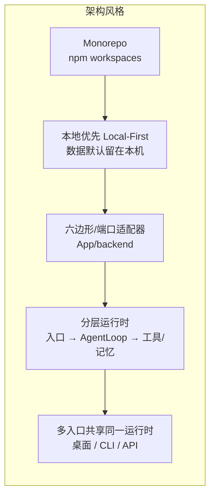

# 01 · 项目概述（Project Overview）

## 1.1 项目定位、核心价值与解决的问题

### 它在解决什么问题

每一次 AI 会话都会产生上下文，但绝大多数上下文在会话结束后就被丢弃。切换 Agent、关闭标签页、开启新会话，用户都得**从零再次自我介绍**。memmy-agent 直击这一痛点：

> 把散落在 Cursor、Claude Code、Codex、OpenCode、OpenClaw、Hermes 等 Agent 中的对话、偏好与项目经验，**蒸馏成一个统一的、可检索、可复用的长期个人记忆层**，并在此之上构建一个本地运行的通用 Agent。

### 核心价值（三大支柱）

1. **跨 Agent 共享记忆层（Cross-Agent Memory Layer）**：无论在 Codex、Claude Code、Cursor 还是 OpenClaw 工作，都复用同一套上下文，无需重复自我介绍。由 MemOS 驱动的记忆引擎自动采集、理解并结构化知识、偏好与工作经-验。
2. **本地 Agent 运行时（Local Agent Runtime）**：桌面 App、CLI/TUI、OpenAI 兼容 API 三个入口共享同一套 Agent、记忆与配置；任务可在不同入口之间无缝接续。通过 Skills 与 MCP 扩展能力，并内置托管的 Chromium 浏览器工具。
3. **工具与生态连接（Tool & Ecosystem）**：接入 Telegram、Discord、微信、飞书、钉钉等消息渠道，以及 GitHub、Gmail、Notion、Slack、Jira 等生产力工具；支持 MCP 与自定义 Skills；模型（推理/Embedding/记忆处理/语音/图像）可灵活配置，兼容主流模型服务与 BYOK。

### 目标用户

- **重度使用多种编码 Agent 的开发者**（同时用 Cursor + Claude Code + Codex 等），希望跨工具沉淀项目上下文。
- **希望拥有"长期记忆"的 AI Agent 使用者**：让 Agent 越用越懂自己，而非每次从零开始。
- **重视数据主权、要求本地优先（local-first）的用户**：记忆、配置、App 状态默认全部留在本机。

### 与同类产品差异

memmy-agent 的差异化不在于"再多一个会聊天、能跑腿的个人助手"，而在于它首先是**横跨所有 Agent 的记忆基础设施**：先记住你，再在其上构建通用 Agent。它原生支持接管外部 Agent 历史、为外部 Agent 安装记忆 Skill，并采用结构化的 MemOS 混合检索引擎。

## 1.2 完整技术栈清单

仓库是一个 npm workspaces 的 TypeScript Monorepo，`"type": "module"`（ESM）。下表汇总各子系统的技术选型与版本（取自各 `package.json`）。

### 语言与运行时

| 项 | 选型 | 版本/约束 |
| --- | --- | --- |
| 语言 | TypeScript | `^6.0.3`（编译目标 ES2022，`module/moduleResolution = NodeNext`，`strict` + `noUncheckedIndexedAccess` + `verbatimModuleSyntax`） |
| 运行时 | Node.js | 根 `>=20`；Agent Runtime `>=22` |
| 模块 | ESM | 全仓库 `"type": "module"` |

### 各子系统框架与依赖

| 子系统（包名） | 关键技术 | 关键依赖 |
| --- | --- | --- |
| **Memory 服务**（`@memmy/memory`） | 原生 `node:http`（无 Web 框架）、自研路由 | `better-sqlite3 ^12.6.3`、`sqlite-vec 0.1.9`、`@huggingface/transformers ^3.8`（本地 Embedding）、`yaml`、`dotenv` |
| **Agent Runtime**（`memmy-agent`） | `commander`（CLI）、`ink`+`react`（TUI）、自研 Agent 循环 | `@modelcontextprotocol/sdk`、`@playwright/mcp`+`playwright`（浏览器工具）、`@anthropic-ai/sdk`、`openai`、`@aws-sdk/client-bedrock-runtime`、`better-sqlite3`、`tiktoken`、`nunjucks`、`zod`、`fast-glob`、`turndown`+`@mozilla/readability`、`pdfjs-dist`/`mammoth`/`exceljs`，以及 `discord.js`/`grammy`/`matrix-js-sdk`/`botbuilder`/`@slack/*`/`dingtalk-stream`/`@wecom/aibot-node-sdk`/`@tencent-connect/openclaw-qqbot`/`@larksuiteoapi/node-sdk` 等渠道 SDK |
| **本地后端**（`@memmy/backend`） | `fastify ^5.8.5`、六边形架构 | `@modelcontextprotocol/sdk ^1.29`、`sqlite-vec 0.1.9`、`undici ^6.26`、`yaml`、`zod ^4.4.3`、`dotenv`、`@memmy/local-api-contracts`；**SQLite 访问用 Node 内置 `node:sqlite`（`DatabaseSync`），非 better-sqlite3** |
| **桌面前端**（`@memmy/frontend-desktop`） | React 19 + Vite 8 | `react-markdown`+`remark-gfm`/`remark-math`/`rehype-katex`、`@xyflow/react`（DAG 可视化）、`lucide-react`、`zod`；状态用 `useReducer`+Context（无 Redux/Zustand） |
| **Electron 外壳**（`@memmy/desktop`） | Electron 38.4 + electron-builder ^26 | `@memmy/backend`、`@memmy/desktop-interface`、`@memmy/local-api-contracts`、`dotenv`、`yaml` |
| **迁移包**（`@memmy/migrations`） | 纯 Node/TS | `proper-lockfile` |
| **共享契约**（`@memmy/local-api-contracts`） | Zod schema | `zod` |
| **外壳/前端共享类型**（`@memmy/desktop-interface`） | 纯类型 | `@memmy/local-api-contracts` |

### 工具链

| 类别 | 工具 |
| --- | --- |
| 构建 | `tsc`（各 workspace 独立 `tsconfig.json` 继承 `tsconfig.base.json`）、`tsx`、`concurrently`、`wait-on` |
| 测试 | `vitest ^4`、`@vitest/coverage-v8` |
| 代码质量 | `eslint ^9`、`typescript-eslint ^8`、`eslint-plugin-import`、`prettier` |
| 打包分发 | `electron-builder`（mac DMG / win NSIS exe）、独立二进制（`Memory` 的 `build-binary.sh`）、npm 发布包 |
| CI/CD | GitHub Actions（`.github/workflows/github-release.yml`） |

## 1.3 架构风格及理由

memmy-agent 采用 **"本地优先的 Monorepo + 六边形分层 + 多入口共享运行时"** 复合架构。

**选型理由：**

- **Monorepo（npm workspaces）**：Memory、Agent Runtime、Backend、Frontend、Shell、Migrations 高度耦合（共享类型契约 `@memmy/local-api-contracts`、共享版本号 `scripts/sync-project-version.mjs`），单仓便于一致构建与版本同步。注意 `App/memmy-agent` 因依赖庞大，拥有**独立的 `package-lock.json`**，由 `dev-start.sh` 用 `npm ci --prefix` 驱动。
- **本地优先（Local-First）**：记忆、配置、App 状态默认全部落在 `~/.memmy` 下（SQLite），扫描与入库全在本地完成。这决定了安全边界以"本机运行 + 显式认证"为基础。
- **六边形架构（Ports & Adapters）**：`App/backend` 严格按 `adapters/inbound`（Fastify 驱动应用）、`adapters/outbound`（应用驱动 HTTP/FS/SQLite 客户端）、`services`（应用/领域层）、`infrastructure`（持久化）、`permission`/`analytics`/`config` 分层。这样可以让领域逻辑独立于 Fastify 与具体存储，便于测试与替换。
- **分层运行时**：Agent Runtime 把一轮任务拆成 `入口 → AgentLoop(状态机) → AgentRunner(迭代循环) → Provider/工具/MCP/记忆` 的清晰流水线，扩展点统一收敛到 `AgentHook`。
- **多入口共享运行时**：桌面 App、CLI/TUI、OpenAI 兼容 API 三类入口最终都落到同一个 `AgentLoop.processMessageInternal` 状态机与同一个 `SessionManager`，因而任务与上下文可跨入口接续。

## 1.4 关键功能特性与非功能性需求

### 功能特性（精选）

- **记忆**：6 种外部 Agent 来源扫描入库（Cursor / Claude Code / Codex / OpenCode / OpenClaw / Hermes，代码内还含 `workbuddy`）；四层记忆模型（L1 Trace / L2 Policy / L3 World Model / Skill）；记忆面板（概览/记忆/任务/经验/场域认知/技能/分析/日志）；Dream 记忆整理（手动/周期）；`memmy-memory` CLI 与 Memory Runtime HTTP API；为外部 Agent 安装 Hook/插件以实时召回与采集。
- **桌面端**：多会话任务列表、流式输出、附件（图片+办公文档）、语音输入（ASR）、Slash command、桌宠模式、Agent 产物预览。
- **模型与认证**：账号模式（平台 Token）与 API Key 模式（BYOK）；主/Embedding/记忆摘要/技能进化/ASR/图像生成六类模型独立配置；15+ Provider，含 OAuth。
- **工具与自动化**：内置工具（文件/shell/Web 搜索抓取/定时/长任务/图像生成）；Composio 托管集成 + 自定义 MCP（stdio/sse/streamableHttp）；6 种消息渠道。
- **接口**：OpenAI 兼容 API、Memory Runtime API、桌面本地 API、SSE 事件流。

### 非功能性需求（NFR）

| 维度 | 设计要求与实现手段 |
| --- | --- |
| **性能** | 检索多通道并行 + RRF 融合 + MMR 去重 + 可选 LLM 过滤；向量化/摘要走后台 Worker 不阻塞 Agent 回合；会话三级压缩（迭代内 microcompact → 回合级 Consolidator → 空闲归档 AutoCompact）；token 预算裁剪。 |
| **扩展性** | 工具插件化（`ToolLoader` 扫描 `memmyAgent.tools`）、MCP 接入、Skills 目录化、来源适配器 + AgentAdapter 插件清单（`agent-adapter.plugin.json`）、Provider 注册表可插。 |
| **安全性** | 本地 API 仅本机/受控来源 + `x-memmy-local-token`（timingSafeEqual）；SSE 用查询参数传同一 token；Composio MCP 桥用独立 `x-memmy-mcp-token`；Memory HTTP 可用 bearer token；配置支持 `${ENV}` 引用避免硬编码 Key；工具内 SSRF 防护（`validateUrlTarget`/`containsInternalUrl`）与工作区路径约束。 |
| **可用性 / 容错** | 记忆召回与采集采用 **fail-open**：失败仅记录错误、不中断 Agent 正常对话；Memory 服务不可用时显式报错而非返回"假记忆"；扫描支持暂停/续跑（scan journal）；Worker 重启后 `reconcileWorkerStartup` 回收中断任务。 |
| **可维护性** | 强类型 + Zod 契约贯穿前后端；六边形分层；版本单一来源（根 `package.json` → 各包同步）；大量单元测试 + 端到端 smoke 测试（驱动真实 Memory 服务）。 |
| **幂等性** | 会话/回合/记忆写入接口多为幂等；扫描用稳定来源消息 ID + 回合 ID + 会话检查点去重；后台任务用 `evolution_jobs.dedupe_key` 与 `idempotency_keys` 表。 |

---

> 下一节 → [02 · C4 架构模型](./02-c4-architecture.md)

---

# ❤️ 制作不易，请我喝咖啡☕️关注我➕

