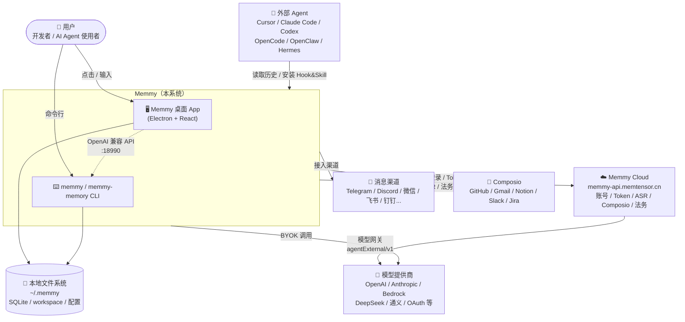
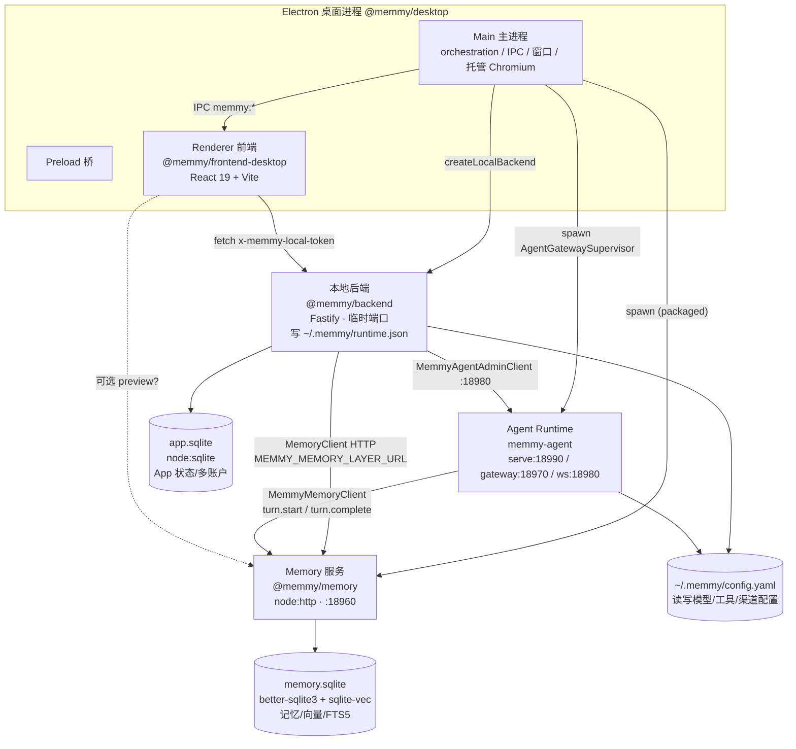
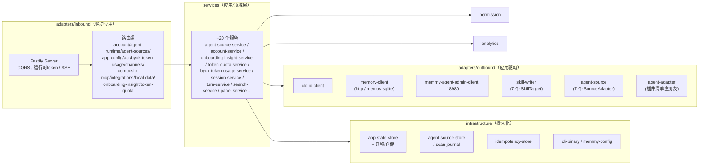
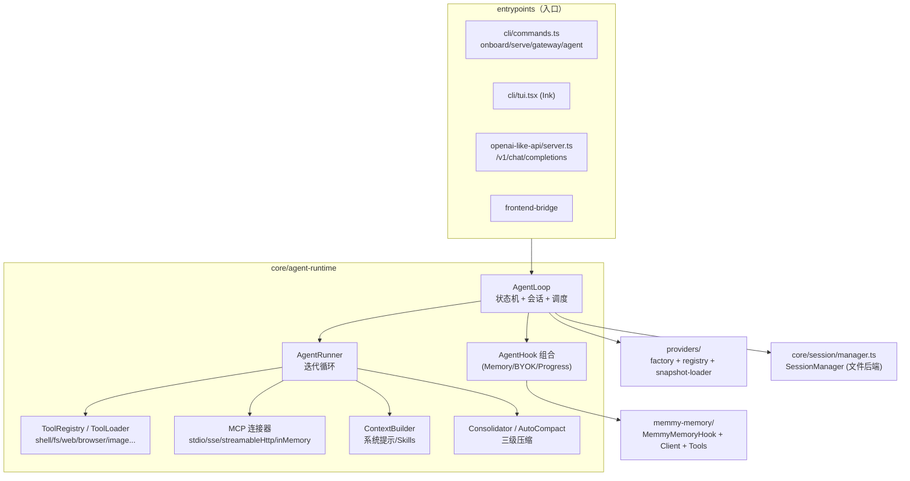
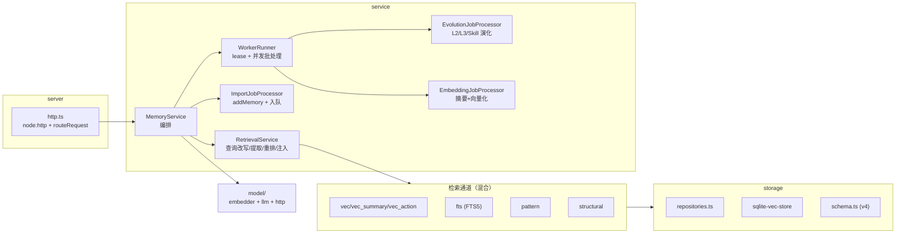
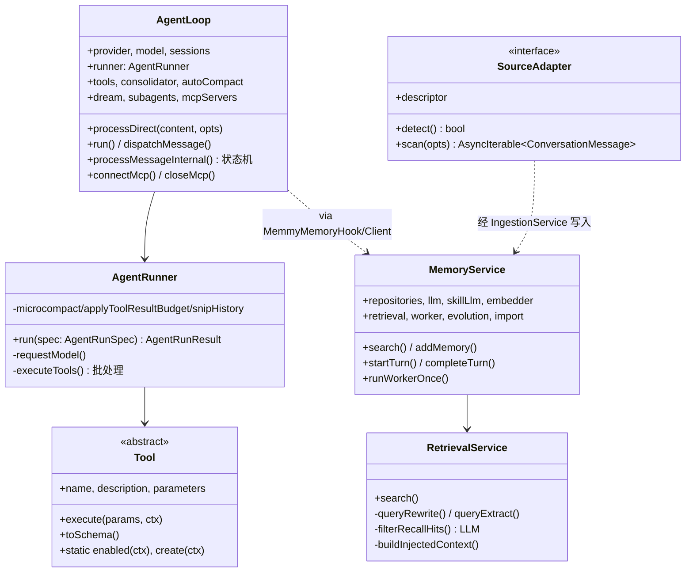

# 02 · C4 架构模型

本章用 [C4 模型](https://c4model.com/) 的四个层级（Context → Container → Component → Code）由外到内刻画 memmy-agent。所有图为 Mermaid，并附详细文字解释。

## 2.1 Level 1 — System Context（系统上下文）

**上下文解释（设计 rationale、边界、交互）：**

系统对外呈现为"一个本地运行的 Memmy"，但其边界涵盖多个交付形态与多个外部依赖。**用户**是核心参与者，通过桌面 App（Electron + React）或命令行（`memmy` / `memmy-memory`）与之交互。一个关键边界是 **Memmy 与外部编码 Agent 的关系**：Memmy 既"被动扫描"它们已写入本地的历史（Cursor 的 `state.vscdb`、Claude Code 的 `~/.claude/projects/**/*.jsonl` 等），又"主动接入"它们的新对话——通过为其安装原生 Hook 或插件，在请求前召回记忆、在回合结束后采集。这意味着外部 Agent 既是数据来源、又是记忆的消费方，是 Memmy 区别于普通助手的根本所在。

第二个边界是 **本地与云的关系**。Memmy 是 local-first 的：所有记忆、配置、App 状态默认落在 `~/.memmy`（SQLite + workspace + YAML 配置）。云（`memmy-api.memtensor.cn`，由 `.env` 的 `MEMMY_CLOUD_SERVICE` 指定）只承担**账号体系、Token 配额、ASR、Composio 集成代理、法务/推广内容、遥测**，以及"账号模式"下的模型网关（`/api/agentExternal/v1`）。用户也可完全不碰云：用 BYOK 直接调自己的模型 Key。这一边界设计直接服务于"数据主权"与"离线可用"。

第三个边界是 **模型与工具生态**。Agent Runtime 通过 Provider 抽象对接 OpenAI、Anthropic、Bedrock、DeepSeek、通义、Kimi、智谱、本地 Ollama/LMStudio 等，并支持 OAuth（Codex、GitHub Copilot）。工具侧通过 MCP 与 Composio 连接 GitHub/Gmail/Notion 等，通过消息渠道 SDK 接入 IM。所有这些外部依赖都收敛在本地进程内，由本地后端与 Agent Runtime 统一编排，对外只暴露本机端口。

## 2.2 Level 2 — Container（容器视图）

"容器"在此指可独立部署/运行的进程或构建产物。

**容器解释：**

桌面形态下，一次启动会拉起一组协作进程。**Electron Main 主进程**（`App/shell/desktop/src/main/main.ts`）是总指挥：`boot()` 依次完成版本/版本号初始化 → 日志 → 可选更新安装 → 启动闪屏 → 注册 IPC → 安装内置 CLI → （打包态）启动 packaged 静态资源服务器与运行时服务 → `createLocalBackend` → 创建主窗口/桌宠窗口/托盘 → 后台检查更新。

运行时服务由 `runtime-services.ts` 编排，打包态会 spawn 两个子服务：**Memory 服务**（默认 `http://127.0.0.1:18960`）和 **Agent 网关监督者**（健康端口 `18970`、WebSocket `18980`），并执行托管 Chromium 预备与内置 Skills 同步。开发态则由 `scripts/dev-start.sh` 用 `concurrently` 拉起 memory / agent-api(`serve`) / gateway / frontend / backend 五路。

**本地后端**（Fastify）绑定 `127.0.0.1:0`（**临时端口**），把真实端口与 token 写入 `~/.memmy/runtime.json`，前端通过预加载桥 `window.memmy.getRuntimeConfig()` 读取它（带 Vite env 与 `/__memmy_runtime_config` 兜底）。这一点很重要：**桌面本地 API 没有固定端口**，固定端口 `19000` 只是 Vite 渲染进程开发服务器。

三个容器之间的数据流是核心：前端 → 本地后端（带 `x-memmy-local-token`）；本地后端 → Memory 服务（`MemoryClient`，HTTP，地址来自 `MEMMY_MEMORY_LAYER_URL`）；**Agent Runtime → Memory 服务**（`MemmyMemoryClient`，在每轮前 `turn.start` 召回、回合后 `turn.complete` 采集）；本地后端 → Agent Runtime 的 WebUI（`MemmyAgentAdminClient :18980`，用于渠道管理）。两个 SQLite 库职责分明：`app.sqlite`（`node:sqlite`）管 App 状态与多账户；`memory.sqlite`（`better-sqlite3` + `sqlite-vec` + FTS5）管全部记忆。CLI 形态则是另一组容器组合：`memmy serve` 直接是 Agent Runtime 的 OpenAI 兼容服务器，`memmy-memory` 是 Memory 服务的 HTTP 客户端。

## 2.3 Level 3 — Component（组件视图）

以三个最核心的容器展开其内部组件。

### 2.3.1 本地后端（六边形）

### 2.3.2 Agent Runtime（分层）

### 2.3.3 Memory 服务（引擎）

**组件解释：**

三个核心容器都遵循"薄入口 + 厚领域 + 可替换适配器"的思路。**本地后端**是教科书式的六边形：Fastify 与路由只是 inbound 适配器，真正业务在 `services` 的约 20 个服务里（扫描编排 `agent-source-service`、登录 `account-service`、首次洞察 `onboarding-insight-service`、配额 `token-quota-service` 等），它们驱动 outbound 适配器（云客户端、Memory 客户端、Skill 写入器、来源适配器、AgentAdapter 插件），并依赖 infrastructure 的 SQLite 仓储。权限与埋点横切所有服务。

**Agent Runtime** 的灵魂是 `AgentLoop`（外层回合编排，状态机 `RESTORE→COMPACT→COMMAND→BUILD→RUN→SAVE→RESPOND→DONE`）与 `AgentRunner`（内层迭代循环：预处理消息 → 调模型 → 执行工具 → 注入排空 → 继续/终止）。所有扩展点收敛到 `AgentHook`：记忆注入、BYOK 用量、进度/流式、子 Agent 状态都是 Hook 实现，由 `CompositeAgentHook` 组合。工具、MCP、上下文构建、三级压缩各成组件。`SessionManager` 是跨入口接续的基础。

**Memory 服务**把检索做成了一条流水线：`RetrievalService` 负责查询改写（可选 3 路 RRF）、查询提取、候选池构建、LLM 重排过滤、上下文注入；候选来自 6 个通道（`vec/vec_summary/vec_action/fts/pattern/structural`）；写入侧 `ImportJobProcessor` 入队，由 `WorkerRunner` 并发执行摘要（`EmbeddingJobProcessor`）与演化（`EvolutionJobProcessor`，归纳 L2、抽象 L3、结晶 Skill）。`MemoryService` 是总编排，串联仓储、两个 LLM 客户端（摘要用 `llm`、演化用 `skillLlm`）、Embedder 与各子服务。

## 2.4 Level 4 — Code（代码/类视图）

聚焦四个最关键的类/模块及其关系：

**代码视图解释：**

`AgentLoop` 与 `AgentRunner` 的拆分是运行时的核心设计决策：Loop 管"回合生命周期、会话、调度、MCP、检查点/恢复"，Runner 管"单次迭代的模型调用与工具执行"。这种分离让网关的事件驱动路径（`run()` → `dispatchMessage()`，带每会话 `AsyncMutex` 与可取消任务）与同步路径（`processDirect`，被 CLI/SDK/API 使用）复用同一个 `processMessageInternal` 状态机。

`Tool` 是抽象基类（`tools/base.ts`），每个工具声明 `name/description/parameters`（JSON Schema）与 `execute(params, ToolExecutionContext)`，可选 `enabled(ctx)`/`create(ctx)`/`scopes`/`concurrencySafe`/`readOnly`。`ToolRegistry` 排序时内置工具排在 `mcp_*` 之前；`ToolLoader.discover()` = 内置类 + 插件发现（扫描 `node_modules` 中带 `memmyAgent.tools` 字段的包）。

`MemoryService` 与 `RetrievalService` 的关系体现了"读写分离 + 异步演化"：`search`/`startTurn` 走检索，`addMemory`/`completeTurn` 走写入并入队，演化与向量化在后台 Worker 异步推进，绝不阻塞当前 Agent 回合。`SourceAdapter` 接口（`detect()` + `async *scan()`）是所有外部 Agent 历史读取的统一契约，产出 `ConversationMessage` 后由 `IngestionService` 整理为完整回合写入 Memory。这一抽象让"新增一种 Agent 来源"只需实现一个适配器。

---

> 上一节 ← [01 项目概述](./01-overview.md) ｜ 下一节 → [03 系统流程与时序图](./03-flows-and-sequences.md)

---

☕️ 制作不易，请我喝咖啡☕️关注我➕

