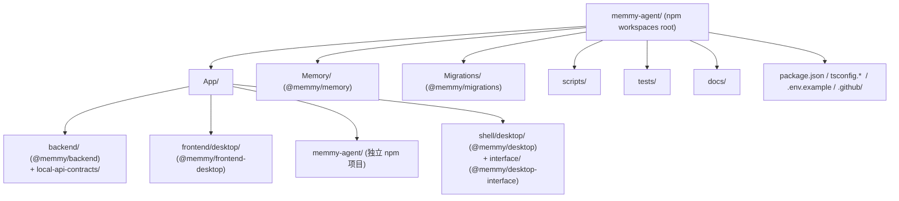
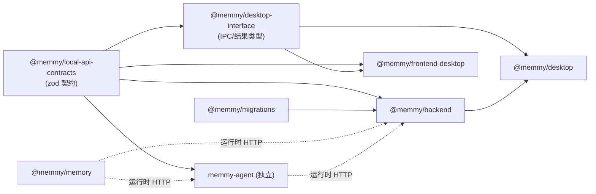
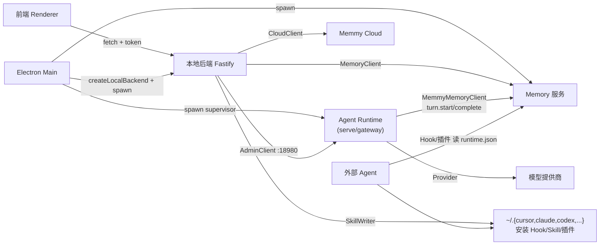

# 04 · 模块/包结构与依赖分析

## 4.1 顶层目录结构



```
memmy-agent/
├── App/
│   ├── backend/                     # 本地后端（Fastify，六边形）
│   │   ├── local-api-contracts/     # 共享 Zod 契约 (@memmy/local-api-contracts)
│   │   └── src/{adapters,services,infrastructure,permission,analytics,config}
│   ├── frontend/desktop/            # React 19 + Vite 桌面前端
│   ├── memmy-agent/                 # Agent Runtime / CLI（独立 lock）
│   │   └── src/{command,config,core,entrypoints,integrations,memmy-memory,
│   │           providers,security,session-dag,skills,templates,utils,...}
│   └── shell/desktop/               # Electron 主进程 + interface/（共享类型）
├── Memory/                          # Memory 服务 (@memmy/memory)
│   └── src/{algorithm,cli,client,config,logging,model,server,service,storage,utils,viewer}
├── Migrations/                      # 工作区一次性迁移 (@memmy/migrations)
├── scripts/                         # dev-start / 打包 / 版本同步
├── tests/                           # release-workflow + smoke
└── docs/                            # 官方文档 (cn/en) + architecture
```

## 4.2 npm workspaces 与构建依赖关系

根 `package.json` 的 workspaces：

```jsonc
"workspaces": [
  "Migrations", "Memory",
  "App/backend/local-api-contracts", "App/backend",
  "App/frontend/*",
  "App/shell/desktop/interface", "App/shell/*"
]
```

> 注意：`App/memmy-agent` **不在根 workspaces 内**，它有独立 `package-lock.json`，由 `scripts/dev-start.sh` 用 `npm ci --prefix App/memmy-agent` 驱动，避免其庞大依赖拖慢根安装。



**依赖要点：**
- `@memmy/local-api-contracts` 是**唯一的跨层契约源**，被前端、后端、外壳接口、Agent Runtime 共享，保证 API 形状一致。
- `@memmy/desktop-interface` 是 Electron 主进程与渲染进程（及预加载桥）之间的**桌面专属类型契约**，重导出 `RuntimeConfig` 并声明 `memmy:*` IPC 的结果类型。
- `@memmy/backend` 依赖 `@memmy/migrations`（执行工作区迁移）与 `@memmy/local-api-contracts`。
- `@memmy/memory` 与 `memmy-agent` 是**运行时 HTTP 依赖**而非构建依赖：后端通过 `MemoryClient`、Agent 通过 `MemmyMemoryClient` 调用 Memory 服务。
- 版本号单一来源在根 `package.json`，由 `scripts/sync-project-version.mjs`（`prebuild`/`pretypecheck`/`pretest`）同步到 Memory / memmy-agent / shell 等各包。

## 4.3 主要模块职责

### Memory 服务（`Memory/src/`）

| 目录 | 职责 | 关键文件 |
| --- | --- | --- |
| `server/` | HTTP 入口与路由（`node:http` + 自研 `routeRequest`） | `index.ts`、`http.ts` |
| `cli/` | `memmy-memory` CLI（HTTP 客户端，`serve` 不启服务） | `index.ts`、`commands.ts` |
| `service/` | 引擎核心：编排、检索、导入、Worker、演化、Embedding、会话/回合、反馈、命名空间、只读模型、试用 | `memory-service.ts`、`retrieval/retrieval-service.ts`、`import/import-job-processor.ts`、`worker/worker-runner.ts`、`evolution/span-pipeline.ts`、`embedding/embedding-job-processor.ts` |
| `storage/` | SQLite schema(v4)、DB、仓储、向量存储 | `schema.ts`、`db.ts`、`repositories.ts`、`sqlite-vec-store.ts` |
| `model/` | Embedder（本地 transformers.js / 远程）、LLM 客户端、HTTP、Token 用量遥测 | `embedder.ts`、`llm.ts`、`http.ts`、`token-usage.ts` |
| `algorithm/` | 检索融合算法（RRF/MMR/候选池/意图门控） | `plugin-algorithms.ts` |
| `config/` | 存储与算法配置（`MEMORY_SUMMARY_MAX_TOKENS=512` 等） | `index.ts` |
| `viewer/` | 记忆面板静态页 | `static.ts` |

### Agent Runtime（`App/memmy-agent/src/`）

| 目录 | 职责 | 关键文件 |
| --- | --- | --- |
| `core/agent-runtime/` | AgentLoop 状态机、AgentRunner 迭代、工具、MCP、上下文、压缩、Hook、子 Agent | `loop.ts`、`runner.ts`、`tools/{base,registry,loader,mcp,browser,...}.ts`、`memory.ts`、`autocompact.ts`、`hook.ts` |
| `core/session/` | 文件后端会话管理（`FILE_MAX_MESSAGES=2000`） | `manager.ts` |
| `entrypoints/` | CLI（commander）、TUI（Ink）、OpenAI 兼容 API、前端桥 | `cli/commands.ts`、`cli/tui.tsx`、`openai-like-api/server.ts` |
| `providers/` | Provider 注册表/工厂/基类/快照加载/memmy-account | `registry.ts`、`factory.ts`、`base.ts`、`snapshot-loader.ts`、`memmy-account.ts` |
| `memmy-memory/` | 记忆客户端 + Hook + 工具 + 发现 | `client.ts`、`hook.ts`、`tools.ts`、`discovery.ts` |
| `skills/` | 内置 Skills（image-generation/summarize/skill-creator/github/ui-craft/tmux/weather/goal/cron/update-setup/agent-memory-onboarding） | 各 `SKILL.md` |
| `integrations/` | BYOK 用量、渠道认证、6 种消息渠道 | `byok-token-usage/`、`channel-auth/`、`channels/` |

### 本地后端（`App/backend/src/`）

| 目录 | 职责 |
| --- | --- |
| `adapters/inbound/local-api/` | Fastify server + 13 个路由组（含 `agent-runtime/` 7 子模块）+ tests |
| `adapters/outbound/agent-source/` | 7 个来源适配器 + 共享助手（`jsonl-lines`/`conversation-window`/`secret-redactor`/`source-registry`/`onboarding-insight-samplers`） |
| `adapters/outbound/agent-adapter/` | AgentAdapter 插件系统（manifest/loader/registry/source + types） |
| `adapters/outbound/{cloud-client,memory-client,memmy-agent-admin-client,skill-writer}/` | 四类出站客户端 |
| `infrastructure/` | `app-state-store`/`agent-source-store`/`agent-source-scan-journal`/`idempotency-store`/`cli-binary`/`memmy-config`（SQLite 仓储 + 迁移） |
| `services/` | ~20 个应用服务（扫描编排/登录/洞察/配额/会话/回合/搜索/面板/Skill 分发…） |
| `permission/`、`analytics/`、`config/` | 权限、GA4 埋点、服务 URL |

### 前端（`App/frontend/desktop/src/`）

| 目录 | 职责 |
| --- | --- |
| `app/` | `App`/`providers`/`router`/`routes`、账户/登录模式/token 耗尽 |
| `state/` | `useReducer` + Context 状态切片（agent-chat/composer/tool-traces/tools/update/task-done） |
| `api/` | 13 个 API 客户端 + `runtime-config`（运行时配置发现）+ SSE `events.ts` + `http.ts` |
| `pages/` | 工作台/记忆(9 子页)/工具/设置(模型/token/api-key)/引导/登录/桌宠 |
| `integrations/`、`components/`、`i18n/`、`theme/`、`lib/`、`analytics/` | 集成目录/UI 组件/国际化/主题/工具/埋点 |

### Electron 外壳（`App/shell/desktop/src/main/`）

| 文件 | 职责 |
| --- | --- |
| `main.ts` | `boot()` 总编排、IPC 注册、窗口/托盘、本地 API 启动 |
| `runtime-services.ts` | 打包态 spawn Memory + Agent 网关 + Chromium 预备 + Skills 同步 |
| `window-mode.ts` | 主窗口/桌宠/托盘三种模式与边界 |
| `renderer-static-server.ts` | 打包态回环静态服务（托管 `dist/renderer`） |
| `agent-tool-terminal.ts` / `agent-tool-deeplink.ts` | 启动外部 Agent 工具 |
| `sqlite-backup.ts`、`desktop-edition.ts`、`logger.ts` 等 | 备份/版本(c·n/intl)/日志 |

## 4.4 模块间依赖关系图（运行时调用）



**依赖分析要点：**
1. **三条写入 Memory 的路径**：① 本地后端扫描历史 → `MemoryClient`；② Agent Runtime 每轮采集 → `MemmyMemoryClient`；③ 外部 Agent 经 Hook/插件 → 同一 Memory HTTP。三者最终都落到 `~/.memmy/memory-service/memory.sqlite`，这正是"跨 Agent 共享同一记忆"的实现基础。
2. **前端永远不直连 Memory/Agent**：前端只经本地后端的临时端口 + `x-memmy-local-token` 访问，后端再代理到 Memory 与 Agent Runtime，形成统一鉴权与聚合层。
3. **配置文件是隐式依赖枢纽**：`~/.memmy/config.yaml` 同时被本地后端（投影模型配置）、Agent Runtime（读 provider/tool/channel）、Memory 服务（读算法参数）读写，`~/.memmy/runtime.json` 被 CLI/Hook 读取以发现服务地址与 token。
4. **解耦点**：Memory 服务用 `node:http` 自研路由、无框架依赖，可独立二进制分发；Agent Runtime 独立 lock 可单独演进；后端用 `node:sqlite` 避免与 Memory 的 `better-sqlite3` 强绑定。这些是有意的隔离边界（见第 11 章 ADR）。

---

> 上一节 ← [03 系统流程与时序图](./03-flows-and-sequences.md) ｜ 下一节 → [05 核心代码走读](./05-code-walkthrough/01-memory-service.md)

---

☕️ 制作不易，请我喝咖啡☕️关注我➕

