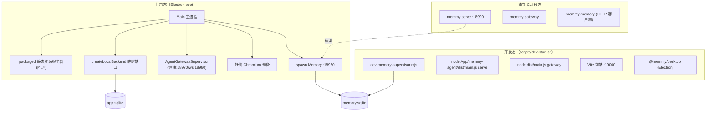

# 08 · 部署、运维与基础设施

## 8.1 部署架构

**三种部署形态：**
1. **桌面 App（打包态）**：`boot()` 一键编排，Main 进程 spawn Memory + Agent 网关 + 预备 Chromium，再 `createLocalBackend`。用户零配置（`.env` 预填云地址）。
2. **开发态**：`scripts/dev-start.sh` 用 `concurrently` 拉起 memory / agent-api(`serve`) / gateway / frontend / backend 五路。
3. **独立 CLI**：`memmy serve` 直接是 OpenAI 兼容服务器；`memmy-memory` 是 Memory 服务的 HTTP 客户端（可 `npm i -g` 或桌面端"一键安装到 `~/.local/bin`"）。

## 8.2 开发启动流程（`scripts/dev-start.sh`）

`run_main` 流程：
1. `configure_dev_edition`：`MEMMY_APP_EDITION` cn/intl → `MEMMY_ACCOUNT_CHANNEL` phone/email。
2. 校验 node/npm/lsof；pin `MEMMY_RUNTIME_NODE_PATH` 到 PATH。
3. `ensure_npm_dependencies`（缺 `concurrently`/`wait-on` 等则 `npm install`）。
4. `stop_existing_stack`：杀占用 19000/18960/18970/18980/18990/18997/18999 的进程 + electron/concurrently/vite/memory-server pid。
5. `build_and_install_memory_cli`：`npm run memory:build`、`memmy-memory init`、符号链接到 `~/.local/bin`。
6. `npm rebuild better-sqlite3`；`ensure_electron_runtime`（跑 Electron `install.js`，必要时手动解 zip）。
7. 构建 memmy-agent + 符号链接 `memmy` CLI；`memmy onboard`；拷贝构建 skills 进 workspace；`memmy internal browser-prepare`（托管 Chromium）。
8. 最终 `concurrently -k -n memory,agent-api,gateway,frontend,backend` 五路：① `dev-memory-supervisor.mjs`；② `--agent-api`=`node App/memmy-agent/dist/main.js serve`（先等模型配置）；③ `--gateway`=`node dist/main.js gateway`；④ 前端 Vite；⑤ `wait-on http://127.0.0.1:19000 && npm run dev -w @memmy/desktop`。

> agent-api/gateway 在 `config_has_agent_model`（account/BYOK）就绪后才启动。

## 8.3 打包与分发

- **electron-builder**（`App/shell/desktop/electron-builder.yml` 等）：Mac `dmg`（hardenedRuntime/forceCodeSigning/entitlements，公证由脚本做）、Win NSIS `exe`；`asar:true` + `asarUnpack` 解包原生模块（`sqlite-vec`/`onnxruntime-node`/`sharp-libvips`/`node-pty`/`@memmy/migrations`/renderer）；`extraResources` 携带 `dist/runtime/bin` 作为 `cli` 二进制并拷根 `.env`。
- **打包脚本**（`scripts/`）：根 `package.json` 暴露 `package:mac[:unsigned]`、`package:mac:x64:{cn,intl}:{signed,unsigned}`、`package:win:x64[:unsigned]` 及 cn/intl 变体；内部脚本 `scripts/internal/{package-mac-dmg,package-mac-*-base,package-win-x64}.sh`、`dev-memory-supervisor.mjs`、`fix-dmg-window-bounds.sh`；`auto-release-mac.sh`、`clear-all.sh`、`clear-data.sh`。
- **Memory 独立分发**：`Memory` 的 `package:npm`/`pack:npm` 产出可发布 npm 包；`binary`(`src/cli/scripts/build-binary.sh`) 产出独立二进制。
- **版本同步**：`scripts/sync-project-version.mjs` 把根 `package.json` 的 `version` 同步到 Memory/memmy-agent/shell 等及 lockfile（`--check` 模式收集过期文件并抛错），挂在 `prebuild/pretypecheck/pretest`。

## 8.4 CI/CD（`.github/workflows/github-release.yml`）

`name: GitHub Release`，触发：`pull_request_target`(closed，`main`，分支匹配 `release/vX.Y.Z`) 与 `workflow_dispatch`(input version)。`permissions: contents:write`，`environment: release`，`ubuntu-latest`。步骤：
1. 解析/校验版本与 `target_sha`（PR 合并 SHA 或 main HEAD），强制 semver `X.Y.Z`。
2. 拒绝已存在的 tag/release。
3. 检出基线仓库（`fetch-depth:0`），校验 `target_sha` 在 `origin/main`，detach 检出。
4. **下载并校验 OSS 制品**：从 `https://memtensor-cdn.oss-cn-shanghai.aliyuncs.com/memmy/$VERSION/` 取 4 个安装包（`Memmy-$VERSION-win32-x64-cn-signed.exe`/`-intl-signed.exe`/`-darwin-arm64-cn-signed.dmg`/`-intl-signed.dmg`），用 `Content-MD5`（base64→hex vs `md5sum`）校验，写 `MD5SUMS.txt`/`SHA256SUMS.txt`。
5. 构建发布说明：把 `.github/release-notes/vX.Y.Z.md`（在 target SHA 用 `git cat-file`/`git show` 读）前置到 `gh api .../releases/generate-notes` 输出，再追加 Downloads/Installation/Checksums。
6. `gh release create` 为 **draft**，上传所有 `Memmy-*` + 校验和，再 `gh release edit --draft=false --latest`。

发布说明在 `.github/release-notes/{v1.0.2,v1.0.3,v1.0.4}.md`。

## 8.5 监控、日志、告警与备份

- **日志**：Electron 侧 `logger.ts`/`log-level.ts`/`rotating-log-file.ts`（轮转日志文件），IPC 暴露 `get/set-log-level`、`open-logs-directory`、`export-diagnostics-report`；Memory/Agent/Backend 各自有日志。Memory 服务 `/api/v1/memory/logs` 提供 `memory_add`/`memory_search`/`skill_generate`/`skill_evolve` 工具审计（输入/输出/耗时/source_agent）。
- **埋点**：`analytics/` GA4 Measurement Protocol（env/edition/user-mode 参数），`agent-source-analytics.ts` 记来源生命周期事件与错误；前端 `analytics/`(gtag)。是否参与"记忆改进计划"由隐私开关显式控制。
- **可观测页面**：记忆管理"日志页"对 `memory.search`(candidates/filtered/droppedByLlm/统计) 与 `memory.add`(写入字段/状态) 提供详情；`memmy-memory search --verbose` 暴露 `candidateMemoryIds/hits/sourceMemoryIds/status`。
- **告警**：本地优先产品无集中告警；靠 fail-open + 显式错误（Memory 不可用报错而非假数据）+ scan journal 续跑 + Worker `reconcileWorkerStartup` 自愈。
- **备份**：Memory 迁移前 `VACUUM INTO`；本地后端 `sqlite-backup.ts backupSqliteDatabase`；IPC `export-memory-database` 导出 `memory.sqlite`；Dream 的 `memory_change_log` + `/dream-restore` 提供整理回滚。
- **更新**：Electron 内置更新检查（`check-for-updates`/`download-update`/`open-update-installer`，`DesktopUpdateMode` manual/silent/force），Windows 用 `MemmyUpdatePrompt.ps1`。

---

> 上一节 ← [07 API 与接口设计](./07-api-design.md) ｜ 下一节 → [09 改进建议、风险与未来规划](./09-risks-roadmap.md)

---

☕️ 制作不易，请我喝咖啡☕️关注我➕

