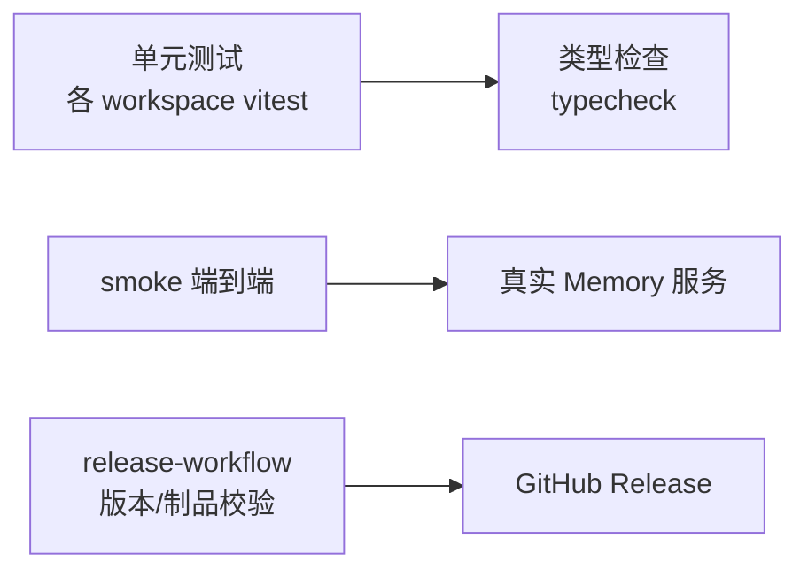

# 12 · 关键算法与测试策略

## 12.1 混合检索算法（核心）

记忆检索（`Memory/src/service/retrieval/retrieval-service.ts` + `algorithm/plugin-algorithms.ts`）是一条四阶管线。本节给出伪代码、关键公式与复杂度。

### 12.1.1 查询准备
```
function prepareQuery(request):
    if evolutionModel and enableQueryRewrite:           # 默认关
        queries = llm.rewrite(request, n=3)             # 3 个互补查询
    else:
        queries = [extractSemantic(request)]            # 提取语义查询 + ≤5 关键词
    # 中文补二字模式；代码/路径/错误文本提取结构化片段
    return queries, keywords, patterns, structuralFragments
```
- 仅当 DB 有可用向量才生成查询向量；查询向量超时/失败时全文/短词/结构通道仍继续。

### 12.1.2 候选生成（6 通道并行）
```
for query in queries:
    candidates += [
        vec.search(vec_summary|vec_action|vec, tierTopK × candidatePoolFactor),  # 向量
        fts.search(keywords, max(tierTopK, keywordTopK)),                         # FTS5
        pattern.search(patterns, ...),                                            # 短词/中文模式
        structural.search(structuralFragments, L1 only, 10)                       # 结构化片段（仅 L1）
    ]
# Tier 截断：Skill 12 / L1 20 / L2 20 / L3 8（tierTopK × candidatePoolFactor，默认 3/5/2 × 4）
```
- 向量池：Tier1 `3×4=12`、Tier2 `5×4=20`、Tier3 `2×4=8`；FTS/pattern 默认 20；合并后按 Tier 截断为 12/20/8。

### 12.1.3 相关度融合（RRF + 层级 bonus）
```
for c in candidates:
    channelScore = max(channelScores[c])                       # 命中通道最高分
    L1_bonus    = min(weightPriority, 0.3) × max(value, 0) × timeDecay
    Skill_bonus = skillEtaBlend × eta
    L2_bonus    = 0.2 × clamp01(gain 或 salience/confidence)
    RRF_bonus   = 0.4 × Σ_channel 1/(rrfConstant + channelRank + 1)   # rrfConstant=60
    relevance[c] = channelScore + layer_bonus + RRF_bonus
```

### 12.1.4 阈值 / episode 聚合 / MMR / LLM 过滤
```
1. 每个 Tier 预排序池按 (relevance, 命中通道数, 向量分) 排序
2. episode 聚合：同 episode ≥2 高位 L1 且轨迹相似度≥0.45 且 value≥0 → 生成 ≤6 步 rollup
3. 丢弃低于最高 relevance 20% 的候选；多通道豁免（命中≥2 通道可保留）
4. 高熵查询：L1/L2 须有 FTS/pattern/structural 关键词确认（Skill/L3 例外）
5. MMR 选择：score = 0.7×relevance − 0.3×redundancy；smart seed 首候选≥全局最高 70%
6. 去重同 episode 单条 L1 与 rollup；Skill 已覆盖同 Policy 时抑制重复 L2
7. LLM 过滤（默认开）：候选≥2 才调，最多留 8，失败回退保 6，可全量丢弃
```

### 12.1.5 复杂度与优化
- **向量检索**：sqlite-vec 在"最近 2000 条同维度向量"窗口内取 Top K，单次查询约 O(2000 × dim) 余弦；窗口常量保证上界。
- **FTS5/pattern**：倒排索引，近似 O(命中文档数)。
- **融合/排序**：候选规模受 Tier 截断（合并后≤40 量级），RRF/MMR 为 O(n²) 冗余计算但 n 小，可忽略。
- **优化建议**：增大 `candidatePoolFactor`/`keywordTopK` 提召回；提高 `minTraceSim`/`relativeThresholdFloor`/`minSkillEta` 降噪；降 `mmrLambda` 增多样性；开 `enableQueryRewrite` 处理多事实问题（代价是额外 LLM 调用）。

## 12.2 奖励传播与 L2 归纳（演化）

```
episode 关闭 → 合成/评分反思 → 等待 feedbackWindowSec(30s) → 计算任务奖励
reward_i = combine(gamma^position 权重, lambda 均匀混合, delta 恢复系数)   # gamma=0.9, lambda=0.5, delta=0.1
反向传播到 episode 内各 L1（priority 按 decayHalfLifeDays=30 时间衰减）

L1 进 L2 候选池条件：value ≥ minTraceValue(0.005) 且已有向量
归纳 L2：与已有 L2 关联相似度 ≥ minSimilarity(0.65)；不同 episode ≥ minEpisodesForInduction(1)
激活 L2 Policy 需 gain ≥ minGain(0.02)；归档阈值 archiveGain(-0.05)
候选证据保留 candidateTtlDays(30)

L3 抽象：L2 聚类相似度 ≥ clusterMinSimilarity(0.3)；召回最低置信度 minConfidenceForRetrieval(0.2)
Skill 结晶：需 minSupport(1)、minGain(0.02)、minEtaForRetrieval(0.1)，经 skill_trial 验证
```
- **复杂度**：演化在后台 `evolution_jobs` 队列异步、按 `dedupe_key` 去重、并发受 `SUMMARY_WORKER_CONCURRENCY=4` 约束；聚类为小规模 L2 间相似度计算。
- **失败处理**：作业 `leased_until` 租约、`attempts/max_attempts`、失败进 `dead_letter`；Embedding 失败进独立 `embedding_retry_queue` 退避重试。

## 12.3 会话压缩（token 预算）

```
# 迭代内（Runner）
dropOrphanToolResults → backfillMissingToolResults
→ microcompact(裁剪超 MICROCOMPACT_KEEP_RECENT=10 的旧 read/exec/grep/web 结果)
→ applyToolResultBudget(按工具名字符上限)
→ snipHistory(超 contextWindowTokens − maxOutput − CONTEXT_SAFETY_BUFFER 丢最旧非系统消息)

# 回合级（Consolidator）—— 超窗时
旧消息 → LLM 摘要 → session.metadata.lastSummary；保留近期后缀
支持 summaryMode:"dag"（经 Session-DAG 队列）

# 空闲归档（AutoCompact）
空闲 > sessionTtlMinutes → 后台归档；下一轮把 lastSummary 作"上次会话摘要"前缀
```
- **token 估计**：用 `tiktoken`（`estimatePromptTokensChain`）。
- **复杂度**：snip 为 O(n) 截断；摘要为按需 LLM 调用。

## 12.4 来源扫描的增量与幂等

```
for source in sources:
    targets = discover(source, since=watermark)        # 水位用 >= 包容边界
    for target in targets:
        conv = collectConversationWindow(target, since) # 整会话，不截断开头
        for msg in conv: emit redactSecrets(map(msg))
# 整理回合（用户开头 + 非空助手结尾）→ memory.add(L1)
去重：会话检查点(最后消息时间/ID/内容哈希) + 稳定来源消息 ID + 回合 ID
回合请求 > 2MiB → 整回合跳过（不截断/不拆分）
仅扫描/导入无错且无不完整/失败 → 推进水位
```

## 12.5 测试策略



| 层级 | 范围 | 命令/位置 |
| --- | --- | --- |
| 单元 | Memory / backend / agent / shell / migrations 各包 | 各 `npm test`（vitest）；根 `npm run workspace:test` |
| 类型 | 全仓库 | `npm run typecheck`（先 `version:sync`） |
| smoke:memory-layer | 真实 Memory 服务：`MemoryDb`+`MemoryService`+stub Embedder，`health→openSession→completeTurn→runWorkerOnce→getMemory` | `npm run smoke:memory-layer`（`tests/smoke/memory-layer-smoke.ts`）+ 计划 `smoke:memory-layer:test` |
| smoke:local-agent-memory | Agent↔Memory 工具契约：captured-fetch `MemmyMemoryClient` + `registerMemmyMemoryTools` 进 `ToolRegistry`，执行 `memmy_memory_search/get`（无真实网络） | `npm run smoke:local-agent-memory`（`:cursor` 变体）+ 计划 `:test` |
| release-workflow | 版本同步与发布资产工作流 | `tests/release-workflow.test.ts`（`test:release-workflow`） |
| TUI | 终端光标交互 | `agent:test:tui-cursor` |

### 主要测试用例说明
- **memory-layer-smoke**：断言 `health` 返回 `{ok,version,storage.backendId:"sqlite-local"}`；`completeTurn` 后 `episodeId/rawTurnId/l1MemoryId` 存在且作业含 `embedding`；`runWorkerOnce` 后 `failed===0`；`getMemory` 返回 `kind:"trace"`/`memoryLayer:"L1"`。
- **local-agent-memory-smoke**：验证 `openSession→startTurn→completeTurn` 与 `memmy_memory_search/get` 工具结果形状，覆盖 store→process→read→recall 的公开契约。
- **migrations**：`0001-add-webui-session-binding` 迁移用指纹检查（`dev`/`ino`/`size`/`mtimeNs`）+ 原子 temp-rename，并有 `runner.test.ts`。
- **backend 路由**：`local-app-route-inventory.test.ts` 做路由清单一致性校验，避免路由漂移。

> 设计评价：测试分层清晰，smoke 直接驱动真实服务（而非纯 mock）可信度高；不足在于算法融合（RRF/MMR/演化）缺独立的黄金集回归基准，建议补充检索质量基准（见 [09](./09-risks-roadmap.md) 改进建议）。

---

> 上一节 ← [11 架构决策记录](./11-adr.md) ｜ 返回 → [文档总入口](./index.md)

---

☕️ 制作不易，请我喝咖啡☕️关注我➕

