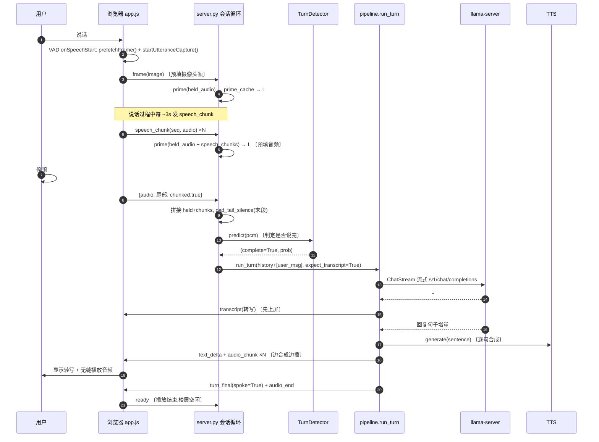
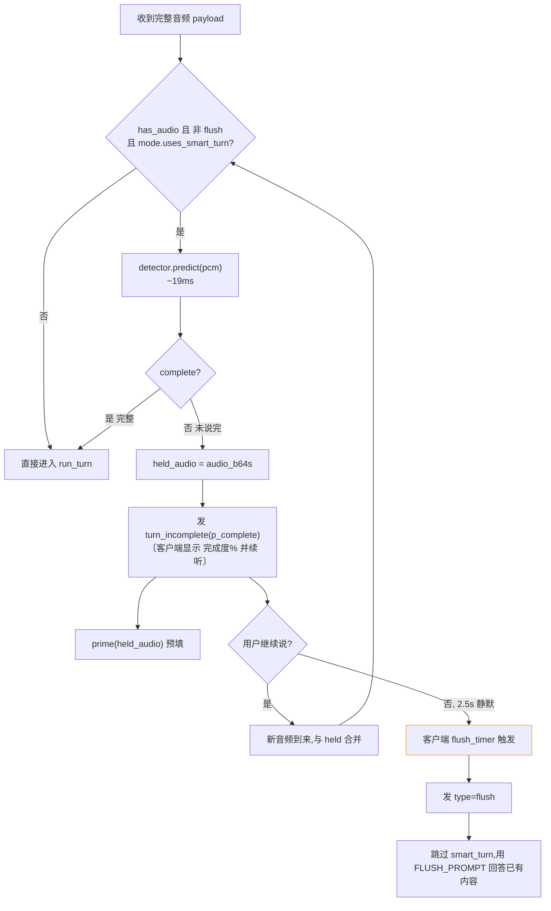
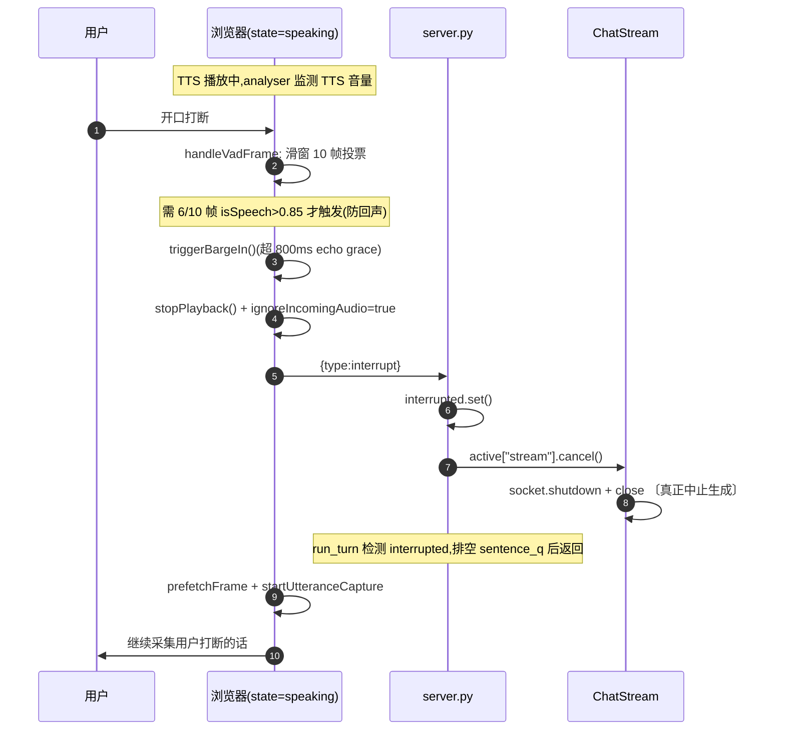
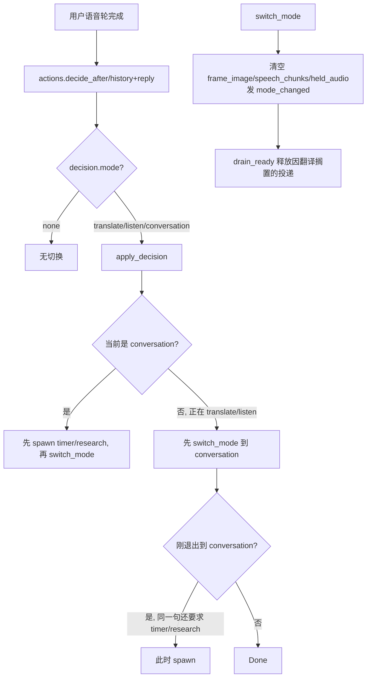
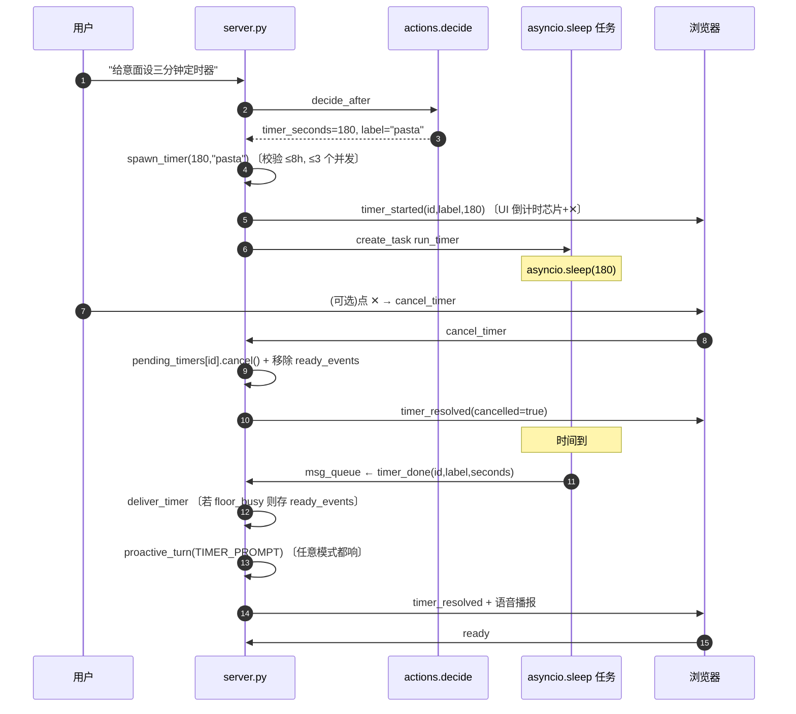
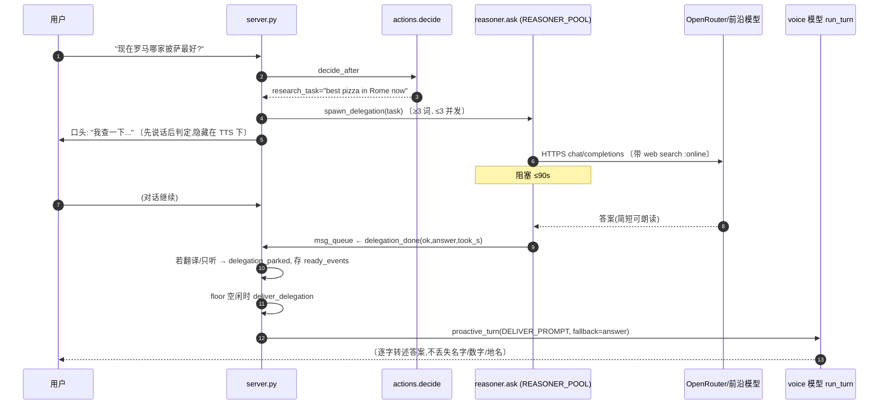
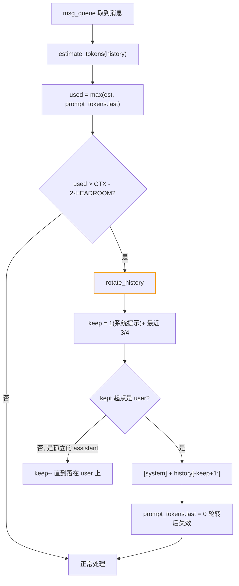
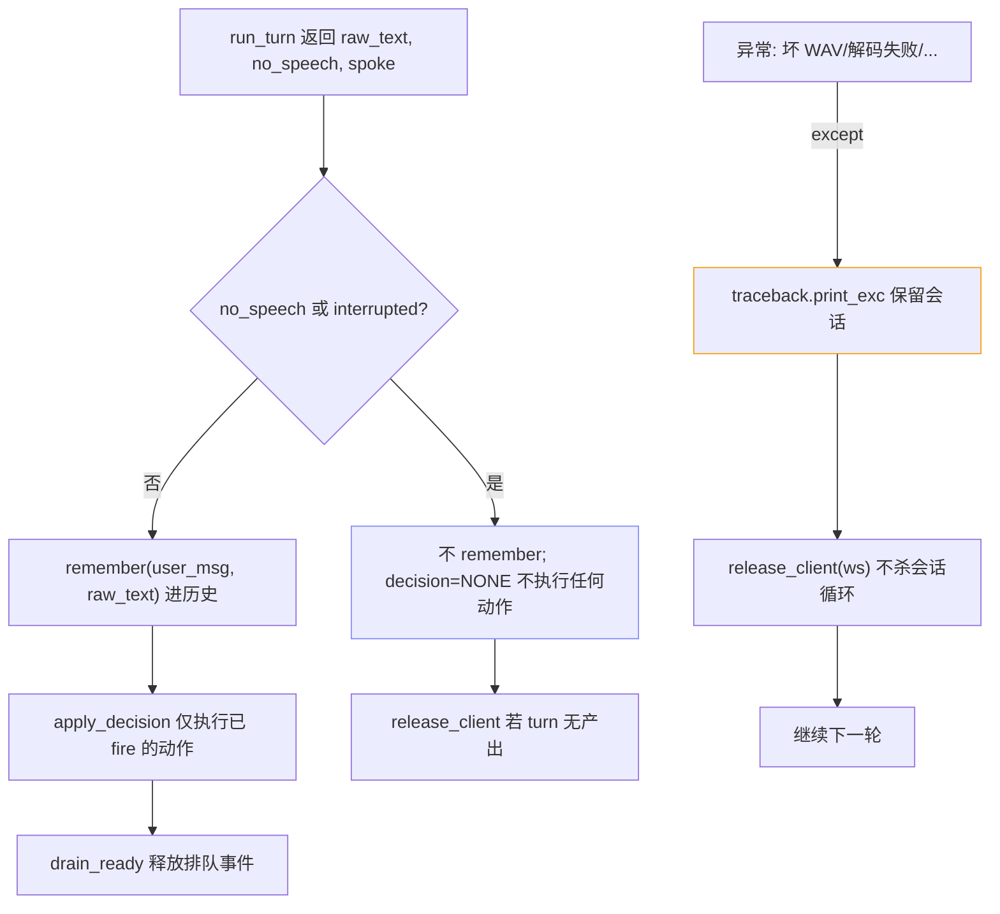

# 03 系统流程与时序图

本章用 Mermaid 绘制 **9 个核心业务流程**,涵盖正常对话、延迟优化、打断、模式、定时器、研究委派、历史管理与失败兜底。每个流程都细化到模块 / 函数级别,并附 300–500 字解读。

---

## 3.1 正常语音轮(端到端)

这是最核心的路径:用户说完一句话到听到回复。



### 解读

这个流程体现了 Parlor 的三个延迟杀手锏:

1. **预取帧 + 重叠预填**:浏览器在 `onSpeechStart` 瞬间(用户刚开口)就发 `frame`,服务端 `prime()` 把图像 token 推过 llama-server 前缀缓存。随后每 ~3s 的 `speech_chunk` 也被 `prime(held_audio + speech_chunks)` 推过缓存。于是当用户说完、最终请求到达时,**前缀已在缓存里,只需处理尾部音频**,长问与短问的首音延迟几乎持平。
2. **transcript 先行**:`run_turn` 用 `StreamParser` 增量解析,`###TRANSCRIPT:` 行一完成就立即推给客户端上屏(此时回复还在解码)。这给了用户「它听懂我了」的即时反馈。
3. **三段重叠流水线**:在 `run_turn` 内部,LLM 解码(executor 线程)→ 句子切分(parser,主循环)→ TTS 合成(`tts_worker` 协程)三者通过 `chunk_q` / `sentence_q` 两个队列重叠。第一个完整句子一旦产生,立刻进入 TTS,无需等整段回复解码完。

注意 `pad_tail_silence` 给末段音频补 0.3s 静音——VAD 在截止处硬切会让音频编码器「幻觉式补全」最后一个词,补一段静音能修复。回复结束后浏览器播放完毕发 `ready`,服务端据此释放「楼层」,允许排队中的委派 / 定时器投递。

---

## 3.2 缓存预热(prime_cache)投机机制

```mermaid
flowchart TD
    A[prime( 当前 held_audio + 新块 )] --> B[prime_cache]
    B --> C[构建 messages: history + user_content(frame, audios)]
    C --> D["llama.chat_blocking(max_tokens=1)\ncache_prompt=True"]
    D --> E{成功?}
    E -->|是| F["打印 Primed cache (Xs)\n前缀进入 llama-server slot 缓存"]
    E -->|否| G["打印 Cache priming failed\n忽略 —— 最终请求照常,只是全量 prefill"]
    F --> H[最终 run_turn 请求命中缓存,只 prefill 尾部]
    style G stroke-dasharray:5 5
```

### 解读

`prime_cache`(`pipeline.py`)是一个**「fire-and-discard」**请求:把当前会话前缀(历史 + 摄像头帧 + 已说的语音块)用 `max_tokens=1` 推过 llama-server 的缓存,目的**不是**要它的输出,而是**让前缀进入它的 slot 缓存**。关键约束来自代码注释:

- **内容必须是「纯媒体追加」**——一个尾随的 text block 会让前缀分叉、缓存失效。所以预热只发 `user_content(image, audios)`(image_part + audio_part),**不带 instruction 文本**。真正的 instruction 在最终 `run_turn` 时才追加,恰好接在已缓存的纯媒体前缀之后。
- **失败不值得上报**:预热失败时,最终 `run_turn` 仍能工作,只是付出全量 prefill。所以异常只打印不抛出。

这个机制与「每次重发全部历史」相辅相成:正是因为每次都重发历史,前缀缓存才让「重发」几乎免费;而预热又把「说的时候」的时间也利用起来。代价是用户说话期间会有多个预热请求打到 llama-server,但因为它们命中彼此的缓存(前缀递增),开销可控。

---

## 3.3 端点判定、Hold 与 Flush(思考停顿)

用户说到一半停顿思考时,系统不能立刻回答,也不能无限等待。



### 解读

这是「思考中途停顿」的处理,是 smart-turn 分类器存在的核心价值:

- 完整路径:`predict` 返回 `complete=True`(prob > 0.5)→ 正常进入 `run_turn`。
- 未说完路径:`complete=False` → 当前音频段存入 `held_audio`,服务端发 `turn_incomplete`(携带 `p_complete` 完成度概率),**并在客户端释放前先发**(客户端在收到它前无法采集续说,flush 计时器也无法看到用户在说话)。客户端把气泡 meta 标为「sounds unfinished (12%) — still listening」并启动 2.5s flush 计时器。
- **续说**:用户继续说话,新音频与 `held_audio` 合并,再判一次——段始终留在下一次请求的内容里且**留在缓存里**(`prime(held_audio)` 已预填),所以续说是无缝的。
- **flush**:用户沉默到 flush 计时器(2.5s)触发,客户端发 `flush`。服务端跳过 smart_turn,用专用 `FLUSH_PROMPT` 回答已有内容(若觉得不完整就给一句鼓励「Take your time」,否则正常回答)。flush 计时器有「不冲掉实时语音」与「一次 hold 一次 flush」的自限制。

模式差异:`translate` / `listen` 的 `uses_smart_turn=False`,翻译在短停顿就渲染、只听模式反正不回答,都不走此分支。

---

## 3.4 打断(Barge-in)

用户在 AI 说话时开口打断。



### 解读

Barge-in 的难点是**回声**:扬声器播的 AI 声音会被自己的麦克风收到,误判为用户说话。Parlor 的解法是多层防线(代码注释里详细记录了踩坑):

1. **滑窗投票门控**(浏览器侧):state=speaking 时,每帧若 `isSpeech > 0.85` 记 1,否则 0;最近 10 帧里 ≥6 帧才触发 barge-in。**必须持续**而非单帧——真实语音在辅音 / 词边界会下陷,「连续帧计数器」永远在真麦上触发不了,而滑窗能。
2. **echo grace period**:TTS 开始后 800ms 内的 VAD 触发被抑制(刚开播最易回声)。
3. **服务端真中止**:`interrupt` → `interrupted.set()` + `stream.cancel()`。`cancel()` 关 socket,llama-server 观察到连接关闭而停止生成。`run_turn` 的 `tts_worker` 检测 `interrupted` 后继续排空 `sentence_q`(但不发音频),生产者线程在 finally 里被 await 确保 slot 干净。
4. **客户端 ignoreIncomingAudio**:打断后,服务端可能还在 flush 最后几个音频块,客户端置 `ignoreIncomingAudio=true` 丢弃它们。
5. **phantom capture 重置**:若 barge-in 其实是回声误触(VAD 没真正进入 speech 状态),`handleVadFrame` 的 watchdog 在 ~1s 低于负阈值后重置采集状态,避免永远向服务端流静音块。

服务端:`interrupted` 标志是粘性的,直到客户端发 `ready`(播放结束或误触后)才清除,防止粘性标志搁浅排队的委派投递。

---

## 3.5 模式切换(翻译 / 只听)



### 解读

模式切换由 **action head**(独立 JSON 请求)判定,而非带内标签。关键设计在 `apply_decision` 与 `switch_mode`:

- **「在转换两端都触发」策略**:`apply_decision` 处理一个微妙场景——「okay, I'm done — set a twenty-minute timer」(用户在退出只听模式的同时要求定时器)。此时退出轮会口头确认,若丢掉它就是「口头承诺却不执行」。因此:普通对话轮直接 spawn;从 translate/listen 退出时,先 `switch_mode`,退出后再 spawn(保持 `spawn_delegation` 的 `allows_delegation` 门控有效)。
- **switch_mode 清状态**:切换会清空 `frame_image` / `speech_chunks` / `held_audio`,因为翻译模式从不解析 hold(见 modes.py),陈旧 held 状态会让 `floor_busy()` 永真、阻塞整个会话的投递。
- **退出释放投递**:`drain_ready()` 离开翻译模式后调用,释放此前因 `allows_delegation=False` 被搁置的研究结果。
- **UI 逃生舱**:客户端模式芯片的 stop 按钮直接发 `set_mode`(不经模型),保证即便模型误听口语退出命令也能强制切回。

`_MODE_CLAUSES`(actions.py)给 head 提供每种模式下的「exit 命令长什么样」的精确描述,例如 listen 模式强调「明确对你说话才退出,自言自语的准问题仍算思考」——这是 e2e 测量出的措辞。

---

## 3.6 定时器(服务端持有时钟)



### 解读

为什么**服务端**而不是模型持有定时器时钟?`benchmarks/timerprobe.py` 给出答案:**turn-based 模型无法在静默中响起**——它只在被请求时生成,沉默期间它什么都不做。所以定时器必须是服务端的 `asyncio.sleep` 任务。

- **spawn 守卫**:`spawn_timer` 校验 `seconds <= MAX_TIMER_S`(8h,超过即误读)与并发数 `<= MAX_PENDING_TIMERS`(3),防止失控决策无限排定响铃。
- **序列化投递**:`run_timer` 到点后不直接播报,而是 `msg_queue.put(timer_done)`,让响铃与真实轮次一样**串行化**(避免在用户说话中途响)。
- **floor 调度**:`timer_done` 到达主循环时若 `floor_busy()`(用户在说 / 音频在播 / hold 中),存入 `ready_events`,在下一个空闲点由 `drain_ready()` 投递。
- **任何模式都响**:`drain_ready` 的扫描逻辑——定时器在任何模式都响(用户设的闹钟),而研究结果要等翻译/只听结束。所以它**扫描而非 pop 队首**:一个搁置的研究答案不能挡住它后面的定时器。
- **cancel**:`cancel_timer` 取消 sleep 任务并从 `ready_events` 移除(已到点但还没响的也清),发 `timer_resolved(cancelled=true)`。

`proactive_turn` 用 `expect_transcript=True`(虽无音频),因为模型常自发以 `###TRANSCRIPT:` 开头,解析器会消费它再流式输出真正播报;若模型只产出标记无内容,`TIMER_FALLBACK`(「Ding — your X timer is done.」)兜底。

---

## 3.7 后台研究委派(Delegation)



### 解读

后台研究是唯一可选的在线外呼,设计上要保证:对话不阻塞、答案不丢失、失败有兜底、不打断自己。

- **触发**:action head 识别「查 / 搜 / 研究 / 当前变化(天气新闻价格)」类请求,产出 `research_task`。`spawn_delegation` 守卫:任务 ≥3 词(防碎片)、并发 ≤3(防失控决策每标签一个 HTTP)。
- **先说话后判定**:对话轮 / 翻译轮先 `run_turn` 说话,**之后**才跑 `decide_after`——这一判定隐藏在 TTS 播放时间里。只听模式相反,先判定(因为它不说话,且退出问句需要被回答而非静默转写)。
- **不阻塞对话**:`run_delegation` 在 `REASONER_POOL`(4 线程,与延迟敏感路径隔离)里 `await run_in_executor(reasoner.ask, task)`。期间用户可继续对话。
- **投递序列化与 parking**:答案到达后 `msg_queue ← delegation_done`。若当前在翻译/只听(`allows_delegation=False`),发 `delegation_parked`(UI 停止转圈),存 `ready_events`;floor 忙时也存。空闲时 `deliver_delegation` 调 `proactive_turn(DELIVER_PROMPT)`——**由 voice 模型逐字转述答案**(保持一个声音、与对话挂钩),且要求「永不丢改名字/数字/地名」;若模型转述失败,`fallback=answer` 直接 TTS 朗读。
- **失败兜底**:`ask` 抛异常 → `delegation_done(ok=False)` → `DELIVER_FAILED_PROMPT`(「抱歉,这条没查到,欢迎再问」)。一次失败可重试一次(`redelivered`)。
- **答案截断**:`len(answer) > 1500` 时按句截断(小 LLAMA_CTX 下避免撑爆)。

`RESEARCH_NOTE` 系统提示是「承重」的:它让模型把当前/变化类问题交给后台,但末尾「everything else, answer yourself」防止模型在历史里见过一次「我去查」后,连「法国首都」这种稳定知识也推诿。

---

## 3.8 历史轮转(Context Rotation)



### 解读

模型上下文有限(`LLAMA_CTX` 默认 16384),长会话必须轮转。设计要点(全在 `server.py` 主循环 + `rotate_history`):

- **用真实 token 数驱动**:`used = max(estimate_tokens(history), prompt_tokens["last"])`。估算会漂移(尤其摄像头轮),`prompt_tokens["last"]` 来自 llama-server 最后一次请求的 usage,是**真实**计数。早期版本用固定 2000 阈值,在小 `LLAMA_CTX` 下几乎为零阈值,每轮都轮转——历史永远累积不起来,e2e 多轮上下文测试被静默跳过。这个 bug 的修复就是用真实计数。
- **HEADROOM 随 CTX 缩放**:`CONTEXT_HEADROOM = max(512, min(2000, CTX//8))`,双倍因为进来这轮还没计入。
- **丢 1/4 而非一半**:`rotate_history` 保留系统提示 + 最近 3/4,让一次轮转几乎不可察觉。
- **必须落在 user 消息上**:丢弃最旧的 1/4 后,kept 切片起点必须是 user——否则会留下「孤立 assistant」(回答着已不存在的用户词)。`while keep>3 and history[-(keep-1)].role != 'user'` 调整。
- **≤3 条直接返回**:只有 [system] 或单轮时不可轮转(切片会复制系统提示)。

历史在内存里是 OpenAI 消息列表,`remember()` 只存「产生了内容且非 no_speech」的轮——退化消息会毒化后续每个请求。

---

## 3.9 失败兜底与「不毒化历史」(鲁棒性主路径)



### 解读

这是贯穿整个会话循环的**鲁棒性哲学**:一个坏轮不能拖垮整个会话。三条防线:

1. **不毒化历史(`remember` / `no_speech`)**:两类轮**永不入历史**——(a) 模型没产出任何内容的轮;(b) `no_speech` 轮(transcript 是 no-speech 标注或指令回声,无用户词撑腰)。代码注释记录:一个存进去的回声循环,让之后每轮都返回捏造/复制的用户词。`no_speech` 由 `clean_transcript`(NO_SPEECH_RE 标注形状 + `echoes_instruction` 指令回声检测)判定。
2. **动作只在 fire 后入历史**:`apply_decision` 只执行确实触发的动作,`decision = NONE` 当 no_speech/interrupted。一个被丢弃的动作不能教模型一个服务端没有的状态。
3. **异常不杀会话**:从「有内容」开始的任何失败(坏 WAV——`valid_audio` 只查长度)都 `try/except` + `traceback.print_exc` + `release_client`,**保留会话循环**继续下一轮。只有 `DISCONNECT_ERRORS`(WebSocketDisconnect / ClientDisconnected)才真正终止。`release_client` 发一个 `turn_final(spoke=False)` 终止帧,否则客户端会卡在 processing 直到看门狗触发。

这套兜底是 v2 可靠性提升的核心:`CHANGELOG` 列出的「一声呼吸不能再变成捏造用户词 / 自己回答自己 / 切换模式」「指令文本永不被当作用户词显示或朗读」「坏 WAV 不能毒化历史」都落在这条主路径上。

---

下一章:[04 模块结构与依赖](04-modules.md)

---

☕️ 制作不易，请我喝咖啡☕️关注我➕

