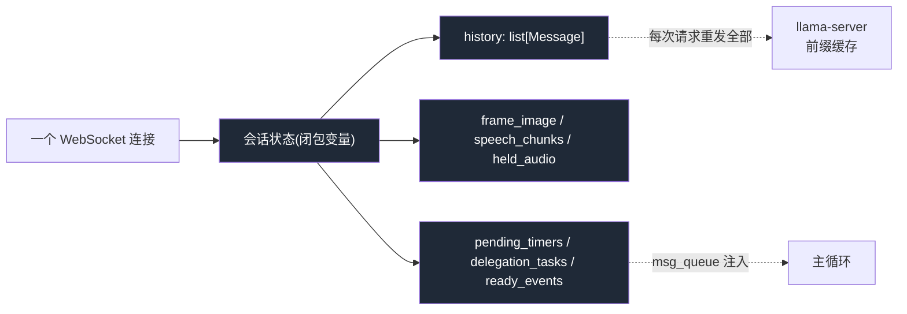
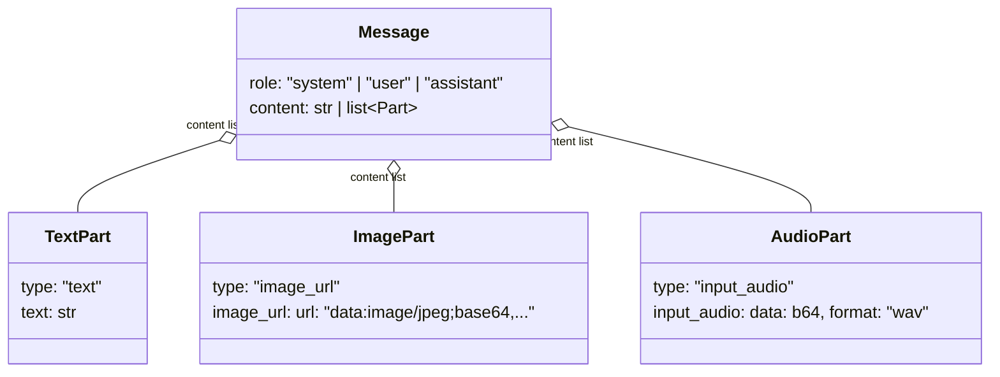
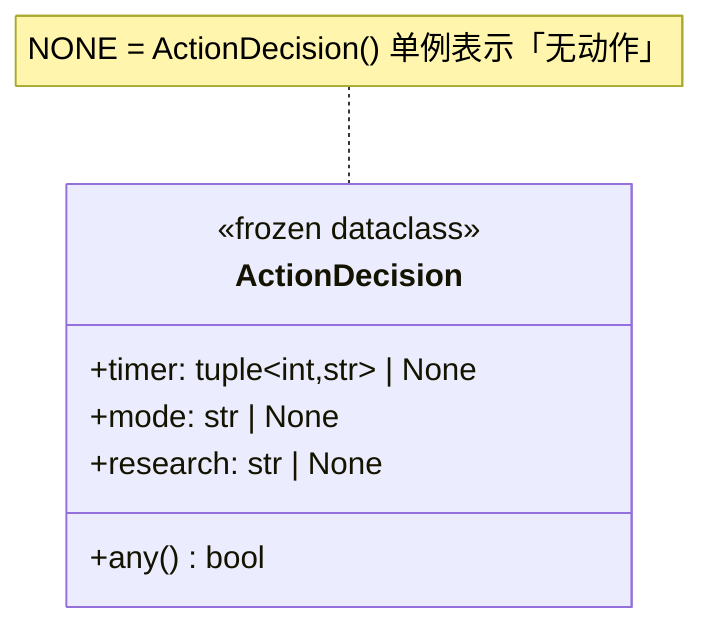
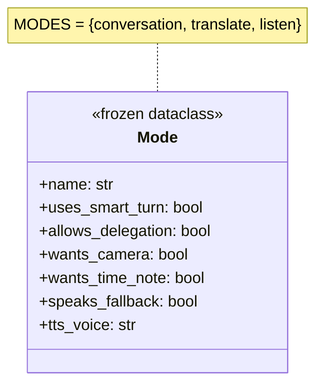

# 06 数据模型与会话状态

> **诚实声明**:Parlor **没有传统数据库、没有持久化层、没有 ORM**。这是一个「每连接内存会话、连接断开即销毁」的无状态服务。本章据实描述其**内存数据结构**:会话历史、消息 Part schema、会话状态闭包、关键数据类。不臆造任何 ER 图 / 表结构。

---

## 6.1 整体数据形态



系统的「数据库」就是 `server.py` `websocket_endpoint` 协程闭包里的几个 Python 变量。它们随连接创建、随连接销毁,不落盘、不跨连接共享。

---

## 6.2 会话历史(`history`)

核心数据结构是一个 **OpenAI Chat Completions 格式的消息列表**:



### 初始化(server.py:340)
```python
history = [{"role": "system", "content": system}]   # 唯一 str 内容
```
`system` 在连接时一次性拼装:`SYSTEM_PROMPT + SESSION_CLOCK + CAPABILITY_NOTE + (RESEARCH_NOTE if delegation else "")`。它是前缀缓存的前缀,**后续每轮重发**,所以必须稳定。

### 用户轮消息(807)
```python
user_msg = {"role":"user", "content": content + [text_part(instruction)]}
```
`content = user_content(image, audio_b64s)`(image_part + audio_part 们,缓存稳定顺序)+ 一个 text_part(轮指令)。**语音轮保留原始音频**——实验证明存转写文本会让模型复制上一轮文本为新 transcript。

### 记忆规则(`remember`,372–388)
```python
if not raw_text.strip() or no_speech:
    return     # 两类永不入历史
history.append(user_msg)
history.append({"role":"assistant","content":raw_text})
```
**永不入历史**:无内容轮、no_speech 轮——退化消息毒化后续每个请求。

### 轮转(`rotate_history`,274–286)
超 `CTX - 2*HEADROOM` 时,保留 `[system] + 最近 3/4`,强制落在 user 消息上(防孤立 assistant)。

---

## 6.3 关键数据类

### `ActionDecision`(actions.py:86–97)


### `Mode`(modes.py:19–27)


### `Turn`(tests/util.py:51–61,测试用)
```python
@dataclass
class Turn:
    marker: str = "timeout"   # complete | incomplete | released | timeout
    text: str = ""
    transcription: str | None = None
    audio_chunks: int = 0
    p_complete: float | None = None
    timings: dict = field(default_factory=dict)
```

### `Server`(tests/conftest.py:97–108,测试设施)
```python
@dataclass
class Server:
    url: str
    proc: subprocess.Popen | None = None
    log_path: Path | None = None
```

---

## 6.4 会话状态闭包(server.py:368–400)

每个连接协程持有的可变状态(用 dict/list 包裹以便嵌套函数修改):

| 变量 | 类型 | 含义 | 生命周期 |
|------|------|------|---------|
| `frame_image` | `str\|None` | 当前 utterance 持有的摄像头帧 b64(已预填) | 每轮用后清 |
| `speech_chunks` | `list[str]` | 已流式送达、已预填的语音块 | 每轮清 |
| `held_audio` | `list[str]` | incomplete 轮暂存音频段 | 续说合并 / flush 清 |
| `history` | `list[Message]` | 对话历史 | 连接内累积,轮转 |
| `mode` | `Mode` | 当前模式 | 切换改 |
| `interrupted` | `asyncio.Event` | barge-in 标志(粘性至 ready) | set/clear |
| `active` | `dict` | `{"stream": ChatStream}` 当前流(供 cancel) | 每轮 set/None |
| `msg_queue` | `asyncio.Queue` | 客户端 + 后台事件队列 | 连接内 |
| `delegation_tasks` | `set[Task]` | 进行中研究任务 | 完成移除 |
| `ready_events` | `list[dict]` | floor 忙时待投递事件 | drain_ready 取 |
| `pending_timers` | `dict[int,Task]` | {id: ring 任务} | 响/取消移除 |
| `playing_since` | `dict["t":float]` | 最近回复播放时间戳 | ready 清 |
| `last_activity` | `dict["t":float]` | 线路最后活跃 | 每轮更新 |
| `prompt_tokens` | `dict["last":int]` | 真实上下文大小 | 轮转后置 0 |

---

## 6.5 「无持久化」的设计权衡

| 维度 | 现状 | 权衡 |
|------|------|------|
| **隐私** | ✅ 对话永不落盘 | 这正是项目核心卖点 |
| **崩溃恢复** | ❌ 服务重启 = 全部会话丢失 | 单用户本地用例可接受;重连=新会话 |
| **多设备** | ❌ 无跨设备同步 | 不在目标场景内 |
| **审计** | ❌ 无历史可查 | 隐私优先,有意为之 |
| **资源** | ✅ 无 DB 进程、无磁盘 IO | 降低单机负载 |

### 若需持久化(未来方向,非现状)
- **会话存档**:可把 `history`(脱敏 audio,只留 transcript)序列化为 JSON 落盘,重连恢复。
- **跨设备**:需引入云同步,违背「端侧」前提——除非用户显式 opt-in。
- **键值存储**:若加 SQLite 存「会话 ID → history」,需处理 audio b64 体积(语音轮历史很重)。

> **结论**:无持久化是 Parlor 隐私定位与单用户场景下的**有意架构决策**,不是缺失。任何持久化都应作为 opt-in 扩展,而非默认。

---

下一章:[07 API 与接口设计](07-api.md)

---

# ❤️ 制作不易，请我喝咖啡☕️关注我➕

