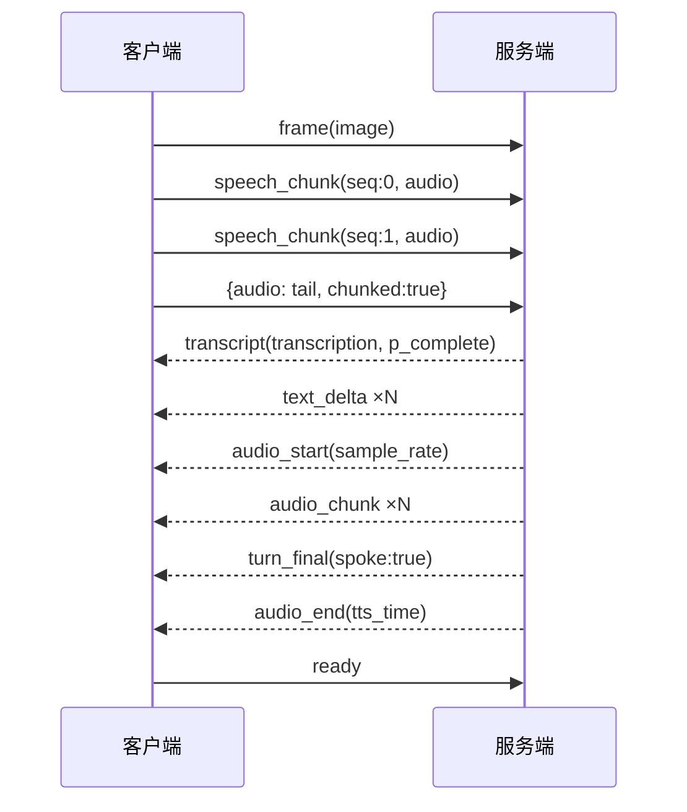
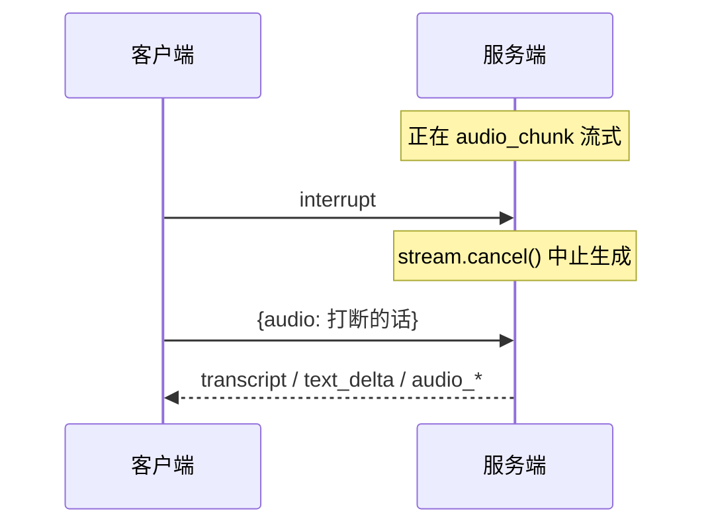
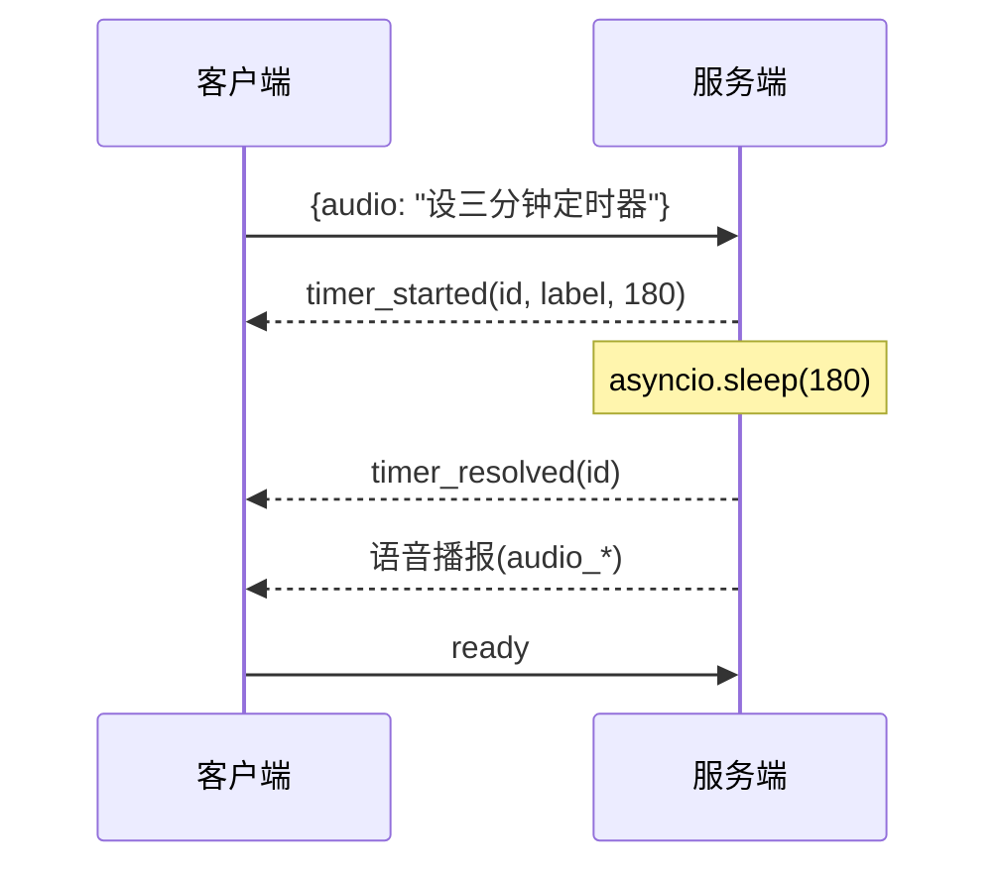

# 07 API 与接口设计

Parlor 对外只有 **2 个 HTTP 端点 + 1 个 WebSocket 端点**。本章给出完整协议规范。

---

## 7.1 端点总览

| 方法 | 路径 | 用途 |
|------|------|------|
| GET | `/` | 返回 `index.html`(`{{model}}` 替换为模型标签) |
| GET | `/static/*` | 静态资源(app.js / style.css) |
| WS | `/ws` | 实时双向通信(音频/帧/控制 + 转写/音频/事件) |

服务仅监听 `localhost`(非 0.0.0.0),因为浏览器只把 `http://localhost` 当安全上下文,否则 `getUserMedia` 不存在。

---

## 7.2 WebSocket 协议(`/ws`)

单一 WebSocket,JSON 文本帧,无子协议、无认证、无版本协商(客户端与服务端同源部署,版本一致)。**方向由消息结构隐含**,无独立通道。

### 客户端 → 服务端

| `type` | 字段 | 触发场景 | 服务端行为 |
|--------|------|---------|-----------|
| (无 type,默认轮) | `audio`(b64 WAV,可选)、`image`(b64 JPEG,可选)、`chunked`(bool,可选)、`text`(文本轮,可选) | VAD speech end | 完整一轮:拼接音频、pad 尾静音、smart-turn 判定、run_turn |
| `speech_chunk` | `seq`(int,首块=0)、`audio`(b64 WAV) | 说话中每 ~3s | 追加 speech_chunks + prime 预填 |
| `frame` | `image`(b64 JPEG) | speech start 瞬间预取 | 存 frame_image + prime 预填 |
| `flush` | — | incomplete 轮 2.5s 静默 | 跳过 smart-turn,FLUSH_PROMPT 回答 held_audio |
| `interrupt` | — | barge-in | `interrupted.set()` + `stream.cancel()` 真正中止生成 |
| `ready` | — | 播放结束 / 误 barge-in / 空闲 | 清 playing_since/interrupted,drain_ready 投递排队事件 |
| `set_mode` | `mode`("conversation"\|"translate"\|"listen") | UI 模式芯片 stop | switch_mode(UI 逃生舱,不经模型) |
| `cancel_timer` | `id`(int) | 定时器芯片 ✕ | 取消 sleep 任务 + 清 ready_events,timer_resolved(cancelled) |

**音频格式**:16kHz、单声道、s16 PCM、WAV 容器,base64 编码(`app.js` `float32ToWavBase64`)。`valid_audio` 要求 ≥ ~100ms(`len*3//4 > 44+3200`)。

**图像格式**:JPEG,base64(data URL 前缀在服务端加)。客户端缩放到宽 320,质量 0.7。

### 服务端 → 客户端

| `type` | 字段 | 含义 |
|--------|------|------|
| `transcript` | `transcription`(str)、`p_complete`(float\|null) | 转写先行上屏(transcript 行完成即推,回复仍在解码) |
| `turn_incomplete` | `decision_s`(float)、`p_complete`(float) | smart-turn 判未说完;客户端续听 + 启 flush 计时器 |
| `text_delta` | `text`(str) | 回复句子增量(逐句) |
| `audio_start` | `sample_rate`(int,默认 24000) | TTS 流开始 |
| `audio_chunk` | `audio`(b64 Int16 PCM)、`index`(int) | TTS 音频块(Int16 PCM,非 WAV,裸采样) |
| `audio_end` | `tts_time`(float) | TTS 流结束 |
| `turn_final` | `transcription`(str\|null)、`proactive`(bool)、`timings`(dict)、`p_complete`(float\|null)、`spoke`(bool) | 轮终态。`spoke=False` 客户端不等 audio_end;`proactive=True` 不填用户气泡 |
| `mode_changed` | `mode`(str) | 模式切换确认 |
| `delegation_started` | `id`(int)、`task`(str) | 研究任务开始(客户端显示 chip) |
| `delegation_parked` | `id`(int) | 答案就绪但翻译/只听中,chip 停转圈 |
| `delegation_resolved` | `id`(int)、`ok`(bool) | 即将作为语音轮投递 |
| `timer_started` | `id`(int)、`label`(str)、`seconds`(int) | 定时器开始(客户端显示倒计时 chip) |
| `timer_resolved` | `id`(int)、`cancelled`(bool,可选) | 定时器响/取消 |

### `timings` 字典(run_turn 收集)
```json
{
  "prefill_s": 0.312,   // 首个 token 到达(含模型加载/缓存命中)
  "transcript_s": 0.5,  // transcript 行完成(transcript 轮)
  "llm_time": 1.2,      // 整轮 LLM 时间
  "decode_s": 0.9,      // 纯解码(llm_time - prefill_s)
  "ttfa_s": 0.7,        // 首音延迟(到第一个音频块)
  "tts_time": 0.8       // TTS 总耗时
}
```

---

## 7.3 典型交互序列

### 正常语音轮


### 打断


### 定时器


---

## 7.4 REST 接口细节

### `GET /`
返回 `text/html`。读取 `web/index.html`,`{{model}}` → `model_label()`(如 "Gemma 4 E4B")。无查询参数。

### `GET /static/{file}`
`StaticFiles` 挂载,直接返回 `web/static/` 下文件(app.js / style.css)。无鉴权(localhost)。

---

## 7.5 内部接口(llama-server,非对外)

Parlor 服务端 ↔ llama-server 子进程用 **OpenAI 兼容 `/v1/chat/completions`**(127.0.0.1:8081):

| 字段 | 值 | 说明 |
|------|---|------|
| `messages` | OpenAI 格式 | 每次重发全部历史 |
| `max_tokens` | 256(语音)/ 192(action)/ 1(预热) | |
| `temperature` | 0.7(语音)/ 0.0(action) | |
| `stream` | true/false | |
| `cache_prompt` | **true** | 前缀缓存(每次重发历史的基础) |
| `chat_template_kwargs.enable_thinking` | false | 关 Gemma 4 thinking |
| `response_format` | json_schema(action head) | llama-server 编译为 grammar |
| `stream_options.include_usage` | true(stream) | 末 chunk 带 prompt_tokens |

健康检查:`GET /health` → 200。

---

## 7.6 设计观察

- **无鉴权 / 无版本**:同源 localhost 部署,客户端服务端版本绑死,无需协商。简化协议但绑死部署。
- **音频块用裸 Int16 PCM**(`audio_chunk`)而非 WAV:客户端已知采样率(`audio_start`),省 44 字节头 × N 块。
- **`spoke` / `proactive` 等布尔标志**:让客户端精确区分「无音频轮」「服务端发起轮」,避免错误 UI(如填用户气泡)。
- **无错误码**:失败靠 `turn_final(spoke:false)` + processing 看门狗兜底,无显式 error 帧。

### 改进点
1. **无协议版本号**:服务端升级改协议会静默破坏旧客户端(实际同源升级,风险低)。
2. **无心跳/ping**:WebSocket 自带 ping/pong(uvicorn),但应用层无;网络挂起靠 onclose 重连。
3. **音频块无序保证**:`index` 字段提供但客户端按到达顺序播放(无重排)。

---

下一章:[08 部署、运维与基础设施](08-deployment.md)

---

# ❤️ 制作不易，请我喝咖啡☕️关注我➕

