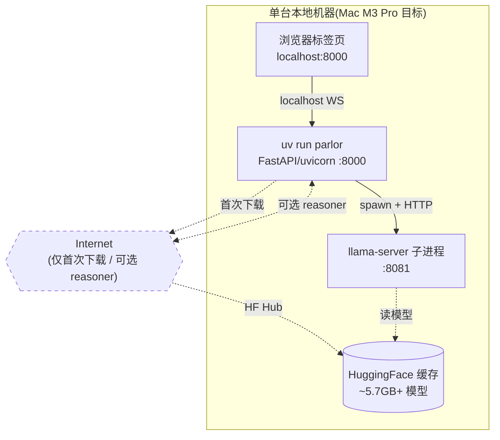
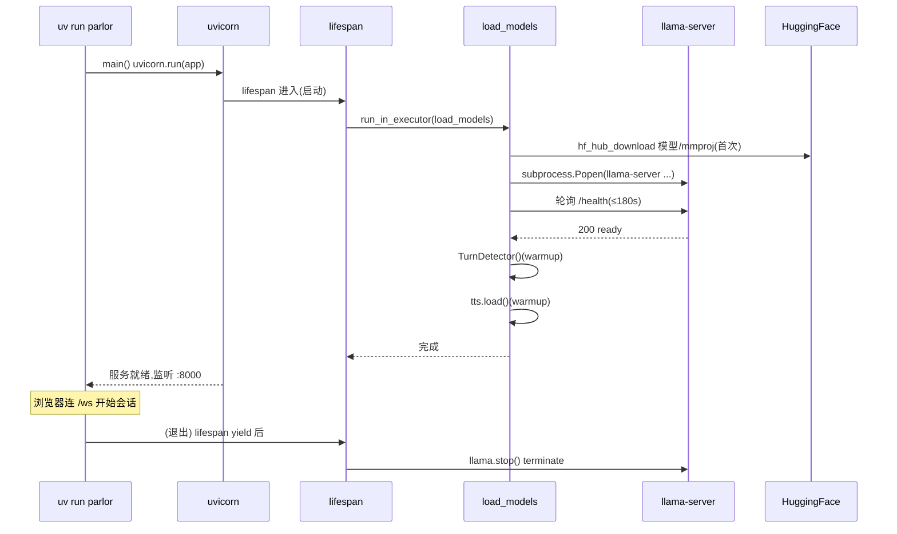

# 08 部署、运维与基础设施

> **诚实声明**:Parlor 是面向**单机本地**的个人/研究项目,**仓库内无 Dockerfile、无 Kubernetes、无 CI/CD 流水线**(`.github/` 不存在)。本章据实描述本地部署、启动流程、资源占用与运维要点,不虚构任何容器编排或自动化部署。

---

## 8.1 部署架构



部署就是「一台机器上跑 `uv run parlor`」。无多机、无负载均衡、无服务发现。

---

## 8.2 前置要求

| 项 | 要求 | 来源 |
|----|------|------|
| Python | **3.12+**(>=3.12,<3.13) | pyproject.toml |
| 包管理 | uv | README |
| **llama.cpp** | build **b9503+**(2026 年 6 月);`MODEL=12b` 需 **b9512+**。macOS `brew install llama.cpp` | llama.py MIN_BUILD / README |
| 硬件 | macOS Apple Silicon(优先),或 Linux + 支持的 GPU | pyproject 平台条件依赖 |
| 内存 | E4B ~6GB;E2B ~4GB;12B ~8GB | README |
| 磁盘 | ~5.7GB(E4B QAT + mmproj + TTS 模型) | README |

---

## 8.3 快速启动

```bash
git clone https://github.com/fikrikarim/parlor.git
cd parlor
curl -LsSf https://astral.sh/uv/install.sh | sh   # 装 uv(若无)
brew install llama.cpp                              # macOS 装 llama.cpp(若无)
uv sync                                             # 装依赖(建 .venv)
uv run parlor                                       # 启动
```
打开 `http://localhost:8000`,授权摄像头/麦克风。

`uv run parlor` 实际执行 `[project.scripts] parlor = "parlor.server:main"`,即 `uvicorn.run(app, host="localhost", port=8000)`。

---

## 8.4 启动流程详解(`server.py` lifespan + `load_models`)



启动要点:
1. **`load_dotenv()` 在 import 时**:`server.py` 顶部 `load_dotenv()`,且 `llama.py` 也单独 `load_dotenv()`(config import 时读)。
2. **`sys.stdout.reconfigure(line_buffering=True)`**:日志即使被 pipe 也行缓冲流式。
3. **模型预热**:`TurnDetector` 与 `TTSBackend` 加载后各跑一次 warmup,避免首轮用户请求卡顿。
4. **llama-server 就绪探测**:`/health` 轮询最多 180s,子进程早退立即报错。

---

## 8.5 模型自动下载

`llama.resolve_model_paths()` / `TurnDetector.__init__` / `tts` 各自用 `huggingface_hub.hf_hub_download`:
- **在线**:首次从 HF Hub 下载。
- **离线兜底**:`local_files_only=True`(已缓存时)。
- 下载资产:Gemma 4 GGUF + mmproj、smart-turn-v3.2-cpu.onnx、Kokoro 模型 + voices。

> 无显式预下载命令;首次 `uv run parlor` 自动拉取(需联网 + HF 访问)。

---

## 8.6 配置(`.env` / 环境变量)

完整清单见 [`docs/configuration.md`](../configuration.md) 与 [§01 技术栈](01-overview.md)。关键分组:

| 组 | 变量 |
|----|------|
| 模型 | `MODEL`(e2b/e4b/12b)、`MODEL_PATH`、`MMPROJ_PATH` |
| 服务 | `PORT`(8000) |
| llama.cpp | `TEMPERATURE`(0.7)、`LLAMA_CTX`(16384)、`LLAMA_PORT`(8081)、`LLAMA_SERVER_URL` |
| reasoner | `REASONER_API_KEY`(总开关)、`REASONER_BASE_URL`、`REASONER_MODEL`、`REASONER_WEB_SEARCH`、`REASONER_TIMEOUT` |
| 行为 | `TIME_NOTE_MIN_S`(120) |
| TTS | `KOKORO_ONNX`(调试逃生舱) |
| 测试 | `PARLOR_TEST_URL` |

**配置在 import 时读取**,改配置需重启。

---

## 8.7 运维要点

### 日志
- 仅 `print()` 到 stdout(line-buffered)。无结构化日志、无级别、无文件轮转。
- 关键诊断行:`Primed cache (Xs)` / `Cache priming failed` / `LLM (Xs, prefill Ys) heard: ... → ...` / `Turn detector: p(complete)=X.X (Yms)` / `Action decision: ...` / `Mode → X` / `Delegation #N: ...` / `Timer #N: Ns 'label'`。

### 监控
- **无 metrics / prometheus / 告警**。延迟靠 `benchmarks/bench.py` 手动测;`timings` 字典随 `turn_final` 回客户端,前端显示(`first audio Xs · model Ys · tts Zs`)。

### 资源
- GPU:`-ngl 99` 全层上 GPU(Apple Silicon Metal)。
- CPU:smart-turn 限 2 线程;reasoner 专用 4 线程池;默认 executor 服务延迟敏感路径。
- 内存:模型常驻;会话历史在内存(audio b64 较重,靠 `LLAMA_CTX` + 轮转约束)。

### 故障恢复
- **无自动重启**:llama-server 崩溃 → 下次请求暴露 `RuntimeError`。
- **测试兜底**:`tests/conftest.py` `shutdown()` 额外 `kill $(lsof -ti :LLAMA_PORT)` 清孤儿子进程。

---

## 8.8 测试基础设施(部署验证)

`uv run pytest`(~1 分钟 + 模型加载)拉起**真实服务端子进程**(真实 llama.cpp/TTS/turn detector)在专用端口(8821/8822/8823),用合成语音驱动,含退化音频。详见 [§13 测试策略](13-testing.md)。`PARLOR_TEST_URL=ws://localhost:8000/ws` 可指向已运行服务。

---

## 8.9 安全考量

| 维度 | 现状 |
|------|------|
| **网络暴露** | 仅 localhost,不暴露公网 |
| **认证** | 无(localhost 同源) |
| **传输加密** | 无 TLS(localhost,WS 非 WSS) |
| **输入校验** | `valid_audio`(长度)、JSON 解析;坏 WAV try/except 不杀会话 |
| **API key** | `REASONER_API_KEY` 在 env;出现在 reasoner.py HTTP 头;若用 token-in-URL 方式(非本项目)需轮换提醒 |
| **依赖供应链** | 标准 PyPI + HF 模型;无校验(信任上游) |

> 单机本地 + localhost 的部署模型天然规避了多数网络攻击面。若要远程访问(不推荐),需自加反向代理 + TLS + 鉴权。

---

## 8.10 「无 CI/CD」的诚实评估

仓库无 `.github/workflows/`、无 Dockerfile、无 Makefile。质量保障靠:
1. **测量驱动**:`benchmarks/` 每个决策可复现(改前改后跑 bench + compare)。
2. **e2e 套件**:本地 `uv run pytest` 手动跑。
3. **详细注释 + CHANGELOG**:决策理由与版本脉络可追溯。

**改进方向**(非现状):可加 GitHub Actions 跑 e2e(需 macOS runner + llama.cpp,成本高)、加 Dockerfile(但 GPU/Metal 访问在容器内复杂)、加 release 自动化。

---

下一章:[09 改进建议、风险与未来规划](09-improvements.md)

---

# ❤️ 制作不易，请我喝咖啡☕️关注我➕

