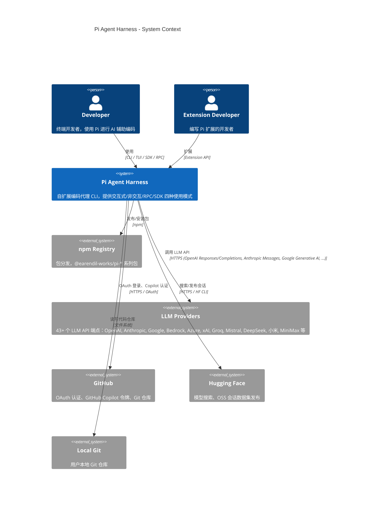
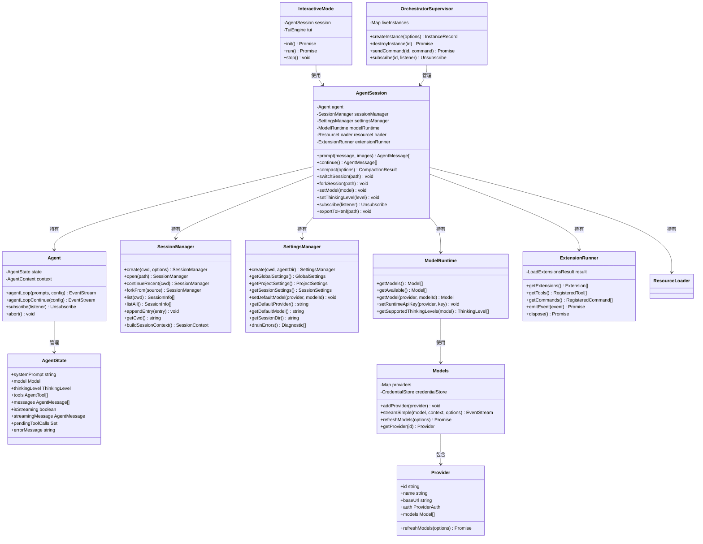

# 第二部分：C4 架构模型

## 2.1 C4 模型概述

C4 模型是一种软件架构文档方法，包含四个层级：
- **Context（上下文）**：系统与外部用户和系统的关系
- **Container（容器）**：系统内部的主要可执行单元
- **Component（组件）**：容器内部的组件结构
- **Code（代码）**：组件内部的类/接口层次

以下使用 Mermaid 图表语法绘制 Pi 的 C4 架构。

---

## 2.2 Context 图（系统上下文）



### Context 图详解

**系统边界**：Pi Agent Harness（以下简称"Pi"）是图中的核心系统，它不是一个单一程序，而是一个由 5 个 npm 包组成的 monorepo，对外交付 `pi` 命令行工具和 SDK。

**外部用户**：
- **Developer（开发者）**：Pi 的主要用户。通过四种方式与 Pi 交互：(1) CLI 命令行参数（`pi -p "prompt"`）；(2) TUI 交互模式（全屏终端界面）；(3) SDK 程序化调用（`createAgentSession()`）；(4) RPC 模式（通过 JSONL 协议与 Pi 进程通信，供 IDE 插件等外部工具使用）。
- **Extension Developer（扩展开发者）**：编写 TypeScript 扩展包，通过 Extension API 为 Pi 添加自定义工具、命令、UI 组件。扩展通过 `npm install` 安装，由 Pi 运行时发现并加载。

**外部系统**：
- **npm Registry**：Pi 的发布渠道。5 个子包（`pi-ai`、`pi-agent-core`、`pi-coding-agent`、`pi-tui`、`pi-orchestrator`）通过 GitHub Actions 自动发布到 npm，使用 trusted publishing（OIDC）机制，无需本地 npm publish。
- **LLM Providers**：Pi 支持 43 个 LLM 提供商，每个提供商对应一个或多个 API 端点。Pi 通过统一的 provider 接口调用这些 API，支持 OpenAI Responses、OpenAI Completions、Anthropic Messages、Google Generative AI、AWS Bedrock Converse Stream 等 18 种 API 变体。
- **GitHub**：承担双重角色：(1) OAuth 认证端点，用于 GitHub Copilot 令牌获取；(2) Git 仓库托管，Pi 通过 `hosted-git-info` 解析仓库 URL。
- **Hugging Face**：Pi 的扩展功能，支持搜索开源模型（通过 Hugging Face Hub API）和发布 OSS 编码会话数据集。
- **Local Git**：Pi 操作的对象——用户的本地 Git 仓库。Pi 读写文件、执行 shell 命令都在仓库目录中进行。

**设计 Rationale**：Context 图清晰地划定了 Pi 的责任边界——Pi 是一个**消费者**（调用 LLM API、读写 Git 仓库），而不是服务提供者。Pi 不对外暴露 HTTP API（除了 orchestrator 的实验性 serve 模式），所有交互都通过 CLI/SDK/RPC 在本地完成。这种设计使得 Pi 可以完全离线运行（当使用本地或缓存的模型目录时），并且用户的数据（代码、会话）始终保留在本地。

---

## 2.3 Container 图（容器视图）

```mermaid
C4Container
  title Pi Agent Harness - Container View

  Person(dev, "Developer", "终端开发者")

  System_Boundary(pi_system, "Pi Agent Harness") {
    Container(cli, "pi CLI", "Node.js / Bun", "命令行入口：参数解析、模式分发")
    Container(sdk, "SDK", "TypeScript", "程序化 API：createAgentSession, createAgentSessionRuntime")
    Container(rpc, "RPC Entry", "JSONL over stdio", "JSONL 协议入口：命令/事件/UI 桥接")

    Container_Boundary(coding_agent, "pi-coding-agent Package") {
      Container(interactive, "Interactive Mode", "TUI", "全屏交互模式")
      Container(print, "Print Mode", "stdout", "非交互文本输出模式")
      Container(rpc_mode, "RPC Mode", "JSONL", "RPC 协议处理")
    }

    Container_Boundary(agent_core, "pi-agent-core Package") {
      Container(agent, "Agent Runtime", "TypeScript", "agent 循环、状态管理、工具调度")
      Container(harness, "Harness", "TypeScript", "会话存储、压缩、skills、system prompt")
    }

    Container_Boundary(ai_pkg, "pi-ai Package") {
      Container(models, "Models", "TypeScript", "Provider 集合、模型发现、流式调用")
      Container(auth, "Auth System", "TypeScript", "OAuth、API Key、凭证存储")
      Container(providers, "Providers (43+)", "TypeScript", "各 provider 工厂实现")
      Container(apis, "APIs (18)", "TypeScript", "各 API 协议实现")
    }

    Container_Boundary(tui_pkg, "pi-tui Package") {
      Container(tui_engine, "TUI Engine", "TypeScript", "差分渲染、终端控制")
      Container(tui_components, "TUI Components", "TypeScript", "编辑器、markdown、选择器、输入")
      Container(native, "Native Modules", "C + N-API", "macOS/Windows 终端控制")
    }

    Container_Boundary(orchestrator_pkg, "pi-orchestrator Package") {
      Container(supervisor, "Supervisor", "TypeScript", "多实例生命周期管理")
      Container(ipc, "IPC", "TypeScript", "进程间通信协议")
      Container(storage, "Storage", "TypeScript", "实例状态持久化")
    }
  }

  ContainerDb(config, "Config", "~/.pi/", "settings.json, auth.json, models.json, trust, sessions")
  ContainerDb(sessions, "Sessions", "*.jsonl", "会话 JSONL 文件（对话历史 + 元数据）")

  Rel(dev, cli, "调用", "pi command")
  Rel(dev, sdk, "调用", "import")
  Rel(dev, rpc, "通信", "stdin/stdout JSONL")
  Rel(cli, coding_agent, "启动")
  Rel(sdk, coding_agent, "启动")
  Rel(rpc, rpc_mode, "协议")

  Rel(coding_agent, agent, "使用")
  Rel(agent, models, "调用 LLM")
  Rel(agent, auth, "获取凭证")
  Rel(models, providers, "工厂创建")
  Rel(models, protocols, "调用")
  Rel(coding_agent, tui_engine, "渲染 UI")
  Rel(coding_agent, harness, "会话管理")

  Rel(supervisor, rpc_mode, "管理实例")
  Rel(supervisor, ipc, "通信")
  Rel(supervisor, storage, "持久化")

  Rel(coding_agent, config, "读写")
  Rel(harness, sessions, "读写")
```

### Container 图详解

**容器定义**：在 C4 模型中，"容器"是可独立部署/运行的单元。在 Pi 中，容器对应 npm 包和主要运行模式。

**CLI 容器**（`pi` 命令）：
- 入口文件：`packages/coding-agent/src/cli.ts` → `main.ts` 的 `main()` 函数
- 职责：解析 CLI 参数（`parseArgs`）、确定运行模式（interactive/print/rpc）、创建 SessionManager、创建 AgentSessionRuntime、分发到具体模式
- 运行时：Node.js（`dist/cli.js`）或 Bun（编译为单二进制 `dist/pi`）

**SDK 容器**（程序化 API）：
- 入口：`packages/coding-agent/src/core/sdk.ts` 的 `createAgentSession()` / `createAgentSessionRuntime()`
- 职责：为外部 TypeScript 应用提供编程接口，封装 agent 创建、工具注册、会话管理的复杂性
- 使用场景：IDE 插件、CI 自动化、测试框架

**RPC 容器**：
- 入口：`packages/coding-agent/src/rpc-entry.ts`
- 协议：JSONL over stdin/stdout，每行一个 JSON 对象
- 职责：接收外部命令（prompt、get_state、new_session、switch_session 等），返回响应和事件流

**pi-coding-agent 内部容器**：
- **Interactive Mode**：全屏 TUI，使用 pi-tui 的差分渲染引擎，支持消息流式渲染、选择器（模型、会话、设置）、主题系统、keybinding。
- **Print Mode**：非交互模式，输出纯文本到 stdout，支持管道输入输出。
- **RPC Mode**：处理 JSONL 协议，将外部命令转换为内部操作，将内部事件转换为 JSONL 输出。

**pi-agent-core 内部容器**：
- **Agent Runtime**：核心 agent 循环（`agentLoop`），管理工具调用（串行/并行）、事件发射、停止条件判断。
- **Harness**：会话存储（JSONL/Memory 两种实现）、上下文压缩（compaction）、skills 加载、system prompt 构建。

**pi-ai 内部容器**：
- **Models**：Provider 集合，管理模型发现、流式调用、认证解析。
- **Auth System**：OAuth 流程（PKCE、Device Code）、凭证存储（CredentialStore）、认证解析（resolveProviderAuth）。
- **Providers**：43 个 provider 工厂，每个工厂创建包含 id、name、baseUrl、auth 方法、模型列表、stream 行为的 Provider 实例。
- **APIs**：18 种 API 协议实现，处理请求构造、流式响应解析、错误处理。

**pi-tui 内部容器**：
- **TUI Engine**：差分渲染引擎，管理终端缓冲区、光标位置、区域更新。
- **TUI Components**：编辑器（editor）、markdown 渲染器、选择器（select-list）、输入框（input）、加载器（loader）等。
- **Native Modules**：macOS（`darwin-modifiers.c`）和 Windows（`win32-console-mode.c`）的原生终端控制，编译为 `.node` 文件。

**pi-orchestrator 内部容器**：
- **Supervisor**：管理多个 Pi 实例的生命周期，维护实例状态和订阅者。
- **IPC**：进程间通信协议，用于 supervisor 与 RPC 子进程之间的命令/事件传递。
- **Storage**：实例状态持久化到 `instances.json`。

**数据存储**：
- **Config**（`~/.pi/`）：全局配置目录，包含 `settings.json`（设置）、`auth.json`（认证）、`models.json`（模型目录）、`trust`（项目信任）、`sessions/`（会话文件目录）。
- **Sessions**（`*.jsonl`）：每个会话一个 JSONL 文件，记录完整的对话历史和元数据。

**设计 Rationale**：Container 图揭示了 Pi 的**多入口、多模式**设计。同一个核心能力（agent 运行时）通过三种入口（CLI/SDK/RPC）暴露，通过三种模式（Interactive/Print/RPC）呈现。这种设计使得 Pi 既可以作为开发者日常工具（CLI），也可以作为平台组件（SDK/RPC）。数据存储采用文件系统而非数据库，保持了简单性和可移植性——用户可以 Git 管理 `.pi` 目录，会话文件可以直接复制和分享。

---

## 2.4 Component 图（组件视图）

以下聚焦 `pi-coding-agent` 包的内部组件结构：

```mermaid
C4Component
  title pi-coding-agent - Component View

  Container_Boundary(coding_agent, "pi-coding-agent Package") {

    Container_Boundary(core, "Core Layer") {
      Component(session, "AgentSession", "agent-session.ts", "会话核心：生命周期、事件、compaction、模型管理")
      Component(sdk, "SDK Factory", "sdk.ts", "createAgentSession 工厂、工具创建")
      Component(session_rt, "AgentSessionRuntime", "agent-session-runtime.ts", "运行时工厂、session 重载")
      Component(services, "AgentSessionServices", "agent-session-services.ts", "服务装配")
      Component(smgr, "SessionManager", "session-manager.ts", "JSONL 持久化、CRUD、分叉")
      Component(settings, "SettingsManager", "settings-manager.ts", "三级设置：全局/项目/会话")
      Component(model_rt, "ModelRuntime", "model-runtime.ts", "模型运行时、认证覆盖")
      Component(model_reg, "ModelRegistry", "model-registry.ts", "模型注册表")
      Component(model_resolver, "ModelResolver", "model-resolver.ts", "CLI 参数 → Model 解析")
      Component(resources, "ResourceLoader", "resource-loader.ts", "扩展/skills/templates/themes 加载")
      Component(extensions, "ExtensionRunner", "extensions/runner.ts", "扩展运行、事件分发")
      Component(tools, "Tools", "tools/*", "bash/read/write/edit/find/grep/ls")
      Component(compaction, "Compaction", "compaction/*", "上下文压缩算法")
      Component(event_bus, "EventBus", "event-bus.ts", "内部事件总线")
    }

    Container_Boundary(modes, "Run Modes") {
      Component(interactive, "InteractiveMode", "modes/interactive/", "TUI 交互模式")
      Component(print_mode, "PrintMode", "modes/print-mode.ts", "非交互输出模式")
      Component(rpc_mode, "RpcMode", "modes/rpc/", "RPC 协议模式")
    }

    Container_Boundary(ui, "UI Layer") {
      Component(tui, "TUI Engine", "pi-tui", "差分渲染引擎")
      Component(components, "UI Components", "modes/interactive/components/", "消息、选择器、编辑器、footer")
      Component(theme, "Theme", "modes/interactive/theme/", "主题系统")
    }

    Container_Boundary(ext, "Extensions") {
      Component(ext_loader, "ExtensionLoader", "extensions/loader.ts", "扩展发现与加载")
      Component(ext_wrapper, "ExtensionWrapper", "extensions/wrapper.ts", "扩展工具包装")
      Component(builtin_ext, "Built-in Extensions", "extensions/index.ts", "llama 等内置扩展")
    }
  }

  Container_Boundary(agent_core, "pi-agent-core Package") {
    Component(agent_loop, "agentLoop", "agent-loop.ts", "核心 agent 循环")
    Component(agent_class, "Agent", "agent.ts", "Agent 类：状态管理")
    Component(harness_session, "Harness Session", "harness/session/", "会话存储抽象")
    Component(harness_compaction, "Harness Compaction", "harness/compaction/", "压缩实现")
    Component(skills, "Skills", "harness/skills.ts", "Skills 加载")
    Component(sysprompt, "SystemPrompt", "harness/system-prompt.ts", "System prompt 构建")
  }

  Container_Boundary(ai, "pi-ai Package") {
    Component(models, "Models", "models.ts", "Provider 集合")
    Component(provider_factory, "Provider Factories", "providers/*.ts", "43 个 provider 工厂")
    Component(api_impl, "API Implementations", "api/*.ts", "18 种 API 协议")
    Component(auth_resolve, "AuthResolver", "auth/resolve.ts", "认证解析")
    Component(credential, "CredentialStore", "auth/credential-store.ts", "凭证存储")
  }

  Rel(sdk, session, "创建")
  Rel(sdk, tools, "注册")
  Rel(session, agent_loop, "驱动")
  Rel(session, smgr, "持久化")
  Rel(session, compaction, "触发")
  Rel(services, settings, "装配")
  Rel(services, model_rt, "装配")
  Rel(services, resources, "装配")
  Rel(model_rt, models, "使用")
  Rel(model_resolver, model_rt, "解析")
  Rel(resources, ext_loader, "加载")
  Rel(ext_loader, extensions, "运行")
  Rel(interactive, tui, "渲染")
  Rel(interactive, components, "使用")
  Rel(agent_loop, agent_class, "使用")
  Rel(agent_class, harness_session, "存储")
  Rel(harness_session, harness_compaction, "压缩")
  Rel(models, provider_factory, "创建")
  Rel(models, api_impl, "调用")
  Rel(models, auth_resolve, "认证")
  Rel(auth_resolve, credential, "读取")
```



### Component 图详解

**核心层（Core Layer）**：

- **AgentSession**（`agent-session.ts`）：Pi 的核心抽象，封装了 agent 的完整生命周期。它持有对底层 `Agent`（来自 pi-agent-core）的引用，管理工具定义，处理事件订阅，提供 compaction、bash 执行、模型切换、session 切换/分叉等高级操作。所有运行模式（interactive/print/rpc）都基于 AgentSession 构建各自的 I/O 层。

- **SDK Factory**（`sdk.ts`）：`createAgentSession()` 是外部应用的主要入口。它接收配置选项（模型、thinking level、工具列表、资源加载器等），创建 Agent 实例、注册工具（通过 `createBashTool`、`createCodingTools`、`createReadOnlyTools` 等工厂函数）、构建 system prompt、返回 AgentSession。

- **AgentSessionRuntime**（`agent-session-runtime.ts`）：管理运行时的创建和重建。当 session 切换到不同项目（cwd 变更）时，runtime 需要重新创建以加载该项目的设置、资源和模型。

- **AgentSessionServices**（`agent-session-services.ts`）：装配运行时所需的服务：SettingsManager（设置）、ModelRuntime（模型运行时）、ResourceLoader（资源加载）。

- **SessionManager**（`session-manager.ts`）：会话的 CRUD 操作。提供 `create()`、`open()`、`continueRecent()`、`forkFrom()`、`list()`、`listAll()` 等方法。会话以 JSONL 文件存储，支持版本迁移（`migrateSessionEntries`）。

- **SettingsManager**（`settings-manager.ts`）：三级设置管理——全局（`~/.pi/settings.json`）、项目（`.pi/settings.json`）、会话（会话内嵌设置）。支持设置的读取、写入、变更监听。

- **ModelRuntime**（`model-runtime.ts`）：模型运行时，管理可用模型列表、认证覆盖（runtime API key）。

- **ModelRegistry**（`model-registry.ts`）：模型注册表，管理 provider 和模型的映射。

- **ModelResolver**（`model-resolver.ts`）：将 CLI 参数（`--model`、`--provider`、`--thinking`）解析为具体的 Model 实例和 thinking level。

- **ResourceLoader**（`resource-loader.ts`）：加载项目资源——扩展、skills、prompt templates、themes、context files。

- **ExtensionRunner**（`extensions/runner.ts`）：扩展的运行时分发器。管理扩展的生命周期，分发事件到各扩展的钩子。

- **Tools**（`tools/*`）：7 个内置工具的实现。每个工具是一个工厂函数，接收 cwd、options，返回 `AgentToolDefinition`。

- **Compaction**（`compaction/*`）：上下文压缩算法，包含 `shouldCompact`（判断是否需要压缩）、`findCutPoint`（查找压缩点）、`generateSummary`（生成摘要）、`generateBranchSummary`（生成分支摘要）。

- **EventBus**（`event-bus.ts`）：内部事件总线，用于组件间的松耦合通信。

**运行模式层（Run Modes）**：

- **InteractiveMode**（`modes/interactive/interactive-mode.ts`）：全屏 TUI 模式。使用 pi-tui 的差分渲染引擎，支持消息流式渲染、多种选择器（模型选择、会话选择、设置选择、主题选择）、footer 状态栏、keybinding 处理。

- **PrintMode**（`modes/print-mode.ts`）：非交互模式。读取用户输入（命令行参数或管道），驱动 agent loop，将结果输出到 stdout。

- **RpcMode**（`modes/rpc/rpc-mode.ts`）：RPC 模式。通过 stdin/stdout JSONL 协议与外部进程通信，支持命令（prompt、get_state、new_session 等）和事件流。

**UI 层（UI Layer）**：

- **TUI Engine**（`pi-tui`）：差分渲染引擎，管理终端缓冲区。
- **UI Components**（`modes/interactive/components/`）：30+ 个 UI 组件——消息渲染器、选择器、编辑器、footer、加载器、diff 渲染器等。
- **Theme**（`modes/interactive/theme/`）：主题系统，支持暗色/亮色/自定义主题。

**扩展层（Extensions）**：

- **ExtensionLoader**（`extensions/loader.ts`）：发现并加载扩展（从目录、参数、内置）。
- **ExtensionWrapper**（`extensions/wrapper.ts`）：将扩展的工具包装为 agent 可用的工具定义。
- **Built-in Extensions**（`extensions/index.ts`）：内置扩展（如 llama.cpp 集成）。

**设计 Rationale**：Component 图展示了 Pi 的**分层 + 插件**架构。核心层提供完整的能力（会话、模型、工具、扩展），模式层提供不同的 I/O 交互方式，UI 层提供渲染能力，扩展层提供定制能力。这种分层使得：
1. 新增运行模式（如 Web UI）只需在模式层添加，无需修改核心。
2. 新增工具只需实现工具定义并注册，无需修改 agent loop。
3. 新增扩展能力只需实现扩展接口，无需修改核心代码。

---

## 2.5 Code 图（代码/类视图）

以下使用 Mermaid class 图展示核心类及其关系：



### Code 图详解

**AgentSession**：Pi 的核心类，位于 `packages/coding-agent/src/core/agent-session.ts`。它是所有运行模式的共享抽象，封装了：
- `prompt(message, images)`：发送用户消息并驱动 agent loop 直到完成
- `continue()`：从当前上下文继续（无新消息）
- `compact(options)`：手动触发上下文压缩
- `switchSession(path)` / `forkSession(path)`：会话切换和分叉
- `setModel(model)` / `setThinkingLevel(level)`：模型和思考级别管理
- `subscribe(listener)`：订阅 agent 事件

**Agent**：来自 `pi-agent-core`，位于 `packages/agent/src/agent.ts`。管理 agent 状态和上下文，提供 `agentLoop` 和 `agentLoopContinue` 方法。

**AgentState**：agent 的公开状态，包含 systemPrompt、model、thinkingLevel、tools、messages 等。使用 accessor 属性确保数组赋值时复制。

**SessionManager**：会话的 CRUD 操作，管理 JSONL 文件的读写。是会话持久化的核心。

**SettingsManager**：三级设置管理，支持全局/项目/会话级别的设置覆盖。

**ModelRuntime**：模型运行时，管理可用模型和认证覆盖。

**Models**：`pi-ai` 包的核心类，管理 Provider 集合，提供流式调用和模型发现。

**Provider**：provider 接口，每个 provider 包含 id、name、baseUrl、auth 方法、模型列表。

**ExtensionRunner**：扩展运行时，管理扩展的生命周期和事件分发。

**InteractiveMode**：TUI 交互模式，使用 AgentSession 和 TUI Engine。

**OrchestratorSupervisor**：编排器，管理多个 Pi 实例。

**关系说明**：
- AgentSession 是**聚合根**，持有对 Agent、SessionManager、SettingsManager、ModelRuntime、ResourceLoader、ExtensionRunner 的引用。
- Agent 通过 AgentState 管理状态，通过 agentLoop 驱动执行。
- ModelRuntime 使用 Models（来自 pi-ai）进行实际的 LLM 调用。
- InteractiveMode 是 AgentSession 的**装饰者**，添加了 TUI 层。
- OrchestratorSupervisor 管理多个 AgentSession 实例。

---

## 2.6 设计 Rationale 总结

### 边界决策

1. **ai / agent-core / coding-agent 三层分离**：
   - `pi-ai` 可以独立用于任何 LLM 调用场景
   - `pi-agent-core` 可以独立用于非编码类 agent（如聊天 agent）
   - `pi-coding-agent` 是编码特定的应用层

2. **AgentSession 作为共享抽象**：
   - 三种运行模式共享同一个 AgentSession，避免逻辑重复
   - 每种模式只需实现自己的 I/O 层

3. **事件驱动而非直接调用**：
   - agent loop 通过事件流通信，UI 通过订阅更新
   - 解耦了 agent 逻辑和 UI 渲染

### Trade-off 分析

| 决策 | 优势 | 劣势 |
|------|------|------|
| JSONL 会话存储 | 追加写入、可审计、可分叉 | 大文件读取慢（需要 compaction） |
| 文件系统存储 | 简单、可移植、无依赖 | 无查询能力、并发需文件锁 |
| 扩展系统 | 无限扩展能力、社区生态 | 扩展质量不可控、安全风险 |
| Provider 无关 | 灵活切换、避免锁定 | 抽象层复杂、部分特性不可用 |
| 差分渲染 TUI | 高效、流畅 | 实现复杂、终端兼容性 |
| Bun+Node 双运行时 | 性能 + 兼容性 | 双份构建/测试 |

---

# ❤️ 制作不易，请我喝咖啡☕️关注我➕

