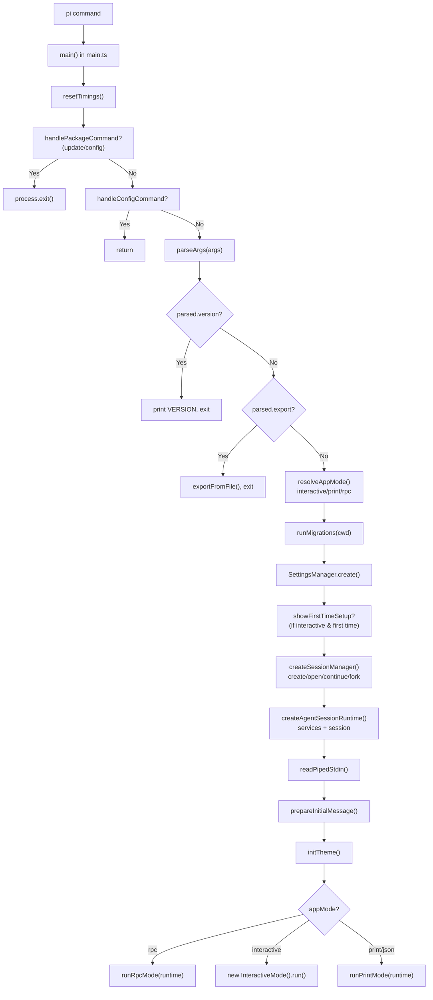
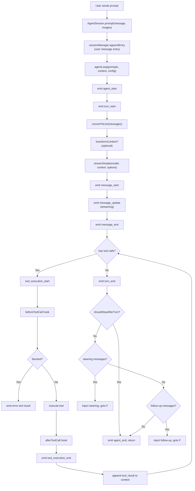
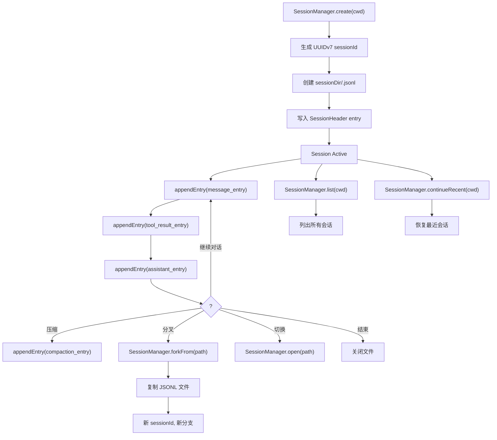
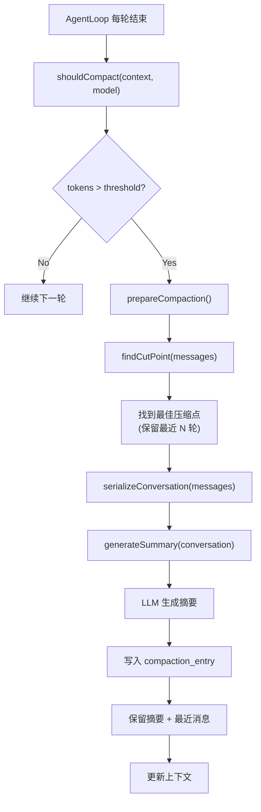
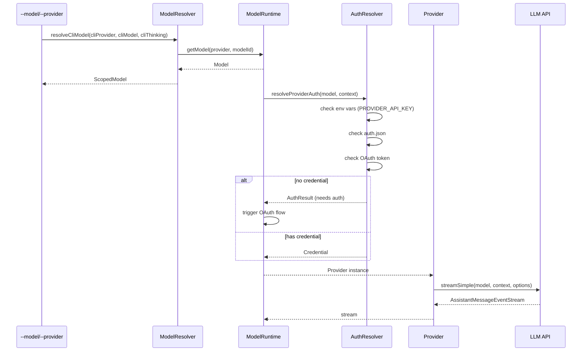
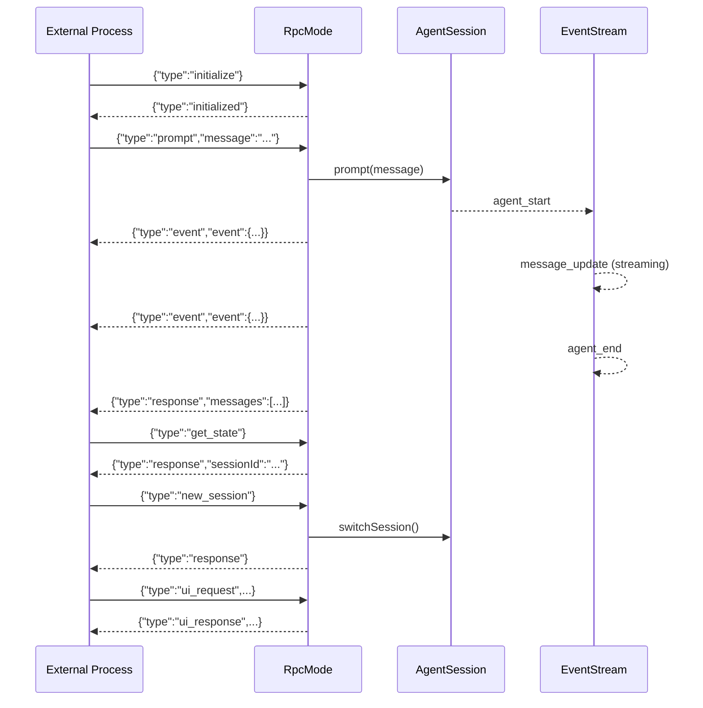
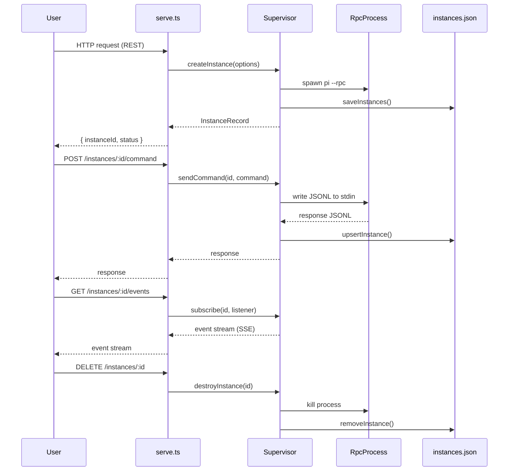
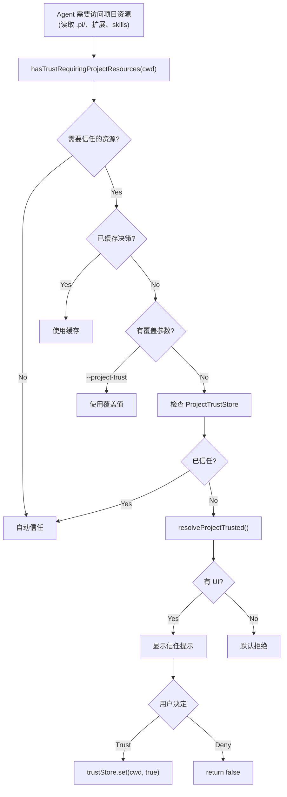

# 第三部分：系统流程与时序图（多层级深度）

## 3.1 应用启动与初始化流程



### 流程详解

**步骤说明**：

1. **`main()` 入口**（`main.ts:473`）：接收 `process.argv` 和可选的 `extensionFactories`。首先重置计时器（`resetTimings()`），然后检查是否为包管理命令（`pi update`）或配置命令（`pi config`），如果是则提前处理并退出。

2. **参数解析**（`parseArgs`）：将 CLI 参数解析为结构化的 `Args` 对象，包含 model、provider、thinking、session、mode 等字段。解析过程中可能产生 diagnostics（警告/错误）。

3. **快速路径**：如果是 `--version`、`--export`、`--help`、`--list-models` 等元数据命令，直接处理并退出，无需创建完整的运行时。

4. **模式确定**（`resolveAppMode`）：根据参数和环境（stdin/stdout 是否为 TTY）确定运行模式——interactive（全屏 TUI）、print（非交互文本）、json（结构化 JSON）、rpc（JSONL 协议）。

5. **迁移**（`runMigrations`）：运行数据迁移（如认证提供者格式更新），返回迁移的 provider 列表和弃用警告。

6. **设置管理**（`SettingsManager.create`）：创建启动时的设置管理器，用于 sessionDir 查找和首次设置检查。

7. **首次设置**（`showFirstTimeSetup`）：如果是首次运行且为交互模式，显示主题选择和 analytics 选择。

8. **会话管理**（`createSessionManager`）：根据参数创建或恢复会话——`--session` 打开指定会话、`--resume` 选择会话、`--continue` 继续最近会话、`--fork` 分叉会话、默认创建新会话。

9. **运行时创建**（`createAgentSessionRuntime`）：创建完整的服务装配（SettingsManager、ModelRuntime、ResourceLoader），加载扩展、skills、templates，解析模型，创建 AgentSession。

10. **输入准备**：读取管道输入（`readPipedStdin`），准备初始消息（`prepareInitialMessage`），包括文件参数（`@file`）处理。

11. **主题初始化**（`initTheme`）：加载并初始化主题系统。

12. **模式分发**：根据确定的模式运行——RPC 模式进入 `runRpcMode`，交互模式进入 `InteractiveMode.run()`，打印模式进入 `runPrintMode`。

**涉及文件**：
- `packages/coding-agent/src/main.ts`（主流程）
- `packages/coding-agent/src/cli/args.ts`（参数解析）
- `packages/coding-agent/src/core/session-manager.ts`（会话管理）
- `packages/coding-agent/src/core/agent-session-runtime.ts`（运行时创建）
- `packages/coding-agent/src/core/agent-session-services.ts`（服务装配）
- `packages/coding-agent/src/modes/index.ts`（模式分发）

**异常处理**：
- 参数解析错误：输出错误信息并 `process.exit(1)`
- 会话未找到：输出错误信息并退出
- 扩展加载失败：输出警告，提示使用 `-ne` 跳过扩展
- 模型不可用：在非交互模式下输出错误并退出

---

## 3.2 用户提示词处理与 Agent Loop 流程



### 流程详解

**核心循环**：

1. **`AgentSession.prompt()`**：接收用户消息和可选的图像，追加到会话历史（`sessionManager.appendEntry`），然后启动 agent loop。

2. **`agentLoop()`**（`agent-loop.ts:31`）：创建事件流，启动异步的 `runAgentLoop`，返回 `EventStream<AgentEvent, AgentMessage[]>`。

3. **`runAgentLoop()`**：核心循环逻辑：
   - 发射 `agent_start` 事件
   - 循环执行 turn：
     - 发射 `turn_start`
     - 转换消息为 LLM 格式（`convertToLlm`）
     - 可选的上下文转换（`transformContext`）
     - 调用 LLM（`streamSimple`）
     - 流式处理响应，发射 `message_start`/`message_update`/`message_end`
     - 如果有工具调用：
       - 发射 `tool_execution_start`
       - 调用 `beforeToolCall` 钩子（可被阻止）
       - 执行工具
       - 调用 `afterToolCall` 钩子（可覆盖结果）
       - 发射 `tool_execution_end`
       - 将 tool_result 追加到上下文
       - 继续处理下一个工具调用
     - 如果没有更多工具调用：
       - 发射 `turn_end`
       - 检查 `shouldStopAfterTurn`（可请求停止）
       - 检查 steering 队列（注入引导消息）
       - 检查 follow-up 队列（注入后续消息）
       - 如果没有更多消息，发射 `agent_end` 并返回

**关键设计**：
- **流式处理**：LLM 响应以流方式处理，UI 可以实时更新。
- **工具并行**：`toolExecution: "parallel"` 允许工具并发执行。
- **可扩展停止**：`shouldStopAfterTurn` 允许扩展控制循环停止。
- **Steering/Follow-up**：支持在 agent 运行中注入消息，实现"引导"和"后续"语义。

**涉及文件**：
- `packages/agent/src/agent-loop.ts`（核心循环）
- `packages/coding-agent/src/core/agent-session.ts`（prompt 入口）
- `packages/coding-agent/src/core/messages.ts`（convertToLlm）
- `packages/coding-agent/src/core/extensions/runner.ts`（事件钩子）

---

## 3.3 工具执行流程（以 bash 为例）

```mermaid
sequenceDiagram
    participant Loop as AgentLoop
    participant Before as beforeToolCall Hook
    participant Bash as BashTool
    participant After as afterToolCall Hook
    participant Session as SessionManager

    Loop->>Loop: emit tool_execution_start
    Loop->>Before: call beforeToolCall(ctx, signal)
    alt blocked
        Before-->>Loop: { block: true, reason }
        Loop->>Loop: create error tool result
    else allowed
        Before-->>Loop: undefined
        Loop->>Bash: execute(toolCallId, params, signal, onUpdate)
        Bash->>Bash: createLocalBashOperations()
        Bash->>Bash: executeBashWithOperations()
        Bash-->>Loop: AgentToolResult
        Loop->>After: call afterToolCall(ctx, signal)
        alt override
            After-->>Loop: { content, details, isError }
            Loop->>Loop: merge overrides
        else pass-through
            After-->>Loop: undefined
        end
    end
    Loop->>Loop: emit tool_execution_end
    Loop->>Session: appendEntry(tool_result_entry)
```

### 流程详解

**工具执行生命周期**：

1. **`tool_execution_start`**：agent loop 发射事件，包含 toolCallId、toolName、args。

2. **`beforeToolCall` 钩子**：扩展可以阻止工具执行。返回 `{ block: true, reason }` 会阻止执行并生成错误结果。钩子接收 `BeforeToolCallContext`，包含 assistantMessage、toolCall、args、context。

3. **工具执行**：
   - bash 工具通过 `createLocalBashOperations()` 创建操作集
   - `executeBashWithOperations()` 使用 `cross-spawn` 执行命令
   - 支持超时、输出截断、环境恢复
   - 通过 `onUpdate` 回调流式返回部分结果

4. **`afterToolCall` 钩子**：扩展可以覆盖工具结果。返回 `AfterToolCallResult` 可以替换 content、details、isError、terminate 字段。**注意**：不是深度合并，而是字段级替换。

5. **`tool_execution_end`**：发射事件，包含最终结果和 isError 标志。

6. **持久化**：工具结果作为 tool_result entry 追加到会话 JSONL。

**设计 Rationale**：
- **before/after 钩子**提供了完整的 AOP（面向切面编程）能力，扩展可以在不修改工具代码的情况下拦截和修改行为。
- **流式更新**（`onUpdate`）允许长时间运行的工具（如 `npm install`）实时报告进度。
- **terminate 标志**允许工具请求 agent 在当前批次后停止。

---

## 3.4 会话生命周期流程



### 流程详解

**会话创建**：
- `SessionManager.create(cwd, sessionDir, options)` 生成 UUIDv7 作为 sessionId（时间有序，便于排序）
- 在 sessionDir 下创建 `<sessionId>.jsonl` 文件
- 写入第一个 entry：`SessionHeader`（版本、创建时间等）

**会话写入**：
- 每次交互追加一个 entry 到 JSONL 文件
- Entry 类型：`session_info`、`message`（user/assistant）、`tool_result`、`file`、`custom`、`model_change`、`thinking_level_change`、`compaction`、`branch_summary`、`new_session`
- 追加是原子的（单行 JSON），崩溃不会损坏已有数据

**会话压缩**：
- 当对话过长时，`compact()` 将历史消息替换为摘要
- 写入 `compaction_entry` 包含摘要文本和原始 token 数
- 后续对话在压缩后的上下文中继续

**会话分叉**：
- `SessionManager.forkFrom(sourcePath, cwd)` 复制源会话文件
- 生成新的 sessionId，保留原始历史
- 适用于"从某个实验点开始不同尝试"

**会话恢复**：
- `SessionManager.open(path)` 打开已有会话
- `SessionManager.continueRecent(cwd)` 恢复当前项目最近使用的会话
- 恢复时读取所有 entries，重建 SessionContext（messages + 元数据）

---

## 3.5 上下文压缩（Compaction）流程



### 流程详解

**为什么需要压缩**：
LLM 有上下文窗口限制（如 200K tokens）。随着对话增长，消息历史会超出窗口。压缩将历史消息替换为摘要，使对话可以持续进行。

**压缩判断**（`shouldCompact`）：
- `estimateContextTokens(context)` 估算当前上下文的 token 数
- 与模型的上下文窗口阈值比较
- 超过阈值时触发压缩

**压缩点查找**（`findCutPoint`）：
- 从消息列表中找到最佳的压缩边界
- 确保保留最近的完整轮次（不会在工具调用中间切断）
- 找到最后一个 `new_session` 或 `compaction` entry 之后的起始点

**摘要生成**（`generateSummary`）：
- 将历史消息序列化为文本（`serializeConversation`）
- 调用 LLM 生成结构化摘要
- 摘要包含：任务描述、关键决策、文件变更、当前状态

**压缩结果**（`CompactionResult`）：
- 写入 `compaction_entry` 到 JSONL
- 新上下文 = 摘要 + 保留的最近消息
- 后续对话在压缩后的上下文中继续

**分支摘要**（`generateBranchSummary`）：
- 为会话的多个分支生成摘要
- 用于会话树视图，展示各分支的概要

---

## 3.6 扩展系统加载与运行流程

```mermaid
sequenceDiagram
    participant Main as main.ts
    participant RL as ResourceLoader
    participant EL as ExtensionLoader
    participant Ext as Extension (user code)
    participant ER as ExtensionRunner
    participant Loop as AgentLoop

    Main->>RL: createAgentSessionServices()
    RL->>EL: discoverAndLoadExtensions(paths)
    EL->>EL: 扫描 .pi/extensions 目录
    EL->>EL: 加载 --extensions 参数
    EL->>EL: 加载内置扩展
    loop 每个扩展文件
        EL->>Ext: import(extensionPath)
        Ext-->>EL: ExtensionFactory
        EL->>Ext: factory(ctx) → Extension
        Ext-->>EL: Extension instance
    end
    EL-->>RL: LoadExtensionsResult
    RL-->>Main: services

    Main->>ER: new ExtensionRunner(extensions)
    ER->>ER: 收集 tools/commands/events

    Loop->>ER: emit(beforeAgentStart)
    ER->>Ext: ext.beforeAgentStart?.(event)
    Loop->>ER: emit(toolCall event)
    ER->>Ext: ext.beforeToolCall?.(event)
    Loop->>ER: emit(message event)
    ER->>Ext: ext.onMessage?.(event)
```

### 流程详解

**扩展发现**：
- `ResourceLoader` 调用 `discoverAndLoadExtensions()`
- 扫描顺序：内置扩展 → `.pi/extensions` 目录 → `--extensions` 参数指定的路径
- 每个扩展是一个 TypeScript 文件，导出 `ExtensionFactory`（接收 `ExtensionContext` 返回 `Extension`）

**扩展加载**：
- 使用 `jiti` 运行时导入 TypeScript 文件（无需预编译）
- 调用 factory 函数，传入 `ExtensionContext`（包含 cwd、agentDir、logger、config 等）
- 返回 `Extension` 实例（包含 name、description、commands、tools、events、ui 等）

**扩展注册**：
- `ExtensionRunner` 收集所有扩展的 tools、commands、events
- 工具通过 `wrapRegisteredTool()` 包装为 agent 可用的 `AgentToolDefinition`
- 命令注册到 slash commands 系统
- 事件钩子注册到事件分发器

**事件分发**：
- agent loop 发射事件时，`ExtensionRunner.emit()` 调用对应扩展的钩子
- 钩子是异步的，返回 Promise
- 钩子的返回值可以影响 agent 行为（如阻止工具执行）

---

## 3.7 模型解析与认证流程



### 流程详解

**模型解析**：
- CLI 参数 `--model gpt-4o` 或 `--provider openai --model gpt-4o` 或 `--model openai/gpt-4o`
- `resolveCliModel()` 解析为 `ScopedModel`（包含 model、thinkingLevel）
- 支持 `--model <pattern>:<thinking>` 简写（如 `--model gpt-4o:high`）

**模型查找**：
- `ModelRuntime.getModel(provider, modelId)` 在注册表中查找
- `modelId` 支持模糊匹配（pattern matching）

**认证解析**（`resolveProviderAuth`）：
1. 检查环境变量（如 `OPENAI_API_KEY`、`ANTHROPIC_API_KEY`）
2. 检查 `auth.json`（持久化存储）
3. 检查 OAuth token（如 GitHub Copilot）
4. 如果无凭证，触发 OAuth 流程（PKCE 或 Device Code）

**流式调用**：
- `streamSimple(model, context, options)` 创建 `AssistantMessageEventStream`
- 返回的事件流包含 `message_start`、`message_update`、`message_end` 等
- 错误通过事件流的 `error` 或 `aborted` stopReason 编码，不抛出异常

---

## 3.8 RPC 模式流程



### 流程详解

**协议基础**：
- RPC 模式通过 stdin/stdout 进行 JSONL 通信
- 每行一个 JSON 对象（请求、响应、事件）
- 支持双向通信：外部进程发送命令，Pi 返回响应和事件

**命令类型**：
- `initialize`：初始化连接
- `prompt`：发送用户消息
- `get_state`：获取当前会话状态
- `new_session` / `switch_session` / `fork`：会话管理
- `set_session_name`：设置会话名称
- `ui_request` / `ui_response`：扩展 UI 交互桥接

**事件流**：
- Pi 将 agent loop 的事件转换为 JSONL 输出
- 外部进程可以实时获取 agent 的执行状态
- 支持 UI 请求/响应：Pi 请求外部进程显示 UI（如选择器），外部进程返回用户选择

**使用场景**：
- IDE 插件：VS Code/JetBrains 插件通过 RPC 与 Pi 通信
- CI 流水线：自动化脚本通过 RPC 驱动 Pi
- 测试框架：通过 RPC 进行集成测试

---

## 3.9 Orchestrator 多实例管理流程



### 流程详解

**Orchestrator 职责**：
- 管理多个 Pi RPC 实例的生命周期
- 提供 HTTP API 供外部调用
- 持久化实例状态到 `instances.json`

**实例创建**：
- `supervisor.createInstance(options)` 启动一个 `pi --rpc` 子进程
- 记录实例 ID、PID、状态、创建时间
- 保存到 `instances.json`

**命令发送**：
- 外部通过 HTTP POST 发送命令
- Supervisor 将命令写入子进程 stdin
- 读取子进程 stdout 的响应
- 更新实例状态

**事件订阅**：
- 外部通过 HTTP GET 订阅事件流
- Supervisor 将子进程的事件转发给订阅者
- 支持 Server-Sent Events (SSE)

**实例销毁**：
- 杀死子进程
- 从 `instances.json` 移除记录
- 清理订阅者

---

## 3.10 项目信任（Project Trust）流程



### 流程详解

**为什么需要 Project Trust**：
Pi 的扩展系统可以加载任意 TypeScript 代码（通过 jiti）。当扩展需要访问项目本地资源（`.pi/` 目录的文件、项目级扩展、skills）时，需要用户明确信任该项目，防止恶意仓库通过 Pi 执行恶意代码。

**信任判断流程**：
1. `hasTrustRequiringProjectResources(cwd)`：检查项目是否有需要信任的资源（如 `.pi/extensions/` 目录）
2. 检查缓存：`projectTrustByCwd` Map 缓存已决策的结果
3. 检查覆盖：`--project-trust` CLI 参数可以强制信任/拒绝
4. 检查持久化存储：`ProjectTrustStore` 保存用户的信任决策
5. 如果以上都没有，调用 `resolveProjectTrusted()`：
   - 有 UI（交互模式）：显示信任提示，让用户选择
   - 无 UI（非交互模式）：默认拒绝

**信任存储**：
- `ProjectTrustStore` 将信任决策持久化到 `~/.pi/trust` 文件
- 按 cwd 索引，可以更新和查询

---

☕️ 制作不易，请我喝咖啡☕️关注我➕

