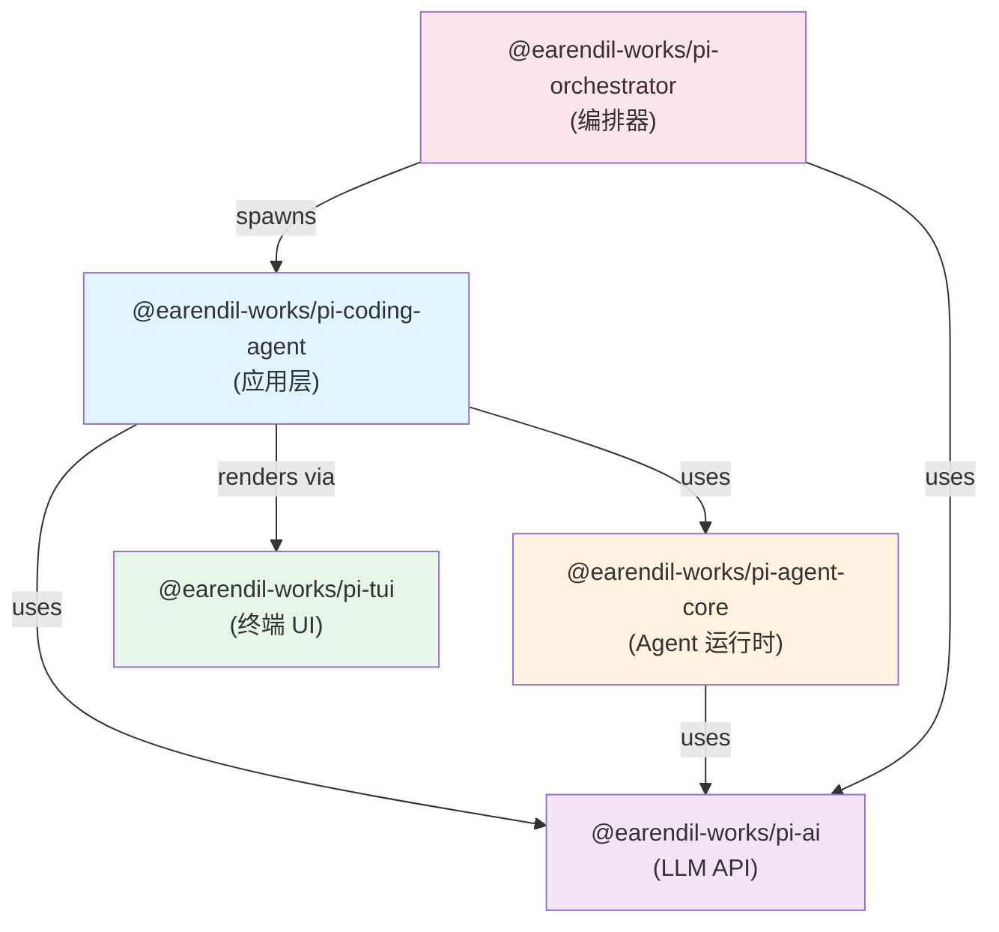
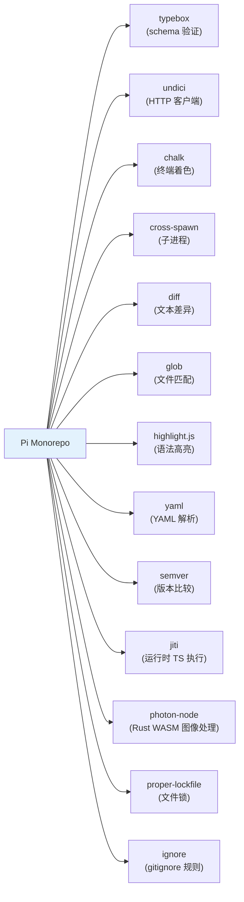

# 第四部分：模块/包结构与依赖分析

## 4.1 完整项目目录结构树

```
pi-monorepo/
├── .github/                          # GitHub 配置
│   ├── workflows/                    # CI/CD 工作流
│   │   ├── ci.yml                    # 主 CI（check + test）
│   │   ├── build-binaries.yml        # 多平台二进制构建 + npm 发布
│   │   ├── pr-gate.yml               # PR 门控
│   │   ├── npm-audit.yml             # 依赖审计
│   │   └── ...                       # issue 管理、contributor 审批
│   └── ISSUE_TEMPLATE/               # Issue 模板
├── .pi/                              # 项目级 Pi 配置示例
│   ├── extensions/                   # 示例扩展
│   ├── npm/                          # npm 配置
│   ├── prompts/                      # 示例 prompts（cl/is/pr/sa/wr）
│   └── skills/                       # 示例 skills
├── packages/                         # Monorepo 子包
│   ├── ai/                           # @earendil-works/pi-ai
│   │   ├── src/
│   │   │   ├── api/                  # 18 种 API 协议实现
│   │   │   │   ├── openai-responses.ts
│   │   │   │   ├── openai-completions.ts
│   │   │   │   ├── anthropic-messages.ts
│   │   │   │   ├── google-generative-ai.ts
│   │   │   │   ├── google-vertex.ts
│   │   │   │   ├── bedrock-converse-stream.ts
│   │   │   │   ├── azure-openai-responses.ts
│   │   │   │   ├── mistral-conversations.ts
│   │   │   │   ├── openai-codex-responses.ts
│   │   │   │   ├── openrouter-images.ts
│   │   │   │   ├── pi-messages.ts
│   │   │   │   ├── cloudflare.ts
│   │   │   │   └── *.lazy.ts         # 懒加载版本
│   │   │   ├── auth/                 # 认证系统
│   │   │   │   ├── context.ts        # AuthContext 默认值
│   │   │   │   ├── credential-store.ts # 凭证存储接口
│   │   │   │   ├── resolve.ts        # 认证解析
│   │   │   │   ├── helpers.ts
│   │   │   │   ├── types.ts          # AuthType, Credential 等类型
│   │   │   │   └── oauth/            # OAuth 实现
│   │   │   │       ├── anthropic.ts
│   │   │   │       ├── github-copilot.ts
│   │   │   │       ├── openai-codex.ts
│   │   │   │       ├── xai.ts
│   │   │   │       ├── device-code.ts
│   │   │   │       ├── pkce.ts
│   │   │   │       └── ...
│   │   │   ├── providers/            # 43 个 provider 工厂
│   │   │   │   ├── openai.ts
│   │   │   │   ├── anthropic.ts
│   │   │   │   ├── google.ts
│   │   │   │   ├── google-vertex.ts
│   │   │   │   ├── amazon-bedrock.ts
│   │   │   │   ├── azure-openai-responses.ts
│   │   │   │   ├── xai.ts
│   │   │   │   ├── groq.ts
│   │   │   │   ├── mistral.ts
│   │   │   │   ├── deepseek.ts
│   │   │   │   ├── minimax.ts
│   │   │   │   ├── xiaomi.ts
│   │   │   │   ├── huggingface.ts
│   │   │   │   ├── openrouter.ts
│   │   │   │   ├── faux.ts           # 测试用假 provider
│   │   │   │   └── *.models.ts       # 模型定义文件
│   │   │   ├── compat.ts             # 兼容层（旧 API 别名）
│   │   │   ├── models.ts             # Models 类
│   │   │   ├── models.generated.ts   # 生成的模型目录
│   │   │   ├── models-store.ts      # 模型存储
│   │   │   ├── images.ts            # 图像生成
│   │   │   ├── images-models.ts
│   │   │   ├── images-api-registry.ts
│   │   │   ├── types.ts             # 核心类型定义
│   │   │   ├── index.ts             # 导出入口
│   │   │   └── utils/               # 工具函数
│   │   │       ├── event-stream.ts
│   │   │       ├── retry.ts
│   │   │       ├── overflow.ts
│   │   │       ├── validation.ts
│   │   │       └── ...
│   │   ├── scripts/                  # 模型目录生成脚本
│   │   └── test/                     # 测试
│   │
│   ├── agent/                        # @earendil-works/pi-agent-core
│   │   ├── src/
│   │   │   ├── agent.ts              # Agent 类
│   │   │   ├── agent-loop.ts         # agent loop 核心
│   │   │   ├── types.ts              # AgentMessage, AgentTool 等类型
│   │   │   ├── index.ts
│   │   │   ├── harness/              # 应用层 harness
│   │   │   │   ├── agent-harness.ts
│   │   │   │   ├── session/          # 会话存储
│   │   │   │   │   ├── session.ts
│   │   │   │   │   ├── jsonl-repo.ts
│   │   │   │   │   ├── jsonl-storage.ts
│   │   │   │   │   ├── memory-repo.ts
│   │   │   │   │   ├── memory-storage.ts
│   │   │   │   │   ├── repo-utils.ts
│   │   │   │   │   └── uuid.ts
│   │   │   │   ├── compaction/       # 上下文压缩
│   │   │   │   │   ├── compaction.ts
│   │   │   │   │   ├── branch-summarization.ts
│   │   │   │   │   └── utils.ts
│   │   │   │   ├── skills.ts
│   │   │   │   ├── system-prompt.ts
│   │   │   │   ├── prompt-templates.ts
│   │   │   │   ├── messages.ts
│   │   │   │   ├── types.ts
│   │   │   │   └── utils/
│   │   │   ├── proxy.ts              # 代理工具
│   │   │   └── node.ts               # Node.js 特定功能
│   │   └── test/
│   │
│   ├── coding-agent/                 # @earendil-works/pi-coding-agent
│   │   ├── src/
│   │   │   ├── main.ts               # CLI 入口
│   │   │   ├── cli.ts                # CLI 启动
│   │   │   ├── index.ts              # SDK 导出入口
│   │   │   ├── rpc-entry.ts          # RPC 入口
│   │   │   ├── config.ts             # 配置常量
│   │   │   ├── migrations.ts         # 数据迁移
│   │   │   ├── cli/                  # CLI 子模块
│   │   │   │   ├── args.ts           # 参数解析
│   │   │   │   ├── file-processor.ts # @file 参数处理
│   │   │   │   ├── initial-message.ts
│   │   │   │   ├── list-models.ts
│   │   │   │   ├── session-picker.ts
│   │   │   │   ├── startup-ui.ts
│   │   │   │   └── ...
│   │   │   ├── core/                 # 核心层
│   │   │   │   ├── agent-session.ts  # AgentSession 类
│   │   │   │   ├── agent-session-runtime.ts
│   │   │   │   ├── agent-session-services.ts
│   │   │   │   ├── sdk.ts            # SDK 工厂
│   │   │   │   ├── session-manager.ts
│   │   │   │   ├── settings-manager.ts
│   │   │   │   ├── model-runtime.ts
│   │   │   │   ├── model-registry.ts
│   │   │   │   ├── model-resolver.ts
│   │   │   │   ├── resource-loader.ts
│   │   │   │   ├── trust-manager.ts
│   │   │   │   ├── event-bus.ts
│   │   │   │   ├── messages.ts
│   │   │   │   ├── system-prompt.ts
│   │   │   │   ├── slash-commands.ts
│   │   │   │   ├── skills.ts
│   │   │   │   ├── prompt-templates.ts
│   │   │   │   ├── compaction/       # 压缩实现
│   │   │   │   ├── tools/            # 7 个内置工具
│   │   │   │   │   ├── bash.ts
│   │   │   │   │   ├── edit.ts
│   │   │   │   │   ├── edit-diff.ts
│   │   │   │   │   ├── read.ts
│   │   │   │   │   ├── write.ts
│   │   │   │   │   ├── find.ts
│   │   │   │   │   ├── grep.ts
│   │   │   │   │   ├── ls.ts
│   │   │   │   │   └── ...
│   │   │   │   ├── extensions/       # 扩展系统
│   │   │   │   │   ├── index.ts
│   │   │   │   │   ├── loader.ts
│   │   │   │   │   ├── runner.ts
│   │   │   │   │   ├── wrapper.ts
│   │   │   │   │   └── types.ts
│   │   │   │   ├── export-html/      # HTML 导出
│   │   │   │   └── ...
│   │   │   ├── modes/                # 运行模式
│   │   │   │   ├── interactive/      # 交互模式
│   │   │   │   │   ├── interactive-mode.ts
│   │   │   │   │   ├── components/   # 30+ UI 组件
│   │   │   │   │   ├── model-search.ts
│   │   │   │   │   └── theme/        # 主题系统
│   │   │   │   ├── print-mode.ts
│   │   │   │   └── rpc/             # RPC 模式
│   │   │   │       ├── rpc-mode.ts
│   │   │   │       ├── rpc-client.ts
│   │   │   │       ├── rpc-types.ts
│   │   │   │       └── jsonl.ts
│   │   │   ├── extensions/           # 内置扩展
│   │   │   │   ├── index.ts
│   │   │   │   └── llama/            # llama.cpp 集成
│   │   │   ├── bun/                  # Bun 特定入口
│   │   │   └── utils/                # 工具函数
│   │   ├── docs/                     # 29 篇文档
│   │   ├── examples/                 # 示例扩展
│   │   ├── test/                     # 测试套件
│   │   └── scripts/                  # 构建脚本
│   │
│   ├── tui/                          # @earendil-works/pi-tui
│   │   ├── src/
│   │   │   ├── tui.ts                # TUI 引擎
│   │   │   ├── terminal.ts           # 终端控制
│   │   │   ├── keybindings.ts        # 键绑定
│   │   │   ├── keys.ts               # 键定义
│   │   │   ├── stdin-buffer.ts       # stdin 缓冲
│   │   │   ├── components/           # UI 组件
│   │   │   │   ├── editor.ts
│   │   │   │   ├── markdown.ts
│   │   │   │   ├── input.ts
│   │   │   │   ├── select-list.ts
│   │   │   │   ├── settings-list.ts
│   │   │   │   ├── box.ts
│   │   │   │   └── ...
│   │   │   ├── fuzzy.ts              # 模糊匹配
│   │   │   ├── kill-ring.ts          # 杀死环
│   │   │   ├── undo-stack.ts         # 撤销栈
│   │   │   └── utils.ts
│   │   └── native/                   # 原生模块
│   │       ├── darwin/               # macOS
│   │       └── win32/                # Windows
│   │
│   └── orchestrator/                 # @earendil-works/pi-orchestrator
│       ├── src/
│       │   ├── supervisor.ts         # 实例管理
│       │   ├── rpc-process.ts        # RPC 子进程
│       │   ├── serve.ts              # HTTP 服务
│       │   ├── storage.ts            # 状态持久化
│       │   ├── config.ts             # 配置
│       │   ├── handler.ts            # 请求处理
│       │   ├── ipc/                  # 进程间通信
│       │   └── types.ts
│       └── test/
│
├── scripts/                          # Monorepo 脚本
│   ├── build-binaries.sh             # 二进制构建
│   ├── publish.mjs                   # npm 发布
│   ├── release.mjs                   # 版本发布
│   ├── generate-coding-agent-shrinkwrap.mjs
│   └── ...
├── package.json                      # Monorepo 根配置
├── tsconfig.json                     # TypeScript 配置
├── biome.json                        # Biome 配置
└── AGENTS.md                         # 开发规则
```

---

## 4.2 模块间依赖关系图



### 依赖关系详解

- **pi-coding-agent → pi-agent-core**：使用 Agent 类、agentLoop、AgentState、Harness 等
- **pi-coding-agent → pi-ai**：使用 Models、Provider、streamSimple、认证、模型类型等
- **pi-coding-agent → pi-tui**：使用 TUI 引擎和组件进行终端渲染
- **pi-agent-core → pi-ai**：使用 Models.streamSimple、Message 类型等
- **pi-orchestrator → pi-coding-agent**：通过 RPC 模式启动 Pi 实例
- **pi-orchestrator → pi-ai**：使用 ai 类型定义

**依赖方向规则**：依赖始终是从上层指向下层，下层不依赖上层，形成严格的层级结构。唯一的"跨层"依赖是 orchestrator → coding-agent（orchestrator 启动 coding-agent 进程），但这是通过 RPC 协议而非直接代码引用。

---

## 4.3 @earendil-works/pi-ai 包详解

### 职责
Pi 的统一 LLM API 层，提供：
- 43 个 provider 的工厂实现
- 18 种 API 协议的实现
- 模型发现与管理
- 认证（OAuth + API Key）
- 流式调用接口

### 输入
- `Model`（包含 provider、id、api、capabilities 等）
- `Context`（systemPrompt、messages、tools）
- `SimpleStreamOptions`（apiKey、headers、signal 等）

### 输出
- `AssistantMessageEventStream`（事件流，包含 message_start/update/end 等事件）

### 子模块
- `api/`：API 协议实现（每个文件对应一种 API）
- `auth/`：认证系统
- `providers/`：Provider 工厂
- `compat.ts`：兼容层，提供旧 API 别名
- `models.ts`：Models 类（Provider 集合）
- `types.ts`：核心类型定义

---

## 4.4 @earendil-works/pi-agent-core 包详解

### 职责
通用的 agent 运行时，提供：
- Agent 类（状态管理、事件发射）
- agent loop（核心循环、工具调度）
- Harness（会话存储、压缩、skills、system prompt）

### 输入
- `AgentContext`（systemPrompt、messages、tools）
- `AgentLoopConfig`（model、convertToLlm、hooks 等）

### 输出
- `EventStream<AgentEvent, AgentMessage[]>`（事件流 + 最终消息数组）

### 子模块
- `agent.ts`：Agent 类
- `agent-loop.ts`：核心循环
- `types.ts`：AgentMessage、AgentTool 等类型
- `harness/`：应用层 harness

---

## 4.5 @earendil-works/pi-coding-agent 包详解

### 职责
Pi 的应用层，提供：
- CLI 入口和参数解析
- 会话管理（创建、恢复、分叉、分支树）
- 工具系统（7 个内置工具）
- 扩展系统（发现、加载、运行）
- 运行模式（interactive、print、rpc）
- 安全机制（project trust、supply-chain）

### 输入
- CLI 参数
- 用户消息（交互/管道/RPC）
- 配置文件（settings.json、auth.json）

### 输出
- 终端 UI（交互模式）
- stdout 输出（print 模式）
- JSONL 事件流（RPC 模式）

### 子模块
- `core/`：核心层（session、tools、extensions、compaction）
- `modes/`：运行模式
- `extensions/`：内置扩展
- `utils/`：工具函数

---

## 4.6 @earendil-works/pi-tui 包详解

### 职责
终端 UI 库，提供：
- 差分渲染引擎
- 终端控制（光标、颜色、区域）
- UI 组件（编辑器、markdown、选择器）
- 键绑定系统
- 原生终端控制（macOS/Windows）

### 输入
- 渲染指令（文本、样式、位置）
- 键盘输入
- 终端大小

### 输出
- 终端帧更新（差分）

### 子模块
- `tui.ts`：TUI 引擎
- `components/`：UI 组件
- `native/`：原生模块

---

## 4.7 @earendil-works/pi-orchestrator 包详解

### 职责
实验性的多实例编排器，提供：
- 多 Pi 实例的生命周期管理
- HTTP API（REST）
- 实例状态持久化
- 事件订阅（SSE）

### 输入
- HTTP 请求（创建实例、发送命令、订阅事件）

### 输出
- HTTP 响应
- SSE 事件流

---

## 4.8 外部依赖关系图



---

# ❤️ 制作不易，请我喝咖啡☕️关注我➕

