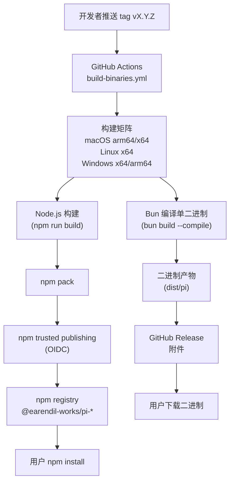

# 第八部分：部署、运维与基础设施

## 8.1 部署架构图



### 部署流程详解

**触发条件**：推送 `vX.Y.Z` tag 到 `main` 分支

**构建矩阵**：
- macOS arm64（Apple Silicon）
- macOS x64（Intel）
- Linux x64
- Windows x64/arm64

**Node.js 构建**：
1. `npm ci --ignore-scripts` — 安装依赖（不执行 lifecycle 脚本）
2. `npm run build` — 构建所有包（tsgo 编译）
3. `npm run check` — 检查（Biome + 类型检查）
4. `npm pack` — 打包

**Bun 编译**：
1. `bun build --compile ./dist/bun/cli.js --outfile dist/pi`
2. 生成单二进制文件（无需 Node.js 运行时）

**发布**：
- npm：通过 trusted publishing（GitHub OIDC），无需本地 npm publish
- GitHub Release：上传二进制附件

---

## 8.2 构建系统

### tsgo 编译

使用 `@typescript/native-preview`（tsgo）替代 tsc：

```json
{
  "scripts": {
    "build": "tsgo -p tsconfig.build.json"
  }
}
```

**优势**：
- 利用 Node.js 的 strip-only TS 支持
- 无需 emit，直接运行 TypeScript
- 构建速度更快

### esbuild 打包

`scripts/` 目录下的脚本使用 esbuild 打包：

```typescript
import * as esbuild from "esbuild";

await esbuild.build({
  entryPoints: ["scripts/publish.mjs"],
  bundle: true,
  platform: "node",
  outfile: "dist-scripts/publish.js",
});
```

### Bun 单二进制编译

```bash
bun build --compile ./dist/bun/cli.js \
  --outfile dist/pi
```

**产物**：单个可执行文件，包含 Bun 运行时和所有代码。

### 资源复制

构建后需要复制静态资源：

```bash
# 主题文件
cp src/modes/interactive/theme/*.json dist/modes/interactive/theme/

# 图像资源
cp src/modes/interactive/assets/*.png dist/modes/interactive/assets/

# HTML 导出模板
cp src/core/export-html/template.* dist/core/export-html/
cp src/core/export-html/vendor/*.js dist/core/export-html/vendor/

# WASM（图像处理）
cp node_modules/@silvia-odwyer/photon-node/photon_rs_bg.wasm dist/
```

### Shrinkwrap 生成

```bash
node scripts/generate-coding-agent-shrinkwrap.mjs
```

生成 `npm-shrinkwrap.json`，锁定传递依赖版本，确保 npm 安装的一致性。

---

## 8.3 CI/CD 流水线

### ci.yml（主 CI）

**触发**：push 到 main、pull request

**步骤**：
1. `npm ci --ignore-scripts`
2. `npm run build`
3. `npm run check`（Biome + 类型检查 + 依赖检查）
4. `./test.sh`（运行测试，跳过需要 API key 的 e2e 测试）

### build-binaries.yml（构建与发布）

**触发**：推送 `vX.Y.Z` tag

**步骤**：
1. 构建矩阵（多平台）
2. Node.js 构建 + 测试
3. Bun 编译
4. npm pack
5. npm trusted publishing（发布到 npm）
6. 创建 GitHub Release（上传二进制）

### pr-gate.yml（PR 门控）

**触发**：pull request

**检查**：
- CI 通过
- 代码审查批准
- 无冲突

### npm-audit.yml（依赖审计）

**触发**：定时（每周）+ push 到 main

**检查**：
- `npm audit --omit=dev`
- `npm audit signatures --omit=dev`

### Issue 工作流

- `issue-gate.yml`：新 contributor 的 issue 自动关闭
- `approve-contributor.yml`：审批 contributor
- `issue-triage-labels.yml`：自动打标签
- `issue-analysis.yml`：issue 分析
- `remove-inprogress-on-close.yml`：关闭时移除 in-progress 标签

---

## 8.4 发布流程

### Lockstep 版本

所有包共享同一版本号：

```bash
npm version patch -ws  # 所有包同时升级 patch
npm version minor -ws  # 所有包同时升级 minor
```

`scripts/sync-versions.js` 同步版本号到所有 package.json。

### Release 脚本

```bash
PI_ALLOW_LOCKFILE_CHANGE=1 npm run release:patch
```

**release.mjs 执行流程**：
1. 更新 CHANGELOG（`## [Unreleased]` → `## [X.Y.Z]`）
2. 更新所有包版本号
3. 重新生成 release artifacts
4. 运行 `npm run check`
5. 提交 `Release vX.Y.Z`
6. 打 tag `vX.Y.Z`
7. 添加新的 `## [Unreleased]` 到 CHANGELOG
8. 提交 `Add [Unreleased] section for next cycle`
9. 推送 main 和 tag

### 本地烟雾测试

```bash
npm run release:local -- --out /tmp/pi-local-release --force
```

**测试内容**：
- Node 包安装测试
- Bun 二进制测试
- 启动测试（`--help`、`--version`、`--list-models`）
- 交互模式测试（tmux 自动化）
- 真实 prompt 测试

---

## 8.5 容器化与沙箱

Pi 文档提供了三种容器化模式：

### Gondolin 扩展

- Pi 和 provider auth 在宿主机
- 内置工具和 `!` 命令路由到本地 Linux micro-VM
- 通过 `gondolin` 示例扩展实现

### plain Docker

- 整个 `pi` 进程在 Docker 容器中
- 简单隔离

### OpenShell

- 整个 `pi` 进程在策略控制的沙箱中
- 细粒度权限控制

**安全说明**：Pi 默认**不包含**内置权限系统，以用户权限运行。需要更强隔离时使用容器化。

---

## 8.6 监控、日志、告警

### 诊断系统

```typescript
interface AgentSessionRuntimeDiagnostic {
  type: "error" | "warning" | "info";
  message: string;
}
```

诊断信息来源：
- 设置加载错误
- 扩展加载失败
- 模型解析警告
- 资源加载问题

### 计时系统

```typescript
import { time, resetTimings, printTimings } from "./core/timings.ts";

resetTimings();
// ... 操作
time("operationName");
// 最后
printTimings();
```

输出各阶段耗时，用于性能分析。

### Telemetry

`core/telemetry.ts` 实现遥测数据收集（需用户同意）。

### HTML 导出

`core/export-html/` 实现会话导出为 HTML 文件，包含：
- 完整对话历史
- 工具执行详情
- 语法高亮
- ANSI 转 HTML

### Stats 脚本

`scripts/stats.ts`、`scripts/cost.ts` 等脚本用于分析会话统计和成本。

---

## 8.7 供应链安全

### 依赖锁定

- `package-lock.json` 是依赖 ground truth
- 直接外部依赖锁定到精确版本
- 内部 workspace 包使用范围版本

### save-exact

`.npmrc` 设置 `save-exact=true`，确保新依赖保存精确版本。

### min-release-age

`.npmrc` 设置 `min-release-age=2`，避免使用发布不足 2 天的新版本（防止供应链攻击）。

### Lockfile 门控

pre-commit hook 阻止意外 lockfile 提交，除非设置 `PI_ALLOW_LOCKFILE_CHANGE=1`。

### Lifecycle 脚本白名单

`generate-coding-agent-shrinkwrap.mjs` 包含明确的 lifecycle 脚本白名单。新的 lifecycle 脚本依赖必须经过审查才能添加。

### npm audit

定时运行 `npm audit` 检查已知漏洞。

---

# ❤️ 制作不易，请我喝咖啡☕️关注我➕

