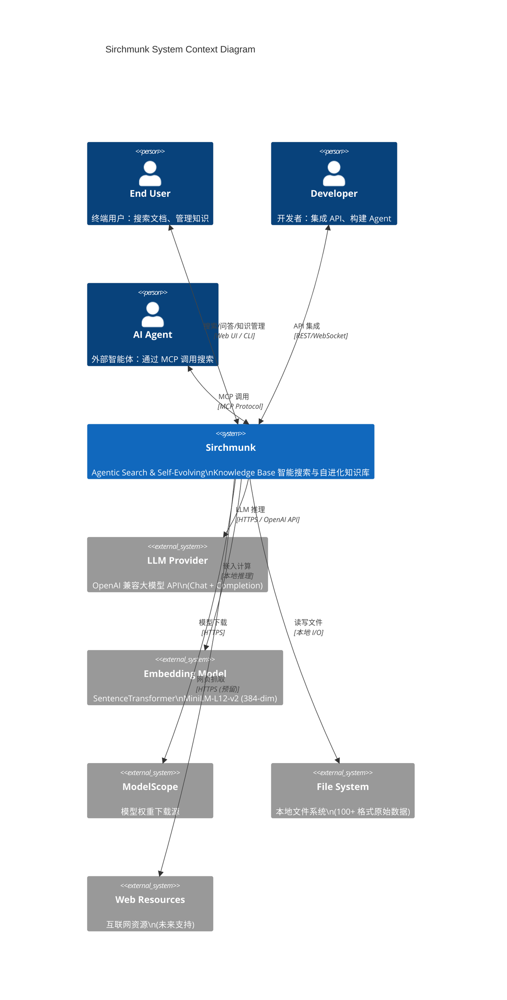
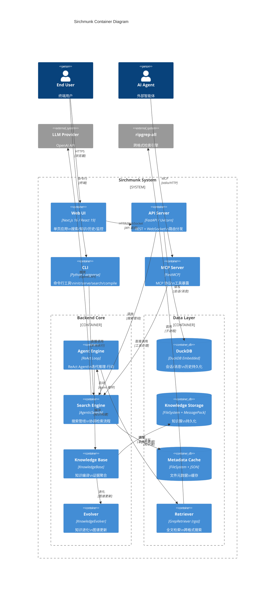

# 2. C4 架构模型（C4 Architecture Model）

> 本章使用 C4 模型（Context / Container / Component / Code）对 Sirchmunk 系统进行多层架构建模，每层搭配 Mermaid 图表与详细文字说明。

---

## 2.0 C4 模型概述

C4 模型是 Simon Brown 提出的软件架构可视化方法，包含四个抽象层级：

| 层级 | 名称 | 关注点 | 受众 |
|------|------|--------|------|
| L1 | **Context**（上下文） | 系统与外部实体的关系 | 所有利益相关者 |
| L2 | **Container**（容器） | 系统内部的应用/数据存储 | 开发者/架构师 |
| L3 | **Component**（组件） | 容器内部的模块组织 | 开发者 |
| L4 | **Code**（代码） | 类/接口/函数级别设计 | 开发者 |

**选用理由**：C4 模型天然适合 Sirchmunk 这种"多入口（Web/CLI/MCP）+ 分层后端 + Agent 驱动"的复杂系统，能清晰表达从宏观交互到底层实现的完整图景。

---

## 2.1 Context 图（系统上下文）

### 2.1.1 Mermaid 图表



### 2.1.2 详细说明（400+ 字）

**系统边界**：Sirchmunk 系统（中央矩形）是本次架构分析的目标系统，它封装了搜索、知识编译、知识进化、API 服务等全部内部实现。

**外部实体分类**：

1. **人物角色（Person）**：
   - **终端用户（End User）**：通过 Web UI 或 CLI 直接使用系统，进行搜索问答、知识浏览、文件上传等操作。是系统的主要服务对象。
   - **开发者（Developer）**：通过 REST/WebSocket API 将 Sirchmunk 搜索能力集成到自有应用中，需要关注 API 文档与 SDK。
   - **AI Agent**：外部智能体（如 Claude Desktop、Cursor 等）通过 MCP 协议调用 Sirchmunk 的搜索工具，无需人工干预。

2. **外部系统（System_Ext）**：
   - **LLM Provider**：提供大语言模型推理能力，支持 OpenAI 兼容 API（如 OpenAI、DeepSeek、Qwen 等）。Sirchmunk 的核心检索循环高度依赖 LLM 的推理能力。
   - **Embedding Model**：SentenceTransformer MiniLM-L12-v2 模型，用于计算文本嵌入向量（384 维），仅在 SummaryIndex 回退和知识相似度计算时使用。
   - **ModelScope**：模型权重托管平台，首次启动时下载 embedding 模型和 tokenizer。
   - **File System**：本地文件系统，存储 100+ 格式的原始文档数据。Sirchmunk 直接检索文件系统，无需中间索引层。
   - **Web Resources**：互联网资源（当前版本为预留接口，WebScanner 尚未实现）。

**交互关系**：

- 终端用户通过 **Web UI**（浏览器）或 **CLI**（命令行）与系统交互，这是最直接的交互方式。
- 开发者通过 **REST API**（HTTP）或 **WebSocket**（实时双向）与系统交互，适合程序化集成。
- AI Agent 通过 **MCP Protocol**（Model Context Protocol）与系统交互，这是 Sirchmunk 作为 Agent 工具的核心价值。
- Sirchmunk 与 LLM 提供方的交互是**同步阻塞**的（每次搜索可能涉及多次 LLM 调用），因此 LLM 的可用性和延迟直接影响搜索性能。
- 与文件系统的交互是**本地 I/O**，ripgrep-all 直接在文件系统上执行检索，无中间层。

**设计 Rationale**：

Context 图清晰地展示了 Sirchmunk 的**系统边界**——它是一个"以数据为中心"的系统，所有外部交互都围绕"让 LLM 能够直接理解和使用原始数据"这一核心目标展开。将 LLM Provider 和文件系统作为两个最关键的外部系统，体现了"LLM 推理 + 直接检索"的双引擎设计。

---

## 2.2 Container 图（容器视图）

### 2.2.1 Mermaid 图表



### 2.2.2 详细说明（400+ 字）

**容器定义**：在 C4 模型中，"容器"是一个可独立部署/运行的逻辑单元。Sirchmunk 的容器分为**接入层**、**核心引擎层**和**数据层**三大类。

**接入层容器**：

1. **Web UI**（前端应用）：
   - 技术栈：Next.js 16 + React 19 + TailwindCSS
   - 职责：提供搜索、知识浏览、历史记录、系统监控、设置等用户界面
   - 部署方式：静态导出后由 FastAPI 单端口托管，或独立 Next.js 开发服务器
   - 关键页面：`/`（搜索主页）、`/knowledge`（知识图谱）、`/history`（历史）、`/monitor`（监控）、`/settings`（设置）、`/graph`（图谱可视化）

2. **API Server**（后端服务）：
   - 技术栈：FastAPI + Uvicorn
   - 职责：REST API 路由分发、WebSocket 实时通信、认证中间件、静态文件托管
   - 端口：默认 8584
   - 路由模块：`/api/v1/search`、`/api/v1/chat`、`/api/v1/knowledge`、`/api/v1/files`、`/api/v1/history`、`/api/v1/monitor`、`/api/v1/settings`、`/api/v1/tools`

3. **CLI**（命令行工具）：
   - 技术栈：Python + argparse
   - 职责：`sirchmunk init/serve/search/compile/web/mcp` 等命令
   - 入口：`src/sirchmunk/cli/cli.py` → `run_cmd()`

4. **MCP Server**（协议适配）：
   - 技术栈：FastMCP (MCP Python SDK)
   - 职责：将搜索能力暴露为 MCP 工具（`sirchmunk_search`、`sirchat`）
   - 传输：stdio / HTTP

**核心引擎层容器**：

1. **Agent Engine**（ReAct 循环）：
   - 实现：`agentic/react_agent.py` → `ReActSearchAgent`
   - 职责：管理 ReAct 迭代循环（Reasoning → Acting → Observing）
   - 关键参数：`max_loops=10`, `max_token_budget=64000`

2. **Search Engine**（搜索管线）：
   - 实现：`search.py` → `AgenticSearch`
   - 职责：协调整个搜索流程（意图检测 → 关键词提取 → Agent 循环 → 知识编译）

3. **Knowledge Base**（知识编译）：
   - 实现：`learnings/knowledge_base.py` → `KnowledgeBase`
   - 职责：将检索结果编译为 KnowledgeCluster，聚合证据

4. **Evolver**（知识进化）：
   - 实现：`scheduler/evolver.py` → `KnowledgeEvolver`
   - 职责：定期合并/连接/更新知识图谱

**数据层容器**：

1. **DuckDB**：嵌入式 OLAP 数据库，持久化会话和消息历史
2. **Knowledge Storage**：文件系统 + MessagePack 序列化，持久化知识簇
3. **Metadata Cache**：文件系统 + JSON，缓存文件元数据
4. **Retriever**：GrepRetriever，ripgrep-all 的 Python 封装

**设计 Rationale**：

Container 图展示了 Sirchmunk 的**微内核 + 插件**设计。Search Engine 是系统的"心脏"，Agent Engine 是"大脑"，Knowledge Base 是"记忆"，Evolver 是"进化机制"。三层接入（Web/CLI/MCP）共享同一核心引擎，确保行为一致性。数据层采用"嵌入式优先"策略（DuckDB + 文件系统），避免外部依赖，实现零运维部署。

---

## 2.3 Component 图（组件视图）

### 2.3.1 Mermaid 图表

```mermaid
C4Component
    title Sirchmunk Component Diagram - Search Container

    Container_Boundary(search_container, "Search Engine Container", "AgenticSearch") {
        Container_Boundary(pipeline, "Search Pipeline", "搜索管线") {
            Component(intent, "Intent Detector", "doc_qa.detect_doc_intent()", "检测文档级意图")
            Component(keyword, "Keyword Extractor", "LLM 关键词提取", "从查询提取搜索关键词")
            Component(agent, "ReAct Agent", "ReActSearchAgent", "迭代推理-行动循环")
            Component(kb_compiler, "KB Compiler", "KnowledgeBase.compile()", "知识编译")
        }

        Container_Boundary(agentic, "Agentic Subsystem", "智能体子系统") {
            Component(tool_reg, "ToolRegistry", "agentic/tools.py", "工具注册中心")
            Component(tool_kw, "KeywordSearch", "BaseTool", "关键词搜索工具")
            Component(tool_deep, "DeepFileRead", "BaseTool", "深度文件读取工具")
            Component(tool_kq, "KnowledgeQuery", "BaseTool", "知识库查询工具")
            Component(tool_web, "WebSearch", "BaseTool", "网络搜索工具")
            Component(context, "SearchContext", "schema/search_context.py", "搜索上下文")
        }

        Container_Boundary(retrieve, "Retrieval Subsystem", "检索子系统") {
            Component(grep, "GrepRetriever", "retrieve/text_retriever.py", "rga 全文检索")
            Component(tree_idx, "TreeIndexer", "learnings/tree_indexer.py", "文档树索引")
            Component(toc, "TocExtractor", "learnings/toc_extractor.py", "目录提取")
            Component(summary_idx, "SummaryIndex", "learnings/summary_index.py", "摘要索引回退")
        }

        Container_Boundary(learnings, "Learning Subsystem", "学习子系统") {
            Component(evidence, "EvidenceProcessor", "MonteCarloEvidenceSampling", "蒙特卡洛证据采样")
            Component(compiler, "KnowledgeCompiler", "learnings/compiler.py", "知识编译器")
            Component(tree, "TreeIndexer", "learnings/tree_indexer.py", "树索引构建")
            Component(lint, "KnowledgeLint", "learnings/lint.py", "知识健康检查")
        }

        Container_Boundary(schema, "Schema Layer", "数据模型层") {
            Component(kc, "KnowledgeCluster", "schema/knowledge.py", "知识簇")
            Component(eu, "EvidenceUnit", "schema/knowledge.py", "证据单元")
            Component(cog, "CognitionLayer", "schema/cognition.py", "认知图层")
            Component(req, "Request", "schema/request.py", "请求模型")
            Component(resp, "Response", "schema/response.py", "响应模型")
        }
    }

    Container_Boundary(storage, "Storage Layer", "存储层") {
        ComponentDb(duckdb, "DuckDBManager", "storage/duckdb.py", "OLAP 数据库")
        ComponentDb(ks, "KnowledgeStorage", "storage/knowledge_storage.py", "知识持久化")
        ComponentDb(fs, "FileSystem", "utils/file_utils.py", "文件系统缓存")
    }

    System_Ext(llm, "LLM Provider", "OpenAI API")
    System_Ext(rga, "ripgrep-all", "跨格式检索")

    Rel(intent, keyword, "意图确认后", "传递查询")
    Rel(keyword, agent, "关键词注入", "初始化搜索")
    Rel(agent, tool_reg, "工具调用", "execute()")
    Rel(tool_reg, grep, "检索", "rga 调用")
    Rel(tool_reg, tree_idx, "索引", "树导航")
    Rel(agent, context, "状态记录", "token 计数")
    Rel(agent, kb_compiler, "证据传递", "编译知识")
    Rel(kb_compiler, evidence, "证据处理", "蒙特卡洛采样")
    Rel(kb_compiler, compiler, "知识编译", "聚合证据")
    Rel(compiler, tree, "索引构建", "树结构")

    Rel(grep, rga, "子进程调用", "rga 二进制")
    Rel(kb_compiler, kc, "构建", "KnowledgeCluster")
    Rel(kb_compiler, eu, "构建", "EvidenceUnit")
    Rel(compiler, kc, "输出", "知识簇")
    Rel(kc, cog, "关联", "认知边")

    Rel(ks, kc, "持久化", "序列化")
    Rel(duckdb, req, "存储", "会话")
    Rel(duckdb, resp, "存储", "消息")

    Rel(agent, llm, "推理", "LLM API")
```



### 2.3.2 详细说明（400+ 字）

**组件分层**：Component 图将 Search Engine 容器内部展开为四个子系统：搜索管线、智能体子系统、检索子系统、学习子系统，外加数据模型层和存储层。

**搜索管线（Search Pipeline）**：

1. **Intent Detector**：`doc_qa.py` → `detect_doc_intent()`，使用 LLM 判断查询是否为文档级操作（如"总结这篇文档"）。如果是，走直读 QA 管线，跳过 ReAct 循环。

2. **Keyword Extractor**：利用 LLM 从用户查询中提取关键词，作为 ReAct Agent 的初始搜索输入。Prompt 模板定义在 `llm/prompts.py` → `generate_keyword_extraction_prompt()`。

3. **ReAct Agent**：核心迭代引擎，维护消息历史（system/user/assistant），在每个循环中：
   - 调用 LLM 进行推理
   - 解析 LLM 输出中的工具调用
   - 执行工具并获取结果
   - 将结果追加到消息历史
   - 检查终止条件（找到答案 / 达到循环上限 / 超出 token 预算）

4. **KB Compiler**：`KnowledgeBase.compile()` 将 Agent 收集到的证据编译为 KnowledgeCluster。

**智能体子系统（Agentic Subsystem）**：

- **ToolRegistry**：工具注册中心，维护 `name → BaseTool` 映射，提供 `execute()` 统一调用入口
- **KeywordSearch**：调用 GrepRetriever 执行关键词搜索，支持布尔逻辑
- **DeepFileRead**：对文件进行深度读取（支持大文件采样、OCR）
- **KnowledgeQuery**：查询已编译的知识簇
- **WebSearch**：网络搜索（预留接口）
- **SearchContext**：搜索上下文，跟踪 token 预算、文件去重、检索日志

**检索子系统（Retrieval Subsystem）**：

- **GrepRetriever**：ripgrep-all 的 Python 封装，支持并发控制（`asyncio.Semaphore`）、缓存、多种检索模式
- **TreeIndexer**：为长文档构建层级树索引，支持自适应深度
- **TocExtractor**：多层 TOC 提取（pypdf → pdfminer → 标题模式 → LLM）
- **SummaryIndex**：嵌入 + BM25 混合回退索引，当 rga 无结果时使用

**学习子系统（Learning Subsystem）**：

- **EvidenceProcessor**：蒙特卡洛证据采样，ROI 定位 → 读取 → 验证 → 扩展
- **KnowledgeCompiler**：将多源证据编译为结构化知识
- **KnowledgeLint**：知识健康检查，检测孤立簇、过期证据等

**设计 Rationale**：

Component 图揭示了 Sirchmunk 的**策略模式 + 责任链**设计。搜索管线定义了"做什么"（Intent → Keyword → Agent → Compile），智能体子系统定义了"用什么做"（4 种工具），检索子系统定义了"怎么做"（rga / 树索引 / 摘要回退）。这种分层使得每个组件可以独立演进——例如新增检索工具只需实现 `BaseTool` 并注册到 `ToolRegistry`，无需修改 Agent 循环。

---

## 2.4 Code 图（代码/类视图）

### 2.4.1 Mermaid 图表

```mermaid
C4Deployment
    title Sirchmunk Core Class Diagram

    Container_Boundary(core, "Core Classes") {
        Component(base, "BaseSearch\n<<abstract>>", "base.py", "+ search()")
        Component(agentic_search, "AgenticSearch", "search.py", "+ search()\n+ compile()\n+ detect_doc_intent()")
        Component(react_agent, "ReActSearchAgent", "react_agent.py", "+ run()\n- _call_llm()\n- _build_system_prompt()")
        Component(tool_registry, "ToolRegistry", "agentic/tools.py", "+ execute()\n+ register()\n+ get_all_schemas()")
        Component(kb, "KnowledgeBase", "knowledge_base.py", "+ compile()\n+ add_cluster()\n+ get_cluster()")
        Component(evolver, "KnowledgeEvolver", "evolver.py", "+ step()\n- _connect_merge()\n- _edge_refresh()\n- _meta_detection()\n- _global_update()")
    }

    Container_Boundary(tools, "Tool Hierarchy") {
        Component(base_tool, "BaseTool\n<<abstract>>", "agentic/tools.py", "+ name\n+ get_schema()\n+ execute()")
        Component(kw_tool, "KeywordSearchTool", "agentic/tools.py", "+ execute(context, keywords)")
        Component(deep_tool, "DeepFileReadTool", "agentic/tools.py", "+ execute(context, file_path)")
        Component(kq_tool, "KnowledgeQueryTool", "agentic/tools.py", "+ execute(context, cluster_id)")
        Component(web_tool, "WebSearchTool", "agentic/tools.py", "+ execute(context, query)")
    }

    Container_Boundary(retrieve, "Retrieval") {
        Component(base_retriever, "BaseRetriever\n<<abstract>>", "retrieve/base.py", "+ retrieve()")
        Component(grep, "GrepRetriever", "retrieve/text_retriever.py", "+ retrieve()\n+ _parse_results()\n- _build_cmd()")
    }

    Container_Boundary(schema, "Schema") {
        Component(kc, "KnowledgeCluster", "schema/knowledge.py", "+ id, name, description\n+ evidences, patterns\n+ confidence, lifecycle\n+ to_dict(), from_dict()")
        Component(eu, "EvidenceUnit", "schema/knowledge.py", "+ doc_id, file_or_url\n+ summary, snippets\n+ is_found, tree_path")
        Component(ctx, "SearchContext", "schema/search_context.py", "+ add_llm_tokens()\n+ mark_file_read()\n+ is_budget_exceeded()\n+ to_dict()")
        Component(req, "Request", "schema/request.py", "+ messages, system\n+ get_user_input()\n+ to_payload()")
    }

    Container_Boundary(storage, "Storage") {
        Component(duckdb, "DuckDBManager", "storage/duckdb.py", "+ execute()\n+ create_table()\n+ persist_sync()")
        Component(ks, "KnowledgeStorage", "storage/knowledge_storage.py", "+ save_cluster()\n+ load_cluster()\n+ list_clusters()")
        Component(llm, "OpenAIChat", "llm/openai_chat.py", "+ achat()\n+ _retry_with_backoff()\n- _handle_stream()")
    }

    Rel(base, agentic_search, "inherits")
    Rel(agentic_search, react_agent, "uses")
    Rel(agentic_search, kb, "uses")
    Rel(agentic_search, evolver, "uses")
    Rel(react_agent, tool_registry, "delegates")
    Rel(react_agent, ctx, "creates")
    Rel(tool_registry, base_tool, "manages")
    Rel(base_tool, kw_tool, "inherits")
    Rel(base_tool, deep_tool, "inherits")
    Rel(base_tool, kq_tool, "inherits")
    Rel(base_tool, web_tool, "inherits")
    Rel(kw_tool, grep, "uses")
    Rel(base_retriever, grep, "inherits")
    Rel(kb, kc, "creates")
    Rel(kb, eu, "creates")
    Rel(kc, eu, "contains")
    Rel(ks, kc, "persists")
    Rel(duckdb, req, "stores")
    Rel(duckdb, resp, "stores")
    Rel(llm, react_agent, "called by")
```

### 2.4.2 详细说明（400+ 字）

**类图概览**：Code 图展示了 Sirchmunk 核心类的静态结构，包括继承关系（实线三角箭头）、组合关系（实线菱形箭头）和依赖关系（虚线箭头）。

**核心类层次**：

1. **BaseSearch → AgenticSearch**（继承关系）：
   - `BaseSearch` 是抽象基类，定义 `search()` 接口
   - `AgenticSearch` 是具体实现，包含完整的搜索管线
   - 这种设计允许未来扩展其他搜索实现（如纯关键词搜索）

2. **BaseTool → 4 个具体工具**（继承关系）：
   - `BaseTool` 定义抽象接口：`name`、`get_schema()`、`execute()`
   - 4 个具体工具各自实现不同的检索策略
   - `ToolRegistry` 通过 `name → instance` 映射管理工具

3. **BaseRetriever → GrepRetriever**（继承关系）：
   - `BaseRetriever` 定义 `retrieve()` 接口
   - `GrepRetriever` 是 rga 的具体封装

**核心实体类**：

1. **KnowledgeCluster**（知识簇）：
   - 系统中最核心的实体，代表从多源证据蒸馏的知识单元
   - 包含：id、name、description、evidences、patterns、confidence、lifecycle
   - 支持序列化（`to_dict()`/`from_dict()`）用于持久化

2. **EvidenceUnit**（证据单元）：
   - 代表原始文档中的一个证据片段
   - 包含：doc_id、file_or_url、summary、snippets、tree_path
   - 支持冲突检测（conflict_group）

3. **SearchContext**（搜索上下文）：
   - 运行时状态对象，贯穿整个搜索会话
   - 职责：token 预算管理、文件去重、检索日志
   - 提供 `to_dict()` 用于遥测数据导出

4. **Request**（请求模型）：
   - 统一请求格式，支持 OpenAI 和 Anthropic 两种消息格式
   - 提供 `to_payload()` 转换为对应 API 格式

**存储类**：

1. **DuckDBManager**：DuckDB 连接管理，支持持久化模式（内存 + 定期回写）
2. **KnowledgeStorage**：知识簇持久化，使用 MessagePack 序列化
3. **OpenAIChat**：LLM 客户端，支持自动重试、流式输出、多 Provider

**设计模式应用**：

| 模式 | 应用位置 | 说明 |
|------|---------|------|
| 策略模式 | BaseTool + 4 工具 | 检索策略可插拔 |
| 模板方法 | BaseSearch → AgenticSearch | 搜索流程骨架 |
| 观察者模式 | LogCallback | 异步日志推送 |
| 工厂模式 | create_logger() | 日志器创建 |
| 单例模式 | LLMUsageTracker | 全局 token 统计 |
| 外观模式 | AgenticSearch | 统一搜索入口 |

**设计 Rationale**：

Code 图展示了 Sirchmunk 的**面向对象设计深度**。通过抽象基类（BaseSearch / BaseTool / BaseRetriever）定义稳定的接口契约，通过具体类实现可替换的策略。`SearchContext` 作为"上下文对象"（Context Object）模式，避免了全局状态，使得搜索会话可以安全并发。`KnowledgeCluster` 和 `EvidenceUnit` 的双层设计（知识层 + 证据层）实现了知识的可追溯性——每个知识声明都可以追溯到原始文档片段。

---

## 2.5 本章小结

C4 模型从四个层级完整建模了 Sirchmunk 的架构：

| 层级 | 关键洞察 |
|------|---------|
| **Context** | 系统是"LLM 推理 + 直接数据检索"的双引擎架构 |
| **Container** | 三层接入（Web/CLI/MCP）共享核心引擎，嵌入式存储零运维 |
| **Component** | 搜索管线 + 4 大子系统协同，工具可插拔 |
| **Code** | 抽象基类定义契约，策略模式实现可扩展性 |

这些图表为后续章节的流程分析、代码走读和数据模型分析奠定了架构基础。

---

☕️ 制作不易，请我喝咖啡☕️关注我➕

