# 4. 模块/包结构与依赖分析（Module/Package Structure & Dependency Analysis）

> 本章提供完整的项目目录结构树、每个主要模块的功能职责分析，以及模块间的依赖关系图。

---

## 4.0 分析方法论

- **目录树**：基于 `find` 命令实际扫描结果，深度 4 级
- **职责分析**：基于源码走读，描述输入/输出/核心功能
- **依赖分析**：基于 `import` 语句静态分析

---

## 4.1 完整项目目录结构树

```
sirchmunk/                              # 项目根目录
├── src/                                # Python 源码根目录
│   ├── sirchmunk/                      # 主包（核心引擎）
│   │   ├── __init__.py                 # 包入口，导出 AgenticSearch
│   │   ├── version.py                  # 版本号 __version__
│   │   ├── base.py                     # BaseSearch 抽象基类
│   │   ├── search.py                   # AgenticSearch 核心搜索引擎（~7900 行）
│   │   ├── doc_qa.py                   # 文档级 QA 直读模块
│   │   │
│   │   ├── agentic/                    # 智能体子系统
│   │   │   ├── __init__.py
│   │   │   ├── react_agent.py          # ReAct 迭代引擎
│   │   │   ├── tools.py                # 工具注册中心 + 4 个工具
│   │   │   ├── dir_scan_tool.py        # 目录扫描工具
│   │   │   └── prompts.py              # Agent 专用 Prompt
│   │   │
│   │   ├── api/                        # API 层（FastAPI 路由）
│   │   │   ├── __init__.py
│   │   │   ├── main.py                 # FastAPI 应用入口
│   │   │   ├── run_server.py           # Uvicorn 启动脚本
│   │   │   ├── chat.py                 # 聊天 WebSocket 端点
│   │   │   ├── search.py               # 搜索 REST 端点
│   │   │   ├── knowledge.py            # 知识管理端点
│   │   │   ├── files.py                # 文件上传端点
│   │   │   ├── file_service.py         # 文件存储服务
│   │   │   ├── history.py              # 历史记录端点
│   │   │   ├── monitor.py              # 监控端点
│   │   │   ├── settings.py             # 设置端点
│   │   │   ├── tools.py                # 工具端点
│   │   │   ├── security.py             # 安全中间件
│   │   │   └── components/             # API 组件
│   │   │       ├── __init__.py
│   │   │       ├── history_storage.py  # 历史持久化（DuckDB）
│   │   │       └── monitor_tracker.py  # 监控追踪器
│   │   │
│   │   ├── learnings/                  # 学习子系统
│   │   │   ├── __init__.py
│   │   │   ├── knowledge_base.py       # 知识库核心
│   │   │   ├── compiler.py             # 知识编译器
│   │   │   ├── evidence_processor.py   # 蒙特卡洛证据采样
│   │   │   ├── tree_indexer.py         # 文档树索引
│   │   │   ├── toc_extractor.py        # 目录提取
│   │   │   ├── summary_index.py        # 摘要索引回退
│   │   │   ├── lint.py                 # 知识健康检查
│   │   │   └── README.md
│   │   │
│   │   ├── schema/                     # 数据模型层
│   │   │   ├── __init__.py
│   │   │   ├── knowledge.py            # KnowledgeCluster / EvidenceUnit
│   │   │   ├── cognition.py            # Cognition Layer 模型
│   │   │   ├── search_context.py       # SearchContext / RetrievalLog
│   │   │   ├── request.py              # Request / Message / ContentItem
│   │   │   ├── response.py             # Response
│   │   │   ├── metadata.py             # FileInfo / FileType
│   │   │   ├── context.py              # Context（请求+响应+知识）
│   │   │   └── snapshot.py             # SnapshotInfo
│   │   │
│   │   ├── storage/                    # 存储层
│   │   │   ├── __init__.py
│   │   │   ├── duckdb.py               # DuckDB 管理器
│   │   │   └── knowledge_storage.py    # 知识持久化
│   │   │
│   │   ├── retrieve/                   # 检索层
│   │   │   ├── __init__.py
│   │   │   ├── base.py                 # BaseRetriever 抽象基类
│   │   │   └── text_retriever.py       # GrepRetriever（rga 封装）
│   │   │
│   │   ├── scan/                       # 扫描层
│   │   │   ├── __init__.py
│   │   │   ├── base.py                 # BaseScanner 抽象基类
│   │   │   ├── file_scanner.py         # 文件元数据扫描器
│   │   │   ├── dir_scanner.py          # 目录扫描器
│   │   │   └── web_scanner.py          # Web 扫描器（预留）
│   │   │
│   │   ├── scheduler/                  # 调度层
│   │   │   ├── __init__.py
│   │   │   └── evolver.py              # 知识进化器
│   │   │
│   │   ├── llm/                        # LLM 客户端层
│   │   │   ├── __init__.py
│   │   │   ├── openai_chat.py          # OpenAI 兼容客户端
│   │   │   └── prompts.py              # 全部 Prompt 模板
│   │   │
│   │   ├── cli/                        # 命令行工具
│   │   │   ├── __init__.py
│   │   │   ├── cli.py                  # CLI 入口（argparse）
│   │   │   └── web_launcher.py         # Web 启动器
│   │   │
│   │   ├── insight/                    # 洞察提取
│   │   │   ├── __init__.py
│   │   │   └── text_insights.py        # 文本关键短语提取
│   │   │
│   │   └── utils/                      # 工具函数集
│   │       ├── __init__.py
│   │       ├── constants.py            # 全局常量
│   │       ├── deps.py                 # 依赖检测
│   │       ├── document_extractor.py   # 文档提取（kreuzberg）
│   │       ├── embedding_util.py       # 嵌入工具（SentenceTransformer）
│   │       ├── file_utils.py           # 文件工具 + StorageStructure
│   │       ├── install_rga.py          # rga 安装脚本
│   │       ├── log_utils.py            # 日志工具
│   │       ├── tokenizer_util.py       # 分词器工具
│   │       └── utils.py                # 通用工具函数
│   │
│   └── sirchmunk_mcp/                  # MCP 服务包
│       ├── __init__.py
│       ├── config.py                   # MCP 配置
│       ├── server.py                   # FastMCP 服务器
│       ├── service.py                  # SirchmunkService 业务逻辑
│       ├── tools.py                    # MCP 工具定义
│       ├── LICENSE
│       └── README.md
│
├── web/                                # 前端应用（Next.js）
│   ├── app/                            # 页面路由
│   │   ├── layout.tsx                  # 根布局
│   │   ├── page.tsx                    # 搜索主页
│   │   ├── globals.css                 # 全局样式
│   │   ├── graph/page.tsx              # 知识图谱页
│   │   ├── history/page.tsx            # 历史记录页
│   │   ├── knowledge/page.tsx          # 知识库页
│   │   ├── monitor/page.tsx            # 监控页
│   │   └── settings/page.tsx           # 设置页
│   ├── components/                     # UI 组件
│   │   ├── Sidebar.tsx                 # 侧边栏
│   │   ├── RightSidebar.tsx            # 右侧边栏
│   │   ├── FileBrowser.tsx             # 文件浏览器
│   │   ├── FileUpload.tsx              # 文件上传
│   │   ├── ClusterGraph.tsx            # 知识簇图谱
│   │   ├── SystemStatus.tsx            # 系统状态
│   │   ├── Mermaid.tsx                 # Mermaid 渲染
│   │   ├── ChatSessionDetail.tsx       # 聊天详情
│   │   ├── ActivityDetail.tsx          # 活动详情
│   │   ├── CollectionBrowser.tsx       # 集合浏览器
│   │   ├── ThemeScript.tsx             # 主题脚本
│   │   ├── ui/                         # 基础 UI 组件
│   │   │   ├── Button.tsx
│   │   │   └── Modal.tsx
│   │   └── index.ts
│   ├── context/                        # React Context
│   │   └── GlobalContext.tsx           # 全局状态管理
│   ├── hooks/                          # 自定义 Hooks
│   │   ├── useTheme.ts                 # 主题 Hook
│   │   └── useQuestionReducer.ts       # 问题状态 Hook
│   ├── lib/                            # 工具库
│   │   ├── api.ts                      # API 客户端
│   │   ├── debounce.ts                 # 防抖
│   │   ├── i18n.ts                     # 国际化
│   │   ├── latex.ts                    # LaTeX 处理
│   │   ├── pdfExport.ts                # PDF 导出
│   │   ├── theme.ts                    # 主题管理
│   │   └── theme-utils.ts              # 主题工具
│   ├── types/                          # TypeScript 类型
│   │   └── question.ts
│   ├── public/                         # 静态资源
│   │   ├── logo-v1.png
│   │   └── logo-v2.png
│   ├── package.json
│   ├── next.config.js
│   ├── tailwind.config.js
│   ├── tsconfig.json
│   └── postcss.config.js
│
├── docker/                            # Docker 配置
│   ├── Dockerfile.ubuntu              # 多阶段构建模板
│   ├── docker-compose.yml             # 服务编排
│   ├── build_image.py                 # 镜像构建脚本
│   ├── entrypoint.sh                  # 容器入口脚本
│   └── README.md
│
├── config/                            # 配置文件
│   ├── env.example                    # 环境变量模板
│   └── mcp_config.json                # MCP 客户端配置模板
│
├── scripts/                           # 运维脚本
│   ├── start_web.py                   # Web 启动脚本
│   ├── stop_web.py                    # Web 停止脚本
│   └── generate_roster.py             # 名单生成
│
├── benchmarks/                        # 基准测试
│   └── financebench/                  # FinanceBench 评测
│       ├── run_benchmark.py
│       ├── runner.py
│       ├── config.py
│       ├── data_loader.py
│       ├── judge.py
│       ├── evaluate.py
│       └── analyze_results.py
│
├── requirements/                      # Python 依赖
│   ├── core.txt                       # 核心依赖
│   ├── web.txt                        # Web 服务依赖
│   ├── mcp.txt                        # MCP 依赖
│   ├── docs.txt                       # 文档依赖
│   ├── tests.txt                      # 测试依赖
│   └── requirements.txt               # 总入口
│
├── .github/workflows/                 # CI/CD
│   ├── docker-image.yaml              # Docker 镜像构建
│   └── publish.yaml                   # PyPI 发布
│
├── assets/                            # 项目资产
│   ├── pic/                           # 图片
│   └── video/                         # 视频
│
├── recipes/                           # 配方/示例
│   └── openclaw_skills/               # OpenClaw 技能示例
│
├── pyproject.toml                     # 项目元数据
├── setup.py                           # Setuptools 配置
├── README.md                          # 英文文档
├── README_zh.md                       # 中文文档
├── LICENSE                            # Apache 2.0
└── .pre-commit-config.yaml            # Pre-commit 配置
```

---

## 4.2 顶层目录职责

| 目录/文件 | 职责 | 输入 | 输出 |
|-----------|------|------|------|
| `src/sirchmunk/` | 核心引擎包 | 用户查询 | 搜索结果/知识 |
| `src/sirchmunk_mcp/` | MCP 服务包 | MCP 工具调用 | 搜索结果 JSON |
| `web/` | 前端应用 | 用户交互 | SPA 页面 |
| `docker/` | 容器化配置 | 构建上下文 | Docker 镜像 |
| `config/` | 配置模板 | — | 配置文件 |
| `scripts/` | 运维脚本 | 命令行参数 | 服务启停 |
| `benchmarks/` | 评测基准 | 测试数据集 | 评测报告 |
| `requirements/` | 依赖管理 | — | 安装依赖 |

---

## 4.3 `agentic/` 子模块

### 4.3.1 模块概览

| 文件 | 行数 | 核心类/函数 | 职责 |
|------|------|-----------|------|
| `react_agent.py` | ~300 | `ReActSearchAgent` | ReAct 迭代引擎 |
| `tools.py` | ~500 | `ToolRegistry`, `BaseTool`, 4 工具 | 工具注册与执行 |
| `dir_scan_tool.py` | ~100 | `DirectoryScanner` | 目录扫描 |
| `prompts.py` | ~100 | Prompt 常量 | Agent 专用 Prompt |

### 4.3.2 输入/输出

```
输入: query (str), images (optional), initial_keywords (optional)
输出: (final_answer: str, context: SearchContext)
```

---

## 4.4 `api/` 子模块

### 4.4.1 路由模块清单

| 文件 | 路由前缀 | 方法 | 职责 |
|------|---------|------|------|
| `main.py` | `/` | — | FastAPI 应用入口 + 中间件 |
| `run_server.py` | — | — | Uvicorn 启动 |
| `chat.py` | `/api/v1/chat` | WebSocket | 实时聊天 |
| `search.py` | `/api/v1/search` | POST | 搜索端点 |
| `knowledge.py` | `/api/v1/knowledge` | GET/POST/DELETE | 知识管理 |
| `files.py` | `/api/v1/files` | POST | 文件上传 |
| `history.py` | `/api/v1/history` | GET/DELETE | 历史记录 |
| `monitor.py` | `/api/v1/monitor` | GET | 系统监控 |
| `settings.py` | `/api/v1/settings` | GET/POST | 设置管理 |
| `tools.py` | `/api/v1/tools` | GET/POST | 工具列表 |
| `security.py` | — | — | 认证/安全中间件 |

### 4.4.2 组件模块

| 文件 | 核心类 | 职责 |
|------|--------|------|
| `history_storage.py` | `HistoryStorage` | 聊天历史 DuckDB 持久化 |
| `monitor_tracker.py` | `MonitorTracker`, `LLMUsageTracker` | 系统指标与 LLM 用量追踪 |

---

## 4.5 `learnings/` 子模块

### 4.5.1 模块清单

| 文件 | 行数 | 核心类 | 职责 |
|------|------|--------|------|
| `knowledge_base.py` | ~800 | `KnowledgeBase` | 知识库核心逻辑 |
| `compiler.py` | ~300 | `KnowledgeCompiler` | 知识编译管线 |
| `evidence_processor.py` | ~600 | `MonteCarloEvidenceSampling` | 蒙特卡洛证据采样 |
| `tree_indexer.py` | ~700 | `TreeIndexer`, `TreeNode` | 文档树索引 |
| `toc_extractor.py` | ~400 | `TocExtractor`, `TOCEntry` | 目录提取 |
| `summary_index.py` | ~300 | `CompileSummaryIndex` | 摘要索引回退 |
| `lint.py` | ~200 | `KnowledgeLint` | 知识健康检查 |

### 4.5.2 协作关系

```
KnowledgeBase ──调用──> EvidenceProcessor
    │                         │
    └──调用──> Compiler <───┘
                  │
                  ├──调用──> TreeIndexer ──调用──> TocExtractor
                  │
                  └──输出──> SummaryIndex (编译时)
                  
KnowledgeLint ──独立运行──> 检查 KnowledgeStorage
```

---

## 4.6 `schema/` 子模块

### 4.6.1 数据模型清单

| 文件 | 核心类 | 职责 |
|------|--------|------|
| `knowledge.py` | `KnowledgeCluster`, `EvidenceUnit`, `Constraint`, `WeakSemanticEdge`, `Lifecycle`, `AbstractionLevel` | 知识层模型 |
| `cognition.py` | `RichSemanticEdge`, `RichEdgeType` | 认知层模型 |
| `search_context.py` | `SearchContext`, `RetrievalLog` | 运行时上下文 |
| `request.py` | `Request`, `Message`, `ContentItem`, `ImageURL` | 请求模型 |
| `response.py` | `Response` | 响应模型 |
| `metadata.py` | `FileInfo`, `FileType` | 文件元数据 |
| `context.py` | `Context` | 操作上下文 |
| `snapshot.py` | `SnapshotInfo` | 快照信息 |

---

## 4.7 `storage/` 子模块

| 文件 | 核心类 | 职责 |
|------|--------|------|
| `duckdb.py` | `DuckDBManager` | DuckDB 连接管理（Direct/Persist 双模式） |
| `knowledge_storage.py` | `KnowledgeStorage` | 知识簇持久化（MessagePack + 文件系统） |

---

## 4.8 `retrieve/` 子模块

| 文件 | 核心类 | 职责 |
|------|--------|------|
| `base.py` | `BaseRetriever` | 检索器抽象基类 |
| `text_retriever.py` | `GrepRetriever` | ripgrep-all Python 封装 |

### 4.8.1 GrepRetriever 关键特性

- 并发控制：`asyncio.Semaphore(GREP_CONCURRENT_LIMIT=5)`
- 缓存：`{work_path}/.cache/rga/` 目录
- 安全：`subprocess.run(shell=False)` 防止注入
- 输出：JSON 格式解析（`--json` flag）

---

## 4.9 `scan/` 子模块

| 文件 | 核心类 | 职责 |
|------|--------|------|
| `base.py` | `BaseScanner` | 扫描器抽象基类 |
| `file_scanner.py` | `FileScanner` | 文件元数据扫描（多线程） |
| `dir_scanner.py` | `DirectoryScanner` | 目录扫描 |
| `web_scanner.py` | `WebScanner` | Web 扫描（预留） |

### 4.9.1 FileScanner 关键特性

- 线程池：`min(32, CPU_COUNT * 2)`
- 增量检测：基于 `(size, mtime)` 的变更检测
- 批次持久化：每 1000 个文件保存一次元数据
- 随机化：批次内随机排序避免热点

---

## 4.10 `scheduler/` 子模块

| 文件 | 核心类 | 职责 |
|------|--------|------|
| `evolver.py` | `KnowledgeEvolver` | 知识进化器 |

### 4.10.1 进化参数

| 参数 | 默认值 | 含义 |
|------|--------|------|
| `_EVO_CONNECT_MERGE_COUNT` | 5 | 触发 Phase 1 的新簇阈值 |
| `_EVO_CONNECT_SIMILARITY_THRESHOLD` | 0.60 | 弱语义边相似度阈值 |
| `_EVO_MERGE_SIMILARITY_THRESHOLD` | 0.90 | 合并相似度阈值 |
| `_EVO_STEP_INTERVAL` | 10 | Phase 3/4 的步数间隔 |
| `_EVO_META_DETECTION_COUNT` | 10 | 元簇检测的簇变化阈值 |
| `_EVO_GLOBAL_UPDATE_COUNT` | 20 | 全局更新的簇变化阈值 |

---

## 4.11 `llm/` 子模块

| 文件 | 核心类 | 职责 |
|------|--------|------|
| `openai_chat.py` | `OpenAIChat` | OpenAI 兼容 LLM 客户端 |
| `prompts.py` | Prompt 常量 | 全部 LLM Prompt 模板 |

### 4.11.1 OpenAIChat 关键特性

- 自动重试：指数退避（`_DEFAULT_MAX_RETRIES=3`, `_DEFAULT_BASE_DELAY=1.0s`）
- 可重试错误：`APIConnectionError`, `APITimeoutError`, `InternalServerError`, `RateLimitError`, `NotFoundError`
- Provider 能力配置：`_ProviderProfile`（stream_options, thinking_param 等）
- 流式输出：支持 `stream=True/False`

### 4.11.2 Prompt 模板清单（`prompts.py`）

| Prompt 名称 | 用途 |
|------------|------|
| `DETECT_DOC_INTENT` | 文档级意图检测 |
| `DIRECT_DOC_ANALYSIS` | 文档直读分析 |
| `FAST_QUERY_ANALYSIS` | 快速查询分析 |
| `FAST_QUERY_ANALYSIS_WITH_CATALOG` | 带目录的查询分析 |
| `KEYWORD_QUERY_PLACEHOLDER` | 关键词提取 |
| `ROI_RESULT_SUMMARY` | ROI 结果总结 |
| `ROI_LOOKUP_SYNTHESIS` | ROI 查找综合 |
| `ROI_COMPUTATION_SYNTHESIS` | ROI 计算综合 |
| `ROI_COMPARISON_SYNTHESIS` | ROI 比较综合 |
| `DOC_SUMMARY` | 文档摘要 |
| `DOC_CHUNK_SUMMARY` | 文档片段摘要 |
| `DOC_MERGE_SUMMARIES` | 摘要合并 |
| `DEEP_SECTION_SELECT` | 深度章节选择 |
| `DEEP_DATA_REQUIREMENTS` | 深度数据需求 |
| `DEEP_PAGE_SELECT` | 深度页面选择 |
| `DEEP_CHECK_REQUIREMENTS` | 深度需求检查 |
| `DEEP_TOC_ANALYSIS` | 深度目录分析 |
| `EVIDENCE_SUMMARY` | 证据摘要 |
| `EVO_META_QUERY` | 进化元簇查询 |
| `EVO_REFINE_CLUSTER` | 进化簇精炼 |
| `REACT_SYSTEM_PROMPT` | ReAct 系统 Prompt |
| `REACT_CONTINUATION_PROMPT` | ReAct 循环 Prompt |
| `SNAPSHOT_KEYWORDS_EXTRACTION` | 快照关键词提取 |
| `SNAPSHOT_TOC_EXTRACTION` | 快照目录提取 |

---

## 4.12 `utils/` 子模块

| 文件 | 核心函数/类 | 职责 |
|------|-----------|------|
| `constants.py` | 全局常量 | LLM 配置、工作路径、并发限制 |
| `deps.py` | `check_dependency()` | 运行时依赖检测 |
| `document_extractor.py` | `DocumentExtractor`, `ExtractionProfile` | 统一文档提取（kreuzberg） |
| `embedding_util.py` | `EmbeddingUtil` | SentenceTransformer 嵌入（懒加载） |
| `file_utils.py` | `fast_extract()`, `get_fast_hash()`, `StorageStructure` | 文件工具 |
| `install_rga.py` | `install_rga()` | ripgrep-all 安装 |
| `log_utils.py` | `create_logger()`, `LogCallback` | 日志工具 |
| `tokenizer_util.py` | `TokenizerUtil` | 分词器工具 |
| `utils.py` | `extract_fields()` 等 | 通用工具 |

### 4.12.1 StorageStructure 定义

```python
class StorageStructure:
    CACHE_DIR = ".cache"
    METADATA_DIR = "metadata"
    GREP_DIR = "rga"
    KNOWLEDGE_DIR = "knowledge"
    COGNITION_DIR = "cognition"
    CLUSTER_INDEX_FILE = "cluster.idx"
    CLUSTER_CONTENT_FILE = "cluster.mpk"
```

### 4.12.2 完整存储路径

```
{work_path}/
├── .env                            # 环境变量
├── data/                           # 搜索数据目录
├── uploads/                        # 上传文件
│   └── {collection}/
│       ├── .manifest.json
│       └── {files}
├── logs/                           # 日志
└── .cache/
    ├── metadata/                   # 文件元数据 JSON
    ├── rga/                        # rga 检索缓存
    ├── knowledge/                  # 知识簇持久化
    │   ├── cluster.idx            # 索引文件
    │   └── cluster.mpk            # MessagePack 内容
    ├── cognition/                  # 认知图数据
    ├── history/                    # 聊天历史 DuckDB
    ├── settings/                   # 设置缓存
    └── web_static/                 # WebUI 静态资源
```

---

## 4.13 `cli/` + `insight/` + 其他顶层模块

### 4.13.1 `cli/` 子模块

| 文件 | 核心函数 | 职责 |
|------|---------|------|
| `cli.py` | `run_cmd()` | CLI 入口，argparse 命令定义 |
| `web_launcher.py` | `launch_web()` | Web 服务启动器 |

### 4.13.2 支持的 CLI 命令

| 命令 | 功能 |
|------|------|
| `sirchmunk init` | 初始化工作目录 + 生成 .env |
| `sirchmunk serve` | 启动 API 服务器（仅后端） |
| `sirchmunk search` | 执行搜索查询 |
| `sirchmunk compile` | 编译文档为知识索引 |
| `sirchmunk web init` | 构建 WebUI 前端 |
| `sirchmunk web serve` | 启动 API + WebUI（单端口） |
| `sirchmunk web serve --dev` | 启动 API + Next.js dev（双端口） |
| `sirchmunk mcp serve` | 启动 MCP 服务器 |
| `sirchmunk mcp version` | 显示 MCP 版本信息 |

### 4.13.3 `insight/` 子模块

| 文件 | 核心类 | 职责 |
|------|--------|------|
| `text_insights.py` | `KeyPhraseExtractor` | 关键短语提取（SentenceTransformer + scikit-learn） |

---

## 4.14 `src/sirchmunk_mcp/` MCP 服务模块

### 4.14.1 模块清单

| 文件 | 核心类/函数 | 职责 |
|------|-----------|------|
| `config.py` | `Config` | MCP 配置模型 |
| `server.py` | `create_server()` | FastMCP 服务器创建 |
| `service.py` | `SirchmunkService` | MCP 业务逻辑封装 |
| `tools.py` | MCP 工具函数 | sirchmunk_search, sirchat |

### 4.14.2 MCP 工具定义

| 工具名 | 参数 | 返回 |
|--------|------|------|
| `sirchmunk_search` | query, paths, mode, max_depth, top_k_files, max_loops, max_token_budget, enable_dir_scan, include, exclude, return_context | JSON 字符串 |
| `sirchat` | message, history, mode | 聊天响应 |

---

## 4.15 `web/` 前端模块结构

### 4.15.1 页面路由

| 路由 | 文件 | 功能 |
|------|------|------|
| `/` | `app/page.tsx` | 搜索主页（核心页面） |
| `/graph` | `app/graph/page.tsx` | 知识图谱可视化 |
| `/history` | `app/history/page.tsx` | 历史记录浏览 |
| `/knowledge` | `app/knowledge/page.tsx` | 知识库浏览 |
| `/monitor` | `app/monitor/page.tsx` | 系统监控面板 |
| `/settings` | `app/settings/page.tsx` | 系统设置 |

### 4.15.2 核心组件

| 组件 | 文件 | 功能 |
|------|------|------|
| Sidebar | `components/Sidebar.tsx` | 导航侧边栏 |
| FileBrowser | `components/FileBrowser.tsx` | 文件浏览 |
| FileUpload | `components/FileUpload.tsx` | 文件上传 |
| ClusterGraph | `components/ClusterGraph.tsx` | 知识簇图谱 |
| SystemStatus | `components/SystemStatus.tsx` | 系统状态 |
| Mermaid | `components/Mermaid.tsx` | Mermaid 图表渲染 |

### 4.15.3 状态管理

| 文件 | 核心 | 职责 |
|------|------|------|
| `context/GlobalContext.tsx` | `GlobalProvider`, `useGlobal` | 全局状态（聊天、设置、日志） |
| `hooks/useTheme.ts` | `useTheme` | 主题切换 |
| `hooks/useQuestionReducer.ts` | `useQuestionReducer` | 问题状态机 |

### 4.15.4 API 客户端

| 文件 | 核心函数 | 职责 |
|------|---------|------|
| `lib/api.ts` | `apiUrl()`, `wsUrl()`, `getAuthHeaders()` | API URL 构造与认证 |
| `lib/i18n.ts` | `getTranslation()` | 国际化翻译 |
| `lib/latex.ts` | `processLatexContent()` | LaTeX 预处理 |
| `lib/pdfExport.ts` | PDF 导出函数 | 内容导出 PDF |
| `lib/theme.ts` | `initializeTheme()`, `setTheme()` | 主题管理 |

---

## 4.16 模块间依赖关系图

### 4.16.1 Mermaid 依赖图

```mermaid
graph TB
    subgraph Entry["入口层"]
        CLI["cli/cli.py"]
        API["api/main.py"]
        MCP["sirchmunk_mcp/server.py"]
    end

    subgraph Core["核心引擎"]
        SEARCH["search.py\nAgenticSearch"]
        REACT["agentic/react_agent.py\nReActSearchAgent"]
        KB["learnings/knowledge_base.py\nKnowledgeBase"]
        EVOLVER["scheduler/evolver.py\nKnowledgeEvolver"]
    end

    subgraph Agentic["智能体子系统"]
        TOOLS["agentic/tools.py\nToolRegistry + 4 Tools"]
        DIRSCAN["agentic/dir_scan_tool.py"]
    end

    subgraph Retrieval["检索子系统"]
        GREP["retrieve/text_retriever.py\nGrepRetriever"]
        TREE["learnings/tree_indexer.py\nTreeIndexer"]
        TOC["learnings/toc_extractor.py\nTocExtractor"]
        SUMMARY["learnings/summary_index.py\nSummaryIndex"]
    end

    subgraph Learning["学习子系统"]
        EVIDENCE["learnings/evidence_processor.py\nMonteCarloEvidenceSampling"]
        COMPILER["learnings/compiler.py\nKnowledgeCompiler"]
        LINT["learnings/lint.py\nKnowledgeLint"]
    end

    subgraph Storage["存储层"]
        DUCKDB["storage/duckdb.py\nDuckDBManager"]
        KSTORAGE["storage/knowledge_storage.py\nKnowledgeStorage"]
        FILES["utils/file_utils.py\nStorageStructure"]
    end

    subgraph Schema["数据模型"]
        KCLS["schema/knowledge.py\nKnowledgeCluster"]
        COG["schema/cognition.py\nCognitionLayer"]
        CTX["schema/search_context.py\nSearchContext"]
        REQ["schema/request.py\nRequest"]
        META["schema/metadata.py\nFileInfo"]
    end

    subgraph Infra["基础设施"]
        LLM["llm/openai_chat.py\nOpenAIChat"]
        PROMPTS["llm/prompts.py\nPrompt Templates"]
        EMBED["utils/embedding_util.py\nEmbeddingUtil"]
        DOC_EXT["utils/document_extractor.py\nDocumentExtractor"]
        LOG["utils/log_utils.py\nLogCallback"]
    end

    CLI --> SEARCH
    API --> SEARCH
    MCP --> SEARCH

    SEARCH --> REACT
    SEARCH --> KB
    SEARCH --> EVOLVER

    REACT --> TOOLS
    REACT --> CTX

    TOOLS --> GREP
    TOOLS --> DIRSCAN
    TOOLS --> KSTORAGE

    KB --> EVIDENCE
    KB --> COMPILER
    KB --> KCLS

    EVOLVER --> KSTORAGE
    EVOLVER --> KCLS
    EVOLVER --> EMBED

    GREP --> FILES
    TREE --> TOC
    TREE --> META

    SEARCH --> LLM
    REACT --> LLM
    KB --> LLM
    EVOLVER --> LLM
    EVIDENCE --> LLM
    COMPILER --> LLM

    SEARCH --> PROMPTS
    REACT --> PROMPTS
    KB --> PROMPTS

    API --> DUCKDB
    API --> KSTORAGE

    LINT --> KSTORAGE
    LINT --> KCLS

    DOC_EXT --> FILES
```



### 4.16.2 依赖关系说明

**入口层 → 核心引擎**：
- CLI、API、MCP 三种入口最终都调用 `AgenticSearch.search()`
- 这保证了行为一致性，无论通过何种方式调用，搜索逻辑完全相同

**核心引擎 → 智能体子系统**：
- `AgenticSearch` 创建 `ReActSearchAgent` 并调用 `run()`
- `ReActSearchAgent` 通过 `ToolRegistry` 调用具体工具

**核心引擎 → 检索子系统**：
- 工具层调用 `GrepRetriever` 执行实际检索
- `TreeIndexer` 和 `TocExtractor` 为长文档提供结构化索引
- `SummaryIndex` 作为 rga 失败时的回退

**核心引擎 → 学习子系统**：
- `KnowledgeBase` 调用 `EvidenceProcessor` 和 `KnowledgeCompiler`
- `KnowledgeLint` 独立运行，定期健康检查

**核心引擎 → 存储层**：
- `DuckDBManager` 管理会话/消息持久化
- `KnowledgeStorage` 管理知识簇持久化
- `StorageStructure` 定义文件系统布局

**核心引擎 → 基础设施**：
- 所有涉及 LLM 推理的模块都依赖 `OpenAIChat`
- `EmbeddingUtil` 仅在嵌入计算时使用（SummaryIndex + Evolver）
- `DocumentExtractor` 仅在文档提取时使用

**循环依赖分析**：
- 当前架构**不存在循环依赖**
- 依赖方向始终是"上层 → 下层"，符合分层架构原则
- `schema/` 模块被所有层依赖，但自身不依赖任何业务模块

---

## 4.17 本章小结

本章完整分析了 Sirchmunk 的模块结构：

| 层级 | 模块数 | 核心职责 |
|------|--------|---------|
| 入口层 | 3（CLI/API/MCP） | 请求接入 |
| 核心引擎 | 4（Search/Agent/KB/Evolver） | 搜索与知识 |
| 智能体 | 2（Tools/DirScan） | 工具执行 |
| 检索 | 4（Grep/Tree/Toc/Summary） | 数据获取 |
| 学习 | 3（Evidence/Compiler/Lint） | 知识构建 |
| 存储 | 3（DuckDB/KStorage/Files） | 持久化 |
| 数据模型 | 8 个 schema 文件 | 类型定义 |
| 基础设施 | 6 个 utils 文件 | 通用能力 |

**架构优势**：
- 模块职责清晰，无循环依赖
- 分层明确，上层只依赖下层
- 工具可插拔，扩展性强

---

# ❤️ 制作不易，请我喝咖啡☕️关注我➕

