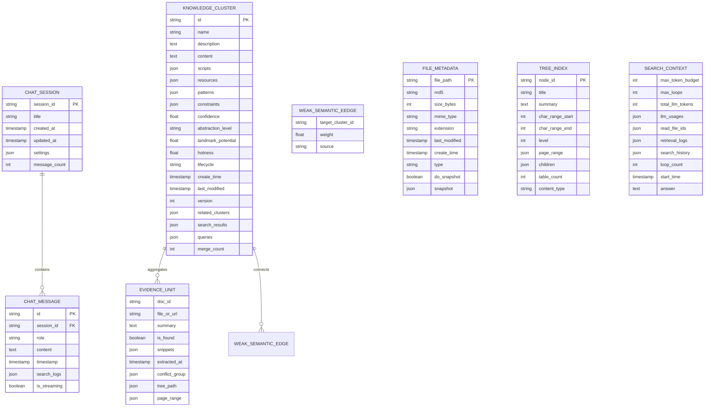
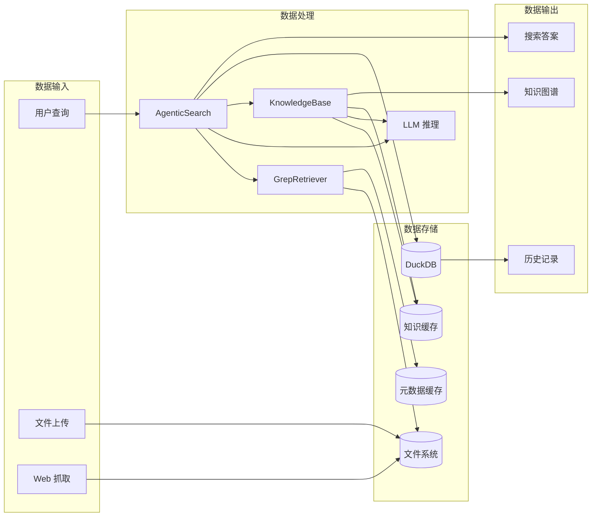

# 6. 数据模型与数据库设计（Data Model & Database Design）

> 本章详细分析 Sirchmunk 的数据模型设计，包括 ER 图、表结构、字段说明、索引策略、缓存机制与数据流向。

---

## 6.0 数据架构总览

Sirchmunk 的数据架构分为三层：

1. **内存数据模型**（`schema/`）：运行时数据结构
2. **关系数据存储**（DuckDB）：会话/消息持久化
3. **文件数据存储**（FileSystem）：知识簇/元数据/缓存

---

## 6.1 ER 图（Mermaid）



---

## 6.2 DuckDB 表结构详细设计

### 6.2.1 `chat_sessions` 表

```sql
CREATE TABLE chat_sessions (
    session_id    VARCHAR PRIMARY KEY,
    title         VARCHAR,
    created_at    TIMESTAMP NOT NULL,
    updated_at    TIMESTAMP NOT NULL,
    settings      JSON,
    message_count INTEGER DEFAULT 0
);
```

**字段说明**：

| 字段 | 类型 | 约束 | 说明 |
|------|------|------|------|
| `session_id` | VARCHAR | PRIMARY KEY | 会话唯一标识（UUID） |
| `title` | VARCHAR | — | 会话标题（首条消息摘要） |
| `created_at` | TIMESTAMP | NOT NULL | 创建时间 |
| `updated_at` | TIMESTAMP | NOT NULL | 最后更新时间 |
| `settings` | JSON | — | 会话设置（模式、启用功能等） |
| `message_count` | INTEGER | DEFAULT 0 | 消息数量 |

**索引**：
```sql
CREATE INDEX idx_sessions_updated ON chat_sessions (updated_at DESC);
```

### 6.2.2 `chat_messages` 表

```sql
CREATE TABLE chat_messages (
    id            VARCHAR PRIMARY KEY,
    session_id    VARCHAR NOT NULL,
    role          VARCHAR NOT NULL,
    content       TEXT NOT NULL,
    timestamp     TIMESTAMP NOT NULL,
    search_logs   JSON,
    is_streaming  BOOLEAN DEFAULT FALSE
);
```

**字段说明**：

| 字段 | 类型 | 约束 | 说明 |
|------|------|------|------|
| `id` | VARCHAR | PRIMARY KEY | 消息唯一标识（UUID） |
| `session_id` | VARCHAR | NOT NULL, FK → chat_sessions | 所属会话 |
| `role` | VARCHAR | NOT NULL | 角色（user/assistant/system） |
| `content` | TEXT | NOT NULL | 消息内容 |
| `timestamp` | TIMESTAMP | NOT NULL | 发送时间 |
| `search_logs` | JSON | — | 搜索日志（搜索结果/工具调用） |
| `is_streaming` | BOOLEAN | DEFAULT FALSE | 是否正在流式传输 |

**索引**：
```sql
CREATE INDEX idx_messages_session ON chat_messages (session_id);
CREATE INDEX idx_messages_timestamp ON chat_messages (timestamp);
```

---

## 6.3 KnowledgeCluster 数据模型详解

### 6.3.1 核心字段

| 字段 | 类型 | 默认值 | 说明 |
|------|------|--------|------|
| `id` | str | — | 全局唯一 ID（格式：`Cxxxx`） |
| `name` | str | — | 可读名称 |
| `description` | str \| List[str] | — | 详细描述（可多视角） |
| `content` | str \| List[str] | — | Markdown 主体内容 |
| `scripts` | List[str] | None | 代码片段 |
| `resources` | List[Dict] | None | 相关资源（URL/文件） |
| `evidences` | List[EvidenceUnit] | [] | 证据引用列表 |
| `patterns` | List[str] | [] | 3-5 条设计原则 |
| `constraints` | List[Constraint] | [] | 边界条件 |
| `confidence` | float | None | 置信度 [0.0, 1.0] |
| `abstraction_level` | AbstractionLevel | None | 抽象级别 |
| `landmark_potential` | float | None | 地标潜力 |
| `hotness` | float | None | 热度分数 |
| `lifecycle` | Lifecycle | EMERGING | 生命周期状态 |
| `create_time` | datetime | now | 创建时间 |
| `last_modified` | datetime | now | 最后修改时间 |
| `version` | int | 0 | 版本号 |
| `related_clusters` | List[WeakSemanticEdge] | [] | 弱语义边 |
| `search_results` | List[str] | [] | 搜索结果文件 |
| `queries` | List[str] | [] | 历史查询 |
| `merge_count` | int | 0 | 合并次数 |

### 6.3.2 生命周期枚举

```python
class Lifecycle(Enum):
    STABLE = "stable"        # 稳定状态
    EMERGING = "emerging"    # 新兴状态
    CONTESTED = "contested"  # 有争议
    DEPRECATED = "deprecated" # 已弃用
    META = "meta"            # 元簇
```

**状态转换**：
```
EMERGING → STABLE (证据充分)
EMERGING → CONTESTED (存在冲突证据)
STABLE → CONTESTED (新冲突证据)
CONTESTED → STABLE (冲突解决)
任何状态 → DEPRECATED (长期未使用)
```

### 6.3.3 抽象级别枚举

```python
class AbstractionLevel(Enum):
    TECHNIQUE = 1      # 技术层（如 QLoRA）
    PRINCIPLE = 2      # 原理层（如 低秩更新）
    PARADIGM = 3       # 范式层（如 参数高效学习）
    FOUNDATION = 4     # 基础层（如 梯度优化）
    PHILOSOPHY = 5     # 哲学层（如 奥卡姆剃刀）
```

---

## 6.4 EvidenceUnit / Constraint / WeakSemanticEdge 模型

### 6.4.1 EvidenceUnit（证据单元）

```python
@dataclass
class EvidenceUnit:
    doc_id: str                    # 源文档 ID（FileInfo.cache_key）
    file_or_url: Union[str, Path]  # 源文件路径或 URL
    summary: str                   # 摘要
    is_found: bool                 # 是否找到答案
    snippets: List[Dict[str, Any]] # 片段列表
    extracted_at: datetime         # 提取时间
    conflict_group: Optional[List[str]]  # 冲突组 ID
    tree_path: Optional[List[str]]       # 树索引路径
    page_range: Optional[List[int]]      # 页码范围
```

**snippets 结构**：
```python
{
    "snippet": "匹配的文本片段",
    "start": 7,          # 起始字符偏移
    "end": 65,           # 结束字符偏移
    "score": 9.0,        # 相关性分数
    "reasoning": "为什么这个片段相关"
}
```

### 6.4.2 Constraint（约束）

```python
@dataclass
class Constraint:
    condition: str    # DSL 表达式（如 "data_size < 100"）
    severity: str     # 严重程度（low/medium/high）
    description: str  # 人类可读解释
```

### 6.4.3 WeakSemanticEdge（弱语义边）

```python
@dataclass
class WeakSemanticEdge:
    target_cluster_id: str  # 目标簇 ID
    weight: float           # [0.0, 1.0] 关联强度
    source: str             # 来源（co_occur/query_seq/embed_sim）
```

---

## 6.5 Cognition 层数据模型

### 6.5.1 RichEdgeType（富语义边类型）

```python
class RichEdgeType(Enum):
    PATHWAY = "pathway"       # 程序性路径
    BARRIER = "barrier"       # 约束/风险边
    ANALOGY = "analogy"       # 概念相似
    SHORTCUT = "shortcut"     # 快速路径
    RESOLUTION = "resolution" # 冲突解决方案
```

### 6.5.2 RichSemanticEdge（富语义边）

```python
@dataclass
class RichSemanticEdge:
    target_cluster_id: str    # 目标簇 ID
    edge_type: RichEdgeType   # 边类型
    meta: Dict[str, Any]      # 边特定载荷
    created_at: Optional[str] # 创建时间
    score: Optional[float]    # 置信度 [0.0, 1.0]
```

**meta 结构示例**：
```python
# PATHWAY
{"steps": ["apply_4bit_quantization"], "required_context": {"task": "finetune"}}

# BARRIER
{"condition": "quant_bits < 4", "severity": "high", "description": "超低比特量化放大剪枝噪声"}

# ANALOGY
{"source_role": "low_rank_delta_in_lm", "target_role": "sparse_delta_in_policy", "mapping_rules": [...]}

# SHORTCUT
{"trigger_pattern": ".*mobile.*qlora.*", "bypass_steps": 2, "source": "user_query_log"}
```

---

## 6.6 SearchContext / RetrievalLog 运行时状态模型

### 6.6.1 SearchContext

```python
@dataclass
class SearchContext:
    max_token_budget: int = 64000
    max_loops: int = 10
    total_llm_tokens: int = 0
    llm_usages: List[Dict[str, Any]] = field(default_factory=list)
    read_file_ids: Set[str] = field(default_factory=set)
    retrieval_logs: List[RetrievalLog] = field(default_factory=list)
    search_history: List[str] = field(default_factory=list)
    loop_count: int = 0
    start_time: datetime = field(default_factory=datetime.now)
    answer: str = ""
    cluster: Optional[KnowledgeCluster] = None
```

**关键方法**：

| 方法 | 功能 | 副作用 |
|------|------|--------|
| `add_llm_tokens(tokens, usage)` | 记录 token 用量 | 更新 total_llm_tokens |
| `is_budget_exceeded()` | 检查预算是否耗尽 | 只读 |
| `budget_remaining` (property) | 返回剩余 token | 只读 |
| `mark_file_read(path)` | 标记文件已读 | 更新 read_file_ids |
| `is_file_read(path)` | 检查文件是否已读 | 只读 |
| `add_log(tool_name, tokens, metadata)` | 记录检索操作 | 追加到 retrieval_logs |
| `increment_loop()` | 循环计数 +1 | 更新 loop_count |
| `is_loop_limit_reached()` | 检查循环上限 | 只读 |
| `to_dict()` | 序列化为遥测数据 | 只读 |

### 6.6.2 RetrievalLog

```python
@dataclass
class RetrievalLog:
    tool_name: str
    tokens: int = 0
    timestamp: datetime = field(default_factory=datetime.now)
    metadata: Dict[str, Any] = field(default_factory=dict)
```

---

## 6.7 文件系统缓存结构

### 6.7.1 StorageStructure 定义

```python
class StorageStructure:
    CACHE_DIR = ".cache"
    METADATA_DIR = "metadata"
    GREP_DIR = "rga"
    KNOWLEDGE_DIR = "knowledge"
    COGNITION_DIR = "cognition"
    CLUSTER_INDEX_FILE = "cluster.idx"
    CLUSTER_CONTENT_FILE = "cluster.mpk"
```

### 6.7.2 完整存储路径树

```
{work_path}/                          # 默认 ~/.sirchmunk
├── .env                              # 环境变量配置
├── data/                             # 搜索数据目录
│   ├── *.pdf, *.docx, *.md, ...     # 被搜索的原始文件
│   └── subdir/                       # 子目录
├── uploads/                          # 上传文件
│   └── {collection}/                 # 按集合组织
│       ├── .manifest.json            # 集合元数据索引
│       └── {files}                   # 上传的文件
├── logs/                             # 日志目录
│   └── audit.log                     # 审计日志（JSON-Lines）
└── .cache/                           # 缓存根目录
    ├── metadata/                     # 文件元数据缓存
    │   ├── {hash}.json               # 单个文件元数据
    │   └── batch_{n}.json            # 批次元数据
    ├── rga/                          # rga 检索缓存
    │   └── {query_hash}.json         # 搜索结果缓存
    ├── knowledge/                    # 知识簇持久化
    │   ├── cluster.idx               # 索引文件（ID → 元数据）
    │   └── cluster.mpk              # MessagePack 序列化内容
    ├── cognition/                    # 认知图数据
    │   └── graph.json                # 知识图谱快照
    ├── history/                      # 聊天历史
    │   └── chat_history.db           # DuckDB 数据库文件
    ├── settings/                     # 设置缓存
    │   └── settings.json             # 用户设置
    └── web_static/                   # WebUI 静态资源
        ├── index.html                # SPA 入口
        ├── _next/                    # Next.js 构建产物
        └── favicon.ico               # 站点图标
```

### 6.7.3 元数据文件格式

```json
{
    "file_or_url": "/path/to/file.pdf",
    "type": "pdf",
    "size_bytes": 1048576,
    "mime_type": "application/pdf",
    "extension": ".pdf",
    "md5": "a1b2c3d4...",
    "cache_key": "a1b2c3d4..._1048576",
    "last_modified": "2024-01-01T00:00:00",
    "create_time": "2024-01-01T00:00:00",
    "do_snapshot": true,
    "snapshot": {
        "keywords": ["LLM", "RAG"],
        "toc": [{"title": "Introduction", "level": 1}]
    }
}
```

### 6.7.4 知识簇持久化格式

**索引文件**（`cluster.idx`）：
```json
{
    "C1001": {
        "name": "QLoRA",
        "version": 3,
        "lifecycle": "stable",
        "last_modified": "2024-01-01T00:00:00"
    },
    "C1002": {
        "name": "Speculative Decoding",
        "version": 1,
        "lifecycle": "emerging"
    }
}
```

**内容文件**（`cluster.mpk`）：
- MessagePack 二进制格式
- 包含完整的 KnowledgeCluster 序列化数据
- 按 cluster_id 索引

---

## 6.8 索引策略

### 6.8.1 DuckDB 索引

| 表 | 索引 | 类型 | 用途 |
|----|------|------|------|
| `chat_sessions` | `PRIMARY KEY (session_id)` | Hash | 精确查找 |
| `chat_sessions` | `idx_sessions_updated` | B-Tree | 按时间排序 |
| `chat_messages` | `PRIMARY KEY (id)` | Hash | 精确查找 |
| `chat_messages` | `idx_messages_session` | B-Tree | 按会话查询 |
| `chat_messages` | `idx_messages_timestamp` | B-Tree | 按时间范围查询 |

### 6.8.2 SummaryIndex（摘要索引）

**用途**：当 rga 关键词搜索返回零结果时的回退检索。

**结构**：
```python
@dataclass
class SummaryIndexEntry:
    file_path: str
    summary: str
    embedding: Optional[List[float]]  # 384 维，预归一化
    tokens: Optional[List[str]]       # 分词结果
    token_freqs: Optional[Dict[str, int]]  # 词频
```

**融合算法**：
1. 计算嵌入余弦相似度（semantic channel）
2. 计算 BM25 分数（lexical channel）
3. Z-Score 归一化两个通道
4. 加权组合：`alpha * z_embedding + (1-alpha) * z_bm25`
5. Sigmoid 激活得到最终分数

**BM25 参数**：
```python
_BM25_K1 = 1.5
_BM25_B = 0.75
_DEFAULT_ALPHA = 0.5  # 嵌入权重
```

### 6.8.3 TreeIndex（树索引）

**用途**：为长文档构建层级结构，支持 LLM 导航。

**TreeNode 结构**：
```python
@dataclass
class TreeNode:
    node_id: str                      # 唯一标识（如 N000000）
    title: str                        # 章节标题
    summary: str                      # 300 字符摘要
    char_range: Tuple[int, int]       # 字符范围 [start, end)
    level: int                        # 层级深度
    page_range: Optional[Tuple[int, int]]  # 页码范围
    children: List[TreeNode]          # 子节点
    table_count: int                  # 关联表格数
    content_type: str                 # "text" | "table"
```

---

## 6.9 缓存策略

### 6.9.1 多级缓存架构

```
┌─────────────────────────────────────────┐
│            L1: 内存缓存                  │
│  - SearchContext (运行时)               │
│  - LLMUsageTracker (全局单例)           │
│  - ToolRegistry (工具实例)              │
├─────────────────────────────────────────┤
│            L2: 文件系统缓存              │
│  - 文件元数据 JSON                      │
│  - rga 检索结果 JSON                    │
│  - 知识簇 MessagePack                   │
│  - 树索引 JSON                          │
├─────────────────────────────────────────┤
│            L3: DuckDB 持久化             │
│  - 聊天会话表                           │
│  - 聊天消息表                           │
│  - 知识索引表（预留）                   │
└─────────────────────────────────────────┘
```

### 6.9.2 缓存失效策略

| 缓存类型 | 失效策略 | 检测方式 |
|---------|---------|---------|
| 文件元数据 | 基于 (size, mtime) 变更检测 | `FileScanner._base_metadata_cache` |
| rga 检索结果 | TTL + 查询哈希 | 预留（当前每次重新检索） |
| 知识簇 | 版本号 + last_modified | `KnowledgeStorage` |
| 树索引 | 基于文件 MD5 | `TreeIndexer` |

### 6.9.3 变更检测（文件元数据）

```python
# FileScanner 使用 (file_path, size, mtime) 三元组检测变更
_base_metadata_cache: Dict[str, Tuple[int, datetime]]
# key: "/path/to/file@ISOtimestamp"
# value: (size_bytes, last_modified)
```

---

## 6.10 事务设计与数据一致性

### 6.10.1 DuckDB 事务

**Direct 模式**：标准 ACID 事务
**Persist 模式**：内存操作 + 定期批量回写

**原子写入保证**：
1. 写入 `.tmp_duckdb` 临时文件
2. `os.rename()` 原子替换目标文件
3. 崩溃安全（不会出现半写文件）

### 6.10.2 知识簇一致性

**写入流程**：
1. 更新内存中的 KnowledgeCluster
2. 序列化为 MessagePack
3. 写入 `cluster.mpk`
4. 更新 `cluster.idx` 索引

**并发控制**：
- 当前版本无显式锁（单进程部署）
- 多进程部署时依赖 DuckDB 的文件锁

---

## 6.11 数据流向图

### 6.11.1 Mermaid 数据流向图



### 6.11.2 数据流向说明

**搜索流向**：
1. 用户查询 → AgenticSearch → GrepRetriever → 文件系统
2. 检索结果 → LLM 推理 → 答案生成
3. 答案 + 遥测数据 → DuckDB 持久化

**知识流向**：
1. 检索结果 → KnowledgeBase → 证据聚合
2. 证据 → KnowledgeCompiler → KnowledgeCluster
3. KnowledgeCluster → KnowledgeStorage → 文件系统

**历史流向**：
1. 聊天消息 → HistoryStorage → DuckDB
2. DuckDB → History API → 前端展示

---

## 6.12 本章小结

本章完整分析了 Sirchmunk 的数据模型与数据库设计：

| 方面 | 关键决策 |
|------|---------|
| 关系数据库 | DuckDB（嵌入式 OLAP，零运维） |
| 知识持久化 | MessagePack + 文件系统 |
| 元数据缓存 | JSON + 变更检测 |
| 检索回退 | SummaryIndex（嵌入 + BM25 融合） |
| 长文档索引 | TreeIndex（层级结构） |
| 缓存策略 | 多级缓存（内存 → 文件 → DB） |
| 一致性 | 原子写入 + 版本号 |

**设计亮点**：
1. DuckDB 双模式（Direct/Persist）兼顾性能与持久化
2. 知识簇完整的生命周期管理
3. 多级检索回退（rga → SummaryIndex）
4. 可追溯性（知识 → 证据 → 原始文档）

---

☕️ 制作不易，请我喝咖啡☕️关注我➕

