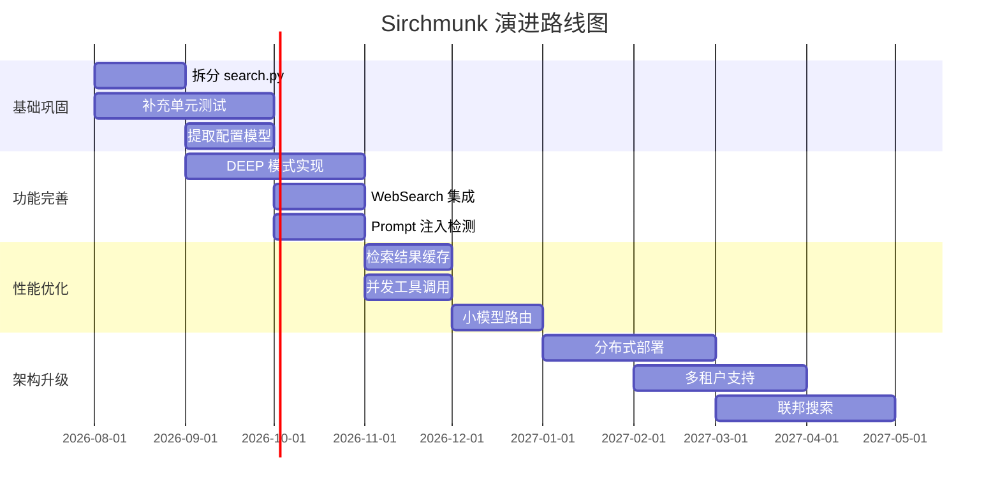

# 9. 改进建议、风险点与未来规划（Improvements, Risks & Roadmap）

> 本章对 Sirchmunk 当前架构进行客观评估，分析优缺点、可扩展性、安全加固、性能优化、重构建议，并提供技术债清单与未来路线图。

---

## 9.0 评估方法论

- **优点分析**：基于架构设计与代码实现，识别做得好的地方
- **缺点分析**：基于代码走读，识别设计缺陷与实现不足
- **风险识别**：基于部署与运维视角，识别潜在风险
- **改进建议**：提供具体可操作的优化方向
- **优先级排序**：按影响/成本矩阵排序技术债

---

## 9.1 当前架构优势详细分析

### 9.1.1 架构设计优势

| 优势 | 说明 | 影响 |
|------|------|------|
| **分层清晰** | 5 层架构（API → Agent → Engine → Retrieval → Storage）无循环依赖 | 易于理解、测试、扩展 |
| **工具可插拔** | ToolRegistry + BaseTool 抽象，新增工具零改动现有代码 | 高扩展性 |
| **知识自进化** | 四阶段渐进式进化（Connect → Refresh → Meta → Global） | 系统越用越聪明 |
| **多协议接入** | Web/CLI/MCP 三种入口共享核心引擎 | 行为一致性 |
| **嵌入式存储** | DuckDB + 文件系统，零外部依赖 | 部署简单 |
| **多 Provider** | OpenAI 兼容 API，支持多种 LLM 提供商 | 避免厂商锁定 |

### 9.1.2 代码质量优势

| 优势 | 说明 |
|------|------|
| **类型注解** | 全代码 Python type hints，提升可读性与 IDE 支持 |
| **文档字符串** | 所有公共函数均有 docstring |
| **异步优先** | 全链路 asyncio，无阻塞 I/O |
| **安全设计** | shell=False、HMAC 比较、路径白名单 |
| **错误恢复** | LLM 自动重试、子进程隔离、nudge 机制 |

### 9.1.3 部署运维优势

| 优势 | 说明 |
|------|------|
| **单容器部署** | API + WebUI 统一镜像，运维简单 |
| **多架构支持** | amd64 + arm64 自动适配 |
| **中国镜像加速** | `--mirror cn` 支持 |
| **预下载模型** | 镜像内预装 embedding 模型，启动即用 |

---

## 9.2 当前架构缺点与风险详细分析

### 9.2.1 架构层面缺点

| 缺点 | 严重程度 | 说明 |
|------|---------|------|
| **单文件过长** | 🔴 高 | `search.py` ~7900 行，违反单一职责原则 |
| **知识进化全局锁** | 🟡 中 | Evolver 未实现并发安全，多进程部署可能数据损坏 |
| **缺少分布式支持** | 🟡 中 | 当前仅支持单实例，无集群部署方案 |
| **WebSearch 未实现** | 🟡 中 | WebSearchTool 仅有占位符，无法真正搜索网络 |
| **DEEP 模式不完整** | 🟡 中 | `mode="DEEP"` 分支逻辑尚未完全实现 |

### 9.2.2 代码层面缺点

| 缺点 | 严重程度 | 说明 |
|------|---------|------|
| **硬编码参数** | 🟡 中 | max_loops、max_token_budget 等参数散布多处 |
| **缺少单元测试** | 🔴 高 | 核心模块无测试覆盖 |
| **Prompt 注入防护不足** | 🟡 中 | 仅有预留接口，无实际检测逻辑 |
| **正则工具解析脆弱** | 🟡 中 | `_parse_tool_call` 可能误匹配 |
| **缺少类型约束** | 🟢 低 | 部分函数返回类型使用 `Any` |

### 9.2.3 运维层面风险

| 风险 | 严重程度 | 说明 |
|------|---------|------|
| **LLM 成本不可控** | 🔴 高 | 无单次搜索 token 上限（仅有总预算） |
| **DuckDB 数据丢失** | 🟡 中 | Persist 模式定期回写，崩溃可能丢失最近数据 |
| **rga 二进制依赖** | 🟡 中 | 镜像内嵌特定版本 rga，升级需重新构建 |
| **模型下载失败** | 🟢 低 | 首次启动依赖 ModelScope 可用性 |
| **磁盘空间耗尽** | 🟡 中 | 无缓存清理策略，长期使用可能占满磁盘 |

---

## 9.3 可扩展性建议

### 9.3.1 短期（1-3 个月）

| 建议 | 优先级 | 说明 |
|------|--------|------|
| **拆分 search.py** | P0 | 拆分为 intent_detection / keyword_extraction / pipeline_coordinator 3 个模块 |
| **实现 DEEP 模式** | P1 | 完整的多轮蒙特卡洛采样逻辑 |
| **实现 WebSearch** | P1 | 集成 SerpAPI / Tavily 等搜索 API |
| **添加配置模型** | P1 | 提取 SearchConfig / EvolutionConfig dataclass |

### 9.3.2 中期（3-6 个月）

| 建议 | 优先级 | 说明 |
|------|--------|------|
| **分布式部署** | P2 | 支持多 worker 共享知识库 |
| **向量检索回退** | P2 | 当 rga + SummaryIndex 均失败时使用向量检索 |
| **知识版本控制** | P2 | 知识簇变更历史与回滚能力 |
| **插件系统** | P2 | 外部工具动态加载（entry_points） |

### 9.3.3 长期（6-12 个月）

| 建议 | 优先级 | 说明 |
|------|--------|------|
| **多租户支持** | P3 | 用户隔离的知识库与权限管理 |
| **联邦搜索** | P3 | 跨多个 Sirchmunk 实例联合搜索 |
| **自动模型选择** | P3 | 根据查询复杂度自动选择 LLM |

---

## 9.4 安全加固建议

### 9.4.1 认证与授权

| 建议 | 优先级 | 说明 |
|------|--------|------|
| **JWT Token** | P1 | 替代静态 Bearer Token，支持过期与刷新 |
| **RBAC** | P2 | 基于角色的访问控制（admin/user/readonly） |
| **API Key 轮换** | P2 | 支持多 Token 与定期轮换 |

### 9.4.2 输入安全

| 建议 | 优先级 | 说明 |
|------|--------|------|
| **Prompt 注入检测** | P1 | 实现 `_detect_prompt_injection()` 实际逻辑 |
| **查询长度限制** | P1 | 限制单次查询最大长度（如 10K 字符） |
| **文件名长度限制** | P2 | 防止超长文件名导致文件系统问题 |

### 9.4.3 网络安全

| 建议 | 优先级 | 说明 |
|------|--------|------|
| **HTTPS 终止** | P1 | 生产环境前置 Nginx/Traefik 处理 TLS |
| **IP 白名单** | P2 | 限制可访问 API 的 IP 范围 |
| **请求签名** | P3 | 对敏感操作添加请求签名验证 |

### 9.4.4 数据安全

| 建议 | 优先级 | 说明 |
|------|--------|------|
| **敏感数据脱敏** | P2 | 日志中自动脱敏 API Key 等敏感信息 |
| **数据加密** | P3 | 静态数据加密（知识簇/会话） |
| **审计日志完整性** | P2 | 审计日志防篡改（append-only + 签名） |

---

## 9.5 性能优化建议

### 9.5.1 检索性能

| 建议 | 优先级 | 说明 | 预期收益 |
|------|--------|------|---------|
| **rga 结果流式处理** | P1 | 使用生成器逐行读取，避免内存溢出 | 内存 -80% |
| **检索结果缓存** | P1 | LRU 缓存热门查询结果 | 延迟 -50% |
| **并发工具调用** | P2 | 支持多个工具并行执行 | 延迟 -30% |
| **预编译正则** | P3 | 缓存编译后的正则表达式 | CPU -10% |

### 9.5.2 LLM 性能

| 建议 | 优先级 | 说明 | 预期收益 |
|------|--------|------|---------|
| **Token 预算分阶段** | P1 | 为每个阶段（意图/关键词/循环）分配子预算 | 成本 -20% |
| **结果缓存** | P1 | 相同查询直接返回缓存结果 | 成本 -40% |
| **小模型路由** | P2 | 简单查询使用小模型，复杂查询使用大模型 | 成本 -30% |
| **流式输出优化** | P2 | 减少首 token 延迟 | 体验提升 |

### 9.5.3 存储性能

| 建议 | 优先级 | 说明 | 预期收益 |
|------|--------|------|---------|
| **DuckDB WAL 模式** | P2 | 使用 WAL 提升写入性能 | 写入 +50% |
| **知识簇分片** | P2 | 按 ID 范围分片存储大知识库 | 查询 +30% |
| **元数据批量加载** | P3 | 启动时批量加载元数据到内存 | 启动 +20% |

---

## 9.6 代码质量与重构建议

### 9.6.1 高优先级重构

| 重构项 | 说明 | 工作量 |
|--------|------|--------|
| **拆分 search.py** | 拆分为 3-5 个子模块 | 2-3 天 |
| **提取配置模型** | 所有硬编码参数提取为 dataclass | 1 天 |
| **统一异常处理** | 定义 SearchError / RetrievalError 等异常层次 | 1 天 |
| **类型注解补全** | 消除所有 `Any` 类型 | 2 天 |

### 9.6.2 中优先级重构

| 重构项 | 说明 | 工作量 |
|--------|------|--------|
| **Prompt 外部化** | 将 Prompt 模板移至 YAML/JSON 配置 | 2 天 |
| **工具描述外部化** | 工具 schema 移至配置文件 | 1 天 |
| **日志结构化** | 统一日志格式（JSON） | 1 天 |
| **API 响应模型** | 定义 Pydantic 响应模型替代 Dict | 2 天 |

### 9.6.3 设计模式增强

| 模式 | 应用场景 | 收益 |
|------|---------|------|
| **观察者模式** | 搜索事件通知（多订阅者） | 解耦事件生产与消费 |
| **策略模式** | 检索排序策略可切换 | 灵活切换 BM25/TF-IDF/嵌入 |
| **装饰器模式** | 工具执行前后置处理 | 统一添加日志/超时/缓存 |
| **工厂模式** | LLM 客户端创建 | 支持多 Provider 动态切换 |

---

## 9.7 技术债清单与优先级

### 9.7.1 技术债矩阵

| ID | 技术债 | 影响 | 成本 | 优先级 |
|----|--------|------|------|--------|
| TD-01 | search.py 单文件过长 | 高 | 中 | **P0** |
| TD-02 | 缺少单元测试 | 高 | 高 | **P0** |
| TD-03 | DEEP 模式未实现 | 中 | 中 | **P1** |
| TD-04 | WebSearch 未实现 | 中 | 低 | **P1** |
| TD-05 | Prompt 注入检测缺失 | 高 | 低 | **P1** |
| TD-06 | Token 预算无阶段限制 | 中 | 低 | **P1** |
| TD-07 | 硬编码参数 | 中 | 低 | **P1** |
| TD-08 | 正则工具解析脆弱 | 中 | 中 | **P2** |
| TD-09 | 缺少缓存清理策略 | 中 | 低 | **P2** |
| TD-10 | 无分布式支持 | 低 | 高 | **P3** |
| TD-11 | 知识进化并发不安全 | 中 | 中 | **P2** |
| TD-12 | 审计日志无完整性保护 | 低 | 中 | **P3** |

### 9.7.2 偿还计划

**Sprint 1（2 周）**：
- TD-01：拆分 search.py
- TD-06：Token 预算分阶段
- TD-07：提取配置模型

**Sprint 2（2 周）**：
- TD-05：Prompt 注入检测
- TD-04：WebSearch 实现
- 补充核心模块单元测试

**Sprint 3（2 周）**：
- TD-03：DEEP 模式实现
- TD-08：工具解析改用 Function Calling
- TD-09：缓存清理策略

---

## 9.8 未来演进路线图建议

### 9.8.1 路线图总览

### 9.8.2 V1.0（当前 → 3 个月）

**目标**：稳定核心功能，补齐基础短板

- ✅ 拆分 search.py
- ✅ 补充核心模块单元测试（覆盖率 > 60%）
- ✅ 实现 DEEP 模式
- ✅ Prompt 注入检测
- ✅ Token 预算分阶段控制

### 9.8.3 V1.5（3 → 6 个月）

**功能完善与性能优化

- 🔄 WebSearch 集成（SerpAPI / Tavily）
- 🔄 检索结果缓存（Redis / 内存 LRU）
- 🔄 并发工具调用
- 🔄 小模型路由（成本优化）
- 🔄 向量检索回退（FAISS / Chroma）

### 9.8.4 V2.0（6 → 12 个月）

**架构升级与生态扩展

- 📋 分布式部署（多 worker 集群）
- 📋 多租户支持（用户隔离）
- 📋 联邦搜索（跨实例联合检索）
- 📋 自动模型选择（查询复杂度感知）
- 📋 插件系统（entry_points 动态加载）

---

## 9.9 本章小结

本章对 Sirchmunk 进行了全面的架构评估：

**核心优势**（保持）：
1. 分层清晰，无循环依赖
2. 工具可插拔，扩展性强
3. 知识自进化，越用越聪明
4. 嵌入式存储，部署简单

**关键改进**（优先）：
1. 拆分 search.py（P0）
2. 补充单元测试（P0）
3. Prompt 注入检测（P1）
4. Token 预算分阶段（P1）

**最大风险**：
1. LLM 成本不可控
2. 缺少测试覆盖
3. 单文件过长导致维护困难

**演进方向**：
- 短期：稳定核心、补齐短板
- 中期：功能完善、性能优化
- 长期：分布式、多租户、联邦搜索

---

☕️ 制作不易，请我喝咖啡☕️关注我➕

