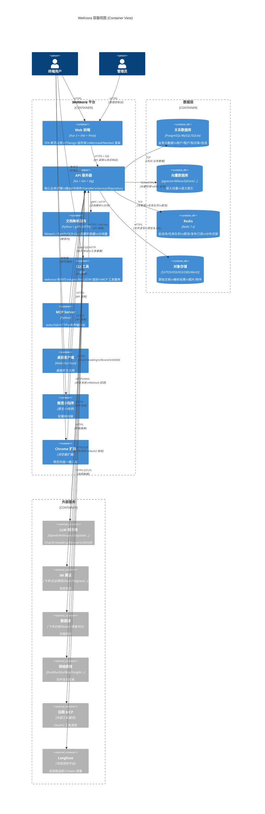
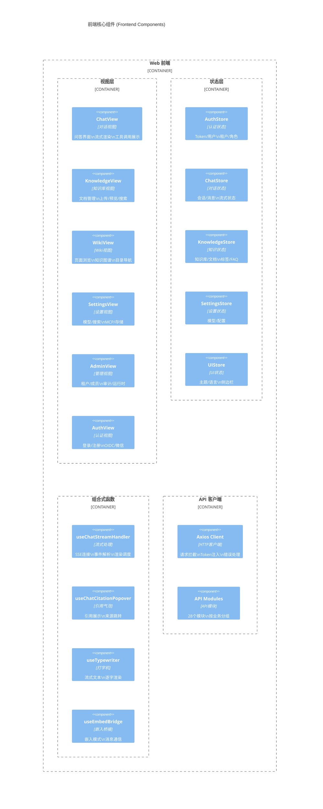
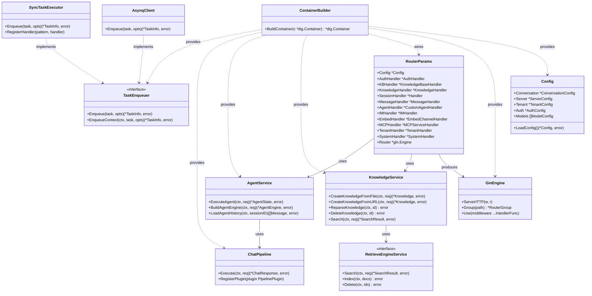

# 第 2 章 C4 架构模型

> C4 模型（Context / Container / Component / Code）是 Simon Brown 提出的软件架构可视化方法，自顶向下逐层放大系统的抽象粒度。本章为 WeKnora 绘制完整的四层架构视图。

---

## 2.1 Context 图（系统上下文）

Context 图展示系统与外部角色（人、外部系统）的最高层关系，回答"系统是什么、为谁服务、与哪些外部系统交互"。

### 2.1.1 Mermaid 图表

```mermaid
C4Context
    title WeKnora 系统上下文图 (System Context)

    Person(endUser, "终端用户", "知识工作者/开发者/客服\n通过 Web/IM/小程序提问")
    Person(adminUser, "管理员", "企业知识管理员\n配置模型/知识库/权限")
    Person(developer, "开发者", "通过 API/CLI/SDK 集成")

    System(weknora, "WeKnora", "LLM 驱动企业知识框架\nRAG问答 + ReAct Agent + Wiki模式")

    System_Ext(im_feishu, "飞书 IM", "企业 IM 渠道")
    System_Ext(im_wecom, "企业微信 IM", "企业 IM 渠道")
    System_Ext(im_slack, "Slack", "企业 IM 渠道")
    System_Ext(im_telegram, "Telegram", "IM 渠道")
    System_Ext(im_dingtalk, "钉钉", "IM 渠道")
    System_Ext(im_qqbot, "QQ Bot", "IM 渠道")
    System_Ext(im_wechat, "微信", "IM + 公众号/小程序")
    System_Ext(im_yunzhijia, "云之家", "企业 IM 渠道")
    System_Ext(im_mattermost, "Mattermost", "企业 IM 渠道")

    System_Ext(llm_openai, "OpenAI", "LLM 提供商")
    System_Ext(llm_anthropic, "Anthropic", "LLM 提供商")
    System_Ext(llm_deepseek, "DeepSeek", "LLM 提供商")
    System_Ext(llm_qwen, "通义千问", "LLM 提供商")
    System_Ext(llm_gemini, "Gemini", "LLM 提供商")
    System_Ext(llm_zhipu, "智谱 AI", "LLM 提供商")
    System_Ext(llm_ollama, "Ollama", "本地 LLM")
    System_Ext(llm_others, "其他 22 家 LLM", "MiniMax/Hunyuan/NVIDIA/\nNovita/SiliconFlow/OpenRouter/...")

    System_Ext(ds_feishu, "飞书文档", "外部数据源")
    System_Ext(ds_notion, "Notion", "外部数据源")
    System_Ext(ds_yuque, "语雀", "外部数据源")
    System_Ext(ds_rss, "RSS 订阅", "外部数据源")

    System_Ext(mcp_server, "外部 MCP Server", "远程工具服务 (OAuth2)")
    System_Ext(web_search, "网络搜索引擎", "DuckDuckGo/Bing/Google/\nTavily/Baidu/SearXNG/...")

    System_Ext(storage_s3, "对象存储", "S3/TOS/OSS/KS3/OBS/MinIO")
    System_Ext(vec_db, "向量数据库", "pgvector/Milvus/Qdrant/\nWeaviate/ES/OpenSearch/...")

    Rel(endUser, weknora, "问答/管理/搜索", "HTTPS / WSS")
    Rel(adminUser, weknora, "配置/管理", "HTTPS")
    Rel(developer, weknora, "API 调用", "HTTPS + API Key")

    Rel(weknora, im_feishu, "收发消息", "Webhook / WebSocket")
    Rel(weknora, im_wecom, "收发消息", "Webhook / WebSocket")
    Rel(weknora, im_slack, "收发消息", "Webhook / WebSocket")
    Rel(weknora, im_telegram, "收发消息", "Long Polling / Webhook")
    Rel(weknora, im_dingtalk, "收发消息", "Webhook / WebSocket")
    Rel(weknora, im_qqbot, "收发消息", "WebSocket")
    Rel(weknora, im_wechat, "收发消息", "Long Polling / Webhook")
    Rel(weknora, im_yunzhijia, "收发消息", "WebSocket")
    Rel(weknora, im_mattermost, "收发消息", "Webhook / WebSocket")

    Rel(weknora, llm_openai, "Chat/Embedding/Rerank", "HTTPS")
    Rel(weknora, llm_anthropic, "Chat/Embedding/Rerank", "HTTPS")
    Rel(weknora, llm_deepseek, "Chat", "HTTPS")
    Rel(weknora, llm_qwen, "Chat/Embedding", "HTTPS")
    Rel(weknora, llm_gemini, "Chat/Embedding", "HTTPS")
    Rel(weknora, llm_zhipu, "Chat/Embedding/Rerank/Search", "HTTPS")
    Rel(weknora, llm_ollama, "Chat/Embedding/VLM/ASR", "HTTPS (本地)")
    Rel(weknora, llm_others, "Chat/Embedding/Rerank", "HTTPS")

    Rel(weknora, ds_feishu, "同步文档", "HTTPS API")
    Rel(weknora, ds_notion, "同步文档", "HTTPS API")
    Rel(weknora, ds_yuque, "同步文档", "HTTPS API")
    Rel(weknora, ds_rss, "拉取订阅", "HTTPS")

    Rel(weknora, mcp_server, "调用工具", "OAuth2 + HTTPS/SSE")
    Rel(weknora, web_search, "搜索", "HTTPS")
    Rel(weknora, storage_s3, "读写文件", "HTTPS")
    Rel(weknora, vec_db, "向量检索", "TCP/HTTPS")

    UpdateRelStyle(endUser, weknora, $offsetX="-40", $offsetY="0")
    UpdateRelStyle(weknora, llm_openai, $offsetX="0", $offsetY="-20")
```

### 2.1.2 详细文字说明

#### 系统边界

WeKnora 是核心系统边界，封装了文档理解、语义检索、智能推理、知识生成、多渠道接入的全部能力。系统对外暴露三种交互界面：**Web UI**（SPA 单页应用）、**RESTful API**（`/api/v1`）、**IM 适配器**（9 个渠道的 Webhook/WebSocket 回调）。

#### 外部角色

- **终端用户**：通过 Web 浏览器、IM 机器人、微信小程序、网站嵌入控件发起知识问答请求，是系统的核心消费者。
- **管理员**：通过 Web UI 配置模型、管理知识库、设置权限、查看审计日志和运行时仪表盘。
- **开发者**：通过 REST API、CLI 工具（`weknora`）、Go SDK（`client/`）进行系统集成和自动化。

#### 外部系统交互

系统通过标准化协议与外部系统交互：

1. **LLM 提供商**（29 个）：通过 HTTPS 调用 OpenAI 兼容或原生 API，执行 Chat 对话、Embedding 向量化、Rerank 重排、VLM 视觉理解、ASR 语音识别。Provider 层统一为 `chat.Chat`、`embedding.Embedder`、`rerank.Reranker`、`vlm.VLM`、`asr.ASR` 五个接口。

2. **IM 渠道**（9 个）：通过 Webhook（HTTP POST）或 WebSocket/Long Polling 接收用户消息，经 QA 队列调度后异步处理并流式回复。每个渠道实现 `im.Adapter` 接口。

3. **外部数据源**（4 个）：通过各平台 API 拉取文档，经连接器（`datasource/connector/`）转换为统一格式后进入解析-分块-嵌入管道。

4. **网络搜索引擎**（9 个）：Agent 模式下自主调用，补充知识库未覆盖的信息。

5. **外部 MCP Server**：通过 OAuth2 授权后调用远程工具服务，支持会话中途授权（mid-conversation OAuth）。

6. **对象存储**：支持 7 种存储后端，多实例按知识库绑定。

7. **向量数据库**：支持 12+ 引擎，运行时动态创建。

#### 设计 Rationale

Context 图的设计遵循"系统边界清晰、外部依赖显式化"原则。WeKnora 的核心竞争力在于**将所有外部依赖抽象为可插拔接口**——LLM、向量库、存储、IM、搜索引擎均不硬编码，通过配置和数据库记录动态绑定。这使得企业可以在不修改代码的情况下切换底层基础设施，满足数据主权和合规要求。

---

## 2.2 Container 图（容器视图）

Container 图展示系统内部的高层技术容器（每个容器是一个可独立部署/运行的单元），以及容器间的通信协议。

### 2.2.1 Mermaid 图表

### 2.2.2 详细文字说明

#### 容器清单与职责

1. **Web 前端**（`frontend/`）：Vue 3 + Vite + Pinia 构建的 SPA，部署为静态资源（由 nginx 或 Go 嵌入服务提供）。使用 TDesign Vue Next 组件库，支持 Mermaid 图表渲染、Marked + KaTeX Markdown 渲染、文档预览（docx/pptx/xlsx）、虚拟滚动、国际化（vue-i18n）。464 个源文件，18.2 万行代码。

2. **API 服务器**（`cmd/server/` + `internal/`）：系统核心，Go 编写，Gin 框架提供 HTTP 服务。包含路由层、中间件层、Handler 层、Service 层、Repository 层、Models 层。1,492 个 Go 文件，37.5 万行代码。负责所有业务逻辑：认证授权、知识库管理、文档解析编排、RAG 检索、Agent 推理、IM 接入、任务调度。

3. **文档解析服务**（`docreader/`）：Python 编写，提供 gRPC 和 HTTP 两种传输协议。集成 MinerU（PDF/Word/PPT 解析）、PaddleOCR-VL（视觉语言模型 OCR）、内置转换器（Markdown/HTML/JSON/EPUB/MHTML）。52 个 Python 文件。独立部署可实现解析能力的服务化和资源隔离。

4. **CLI 工具**（`cli/`）：Go 编写的命令行工具，284 个 Go 文件。Agent-first 设计，输出稳定 JSON 信封，支持 `--format text` 人类可读模式。提供 `weknora mcp serve` 暴露 MCP 工具表面，内置 Agent Skills。

5. **MCP Server**（`mcp-server/`）：Python 编写的 MCP 协议服务器，支持 stdio/SSE/HTTP 三种传输。10 个 Python 文件。

6. **桌面客户端**（`cmd/desktop/`）：基于 Wails 框架的桌面应用，Go 后端 + Vue 前端。

7. **微信小程序**（`miniprogram/`）：原生微信小程序，提供 API 配置、知识库选择、URL 导入、问答等轻量功能。

8. **Chrome 扩展**：浏览器扩展，支持选择文本/图片/整页一键入库。

#### 数据存储容器

- **关系数据库**（PostgreSQL/MySQL/Site）：存储业务元数据——用户、租户、成员、知识库、知识文档、分块、会话、消息、标签、FAQ、Wiki 页面、审计日志、任务记录等。
- **向量数据库**（12+ 引擎）：存储文档嵌入向量，支持 ANN 近似最近邻检索。
- **Redis**：会话流管理（SSE 事件持久化）、asynq 任务队列、滑动窗口限流、系统设置发布订阅、跨实例消息传递。
- **对象存储**（7 种后端）：原始文档、解析产物、图片附件、临时文档。

#### 容器间通信协议

| 通信路径 | 协议 | 说明 |
|---------|------|------|
| Web UI ↔ API Server | HTTPS + SSE | RESTful API + Server-Sent Events 流式推送 |
| API Server ↔ DocReader | gRPC (默认) / HTTP | 文档解析请求，支持 TLS + Token 认证 |
| API Server ↔ 关系数据库 | TCP (SQL) | GORM 连接池，SQLite 用 WAL 模式 |
| API Server ↔ 向量数据库 | TCP/HTTPS | 各引擎原生协议 |
| API Server ↔ Redis | TCP | go-redis，支持 TLS |
| API Server ↔ LLM | HTTPS | OpenAI 兼容或原生 API |
| API Server ↔ IM | HTTPS/WSS | Webhook 接收 + 主动发送 |
| API Server ↔ Langfuse | HTTPS (OTLP) | OpenTelemetry 追踪数据导出 |

#### 设计 Rationale

容器设计遵循"单一职责"和"技术异构"原则：
- **API 服务器**集中所有业务逻辑，无状态设计支持水平扩展。
- **DocReader**独立部署，Python 生态的 PDF/OCR 库更丰富，gRPC 提供高效二进制传输。
- **前端**纯静态资源，可部署到 CDN 或由 Go 嵌入服务统一提供。
- **数据层**支持多引擎——关系库可选 PG/MySQL/SQLite，向量库可选 12+ 引擎，存储可选 7 种后端。

---

## 2.3 Component 图（组件视图）

Component 图展示单个容器内部的组件结构。本节选取三个核心容器进行组件级分解。

### 2.3.1 API 服务器核心组件

```mermaid
  C4Component
      title API 服务器核心组件 (API Server Components)

      Container_Boundary(api, "API 服务器", "Go + Gin") {
          Container_Boundary(router, "路由层") {
              Component(gin_engine, "Gin Engine", "HTTP 引擎", "路由注册\n中间件链\n请求分发")
              Component(router_registrar, "Router Registrar", "router.go", "路由注册器\n~150 个端点\n分组/守卫绑定")
          }

          Container_Boundary(mw, "中间件层") {
              Component(auth_mw, "Auth Middleware", "JWT/API Key", "认证 + 租户解析\n角色注入")
              Component(rbac_mw, "RBAC Middleware", "角色守卫", "4级角色\n资源所有权\nKB访问控制")
              Component(apikey_mw, "API Key Gate", "能力守卫", "作用域授权\n默认拒绝")
              Component(audit_mw, "Audit Middleware", "审计注入", "审计服务注入")
              Component(lang_mw, "Language Middleware", "语言检测", "Accept-Language\n环境变量")
              Component(log_mw, "Logger Middleware", "请求日志", "结构化日志\n敏感脱敏")
              Component(cors_mw, "CORS Middleware", "跨域", "Allow-Origin: *")
              Component(recover_mw, "Recovery Middleware", "恐慌恢复", "recover + 500")
              Component(err_mw, "ErrorHandler Middleware", "错误处理", "AppError → JSON")
          }

          Container_Boundary(handler, "Handler 层") {
              Component(auth_h, "AuthHandler", "认证", "注册/登录/登出\nOIDC/Token刷新")
              Component(kb_h, "KnowledgeBaseHandler", "知识库", "CRUD/搜索\n复制/移动/固定")
              Component(knowledge_h, "KnowledgeHandler", "知识文档", "上传/URL/手动\n解析/重解析/删除")
              Component(session_h, "SessionHandler", "会话", "CRUD/流式问答\n附件/标题生成")
              Component(message_h, "MessageHandler", "消息", "历史加载/搜索\n删除/统计")
              Component(agent_h, "CustomAgentHandler", "Agent", "CRUD/复制\n占位符/预设")
              Component(im_h, "IMHandler", "IM", "渠道CRUD\n回调处理")
              Component(embed_h, "EmbedChannelHandler", "嵌入", "渠道CRUD\n会话交换")
              Component(mcp_h, "MCPServiceHandler", "MCP", "服务CRUD\n工具审批")
              Component(tenant_h, "TenantHandler", "租户", "CRUD/API Key\n成员/邀请")
              Component(admin_h, "SystemHandler", "系统", "设置/运行时\n平台管理")
          }

          Container_Boundary(service, "Service 层") {
              Component(agent_svc, "AgentService", "Agent 服务", "ReAct 引擎编排\n工具注册\n事件发射")
              Component(chat_pipe, "ChatPipeline", "对话管道", "可组合插件链\n检索+生成")
              Component(kb_search, "KB Search", "知识检索", "混合检索\n融合排序\nFan-out")
              Component(knowledge_svc, "KnowledgeService", "知识服务", "上传/解析\n分块/嵌入\n索引编排")
              Component(wiki_svc, "Wiki Service", "Wiki 服务", "自动知识生成\n去重/分类/互链")
              Component(session_svc, "SessionService", "会话服务", "会话生命周期\n消息持久化")
              Component(tenant_svc, "TenantService", "租户服务", "多租户\n成员/邀请\nAPI Key")
              Component(im_svc, "IMService", "IM 服务", "渠道管理\nQA队列\n流式回复")
              Component(embed_svc, "EmbedService", "嵌入服务", "渠道配置\n会话管理\nToken交换")
              Component(mcp_svc, "MCPService", "MCP 服务", "客户端管理\nOAuth生命周期")
              Component(task_svc, "Task Service", "任务服务", "异步任务\n队列管理\n死信处理")
          }

          Container_Boundary(repo, "Repository 层") {
              Component(kb_repo, "KBRepository", "知识库", "知识库/知识/分块\nCRUD")
              Component(session_repo, "SessionRepository", "会话", "会话/消息\nCRUD")
              Component(tenant_repo, "TenantRepository", "租户", "租户/成员\n邀请/API Key")
              Component(wiki_repo, "WikiPageRepository", "Wiki", "页面/文件夹\n日志")
              Component(task_repo, "TaskQueueRepository", "任务队列", "任务记录\n死信")
              Component(retriever_repo, "RetrieverRepository", "检索引擎", "向量CRUD\nANN查询")
          }

          Container_Boundary(models, "Models 层") {
              Component(chat_model, "Chat Model", "对话模型", "29个Provider\n统一Chat接口")
              Component(emb_model, "Embedding Model", "嵌入模型", "向量化\n批处理")
              Component(rerank_model, "Rerank Model", "重排模型", "结果重排")
              Component(vlm_model, "VLM Model", "视觉模型", "图片理解")
              Component(asr_model, "ASR Model", "语音模型", "语音识别")
          }

          Container_Boundary(infra, "Infrastructure 层") {
              Component(docparser_infra, "DocParser", "文档解析", "引擎注册表\nMinerU/PaddleOCR")
              Component(chunker_infra, "Chunker", "分块器", "heading/heuristic\nadaptive 3-tier")
              Component(websearch_infra, "WebSearch", "网络搜索", "9个引擎注册表")
              Component(event_bus, "EventBus", "事件总线", "进程内事件\n发布订阅")
              Component(stream_mgr, "StreamManager", "流管理器", "SSE事件\nRedis/Memory")
              Component(langfuse_tracing, "Langfuse", "追踪", "全链路追踪\nOTLP导出")
          }
      }
  
      Rel(gin_engine, router_registrar, "注册路由")
      Rel(gin_engine, auth_mw, "认证")
      Rel(auth_mw, rbac_mw, "授权")
      Rel(rbac_mw, apikey_mw, "API Key 守卫")
      Rel(apikey_mw, session_h, "分发到 Handler")
      Rel(session_h, agent_svc, "调用业务逻辑")
      Rel(agent_svc, kb_repo, "数据访问")
      Rel(agent_svc, chat_model, "LLM 调用")
      Rel(agent_svc, event_bus, "事件/基础设施")
```

### 2.3.2 Agent 引擎组件

```mermaid
  C4Component
      title Agent 引擎组件 (Agent Engine Components)

      Container_Boundary(agent, "Agent 引擎", "internal/agent/") {
          Component(engine, "AgentEngine", "核心引擎", "ReAct 循环编排\n状态管理\n事件发射")
          Component(act, "Act Phase", "行动阶段", "工具调用\n并行/串行执行\n参数校验")
          Component(think, "Think Phase", "思考阶段", "LLM 流式调用\n重试/退避\n思维链解析")
          Component(observe, "Observe Phase", "观察阶段", "响应分析\n上下文管理\n消息组装")
          Component(finalize, "Finalize", "终结阶段", "最终答案生成\n最大迭代处理\n事件发射")
          Component(prompts, "Prompt Builder", "提示构建", "系统提示\n占位符渲染\nWiki 提示")

          Container_Boundary(tools, "工具层") {
              Component(tool_registry, "ToolRegistry", "工具注册表", "工具注册/查找\n执行管道\n输出截断")
              Component(kb_search_tool, "KnowledgeSearch", "知识检索", "混合检索\nRerank\nMMR去重")
              Component(web_search_tool, "WebSearch", "网络搜索", "9个引擎")
              Component(web_fetch_tool, "WebFetch", "网页抓取", "SSRF安全")
              Component(db_query_tool, "DatabaseQuery", "数据库查询", "DuckDB SQL")
              Component(data_analysis_tool, "DataAnalysis", "数据分析", "DuckDB OLAP")
              Component(mcp_tool, "MCPTool", "MCP工具", "远程工具代理")
              Component(skill_tool, "SkillTool", "技能工具", "技能执行")
              Component(wiki_tools, "WikiTools", "Wiki工具", "页面读写\n问题标记")
              Component(grep_tool, "GrepChunks", "分块搜索", "关键词搜索")
          }

          Container_Boundary(skills, "技能层") {
              Component(skill_mgr, "SkillManager", "技能管理器", "发现/加载\n3级渐进揭示\n白名单")
              Component(skill_loader, "SkillLoader", "技能加载器", "文件系统发现\n路径安全")
          }

          Container_Boundary(memory, "记忆层") {
              Component(consolidator, "Consolidator", "记忆整合器", "LLM摘要压缩\n上下文窗口管理")
              Component(token_est, "TokenEstimator", "Token估算器", "BPE编码\n消息估算")
              Component(compressor, "Compressor", "压缩器", "确定性裁剪\n工具调用完整性")
          }

          Container_Boundary(approval, "审批层") {
              Component(approval_gate, "ApprovalGate", "审批门控", "人工审批\nRedis跨实例\n故障关闭")
          }
      }

      Rel(engine, think, "调用LLM")
      Rel(engine, act, "执行工具")
      Rel(engine, observe, "分析响应")
      Rel(engine, finalize, "生成答案")
      Rel(engine, prompts, "构建提示")
      Rel(think, tool_registry, "工具定义")
      Rel(act, tool_registry, "执行")
      Rel(tool_registry, kb_search_tool, "分发执行")
      Rel(observe, consolidator, "上下文管理")
      Rel(consolidator, token_est, "估算")
      Rel(act, approval_gate, "审批检查")
```

### 2.3.3 前端核心组件

### 2.3.4 详细文字说明

#### API 服务器组件设计 Rationale

API 服务器采用经典的**六边形架构**（端口与适配器），核心领域逻辑（Service/Repository）不依赖外部框架：

1. **路由层**（`internal/router/`）：2391 行的 `router.go` 是唯一的路由注册中心，所有 ~150 个端点在此注册，并绑定 RBAC 守卫和 API Key 策略。`rbac.go`（631 行）集中管理所有角色/所有权/访问控制守卫。

2. **中间件层**（`internal/middleware/`）：24 个文件，请求处理链为：CORS → RequestID → Language → Logger → Recovery → ErrorHandler → Auth → RBAC → APIKeyGate → KB Access → Audit → Handler。每个中间件职责单一，可独立测试。

3. **Handler 层**（`internal/handler/`）：81 个文件，每个 Handler 结构体注入所需 Service 接口，HTTP 处理方法仅做参数绑定、调用 Service、渲染响应，不包含业务逻辑。

4. **Service 层**（`internal/application/service/`）：161 个文件，核心业务逻辑所在。`AgentService` 编排 ReAct 引擎，`ChatPipeline` 编排 RAG 插件链，`KnowledgeService` 编排解析-分块-嵌入管道，`WikiService` 编排 Wiki 生成流程。

5. **Repository 层**（`internal/application/repository/`）：56 个文件，封装所有数据库访问，接口定义在 `types/interfaces/`，实现可替换。

6. **Models 层**（`internal/models/`）：LLM 提供商（Chat/Embedding/Rerank/VLM/ASR）的统一接口和 29+ 个实现。

#### Agent 引擎组件设计 Rationale

Agent 引擎是系统最复杂的部分，采用**ReAct（Reasoning + Acting）**模式：

- **Think**：调用 LLM 流式获取思考链和工具调用意图
- **Act**：执行工具调用（支持并行），结果写入事件总线
- **Observe**：分析 LLM 响应判断是否停止，管理上下文窗口
- **Finish**：生成最终答案

工具系统采用**注册表模式**（`ToolRegistry`），67 个工具文件覆盖知识检索、网络搜索、数据库查询、数据分析、MCP 远程工具、技能执行、Wiki 页面操作等。

记忆系统采用**两级压缩**：LLM 语义摘要（`Consolidator`）+ 确定性裁剪（`Compressor`），确保长对话不溢出上下文窗口。

---

## 2.4 Code 图（代码/类视图）

Code 图展示关键组件内部的类型/类结构。本节选取 Agent 引擎和 DI 容器两个核心。

### 2.4.1 Agent 引擎类图

```mermaid
classDiagram
    class AgentEngine {
        -config *AgentConfig
        -toolRegistry *ToolRegistry
        -chatModel Chat
        -eventBus *EventBus
        -knowledgeBasesInfo []*KnowledgeBaseInfo
        -selectedDocs []*SelectedDocumentInfo
        -pinnedMCPServices []*PinnedMCPServiceInfo
        -pinnedSkills []*PinnedSkillInfo
        -sessionID string
        -skillsManager *SkillsManager
        -imageDescriber ImageDescriberFunc
        -tokenEstimator *Estimator
        -memoryConsolidator *Consolidator
        -resourceRefs *Registry
        -sourceRefs *Registry
        +Execute(ctx, sessionID, messageID, query, llmContext) (*AgentState, error)
        +SetPinnedMentions(mcpServices, skills)
        +SetAppConfig(cfg)
        +SetImageDescriber(fn)
        +SetSkillsManager(mgr)
        -executeLoop(ctx, state, query, messages, tools) (*AgentState, error)
        -runReActIteration(ctx, state, messages, tools) (iterOutcome, error)
        -streamThinkingToEventBus(ctx, messages, tools) (*ChatResponse, error)
        -callLLMWithRetry(ctx, messages, tools, state) (*ChatResponse, error)
        -executeToolCalls(ctx, response, step, iteration)
        -analyzeResponse(ctx, response, step) responseVerdict
        -manageContextWindow(ctx, messages, round) []Message
        -streamFinalAnswerToEventBus(ctx, query, state) error
        -buildSystemPrompt(ctx) string
        -buildMessagesWithLLMContext(systemPrompt, query, llmContext) []Message
    }

    class AgentConfig {
        +MaxIterations int
        +MaxContextTokens int
        +WebSearchEnabled bool
        +ParallelToolCalls bool
        +CitationsEnabled bool
        +LLMCallTimeout int
    }

    class AgentState {
        +IsComplete bool
        +FinalAnswer string
        +Steps []*AgentStep
        +KnowledgeRefs []*KnowledgeRef
        +Usage TokenUsage
    }

    class AgentStep {
        +Iteration int
        +Thought string
        +ToolCalls []ToolCall
        +ToolResults []ToolResult
    }

    class ToolRegistry {
        -tools map[string]Tool
        -maxToolOutputSize int
        +RegisterTool(tool)
        +GetTool(name) (Tool, error)
        +ListTools() []string
        +GetFunctionDefinitions() []FunctionDefinition
        +ExecuteTool(ctx, name, args) (*ToolResult, error)
        +Cleanup(ctx)
    }

    class Tool {
        <<interface>>
        +Name() string
        +Description() string
        +Parameters() json.RawMessage
        +Execute(ctx, args) (*ToolResult, error)
    }

    class KnowledgeSearchTool {
        +Execute(ctx, args) (*ToolResult, error)
        -concurrentSearchByTargets(ctx, queries, targets)
        -rerankResults(ctx, query, results)
        -rerankWithModel(ctx, query, results)
        -rerankWithLLM(ctx, query, results)
        -applyMMR(ctx, results, k, lambda)
        -deduplicateResults(results)
        -formatOutput(ctx, results)
    }

    class Chat {
        <<interface>>
        +Chat(ctx, messages, opts) (*ChatResponse, error)
        +StreamChat(ctx, messages, opts, streamFunc) error
    }

    class EventBus {
        +Publish(event *Event)
        +Subscribe(handler EventHandler)
    }

    class Consolidator {
        -chatModel Chat
        -estimator *Estimator
        -maxTokens int
        -threshold float64
        +ShouldConsolidate(currentTokens) bool
        +Consolidate(ctx, messages) ([]Message, error)
    }

    class SkillsManager {
        -loader *Loader
        -sandboxMgr SandboxManager
        -allowedSkills []string
        -metadataCache []*SkillMetadata
        +Initialize(ctx) error
        +GetAllMetadata() []*SkillMetadata
        +LoadSkill(ctx, name) (*Skill, error)
        +ExecuteScript(ctx, name, path, args) (*ExecuteResult, error)
    }

    class ApprovalGate {
        -pending map[string]*waiter
        -checker Checker
        -timeout time.Duration
        -rdb *RedisClient
        +NeedsApproval(ctx, tenantID, serviceID, toolName) bool
        +RequestAndWait(ctx, req) (Decision, error)
        +Resolve(tenantID, userID, pendingID, decision) error
    }

    AgentEngine --> AgentConfig : uses
    AgentEngine --> ToolRegistry : owns
    AgentEngine --> Chat : uses
    AgentEngine --> EventBus : publishes
    AgentEngine --> Consolidator : uses
    AgentEngine --> SkillsManager : uses
    AgentEngine --> ApprovalGate : delegates
    AgentEngine ..> AgentState : produces
    AgentState --> AgentStep : contains
    ToolRegistry --> Tool : manages
    KnowledgeSearchTool ..> Tool : implements
```

### 2.4.2 DI 容器依赖图

### 2.4.3 详细文字说明

#### Agent 引擎类设计 Rationale

AgentEngine 是**无状态引擎模式**的典型实现——引擎本身不维护跨轮次的会话历史，每轮对话由调用方（`AgentService`）从数据库重建 `llmContext` 传入。这种设计的优势：

1. **水平扩展友好**：引擎无状态，请求可路由到任意实例
2. **故障恢复简单**：中断后可从任意轮次重新开始
3. **测试友好**：输入确定则输出确定，无隐藏状态

核心接口设计：
- `Chat` 接口抽象了所有 LLM 提供商，`StreamChat` 方法支持流式回调
- `Tool` 接口抽象了所有工具，`Execute` 方法统一参数（`json.RawMessage`）和结果（`*ToolResult`）
- `EventBus` 接口解耦了 Agent 执行与结果消费

#### DI 容器设计 Rationale

`BuildContainer` 函数是整个系统的"组装图"，遵循**依赖倒置原则**：

- 所有组件通过接口注册，`dig.As(new(interfaces.XxxService))` 暴露接口
- 条件分支（Lite vs 分布式）在容器内完成，外部组件无感知
- `dig.Name` 用于区分同一类型的多个实例（如 6 个 asynq server、5 个 extract service）
- 启动钩子通过 `dig.Invoke` 注册（如 Langfuse cleanup、pool cleanup）

容器构建的层次顺序：
1. 核心基础设施（Config、Langfuse、DB、FileService、Redis、Pool）
2. 检索引擎注册表 + 外部客户端（DocParser、Ollama、Neo4j、Stream、DuckDB）
3. Repository 层（~35 个）
4. MCP Manager + Service 层（~35 个）
5. Web Search 注册表 + Agent/Session 服务
6. Task Enqueuer（asynq 或 sync）
7. Connector Registry + DataSource Scheduler
8. Chat Pipeline 插件
9. HTTP Handler（~30 个）
10. IM 适配器（9 个）
11. Router + Asynq Server
12. Wiki 任务恢复

---

> **下一章**：[第 3 章 系统流程与时序图](./03-flows-sequence.md) — 10 个核心业务流程的详细流程图和时序图。

---

# ❤️ 制作不易，请我喝咖啡☕️关注我➕

