# 第 3 章 系统流程与时序图

> 本章详细描述 WeKnora 的 10 个核心业务流程，每个流程均配有 Mermaid 流程图或时序图，并提供 300-500 字的步骤逻辑、涉及文件/函数、异常处理说明。

---

## 3.1 用户认证与多租户准入流程

### 3.1.1 流程图

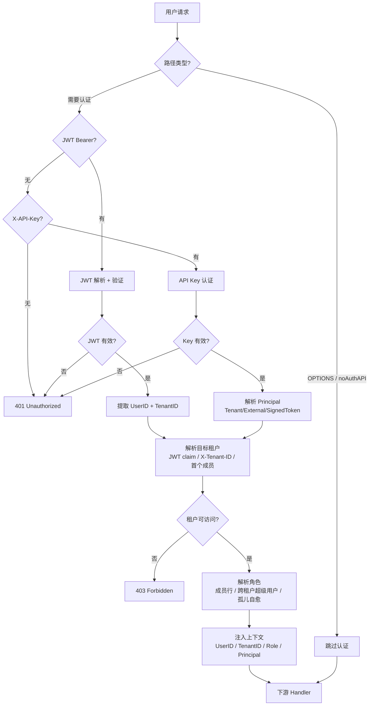

### 3.1.2 时序图

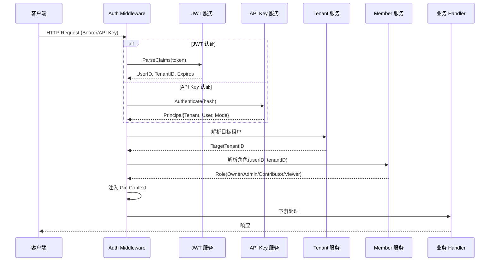

### 3.1.3 详细说明

**步骤逻辑**：

1. **路径分类**：`auth.go` 的 `isNoAuthAPI()` 检查路径是否在白名单（`/health`、`/auth/login`、`/auth/register`、OIDC 回调、预签名 URL 等），白名单内请求跳过认证。
2. **JWT 认证**：`ParseClaims()` 解析 Bearer Token，验证签名、过期时间、发行者。
3. **API Key 回退**：无 JWT 时尝试 `X-API-Key` 头，通过 SHA-256 哈希匹配。支持 Tenant Key（固定租户）和 Platform Key（需 `X-Tenant-ID`）。
4. **租户解析**：优先级为 JWT claim → `X-Tenant-ID` 头（跨租户切换）→ 用户首个活跃成员关系。`IsTenantAccessible()` 验证用户是否有权访问目标租户（归属租户 / 跨租户超级用户 / 活跃成员）。
5. **角色解析**：`resolveTenantRole()` 4 步决策：① 活跃成员行角色 → ② 跨租户超级用户 → ③ 孤儿租户自愈（自动提升为 Owner）→ ④ 根据 `EnableRBAC` 标志决定故障关闭/开放。
6. **上下文注入**：将 `UserID`、`TenantID`、`Role`、`Principal` 注入 Gin Context 和 Request Context。

**涉及文件/函数**：
- `internal/middleware/auth.go`：`Auth()`、`ParseClaims()`、`authenticateAPIKeyRequest()`、`resolveTenantRole()`
- `internal/middleware/access.go`：`IsTenantAccessible()`、`IsCrossTenantSuperuser()`

**异常处理**：
- JWT 过期/签名错误 → 401
- 租户不可访问 → 403
- API Key 无效 → 401
- 角色解析失败 → 根据 `EnableRBAC` 决定 403 或放行（降级）

---

## 3.2 知识库创建与文档上传解析流程

### 3.2.1 流程图

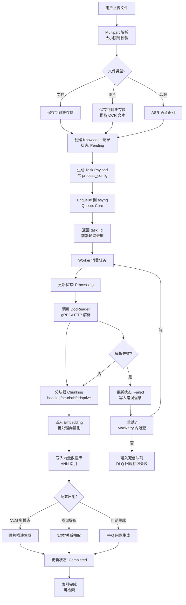

### 3.2.2 时序图

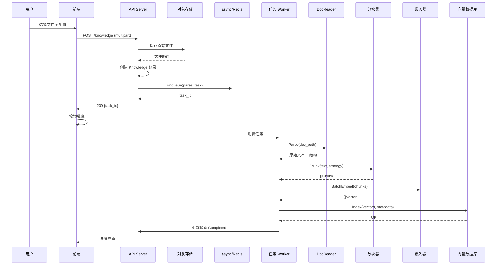

### 3.2.3 详细说明

**步骤逻辑**：

1. **上传接收**：`KnowledgeHandler.CreateKnowledgeFromFile()` 解析 multipart 表单，校验文件大小（配置限制），保存到绑定的对象存储后端。
2. **记录创建**：创建 `Knowledge` 记录，初始状态 `ParseStatusPending`，记录来源类型（file/url/manual）、文件元数据。
3. **任务入队**：`KnowledgeService` 构造 `KnowledgeProcessPayload`（含 `process_config`：解析器选择、分块策略、是否启用 VLM/图谱/问答生成），入队到 asynq `QueueCore`。
4. **异步处理**：Worker 消费任务，调用 DocReader（gRPC/HTTP）解析文档为原始文本 + 结构信息。
5. **分块**：根据配置选择 `heading_splitter`（标题层级分割）、`heuristic_splitter`（启发式）或 `adaptive`（自适应 3 级）。
6. **嵌入**：`embedding/batch.go` 批量调用嵌入模型，将文本块转为向量。
7. **索引**：向量写入向量数据库（引擎由知识库配置决定），建立 ANN 索引。
8. **后处理**：根据配置可选执行 VLM 图片描述、实体/关系抽取（图谱）、FAQ 问题生成。
9. **状态更新**：各阶段状态实时更新（`Pending → Processing → Completed/Failed`），前端通过 `GetKnowledgeSpans` 获取 5 阶段 trace 树。

**涉及文件/函数**：
- `internal/handler/knowledge.go`：`CreateKnowledgeFromFile()`
- `internal/application/service/knowledge_create.go`、`knowledge_process.go`
- `internal/infrastructure/docparser/`：引擎注册表、gRPC/HTTP 解析器
- `internal/infrastructure/chunker/`：分块策略
- `internal/models/embedding/`：嵌入批处理

**异常处理**：
- 文件过大 → 400 错误
- 解析失败 → 状态置为 `Failed`，记录错误信息，可手动重试
- 嵌入失败 → 重试（指数退避），超过最大重试进入 DLQ
- DLQ 回调 `newDeadLetterKnowledgeFailer()` 标记知识记录为失败

---

## 3.3 RAG 问答流程

### 3.3.1 流程图

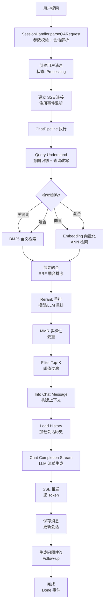

### 3.3.2 时序图

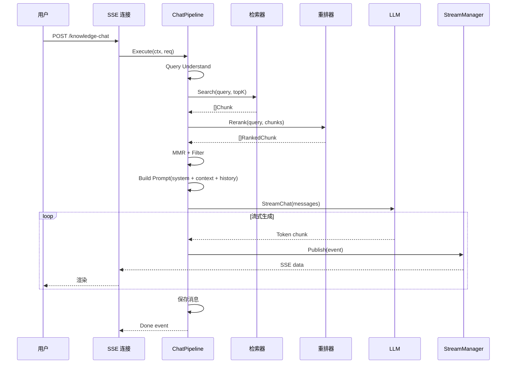

### 3.3.3 详细说明

**步骤逻辑**：

1. **请求解析**：`session/qa.go` 的 `parseQARequest()` 校验输入、解析会话、处理附件、构建 `qaRequestContext`。
2. **消息持久化**：创建用户消息（`Message` 表，`Role=user`），状态 `Processing`。
3. **SSE 建立**：前端通过 `/continue-stream/:session_id` 建立 SSE 连接，注册事件处理器。
4. **ChatPipeline 执行**：`chat_pipeline/` 按序执行插件：
   - `Query Understand`：意图识别、查询改写、查询扩展
   - `Search`：调用 `KnowledgeSearchTool` 的混合检索（BM25 + 向量）
   - `Rerank`：使用 Rerank 模型或 LLM 对结果重排
   - `Web Fetch`：可选抓取网页全文
   - `Merge`：多源结果融合
   - `Data Analysis`：可选 DuckDB 数据分析
   - `Into Chat Message`：将检索结果构建为 LLM 上下文
   - `Chat Completion Stream`：调用 LLM 流式生成答案
5. **流式推送**：LLM 返回的每个 Token 通过 EventBus → StreamManager → SSE 推送。
6. **后处理**：保存助手消息、更新会话、生成后续问题建议。

**涉及文件/函数**：
- `internal/handler/session/qa.go`：`KnowledgeQA()`、`parseQARequest()`
- `internal/application/service/chat_pipeline/`：管道插件
- `internal/agent/tools/knowledge_search.go`：`Execute()`、`concurrentSearchByTargets()`
- `internal/handler/session/agent_stream_handler.go`：SSE 事件处理

**异常处理**：
- 检索无结果 → 返回配置的 Fallback Response
- LLM 超时 → 重试（`maxLLMRetries=2`），仍失败返回降级消息
- SSE 断开 → 后台继续完成，重连后继续播放

---

## 3.4 ReAct Agent 多步推理流程

### 3.4.1 流程图

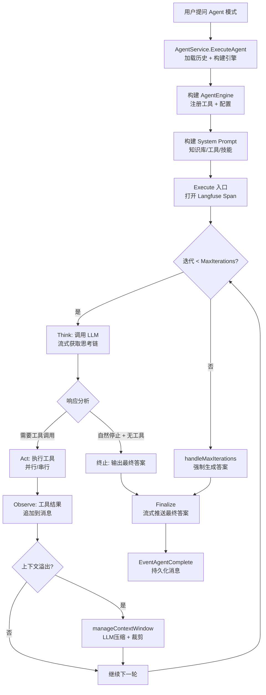

### 3.4.2 时序图

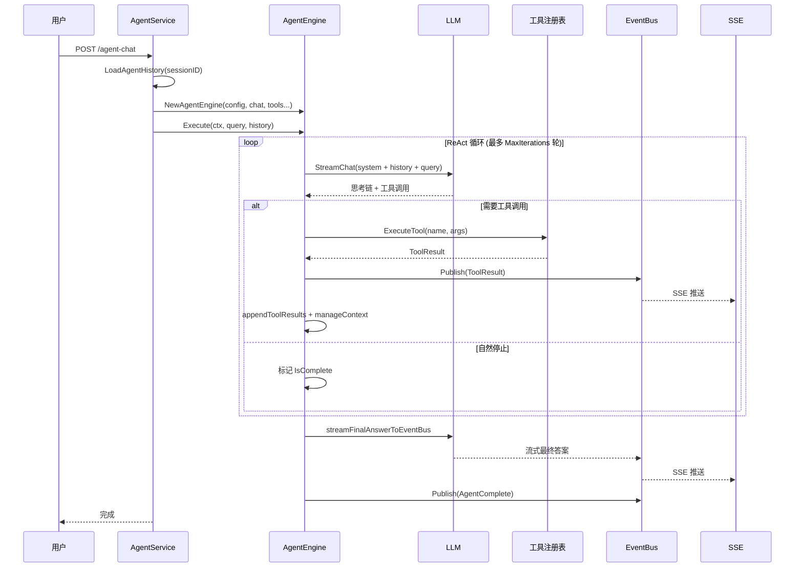

### 3.4.3 详细说明

**步骤逻辑**：

1. **引擎构建**：`AgentService.ExecuteAgent()` 加载会话历史（`LoadAgentHistory`），构建 `AgentEngine`，注册所有可用工具（知识检索、网络搜索、数据库查询、数据分析、MCP 工具、技能执行等）。
2. **系统提示**：`BuildSystemPrompt()` 根据知识库数量选择模板（纯 Agent / Progressive RAG），渲染 `{{knowledge_bases}}`、`{{web_search_status}}`、`{{current_time}}`、`{{language}}` 等占位符，追加技能元数据。
3. **ReAct 循环**（`executeLoop`）：
   - **Think**：`callLLMWithRetry()` 调用 LLM，流式获取思考链（`reasoning_content`）和工具调用意图。`streamThinkingToEventBus()` 实时推送思考过程。
   - **Analyze**：`analyzeResponse()` 判断停止条件——自然停止（`stop`/`end_turn`）且无工具调用则终止；`content_filter` 则输出安全消息。
   - **Act**：`executeToolCalls()` 执行工具调用。若启用 `ParallelToolCalls` 且 ≥2 个调用，使用 `errgroup` 并行执行；否则顺序执行。每个工具执行前后发射事件。
   - **Observe**：`appendToolResults()` 将工具结果追加为消息；`manageContextWindow()` 在上下文溢出时先调用 LLM 语义摘要压缩，再确定性裁剪。
4. **终止条件**：自然停止、最大迭代次数（默认 20）、上下文取消。
5. **最终答案**：`streamFinalAnswerToEventBus()` 基于所有工具结果生成最终答案，流式推送。

**涉及文件/函数**：
- `internal/agent/engine.go`：`Execute()`、`executeLoop()`、`runReActIteration()`
- `internal/agent/think.go`：`streamThinkingToEventBus()`、`callLLMWithRetry()`
- `internal/agent/act.go`：`executeToolCalls()`、`executeToolCallsParallel()`
- `internal/agent/observe.go`：`analyzeResponse()`、`manageContextWindow()`
- `internal/agent/finalize.go`：`streamFinalAnswerToEventBus()`

**异常处理**：
- LLM 瞬态错误（429/5xx/超时）→ 重试 2 次，线性退避
- 工具执行失败 → 返回错误消息，Agent 可重试或换工具
- 上下文溢出 → LLM 压缩 + 确定性裁剪（保留工具调用完整性）
- 最大迭代耗尽 → `handleMaxIterations()` 强制生成总结性答案
- 空响应/重复响应 → 计数器超限后终止

---

## 3.5 Wiki 模式自动知识生成流程

### 3.5.1 流程图

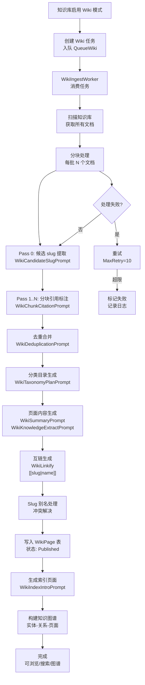

### 3.5.2 详细说明

**步骤逻辑**：

1. **任务触发**：知识库创建 Wiki 或重启后恢复（`recoverPendingWikiTasks`），入队到 `QueueWiki`（独立 Wiki 池，容量隔离）。
2. **文档扫描**：`WikiIngestBatch` 获取知识库所有已完成解析的文档。
3. **两阶段提取**：
   - **Pass 0**（`WikiCandidateSlugPrompt`）：轻量级提取候选实体/概念骨架（name, slug, aliases, description）。
   - **Pass 1..N**（`WikiChunkCitationPrompt`）：将候选 slug 映射到实质性讨论的分块 ID，块顺序优化 Provider 前缀缓存。
4. **去重**（`WikiDeduplicationPrompt`）：严格去重——仅当描述同一现实世界事物且名称变体时才合并。
5. **分类**（`WikiTaxonomyPlanPrompt`）：为每个页面分配目录路径，构建连贯的树状结构。
6. **内容生成**（`WikiSummaryPrompt` + `WikiKnowledgeExtractPrompt`）：为每个实体/概念生成结构化 Markdown 内容，遵循 Wiki 链接规则（`[[slug|name]]`）和图片规则（逐字复制 opaque URL）。
7. **互链**（`WikiLinkify`）：自动在页面间创建双向 `[[...]]` 链接。
8. **别名处理**（`WikiSlugAlias`）：处理 slug 冲突，维护别名映射。
9. **持久化**：写入 `wiki_pages` 表，状态 `Published`。
10. **索引 + 图谱**：生成索引页面介绍，构建知识图谱（实体-关系-页面三元组）。

**涉及文件/函数**：
- `internal/agent/prompts_wiki.go`：所有 Wiki LLM 提示模板
- `internal/application/service/wiki_ingest.go`、`wiki_ingest_batch.go`
- `internal/application/service/wiki_ingest_dedup.go`、`wiki_ingest_taxonomy.go`
- `internal/application/service/wiki_linkify.go`、`wiki_slug_alias.go`
- `internal/application/service/wiki_page.go`

**异常处理**：
- 单批处理失败 → 重试（固定 15s 退避，`WikiIngestConcurrent` 错误专用）
- 超过最大重试 → 标记失败，记录 `wiki_log_entries`
- 并发冲突 → 利用 `ON CONFLICT` 合并语义

---

## 3.6 IM 渠道消息接收与 QA 队列流程

### 3.6.1 流程图

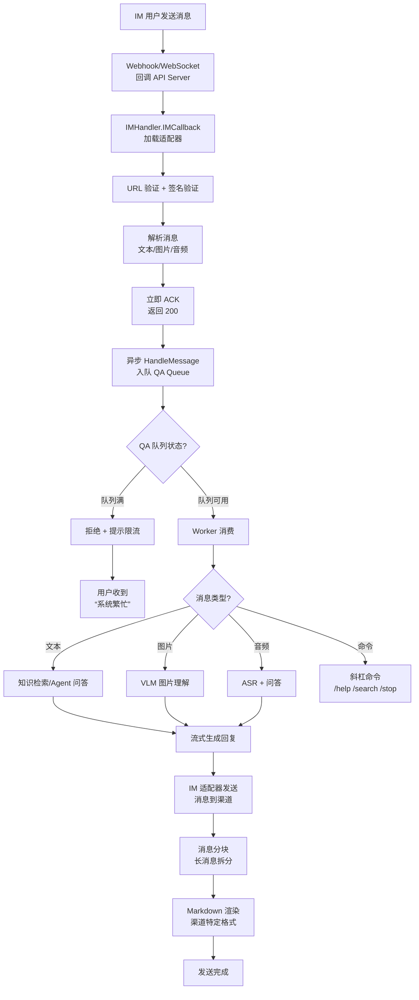

### 3.6.2 时序图

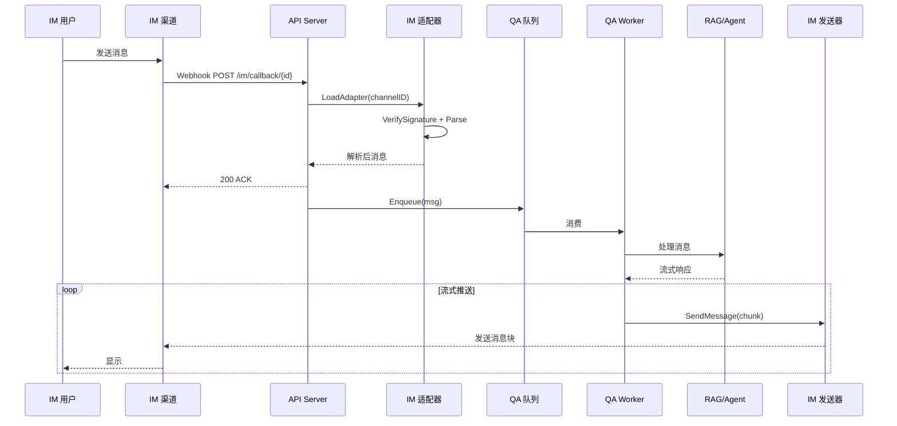

### 3.6.3 详细说明

**步骤逻辑**：

1. **消息接收**：IM 渠道通过 Webhook（HTTP POST）或 WebSocket 推送消息到 `IMHandler.IMCallback()`。
2. **验证**：加载对应渠道适配器（`im.Adapter`），验证 URL（首次配置）和消息签名（HMAC）。
3. **解析**：适配器解析消息为统一格式（文本/图片/音频/命令），提取用户标识和内容。
4. **立即 ACK**：返回 200 防止渠道重试，实际处理异步进行。
5. **QA 队列**：消息入队到 `qaqueue.QAQueue`，受以下限制：
   - 每实例 `MaxQueueSize`（默认 50）
   - 全局 `GlobalMaxWorkers`（Redis 计数器）
   - 每用户 `MaxPerUser`（默认 3）
   - 滑动窗口 `RateLimitWindow`/`RateLimitMax`
6. **Worker 消费**：Worker 从队列取消息，根据类型分发：
   - 文本 → RAG 问答 或 Agent 推理
   - 图片 → VLM 图片理解 + 问答
   - 音频 → ASR 语音识别 + 问答
   - 命令 → 斜杠命令（`/help`、`/search`、`/stop` 等）
7. **流式回复**：响应通过适配器的 `SendMessage()` 推送，长消息自动分块，Markdown 转为渠道特定格式。

**涉及文件/函数**：
- `internal/handler/im.go`：`IMCallback()`
- `internal/im/service.go`：IM 服务编排
- `internal/im/qaqueue.go`：QA 队列管理
- `internal/im/{wecom,feishu,slack,telegram,dingtalk,wechat,qqbot,yunzhijia,mattermost}/`：9 个适配器
- `internal/im/supervisor.go`：Worker 监管

**异常处理**：
- 队列满 → 返回"系统繁忙"提示
- 用户超限 → 拒绝并提示稍后重试
- 处理超时 → 超时后返回降级消息
- 发送失败 → 重试 3 次，记录错误日志

---

## 3.7 MCP OAuth2 授权与工具调用流程

### 3.7.1 流程图

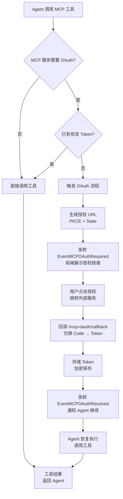

### 3.7.2 详细说明

**步骤逻辑**：

1. **工具调用**：Agent 执行 `mcp_tool.Execute()`，发现目标 MCP 服务需要 OAuth2 认证。
2. **Token 检查**：`oauth_manager` 检查是否有未过期的存储 Token。
3. **授权触发**：无有效 Token 时，`oauth_lifecycle` 生成授权 URL（含 PKCE code_verifier + state 参数），发射 `EventMCPOAuthRequired` 事件。
4. **前端展示**：前端收到事件后展示授权链接，用户点击跳转外部 OAuth 服务。
5. **回调处理**：`/mcp-oauth/callback` 接收授权码，交换 Access Token + Refresh Token。
6. **Token 存储**：Token 经 AES-256-GCM 加密后存储到 `mcp_oauth` 表。
7. **恢复执行**：发射 `EventMCPOAuthResolved`，Agent 恢复工具调用。

**涉及文件/函数**：
- `internal/mcp/oauth_manager.go`：OAuth 客户端管理
- `internal/mcp/oauth_lifecycle.go`：授权生命周期
- `internal/mcp/oauth_state.go`：State 参数管理
- `internal/mcp/oauth_tokenstore.go`：Token 加密存储
- `internal/agent/approval/gate.go`：`RequestOAuthAndWait()`

**异常处理**：
- 用户拒绝授权 → 返回错误消息，Agent 告知用户
- Token 过期 → 使用 Refresh Token 自动刷新
- 回调 State 不匹配 → 拒绝（CSRF 防护）

---

## 3.8 数据源同步流程

### 3.8.1 流程图

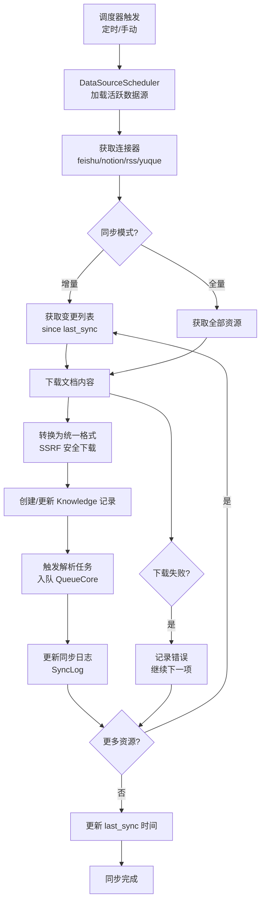

### 3.8.2 详细说明

**步骤逻辑**：

1. **调度触发**：`DataSourceScheduler` 定时运行（cron 表达式）或管理员手动触发（`ManualSync`）。
2. **连接器加载**：根据数据源类型加载对应连接器（`feishu.Connector`、`notion.Connector`、`rss.Connector`、`yuque.Connector`）。
3. **资源获取**：调用连接器 API 获取资源列表（文档/页面/文章），增量模式仅获取上次同步后变更的资源。
4. **内容下载**：通过 SSRF 安全的 HTTP 客户端下载文档内容。
5. **知识记录**：创建或更新 `Knowledge` 记录，关联数据源和外部资源 ID。
6. **解析触发**：入队解析任务，复用文档解析管道。
7. **日志记录**：写入 `sync_logs` 表记录同步结果（成功/失败/跳过）。

**涉及文件/函数**：
- `internal/datasource/scheduler.go`：调度器
- `internal/datasource/connector.go`：连接器接口
- `internal/datasource/connector/{feishu,notion,rss,yuque}/`：4 个实现
- `internal/datasource/httpclient.go`：SSRF 安全 HTTP 客户端

**异常处理**：
- 单个资源失败 → 记录错误，继续处理其他资源
- API 限流 → 退避重试
- Token 过期 → 使用 Refresh Token 刷新

---

## 3.9 任务队列与 Worker-Pool 治理流程

### 3.9.1 流程图

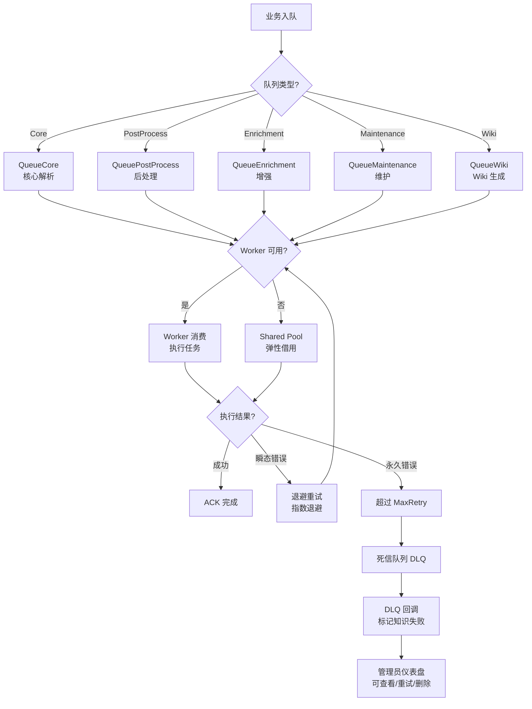

### 3.9.2 详细说明

**步骤逻辑**：

1. **任务入队**：业务代码通过 `TaskEnqueuer.Enqueue()` 将任务入队到指定队列。
2. **队列路由**：6 个独立队列，容量隔离：
   - `QueueCore`：核心解析任务
   - `QueuePostProcess`：后处理（VLM/图谱/问答生成）
   - `QueueEnrichment`：增强任务
   - `QueueMaintenance`：维护任务（复制/删除/移动）
   - `QueueShared`：弹性共享池，可借用给 Core/Enrichment
   - `QueueWiki`：Wiki 生成（硬隔离）
3. **Worker 消费**：每个队列有独立 Worker 数量（从系统设置读取），asynq Server 并发执行。
4. **执行治理**：
   - 按模型并发治理（`models/limiter/governor.go`）：每个 LLM 模型有独立并发上限
   - 瞬态错误检测（429/5xx/超时）→ 指数退避重试
   - 最大重试次数（默认 25）后进入 DLQ
5. **死信处理**：DLQ 回调 `newDeadLetterKnowledgeFailer()` 将关联知识记录标记为失败。
6. **仪表盘**：管理员可通过 `/system/admin/runtime/queues` 查看队列深度、Worker 状态、失败任务，支持手动重试/删除。

**涉及文件/函数**：
- `internal/router/task.go`：`RunAsynqServer()`、`NewCoreAsynqServer()` 等
- `internal/router/task_inspector.go`：`asynqTaskInspector` 运行时仪表盘
- `internal/router/sync_task.go`：Lite 模式 `SyncTaskExecutor`
- `internal/models/limiter/governor.go`：按模型并发治理

**异常处理**：
- Redis 不可用 → Lite 模式自动切换为内存执行器
- 任务超时 → `asynq.Task` 的 `Timeout`/`Deadline` 控制
- Worker 崩溃 → asynq 自动重新投递

---

## 3.10 文档解析 Trace 与 Langfuse 可观测性流程

### 3.10.1 流程图

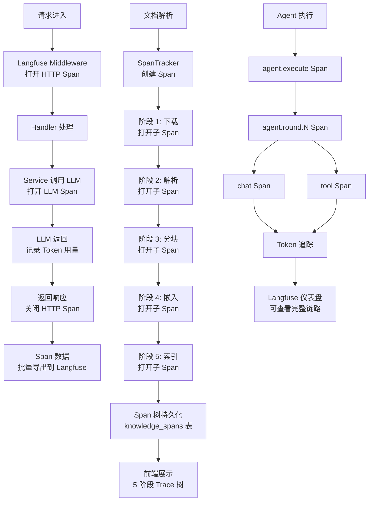

### 3.10.2 详细说明

**步骤逻辑**：

1. **HTTP 请求追踪**：`langfuse.Middleware()` 为每个 HTTP 请求打开 Span，记录方法、路径、状态码、延迟。
2. **LLM 调用追踪**：`models/chat/langfuse_wrapper.go` 为每次 LLM 调用打开 Span，记录模型、输入/输出 Token、耗时。
3. **文档解析 Trace**：`knowledge_span_tracker.go` 为每个知识文档的解析过程创建 5 阶段 Span 树（下载→解析→分块→嵌入→索引），持久化到 `knowledge_spans` 表。前端通过 `GetKnowledgeSpans` API 获取 Trace 树，展示每阶段耗时和状态。
4. **Agent 追踪**：Agent 执行时嵌套 Span（agent.execute → agent.round.N → chat/tool），完整记录推理链路。
5. **OTLP 导出**：Span 数据通过 OTLP/OTel 协议批量导出到 Langfuse，支持 W3C traceparent 传播实现跨服务追踪。

**涉及文件/函数**：
- `internal/tracing/langfuse/`：Langfuse 集成
- `internal/application/service/knowledge_span_tracker.go`：解析 Span 追踪
- `internal/models/chat/langfuse_wrapper.go`：LLM 调用追踪
- `internal/agent/engine.go`：Agent Span 管理

**异常处理**：
- Langfuse 不可用 → 追踪数据降级（不影响业务）
- Span 导出失败 → 重试 + 日志警告
- 上下文取消 → Span 仍然关闭（`context.WithoutCancel`）

---

> **下一章**：[第 4 章 模块/包结构与依赖分析](./04-module-structure.md) — 完整目录树和模块间依赖关系。

---

☕️ 制作不易，请我喝咖啡☕️关注我➕

