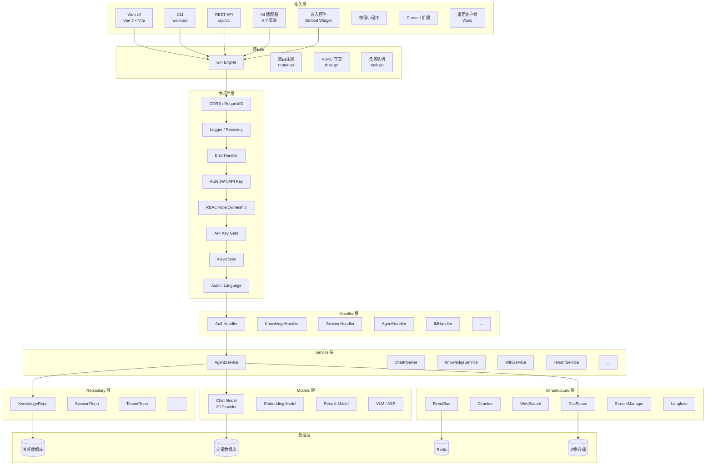
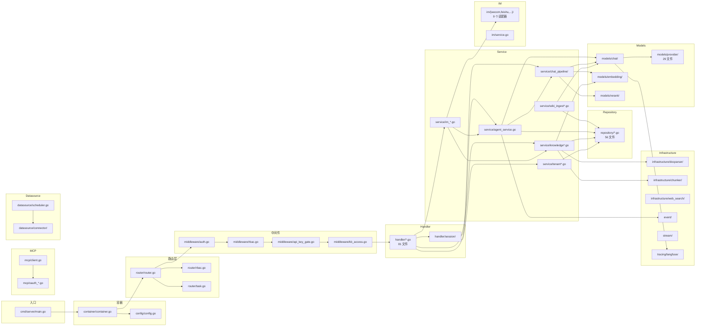

# 第 4 章 模块/包结构与依赖分析

> 本章展示 WeKnora 的完整项目目录树、分层架构、各模块职责，以及模块间的依赖关系。

---

## 4.1 完整项目目录树

```
WeKnora/
├── cmd/                          # 入口程序
│   ├── server/                   # API 服务器入口
│   │   ├── main.go               # 主入口：Gin 模式、容器构建、HTTP Server
│   │   ├── bootstrap.go          # 启动钩子：系统管理员提升、API Key 哈希回填
│   │   ├── listen.go             # 带重试的 Listener 绑定
│   │   └── signals_unix.go       # Unix 信号处理（SIGINT/SIGTERM）
│   ├── desktop/                  # Wails 桌面客户端入口
│   │   ├── main.go
│   │   ├── app.go
│   │   ├── prefs.go
│   │   ├── update.go
│   │   └── main_bindings.go
│   └── download/duckdb/          # DuckDB 下载工具
│
├── internal/                     # 服务端核心（Go）
│   ├── agent/                    # ReAct Agent 引擎（~67 文件）
│   │   ├── engine.go             # AgentEngine 核心引擎
│   │   ├── act.go                # 行动阶段：工具执行
│   │   ├── think.go              # 思考阶段：LLM 调用
│   │   ├── observe.go            # 观察阶段：响应分析
│   │   ├── finalize.go           # 终结阶段：最终答案
│   │   ├── prompts.go            # 系统提示构建
│   │   ├── prompts_wiki.go       # Wiki 提示模板
│   │   ├── const.go              # 常量
│   │   ├── image_requirement.go  # 图片输出要求注入
│   │   ├── tools/                # 工具实现（67 文件）
│   │   │   ├── registry.go       # 工具注册表
│   │   │   ├── tool.go           # 工具接口
│   │   │   ├── knowledge_search.go # 知识检索工具
│   │   │   ├── web_search.go     # 网络搜索工具
│   │   │   ├── web_fetch.go      # 网页抓取工具
│   │   │   ├── database_query.go # 数据库查询工具
│   │   │   ├── data_analysis.go  # 数据分析工具
│   │   │   ├── mcp_tool.go       # MCP 工具代理
│   │   │   ├── skill_execute.go  # 技能执行工具
│   │   │   ├── wiki_*.go         # Wiki 页面操作工具集
│   │   │   └── ...
│   │   ├── skills/               # 技能系统
│   │   │   ├── manager.go        # 技能管理器
│   │   │   ├── skill.go          # 技能数据模型
│   │   │   └── loader.go         # 技能加载器
│   │   ├── memory/               # 记忆管理
│   │   │   └── consolidator.go   # LLM 记忆整合器
│   │   ├── token/                # Token 管理
│   │   │   ├── estimator.go      # BPE Token 估算器
│   │   │   └── compress.go       # 确定性上下文压缩
│   │   ├── approval/             # 人工审批
│   │   │   └── gate.go           # 审批门控
│   │   └── observe.go            # 观察阶段
│   │
│   ├── application/              # 应用层（业务编排）
│   │   ├── service/              # 服务层（161 文件）
│   │   │   ├── agent_service.go          # Agent 服务
│   │   │   ├── agent_history.go          # Agent 历史加载
│   │   │   ├── chat_pipeline/            # 对话管道插件
│   │   │   │   ├── chat_pipeline.go      # 管道引擎
│   │   │   │   ├── search.go            # 检索插件
│   │   │   │   ├── rerank.go            # 重排插件
│   │   │   │   ├── merge.go             # 融合插件
│   │   │   │   ├── chat_completion.go   # 对话生成插件
│   │   │   │   └── ...
│   │   │   ├── knowledge_process.go      # 知识处理核心
│   │   │   ├── knowledge_create.go       # 知识创建
│   │   │   ├── knowledge_delete.go       # 知识删除
│   │   │   ├── wiki_ingest*.go           # Wiki 摄入（5 文件）
│   │   │   ├── wiki_linkify.go           # Wiki 互链
│   │   │   ├── wiki_page.go              # Wiki 页面 CRUD
│   │   │   ├── session_qa.go             # 会话问答
│   │   │   ├── session_agent_qa.go       # Agent 会话
│   │   │   ├── message.go                # 消息服务
│   │   │   ├── message_suggestion.go     # 问题建议
│   │   │   ├── knowledgebase*.go         # 知识库服务（8 文件）
│   │   │   ├── knowledge*.go             # 知识服务（15+ 文件）
│   │   │   ├── tenant*.go                # 租户服务（5 文件）
│   │   │   ├── user.go                   # 用户服务
│   │   │   ├── mcp_service.go            # MCP 服务
│   │   │   ├── embed_*.go                # 嵌入服务（3 文件）
│   │   │   ├── im_*.go                   # IM 服务
│   │   │   ├── datasource_service.go     # 数据源服务
│   │   │   ├── storagebackend.go         # 存储后端服务
│   │   │   ├── vectorstore.go            # 向量库服务
│   │   │   ├── model.go                  # 模型服务
│   │   │   ├── system_setting.go         # 系统设置
│   │   │   ├── web_search*.go            # 网络搜索服务
│   │   │   ├── audit_log.go              # 审计日志
│   │   │   ├── evaluation.go             # 评测服务
│   │   │   ├── graph.go                  # 图谱服务
│   │   │   ├── custom_agent.go           # 自定义 Agent
│   │   │   ├── skill_service.go          # 技能服务
│   │   │   ├── tag.go                    # 标签服务
│   │   │   ├── organization.go           # 组织服务
│   │   │   ├── resource.go               # 资源目录
│   │   │   ├── temporary_document.go     # 临时文档
│   │   │   ├── image_multimodal.go       # 图片多模态
│   │   │   ├── file/                    # 文件后端（10+ 文件）
│   │   │   ├── metric/                   # 评测指标（BLEU/ROUGE/MAP/MRR/NDCG）
│   │   │   └── retriever/                # 检索引擎（composite/factory/registry）
│   │   │
│   │   └── repository/           # 仓储层（56 文件）
│   │       ├── knowledge.go              # 知识仓储
│   │       ├── knowledgebase.go          # 知识库仓储
│   │       ├── chunk.go                  # 分块仓储
│   │       ├── session.go                # 会话仓储
│   │       ├── message.go                # 消息仓储
│   │       ├── tenant.go                 # 租户仓储
│   │       ├── tenant_api_key.go         # API Key 仓储
│   │       ├── tenant_member.go          # 成员仓储
│   │       ├── tenant_invitation.go      # 邀请仓储
│   │       ├── audit_log.go              # 审计仓储
│   │       ├── wiki_page.go              # Wiki 页面仓储
│   │       ├── wiki_log_entry.go         # Wiki 日志仓储
│   │       ├── task_queue.go             # 任务队列仓储
│   │       ├── embed_channel.go          # 嵌入渠道仓储
│   │       ├── mcp_oauth.go             # MCP OAuth 仓储
│   │       ├── mcp_service.go           # MCP 服务仓储
│   │       ├── mcp_tool_approval.go     # 工具审批仓储
│   │       ├── vectorstore.go           # 向量库仓储
│   │       ├── storagebackend.go        # 存储后端仓储
│   │       ├── datasource_repo.go       # 数据源仓储
│   │       ├── model.go                 # 模型仓储
│   │       ├── tag.go                   # 标签仓储
│   │       ├── user.go                  # 用户仓储
│   │       ├── organization.go          # 组织仓储
│   │       ├── system_setting.go        # 系统设置仓储
│   │       ├── web_search_provider.go   # 搜索提供商仓储
│   │       ├── temporary_document.go    # 临时文档仓储
│   │       ├── retriever/               # 检索引擎仓储（10 个引擎）
│   │       └── ...
│   │
│   ├── handler/                  # HTTP 处理器层（81 文件）
│   │   ├── auth.go                       # 认证
│   │   ├── knowledgebase.go              # 知识库
│   │   ├── knowledge.go                  # 知识文档
│   │   ├── session/                      # 会话（10+ 文件）
│   │   │   ├── handler.go               # 会话 CRUD
│   │   │   ├── qa.go                    # 问答处理
│   │   │   ├── stream.go                # SSE 流式
│   │   │   ├── agent_stream_handler.go  # Agent 流处理
│   │   │   ├── attachment_processor.go  # 附件处理
│   │   │   └── ...
│   │   ├── message.go                    # 消息
│   │   ├── chunk.go                      # 分块
│   │   ├── faq.go                        # FAQ
│   │   ├── wiki_page.go                  # Wiki 页面
│   │   ├── custom_agent.go               # 自定义 Agent
│   │   ├── mcp_service.go                # MCP 服务
│   │   ├── mcp_credentials.go            # MCP 凭证
│   │   ├── mcp_oauth.go                  # MCP OAuth
│   │   ├── embed_channel.go              # 嵌入渠道
│   │   ├── im.go                         # IM 渠道
│   │   ├── datasource.go                 # 数据源
│   │   ├── datasource_credentials.go     # 数据源凭证
│   │   ├── tenant.go                     # 租户
│   │   ├── tenant_member.go              # 成员
│   │   ├── tenant_invitation.go          # 邀请
│   │   ├── tenant_api_key.go             # API Key
│   │   ├── audit_log.go                  # 审计日志
│   │   ├── evaluation.go                 # 评测
│   │   ├── vectorstore.go                # 向量库
│   │   ├── storagebackend.go             # 存储后端
│   │   ├── model.go                      # 模型
│   │   ├── model_credentials.go          # 模型凭证
│   │   ├── web_search.go                 # 网络搜索
│   │   ├── web_search_provider.go        # 搜索提供商
│   │   ├── skill_handler.go              # 技能
│   │   ├── tag.go                        # 标签
│   │   ├── rbac_lookups.go               # RBAC 创建者查询
│   │   ├── system.go                     # 系统
│   │   ├── initialization.go             # 初始化
│   │   ├── weknoracloud.go               # WeKnora Cloud
│   │   ├── wechat_qrcode.go              # 微信二维码
│   │   ├── user_resource_favorite.go     # 用户收藏
│   │   └── ...
│   │
│   ├── router/                   # 路由层（17 文件）
│   │   ├── router.go                     # 路由注册（2391 行）
│   │   ├── rbac.go                       # RBAC 守卫（631 行）
│   │   ├── task.go                       # 任务队列（460 行）
│   │   ├── task_inspector.go             # 任务仪表盘（1097 行）
│   │   └── sync_task.go                  # Lite 任务执行器
│   │
│   ├── middleware/               # 中间件层（24 文件）
│   │   ├── auth.go                       # JWT/API Key 认证
│   │   ├── rbac.go                       # RBAC 守卫
│   │   ├── api_key_gate.go               # API Key 路由守卫
│   │   ├── kb_access.go                  # 知识库访问控制
│   │   ├── audit_provider.go             # 审计注入
│   │   ├── access.go                     # 租户访问
│   │   ├── error_handler.go              # 错误处理
│   │   ├── logger.go                     # 请求日志
│   │   ├── recovery.go                   # 恐慌恢复
│   │   ├── language.go                   # 语言检测
│   │   ├── embed_auth.go                 # 嵌入认证
│   │   ├── auth_public_ratelimit.go      # 公开限流
│   │   └── ...
│   │
│   ├── models/                   # 模型层（LLM 提供商）
│   │   ├── chat/                         # 对话模型（30 文件）
│   │   │   ├── chat.go                   # Chat 接口
│   │   │   ├── provider.go               # Provider 基类
│   │   │   ├── langfuse_wrapper.go       # Langfuse 追踪包装
│   │   │   ├── concurrency_wrapper.go    # 并发控制包装
│   │   │   ├── thinking.go               # 思维模式
│   │   │   ├── prompt_cache.go           # 提示缓存
│   │   │   ├── sse_reader.go             # SSE 读取器
│   │   │   └── ...
│   │   ├── provider/                     # 29 个 LLM Provider
│   │   │   ├── openai.go
│   │   │   ├── anthropic.go
│   │   │   ├── deepseek.go
│   │   │   ├── azure_openai.go
│   │   │   ├── gemini.go
│   │   │   ├── zhipu.go
│   │   │   ├── volcengine.go
│   │   │   ├── qwen.go (aliyun.go)
│   │   │   ├── ollama.go
│   │   │   ├── nvidia.go
│   │   │   ├── minimax.go
│   │   │   ├── hunyuan.go
│   │   │   ├── ...
│   │   │   └── weknoracloud.go
│   │   ├── embedding/                    # 嵌入模型（21 文件）
│   │   ├── rerank/                       # 重排模型（18 文件）
│   │   ├── vlm/                          # 视觉模型（10 文件）
│   │   ├── asr/                          # 语音模型（6 文件）
│   │   └── limiter/                      # 并发限制器
│   │
│   ├── im/                       # IM 适配器（87 文件）
│   │   ├── adapter.go                    # 适配器接口
│   │   ├── service.go                    # IM 服务
│   │   ├── qaqueue.go                    # QA 队列
│   │   ├── supervisor.go                # Worker 监管
│   │   ├── session.go                    # 会话管理
│   │   ├── think.go                      # 思维处理
│   │   ├── command.go                    # 斜杠命令
│   │   ├── wecom/                        # 企业微信适配器
│   │   ├── feishu/                       # 飞书适配器
│   │   ├── slack/                        # Slack 适配器
│   │   ├── telegram/                     # Telegram 适配器
│   │   ├── dingtalk/                     # 钉钉适配器
│   │   ├── wechat/                       # 微信适配器
│   │   ├── qqbot/                        # QQ Bot 适配器
│   │   ├── yunzhijia/                    # 云之家适配器
│   │   └── mattermost/                   # Mattermost 适配器
│   │
│   ├── mcp/                      # MCP 子系统（12 文件）
│   │   ├── client.go                     # MCP 客户端
│   │   ├── manager.go                    # MCP 管理器
│   │   ├── oauth_manager.go             # OAuth 管理器
│   │   ├── oauth_lifecycle.go           # OAuth 生命周期
│   │   ├── oauth_state.go               # OAuth State
│   │   ├── oauth_tokenstore.go          # Token 存储
│   │   ├── types.go                     # 类型定义
│   │   └── errors.go                    # 错误定义
│   │
│   ├── datasource/               # 数据源（39 文件）
│   │   ├── connector.go                  # 连接器接口
│   │   ├── scheduler.go                  # 调度器
│   │   ├── httpclient.go                 # SSRF 安全 HTTP 客户端
│   │   ├── connector/
│   │   │   ├── feishu/                   # 飞书连接器
│   │   │   ├── notion/                   # Notion 连接器
│   │   │   ├── rss/                      # RSS 连接器
│   │   │   └── yuque/                    # 语雀连接器
│   │   └── ...
│   │
│   ├── infrastructure/           # 基础设施（61 文件）
│   │   ├── docparser/                    # 文档解析（22 文件）
│   │   │   ├── engine_registry.go        # 引擎注册表
│   │   │   ├── grpc_parser.go            # gRPC 解析器
│   │   │   ├── http_parser.go            # HTTP 解析器
│   │   │   ├── builtin_converter.go      # 内置转换器
│   │   │   ├── mineru_converter.go       # MinerU 转换器
│   │   │   ├── paddleocr_vl_converter.go # PaddleOCR-VL 转换器
│   │   │   └── ...
│   │   ├── chunker/                      # 分块器（19 文件）
│   │   │   ├── splitter.go               # 分块器接口
│   │   │   ├── heading_splitter.go       # 标题分块
│   │   │   ├── heuristic_splitter.go     # 启发式分块
│   │   │   ├── strategy.go               # 分块策略
│   │   │   └── ...
│   │   ├── web_search/                   # 网络搜索（17 文件）
│   │   │   ├── registry.go               # 搜索注册表
│   │   │   ├── duckduckgo.go
│   │   │   ├── bing.go
│   │   │   ├── google.go
│   │   │   ├── tavily.go
│   │   │   ├── baidu.go
│   │   │   ├── searxng.go
│   │   │   ├── keenable.go
│   │   │   ├── zhipu.go
│   │   │   └── ...
│   │   └── web_fetch/                    # 网页抓取
│   │       └── fetcher.go                # SSRF 安全抓取器
│   │
│   ├── types/                    # 领域类型（105 文件）
│   │   ├── interfaces/                   # 接口定义（48 个）
│   │   │   ├── knowledge.go
│   │   │   ├── knowledgebase.go
│   │   │   ├── session.go
│   │   │   ├── message.go
│   │   │   ├── tenant.go
│   │   │   ├── user.go
│   │   │   ├── vectorstore.go
│   │   │   ├── retriever.go
│   │   │   ├── model.go
│   │   │   ├── mcp_*.go
│   │   │   ├── task_*.go
│   │   │   └── ...
│   │   ├── knowledge.go                  # 知识实体
│   │   ├── knowledgebase.go              # 知识库实体
│   │   ├── session.go                    # 会话实体
│   │   ├── message.go                    # 消息实体
│   │   ├── chunk.go                      # 分块实体
│   │   ├── tenant.go                     # 租户实体
│   │   ├── user.go                       # 用户实体
│   │   ├── model.go                      # 模型实体
│   │   ├── vectorstore.go                # 向量库实体
│   │   ├── wiki_page.go                  # Wiki 页面实体
│   │   ├── audit_log.go                  # 审计日志实体
│   │   ├── task.go                       # 任务实体
│   │   ├── principal.go                  # 主体实体
│   │   ├── config_*.go                   # 配置相关
│   │   └── ...
│   │
│   ├── container/                # DI 容器（11 文件）
│   │   ├── container.go                  # 容器构建（1674 行）
│   │   ├── engine_factory.go             # 检索引擎工厂
│   │   ├── cleanup.go                    # 资源清理
│   │   ├── audit_sink.go                 # 审计接收器适配
│   │   ├── recover_pending_wiki_tasks.go # Wiki 任务恢复
│   │   └── reset_pending_tasks.go        # 待处理任务重置
│   │
│   ├── config/                   # 配置（2 文件）
│   │   └── config.go                     # 配置加载（1104 行）
│   │
│   ├── event/                    # 事件总线（6 文件）
│   │   ├── event.go                      # 事件定义
│   │   ├── adapter.go                    # 适配器
│   │   ├── global.go                     # 全局总线
│   │   └── middleware.go                 # 事件中间件
│   │
│   ├── stream/                   # 流管理（3 文件）
│   │   ├── factory.go                    # 流工厂
│   │   ├── memory_manager.go             # 内存流
│   │   └── redis_manager.go              # Redis 流
│   │
│   ├── tracing/                  # 追踪（14 文件）
│   │   └── langfuse/                     # Langfuse 集成
│   │
│   ├── sandbox/                  # 沙箱（9 文件）
│   │   ├── manager.go                    # 沙箱管理器
│   │   ├── docker.go                     # Docker 沙箱
│   │   ├── local.go                      # 本地沙箱
│   │   └── validator.go                  # 脚本验证器
│   │
│   ├── searchutil/               # 搜索工具（8 文件）
│   ├── utils/                    # 工具函数（23 文件）
│   ├── common/                   # 公共工具（5 文件）
│   ├── errors/                   # 错误定义（3 文件）
│   ├── logger/                   # 日志（3 文件）
│   ├── ratelimit/                # 限流（2 文件）
│   ├── llmresource/              # LLM 资源引用（2 文件）
│   ├── llmreference/             # LLM 引用（3 文件）
│   ├── storageallowlist/         # 存储白名单（2 文件）
│   ├── assets/                   # 静态资源（1 文件）
│   ├── database/                 # 数据库（1 文件）
│   └── runtime/                  # 运行时（4 文件）
│
├── frontend/                     # 前端（Vue 3 + Vite）
│   ├── src/
│   │   ├── views/                        # 视图（127 文件）
│   │   │   ├── chat/                     # 对话视图
│   │   │   ├── knowledge/                # 知识库视图
│   │   │   ├── agent/                    # Agent 视图
│   │   │   ├── wiki/                     # Wiki 视图
│   │   │   ├── settings/                 # 设置视图
│   │   │   ├── organization/             # 组织视图
│   │   │   ├── platform/                 # 平台管理视图
│   │   │   ├── auth/                     # 认证视图
│   │   │   └── ...
│   │   ├── components/                   # 组件（93 文件）
│   │   ├── stores/                       # 状态管理（15 文件）
│   │   │   ├── auth.ts                   # 认证状态
│   │   │   ├── chatResources.ts          # 对话资源
│   │   │   ├── knowledge.ts              # 知识库状态
│   │   │   ├── settings.ts               # 设置状态
│   │   │   └── ...
│   │   ├── composables/                  # 组合式函数（19 文件）
│   │   │   ├── useChatStreamHandler.ts   # 流式处理
│   │   │   ├── useChatCitationPopover.ts # 引用气泡
│   │   │   ├── useEmbedBridge.ts         # 嵌入桥接
│   │   │   └── ...
│   │   ├── api/                          # API 客户端（28 文件）
│   │   ├── router/                       # 路由
│   │   ├── i18n/                         # 国际化
│   │   ├── hooks/                        # 钩子
│   │   ├── types/                        # 类型定义
│   │   ├── utils/                        # 工具函数
│   │   ├── config/                       # 配置
│   │   └── assets/                       # 静态资源
│   ├── package.json
│   └── vite.config.ts
│
├── docreader/                    # 文档解析服务（Python）
│   ├── main.py                           # 入口
│   ├── auth.py                           # 认证
│   ├── config.py                         # 配置
│   ├── parser/                           # 解析器
│   ├── splitter/                         # 分块器
│   ├── models/                           # 数据模型
│   ├── proto/                            # gRPC 协议定义
│   ├── client/                           # 客户端
│   ├── utils/                            # 工具函数
│   └── tests/                            # 测试
│
├── mcp-server/                   # MCP 服务器（Python）
│   ├── main.py                           # 入口
│   ├── run_server.py                     # 服务器运行
│   ├── weknora_mcp_server.py             # MCP 实现
│   ├── upload_paths.py                   # 上传路径
│   └── ...
│
├── cli/                          # CLI 工具（Go）
│   ├── main.go                           # 入口
│   ├── cmd/                              # 命令
│   ├── internal/                         # 内部实现
│   ├── skills/                           # 内置技能
│   └── acceptance/                       # 验收测试
│
├── client/                      # Go SDK（Go）
│   ├── client.go                         # 客户端
│   ├── auth.go                           # 认证
│   ├── knowledge.go                      # 知识
│   ├── knowledgebase.go                  # 知识库
│   ├── session.go                        # 会话
│   ├── message.go                        # 消息
│   ├── tenant.go                         # 租户
│   └── ...
│
├── miniprogram/                  # 微信小程序
├── skills/preloaded/             # 预加载技能
├── docker/                       # Docker 配置
├── helm/                         # Helm Chart
├── migrations/                   # 数据库迁移
├── docs/                         # 文档
├── scripts/                      # 脚本
├── testdata/                     # 测试数据
└── config/                       # 配置文件
```

---

## 4.2 分层架构



---

## 4.3 模块间依赖关系图



---

## 4.4 各模块职责矩阵

| 模块       | 路径                           | 文件数 | 职责                 | 输入            | 输出                |
| -------- | ---------------------------- | --- | ------------------ | ------------- | ----------------- |
| Agent 引擎 | `internal/agent/`            | ~67 | ReAct 循环、工具执行、记忆管理 | 用户查询 + 上下文    | AgentState（答案+步骤） |
| 对话管道     | `chat_pipeline/`             | ~20 | RAG 插件链编排          | QA 请求         | ChatResponse      |
| 知识处理     | `service/knowledge*.go`      | ~15 | 文档处理全流程            | 文件/URL/文本     | 索引完成的知识           |
| Wiki 服务  | `service/wiki_ingest*.go`    | ~10 | Wiki 自动生成          | 知识文档          | Wiki 页面+图谱        |
| 会话服务     | `service/session*.go`        | ~5  | 会话生命周期             | 用户请求          | 消息+状态             |
| 租户服务     | `service/tenant*.go`         | ~5  | 多租户管理              | 租户操作          | 租户状态              |
| IM 服务    | `internal/im/`               | 87  | 多渠道消息收发            | Webhook/WS 消息 | 流式回复              |
| MCP 子系统  | `internal/mcp/`              | 12  | MCP 客户端+OAuth      | MCP 调用        | 工具结果              |
| 数据源      | `internal/datasource/`       | 39  | 外部数据同步             | 连接器配置         | 同步文档              |
| 文档解析     | `infrastructure/docparser/`  | 22  | 文档→文本              | 原始文档          | 结构化文本             |
| 分块器      | `infrastructure/chunker/`    | 19  | 文本→分块              | 原始文本          | 文本分块              |
| 网络搜索     | `infrastructure/web_search/` | 17  | 搜索引擎适配             | 查询            | 搜索结果              |
|          |                              |     |                    |               |                   |
|          |                              |     |                    |               |                   |

---

## 4.5 模块间依赖方向规则

WeKnora 严格遵循**依赖方向单向原则**：

```
Handler → Service → Repository → Database
Handler → Service → Models → LLM Provider
Handler → Service → Infrastructure → External Service
```

**禁止反向依赖**：
- Repository 不依赖 Service
- Models 不依赖 Handler
- Infrastructure 不依赖 Service（通过接口反转）

**例外**（通过接口反转打破循环）：
- `container` 依赖所有层（DI 注册中心，编译时耦合）
- `types/interfaces` 被所有层依赖（接口定义，零实现耦合）
- `utils`、`logger`、`errors` 被所有层依赖（纯工具，无业务耦合）

---

> **下一章**：[第 5 章 核心代码深度走读](./05-code-walkthrough.md) — 逐文件逐函数讲解所有核心模块。

---

☕️ 制作不易，请我喝咖啡☕️关注我➕

